# API Reference

<cite>
**Referenced Files in This Document**
- [contact.js](file://src/pages/api/contact.js)
- [auth.js](file://src/pages/portal/api/auth.js)
- [logout.js](file://src/pages/portal/api/logout.js)
- [mfa.js](file://src/pages/portal/api/mfa.js)
- [reset-password.js](file://src/pages/portal/api/reset-password.js)
- [change-password.js](file://src/pages/portal/api/change-password.js)
- [job-status.js](file://src/pages/portal/api/job-status.js)
- [submit-jobcard.js](file://src/pages/portal/api/submit-jobcard.js)
- [approve-quote.js](file://src/pages/portal/api/approve-quote.js)
- [auth.js](file://src/lib/server/auth.js)
- [bindings.js](file://src/lib/server/bindings.js)
- [audit.js](file://src/lib/server/audit.js)
- [csrf.js](file://src/lib/server/csrf.js)
- [http.js](file://src/lib/server/http.js)
- [mfa.js](file://src/lib/server/mfa.js)
- [rateLimit.js](file://src/lib/server/rateLimit.js)
- [resetToken.js](file://src/lib/server/resetToken.js)
- [0011_contact_submissions.sql](file://migrations/0011_contact_submissions.sql)
- [0006_password_reset_tokens.sql](file://migrations/0006_password_reset_tokens.sql)
- [0005_job_evidence_files.sql](file://migrations/0005_job_evidence_files.sql)
- [0009_revoked_sessions.sql](file://migrations/0009_revoked_sessions.sql)
- [0008_document_access_logs.sql](file://migrations/0008_document_access_logs.sql)
- [0003_client_requests.sql](file://migrations/0003_client_requests.sql)
- [0002_portal_operations.sql](file://migrations/0002_portal_operations.sql)
- [0001_kharon_portal.sql](file://migrations/0001_kharon_portal.sql)
</cite>

## Table of Contents
1. [Introduction](#introduction)
2. [Project Structure](#project-structure)
3. [Core Components](#core-components)
4. [Architecture Overview](#architecture-overview)
5. [Detailed Component Analysis](#detailed-component-analysis)
6. [Dependency Analysis](#dependency-analysis)
7. [Performance Considerations](#performance-considerations)
8. [Troubleshooting Guide](#troubleshooting-guide)
9. [Conclusion](#conclusion)
10. [Appendices](#appendices)

## Introduction
This document provides a comprehensive API reference for the portal system, covering public and internal endpoints used by the Astro-based website and Cloudflare Workers backend. It describes authentication endpoints, user management APIs, job management endpoints, financial operations, and file management interfaces. For each endpoint, you will find HTTP methods, URL patterns, request/response schemas, authentication requirements, parameter descriptions, return values, error handling patterns, and practical integration guidance. Additional topics include rate limiting, security considerations, and API versioning strategies.

## Project Structure
The API surface is organized under:
- Public API: src/pages/api/*
- Portal API: src/pages/portal/api/*
- Shared server utilities: src/lib/server/*

Public endpoints:
- Contact form submission: src/pages/api/contact.js

Portal endpoints:
- Authentication: src/pages/portal/api/auth.js
- Logout: src/pages/portal/api/logout.js
- MFA management: src/pages/portal/api/mfa.js
- Password reset: src/pages/portal/api/reset-password.js
- Change password: src/pages/portal/api/change-password.js
- Job status update: src/pages/portal/api/job-status.js
- Submit jobcard: src/pages/portal/api/submit-jobcard.js
- Approve quote: src/pages/portal/api/approve-quote.js

Shared libraries used by endpoints:
- Authentication, sessions, hashing, MFA: src/lib/server/auth.js
- Database and storage bindings: src/lib/server/bindings.js
- Audit logging: src/lib/server/audit.js
- CSRF helpers: src/lib/server/csrf.js
- HTTP helpers (responses): src/lib/server/http.js
- MFA utilities: src/lib/server/mfa.js
- Rate limiting: src/lib/server/rateLimit.js
- Reset token helpers: src/lib/server/resetToken.js

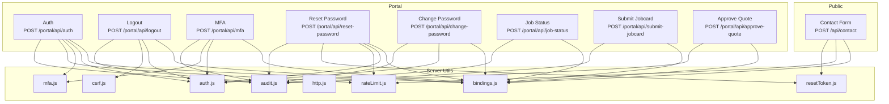

**Diagram sources**
- [contact.js:1-116](file://src/pages/api/contact.js#L1-L116)
- [auth.js:1-171](file://src/pages/portal/api/auth.js#L1-L171)
- [logout.js:1-37](file://src/pages/portal/api/logout.js#L1-L37)
- [mfa.js:1-165](file://src/pages/portal/api/mfa.js#L1-L165)
- [reset-password.js:1-94](file://src/pages/portal/api/reset-password.js#L1-L94)
- [change-password.js:1-114](file://src/pages/portal/api/change-password.js#L1-L114)
- [job-status.js:1-76](file://src/pages/portal/api/job-status.js#L1-L76)
- [submit-jobcard.js:1-307](file://src/pages/portal/api/submit-jobcard.js#L1-L307)
- [approve-quote.js:1-100](file://src/pages/portal/api/approve-quote.js#L1-L100)
- [auth.js:1-217](file://src/lib/server/auth.js#L1-L217)
- [bindings.js](file://src/lib/server/bindings.js)
- [audit.js](file://src/lib/server/audit.js)
- [csrf.js](file://src/lib/server/csrf.js)
- [http.js](file://src/lib/server/http.js)
- [mfa.js](file://src/lib/server/mfa.js)
- [rateLimit.js](file://src/lib/server/rateLimit.js)
- [resetToken.js](file://src/lib/server/resetToken.js)

**Section sources**
- [contact.js:1-116](file://src/pages/api/contact.js#L1-L116)
- [auth.js:1-171](file://src/pages/portal/api/auth.js#L1-L171)
- [logout.js:1-37](file://src/pages/portal/api/logout.js#L1-L37)
- [mfa.js:1-165](file://src/pages/portal/api/mfa.js#L1-L165)
- [reset-password.js:1-94](file://src/pages/portal/api/reset-password.js#L1-L94)
- [change-password.js:1-114](file://src/pages/portal/api/change-password.js#L1-L114)
- [job-status.js:1-76](file://src/pages/portal/api/job-status.js#L1-L76)
- [submit-jobcard.js:1-307](file://src/pages/portal/api/submit-jobcard.js#L1-L307)
- [approve-quote.js:1-100](file://src/pages/portal/api/approve-quote.js#L1-L100)
- [auth.js:1-217](file://src/lib/server/auth.js#L1-L217)
- [bindings.js](file://src/lib/server/bindings.js)
- [audit.js](file://src/lib/server/audit.js)
- [csrf.js](file://src/lib/server/csrf.js)
- [http.js](file://src/lib/server/http.js)
- [mfa.js](file://src/lib/server/mfa.js)
- [rateLimit.js](file://src/lib/server/rateLimit.js)
- [resetToken.js](file://src/lib/server/resetToken.js)

## Core Components
- Authentication and session management: JWT-like signed tokens, session cookie handling, password hashing, MFA support.
- Rate limiting: per-scope limits with retry-after guidance.
- Audit logging: structured events for auth, job, and financial actions.
- Storage and documents: Cloudflare R2-compatible storage for PDFs and evidence images.
- Database operations: SQLite via Workers bindings, batched writes for consistency.

**Section sources**
- [auth.js:1-217](file://src/lib/server/auth.js#L1-L217)
- [rateLimit.js](file://src/lib/server/rateLimit.js)
- [audit.js](file://src/lib/server/audit.js)
- [bindings.js](file://src/lib/server/bindings.js)

## Architecture Overview
The portal API follows a layered pattern:
- Presentation: HTTP handlers under src/pages/portal/api/*
- Domain: business logic (auth, MFA, job status, jobcard close, quote approval)
- Persistence: database and storage via src/lib/server/bindings.js
- Utilities: auth, audit, CSRF, HTTP helpers, rate limiting, MFA, reset token helpers

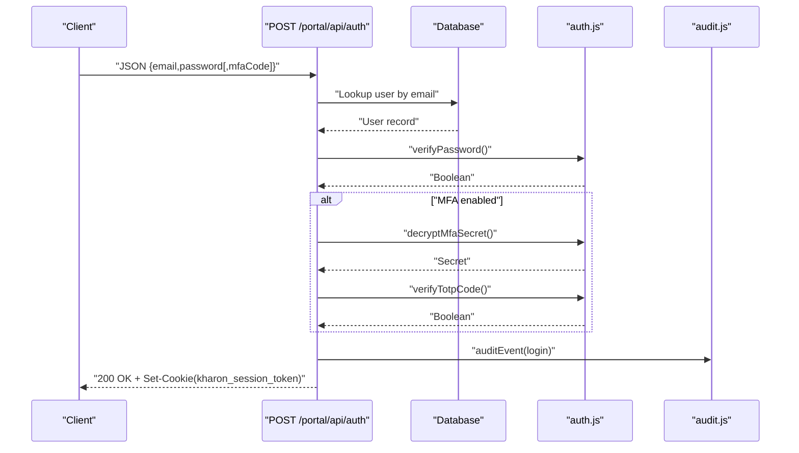

**Diagram sources**
- [auth.js:36-166](file://src/pages/portal/api/auth.js#L36-L166)
- [auth.js:75-108](file://src/lib/server/auth.js#L75-L108)
- [audit.js](file://src/lib/server/audit.js)

**Section sources**
- [auth.js:1-171](file://src/pages/portal/api/auth.js#L1-L171)
- [auth.js:1-217](file://src/lib/server/auth.js#L1-L217)
- [audit.js](file://src/lib/server/audit.js)

## Detailed Component Analysis

### Public API

#### Contact Form Submission
- Method: POST
- URL: /api/contact
- Purpose: Accepts contact inquiries from the public site with rate limiting and validation.
- Request body:
  - name: string, min 2, max 80
  - email: string, validated email
  - requestType: string, must be one of allowed values
  - message: string, min 10, max 3000
  - website: optional string (honeypot)
- Responses:
  - 200 OK: { ok: true }
  - 400 Bad Request: invalid JSON
  - 422 Unprocessable Entity: validation errors
  - 429 Too Many Requests: rate-limited with Retry-After header
  - 500 Internal Server Error: service temporarily unavailable or save failure
- Security and rate limiting:
  - IP-based hashed scope: public.contact
  - Max attempts: 5 per 15 minutes
  - Uses sha256Text for IP hashing
- Database schema: contact_submissions table

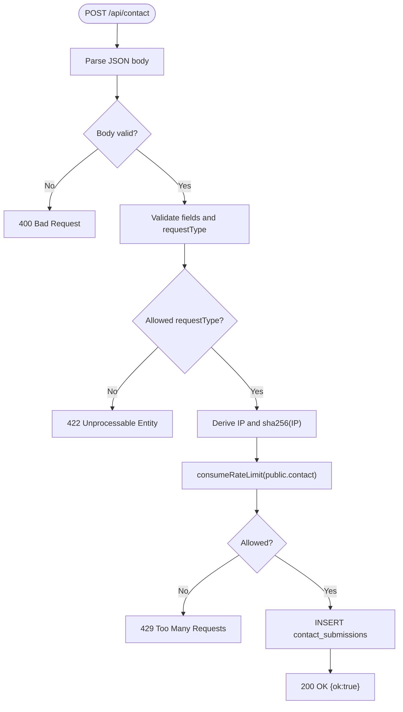

**Diagram sources**
- [contact.js:40-115](file://src/pages/api/contact.js#L40-L115)
- [rateLimit.js](file://src/lib/server/rateLimit.js)
- [resetToken.js](file://src/lib/server/resetToken.js)
- [0011_contact_submissions.sql](file://migrations/0011_contact_submissions.sql)

**Section sources**
- [contact.js:1-116](file://src/pages/api/contact.js#L1-L116)
- [0011_contact_submissions.sql](file://migrations/0011_contact_submissions.sql)

### Portal Authentication

#### Authenticate
- Method: POST
- URL: /portal/api/auth
- Purpose: Login with optional MFA.
- Request body:
  - email: string (required)
  - password: string (required)
  - mfaCode: string (optional, required if user.mfa_enabled=true)
- Responses:
  - 200 OK: { ok: true, user:{id,name,email,role,siteId,forcePasswordChange,mfaRequired,mfaEnabled}, redirectTo }
  - 400 Bad Request: missing credentials
  - 401 Unauthorized: invalid credentials or MFA failure
  - 429 Too Many Requests: rate-limited
  - 500 Internal Server Error: server error
- Authentication:
  - Session token created via createSessionToken and set as a cookie
  - Destinations depend on role and MFA/force flags
- Rate limiting:
  - Scope: portal.login, subject=email
  - Max attempts: 8 per 15 minutes
- Audit:
  - Events: auth.login, auth.mfa, auth.rate_limited

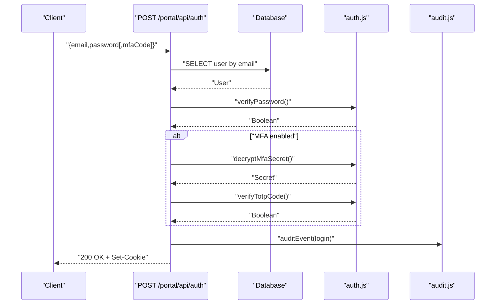

**Diagram sources**
- [auth.js:36-166](file://src/pages/portal/api/auth.js#L36-L166)
- [auth.js:48-108](file://src/lib/server/auth.js#L48-L108)
- [audit.js](file://src/lib/server/audit.js)

**Section sources**
- [auth.js:1-171](file://src/pages/portal/api/auth.js#L1-L171)
- [auth.js:1-217](file://src/lib/server/auth.js#L1-L217)
- [audit.js](file://src/lib/server/audit.js)

#### Logout
- Method: POST
- URL: /portal/api/logout
- Purpose: Invalidate session and clear cookies.
- Authentication: Requires a valid session.
- Responses:
  - 200 OK: { ok: true, redirectTo: "/portal/login" }
- Side effects:
  - Revokes session via revokeSessionToken
  - Clears kharon_session_token and CSRF cookies

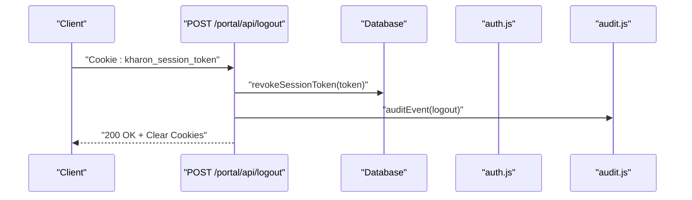

**Diagram sources**
- [logout.js:9-32](file://src/pages/portal/api/logout.js#L9-L32)
- [auth.js:125-157](file://src/lib/server/auth.js#L125-L157)
- [audit.js](file://src/lib/server/audit.js)

**Section sources**
- [logout.js:1-37](file://src/pages/portal/api/logout.js#L1-L37)
- [auth.js:110-157](file://src/lib/server/auth.js#L110-L157)
- [csrf.js](file://src/lib/server/csrf.js)

#### MFA Management
- Method: POST
- URL: /portal/api/mfa
- Purpose: Setup, enable, disable MFA for eligible roles.
- Request body:
  - action: "setup" | "enable" | "disable"
  - For enable/disable: secret, code
- Responses:
  - 200 OK: { ok: true, [secret, provisioningUri] | redirectTo }
  - 400 Bad Request: invalid action, invalid secret/code, or validation errors
  - 401 Unauthorized: not authenticated
  - 403 Forbidden: insufficient permissions or MFA already enabled/disabled
  - 500 Internal Server Error: server error
- Permissions:
  - Setup/Enable: admin or finance roles
- Audit:
  - Events: auth.mfa_setup_start, auth.mfa_enable, auth.mfa_disable

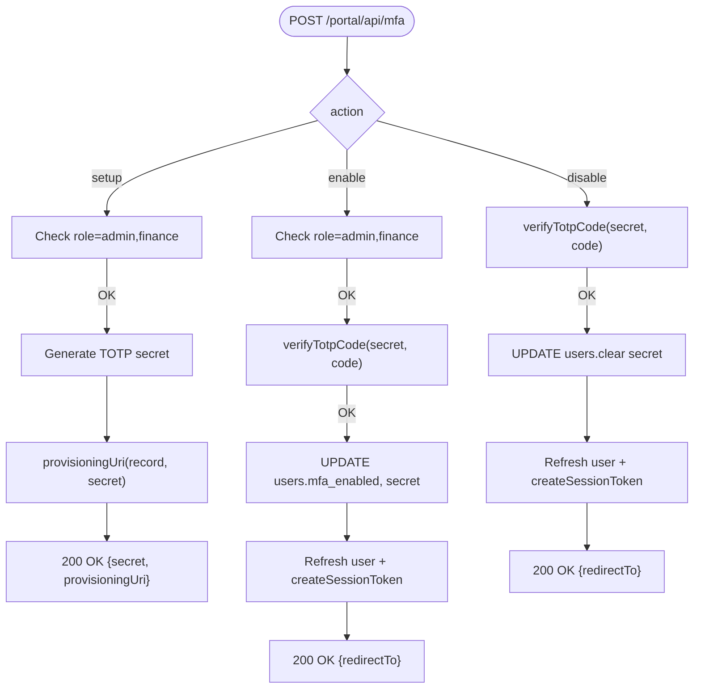

**Diagram sources**
- [mfa.js:28-165](file://src/pages/portal/api/mfa.js#L28-L165)
- [mfa.js](file://src/lib/server/mfa.js)
- [auth.js:48-108](file://src/lib/server/auth.js#L48-L108)

**Section sources**
- [mfa.js:1-165](file://src/pages/portal/api/mfa.js#L1-L165)
- [mfa.js](file://src/lib/server/mfa.js)
- [auth.js:1-217](file://src/lib/server/auth.js#L1-L217)

#### Reset Password
- Method: POST
- URL: /portal/api/reset-password
- Purpose: Consume a password reset token to set a new password.
- Request body:
  - token: string (32–120 chars)
  - password: string (min 14)
- Responses:
  - 200 OK: { ok: true, redirectTo: "/portal/login" }
  - 400 Bad Request: invalid token, expired, or password constraints
  - 429 Too Many Requests: rate-limited
  - 500 Internal Server Error: server error
- Validation:
  - Token must exist, unused, not expired, and user active
  - Password length constraints
- Audit:
  - Event: auth.password_reset

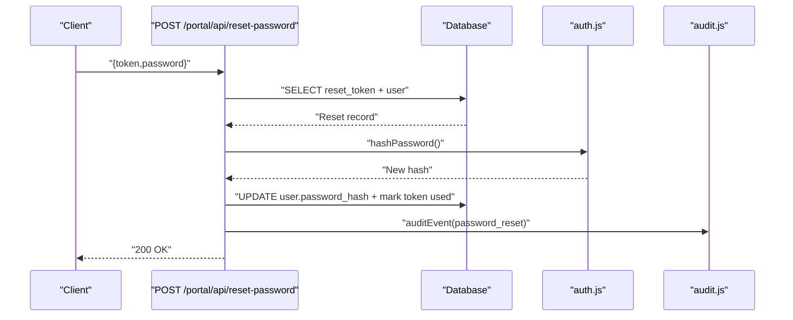

**Diagram sources**
- [reset-password.js:10-94](file://src/pages/portal/api/reset-password.js#L10-L94)
- [auth.js:159-178](file://src/lib/server/auth.js#L159-L178)
- [audit.js](file://src/lib/server/audit.js)

**Section sources**
- [reset-password.js:1-94](file://src/pages/portal/api/reset-password.js#L1-L94)
- [auth.js:159-178](file://src/lib/server/auth.js#L159-L178)
- [audit.js](file://src/lib/server/audit.js)

#### Change Password
- Method: POST
- URL: /portal/api/change-password
- Purpose: Change password for the authenticated user.
- Request body:
  - currentPassword: string
  - newPassword: string (min 14)
  - confirmPassword: string
- Responses:
  - 200 OK: { ok: true, redirectTo }
  - 400 Bad Request: validation errors
  - 401 Unauthorized: wrong current password
  - 403 Forbidden: user not available
  - 500 Internal Server Error: server error
- Audit:
  - Event: auth.password_change

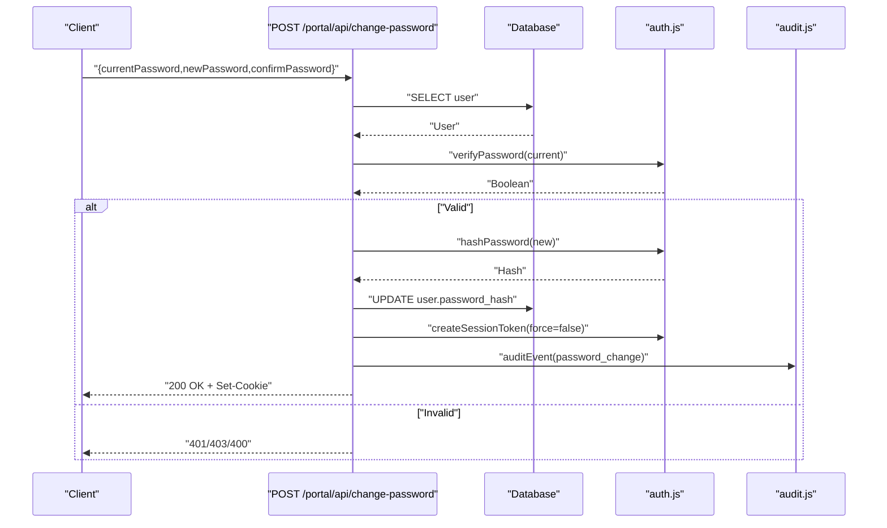

**Diagram sources**
- [change-password.js:8-114](file://src/pages/portal/api/change-password.js#L8-L114)
- [auth.js:159-178](file://src/lib/server/auth.js#L159-L178)
- [audit.js](file://src/lib/server/audit.js)

**Section sources**
- [change-password.js:1-114](file://src/pages/portal/api/change-password.js#L1-L114)
- [auth.js:159-178](file://src/lib/server/auth.js#L159-L178)
- [audit.js](file://src/lib/server/audit.js)

### Job Management

#### Update Job Status (Field)
- Method: POST
- URL: /portal/api/job-status
- Purpose: Technicians can start a scheduled job by transitioning to "In Progress".
- Request body:
  - jobId: string (alphanumeric, underscore, hyphen)
  - status: "In Progress"
- Responses:
  - 200 OK: { ok: true, jobId, status }
  - 400 Bad Request: invalid jobId, unsupported status, or validation errors
  - 401 Unauthorized: not authenticated
  - 403 Forbidden: not a technician or job not assigned to user
  - 500 Internal Server Error: server error
- Audit:
  - Event: job.status

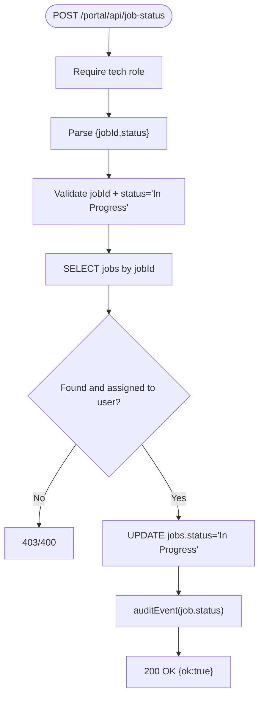

**Diagram sources**
- [job-status.js:15-76](file://src/pages/portal/api/job-status.js#L15-L76)
- [audit.js](file://src/lib/server/audit.js)

**Section sources**
- [job-status.js:1-76](file://src/pages/portal/api/job-status.js#L1-L76)
- [audit.js](file://src/lib/server/audit.js)

#### Submit Jobcard (Field Closure)
- Method: POST
- URL: /portal/api/submit-jobcard
- Purpose: Close a job, generate PDF, upload evidence photos, update systems and financial records.
- Request body:
  - jobId: string
  - systemId: string
  - techComments: string (3–3000)
  - signatureBase64: base64 image
  - signatureStrokes: array (optional)
  - faultCategory: string (default "Routine service")
  - partsUsed: string (default "None recorded")
  - followUpActions: string (default "No follow-up actions recorded")
  - customerName: string (required)
  - customerTitle: string
  - evidencePhotos: array of up to 3 images (JPEG/PNG/WebP, 128 bytes – 1.5 MB)
- Responses:
  - 200 OK: { ok: true, jobId, systemId, status:"Completed", documentationPath, evidencePaths:[...], nextDueDate, financialRecordId }
  - 400 Bad Request: validation errors
  - 401 Unauthorized: not authenticated
  - 403 Forbidden: not a technician or job not assigned
  - 500 Internal Server Error: server error
- Storage:
  - PDF stored at jobcards/job-{jobId}-completed.pdf
  - Evidence stored at job-evidence/job-{jobId}/{uuid}.jpg|png|webp
- Database updates:
  - jobs: status, tech_comments, documentation_path, completed_at
  - systems: last_service_date, last_checked_at, next_due_date
  - financial_records: insert invoice if none exists
  - job_evidence_files: insert evidence records
- Audit:
  - Event: jobcard.close

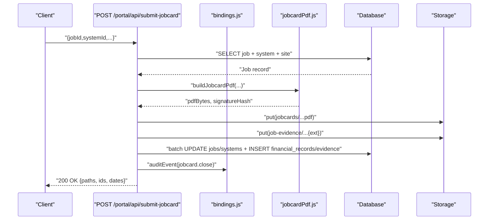

**Diagram sources**
- [submit-jobcard.js:51-307](file://src/pages/portal/api/submit-jobcard.js#L51-L307)
- [bindings.js](file://src/lib/server/bindings.js)
- [jobcardPdf.js](file://src/lib/server/jobcardPdf.js)
- [audit.js](file://src/lib/server/audit.js)

**Section sources**
- [submit-jobcard.js:1-307](file://src/pages/portal/api/submit-jobcard.js#L1-L307)
- [bindings.js](file://src/lib/server/bindings.js)
- [audit.js](file://src/lib/server/audit.js)

### Financial Operations

#### Approve Quote
- Method: POST
- URL: /portal/api/approve-quote
- Purpose: Clients can approve a quote to become an invoice.
- Request body:
  - recordId: string (financial record ID)
- Responses:
  - 200 OK: { ok: true, recordId, itemType:"Invoice", paymentStatus:"Unpaid" }
  - 400 Bad Request: invalid recordId or state
  - 401 Unauthorized: not authenticated
  - 403 Forbidden: not a client or not allowed for site
  - 500 Internal Server Error: server error
- Validation:
  - Record must exist, belong to client-accessible site, and be "Quote" with "Pending Approval"
- Audit:
  - Event: quote.approve

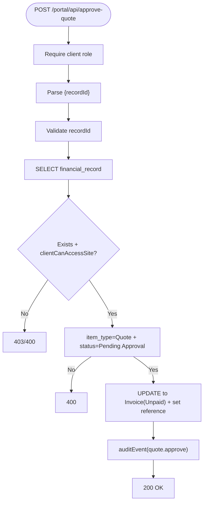

**Diagram sources**
- [approve-quote.js:14-100](file://src/pages/portal/api/approve-quote.js#L14-L100)
- [clientAccess.js](file://src/lib/server/clientAccess.js)
- [audit.js](file://src/lib/server/audit.js)

**Section sources**
- [approve-quote.js:1-100](file://src/pages/portal/api/approve-quote.js#L1-L100)
- [audit.js](file://src/lib/server/audit.js)

### File Management Interfaces
- Upload and retrieval:
  - Job documentation PDFs and evidence photos are stored in Cloudflare R2-compatible storage.
  - Storage keys follow predictable patterns:
    - jobcards/job-{jobId}-completed.pdf
    - job-evidence/job-{jobId}/{uuid}.{jpg|png|webp}
- Metadata:
  - Custom metadata includes job/system/technician IDs, completion timestamps, and signature hashes.
- Access:
  - Retrieval URLs are generated by the storage layer; clients should use signed or controlled access as appropriate.

**Section sources**
- [submit-jobcard.js:180-209](file://src/pages/portal/api/submit-jobcard.js#L180-L209)
- [0005_job_evidence_files.sql](file://migrations/0005_job_evidence_files.sql)
- [0008_document_access_logs.sql](file://migrations/0008_document_access_logs.sql)

## Dependency Analysis
- Endpoint-to-library coupling:
  - All portal endpoints depend on src/lib/server/bindings.js for database and storage access.
  - Authentication endpoints depend on src/lib/server/auth.js for tokens, hashing, and session cookies.
  - Audit endpoints depend on src/lib/server/audit.js for event logging.
  - Rate limiting endpoints depend on src/lib/server/rateLimit.js.
  - MFA endpoints depend on src/lib/server/mfa.js.
  - Logout depends on src/lib/server/csrf.js for CSRF cookie expiry.
  - Reset-password depends on src/lib/server/resetToken.js for token hashing.
- Cohesion and separation:
  - Each endpoint encapsulates a single responsibility and delegates cross-cutting concerns to shared libraries.
- External dependencies:
  - Cloudflare Workers runtime, KV/R2, and SQLite via D1 bindings.

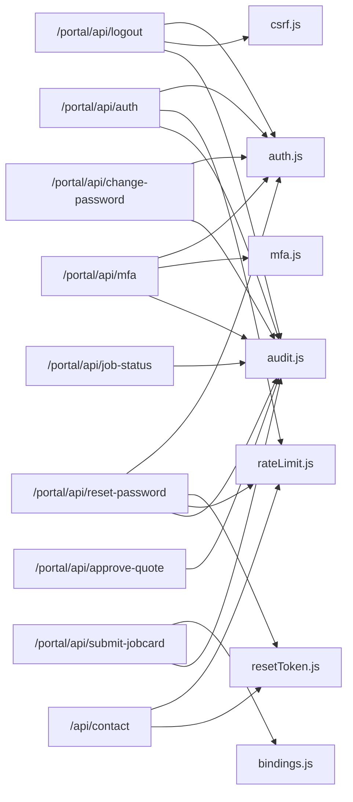

**Diagram sources**
- [auth.js:1-171](file://src/pages/portal/api/auth.js#L1-L171)
- [logout.js:1-37](file://src/pages/portal/api/logout.js#L1-L37)
- [mfa.js:1-165](file://src/pages/portal/api/mfa.js#L1-L165)
- [reset-password.js:1-94](file://src/pages/portal/api/reset-password.js#L1-L94)
- [change-password.js:1-114](file://src/pages/portal/api/change-password.js#L1-L114)
- [job-status.js:1-76](file://src/pages/portal/api/job-status.js#L1-L76)
- [submit-jobcard.js:1-307](file://src/pages/portal/api/submit-jobcard.js#L1-L307)
- [approve-quote.js:1-100](file://src/pages/portal/api/approve-quote.js#L1-L100)
- [contact.js:1-116](file://src/pages/api/contact.js#L1-L116)
- [auth.js:1-217](file://src/lib/server/auth.js#L1-L217)
- [bindings.js](file://src/lib/server/bindings.js)
- [audit.js](file://src/lib/server/audit.js)
- [csrf.js](file://src/lib/server/csrf.js)
- [mfa.js](file://src/lib/server/mfa.js)
- [rateLimit.js](file://src/lib/server/rateLimit.js)
- [resetToken.js](file://src/lib/server/resetToken.js)

**Section sources**
- [auth.js:1-171](file://src/pages/portal/api/auth.js#L1-L171)
- [logout.js:1-37](file://src/pages/portal/api/logout.js#L1-L37)
- [mfa.js:1-165](file://src/pages/portal/api/mfa.js#L1-L165)
- [reset-password.js:1-94](file://src/pages/portal/api/reset-password.js#L1-L94)
- [change-password.js:1-114](file://src/pages/portal/api/change-password.js#L1-L114)
- [job-status.js:1-76](file://src/pages/portal/api/job-status.js#L1-L76)
- [submit-jobcard.js:1-307](file://src/pages/portal/api/submit-jobcard.js#L1-L307)
- [approve-quote.js:1-100](file://src/pages/portal/api/approve-quote.js#L1-L100)
- [contact.js:1-116](file://src/pages/api/contact.js#L1-L116)
- [auth.js:1-217](file://src/lib/server/auth.js#L1-L217)
- [bindings.js](file://src/lib/server/bindings.js)
- [audit.js](file://src/lib/server/audit.js)
- [csrf.js](file://src/lib/server/csrf.js)
- [mfa.js](file://src/lib/server/mfa.js)
- [rateLimit.js](file://src/lib/server/rateLimit.js)
- [resetToken.js](file://src/lib/server/resetToken.js)

## Performance Considerations
- Batched writes: Jobcard submission uses db.batch to maintain atomicity across multiple statements.
- Content sizing: Evidence photos are validated for minimum and maximum sizes to prevent abuse and reduce storage overhead.
- Hashing: Passwords use PBKDF2 with a high iteration count; tokens and fingerprints use SHA-256 for integrity checks.
- Storage metadata: Custom metadata avoids redundant lookups and improves downstream processing.

[No sources needed since this section provides general guidance]

## Troubleshooting Guide
- Authentication failures:
  - 401 Unauthorized indicates invalid credentials or MFA failure; check email/password and MFA code.
  - 429 Too Many Requests suggests rate limiting; wait for retry-after seconds.
- Job operations:
  - 403 Forbidden for job status or jobcard often means the job is not assigned to the authenticated technician.
  - 400 Bad Request for jobcard indicates missing required fields or invalid data (e.g., signature, customer name).
- Financial operations:
  - 403 Forbidden for quote approval indicates the client does not have access to the associated site or record is not in Pending Approval state.
- Storage:
  - If PDF or evidence uploads fail, verify storage permissions and content types; ensure images are JPEG/PNG/WebP and within size bounds.
- Audit logs:
  - Review audit events for detailed metadata around failures and blocked actions.

**Section sources**
- [auth.js:48-102](file://src/pages/portal/api/auth.js#L48-L102)
- [job-status.js:19-52](file://src/pages/portal/api/job-status.js#L19-L52)
- [submit-jobcard.js:70-80](file://src/pages/portal/api/submit-jobcard.js#L70-L80)
- [approve-quote.js:37-63](file://src/pages/portal/api/approve-quote.js#L37-L63)
- [audit.js](file://src/lib/server/audit.js)

## Conclusion
The portal API provides a cohesive set of endpoints for authentication, user management, job operations, financial workflows, and file management. It emphasizes security through rate limiting, session tokens, MFA, and audit logging, while maintaining performance via batched writes and efficient hashing. The documented patterns and schemas enable reliable client integrations and straightforward troubleshooting.

[No sources needed since this section summarizes without analyzing specific files]

## Appendices

### API Versioning Strategy
- No explicit version path segments are used in current endpoints (e.g., /portal/api/*).
- Recommendations:
  - Introduce a version prefix (/portal/api/v1/*) to facilitate future breaking changes.
  - Maintain backward compatibility windows with deprecation notices.
  - Use request headers (e.g., Accept: application/vnd.kharon.v1+json) for content negotiation.

[No sources needed since this section provides general guidance]

### Rate Limiting Reference
- Scopes and limits:
  - public.contact: 5 per 15 minutes (subject: sha256(ip))
  - portal.login: 8 per 15 minutes (subject: email)
  - portal.password_reset: 8 per 15 minutes (subject: truncated sha256(token))
- Response headers:
  - 429 responses include Retry-After and cache-control: no-store.

**Section sources**
- [contact.js:76-94](file://src/pages/api/contact.js#L76-L94)
- [auth.js:48-65](file://src/pages/portal/api/auth.js#L48-L65)
- [reset-password.js:18-24](file://src/pages/portal/api/reset-password.js#L18-L24)
- [rateLimit.js](file://src/lib/server/rateLimit.js)

### Database Schemas Used by Endpoints
- contact_submissions: stores public contact form submissions
- password_reset_tokens: stores reset tokens with hashes and expiry
- job_evidence_files: stores evidence photo metadata and paths
- revoked_sessions: stores session token fingerprints for revocation
- document_access_logs: tracks document access events
- Additional portal schemas (users, jobs, systems, financial_records) are referenced by endpoints.

**Section sources**
- [0011_contact_submissions.sql](file://migrations/0011_contact_submissions.sql)
- [0006_password_reset_tokens.sql](file://migrations/0006_password_reset_tokens.sql)
- [0005_job_evidence_files.sql](file://migrations/0005_job_evidence_files.sql)
- [0009_revoked_sessions.sql](file://migrations/0009_revoked_sessions.sql)
- [0008_document_access_logs.sql](file://migrations/0008_document_access_logs.sql)
- [0001_kharon_portal.sql](file://migrations/0001_kharon_portal.sql)
- [0002_portal_operations.sql](file://migrations/0002_portal_operations.sql)
- [0003_client_requests.sql](file://migrations/0003_client_requests.sql)