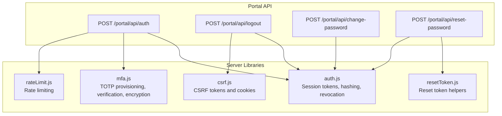
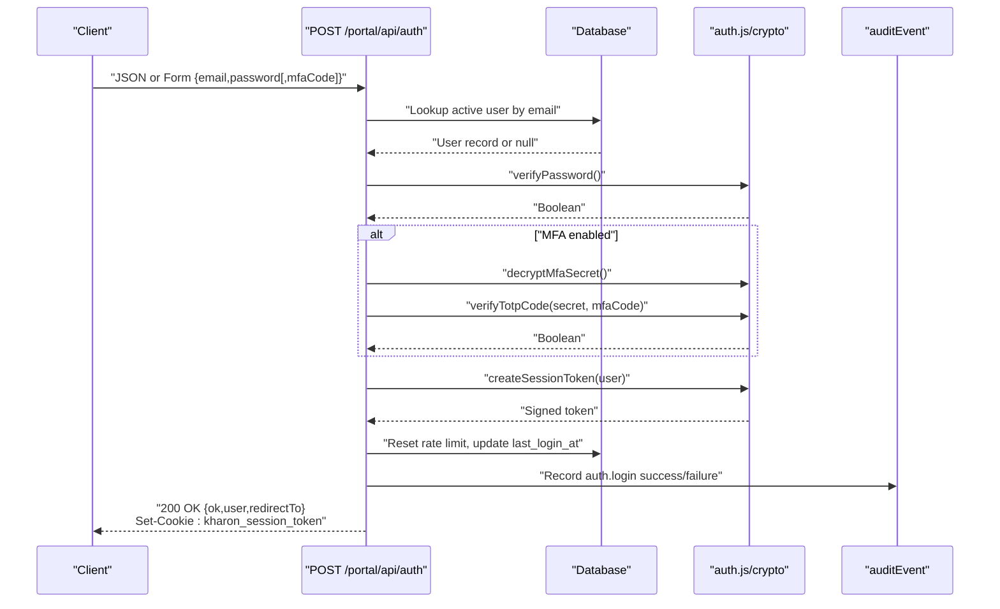
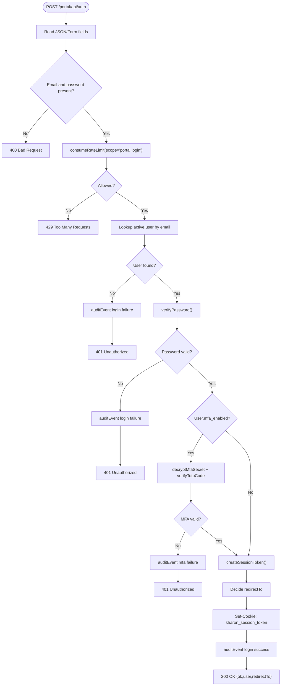
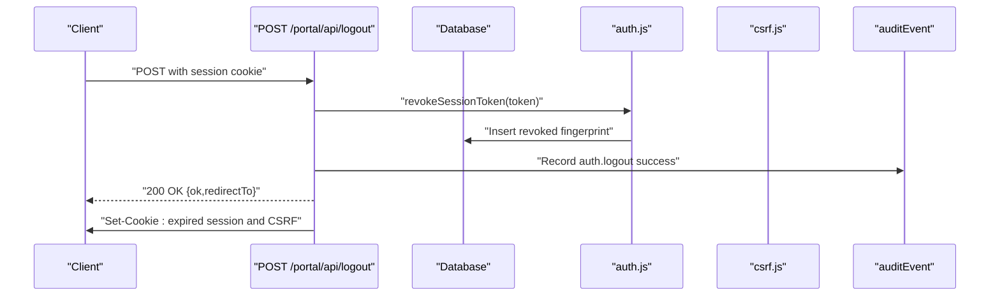
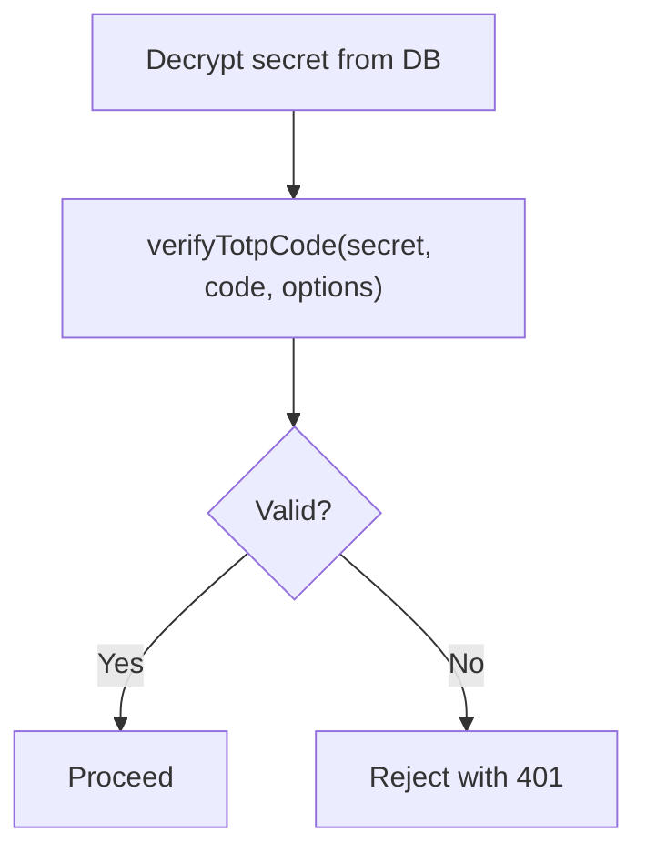
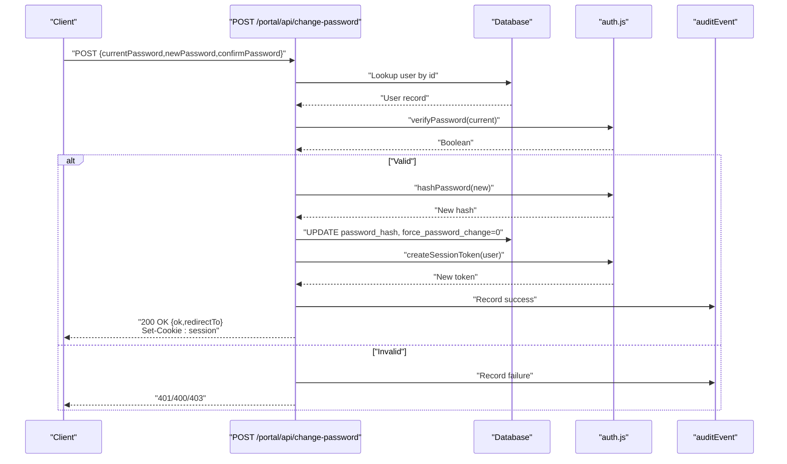
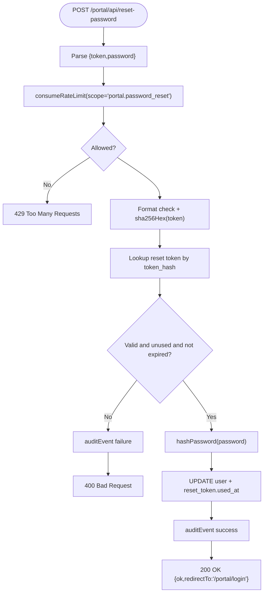
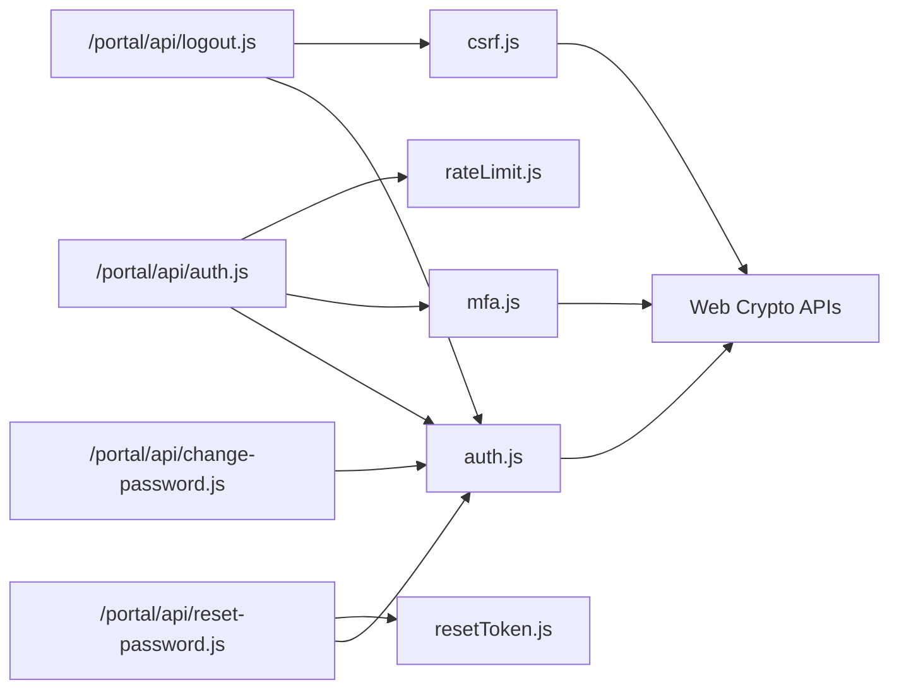

# Authentication Endpoints

<cite>
**Referenced Files in This Document**
- [auth.js](file://src/lib/server/auth.js)
- [auth.js](file://src/pages/portal/api/auth.js)
- [logout.js](file://src/pages/portal/api/logout.js)
- [mfa.js](file://src/lib/server/mfa.js)
- [change-password.js](file://src/pages/portal/api/change-password.js)
- [reset-password.js](file://src/pages/portal/api/reset-password.js)
- [csrf.js](file://src/lib/server/csrf.js)
- [rateLimit.js](file://src/lib/server/rateLimit.js)
- [resetToken.js](file://src/lib/server/resetToken.js)
</cite>

## Table of Contents
1. [Introduction](#introduction)
2. [Project Structure](#project-structure)
3. [Core Components](#core-components)
4. [Architecture Overview](#architecture-overview)
5. [Detailed Component Analysis](#detailed-component-analysis)
6. [Dependency Analysis](#dependency-analysis)
7. [Performance Considerations](#performance-considerations)
8. [Troubleshooting Guide](#troubleshooting-guide)
9. [Conclusion](#conclusion)
10. [Appendices](#appendices)

## Introduction
This document provides comprehensive API documentation for the authentication endpoints powering the portal. It covers login, logout, MFA verification, password change, and password reset. For each endpoint, we specify HTTP methods, URL patterns, request/response schemas, authentication requirements, and error responses. We also explain JWT-like session token generation, session management, expiration handling, and security controls such as CSRF protection and rate limiting.

## Project Structure
Authentication endpoints are implemented as server-side routes under the portal API namespace. Supporting utilities reside in dedicated server libraries for session handling, MFA, CSRF, rate limiting, and password reset tokens.

**Diagram sources**
- [auth.js:1-171](file://src/pages/portal/api/auth.js#L1-L171)
- [logout.js:1-37](file://src/pages/portal/api/logout.js#L1-L37)
- [change-password.js:1-114](file://src/pages/portal/api/change-password.js#L1-L114)
- [reset-password.js:1-94](file://src/pages/portal/api/reset-password.js#L1-L94)
- [auth.js:1-217](file://src/lib/server/auth.js#L1-L217)
- [mfa.js:1-132](file://src/lib/server/mfa.js#L1-L132)
- [csrf.js:1-107](file://src/lib/server/csrf.js#L1-L107)
- [rateLimit.js:1-56](file://src/lib/server/rateLimit.js#L1-L56)
- [resetToken.js:1-23](file://src/lib/server/resetToken.js#L1-L23)

**Section sources**
- [auth.js:1-171](file://src/pages/portal/api/auth.js#L1-L171)
- [logout.js:1-37](file://src/pages/portal/api/logout.js#L1-L37)
- [change-password.js:1-114](file://src/pages/portal/api/change-password.js#L1-L114)
- [reset-password.js:1-94](file://src/pages/portal/api/reset-password.js#L1-L94)
- [auth.js:1-217](file://src/lib/server/auth.js#L1-L217)
- [mfa.js:1-132](file://src/lib/server/mfa.js#L1-L132)
- [csrf.js:1-107](file://src/lib/server/csrf.js#L1-L107)
- [rateLimit.js:1-56](file://src/lib/server/rateLimit.js#L1-L56)
- [resetToken.js:1-23](file://src/lib/server/resetToken.js#L1-L23)

## Core Components
- Session token creation and verification: generates a signed, time-bound token and validates it against environment secrets and expiry.
- Password hashing and verification: PBKDF2-based scheme with constant-time comparison.
- Revocation and fingerprinting: SHA-256 fingerprint of tokens stored for revocation.
- Cookie management: session cookie and expired cookie helpers.
- MFA support: TOTP secret provisioning URI, AES-GCM encryption/decryption, and time-based code verification.
- CSRF protection: HMAC-signed CSRF tokens and cookies.
- Rate limiting: per-window counters keyed by IP and subject.
- Reset tokens: random token generation and SHA-256 hashing for secure lookup.

**Section sources**
- [auth.js:48-157](file://src/lib/server/auth.js#L48-L157)
- [mfa.js:36-131](file://src/lib/server/mfa.js#L36-L131)
- [csrf.js:36-106](file://src/lib/server/csrf.js#L36-L106)
- [rateLimit.js:3-46](file://src/lib/server/rateLimit.js#L3-L46)
- [resetToken.js:9-22](file://src/lib/server/resetToken.js#L9-L22)

## Architecture Overview
The authentication flow integrates route handlers, database queries, cryptographic utilities, and auditing. Requests are rate-limited, validated, and audited. Successful authentication sets a session cookie and redirects to a destination determined by user state and role.

**Diagram sources**
- [auth.js:36-166](file://src/pages/portal/api/auth.js#L36-L166)
- [auth.js:48-108](file://src/lib/server/auth.js#L48-L108)
- [mfa.js:43-52](file://src/lib/server/mfa.js#L43-L52)
- [mfa.js:108-119](file://src/lib/server/mfa.js#L108-L119)

## Detailed Component Analysis

### Login Endpoint
- Method and URL: POST /portal/api/auth
- Content types accepted:
  - application/json
  - application/x-www-form-urlencoded
  - multipart/form-data
- Request body fields:
  - email: string, required
  - password: string, required
  - mfaCode: string, optional but required when user.mfa_enabled is true
- Response body:
  - ok: boolean
  - user: object with id, name, email, role, siteId, forcePasswordChange, mfaRequired, mfaEnabled
  - redirectTo: string path
- Authentication requirements:
  - None for login itself; successful login sets a session cookie.
- Security controls:
  - Rate limiting: scope portal.login, max 8 attempts per 15 minutes per email.
  - Auditing: events recorded for success and failure.
  - MFA: enforced when user.mfa_enabled is true; rejects missing or invalid codes.
- Error responses:
  - 400 Bad Request: missing credentials, mismatched passwords, invalid JSON.
  - 401 Unauthorized: invalid credentials or MFA failure.
  - 429 Too Many Requests: rate limit exceeded.
  - 500 Internal Server Error: unexpected errors.

**Diagram sources**
- [auth.js:36-166](file://src/pages/portal/api/auth.js#L36-L166)
- [auth.js:48-108](file://src/lib/server/auth.js#L48-L108)
- [mfa.js:43-52](file://src/lib/server/mfa.js#L43-L52)
- [mfa.js:108-119](file://src/lib/server/mfa.js#L108-L119)
- [rateLimit.js:3-46](file://src/lib/server/rateLimit.js#L3-L46)

**Section sources**
- [auth.js:17-34](file://src/pages/portal/api/auth.js#L17-L34)
- [auth.js:36-166](file://src/pages/portal/api/auth.js#L36-L166)
- [rateLimit.js:3-46](file://src/lib/server/rateLimit.js#L3-L46)
- [auth.js:48-108](file://src/lib/server/auth.js#L48-L108)
- [mfa.js:43-52](file://src/lib/server/mfa.js#L43-L52)
- [mfa.js:108-119](file://src/lib/server/mfa.js#L108-L119)

### Logout Endpoint
- Method and URL: POST /portal/api/logout
- Request: requires a valid session cookie; CSRF token may be required depending on client usage.
- Response body: { ok: true, redirectTo: "/portal/login" }
- Behavior:
  - Revokes the current session token via fingerprint storage.
  - Clears session and CSRF cookies.
  - Records audit event on success.
- Error responses:
  - 200 OK on success; no explicit error responses are returned by this endpoint.

**Diagram sources**
- [logout.js:9-32](file://src/pages/portal/api/logout.js#L9-L32)
- [auth.js:138-157](file://src/lib/server/auth.js#L138-L157)
- [csrf.js:103-106](file://src/lib/server/csrf.js#L103-L106)

**Section sources**
- [logout.js:9-32](file://src/pages/portal/api/logout.js#L9-L32)
- [auth.js:138-157](file://src/lib/server/auth.js#L138-L157)
- [csrf.js:103-106](file://src/lib/server/csrf.js#L103-L106)

### MFA Verification and Provisioning
- Verification:
  - Endpoint: POST /portal/api/auth (with mfaCode when required)
  - Uses decryptMfaSecret and verifyTotpCode to validate a 6-digit code within a small time window.
- Provisioning:
  - The MFA secret is AES-GCM encrypted at rest and stored as encrypted text.
  - A provisioning URI is generated for QR code scanning clients.

**Diagram sources**
- [mfa.js:43-52](file://src/lib/server/mfa.js#L43-L52)
- [mfa.js:108-119](file://src/lib/server/mfa.js#L108-L119)

**Section sources**
- [mfa.js:36-52](file://src/lib/server/mfa.js#L36-L52)
- [mfa.js:108-119](file://src/lib/server/mfa.js#L108-L119)

### Password Change Endpoint
- Method and URL: POST /portal/api/change-password
- Authentication requirement: Requires a valid session (locals.user).
- Request body fields:
  - currentPassword: string, required
  - newPassword: string, required, min 14 chars, must differ from current
  - confirmPassword: string, required, must match newPassword
- Response body:
  - ok: boolean
  - redirectTo: string path (may redirect to MFA setup if required and not enabled)
- Behavior:
  - Verifies current password.
  - Hashes new password and updates user record.
  - Issues a refreshed session token.
  - Records audit event.
- Error responses:
  - 400 Bad Request: missing fields, mismatched passwords, invalid JSON, weak/new password rules.
  - 401 Unauthorized: incorrect current password.
  - 403 Forbidden: user not available.
  - 500 Internal Server Error: unexpected errors.

**Diagram sources**
- [change-password.js:8-114](file://src/pages/portal/api/change-password.js#L8-L114)
- [auth.js:159-203](file://src/lib/server/auth.js#L159-L203)
- [auth.js:48-73](file://src/lib/server/auth.js#L48-L73)

**Section sources**
- [change-password.js:8-114](file://src/pages/portal/api/change-password.js#L8-L114)
- [auth.js:159-203](file://src/lib/server/auth.js#L159-L203)
- [auth.js:48-73](file://src/lib/server/auth.js#L48-L73)

### Password Reset Endpoint
- Method and URL: POST /portal/api/reset-password
- Request body fields:
  - token: string, required, base64-url encoded random token
  - password: string, required, 14–200 characters
- Behavior:
  - Validates token format and checks against hashed token in DB.
  - Enforces expiry and usage constraints.
  - Updates user password, marks force_password_change, records usage.
  - Records audit event.
- Error responses:
  - 400 Bad Request: invalid/expired token, invalid password, invalid JSON.
  - 429 Too Many Requests: rate limit exceeded.
  - 500 Internal Server Error: unexpected errors.

**Diagram sources**
- [reset-password.js:10-94](file://src/pages/portal/api/reset-password.js#L10-L94)
- [resetToken.js:9-22](file://src/lib/server/resetToken.js#L9-L22)
- [auth.js:159-178](file://src/lib/server/auth.js#L159-L178)
- [rateLimit.js:3-46](file://src/lib/server/rateLimit.js#L3-L46)

**Section sources**
- [reset-password.js:10-94](file://src/pages/portal/api/reset-password.js#L10-L94)
- [resetToken.js:9-22](file://src/lib/server/resetToken.js#L9-L22)
- [auth.js:159-178](file://src/lib/server/auth.js#L159-L178)
- [rateLimit.js:3-46](file://src/lib/server/rateLimit.js#L3-L46)

## Dependency Analysis
Authentication endpoints depend on shared libraries for cryptography, session management, MFA, CSRF, and rate limiting. The diagram below shows key dependencies among modules.

**Diagram sources**
- [auth.js:1-8](file://src/pages/portal/api/auth.js#L1-L8)
- [logout.js:1-5](file://src/pages/portal/api/logout.js#L1-L5)
- [change-password.js:1-4](file://src/pages/portal/api/change-password.js#L1-L4)
- [reset-password.js:1-6](file://src/pages/portal/api/reset-password.js#L1-L6)
- [auth.js:1-7](file://src/lib/server/auth.js#L1-L7)
- [mfa.js:1-1](file://src/lib/server/mfa.js#L1-L1)
- [csrf.js:1-1](file://src/lib/server/csrf.js#L1-L1)
- [rateLimit.js:1-1](file://src/lib/server/rateLimit.js#L1-L1)
- [resetToken.js:1-2](file://src/lib/server/resetToken.js#L1-L2)

**Section sources**
- [auth.js:1-8](file://src/pages/portal/api/auth.js#L1-L8)
- [logout.js:1-5](file://src/pages/portal/api/logout.js#L1-L5)
- [change-password.js:1-4](file://src/pages/portal/api/change-password.js#L1-L4)
- [reset-password.js:1-6](file://src/pages/portal/api/reset-password.js#L1-L6)
- [auth.js:1-7](file://src/lib/server/auth.js#L1-L7)
- [mfa.js:1-1](file://src/lib/server/mfa.js#L1-L1)
- [csrf.js:1-1](file://src/lib/server/csrf.js#L1-L1)
- [rateLimit.js:1-1](file://src/lib/server/rateLimit.js#L1-L1)
- [resetToken.js:1-2](file://src/lib/server/resetToken.js#L1-L2)

## Performance Considerations
- Token signing and verification rely on Web Crypto APIs; keep payloads minimal to reduce overhead.
- PBKDF2 iterations are set to a high value for password hashing; avoid repeated hashing in tight loops.
- Rate-limiting windows are per-IP and per-subject; choose appropriate maxAttempts and windowSeconds to balance security and usability.
- Database queries use prepared statements and indexing-friendly keys; ensure proper indexing on user email, reset token hashes, and rate limit keys.

## Troubleshooting Guide
Common issues and resolutions:
- Invalid credentials:
  - Symptom: 401 Unauthorized on login.
  - Cause: Wrong email/password or MFA code.
  - Resolution: Confirm credentials and ensure MFA code is provided when required.
- Rate limit exceeded:
  - Symptom: 429 Too Many Requests during login or reset.
  - Cause: Exceeded max attempts in the configured window.
  - Resolution: Wait until retryAfter seconds elapse or reduce login attempts.
- Expired or invalid reset token:
  - Symptom: 400 Bad Request on reset-password.
  - Cause: Token malformed, expired, or already used.
  - Resolution: Regenerate a new reset link and ensure the token is fresh.
- MFA failures:
  - Symptom: 401 Unauthorized with MFA error.
  - Cause: Missing or invalid 6-digit code.
  - Resolution: Re-generate code from authenticator app or re-provision MFA.
- Session not recognized:
  - Symptom: Subsequent requests fail after logout.
  - Cause: Session revoked or cookie cleared.
  - Resolution: Log in again; ensure cookies are accepted and not blocked.

**Section sources**
- [auth.js:78-118](file://src/pages/portal/api/auth.js#L78-L118)
- [rateLimit.js:40-45](file://src/lib/server/rateLimit.js#L40-L45)
- [reset-password.js:47-57](file://src/pages/portal/api/reset-password.js#L47-L57)
- [mfa.js:108-119](file://src/lib/server/mfa.js#L108-L119)
- [logout.js:13-31](file://src/pages/portal/api/logout.js#L13-L31)

## Conclusion
The authentication system provides robust, standards-aligned security primitives: signed session tokens, PBKDF2-based password hashing, TOTP-based MFA, CSRF protection, and rate limiting. The documented endpoints expose clear request/response contracts and error semantics, enabling secure client integrations with predictable behavior.

## Appendices

### Endpoint Reference Summary
- POST /portal/api/auth
  - Accepts: JSON or form fields {email,password[,mfaCode]}
  - Returns: {ok,user,redirectTo}
  - Sets: kharon_session_token cookie
  - Errors: 400, 401, 429, 500
- POST /portal/api/logout
  - Accepts: session cookie
  - Returns: {ok,redirectTo:"/portal/login"}
  - Side effects: revokes session, clears cookies
  - Errors: none explicitly returned
- POST /portal/api/change-password
  - Requires: session
  - Accepts: {currentPassword,newPassword,confirmPassword}
  - Returns: {ok,redirectTo}
  - Errors: 400, 401, 403, 500
- POST /portal/api/reset-password
  - Accepts: {token,password}
  - Returns: {ok,redirectTo:"/portal/login"}
  - Errors: 400, 429, 500

### Session and Token Details
- Session token:
  - Issued by createSessionToken, includes sub, name, email, role, siteId, flags, iat, exp.
  - Expiration: 12 hours from issuance.
  - Storage: HTTP-only, SameSite=Strict cookie named kharon_session_token.
- Revocation:
  - Fingerprint of token inserted into revoked_sessions with expiry aligned to token exp.
- CSRF:
  - Separate HMAC-signed CSRF token and cookie (kharon_csrf_token) for sensitive actions.

**Section sources**
- [auth.js:48-118](file://src/lib/server/auth.js#L48-L118)
- [auth.js:125-157](file://src/lib/server/auth.js#L125-L157)
- [csrf.js:36-106](file://src/lib/server/csrf.js#L36-L106)