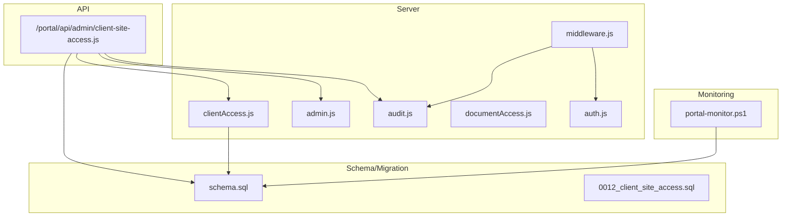
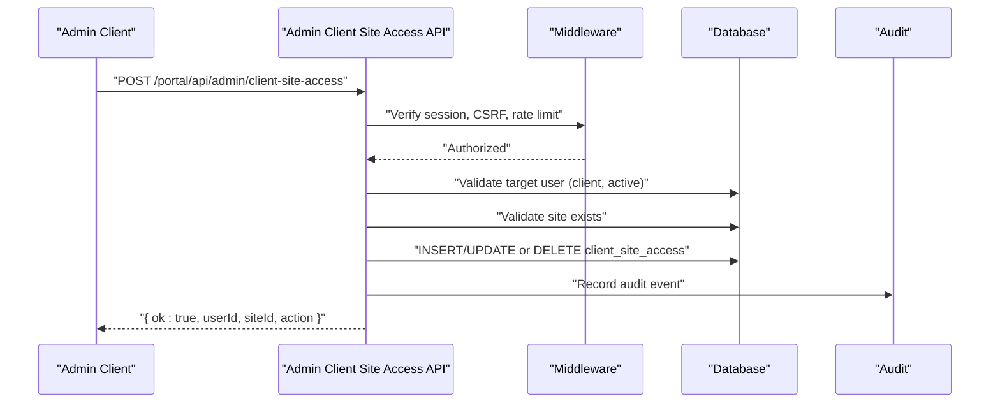
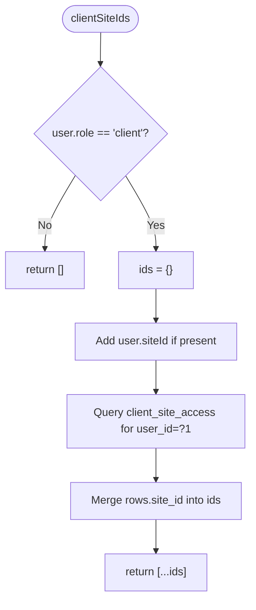
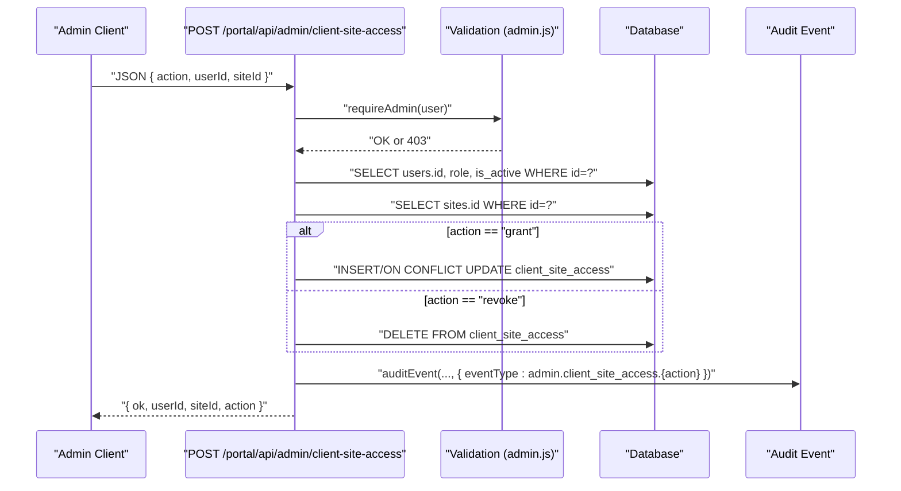
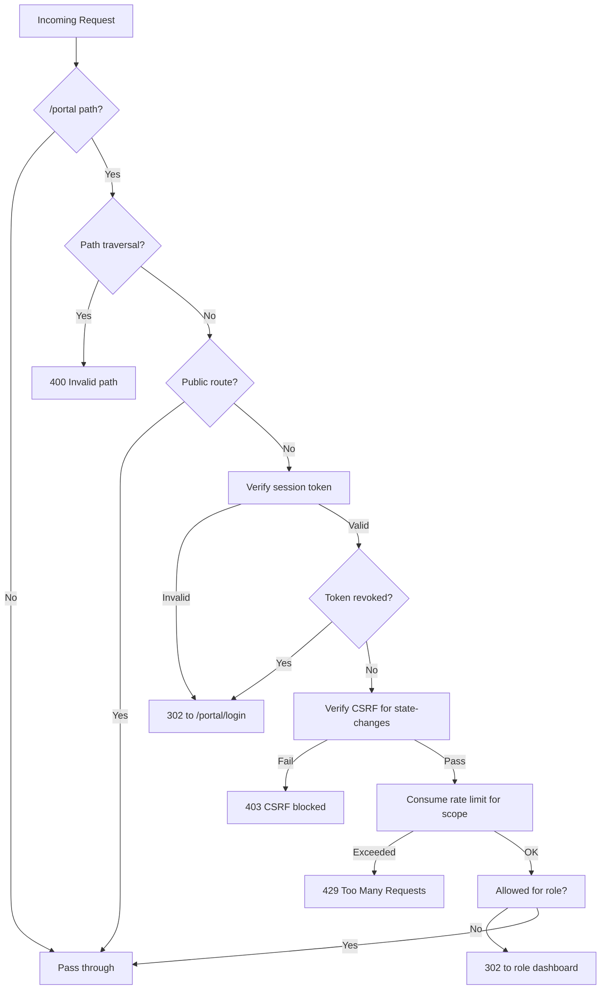
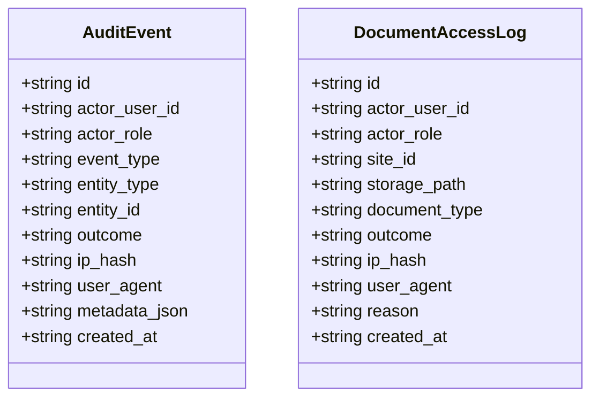
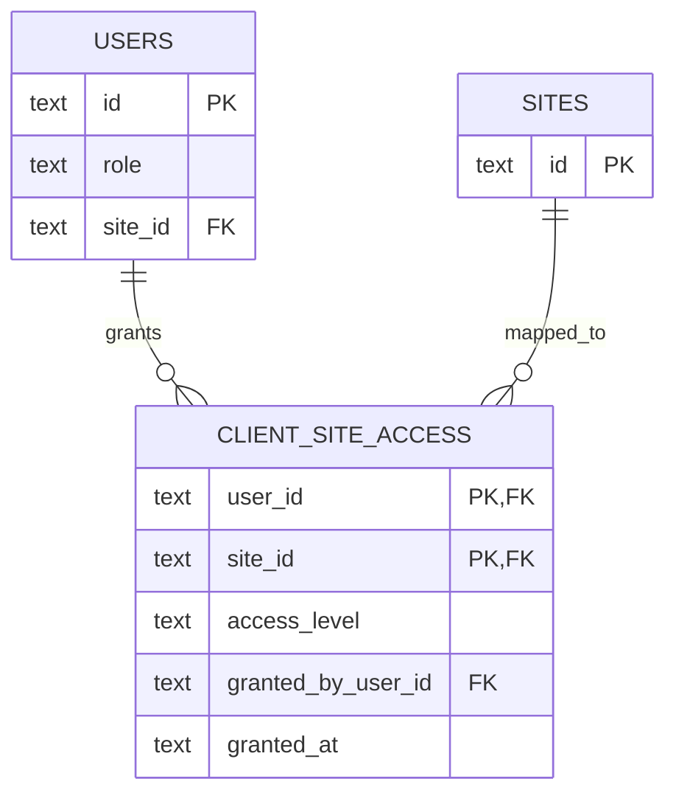
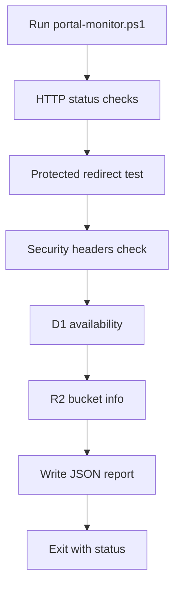
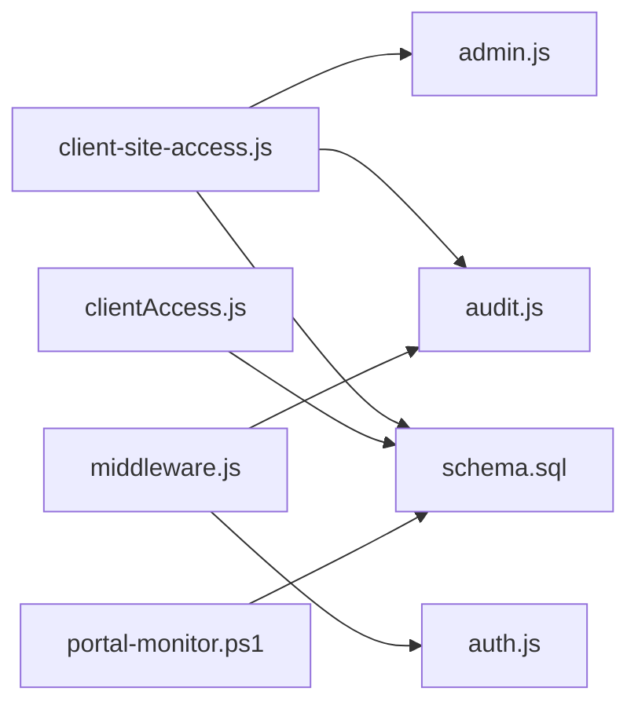

# Client Access APIs

<cite>
**Referenced Files in This Document**
- [clientAccess.js](file://src/lib/server/clientAccess.js)
- [client-site-access.js](file://src/pages/portal/api/admin/client-site-access.js)
- [admin.js](file://src/lib/server/admin.js)
- [audit.js](file://src/lib/server/audit.js)
- [documentAccess.js](file://src/lib/server/documentAccess.js)
- [auth.js](file://src/lib/server/auth.js)
- [middleware.js](file://src/middleware.js)
- [0012_client_site_access.sql](file://migrations/0012_client_site_access.sql)
- [schema.sql](file://schema.sql)
- [portal-monitor.ps1](file://scripts/portal-monitor.ps1)
- [operations.astro](file://src/pages/portal/admin/operations.astro)
</cite>

## Table of Contents
1. [Introduction](#introduction)
2. [Project Structure](#project-structure)
3. [Core Components](#core-components)
4. [Architecture Overview](#architecture-overview)
5. [Detailed Component Analysis](#detailed-component-analysis)
6. [Dependency Analysis](#dependency-analysis)
7. [Performance Considerations](#performance-considerations)
8. [Troubleshooting Guide](#troubleshooting-guide)
9. [Conclusion](#conclusion)
10. [Appendices](#appendices)

## Introduction
This document describes the client site access management and monitoring interfaces for the portal. It covers:
- Client portal access controls and site management operations
- Monitoring capabilities and dashboards
- Client-user relationships, site hierarchies, and permission inheritance
- Site status monitoring, alert notifications, and access logging
- Examples of client data structures, access control payloads, and monitoring query patterns

The focus is on the administrative API for managing client-to-site access, the underlying data model, and the runtime protections enforced by middleware and audit/logging utilities.

## Project Structure
The relevant parts of the repository for client access APIs include:
- Server-side helpers for client access queries and permissions
- Administrative API endpoint for granting/revoke client site access
- Middleware enforcing authentication, CSRF protection, and rate limits
- Audit and document access logging utilities
- Database schema and migration defining client site access mapping
- Monitoring script validating portal health and security posture

**Diagram sources**
- [clientAccess.js:1-53](file://src/lib/server/clientAccess.js#L1-L53)
- [client-site-access.js:1-70](file://src/pages/portal/api/admin/client-site-access.js#L1-L70)
- [admin.js:1-83](file://src/lib/server/admin.js#L1-L83)
- [audit.js:1-33](file://src/lib/server/audit.js#L1-L33)
- [documentAccess.js:1-28](file://src/lib/server/documentAccess.js#L1-L28)
- [auth.js:1-217](file://src/lib/server/auth.js#L1-L217)
- [middleware.js:1-214](file://src/middleware.js#L1-L214)
- [schema.sql:92-99](file://schema.sql#L92-L99)
- [0012_client_site_access.sql:1-11](file://migrations/0012_client_site_access.sql#L1-L11)
- [portal-monitor.ps1:1-133](file://scripts/portal-monitor.ps1#L1-L133)

**Section sources**
- [clientAccess.js:1-53](file://src/lib/server/clientAccess.js#L1-L53)
- [client-site-access.js:1-70](file://src/pages/portal/api/admin/client-site-access.js#L1-L70)
- [admin.js:1-83](file://src/lib/server/admin.js#L1-L83)
- [audit.js:1-33](file://src/lib/server/audit.js#L1-L33)
- [documentAccess.js:1-28](file://src/lib/server/documentAccess.js#L1-L28)
- [auth.js:1-217](file://src/lib/server/auth.js#L1-L217)
- [middleware.js:1-214](file://src/middleware.js#L1-L214)
- [schema.sql:92-99](file://schema.sql#L92-L99)
- [0012_client_site_access.sql:1-11](file://migrations/0012_client_site_access.sql#L1-L11)
- [portal-monitor.ps1:1-133](file://scripts/portal-monitor.ps1#L1-L133)

## Core Components
- Client site access utilities:
  - Resolve client user’s accessible site IDs
  - Fetch client-visible sites
  - Check whether a client can access a given site ID
- Administrative client site access API:
  - Grant or revoke access for a client user to a site
  - Enforces admin-only access and validates inputs
  - Emits audit events on success
- Middleware protections:
  - Session verification and revocation checks
  - CSRF validation for state-changing requests
  - Rate limiting per endpoint scope
- Audit and document access logging:
  - Centralized audit event recording
  - Document access log capture with IP/user agent fingerprinting
- Schema and migration:
  - Defines client site access mapping table and indexes
  - Supports access level and grantor tracking

**Section sources**
- [clientAccess.js:1-53](file://src/lib/server/clientAccess.js#L1-L53)
- [client-site-access.js:1-70](file://src/pages/portal/api/admin/client-site-access.js#L1-L70)
- [middleware.js:110-213](file://src/middleware.js#L110-L213)
- [audit.js:1-33](file://src/lib/server/audit.js#L1-L33)
- [documentAccess.js:1-28](file://src/lib/server/documentAccess.js#L1-L28)
- [schema.sql:92-99](file://schema.sql#L92-L99)
- [0012_client_site_access.sql:1-11](file://migrations/0012_client_site_access.sql#L1-L11)

## Architecture Overview
The client access API is an administrative endpoint protected by middleware. Requests must be authenticated, authorized as admin, and pass CSRF and rate-limit checks. On successful updates, audit events are recorded.

**Diagram sources**
- [client-site-access.js:8-65](file://src/pages/portal/api/admin/client-site-access.js#L8-L65)
- [middleware.js:154-184](file://src/middleware.js#L154-L184)
- [audit.js:3-28](file://src/lib/server/audit.js#L3-L28)

## Detailed Component Analysis

### Client Site Access Utilities
These functions encapsulate client site visibility and access checks:
- clientSiteIds(db, user): Returns the set of site IDs accessible to a client user (including direct site association and explicit grants)
- clientSites(db, user): Loads site records for accessible sites
- clientCanAccessSite(db, user, siteId): Checks membership in accessible site IDs

**Diagram sources**
- [clientAccess.js:1-26](file://src/lib/server/clientAccess.js#L1-L26)

**Section sources**
- [clientAccess.js:1-53](file://src/lib/server/clientAccess.js#L1-L53)

### Administrative Client Site Access API
Endpoint: POST /portal/api/admin/client-site-access
- Authentication and authorization:
  - Requires admin role via requireAdmin
- Request validation:
  - action must be "grant" or "revoke"
  - userId and siteId must be valid identifiers
  - Target user must be a currently active client
  - Site must exist
- Behavior:
  - Grant: inserts or upserts a mapping with access_level "records" and records who granted it
  - Revoke: deletes the mapping
- Response:
  - JSON with ok, userId, siteId, and action
- Audit:
  - Records an audit event keyed by action

**Diagram sources**
- [client-site-access.js:8-65](file://src/pages/portal/api/admin/client-site-access.js#L8-L65)
- [admin.js:3-8](file://src/lib/server/admin.js#L3-L8)
- [audit.js:3-28](file://src/lib/server/audit.js#L3-L28)

**Section sources**
- [client-site-access.js:1-70](file://src/pages/portal/api/admin/client-site-access.js#L1-L70)
- [admin.js:1-83](file://src/lib/server/admin.js#L1-L83)

### Middleware Protections
The middleware enforces:
- Session verification and cookie handling
- Revoked session checks
- Role-based path allowances
- CSRF token creation/verification for state-changing requests
- Rate limiting per endpoint with configurable scopes and thresholds
- Security headers for all portal responses

**Diagram sources**
- [middleware.js:110-213](file://src/middleware.js#L110-L213)

**Section sources**
- [middleware.js:1-214](file://src/middleware.js#L1-L214)

### Audit and Document Access Logging
- Audit events:
  - Captures actor, role, event type, entity, outcome, and fingerprinted IP/user-agent
  - Stores metadata JSON up to a fixed length
- Document access logs:
  - Tracks access to jobcards/evidence with site context, outcome, and reason

**Diagram sources**
- [audit.js:3-28](file://src/lib/server/audit.js#L3-L28)
- [documentAccess.js:3-26](file://src/lib/server/documentAccess.js#L3-L26)
- [schema.sql:101-140](file://schema.sql#L101-L140)

**Section sources**
- [audit.js:1-33](file://src/lib/server/audit.js#L1-L33)
- [documentAccess.js:1-28](file://src/lib/server/documentAccess.js#L1-L28)
- [schema.sql:101-140](file://schema.sql#L101-L140)

### Data Model: Client Site Access
The client site access mapping defines:
- Composite primary key (user_id, site_id)
- Access level defaults to "records"
- Grantor tracking and grant timestamp
- Indexes optimized for lookups

**Diagram sources**
- [schema.sql:3-20](file://schema.sql#L3-L20)
- [schema.sql:22-32](file://schema.sql#L22-L32)
- [schema.sql:92-99](file://schema.sql#L92-L99)
- [0012_client_site_access.sql:1-11](file://migrations/0012_client_site_access.sql#L1-L11)

**Section sources**
- [schema.sql:92-99](file://schema.sql#L92-L99)
- [0012_client_site_access.sql:1-11](file://migrations/0012_client_site_access.sql#L1-L11)

### Monitoring Dashboard Integration
The monitoring script performs:
- Public and portal page health checks
- Protected resource redirect validation
- Security header verification
- D1 database availability test
- R2 bucket availability test
- Outputs structured JSON results for CI integration

**Diagram sources**
- [portal-monitor.ps1:108-129](file://scripts/portal-monitor.ps1#L108-L129)

**Section sources**
- [portal-monitor.ps1:1-133](file://scripts/portal-monitor.ps1#L1-L133)

## Dependency Analysis
- The admin client site access endpoint depends on:
  - Validation helpers for safe parsing and sanitization
  - Audit logging for compliance
  - Database schema for referential integrity and indexing
- Middleware orchestrates:
  - Session verification and revoked token checks
  - CSRF protection for state-changing requests
  - Endpoint-scoped rate limiting
- Client access utilities depend on:
  - The client site access mapping table
  - Site table for visible records

**Diagram sources**
- [client-site-access.js:1-70](file://src/pages/portal/api/admin/client-site-access.js#L1-L70)
- [admin.js:1-83](file://src/lib/server/admin.js#L1-L83)
- [audit.js:1-33](file://src/lib/server/audit.js#L1-L33)
- [clientAccess.js:1-53](file://src/lib/server/clientAccess.js#L1-L53)
- [middleware.js:1-214](file://src/middleware.js#L1-L214)
- [schema.sql:92-99](file://schema.sql#L92-L99)
- [portal-monitor.ps1:1-133](file://scripts/portal-monitor.ps1#L1-L133)

**Section sources**
- [client-site-access.js:1-70](file://src/pages/portal/api/admin/client-site-access.js#L1-L70)
- [clientAccess.js:1-53](file://src/lib/server/clientAccess.js#L1-L53)
- [middleware.js:1-214](file://src/middleware.js#L1-L214)
- [schema.sql:92-99](file://schema.sql#L92-L99)
- [portal-monitor.ps1:1-133](file://scripts/portal-monitor.ps1#L1-L133)

## Performance Considerations
- Use database indexes on client_site_access(site_id, user_id) to speed lookups during clientSiteIds and clientSites queries.
- Prefer batched operations where feasible; the existing code uses prepared statements with bind arrays for multi-value IN clauses.
- Rate limiting windows and thresholds are endpoint-specific; tune scopes and maxAttempts to balance security and usability.
- Audit and document access logging are single-row inserts; ensure indexes on frequently queried audit/document access columns.

[No sources needed since this section provides general guidance]

## Troubleshooting Guide
Common issues and resolutions:
- Authentication failures:
  - Verify session cookie presence and validity; revoked tokens trigger automatic logout redirection.
- Authorization failures:
  - Only admin users can call the client site access endpoint; non-admins receive a 403 response.
- CSRF errors:
  - State-changing requests require a valid CSRF token; middleware blocks and audits failed CSRF attempts.
- Rate limiting:
  - Excessive writes to the endpoint trigger a 429 response with retry-after guidance; review rate limit scope and thresholds.
- Audit and logging:
  - Audit events and document access logs capture IP/user-agent fingerprints; confirm database connectivity and table integrity.

**Section sources**
- [middleware.js:131-142](file://src/middleware.js#L131-L142)
- [middleware.js:154-184](file://src/middleware.js#L154-L184)
- [audit.js:3-28](file://src/lib/server/audit.js#L3-L28)
- [documentAccess.js:3-26](file://src/lib/server/documentAccess.js#L3-L26)

## Conclusion
The client site access API provides a secure, auditable mechanism for administrators to manage client access to sites. Built-in middleware protections, strict validation, and comprehensive logging ensure robust operation. The monitoring script offers automated checks for availability and security posture, supporting continuous operational oversight.

[No sources needed since this section summarizes without analyzing specific files]

## Appendices

### API Reference: Administrative Client Site Access
- Endpoint: POST /portal/api/admin/client-site-access
- Authentication: Required; admin role
- CSRF: Required for state-changing requests
- Rate Limit Scope: portal.admin.client_site_access
- Request Body
  - action: "grant" | "revoke"
  - userId: client user identifier
  - siteId: site identifier
- Responses
  - 200 OK: { ok: true, userId, siteId, action }
  - 400 Bad Request: validation or business rule failure
  - 403 Forbidden: non-admin caller
  - 405 Method Not Allowed: wrong HTTP method
  - 429 Too Many Requests: rate limit exceeded
  - 500 Server Error: internal failure
- Audit Events
  - admin.client_site_access.grant
  - admin.client_site_access.revoke

**Section sources**
- [client-site-access.js:8-69](file://src/pages/portal/api/admin/client-site-access.js#L8-L69)
- [admin.js:3-8](file://src/lib/server/admin.js#L3-L8)
- [audit.js:3-28](file://src/lib/server/audit.js#L3-L28)
- [middleware.js:102-108](file://src/middleware.js#L102-L108)

### Client Data Structures
- Client user
  - id: string
  - role: "client"
  - site_id: string|null
  - is_active: boolean
- Site
  - id: string
  - owner_company_name: string
  - physical_address: string
  - site_contact_person: string
  - site_contact_email: string|null
  - site_contact_phone: string|null
- Client Site Access Mapping
  - user_id: string
  - site_id: string
  - access_level: "records"
  - granted_by_user_id: string|null
  - granted_at: ISO timestamp

**Section sources**
- [schema.sql:3-20](file://schema.sql#L3-L20)
- [schema.sql:22-32](file://schema.sql#L22-L32)
- [schema.sql:92-99](file://schema.sql#L92-L99)
- [0012_client_site_access.sql:1-11](file://migrations/0012_client_site_access.sql#L1-L11)

### Access Control Payload Example
- Grant access
  - action: "grant"
  - userId: "<client-user-id>"
  - siteId: "<site-id>"
- Revoke access
  - action: "revoke"
  - userId: "<client-user-id>"
  - siteId: "<site-id>"

**Section sources**
- [client-site-access.js:15-18](file://src/pages/portal/api/admin/client-site-access.js#L15-L18)

### Monitoring Query Patterns
- Health checks
  - GET / (public)
  - GET /portal/login
  - 302 redirect from /portal/admin/dashboard to login
- Security headers
  - Validate presence of CSP, X-Content-Type-Options, X-Frame-Options, Referrer-Policy, Permissions-Policy, COOP, STS
- Availability
  - D1: SELECT COUNT(*) FROM users
  - R2: bucket info
- Output
  - JSON summary with checkedAt, ok, and results array

**Section sources**
- [portal-monitor.ps1:108-129](file://scripts/portal-monitor.ps1#L108-L129)

### Client-User Relationships and Permission Inheritance
- A client user inherits access to:
  - Their associated site (site_id)
  - Additional sites granted via client_site_access
- Permission inheritance is explicit and additive; no implicit parent-child hierarchy is enforced by the API.

**Section sources**
- [clientAccess.js:1-26](file://src/lib/server/clientAccess.js#L1-L26)
- [schema.sql:92-99](file://schema.sql#L92-L99)

### Site Registration and Management
- Site registration and updates are handled by admin endpoints (see admin panel usage in UI).
- The administrative UI exposes forms bound to /portal/api/admin/sites and related endpoints for CRUD operations on sites and systems.

**Section sources**
- [operations.astro:307-328](file://src/pages/portal/admin/operations.astro#L307-L328)
- [operations.astro:419-449](file://src/pages/portal/admin/operations.astro#L419-L449)