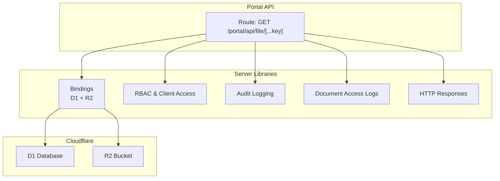
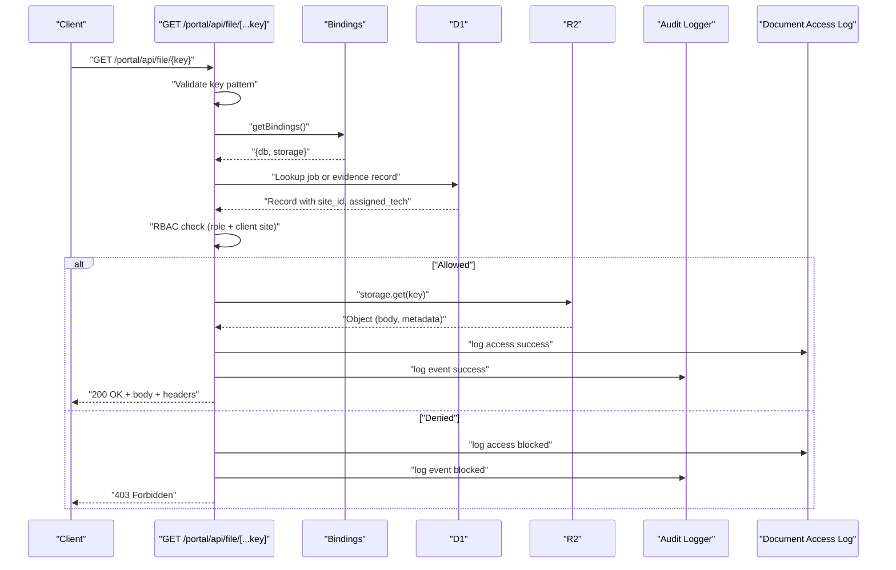
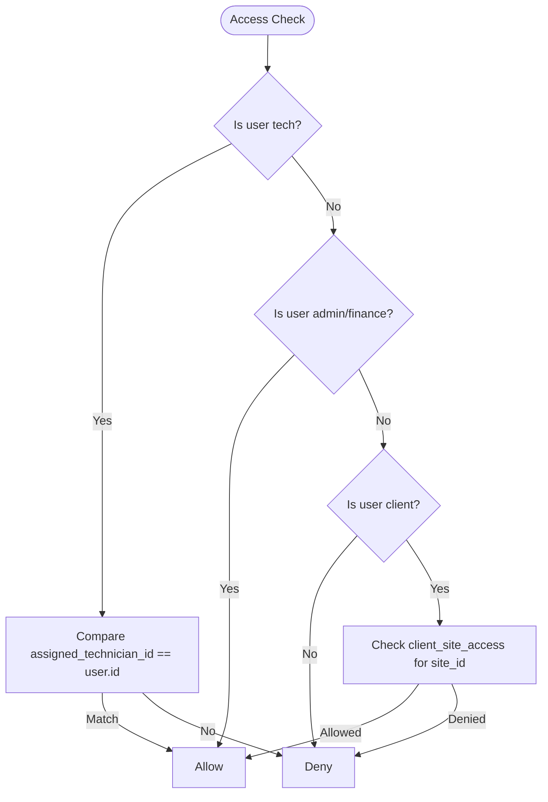
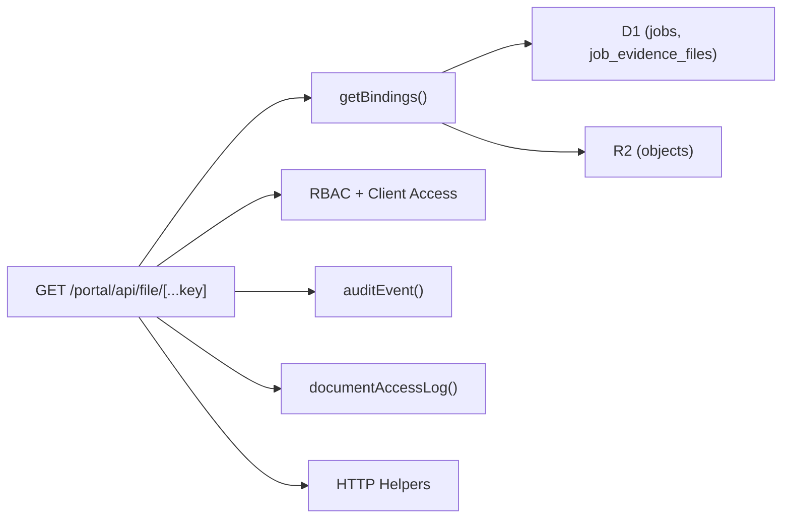

# File Storage APIs

<cite>
**Referenced Files in This Document**
- [wrangler.jsonc](file://wrangler.jsonc)
- [[...key].js](file://src/pages/portal/api/file/[...key].js)
- [bindings.js](file://src/lib/server/bindings.js)
- [documentAccess.js](file://src/lib/server/documentAccess.js)
- [clientAccess.js](file://src/lib/server/clientAccess.js)
- [audit.js](file://src/lib/server/audit.js)
- [http.js](file://src/lib/server/http.js)
- [auth.js](file://src/lib/server/auth.js)
- [0005_job_evidence_files.sql](file://migrations/0005_job_evidence_files.sql)
- [0008_document_access_logs.sql](file://migrations/0008_document_access_logs.sql)
- [schema.sql](file://schema.sql)
- [submit-jobcard.js](file://src/pages/portal/api/submit-jobcard.js)
</cite>

## Table of Contents
1. [Introduction](#introduction)
2. [Project Structure](#project-structure)
3. [Core Components](#core-components)
4. [Architecture Overview](#architecture-overview)
5. [Detailed Component Analysis](#detailed-component-analysis)
6. [Dependency Analysis](#dependency-analysis)
7. [Performance Considerations](#performance-considerations)
8. [Troubleshooting Guide](#troubleshooting-guide)
9. [Conclusion](#conclusion)
10. [Appendices](#appendices)

## Introduction
This document describes the file storage APIs used for retrieving job-related documents stored in Cloudflare R2. It focuses on:
- Retrieval of jobcards and evidence photos via a single endpoint
- Access control and permissions
- Metadata handling and caching
- Audit logging and document access logs
- Supported file types, sizes, and naming conventions
- Security considerations and operational notes

It does not describe upload endpoints because none were found in the repository. Guidance for implementing uploads is included in the appendices.

## Project Structure
The file retrieval API is implemented as a server route under the portal namespace. It integrates with:
- Cloudflare Workers bindings for D1 (database) and R2 (storage)
- Role-based access control (RBAC) and client site access checks
- Audit and document access logging

**Diagram sources**
- [[...key].js](file://src/pages/portal/api/file/[...key].js#L1-L137)
- [bindings.js:1-42](file://src/lib/server/bindings.js#L1-L42)
- [clientAccess.js:1-53](file://src/lib/server/clientAccess.js#L1-L53)
- [audit.js:1-33](file://src/lib/server/audit.js#L1-L33)
- [documentAccess.js:1-28](file://src/lib/server/documentAccess.js#L1-L28)

**Section sources**
- [[...key].js](file://src/pages/portal/api/file/[...key].js#L1-L137)
- [bindings.js:1-42](file://src/lib/server/bindings.js#L1-L42)

## Core Components
- File retrieval route: Validates path, enforces access control, retrieves object from R2, writes metadata, and returns response with cache-control.
- Bindings: Provides access to D1 and R2 via Cloudflare env bindings.
- RBAC: Enforces roles and client site access.
- Audit and document access logs: Records events for compliance and monitoring.
- HTTP helpers: Standardized response builders.

**Section sources**
- [[...key].js](file://src/pages/portal/api/file/[...key].js#L9-L137)
- [bindings.js:1-42](file://src/lib/server/bindings.js#L1-L42)
- [clientAccess.js:1-53](file://src/lib/server/clientAccess.js#L1-L53)
- [audit.js:1-33](file://src/lib/server/audit.js#L1-L33)
- [documentAccess.js:1-28](file://src/lib/server/documentAccess.js#L1-L28)
- [http.js:1-46](file://src/lib/server/http.js#L1-L46)

## Architecture Overview
The retrieval flow combines route-level validation, database-backed access checks, and R2 object retrieval.

**Diagram sources**
- [[...key].js](file://src/pages/portal/api/file/[...key].js#L9-L137)
- [bindings.js:1-42](file://src/lib/server/bindings.js#L1-L42)
- [clientAccess.js:44-48](file://src/lib/server/clientAccess.js#L44-L48)
- [audit.js:1-33](file://src/lib/server/audit.js#L1-L33)
- [documentAccess.js:1-28](file://src/lib/server/documentAccess.js#L1-L28)

## Detailed Component Analysis

### Endpoint Definition
- Method: GET
- URL Pattern: /portal/api/file/{key}
- Authentication: Required (route returns 401 if not authenticated)
- Authorization: Depends on document type and user role; see Access Control below
- Response: Binary stream from R2 with HTTP metadata and cache-control header

Notes:
- The route only supports GET; all other methods return 405 with allowed methods.

**Section sources**
- [[...key].js](file://src/pages/portal/api/file/[...key].js#L9-L137)

### Path Validation and Allowed Patterns
- Jobcard: Must start with jobcards/ and end with .pdf
- Evidence photo: Must start with job-evidence/ and match jpg, jpeg, png, or webp extensions
- Disallowed: Paths containing .. are rejected

Validation ensures safe key handling and prevents traversal.

**Section sources**
- [[...key].js](file://src/pages/portal/api/file/[...key].js#L14-L19)

### Access Control Mechanisms
- Roles: admin, finance, tech, client
- Tech: Can access documents assigned to their ID
- Admin/Finance: Full access
- Client: Limited to sites they are associated with via client_site_access
- Database-backed checks: Queries jobs or job_evidence_files to obtain site_id and assigned_technician_id

**Diagram sources**
- [[...key].js](file://src/pages/portal/api/file/[...key].js#L65-L90)
- [clientAccess.js:44-48](file://src/lib/server/clientAccess.js#L44-L48)

**Section sources**
- [[...key].js](file://src/pages/portal/api/file/[...key].js#L65-L90)
- [clientAccess.js:1-53](file://src/lib/server/clientAccess.js#L1-L53)

### Retrieval and Response Handling
- Retrieve object from R2 using storage.get(key)
- Write HTTP metadata to response headers (including etag)
- Set cache-control: private, max-age=300
- Default content-type:
  - application/pdf for jobcards
  - application/octet-stream fallback for evidence photos if R2 metadata absent

On success:
- 200 OK with object body and headers
On failure:
- 404 Not Found if object is missing
- 403 Forbidden if access denied
- 500 Server Error for internal failures

**Section sources**
- [[...key].js](file://src/pages/portal/api/file/[...key].js#L92-L127)

### Database and Schema Constraints
- Evidence files table constraints:
  - storage_path starts with job-evidence/
  - content_type limited to image/jpeg, image/png, image/webp
  - file_size_bytes between 1 and 1,572,864 bytes (1.5 MB)
- Document access logs:
  - storage_path constrained to jobcards/ or job-evidence/
  - document_type limited to Jobcard PDF or Evidence Photo

These constraints define supported file types and sizes for evidence photos.

**Section sources**
- [0005_job_evidence_files.sql:1-16](file://migrations/0005_job_evidence_files.sql#L1-L16)
- [schema.sql:115-126](file://schema.sql#L115-L126)
- [0008_document_access_logs.sql:1-18](file://migrations/0008_document_access_logs.sql#L1-L18)
- [schema.sql:128-140](file://schema.sql#L128-L140)

### Audit and Access Logging
- Document access logs: Captures actor, site, storage_path, document_type, outcome, IP hash, user agent, and reason
- Audit events: Records event_type, entity_type, entity_id, outcome, IP hash, user agent, and optional metadata

Both are written to D1 for compliance and monitoring.

**Section sources**
- [documentAccess.js:1-28](file://src/lib/server/documentAccess.js#L1-L28)
- [audit.js:1-33](file://src/lib/server/audit.js#L1-L33)

### Cloudflare Bindings and Environment
- D1 binding: DB
- R2 binding: STORAGE
- Variables include SESSION_COOKIE_NAME and STANDARD_SERVICE_FEE

Ensure bindings are configured in wrangler.jsonc.

**Section sources**
- [bindings.js:1-42](file://src/lib/server/bindings.js#L1-L42)
- [wrangler.jsonc:27-36](file://wrangler.jsonc#L27-L36)

### Upload Handling (Missing in Repository)
There is no upload endpoint in the repository. Evidence photos are ingested during job closing via a separate endpoint that validates size and content type.

- Size limit: 128 bytes to 1,572,864 bytes (1.5 MB)
- Content types: image/jpeg, image/png, image/webp
- Maximum per submission: 3 photos

**Section sources**
- [submit-jobcard.js:34-49](file://src/pages/portal/api/submit-jobcard.js#L34-L49)

## Dependency Analysis

**Diagram sources**
- [[...key].js](file://src/pages/portal/api/file/[...key].js#L1-L137)
- [bindings.js:1-42](file://src/lib/server/bindings.js#L1-L42)
- [clientAccess.js:1-53](file://src/lib/server/clientAccess.js#L1-L53)
- [audit.js:1-33](file://src/lib/server/audit.js#L1-L33)
- [documentAccess.js:1-28](file://src/lib/server/documentAccess.js#L1-L28)

**Section sources**
- [[...key].js](file://src/pages/portal/api/file/[...key].js#L1-L137)
- [bindings.js:1-42](file://src/lib/server/bindings.js#L1-L42)

## Performance Considerations
- Response caching: cache-control set to private, max-age=300 reduces repeated fetches
- Minimal CPU work: relies on R2 metadata and direct streaming
- Indexes: D1 indexes on jobs, job_evidence_files, and document_access_logs support efficient lookups

[No sources needed since this section provides general guidance]

## Troubleshooting Guide
Common issues and resolutions:
- 401 Unauthorized: Ensure a valid session cookie is present and not expired
- 403 Forbidden: Verify role and site access; tech must be assigned to the job; client must have access to the site
- 404 Not Found: Object key may be incorrect or object deleted
- 500 Server Error: Internal failure during retrieval; check logs and bindings configuration

Operational checks:
- Confirm D1 and R2 bindings are configured in wrangler.jsonc
- Verify storage_path follows allowed patterns
- Confirm audit and document access logs for denied or missing access attempts

**Section sources**
- [[...key].js](file://src/pages/portal/api/file/[...key].js#L128-L131)
- [wrangler.jsonc:27-36](file://wrangler.jsonc#L27-L36)

## Conclusion
The file retrieval API provides secure, audited access to jobcards and evidence photos stored in R2. It enforces strict path validation, robust RBAC, and comprehensive logging. While upload endpoints are not present in this repository, evidence ingestion is supported elsewhere with explicit size and type constraints.

[No sources needed since this section summarizes without analyzing specific files]

## Appendices

### API Reference: File Retrieval
- Method: GET
- URL: /portal/api/file/{key}
- Authentication: Required
- Authorization:
  - admin/finance: full access
  - tech: access to documents assigned to them
  - client: access to sites they are authorized for
- Path patterns:
  - Jobcard: jobcards/*.pdf
  - Evidence photo: job-evidence/*.{jpg,jpeg,png,webp}
- Response:
  - 200 OK with object body and headers (etag, cache-control, content-type)
  - 401 Unauthorized
  - 403 Forbidden
  - 404 Not Found
  - 500 Server Error

**Section sources**
- [[...key].js](file://src/pages/portal/api/file/[...key].js#L9-L137)

### Supported File Types and Sizes
- Evidence photos:
  - Types: image/jpeg, image/png, image/webp
  - Size: 128 bytes to 1,572,864 bytes (1.5 MB)
- Jobcards:
  - Type: application/pdf
  - Size: constrained by ingestion process (not enforced at retrieval)

**Section sources**
- [0005_job_evidence_files.sql:8-9](file://migrations/0005_job_evidence_files.sql#L8-L9)
- [submit-jobcard.js:34-36](file://src/pages/portal/api/submit-jobcard.js#L34-L36)

### Access Control Patterns
- Admin/Finance: unrestricted
- Tech: must be assigned to the job’s technician
- Client: must be granted access to the site via client_site_access
- Site-scoped: retrieval requires matching site_id from database lookup

**Section sources**
- [[...key].js](file://src/pages/portal/api/file/[...key].js#L65-L90)
- [clientAccess.js:44-48](file://src/lib/server/clientAccess.js#L44-L48)

### Security Considerations
- Session tokens: signed with HMAC-SHA256; cookie attributes include Secure, HttpOnly, SameSite=Strict
- Token revocation: fingerprints stored in D1 with expiration windows
- Request fingerprinting: used for audit trails and access logs
- Path validation: rejects traversal patterns and enforces allowed prefixes/extensions

**Section sources**
- [auth.js:48-118](file://src/lib/server/auth.js#L48-L118)
- [auth.js:125-157](file://src/lib/server/auth.js#L125-L157)
- [documentAccess.js:1-28](file://src/lib/server/documentAccess.js#L1-L28)

### Implementation Notes for Uploads (Guidance)
- Use Cloudflare R2 put() with appropriate content-type and size checks
- Enforce the same constraints observed in the evidence ingestion flow:
  - content-type: image/jpeg, image/png, image/webp
  - size: 128 bytes to 1,572,864 bytes
  - storage_path: job-evidence/{uuid}.{ext}
- Store metadata in D1 (job_evidence_files) with foreign keys to jobs/systems
- Emit audit events and document access logs for compliance

[No sources needed since this section provides general guidance]