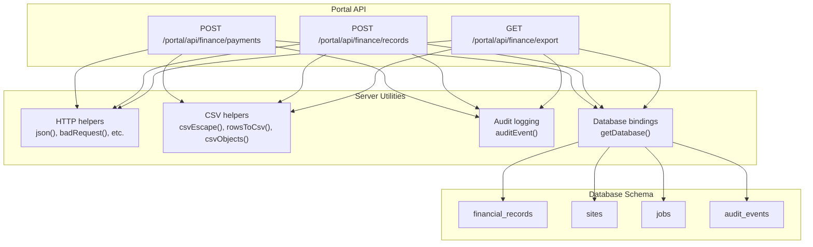
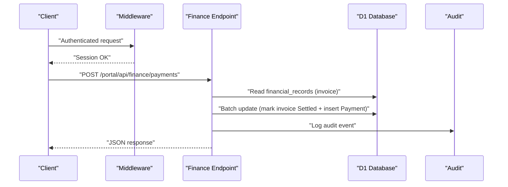
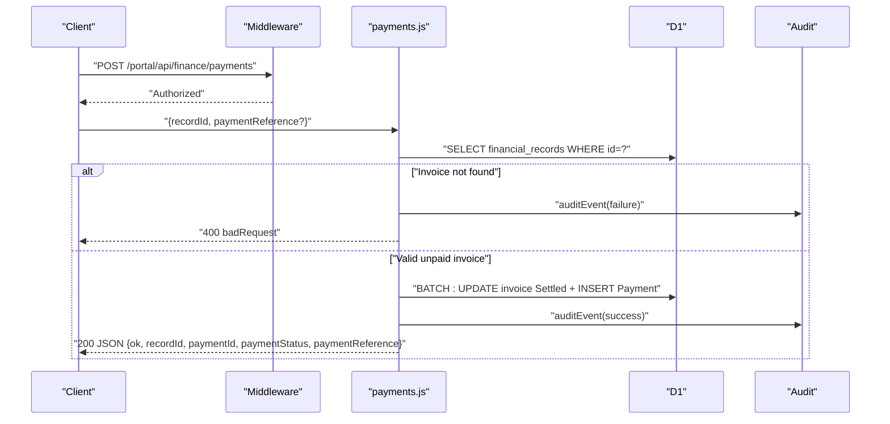
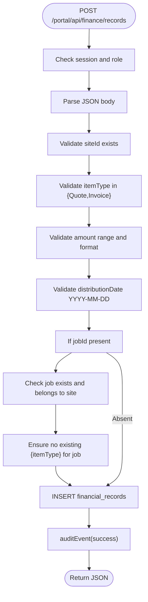
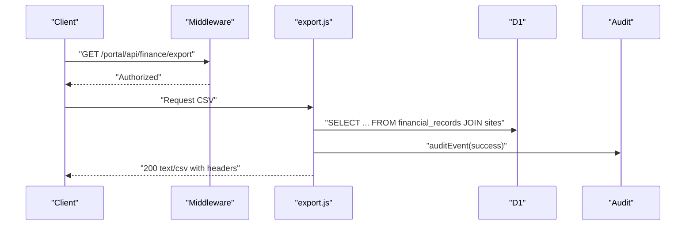
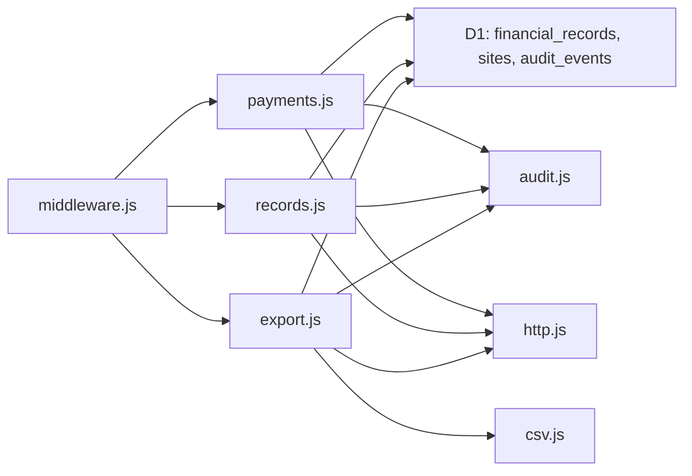
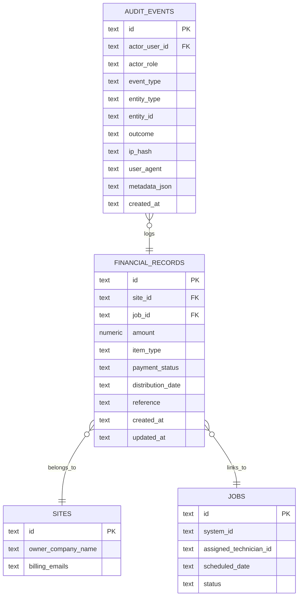
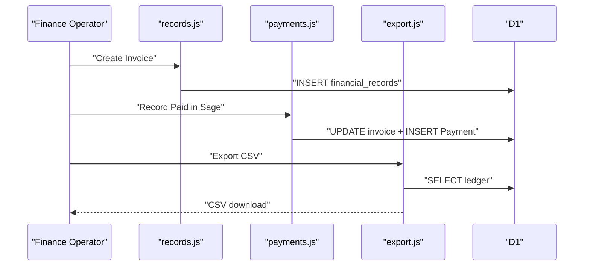

# Financial APIs

<cite>
**Referenced Files in This Document**
- [payments.js](file://src/pages/portal/api/finance/payments.js)
- [records.js](file://src/pages/portal/api/finance/records.js)
- [export.js](file://src/pages/portal/api/finance/export.js)
- [csv.js](file://src/lib/server/csv.js)
- [http.js](file://src/lib/server/http.js)
- [audit.js](file://src/lib/server/audit.js)
- [bindings.js](file://src/lib/server/bindings.js)
- [schema.sql](file://schema.sql)
- [middleware.js](file://src/middleware.js)
- [auth.js](file://src/lib/server/auth.js)
</cite>

## Table of Contents
1. [Introduction](#introduction)
2. [Project Structure](#project-structure)
3. [Core Components](#core-components)
4. [Architecture Overview](#architecture-overview)
5. [Detailed Component Analysis](#detailed-component-analysis)
6. [Dependency Analysis](#dependency-analysis)
7. [Performance Considerations](#performance-considerations)
8. [Troubleshooting Guide](#troubleshooting-guide)
9. [Conclusion](#conclusion)
10. [Appendices](#appendices)

## Introduction
This document describes the financial operations and accounting interfaces implemented in the portal. It covers payment processing, invoice/quote creation, financial record management, and export functionality. It also documents payment method handling, transaction recording, reconciliation via external accounting references, financial reporting, export formats, and audit trails. Examples of financial data models, payment workflows, and export configurations are included.

## Project Structure
The financial APIs are implemented as Astro Islands endpoints under the portal namespace. Supporting utilities provide HTTP responses, CSV serialization, auditing, and database bindings. The database schema defines financial records, sites, jobs, and audit events.

**Diagram sources**
- [payments.js:1-106](file://src/pages/portal/api/finance/payments.js#L1-L106)
- [records.js:1-137](file://src/pages/portal/api/finance/records.js#L1-L137)
- [export.js:1-74](file://src/pages/portal/api/finance/export.js#L1-L74)
- [http.js:1-47](file://src/lib/server/http.js#L1-L47)
- [csv.js:1-71](file://src/lib/server/csv.js#L1-L71)
- [audit.js:1-33](file://src/lib/server/audit.js#L1-L33)
- [bindings.js:1-42](file://src/lib/server/bindings.js#L1-L42)
- [schema.sql:64-113](file://schema.sql#L64-L113)

**Section sources**
- [payments.js:1-106](file://src/pages/portal/api/finance/payments.js#L1-L106)
- [records.js:1-137](file://src/pages/portal/api/finance/records.js#L1-L137)
- [export.js:1-74](file://src/pages/portal/api/finance/export.js#L1-L74)
- [http.js:1-47](file://src/lib/server/http.js#L1-L47)
- [csv.js:1-71](file://src/lib/server/csv.js#L1-L71)
- [audit.js:1-33](file://src/lib/server/audit.js#L1-L33)
- [bindings.js:1-42](file://src/lib/server/bindings.js#L1-L42)
- [schema.sql:64-113](file://schema.sql#L64-L113)

## Core Components
- Payment capture endpoint: Records a Sage payment against an unpaid invoice, updates statuses, and creates a mirrored Payment record.
- Financial record creation endpoint: Creates Quote or Invoice records with validation and cross-entity checks.
- Finance export endpoint: Exports ledger rows to CSV for reconciliation with external accounting systems.
- Audit trail: All state-changing actions log structured audit events.
- HTTP helpers: Standardized JSON responses and error codes.
- CSV utilities: Robust CSV escaping and parsing helpers.

**Section sources**
- [payments.js:13-101](file://src/pages/portal/api/finance/payments.js#L13-L101)
- [records.js:36-131](file://src/pages/portal/api/finance/records.js#L36-L131)
- [export.js:12-68](file://src/pages/portal/api/finance/export.js#L12-L68)
- [audit.js:3-32](file://src/lib/server/audit.js#L3-L32)
- [http.js:1-47](file://src/lib/server/http.js#L1-L47)
- [csv.js:1-71](file://src/lib/server/csv.js#L1-L71)

## Architecture Overview
The financial APIs are protected by middleware enforcing session authentication, CSRF verification, and rate limits. Requests are routed to endpoints that validate inputs, enforce business rules, update the database atomically, and emit audit events. Export endpoints stream CSV responses with appropriate headers.

**Diagram sources**
- [middleware.js:110-213](file://src/middleware.js#L110-L213)
- [payments.js:13-101](file://src/pages/portal/api/finance/payments.js#L13-L101)
- [audit.js:3-32](file://src/lib/server/audit.js#L3-L32)
- [bindings.js:18-26](file://src/lib/server/bindings.js#L18-L26)

## Detailed Component Analysis

### Payment Capture API
- Purpose: Record a Sage payment against an unpaid invoice and create a mirrored Payment record.
- Authentication and authorization: Requires an authenticated session and role “finance” or “admin”.
- Endpoint: POST /portal/api/finance/payments
- Request body:
  - recordId: string, required, UUID-like identifier for the invoice record
  - paymentReference: string, optional, up to 80 chars; if omitted, a reference is auto-generated
- Response:
  - ok: boolean
  - recordId: string (original invoice ID)
  - paymentId: string (new Payment record ID)
  - paymentStatus: string ("Settled")
  - paymentReference: string (provided or generated)
- Validation and guards:
  - Rejects invalid recordId format
  - Requires existing invoice with item_type "Invoice" and payment_status "Unpaid"
  - Enforces single payment per invoice via database constraints
- Transaction behavior:
  - Atomic batch update: mark invoice Settled and insert Payment record
- Audit trail:
  - Logs success/failure with metadata including paymentId, paymentReference, invoiceReference

**Diagram sources**
- [payments.js:13-101](file://src/pages/portal/api/finance/payments.js#L13-L101)
- [audit.js:3-32](file://src/lib/server/audit.js#L3-L32)
- [bindings.js:18-26](file://src/lib/server/bindings.js#L18-L26)

**Section sources**
- [payments.js:13-101](file://src/pages/portal/api/finance/payments.js#L13-L101)

### Financial Record Creation API
- Purpose: Create a Quote or Invoice record with validation and cross-entity checks.
- Authentication and authorization: Requires an authenticated session and role “finance” or “admin”.
- Endpoint: POST /portal/api/finance/records
- Request body:
  - siteId: string, required, UUID-like identifier for the site
  - itemType: string, required, "Quote" or "Invoice"
  - amount: number, required, 0–9,999,999 inclusive, rounded to two decimals
  - distributionDate: string, required, "YYYY-MM-DD"
  - jobId: string, optional, UUID-like identifier for a job within the same site
  - reference: string, optional, up to 120 chars
- Response:
  - ok: boolean
  - recordId: string
  - itemType: string
  - paymentStatus: string ("Pending Approval" for Quote, "Unpaid" for Invoice)
  - amount: number
  - distributionDate: string
- Validation and guards:
  - Validates site existence
  - If jobId provided, validates job existence and site ownership
  - Prevents duplicate job itemType records
  - Enforces amount and date formats
- Audit trail:
  - Logs success with metadata including siteId, jobId, amount, reference

**Diagram sources**
- [records.js:36-131](file://src/pages/portal/api/finance/records.js#L36-L131)

**Section sources**
- [records.js:36-131](file://src/pages/portal/api/finance/records.js#L36-L131)

### Finance Export API
- Purpose: Export the entire financial ledger to CSV for reconciliation with external accounting systems.
- Authentication and authorization: Requires an authenticated session and role “finance” or “admin”.
- Endpoint: GET /portal/api/finance/export
- Response:
  - Content-Type: text/csv; charset=utf-8
  - Content-Disposition: attachment with filename pattern "kharon-finance-ledger-YYYY-MM-DD.csv"
  - Body: CSV rows with headers
- CSV headers:
  - id, reference, type, status, amount, distribution_date, job_id, client, billing_emails
- Data source:
  - Selects financial_records joined with sites, ordered by distribution_date desc, then created_at desc
- Audit trail:
  - Logs success with metadata including rowCount

**Diagram sources**
- [export.js:12-68](file://src/pages/portal/api/finance/export.js#L12-L68)
- [audit.js:3-32](file://src/lib/server/audit.js#L3-L32)

**Section sources**
- [export.js:12-68](file://src/pages/portal/api/finance/export.js#L12-L68)

### Supporting Utilities

#### HTTP Helpers
- json(data, init?): Returns a JSON Response with content-type and cache-control set
- methodNotAllowed(allowed): Returns 405 with Allow header
- badRequest(message, details?): Returns 400 with error envelope
- unauthorized(message?): Returns 401
- forbidden(message?): Returns 403
- tooManyRequests(message?, retryAfter?): Returns 429 with Retry-After
- serverError(message?): Returns 500

**Section sources**
- [http.js:1-47](file://src/lib/server/http.js#L1-L47)

#### CSV Utilities
- csvEscape(value): Escapes CSV values safely
- rowsToCsv(headers, rows): Serializes rows to CSV text
- parseCsv(text): Parses CSV text into array of rows
- csvObjects(text, expectedHeaders): Parses CSV and validates exact header order and count

**Section sources**
- [csv.js:1-71](file://src/lib/server/csv.js#L1-L71)

#### Audit Logging
- auditEvent(db, request, options): Writes an audit_events row with actor, event type, entity, outcome, IP hash, user agent, and metadata

**Section sources**
- [audit.js:3-32](file://src/lib/server/audit.js#L3-L32)

#### Database Bindings
- getDatabase(): Returns Cloudflare D1 binding
- getBindings(): Returns DB and STORAGE bindings
- getStandardServiceFee(): Returns configured standard service fee

**Section sources**
- [bindings.js:18-42](file://src/lib/server/bindings.js#L18-L42)

## Dependency Analysis
- Authentication and authorization:
  - Middleware enforces session verification, CSRF protection, rate limiting, and role-based access.
  - Finance endpoints require roles "finance" or "admin".
- Endpoint-to-schema relationships:
  - Payments: reads financial_records, updates payment_status, inserts Payment record
  - Records: inserts financial_records, validates site and optional job
  - Export: selects financial_records and joins sites
- Audit integration:
  - All endpoints call auditEvent on success or failure
- Rate limiting:
  - Middleware applies per-endpoint rate limits for state-changing APIs

**Diagram sources**
- [middleware.js:110-213](file://src/middleware.js#L110-L213)
- [payments.js:1-106](file://src/pages/portal/api/finance/payments.js#L1-L106)
- [records.js:1-137](file://src/pages/portal/api/finance/records.js#L1-L137)
- [export.js:1-74](file://src/pages/portal/api/finance/export.js#L1-L74)
- [audit.js:1-33](file://src/lib/server/audit.js#L1-L33)
- [http.js:1-47](file://src/lib/server/http.js#L1-L47)
- [csv.js:1-71](file://src/lib/server/csv.js#L1-L71)

**Section sources**
- [middleware.js:110-213](file://src/middleware.js#L110-L213)
- [payments.js:1-106](file://src/pages/portal/api/finance/payments.js#L1-L106)
- [records.js:1-137](file://src/pages/portal/api/finance/records.js#L1-L137)
- [export.js:1-74](file://src/pages/portal/api/finance/export.js#L1-L74)
- [audit.js:1-33](file://src/lib/server/audit.js#L1-L33)
- [http.js:1-47](file://src/lib/server/http.js#L1-L47)
- [csv.js:1-71](file://src/lib/server/csv.js#L1-L71)

## Performance Considerations
- Batch writes: Payment capture uses a batch to minimize round-trips and maintain atomicity.
- Indexes: financial_records has indexes on site_id, payment_status, distribution_date and job_id to support queries and exports.
- CSV streaming: Export streams rows directly to avoid loading entire dataset into memory.
- Rate limiting: Middleware applies per-endpoint rate limits to protect write-heavy endpoints.

[No sources needed since this section provides general guidance]

## Troubleshooting Guide
Common issues and resolutions:
- Unauthorized or forbidden:
  - Ensure a valid session cookie and correct role ("finance" or "admin").
- Bad request:
  - Verify JSON body format and required fields.
  - For payments, ensure recordId matches an unpaid invoice.
  - For records, ensure siteId exists, jobId belongs to the same site, and amount/date formats are valid.
- Too many requests:
  - Respect rate limit windows and retry-after values.
- Export failures:
  - Confirm database connectivity and that financial_records and sites tables contain data.

**Section sources**
- [http.js:22-46](file://src/lib/server/http.js#L22-L46)
- [middleware.js:166-183](file://src/middleware.js#L166-L183)
- [payments.js:23-60](file://src/pages/portal/api/finance/payments.js#L23-L60)
- [records.js:58-71](file://src/pages/portal/api/finance/records.js#L58-L71)

## Conclusion
The financial APIs provide robust, auditable, and secure operations for payment recording, quote/invoice creation, and ledger export. They integrate tightly with the database schema and middleware to ensure correctness, safety, and compliance with accounting reconciliation needs.

[No sources needed since this section summarizes without analyzing specific files]

## Appendices

### API Definitions

- Payment Capture
  - Method: POST
  - URL: /portal/api/finance/payments
  - Request JSON:
    - recordId: string (UUID-like)
    - paymentReference?: string (optional)
  - Response JSON:
    - ok: boolean
    - recordId: string
    - paymentId: string
    - paymentStatus: "Settled"
    - paymentReference: string

- Financial Record Creation
  - Method: POST
  - URL: /portal/api/finance/records
  - Request JSON:
    - siteId: string
    - itemType: "Quote" | "Invoice"
    - amount: number
    - distributionDate: string ("YYYY-MM-DD")
    - jobId?: string
    - reference?: string
  - Response JSON:
    - ok: boolean
    - recordId: string
    - itemType: string
    - paymentStatus: string
    - amount: number
    - distributionDate: string

- Finance Export
  - Method: GET
  - URL: /portal/api/finance/export
  - Response:
    - Content-Type: text/csv; charset=utf-8
    - Content-Disposition: attachment; filename="kharon-finance-ledger-YYYY-MM-DD.csv"
    - Body: CSV with headers id, reference, type, status, amount, distribution_date, job_id, client, billing_emails

**Section sources**
- [payments.js:13-101](file://src/pages/portal/api/finance/payments.js#L13-L101)
- [records.js:36-131](file://src/pages/portal/api/finance/records.js#L36-L131)
- [export.js:12-68](file://src/pages/portal/api/finance/export.js#L12-L68)

### Financial Data Models

**Diagram sources**
- [schema.sql:64-113](file://schema.sql#L64-L113)

### Payment Workflow Example
- Create an Invoice record via financial records endpoint.
- Later, call payment capture endpoint with the Invoice’s recordId.
- The system marks the Invoice Settled and inserts a mirrored Payment record.
- Export CSV to reconcile with external accounting.

**Diagram sources**
- [records.js:106-116](file://src/pages/portal/api/finance/records.js#L106-L116)
- [payments.js:65-81](file://src/pages/portal/api/finance/payments.js#L65-L81)
- [export.js:19-28](file://src/pages/portal/api/finance/export.js#L19-L28)

### Export Configuration
- Output format: CSV
- Columns: id, reference, type, status, amount, distribution_date, job_id, client, billing_emails
- Filename pattern: kharon-finance-ledger-YYYY-MM-DD.csv
- Sorting: distribution_date desc, created_at desc

**Section sources**
- [export.js:39-64](file://src/pages/portal/api/finance/export.js#L39-L64)