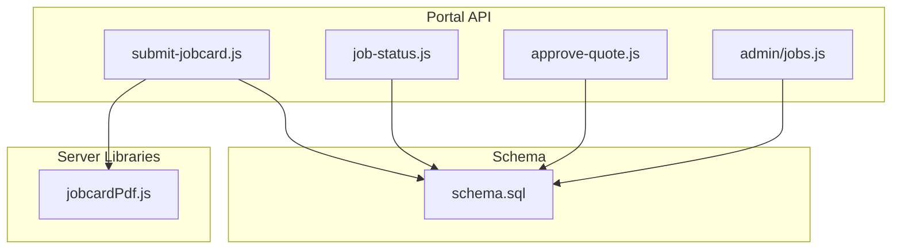
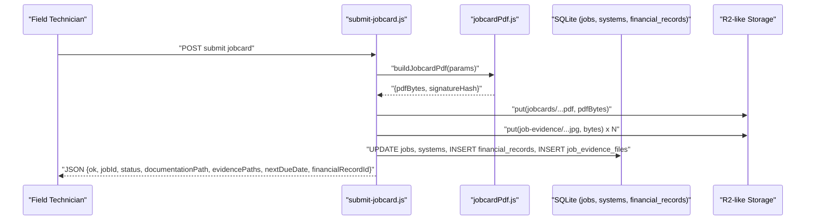
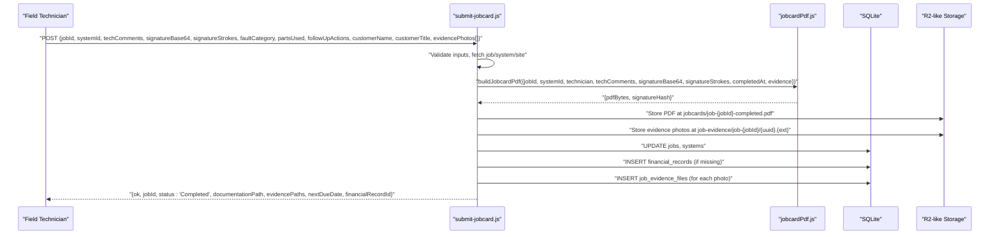
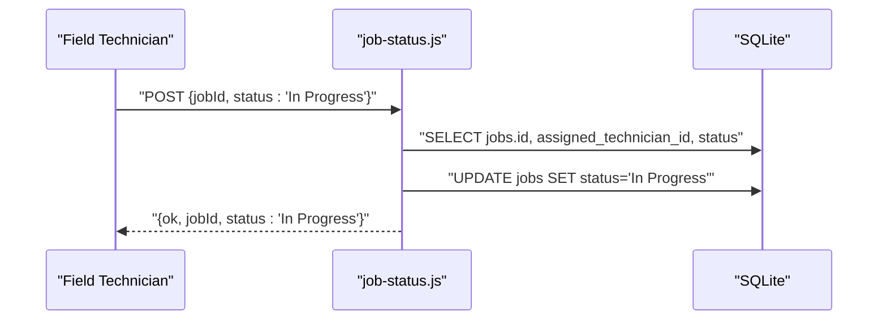
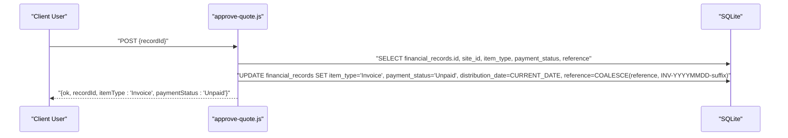
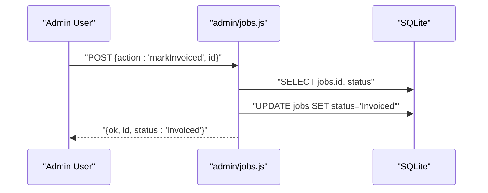
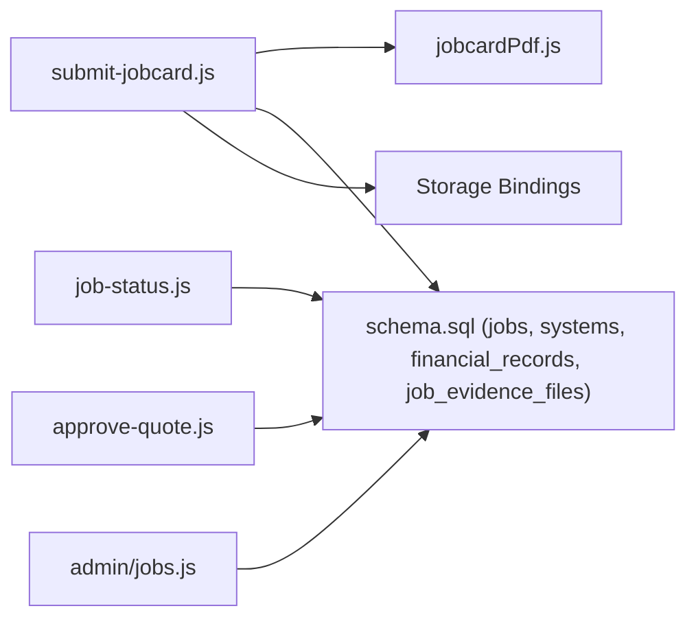

# Job Management APIs

<cite>
**Referenced Files in This Document**
- [submit-jobcard.js](file://src/pages/portal/api/submit-jobcard.js)
- [job-status.js](file://src/pages/portal/api/job-status.js)
- [approve-quote.js](file://src/pages/portal/api/approve-quote.js)
- [jobs.js](file://src/pages/portal/api/admin/jobs.js)
- [jobcardPdf.js](file://src/lib/server/jobcardPdf.js)
- [schema.sql](file://schema.sql)
</cite>

## Table of Contents
1. [Introduction](#introduction)
2. [Project Structure](#project-structure)
3. [Core Components](#core-components)
4. [Architecture Overview](#architecture-overview)
5. [Detailed Component Analysis](#detailed-component-analysis)
6. [Dependency Analysis](#dependency-analysis)
7. [Performance Considerations](#performance-considerations)
8. [Troubleshooting Guide](#troubleshooting-guide)
9. [Conclusion](#conclusion)

## Introduction
This document describes the Job Management APIs that enable field technicians to close jobs with documentation and evidence, update job status from the field, approve quotes, and mark jobs as invoiced via administrative controls. It also documents the underlying data models, PDF generation process, and evidence file handling.

## Project Structure
The job management endpoints are implemented as server-side routes under the portal API namespace. Supporting libraries handle PDF generation and database/storage bindings.

**Diagram sources**
- [submit-jobcard.js:1-307](file://src/pages/portal/api/submit-jobcard.js#L1-L307)
- [job-status.js:1-76](file://src/pages/portal/api/job-status.js#L1-L76)
- [approve-quote.js:1-100](file://src/pages/portal/api/approve-quote.js#L1-L100)
- [jobs.js:1-95](file://src/pages/portal/api/admin/jobs.js#L1-L95)
- [jobcardPdf.js:1-236](file://src/lib/server/jobcardPdf.js#L1-L236)
- [schema.sql:1-245](file://schema.sql#L1-L245)

**Section sources**
- [submit-jobcard.js:1-307](file://src/pages/portal/api/submit-jobcard.js#L1-L307)
- [job-status.js:1-76](file://src/pages/portal/api/job-status.js#L1-L76)
- [approve-quote.js:1-100](file://src/pages/portal/api/approve-quote.js#L1-L100)
- [jobs.js:1-95](file://src/pages/portal/api/admin/jobs.js#L1-L95)
- [jobcardPdf.js:1-236](file://src/lib/server/jobcardPdf.js#L1-L236)
- [schema.sql:1-245](file://schema.sql#L1-L245)

## Core Components
- Submit Jobcard: Field technician closes a job, generates a PDF, stores evidence photos, updates job/system records, and creates a financial record if needed.
- Job Status Update: Field technician starts a job by transitioning it to “In Progress”.
- Approve Quote: Client account approves a quote, converting it to an invoice.
- Mark Job Invoiced (Admin): Admin marks a completed job as invoiced.

**Section sources**
- [submit-jobcard.js:51-302](file://src/pages/portal/api/submit-jobcard.js#L51-L302)
- [job-status.js:15-71](file://src/pages/portal/api/job-status.js#L15-L71)
- [approve-quote.js:14-95](file://src/pages/portal/api/approve-quote.js#L14-L95)
- [jobs.js:10-91](file://src/pages/portal/api/admin/jobs.js#L10-L91)

## Architecture Overview
The APIs interact with a SQLite-backed schema, storing job data, financial records, and evidence files. PDFs are generated server-side and stored in Cloudflare R2-like storage via bindings. Audit events track all significant operations.

**Diagram sources**
- [submit-jobcard.js:51-302](file://src/pages/portal/api/submit-jobcard.js#L51-L302)
- [jobcardPdf.js:128-236](file://src/lib/server/jobcardPdf.js#L128-L236)
- [schema.sql:49-126](file://schema.sql#L49-L126)

## Detailed Component Analysis

### Submit Jobcard API
- Purpose: Close a scheduled/in-progress job, attach technician comments, capture a signature, upload up to three evidence photos, generate a PDF, and create financial records.
- Authentication: Requires a logged-in user with role “tech”.
- Endpoint: POST /portal/api/submit-jobcard
- Request body fields:
  - jobId: string, cleaned to alphanumeric, underscore, hyphen, length 3–80
  - systemId: string, cleaned to alphanumeric, underscore, hyphen, length 3–80
  - techComments: string, trimmed, 3–3000 chars
  - signatureBase64: base64 image or data URI
  - signatureStrokes: array of stroke arrays with x,y points in [0..1]
  - faultCategory: string, trimmed, max 120
  - partsUsed: string, trimmed, max 500
  - followUpActions: string, trimmed, max 1000
  - customerName: string, trimmed, max 120
  - customerTitle: string, trimmed, max 80
  - evidencePhotos: array of up to 3 items; each item supports:
    - dataUri: data URI for jpeg/png/webp
    - caption: optional, trimmed, max 160
- Validation:
  - Customer name required
  - Signature required
  - Job must be assigned to the authenticated technician and in “Scheduled” or “In Progress”
  - Evidence photos validated for MIME type and size bounds
- Processing:
  - Compute service interval and next due date
  - Build PDF with embedded signature hash
  - Store PDF and evidence photos in storage with metadata
  - Update job status to “Completed”, set completion timestamp, and write documentation path
  - Update system last service/check dates and next due date
  - Insert financial record if none exists for the job
  - Insert evidence file records
  - Emit audit event
- Response:
  - ok: boolean
  - jobId, systemId
  - status: “Completed”
  - documentationPath: string
  - evidencePaths: array of storage paths
  - nextDueDate: ISO date string
  - financialRecordId: UUID

**Diagram sources**
- [submit-jobcard.js:51-302](file://src/pages/portal/api/submit-jobcard.js#L51-L302)
- [jobcardPdf.js:128-236](file://src/lib/server/jobcardPdf.js#L128-L236)
- [schema.sql:49-126](file://schema.sql#L49-L126)

**Section sources**
- [submit-jobcard.js:51-302](file://src/pages/portal/api/submit-jobcard.js#L51-L302)
- [jobcardPdf.js:128-236](file://src/lib/server/jobcardPdf.js#L128-L236)
- [schema.sql:49-126](file://schema.sql#L49-L126)

### Job Status Update API
- Purpose: Transition a scheduled job to “In Progress” from the field.
- Authentication: Requires a logged-in user with role “tech”.
- Endpoint: POST /portal/api/job-status
- Request body fields:
  - jobId: string, cleaned to alphanumeric, underscore, hyphen, length 3–80
  - status: string; only “In Progress” accepted
- Validation:
  - Job must exist and be in “Scheduled”
  - If user role is “tech”, must be assigned to the authenticated technician
- Processing:
  - Update job status to “In Progress”
  - Emit audit event
- Response:
  - ok: boolean
  - jobId
  - status: “In Progress”

**Diagram sources**
- [job-status.js:15-71](file://src/pages/portal/api/job-status.js#L15-L71)
- [schema.sql:49-62](file://schema.sql#L49-L62)

**Section sources**
- [job-status.js:15-71](file://src/pages/portal/api/job-status.js#L15-L71)
- [schema.sql:49-62](file://schema.sql#L49-L62)

### Approve Quote API
- Purpose: Convert a pending quote into an unpaid invoice for a client with access to the site.
- Authentication: Requires a logged-in user with role “client”.
- Endpoint: POST /portal/api/approve-quote
- Request body fields:
  - recordId: string, cleaned to alphanumeric, underscore, hyphen, length 3–80
- Validation:
  - Financial record must exist and belong to a site the client can access
  - Record must be of type “Quote” and status “Pending Approval”
- Processing:
  - Update record to type “Invoice”, status “Unpaid”, set distribution date, and generate invoice reference if missing
  - Emit audit event
- Response:
  - ok: boolean
  - recordId
  - itemType: “Invoice”
  - paymentStatus: “Unpaid”

**Diagram sources**
- [approve-quote.js:14-95](file://src/pages/portal/api/approve-quote.js#L14-L95)
- [schema.sql:64-75](file://schema.sql#L64-L75)

**Section sources**
- [approve-quote.js:14-95](file://src/pages/portal/api/approve-quote.js#L14-L95)
- [schema.sql:64-75](file://schema.sql#L64-L75)

### Mark Job Invoiced (Admin)
- Purpose: Admin marks a completed job as invoiced after financial processing.
- Authentication: Requires a logged-in user with role “admin”.
- Endpoint: POST /portal/api/admin/jobs (action: markInvoiced)
- Request body fields:
  - action: “markInvoiced”
  - id: job identifier
- Validation:
  - Job must exist and be in “Completed”
- Processing:
  - Update job status to “Invoiced”
  - Emit audit event
- Response:
  - ok: boolean
  - id
  - status: “Invoiced”

**Diagram sources**
- [jobs.js:10-91](file://src/pages/portal/api/admin/jobs.js#L10-L91)
- [schema.sql:49-62](file://schema.sql#L49-L62)

**Section sources**
- [jobs.js:10-91](file://src/pages/portal/api/admin/jobs.js#L10-L91)
- [schema.sql:49-62](file://schema.sql#L49-L62)

## Dependency Analysis
- submit-jobcard.js depends on:
  - jobcardPdf.js for PDF generation
  - SQLite schema for jobs, systems, financial_records, job_evidence_files
  - Storage bindings for PDF/evidence persistence
- job-status.js depends on:
  - SQLite schema for jobs
- approve-quote.js depends on:
  - SQLite schema for financial_records
  - Client site access checks
- admin/jobs.js depends on:
  - SQLite schema for jobs

**Diagram sources**
- [submit-jobcard.js:1-307](file://src/pages/portal/api/submit-jobcard.js#L1-L307)
- [job-status.js:1-76](file://src/pages/portal/api/job-status.js#L1-L76)
- [approve-quote.js:1-100](file://src/pages/portal/api/approve-quote.js#L1-L100)
- [jobs.js:1-95](file://src/pages/portal/api/admin/jobs.js#L1-L95)
- [jobcardPdf.js:1-236](file://src/lib/server/jobcardPdf.js#L1-L236)
- [schema.sql:1-245](file://schema.sql#L1-L245)

**Section sources**
- [submit-jobcard.js:1-307](file://src/pages/portal/api/submit-jobcard.js#L1-L307)
- [job-status.js:1-76](file://src/pages/portal/api/job-status.js#L1-L76)
- [approve-quote.js:1-100](file://src/pages/portal/api/approve-quote.js#L1-L100)
- [jobs.js:1-95](file://src/pages/portal/api/admin/jobs.js#L1-L95)
- [jobcardPdf.js:1-236](file://src/lib/server/jobcardPdf.js#L1-L236)
- [schema.sql:1-245](file://schema.sql#L1-L245)

## Performance Considerations
- PDF generation is CPU-bound; keep comments and follow-up concise to reduce rendering overhead.
- Batched writes minimize round-trips during job closure.
- Evidence photos are validated for size and MIME type to prevent oversized uploads.
- Indexes on jobs, systems, and financial_records support efficient lookups and updates.

## Troubleshooting Guide
Common errors and resolutions:
- Unauthorized: Ensure the user is authenticated.
- Forbidden: Verify the user’s role matches the endpoint (e.g., “tech” for submit-jobcard and job-status; “client” for approve-quote; “admin” for admin/jobs).
- Bad Request:
  - Invalid JSON body
  - Missing or invalid identifiers (jobId, systemId, recordId)
  - Technician comments outside allowed length
  - Signature missing or invalid
  - Evidence photos exceed count or size limits, or unsupported MIME type
  - Job not assigned to the technician or not in “Scheduled”/“In Progress”
  - Quote not in “Pending Approval” or not accessible by the client
  - Job not in “Completed” for admin mark-invoiced
- Server Error: Inspect logs for unhandled exceptions.

Audit events are emitted for failures and blocks to aid debugging.

**Section sources**
- [submit-jobcard.js:290-302](file://src/pages/portal/api/submit-jobcard.js#L290-L302)
- [job-status.js:65-71](file://src/pages/portal/api/job-status.js#L65-L71)
- [approve-quote.js:87-95](file://src/pages/portal/api/approve-quote.js#L87-L95)
- [jobs.js:86-91](file://src/pages/portal/api/admin/jobs.js#L86-L91)

## Conclusion
The Job Management APIs provide a secure, auditable pipeline for field job closure, status updates, quote approvals, and administrative invoicing. They integrate tightly with the schema-defined entities and enforce strict validation for data integrity and security.