# System Administration APIs

<cite>
**Referenced Files in This Document**
- [audit-export.js](file://src/pages/portal/api/admin/audit-export.js)
- [export.js](file://src/pages/portal/api/admin/export.js)
- [import.js](file://src/pages/portal/api/admin/import.js)
- [users.js](file://src/pages/portal/api/admin/users.js)
- [systems.js](file://src/pages/portal/api/admin/systems.js)
- [maintenance-requests.js](file://src/pages/portal/api/admin/maintenance-requests.js)
- [jobs.js](file://src/pages/portal/api/admin/jobs.js)
- [client-site-access.js](file://src/pages/portal/api/admin/client-site-access.js)
- [dashboard.astro](file://src/pages/portal/admin/dashboard.astro)
- [operations.astro](file://src/pages/portal/admin/operations.astro)
- [planning.astro](file://src/pages/portal/admin/planning.astro)
- [admin.js](file://src/lib/server/admin.js)
- [audit.js](file://src/lib/server/audit.js)
- [bindings.js](file://src/lib/server/bindings.js)
- [http.js](file://src/lib/server/http.js)
</cite>

## Table of Contents
1. [Introduction](#introduction)
2. [Project Structure](#project-structure)
3. [Core Components](#core-components)
4. [Architecture Overview](#architecture-overview)
5. [Detailed Component Analysis](#detailed-component-analysis)
6. [Dependency Analysis](#dependency-analysis)
7. [Performance Considerations](#performance-considerations)
8. [Troubleshooting Guide](#troubleshooting-guide)
9. [Conclusion](#conclusion)
10. [Appendices](#appendices)

## Introduction
This document describes the System Administration APIs and monitoring interfaces used by administrators to manage users, sites, systems, jobs, and maintenance requests, as well as to export audit logs and operational data. It also documents administrative dashboards and planning views that expose system metrics and lifecycle data. Administrative privileges are enforced via role checks, and all sensitive actions are audited.

## Project Structure
The administration APIs are implemented as server-side routes under the portal API namespace. Supporting libraries provide input sanitization, auditing, database binding, and HTTP helpers. The admin UI pages consume these APIs to present dashboards and operational controls.

```mermaid
graph TB
subgraph "Admin API Routes"
AE["/portal/api/admin/audit-export.js"]
EXP["/portal/api/admin/export.js"]
IMP["/portal/api/admin/import.js"]
USR["/portal/api/admin/users.js"]
SYS["/portal/api/admin/systems.js"]
MR["/portal/api/admin/maintenance-requests.js"]
JOB["/portal/api/admin/jobs.js"]
CSA["/portal/api/admin/client-site-access.js"]
end
subgraph "Libraries"
ADM["/src/lib/server/admin.js"]
AUD["/src/lib/server/audit.js"]
BIND["/src/lib/server/bindings.js"]
HTTP["/src/lib/server/http.js"]
end
subgraph "Admin Pages"
DASH["/src/pages/portal/admin/dashboard.astro"]
OPS["/src/pages/portal/admin/operations.astro"]
PLAN["/src/pages/portal/admin/planning.astro"]
end
AE --> AUD
AE --> BIND
AE --> HTTP
EXP --> AUD
EXP --> BIND
EXP --> ADM
IMP --> AUD
IMP --> BIND
IMP --> ADM
USR --> AUD
USR --> BIND
USR --> ADM
SYS --> AUD
SYS --> BIND
SYS --> ADM
MR --> AUD
MR --> BIND
MR --> ADM
JOB --> AUD
JOB --> BIND
JOB --> ADM
CSA --> AUD
CSA --> BIND
CSA --> ADM
DASH --> BIND
OPS --> BIND
PLAN --> BIND
```

**Diagram sources**
- [audit-export.js:1-100](file://src/pages/portal/api/admin/audit-export.js#L1-L100)
- [export.js:1-64](file://src/pages/portal/api/admin/export.js#L1-L64)
- [import.js:1-166](file://src/pages/portal/api/admin/import.js#L1-L166)
- [users.js:1-179](file://src/pages/portal/api/admin/users.js#L1-L179)
- [systems.js:1-77](file://src/pages/portal/api/admin/systems.js#L1-L77)
- [maintenance-requests.js](file://src/pages/portal/api/admin/maintenance-requests.js)
- [jobs.js](file://src/pages/portal/api/admin/jobs.js)
- [client-site-access.js](file://src/pages/portal/api/admin/client-site-access.js)
- [admin.js:1-83](file://src/lib/server/admin.js#L1-L83)
- [audit.js:1-33](file://src/lib/server/audit.js#L1-L33)
- [bindings.js](file://src/lib/server/bindings.js)
- [http.js](file://src/lib/server/http.js)
- [dashboard.astro:1-410](file://src/pages/portal/admin/dashboard.astro#L1-L410)
- [operations.astro:1-819](file://src/pages/portal/admin/operations.astro#L1-L819)
- [planning.astro:1-375](file://src/pages/portal/admin/planning.astro#L1-L375)

**Section sources**
- [audit-export.js:1-100](file://src/pages/portal/api/admin/audit-export.js#L1-L100)
- [export.js:1-64](file://src/pages/portal/api/admin/export.js#L1-L64)
- [import.js:1-166](file://src/pages/portal/api/admin/import.js#L1-L166)
- [users.js:1-179](file://src/pages/portal/api/admin/users.js#L1-L179)
- [systems.js:1-77](file://src/pages/portal/api/admin/systems.js#L1-L77)
- [maintenance-requests.js](file://src/pages/portal/api/admin/maintenance-requests.js)
- [jobs.js](file://src/pages/portal/api/admin/jobs.js)
- [client-site-access.js](file://src/pages/portal/api/admin/client-site-access.js)
- [admin.js:1-83](file://src/lib/server/admin.js#L1-L83)
- [audit.js:1-33](file://src/lib/server/audit.js#L1-L33)
- [bindings.js](file://src/lib/server/bindings.js)
- [http.js](file://src/lib/server/http.js)
- [dashboard.astro:1-410](file://src/pages/portal/admin/dashboard.astro#L1-L410)
- [operations.astro:1-819](file://src/pages/portal/admin/operations.astro#L1-L819)
- [planning.astro:1-375](file://src/pages/portal/admin/planning.astro#L1-L375)

## Core Components
- Audit export endpoint: CSV export of audit events with filtering and pagination-like limit.
- Bulk export endpoint: CSV export for users, sites, and systems.
- Bulk import endpoint: CSV import for sites and systems with validation and row-level results.
- User administration endpoint: Create, update, deactivate, issue password reset links, and reset MFA for eligible users.
- System administration endpoint: Create/update gas suppression and fire detection systems.
- Maintenance request endpoint: Update status and schedule dispatch from client requests.
- Job endpoint: Mark jobs as invoiced.
- Client site access endpoint: Grant/revoke additional client site access.
- Admin dashboards: Operational dispatch matrix, planning lifecycle calendar, and operations control panels.

Administrative privilege enforcement:
- All admin endpoints check that the current user has role "admin".
- Non-admin requests receive a forbidden response.

Audit logging:
- All admin actions write audit events with actor, event type, entity, outcome, IP hash, and metadata.

**Section sources**
- [audit-export.js:1-100](file://src/pages/portal/api/admin/audit-export.js#L1-L100)
- [export.js:1-64](file://src/pages/portal/api/admin/export.js#L1-L64)
- [import.js:1-166](file://src/pages/portal/api/admin/import.js#L1-L166)
- [users.js:1-179](file://src/pages/portal/api/admin/users.js#L1-L179)
- [systems.js:1-77](file://src/pages/portal/api/admin/systems.js#L1-L77)
- [maintenance-requests.js](file://src/pages/portal/api/admin/maintenance-requests.js)
- [jobs.js](file://src/pages/portal/api/admin/jobs.js)
- [client-site-access.js](file://src/pages/portal/api/admin/client-site-access.js)
- [admin.js:3-8](file://src/lib/server/admin.js#L3-L8)
- [audit.js:3-32](file://src/lib/server/audit.js#L3-L32)

## Architecture Overview
The admin API layer sits on top of a SQLite-backed D1 database. Requests are validated and sanitized by shared utilities, then persisted via prepared statements. Audit events capture administrative activity for compliance and monitoring.

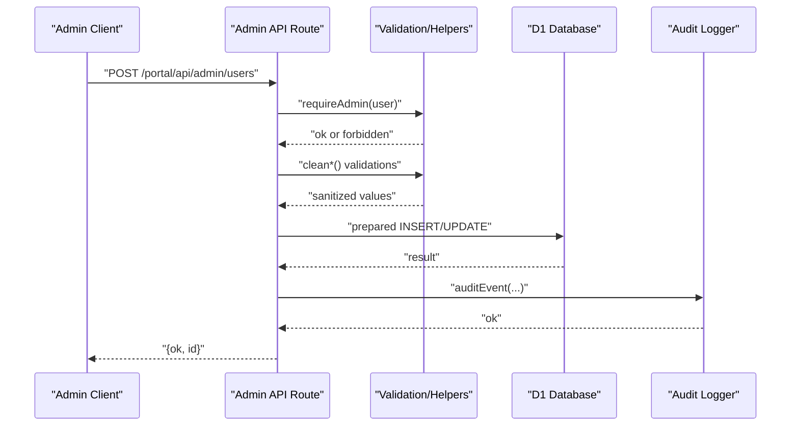

**Diagram sources**
- [users.js:12-174](file://src/pages/portal/api/admin/users.js#L12-L174)
- [admin.js:3-83](file://src/lib/server/admin.js#L3-L83)
- [audit.js:3-32](file://src/lib/server/audit.js#L3-L32)
- [bindings.js](file://src/lib/server/bindings.js)

## Detailed Component Analysis

### Audit Export Endpoint
- Method: GET
- URL: /portal/api/admin/audit-export
- Authentication: Requires a logged-in user; returns unauthorized if missing.
- Authorization: Requires role "admin"; returns forbidden otherwise.
- Query parameters:
  - category: one of auth, admin, finance, job, security, document (pattern-based filter)
  - outcome: one of success, failure, blocked
  - from: date in YYYY-MM-DD
  - to: date in YYYY-MM-DD
- Response: CSV stream with headers including identifiers, timestamps, actor info, event type, entity, outcome, and metadata.
- Limitation: Maximum 2000 rows returned.
- Audit: Records admin.audit_export with row count and filters.

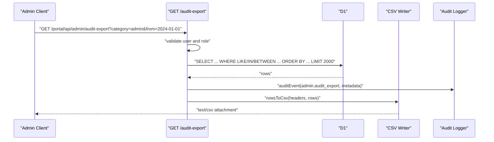

**Diagram sources**
- [audit-export.js:19-95](file://src/pages/portal/api/admin/audit-export.js#L19-L95)

**Section sources**
- [audit-export.js:1-100](file://src/pages/portal/api/admin/audit-export.js#L1-L100)

### Bulk Export Endpoint
- Method: GET
- URL: /portal/api/admin/export?type={users|sites|systems}
- Authentication: Requires a logged-in user; returns unauthorized if missing.
- Authorization: Requires role "admin"; returns forbidden otherwise.
- Query parameter:
  - type: one of users, sites, systems
- Response: CSV stream with predefined headers per type.
- Audit: Records admin.export.{type} with row count.

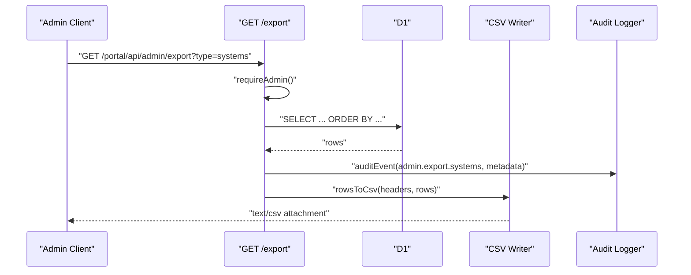

**Diagram sources**
- [export.js:33-59](file://src/pages/portal/api/admin/export.js#L33-L59)

**Section sources**
- [export.js:1-64](file://src/pages/portal/api/admin/export.js#L1-L64)

### Bulk Import Endpoint
- Method: POST
- URL: /portal/api/admin/import
- Authentication: Requires a logged-in user; returns unauthorized if missing.
- Authorization: Requires role "admin"; returns forbidden otherwise.
- Request body:
  - type: "sites" or "systems"
  - csv: CSV text (validated for length and structure)
- Validation:
  - Enforces row count cap (250 per request).
  - Validates fields per type (headers enforced).
- Response: JSON with ok flag, type, results array, and failures array.
- Audit: Records admin.import.{type} with rows and failures counts.

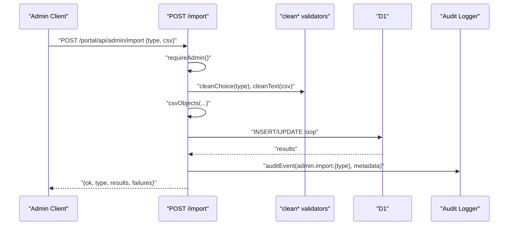

**Diagram sources**
- [import.js:128-161](file://src/pages/portal/api/admin/import.js#L128-L161)

**Section sources**
- [import.js:1-166](file://src/pages/portal/api/admin/import.js#L1-L166)

### User Administration Endpoint
- Method: POST
- URL: /portal/api/admin/users
- Authentication: Requires a logged-in user; returns unauthorized if missing.
- Authorization: Requires role "admin"; returns forbidden otherwise.
- Supported actions (via body.action):
  - create: creates a new user with hashed password and defaults.
  - update: updates profile, role, site mapping, activity, and MFA requirements.
  - deactivate: deactivates a user (self-deactivation blocked).
  - reset-link: generates a password reset token and records it.
  - reset-mfa: resets MFA for admin/finance users.
- Validation: Uses cleanText, cleanEmail, cleanChoice, cleanBoolean, cleanId, cleanDate.
- Audit: Records admin.user.{create|update|deactivate|reset_link|mfa_reset} with metadata.

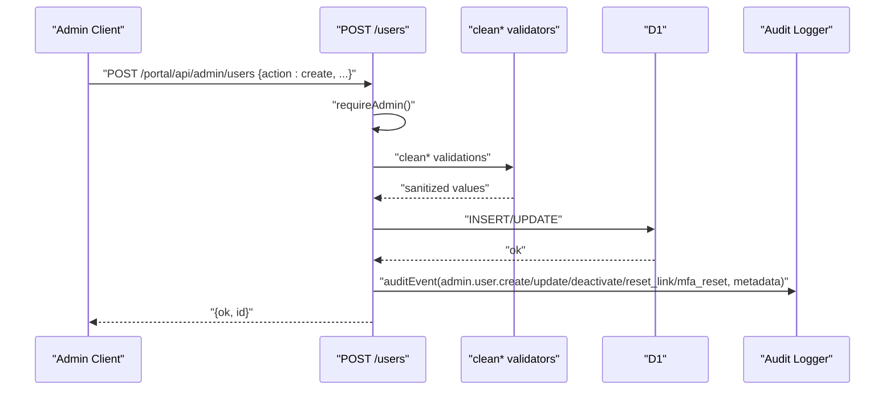

**Diagram sources**
- [users.js:12-174](file://src/pages/portal/api/admin/users.js#L12-L174)

**Section sources**
- [users.js:1-179](file://src/pages/portal/api/admin/users.js#L1-L179)

### System Administration Endpoint
- Method: POST
- URL: /portal/api/admin/systems
- Authentication: Requires a logged-in user; returns unauthorized if missing.
- Authorization: Requires role "admin"; returns forbidden otherwise.
- Body fields:
  - action: "create" or "update"
  - siteId, systemType ("Gas Suppression" | "Fire Detection"), coverageArea, manufacturer, modelReference, nextDueDate, serviceIntervalMonths
- Audit: Records admin.system.{create|update} with metadata.

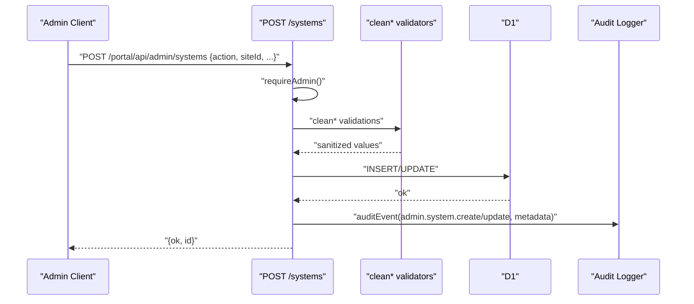

**Diagram sources**
- [systems.js:10-72](file://src/pages/portal/api/admin/systems.js#L10-L72)

**Section sources**
- [systems.js:1-77](file://src/pages/portal/api/admin/systems.js#L1-L77)

### Maintenance Requests Endpoint
- Method: POST
- URL: /portal/api/admin/maintenance-requests
- Authentication: Requires a logged-in user; returns unauthorized if missing.
- Authorization: Requires role "admin"; returns forbidden otherwise.
- Supported actions (via body.action):
  - updateStatus: updates status of a maintenance request.
  - scheduleDispatch: schedules a job linked to the request.
- Validation: Uses cleanId, cleanChoice, cleanDate.
- Audit: Records admin.maintenance_request.{update_status|schedule_dispatch} with metadata.

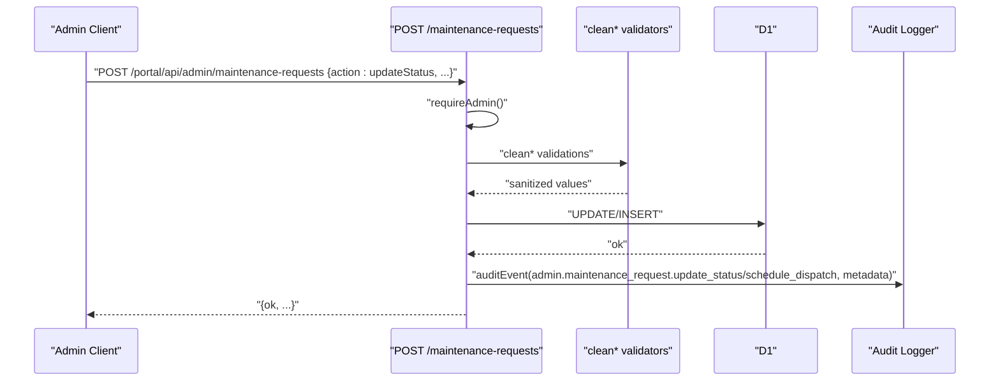

**Diagram sources**
- [maintenance-requests.js](file://src/pages/portal/api/admin/maintenance-requests.js)

**Section sources**
- [maintenance-requests.js](file://src/pages/portal/api/admin/maintenance-requests.js)

### Jobs Endpoint
- Method: POST
- URL: /portal/api/admin/jobs
- Authentication: Requires a logged-in user; returns unauthorized if missing.
- Authorization: Requires role "admin"; returns forbidden otherwise.
- Supported actions (via body.action):
  - markInvoiced: marks a job as invoiced.
- Validation: Uses cleanId.
- Audit: Records admin.job.mark_invoiced with metadata.

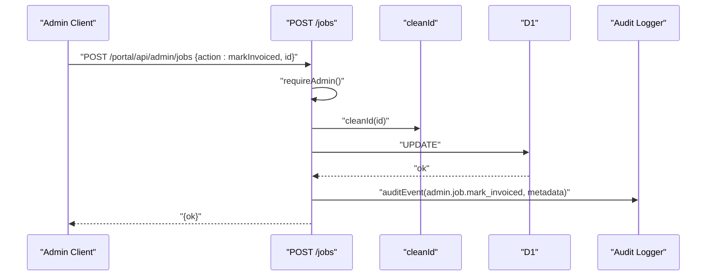

**Diagram sources**
- [jobs.js](file://src/pages/portal/api/admin/jobs.js)

**Section sources**
- [jobs.js](file://src/pages/portal/api/admin/jobs.js)

### Client Site Access Endpoint
- Method: POST
- URL: /portal/api/admin/client-site-access
- Authentication: Requires a logged-in user; returns unauthorized if missing.
- Authorization: Requires role "admin"; returns forbidden otherwise.
- Supported actions (via body.action):
  - grant: grants additional site access to a client user.
  - revoke: revokes previously granted access.
- Validation: Uses cleanId.
- Audit: Records admin.client_site_access.{grant|revoke} with metadata.

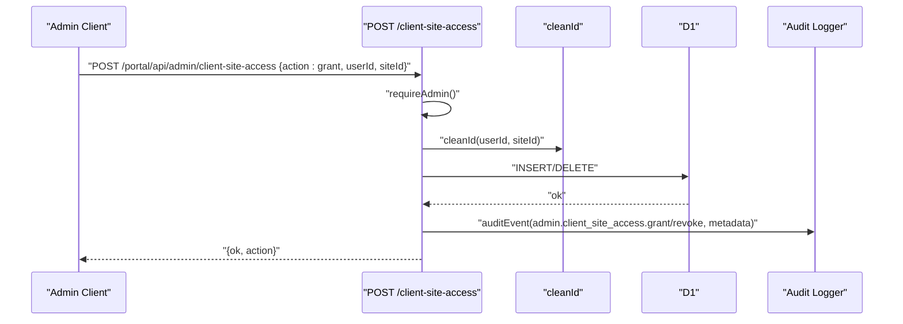

**Diagram sources**
- [client-site-access.js](file://src/pages/portal/api/admin/client-site-access.js)

**Section sources**
- [client-site-access.js](file://src/pages/portal/api/admin/client-site-access.js)

### Administrative Dashboards and Metrics
- Admin Dashboard (/portal/admin/dashboard):
  - Displays quick stats (active jobs, unassigned, overdue systems, open requests, missing docs).
  - Lists recent completed works, active dispatches, lifecycle due dates, client request queue, exceptions (overdue, missing docs, finance follow-up).
  - Uses SQL aggregates and joins to compute counts and lists.
- Operations (/portal/admin/operations):
  - Manages users, sites, systems, jobs, and client site access.
  - Provides CSV import/export links and forms.
  - Includes search and filter controls for each list.
- Planning (/portal/admin/planning):
  - Dispatch planner with scheduled/in-progress jobs.
  - Technician load snapshot.
  - Lifecycle due calendar with risk labels.
  - Open client requests queue.

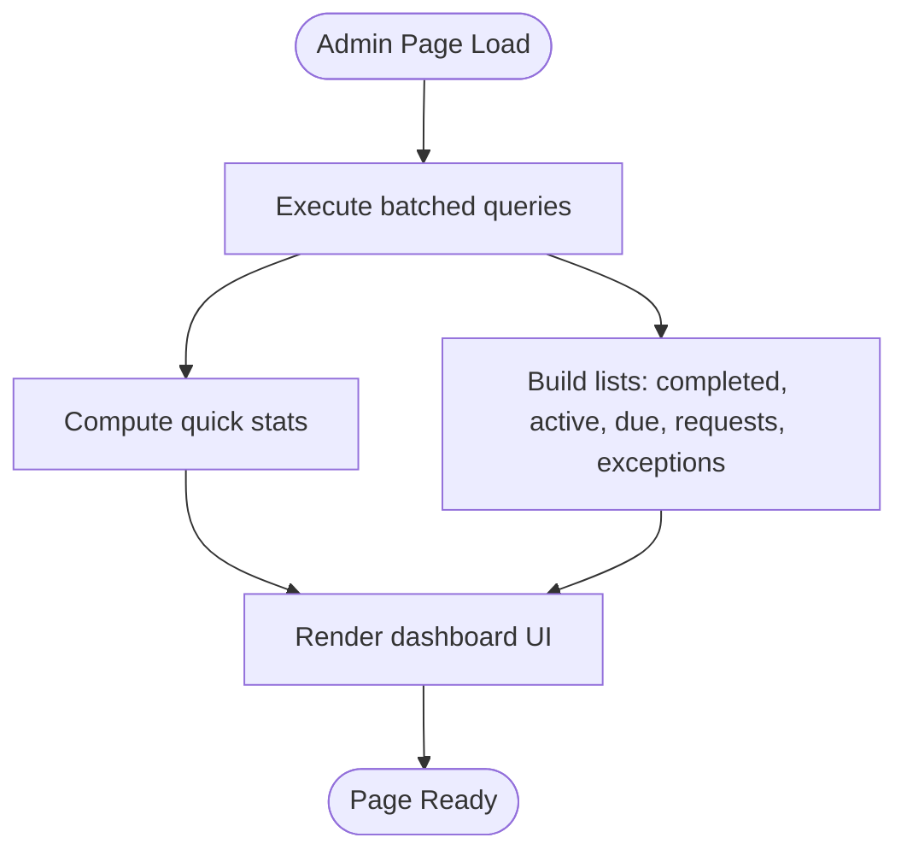

**Diagram sources**
- [dashboard.astro:34-136](file://src/pages/portal/admin/dashboard.astro#L34-L136)
- [operations.astro:20-74](file://src/pages/portal/admin/operations.astro#L20-L74)
- [planning.astro:42-139](file://src/pages/portal/admin/planning.astro#L42-L139)

**Section sources**
- [dashboard.astro:1-410](file://src/pages/portal/admin/dashboard.astro#L1-L410)
- [operations.astro:1-819](file://src/pages/portal/admin/operations.astro#L1-L819)
- [planning.astro:1-375](file://src/pages/portal/admin/planning.astro#L1-L375)

## Dependency Analysis
- Privilege enforcement: requireAdmin centralizes admin-only checks across endpoints.
- Input sanitization: clean* helpers validate and normalize request bodies.
- Audit logging: auditEvent writes standardized audit records with fingerprinting.
- Database access: getDatabase prepares statements; endpoints bind parameters safely.
- HTTP helpers: unified error/status responses.

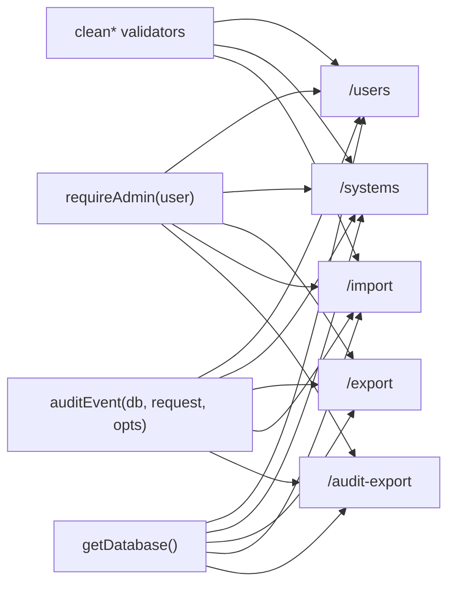

**Diagram sources**
- [admin.js:3-83](file://src/lib/server/admin.js#L3-L83)
- [audit.js:3-32](file://src/lib/server/audit.js#L3-L32)
- [bindings.js](file://src/lib/server/bindings.js)
- [users.js:1-179](file://src/pages/portal/api/admin/users.js#L1-L179)
- [systems.js:1-77](file://src/pages/portal/api/admin/systems.js#L1-L77)
- [export.js:1-64](file://src/pages/portal/api/admin/export.js#L1-L64)
- [import.js:1-166](file://src/pages/portal/api/admin/import.js#L1-L166)
- [audit-export.js:1-100](file://src/pages/portal/api/admin/audit-export.js#L1-L100)

**Section sources**
- [admin.js:1-83](file://src/lib/server/admin.js#L1-L83)
- [audit.js:1-33](file://src/lib/server/audit.js#L1-L33)
- [bindings.js](file://src/lib/server/bindings.js)
- [users.js:1-179](file://src/pages/portal/api/admin/users.js#L1-L179)
- [systems.js:1-77](file://src/pages/portal/api/admin/systems.js#L1-L77)
- [export.js:1-64](file://src/pages/portal/api/admin/export.js#L1-L64)
- [import.js:1-166](file://src/pages/portal/api/admin/import.js#L1-L166)
- [audit-export.js:1-100](file://src/pages/portal/api/admin/audit-export.js#L1-L100)

## Performance Considerations
- Audit export limits rows to 2000 to prevent large downloads.
- Import enforces a row cap (250 per request) to avoid overload.
- Batched queries in dashboards reduce round-trips.
- Prefer indexed columns in WHERE clauses (dates, foreign keys) for optimal performance.

## Troubleshooting Guide
Common errors and resolutions:
- Unauthorized: Ensure the session is authenticated.
- Forbidden: Confirm the user has role "admin".
- Bad request: Validate input types and lengths; check allowed choices and formats.
- Server error: Inspect server logs for database constraint violations or malformed CSV.

Audit trail:
- All admin actions are audited with actor, event type, entity, outcome, IP hash, and metadata. Use the audit export endpoint to download recent events for compliance reviews.

**Section sources**
- [http.js](file://src/lib/server/http.js)
- [audit.js:3-32](file://src/lib/server/audit.js#L3-L32)
- [audit-export.js:19-95](file://src/pages/portal/api/admin/audit-export.js#L19-L95)

## Conclusion
The System Administration APIs provide a secure, audited, and efficient interface for managing portal data and operations. Admins can export audit trails, bulk manage users and infrastructure, and monitor system health via dashboards. Robust input validation and centralized privilege checks ensure safe operation.

## Appendices

### Administrative Privileges
- Role requirement: admin
- Enforcement: requireAdmin returns forbidden for non-admins.

**Section sources**
- [admin.js:3-8](file://src/lib/server/admin.js#L3-L8)

### Audit Logging Schema
- Fields written for each event:
  - id, actor_user_id, actor_role, event_type, entity_type, entity_id, outcome, ip_hash, user_agent, metadata_json
- Metadata is truncated to 4000 characters.

**Section sources**
- [audit.js:3-32](file://src/lib/server/audit.js#L3-L32)

### Example Administrative Data Structures
- User creation payload:
  - action: "create"
  - name, email, role, siteId, password, forcePasswordChange, mfaRequired
- System creation payload:
  - action: "create"
  - siteId, systemType, coverageArea, manufacturer, modelReference, nextDueDate, serviceIntervalMonths
- Maintenance request scheduling payload:
  - action: "scheduleDispatch"
  - requestId, systemId, assignedTechnicianId, scheduledDate, jobType, siteNotes

**Section sources**
- [users.js:18-53](file://src/pages/portal/api/admin/users.js#L18-L53)
- [systems.js:16-55](file://src/pages/portal/api/admin/systems.js#L16-L55)
- [maintenance-requests.js](file://src/pages/portal/api/admin/maintenance-requests.js)

### Audit Export Filters
- category: auth, admin, finance, job, security, document
- outcome: success, failure, blocked
- from/to: date range in YYYY-MM-DD

**Section sources**
- [audit-export.js:8-49](file://src/pages/portal/api/admin/audit-export.js#L8-L49)

### Monitoring and Alert Integration Notes
- Use the audit export endpoint to periodically collect administrative events for SIEM ingestion.
- Combine dashboard metrics with external alerting to track overdue systems, unassigned jobs, and critical requests.

[No sources needed since this section provides general guidance]