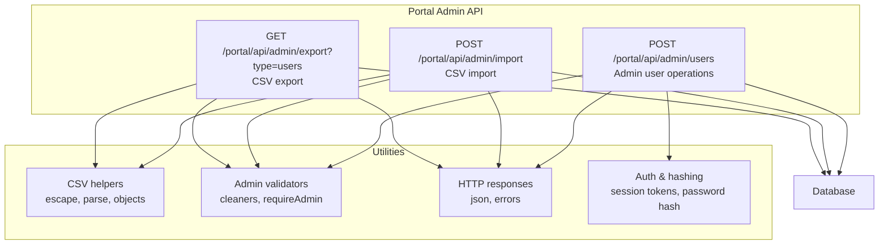
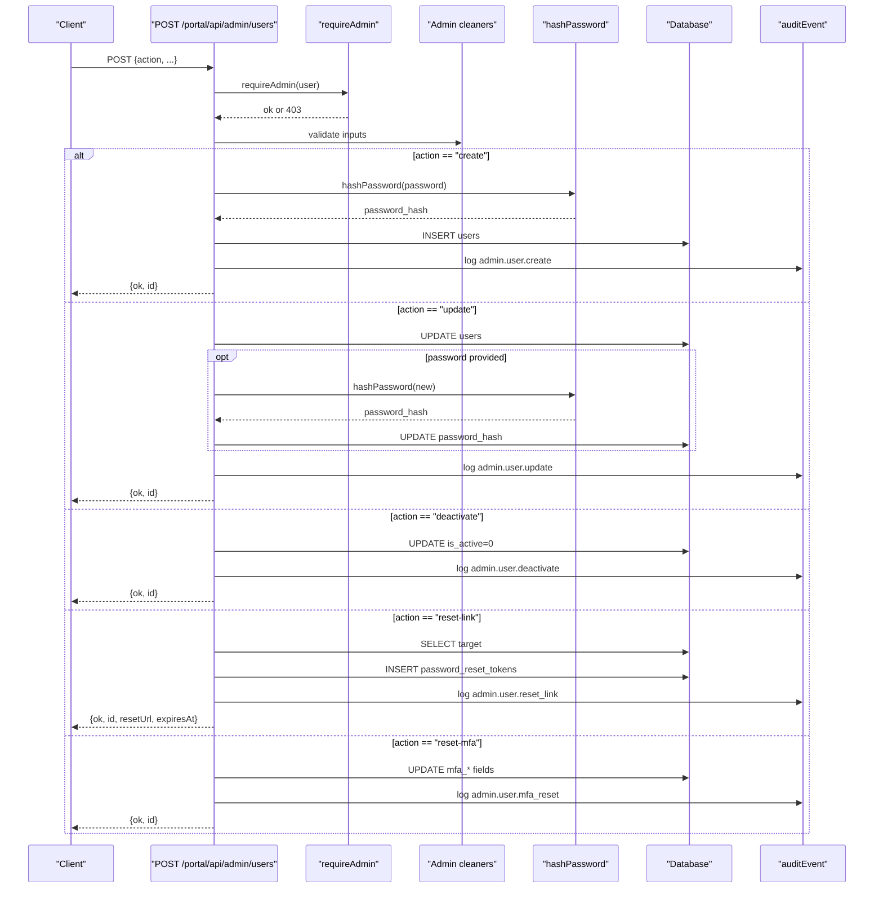
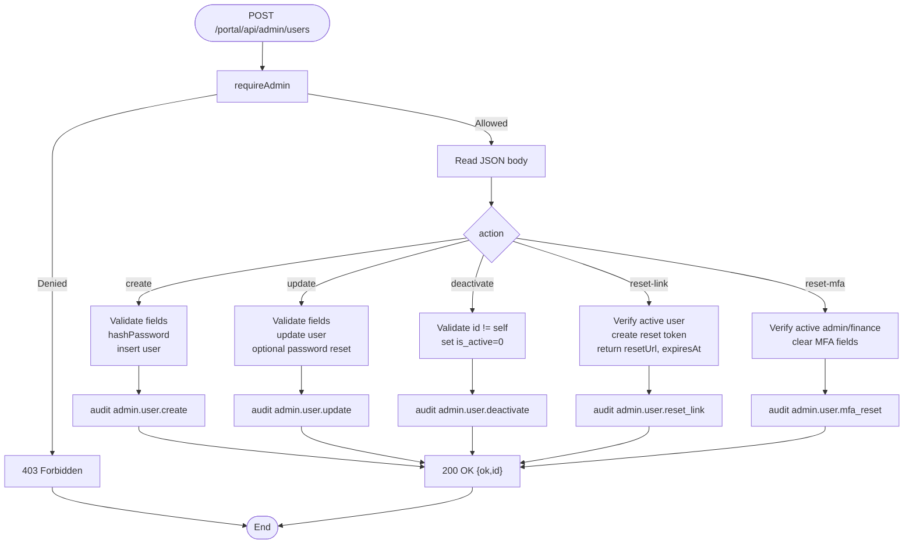
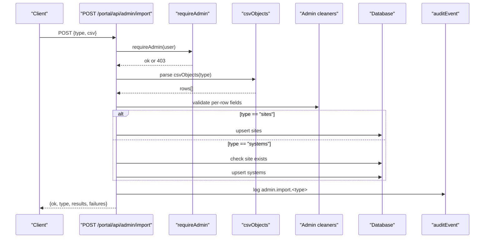
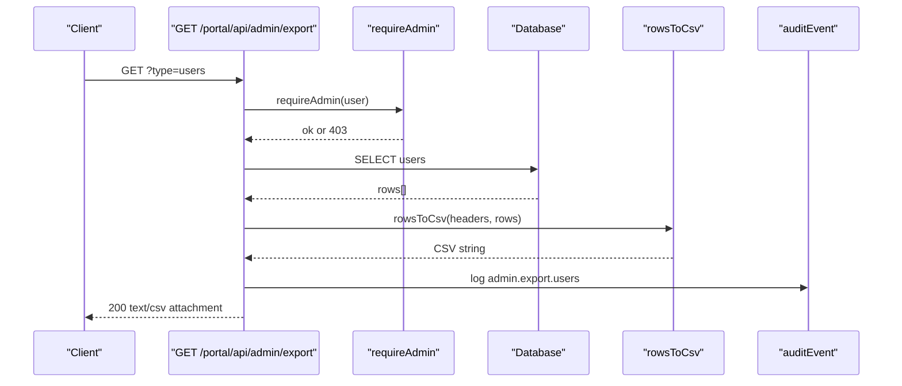
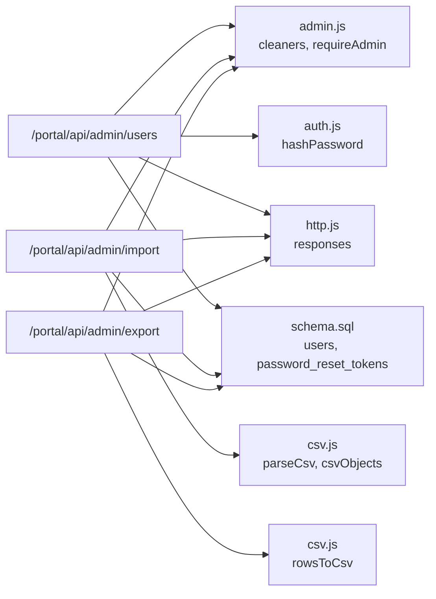

# User Management APIs

<cite>
**Referenced Files in This Document**
- [users.js](file://src/pages/portal/api/admin/users.js)
- [import.js](file://src/pages/portal/api/admin/import.js)
- [export.js](file://src/pages/portal/api/admin/export.js)
- [csv.js](file://src/lib/server/csv.js)
- [admin.js](file://src/lib/server/admin.js)
- [http.js](file://src/lib/server/http.js)
- [auth.js](file://src/lib/server/auth.js)
- [schema.sql](file://schema.sql)
- [0006_password_reset_tokens.sql](file://migrations/0006_password_reset_tokens.sql)
- [0007_user_mfa.sql](file://migrations/0007_user_mfa.sql)
</cite>

## Table of Contents
1. [Introduction](#introduction)
2. [Project Structure](#project-structure)
3. [Core Components](#core-components)
4. [Architecture Overview](#architecture-overview)
5. [Detailed Component Analysis](#detailed-component-analysis)
6. [Dependency Analysis](#dependency-analysis)
7. [Performance Considerations](#performance-considerations)
8. [Troubleshooting Guide](#troubleshooting-guide)
9. [Conclusion](#conclusion)
10. [Appendices](#appendices)

## Introduction
This document provides comprehensive API documentation for user management operations within the portal. It covers administrative endpoints for creating, updating, deactivating, and resetting user credentials, as well as CSV-based import and export of user data. It also documents user roles, permissions, and MFA-related controls, along with error handling patterns and validation rules.

## Project Structure
The user management APIs are implemented as Cloudflare Workers routes under the portal API namespace. Supporting utilities handle CSV parsing/formatting, administrative validations, and HTTP response/error formatting.

**Diagram sources**
- [users.js:12-178](file://src/pages/portal/api/admin/users.js#L12-L178)
- [import.js:128-165](file://src/pages/portal/api/admin/import.js#L128-L165)
- [export.js:33-63](file://src/pages/portal/api/admin/export.js#L33-L63)
- [csv.js:1-71](file://src/lib/server/csv.js#L1-L71)
- [admin.js:1-83](file://src/lib/server/admin.js#L1-L83)
- [http.js:1-47](file://src/lib/server/http.js#L1-L47)
- [auth.js:159-178](file://src/lib/server/auth.js#L159-L178)

**Section sources**
- [users.js:1-179](file://src/pages/portal/api/admin/users.js#L1-L179)
- [import.js:1-166](file://src/pages/portal/api/admin/import.js#L1-L166)
- [export.js:1-64](file://src/pages/portal/api/admin/export.js#L1-L64)
- [csv.js:1-71](file://src/lib/server/csv.js#L1-L71)
- [admin.js:1-83](file://src/lib/server/admin.js#L1-L83)
- [http.js:1-47](file://src/lib/server/http.js#L1-L47)
- [auth.js:159-178](file://src/lib/server/auth.js#L159-L178)

## Core Components
- Admin user operations endpoint: POST /portal/api/admin/users
- CSV import endpoint: POST /portal/api/admin/import
- CSV export endpoint: GET /portal/api/admin/export?type=users
- Supporting utilities: CSV parsing/formatting, admin validators, HTTP error responses, password hashing

**Section sources**
- [users.js:12-178](file://src/pages/portal/api/admin/users.js#L12-L178)
- [import.js:128-165](file://src/pages/portal/api/admin/import.js#L128-L165)
- [export.js:33-63](file://src/pages/portal/api/admin/export.js#L33-L63)
- [csv.js:1-71](file://src/lib/server/csv.js#L1-L71)
- [admin.js:1-83](file://src/lib/server/admin.js#L1-L83)
- [http.js:1-47](file://src/lib/server/http.js#L1-L47)
- [auth.js:159-178](file://src/lib/server/auth.js#L159-L178)

## Architecture Overview
The user management APIs enforce admin-only access, validate inputs, apply business rules, update the database, and emit audit events. CSV import/export leverages shared CSV utilities and enforces strict header and row limits.

**Diagram sources**
- [users.js:12-178](file://src/pages/portal/api/admin/users.js#L12-L178)
- [admin.js:3-8](file://src/lib/server/admin.js#L3-L8)
- [auth.js:159-178](file://src/lib/server/auth.js#L159-L178)

## Detailed Component Analysis

### Admin User Operations: POST /portal/api/admin/users
Purpose: Perform administrative actions on users (create, update, deactivate, reset password link, reset MFA).

- Authentication and authorization
  - Requires admin role via requireAdmin.
  - Returns 403 Forbidden for non-admins.

- Supported actions (body.action)
  - create: Creates a new user with hashed password and optional MFA requirements.
  - update: Updates user profile, role, site association, activity status, and MFA requirements. Optionally resets password.
  - deactivate: Deactivates a user (self-deactivation blocked).
  - reset-link: Generates a password reset token and returns a reset URL with expiry.
  - reset-mfa: Resets MFA for eligible roles (admin, finance).

- Request schema (common fields)
  - id: string (required for update/deactivate/reset-link/reset-mfa)
  - action: string (one of create, update, deactivate, reset-link, reset-mfa)
  - name: string (2–160 chars)
  - email: string (valid email)
  - role: string (one of tech, admin, client, finance)
  - siteId: string (optional)
  - isActive: boolean-like (0/1)
  - forcePasswordChange: boolean-like (0/1)
  - mfaRequired: boolean-like (0/1) (applies to admin, finance)
  - password: string (14–200 chars) — only when resetting password during update

- Response formats
  - Success: { ok: true, id }
  - Validation errors: 400 Bad Request with { ok: false, error: "bad_request", message, details }
  - Unauthorized/Forbidden: 401/403 with { ok: false, error, message }
  - Server errors: 500 with { ok: false, error: "server_error", message }

- Administrative constraints
  - Self-deactivation is blocked.
  - Password reset link requires active user.
  - MFA reset restricted to admin and finance roles.

- Audit logging
  - Emits audit events for each action with relevant metadata.

**Diagram sources**
- [users.js:12-178](file://src/pages/portal/api/admin/users.js#L12-L178)
- [admin.js:3-8](file://src/lib/server/admin.js#L3-L8)
- [auth.js:159-178](file://src/lib/server/auth.js#L159-L178)

**Section sources**
- [users.js:12-178](file://src/pages/portal/api/admin/users.js#L12-L178)
- [admin.js:3-8](file://src/lib/server/admin.js#L3-L8)
- [http.js:22-32](file://src/lib/server/http.js#L22-L32)
- [auth.js:159-178](file://src/lib/server/auth.js#L159-L178)

### CSV Import: POST /portal/api/admin/import
Purpose: Bulk import of site/system data via CSV. Supports up to 250 rows per request.

- Supported types
  - sites: Imports/updates site records.
  - systems: Imports/updates system records with site relationship checks.

- Request schema
  - type: string (sites | systems)
  - csv: string (CSV text; validated for header presence and row count limit)

- Sites CSV headers
  - id, owner_company_name, physical_address, site_contact_person, site_contact_email, site_contact_phone, billing_emails

- Systems CSV headers
  - id, site_id, system_type (Gas Suppression | Fire Detection), coverage_area, manufacturer, model_reference, next_due_date (YYYY-MM-DD)

- Row processing
  - Validates each row against expected headers.
  - Enforces per-field constraints (lengths, formats, choices).
  - Performs upsert (insert/update) per row.
  - Limits batch to 250 rows.

- Response format
  - { ok: boolean, type: string, results: array of { row, id?, ok, action?, message? }, failures: array of failures }

- Audit logging
  - Records import event with row and failure counts.

**Diagram sources**
- [import.js:128-165](file://src/pages/portal/api/admin/import.js#L128-L165)
- [csv.js:57-70](file://src/lib/server/csv.js#L57-L70)
- [admin.js:18-82](file://src/lib/server/admin.js#L18-L82)

**Section sources**
- [import.js:128-165](file://src/pages/portal/api/admin/import.js#L128-L165)
- [csv.js:15-70](file://src/lib/server/csv.js#L15-L70)
- [admin.js:18-82](file://src/lib/server/admin.js#L18-L82)
- [http.js:22-32](file://src/lib/server/http.js#L22-L32)

### CSV Export: GET /portal/api/admin/export?type=users
Purpose: Download user data as CSV.

- Supported types
  - users: Exports user records with selected fields.

- Query parameter
  - type: string (users | sites | systems)

- Response
  - 200 OK with CSV content and Content-Disposition attachment header.
  - Headers include content-type text/csv and cache-control no-store.

- Audit logging
  - Records export event with row count.

**Diagram sources**
- [export.js:33-63](file://src/pages/portal/api/admin/export.js#L33-L63)
- [csv.js:8-13](file://src/lib/server/csv.js#L8-L13)
- [admin.js:3-8](file://src/lib/server/admin.js#L3-L8)

**Section sources**
- [export.js:33-63](file://src/pages/portal/api/admin/export.js#L33-L63)
- [csv.js:8-13](file://src/lib/server/csv.js#L8-L13)
- [http.js:22-32](file://src/lib/server/http.js#L22-L32)

## Dependency Analysis
- Endpoint-to-module dependencies
  - POST /portal/api/admin/users depends on admin validators, password hashing, and audit logging.
  - POST /portal/api/admin/import depends on CSV parsing and admin validators.
  - GET /portal/api/admin/export depends on CSV formatting and admin validators.
- Database schema dependencies
  - Users table defines roles, MFA flags, and constraints.
  - Password reset tokens table supports password reset link generation.
  - Indexes optimize lookups for users and related entities.

**Diagram sources**
- [users.js:1-179](file://src/pages/portal/api/admin/users.js#L1-L179)
- [import.js:1-166](file://src/pages/portal/api/admin/import.js#L1-L166)
- [export.js:1-64](file://src/pages/portal/api/admin/export.js#L1-L64)
- [admin.js:1-83](file://src/lib/server/admin.js#L1-L83)
- [auth.js:159-178](file://src/lib/server/auth.js#L159-L178)
- [csv.js:1-71](file://src/lib/server/csv.js#L1-L71)
- [http.js:1-47](file://src/lib/server/http.js#L1-L47)
- [schema.sql:3-20](file://schema.sql#L3-L20)
- [0006_password_reset_tokens.sql:1-13](file://migrations/0006_password_reset_tokens.sql#L1-L13)
- [0007_user_mfa.sql:1-7](file://migrations/0007_user_mfa.sql#L1-L7)

**Section sources**
- [users.js:1-179](file://src/pages/portal/api/admin/users.js#L1-L179)
- [import.js:1-166](file://src/pages/portal/api/admin/import.js#L1-L166)
- [export.js:1-64](file://src/pages/portal/api/admin/export.js#L1-L64)
- [admin.js:1-83](file://src/lib/server/admin.js#L1-L83)
- [auth.js:159-178](file://src/lib/server/auth.js#L159-L178)
- [csv.js:1-71](file://src/lib/server/csv.js#L1-L71)
- [http.js:1-47](file://src/lib/server/http.js#L1-L47)
- [schema.sql:3-20](file://schema.sql#L3-L20)
- [0006_password_reset_tokens.sql:1-13](file://migrations/0006_password_reset_tokens.sql#L1-L13)
- [0007_user_mfa.sql:1-7](file://migrations/0007_user_mfa.sql#L1-L7)

## Performance Considerations
- Batch limits
  - CSV import restricts rows per request to 250 to prevent overload.
- Index usage
  - Database indexes on users and related tables support efficient lookups and updates.
- Audit overhead
  - Each operation emits an audit event; ensure audit logging does not become a bottleneck under high load.

[No sources needed since this section provides general guidance]

## Troubleshooting Guide
Common error scenarios and handling:

- Validation failures
  - Symptom: 400 Bad Request with error details.
  - Causes: Invalid fields, out-of-range lengths, invalid formats, missing required fields.
  - Resolution: Correct payload according to field constraints.

- Authorization failures
  - Symptom: 401 Unauthorized or 403 Forbidden.
  - Causes: Non-admin user attempting admin-only operations.
  - Resolution: Authenticate as admin.

- Server errors
  - Symptom: 500 Server Error.
  - Causes: Unexpected runtime exceptions.
  - Resolution: Retry after checking logs.

- CSV import issues
  - Symptom: Failure messages per row or 400 for malformed CSV.
  - Causes: Wrong headers, exceeding row limit, invalid site references, or constraint violations.
  - Resolution: Validate CSV against expected headers and row limits.

- Password reset link restrictions
  - Symptom: 400 Bad Request when requesting reset link.
  - Causes: Target user inactive or not found.
  - Resolution: Ensure user is active and exists.

**Section sources**
- [http.js:22-46](file://src/lib/server/http.js#L22-L46)
- [users.js:169-173](file://src/pages/portal/api/admin/users.js#L169-L173)
- [import.js:156-160](file://src/pages/portal/api/admin/import.js#L156-L160)

## Conclusion
The user management APIs provide a robust, audited, and validated interface for administrative user operations, including creation, updates, deactivation, password reset link generation, and MFA reset. CSV import/export capabilities enable efficient bulk data handling with strict validation and row limits. Adhering to the documented schemas and constraints ensures reliable operation and maintainable integrations.

[No sources needed since this section summarizes without analyzing specific files]

## Appendices

### Data Model: Users
- Fields and constraints
  - id: primary key, unique identifier
  - name: text, 2–160 chars
  - email: unique, lowercase, valid format
  - password_hash: text, PBKDF2 SHA-256 hash
  - role: enum (tech, admin, client, finance)
  - site_id: references sites.id
  - is_active: boolean-like (0/1)
  - force_password_change: boolean-like (0/1)
  - mfa_required: boolean-like (0/1)
  - mfa_enabled: boolean-like (0/1)
  - mfa_secret_encrypted: text
  - mfa_enabled_at: text
  - password_changed_at: text
  - last_login_at: text
  - created_at, updated_at: timestamps

- Related tables
  - password_reset_tokens: stores reset tokens for users
  - client_site_access: grants site access to client users
  - audit_events: tracks administrative actions

**Section sources**
- [schema.sql:3-20](file://schema.sql#L3-L20)
- [0006_password_reset_tokens.sql:1-13](file://migrations/0006_password_reset_tokens.sql#L1-L13)
- [0007_user_mfa.sql:1-7](file://migrations/0007_user_mfa.sql#L1-L7)

### API Reference Summary

- POST /portal/api/admin/users
  - Method: POST
  - Auth: admin required
  - Body fields: action, id, name, email, role, siteId, isActive, forcePasswordChange, mfaRequired, password
  - Responses: 200 OK, 400 Bad Request, 403 Forbidden, 500 Server Error

- POST /portal/api/admin/import
  - Method: POST
  - Auth: admin required
  - Body fields: type (sites|systems), csv
  - Limit: up to 250 rows per request
  - Responses: 200 OK with results, 400 Bad Request, 403 Forbidden, 500 Server Error

- GET /portal/api/admin/export?type=users
  - Method: GET
  - Auth: admin required
  - Query: type (users|sites|systems)
  - Responses: 200 OK CSV, 400 Bad Request, 403 Forbidden

**Section sources**
- [users.js:12-178](file://src/pages/portal/api/admin/users.js#L12-L178)
- [import.js:128-165](file://src/pages/portal/api/admin/import.js#L128-L165)
- [export.js:33-63](file://src/pages/portal/api/admin/export.js#L33-L63)
- [http.js:22-32](file://src/lib/server/http.js#L22-L32)