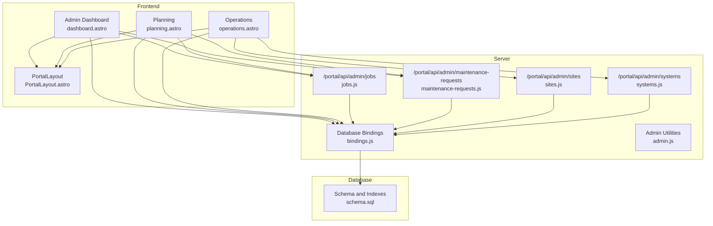
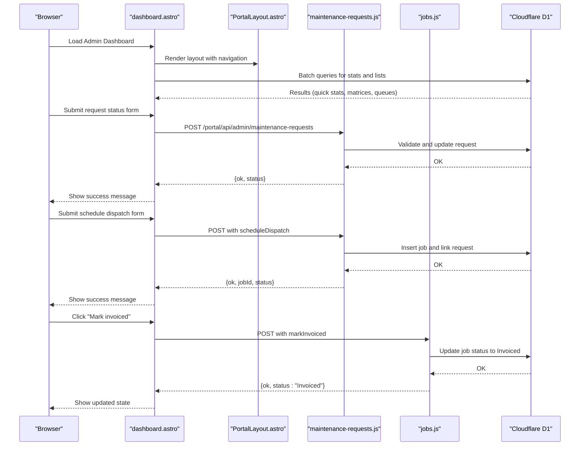
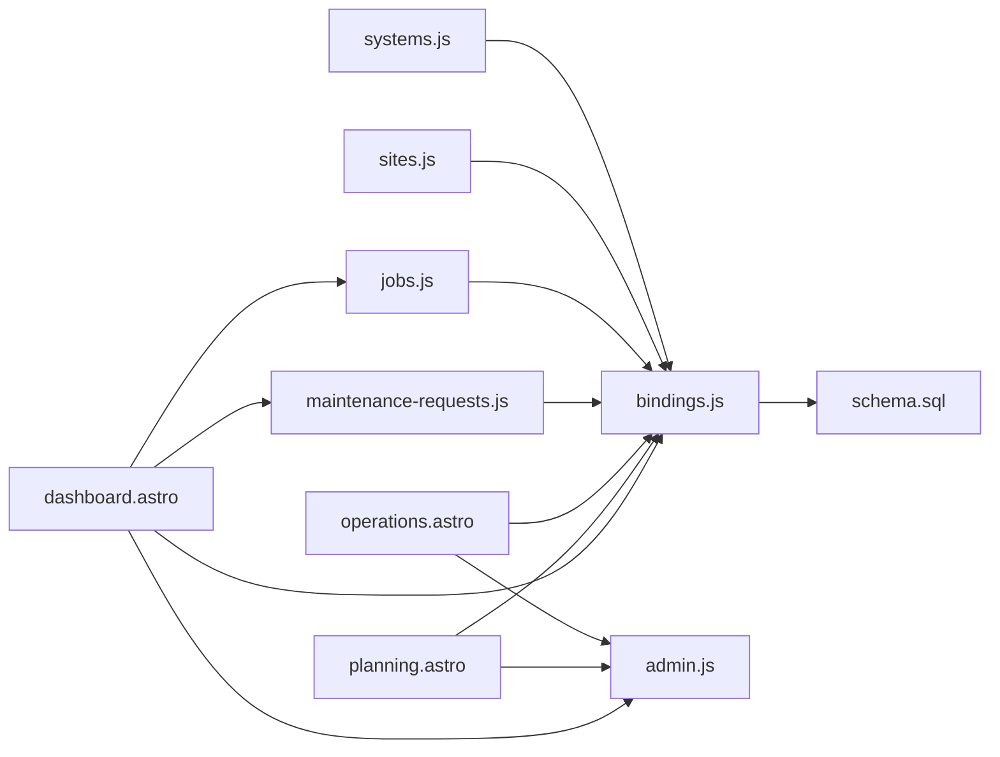

# Admin Dashboard

<cite>
**Referenced Files in This Document**
- [dashboard.astro](file://src/pages/portal/admin/dashboard.astro)
- [planning.astro](file://src/pages/portal/admin/planning.astro)
- [operations.astro](file://src/pages/portal/admin/operations.astro)
- [jobs.js](file://src/pages/portal/api/admin/jobs.js)
- [maintenance-requests.js](file://src/pages/portal/api/admin/maintenance-requests.js)
- [sites.js](file://src/pages/portal/api/admin/sites.js)
- [systems.js](file://src/pages/portal/api/admin/systems.js)
- [admin.js](file://src/lib/server/admin.js)
- [bindings.js](file://src/lib/server/bindings.js)
- [PortalLayout.astro](file://src/layouts/portal/PortalLayout.astro)
- [schema.sql](file://schema.sql)
</cite>

## Table of Contents
1. [Introduction](#introduction)
2. [Project Structure](#project-structure)
3. [Core Components](#core-components)
4. [Architecture Overview](#architecture-overview)
5. [Detailed Component Analysis](#detailed-component-analysis)
6. [Dependency Analysis](#dependency-analysis)
7. [Performance Considerations](#performance-considerations)
8. [Troubleshooting Guide](#troubleshooting-guide)
9. [Conclusion](#conclusion)
10. [Appendices](#appendices)

## Introduction
This document describes the Admin Dashboard functionality that provides operational oversight for dispatch and lifecycle management. It covers:
- The operational overview interface displaying key metrics (active jobs, unassigned jobs, overdue systems, open requests, missing documentation)
- The dispatch matrix (completed works, active dispatches, lifecycle due dates)
- The client request queue with priority handling and automated scheduling workflows
- The exception queue for overdue systems, missing documentation, and finance follow-up tracking
- Practical examples of navigation, metric interpretation, and administrative decision-making
- Real-time data visualization and integration with Cloudflare D1 database queries

## Project Structure
The Admin Dashboard is implemented as an Astro page that renders a real-time dashboard and integrates with server endpoints for administrative actions. Supporting components include:
- Admin dashboard page (dashboard rendering and client-side interactions)
- Planning page (dispatch load and lifecycle calendar)
- Operations page (bulk administration)
- Admin API endpoints (jobs, maintenance requests, sites, systems)
- Shared server utilities (validation, database bindings)
- Database schema (tables, indexes, triggers)

**Diagram sources**
- [dashboard.astro:1-395](file://src/pages/portal/admin/dashboard.astro#L1-L395)
- [planning.astro:1-375](file://src/pages/portal/admin/planning.astro#L1-L375)
- [operations.astro:1-808](file://src/pages/portal/admin/operations.astro#L1-L808)
- [jobs.js:1-96](file://src/pages/portal/api/admin/jobs.js#L1-L96)
- [maintenance-requests.js:1-102](file://src/pages/portal/api/admin/maintenance-requests.js#L1-L102)
- [sites.js:1-72](file://src/pages/portal/api/admin/sites.js#L1-L72)
- [systems.js:1-77](file://src/pages/portal/api/admin/systems.js#L1-L77)
- [bindings.js:1-42](file://src/lib/server/bindings.js#L1-L42)
- [schema.sql:1-245](file://schema.sql#L1-L245)

**Section sources**
- [dashboard.astro:1-395](file://src/pages/portal/admin/dashboard.astro#L1-L395)
- [planning.astro:1-375](file://src/pages/portal/admin/planning.astro#L1-L375)
- [operations.astro:1-808](file://src/pages/portal/admin/operations.astro#L1-L808)
- [jobs.js:1-96](file://src/pages/portal/api/admin/jobs.js#L1-L96)
- [maintenance-requests.js:1-102](file://src/pages/portal/api/admin/maintenance-requests.js#L1-L102)
- [sites.js:1-72](file://src/pages/portal/api/admin/sites.js#L1-L72)
- [systems.js:1-77](file://src/pages/portal/api/admin/systems.js#L1-L77)
- [bindings.js:1-42](file://src/lib/server/bindings.js#L1-L42)
- [schema.sql:1-245](file://schema.sql#L1-L245)

## Core Components
- Admin Dashboard page: Renders quick stats, dispatch matrix, client request queue, and exception queue. Handles client-side actions via POST to admin API endpoints.
- Planning page: Provides dispatch load, technician capacity, lifecycle due calendar, and open client requests.
- Operations page: Bulk administration for users, sites, systems, and client site access; CSV import/export.
- Admin API endpoints: Enforce admin role, validate inputs, and perform CRUD operations with audit events.
- Database bindings: Provide access to Cloudflare D1 and R2 with runtime checks.
- Schema: Defines tables, constraints, indexes, and triggers supporting the dashboard queries.

**Section sources**
- [dashboard.astro:1-395](file://src/pages/portal/admin/dashboard.astro#L1-L395)
- [planning.astro:1-375](file://src/pages/portal/admin/planning.astro#L1-L375)
- [operations.astro:1-808](file://src/pages/portal/admin/operations.astro#L1-L808)
- [jobs.js:1-96](file://src/pages/portal/api/admin/jobs.js#L1-L96)
- [maintenance-requests.js:1-102](file://src/pages/portal/api/admin/maintenance-requests.js#L1-L102)
- [sites.js:1-72](file://src/pages/portal/api/admin/sites.js#L1-L72)
- [systems.js:1-77](file://src/pages/portal/api/admin/systems.js#L1-L77)
- [bindings.js:1-42](file://src/lib/server/bindings.js#L1-L42)
- [schema.sql:1-245](file://schema.sql#L1-L245)

## Architecture Overview
The Admin Dashboard integrates frontend rendering with server-side APIs and database queries. The frontend uses Astro components and vanilla JavaScript to:
- Fetch dashboard data via database batch queries
- Update maintenance request status
- Schedule dispatches from client requests
- Mark jobs as invoiced

The backend enforces admin-only access, validates inputs, executes SQL statements, and logs audit events.

**Diagram sources**
- [dashboard.astro:1-395](file://src/pages/portal/admin/dashboard.astro#L1-L395)
- [maintenance-requests.js:1-102](file://src/pages/portal/api/admin/maintenance-requests.js#L1-L102)
- [jobs.js:1-96](file://src/pages/portal/api/admin/jobs.js#L1-L96)
- [PortalLayout.astro:1-108](file://src/layouts/portal/PortalLayout.astro#L1-L108)

## Detailed Component Analysis

### Admin Dashboard Page
The dashboard page performs:
- Batch database queries to compute quick stats and populate matrices and queues
- Renders three matrices: completed works, active dispatches, lifecycle due dates
- Presents client request queue with priority-aware ordering and inline scheduling forms
- Displays exception queue: overdue systems, missing documentation, and finance follow-ups
- Adds client-side handlers to update request status, schedule dispatches, and mark jobs invoiced

Key behaviors:
- Quick stats: active jobs, unassigned jobs, overdue systems, open requests, missing documents
- Dispatch matrix: recent completed works, active jobs, upcoming lifecycle due dates
- Client request queue: priority order, status dropdown, schedule dispatch form
- Exception queue: overdue systems, missing documentation, finance follow-up grouped by site

Practical examples:
- Navigate to Admin Matrix from the header menu
- Interpret quick stats to identify unassigned jobs and overdue systems
- Update a request’s status using the inline dropdown
- Schedule a dispatch directly from a request card
- Mark a job as invoiced after completion

**Section sources**
- [dashboard.astro:1-395](file://src/pages/portal/admin/dashboard.astro#L1-L395)

### Dispatch Matrix Details
The dispatch matrix consists of three lists:
- Completed works: recent jobs with status Completed or Invoiced, showing client, system, and completion timestamp
- Active dispatches: current Scheduled and In Progress jobs, showing client, status, technician, and scheduled date
- Lifecycle due dates: upcoming systems due for service, ordered by next due date

These lists are populated by targeted queries and capped to manageable sizes for real-time rendering.

**Section sources**
- [dashboard.astro:38-118](file://src/pages/portal/admin/dashboard.astro#L38-L118)

### Client Request Queue Management
The client request queue:
- Filters maintenance_requests with status New or Reviewing and orders by priority (Critical, Urgent, Routine) then creation time
- Displays request subject, type, coverage area, message, and optional linked job
- Provides inline status update form and schedule dispatch form when not linked
- On schedule dispatch, creates a new job and links it to the request atomically

Priority handling:
- Priority values are validated against allowed set
- Critical requests are prioritized in the queue

Automated scheduling workflow:
- Validates system belongs to the same site as the request
- Inserts a new job with status Scheduled
- Updates the request to status Scheduled and stores the linked job ID

**Section sources**
- [dashboard.astro:67-81](file://src/pages/portal/admin/dashboard.astro#L67-L81)
- [dashboard.astro:243-268](file://src/pages/portal/admin/dashboard.astro#L243-L268)
- [maintenance-requests.js:10-96](file://src/pages/portal/api/admin/maintenance-requests.js#L10-L96)

### Exception Queue
The exception queue groups three categories:
- Overdue systems: systems whose next due date is in the past
- Missing documentation: jobs completed or invoiced without documentation_path
- Finance follow-up: aggregated financial records grouped by site with pending or unpaid status

These lists are used to highlight operational risks and follow-up obligations.

**Section sources**
- [dashboard.astro:91-118](file://src/pages/portal/admin/dashboard.astro#L91-L118)

### Admin API Endpoints
- Jobs endpoint
  - Action: markInvoiced (only Completed jobs)
  - Action: create/update job with validations for system, technician, date, status, type, and notes
  - Audit: logs admin job events
- Maintenance Requests endpoint
  - Action: updateStatus (with allowed statuses)
  - Action: scheduleDispatch (creates job, links request, validates system-site association)
  - Audit: logs maintenance request events
- Sites endpoint
  - Action: create/update site with validations for owner company, address, contacts, billing emails
  - Audit: logs site events
- Systems endpoint
  - Action: create/update system with validations for type, coverage area, dates, intervals
  - Audit: logs system events

Validation utilities:
- Cleaners enforce field constraints (text length, date format, allowed choices, numeric ranges)
- Role enforcement ensures only admin users can call these endpoints

**Section sources**
- [jobs.js:10-96](file://src/pages/portal/api/admin/jobs.js#L10-L96)
- [maintenance-requests.js:10-96](file://src/pages/portal/api/admin/maintenance-requests.js#L10-L96)
- [sites.js:8-67](file://src/pages/portal/api/admin/sites.js#L8-L67)
- [systems.js:10-72](file://src/pages/portal/api/admin/systems.js#L10-L72)
- [admin.js:10-83](file://src/lib/server/admin.js#L10-L83)

### Planning and Operations Pages
- Planning page
  - Aggregates job, system, and request metrics
  - Lists active schedules, technician load, lifecycle due calendar, and open client requests
  - Provides filtering for dispatch list and lifecycle list
- Operations page
  - Bulk administration for users, sites, systems, and client site access
  - CSV import/export for controlled data updates
  - Inline forms with client-side validation and submission handling

**Section sources**
- [planning.astro:42-139](file://src/pages/portal/admin/planning.astro#L42-L139)
- [operations.astro:19-73](file://src/pages/portal/admin/operations.astro#L19-L73)

### Database Integration and Schema
- Database bindings provide access to Cloudflare D1 and R2 with runtime checks
- Schema defines core entities: users, sites, systems, jobs, financial_records, maintenance_requests, and audit trails
- Indexes support common filters and joins used by the dashboard queries
- Triggers maintain updated_at timestamps for auditability

**Section sources**
- [bindings.js:18-26](file://src/lib/server/bindings.js#L18-L26)
- [schema.sql:3-245](file://schema.sql#L3-L245)

## Dependency Analysis
The Admin Dashboard depends on:
- Database bindings for D1 access
- Admin utilities for input validation and role checks
- Server endpoints for write operations and audit logging
- Frontend layout for navigation and CSRF token injection

**Diagram sources**
- [dashboard.astro:1-395](file://src/pages/portal/admin/dashboard.astro#L1-L395)
- [planning.astro:1-375](file://src/pages/portal/admin/planning.astro#L1-L375)
- [operations.astro:1-808](file://src/pages/portal/admin/operations.astro#L1-L808)
- [jobs.js:1-96](file://src/pages/portal/api/admin/jobs.js#L1-L96)
- [maintenance-requests.js:1-102](file://src/pages/portal/api/admin/maintenance-requests.js#L1-L102)
- [sites.js:1-72](file://src/pages/portal/api/admin/sites.js#L1-L72)
- [systems.js:1-77](file://src/pages/portal/api/admin/systems.js#L1-L77)
- [bindings.js:1-42](file://src/lib/server/bindings.js#L1-L42)
- [schema.sql:1-245](file://schema.sql#L1-L245)

**Section sources**
- [dashboard.astro:1-395](file://src/pages/portal/admin/dashboard.astro#L1-L395)
- [planning.astro:1-375](file://src/pages/portal/admin/planning.astro#L1-L375)
- [operations.astro:1-808](file://src/pages/portal/admin/operations.astro#L1-L808)
- [jobs.js:1-96](file://src/pages/portal/api/admin/jobs.js#L1-L96)
- [maintenance-requests.js:1-102](file://src/pages/portal/api/admin/maintenance-requests.js#L1-L102)
- [sites.js:1-72](file://src/pages/portal/api/admin/sites.js#L1-L72)
- [systems.js:1-77](file://src/pages/portal/api/admin/systems.js#L1-L77)
- [bindings.js:1-42](file://src/lib/server/bindings.js#L1-L42)
- [schema.sql:1-245](file://schema.sql#L1-L245)

## Performance Considerations
- Batch queries: The dashboard uses db.batch to fetch multiple aggregates and lists in parallel, reducing round-trips
- Indexes: Strategic indexes on status, due dates, and priority improve filtering and sorting performance
- Pagination caps: Lists are limited to small sizes to keep rendering responsive
- Client-side filtering: The planning page applies lightweight client-side filters to avoid frequent server reloads

[No sources needed since this section provides general guidance]

## Troubleshooting Guide
Common issues and resolutions:
- Admin-only endpoints: Calls return forbidden if the user is not admin
- Validation errors: Input cleaners enforce constraints; errors are returned with actionable messages
- Request already linked: Scheduling a dispatch fails if the request is already linked to a job
- Job not found or wrong status: Marking a job as invoiced requires a valid Completed job
- Database connectivity: Missing D1/R2 bindings cause immediate errors during initialization

**Section sources**
- [admin.js:3-8](file://src/lib/server/admin.js#L3-L8)
- [maintenance-requests.js:33-49](file://src/pages/portal/api/admin/maintenance-requests.js#L33-L49)
- [jobs.js:20-28](file://src/pages/portal/api/admin/jobs.js#L20-L28)
- [bindings.js:7-25](file://src/lib/server/bindings.js#L7-L25)

## Conclusion
The Admin Dashboard provides a comprehensive, real-time view of dispatch and lifecycle operations. Its design balances immediate visibility with robust administrative controls, enabling efficient decision-making and streamlined workflows for scheduling, follow-ups, and exception handling.

[No sources needed since this section summarizes without analyzing specific files]

## Appendices

### Practical Examples

- Dashboard navigation
  - From the header, select Admin Matrix to land on the dashboard
  - Use Planning and Operations links to drill down into dispatch load and bulk administration

- Interpreting metrics
  - Active jobs: total currently Scheduled or In Progress
  - Unassigned jobs: indicates dispatch capacity gaps
  - Overdue systems: signals lifecycle risk requiring immediate attention
  - Open requests: volume of incoming work, prioritized by Critical/Urgent/Routine
  - Missing documents: jobs completed without required documentation

- Administrative decision-making
  - If unassigned jobs exceed capacity, reschedule or reassign jobs via Operations
  - For overdue systems, create corrective jobs and update lifecycle due dates
  - For critical requests, prioritize scheduling and monitor escalation indicators

- Real-time data visualization
  - The dashboard renders lists and matrices directly from database queries
  - Client-side scripts update statuses and schedule dispatches without full page reloads
  - Planning page provides interactive filters for dispatch and lifecycle lists

**Section sources**
- [PortalLayout.astro:10-35](file://src/layouts/portal/PortalLayout.astro#L10-L35)
- [dashboard.astro:138-165](file://src/pages/portal/admin/dashboard.astro#L138-L165)
- [planning.astro:157-182](file://src/pages/portal/admin/planning.astro#L157-L182)