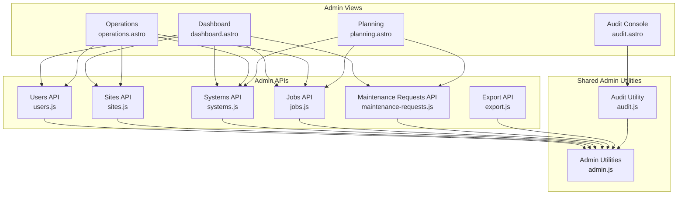
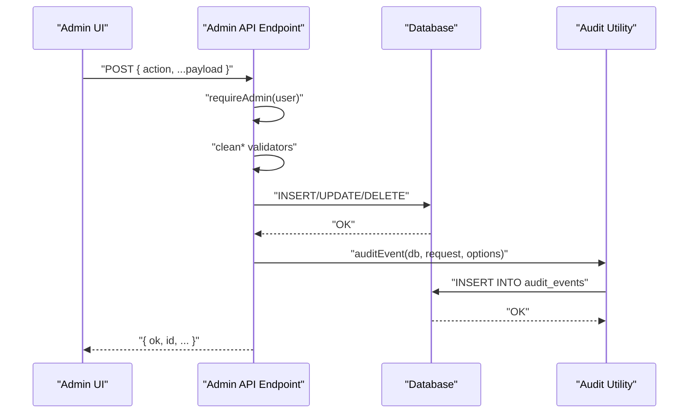
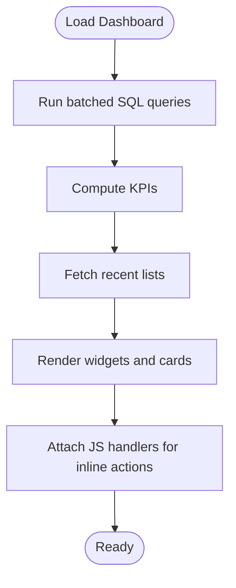
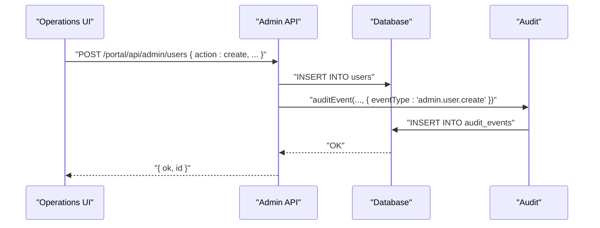
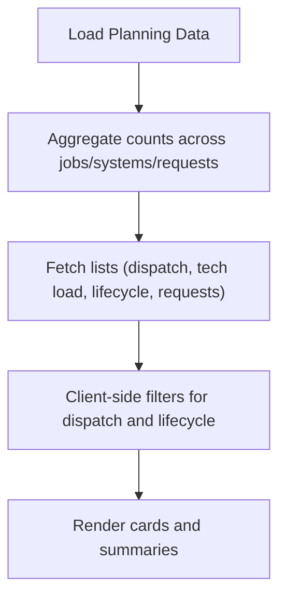
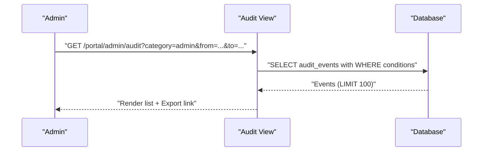
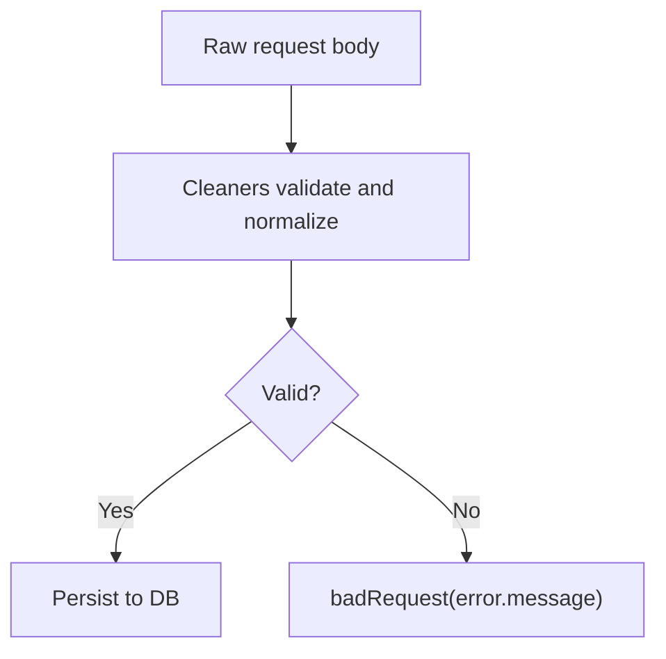
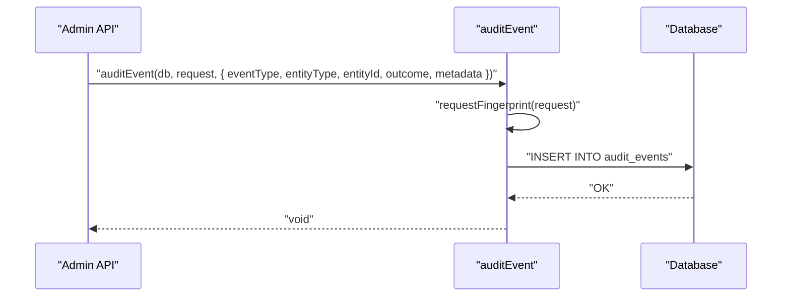
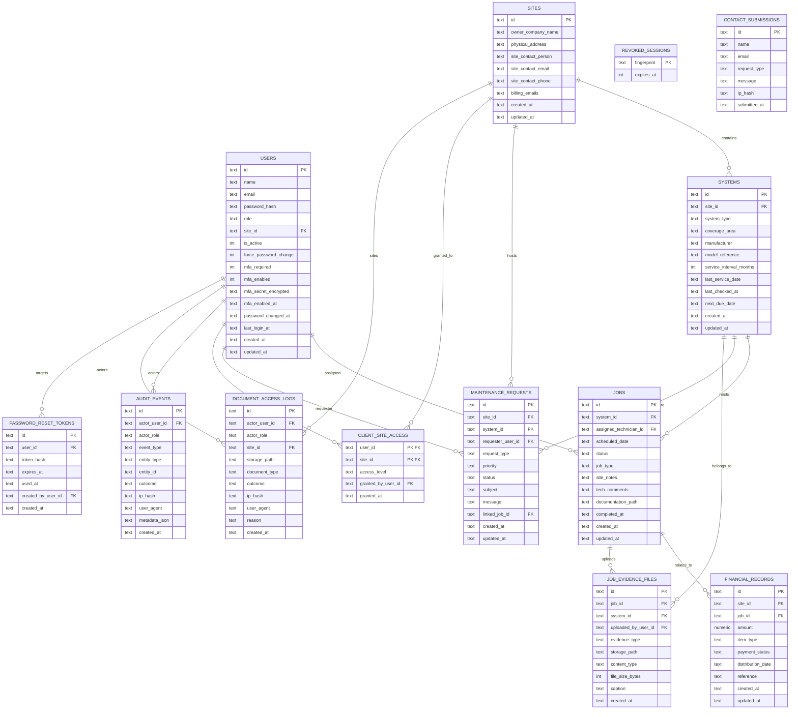
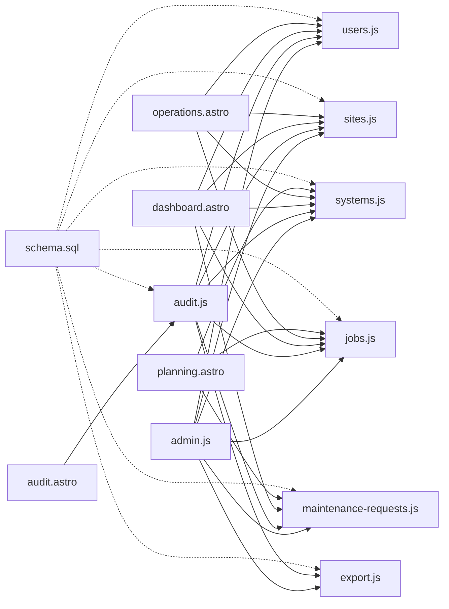

# Administrative Features

<cite>
**Referenced Files in This Document**
- [admin.js](file://src/lib/server/admin.js)
- [audit.js](file://src/lib/server/audit.js)
- [dashboard.astro](file://src/pages/portal/admin/dashboard.astro)
- [operations.astro](file://src/pages/portal/admin/operations.astro)
- [planning.astro](file://src/pages/portal/admin/planning.astro)
- [audit.astro](file://src/pages/portal/admin/audit.astro)
- [users.js](file://src/pages/portal/api/admin/users.js)
- [sites.js](file://src/pages/portal/api/admin/sites.js)
- [systems.js](file://src/pages/portal/api/admin/systems.js)
- [jobs.js](file://src/pages/portal/api/admin/jobs.js)
- [maintenance-requests.js](file://src/pages/portal/api/admin/maintenance-requests.js)
- [export.js](file://src/pages/portal/api/admin/export.js)
- [schema.sql](file://schema.sql)
- [document_access_logs.sql](file://migrations/0008_document_access_logs.sql)
- [revoked_sessions.sql](file://migrations/0009_revoked_sessions.sql)
- [client_site_access.sql](file://migrations/0012_client_site_access.sql)
</cite>

## Table of Contents
1. [Introduction](#introduction)
2. [Project Structure](#project-structure)
3. [Core Components](#core-components)
4. [Architecture Overview](#architecture-overview)
5. [Detailed Component Analysis](#detailed-component-analysis)
6. [Dependency Analysis](#dependency-analysis)
7. [Performance Considerations](#performance-considerations)
8. [Troubleshooting Guide](#troubleshooting-guide)
9. [Conclusion](#conclusion)
10. [Appendices](#appendices)

## Introduction
This document describes the administrative features of the portal, focusing on comprehensive management and oversight capabilities. It covers the admin dashboard, operations monitoring, audit logging, and strategic planning tools. It also documents the user management system, system administration interfaces, compliance reporting features, audit trail functionality, compliance tracking, operational metrics collection, administrative workflows for user provisioning, system configuration, and policy management. Practical examples of administrative tasks, reporting dashboards, compliance monitoring, and system maintenance procedures are included, along with administrative security measures, audit requirements, and operational excellence frameworks.

## Project Structure
The administrative surface is organized around four primary admin views and supporting server-side APIs:
- Admin Dashboard: Operational overview and quick actions
- Operations: CRUD for users, sites, systems, jobs, and data import/export
- Planning: Dispatch load, lifecycle due calendar, and open requests
- Audit Console: Read-only audit event browsing and filtering

**Diagram sources**
- [dashboard.astro](file://src/pages/portal/admin/dashboard.astro)
- [operations.astro](file://src/pages/portal/admin/operations.astro)
- [planning.astro](file://src/pages/portal/admin/planning.astro)
- [audit.astro](file://src/pages/portal/admin/audit.astro)
- [users.js](file://src/pages/portal/api/admin/users.js)
- [sites.js](file://src/pages/portal/api/admin/sites.js)
- [systems.js](file://src/pages/portal/api/admin/systems.js)
- [jobs.js](file://src/pages/portal/api/admin/jobs.js)
- [maintenance-requests.js](file://src/pages/portal/api/admin/maintenance-requests.js)
- [export.js](file://src/pages/portal/api/admin/export.js)
- [admin.js](file://src/lib/server/admin.js)
- [audit.js](file://src/lib/server/audit.js)

**Section sources**
- [dashboard.astro](file://src/pages/portal/admin/dashboard.astro)
- [operations.astro](file://src/pages/portal/admin/operations.astro)
- [planning.astro](file://src/pages/portal/admin/planning.astro)
- [audit.astro](file://src/pages/portal/admin/audit.astro)

## Core Components
- Admin utilities: Input sanitization and validation helpers used across admin APIs
- Audit utility: Centralized event recording with fingerprinting and metadata
- Admin APIs: CRUD endpoints for users, sites, systems, jobs, maintenance requests, and exports
- Admin views: Interactive dashboards for operations, planning, and audit

Key responsibilities:
- Enforce admin-only access for privileged operations
- Validate and sanitize inputs consistently
- Record audit events for all administrative actions
- Provide filtered, paginated audit consoles
- Support bulk import/export for operational data

**Section sources**
- [admin.js](file://src/lib/server/admin.js)
- [audit.js](file://src/lib/server/audit.js)
- [users.js](file://src/pages/portal/api/admin/users.js)
- [sites.js](file://src/pages/portal/api/admin/sites.js)
- [systems.js](file://src/pages/portal/api/admin/systems.js)
- [jobs.js](file://src/pages/portal/api/admin/jobs.js)
- [maintenance-requests.js](file://src/pages/portal/api/admin/maintenance-requests.js)
- [export.js](file://src/pages/portal/api/admin/export.js)

## Architecture Overview
Administrative workflows follow a consistent pattern:
- UI renders admin panels and forms
- Client submits JSON payloads via POST endpoints
- Server validates inputs, enforces admin-only access, performs updates
- Audit events are recorded for traceability
- Responses include structured results and optional CSV exports

**Diagram sources**
- [users.js](file://src/pages/portal/api/admin/users.js)
- [sites.js](file://src/pages/portal/api/admin/sites.js)
- [systems.js](file://src/pages/portal/api/admin/systems.js)
- [jobs.js](file://src/pages/portal/api/admin/jobs.js)
- [maintenance-requests.js](file://src/pages/portal/api/admin/maintenance-requests.js)
- [audit.js](file://src/lib/server/audit.js)

## Detailed Component Analysis

### Admin Dashboard
The dashboard aggregates operational KPIs and recent activity to support dispatch and lifecycle oversight.

Key features:
- Quick stats: active jobs, unassigned jobs, overdue systems, open requests, missing documentation
- Recent lists: completed works, active dispatches, lifecycle due dates
- Exception queues: overdue systems, missing documentation, finance follow-up
- Inline actions: mark jobs as invoiced, update maintenance request status, schedule dispatches

**Diagram sources**
- [dashboard.astro](file://src/pages/portal/admin/dashboard.astro)

Practical examples:
- Mark a completed job as invoiced from the “Completed works” list
- Update a maintenance request’s status from the “Client request queue”
- Schedule a dispatch from a request, selecting system, technician, and date

**Section sources**
- [dashboard.astro](file://src/pages/portal/admin/dashboard.astro)

### Operations Management
The operations view centralizes administrative CRUD for users, sites, systems, jobs, and data import/export.

Key features:
- Users: create/update users, issue password reset links, reset MFA for admin/finance
- Sites: create/update sites
- Systems: create/update systems with lifecycle fields
- Jobs: create/update jobs, set status, assign technicians
- Data: export users/sites/systems; import sites/systems via CSV
- Client site access: grant/revoke additional access for client users

**Diagram sources**
- [operations.astro](file://src/pages/portal/admin/operations.astro)
- [users.js](file://src/pages/portal/api/admin/users.js)
- [audit.js](file://src/lib/server/audit.js)

Practical examples:
- Provision a new technician user and require MFA
- Bulk import systems from a CSV with exact column headers
- Grant a client user access to an additional site

**Section sources**
- [operations.astro](file://src/pages/portal/admin/operations.astro)
- [users.js](file://src/pages/portal/api/admin/users.js)
- [sites.js](file://src/pages/portal/api/admin/sites.js)
- [systems.js](file://src/pages/portal/api/admin/systems.js)
- [jobs.js](file://src/pages/portal/api/admin/jobs.js)
- [maintenance-requests.js](file://src/pages/portal/api/admin/maintenance-requests.js)
- [export.js](file://src/pages/portal/api/admin/export.js)

### Strategic Planning
The planning view supports dispatch load balancing, lifecycle due calendar, and prioritization of open client requests.

Key features:
- Management KPIs: scheduled, in-progress, overdue, due soon, critical requests, unassigned jobs
- Dispatch planner: filterable list of active jobs
- Technician load: capacity snapshot per technician
- Lifecycle due calendar: risk classification for upcoming due dates
- Open client requests: priority-driven review queue

**Diagram sources**
- [planning.astro](file://src/pages/portal/admin/planning.astro)

Practical examples:
- Review overdue systems and plan remediation
- Balance technician loads before scheduling new jobs
- Prioritize critical maintenance requests

**Section sources**
- [planning.astro](file://src/pages/portal/admin/planning.astro)

### Audit Console
The audit console provides a read-only view of security and operational events with filtering and export capabilities.

Key features:
- Filter by category (auth, admin, finance, job, security, document), outcome, and date range
- Export filtered events to CSV
- Display event type, entity, outcome, actor, and metadata preview

**Diagram sources**
- [audit.astro](file://src/pages/portal/admin/audit.astro)
- [audit.js](file://src/lib/server/audit.js)

Practical examples:
- Investigate repeated failed logins (auth failures)
- Track all admin-initiated user updates
- Export monthly compliance events for retention

**Section sources**
- [audit.astro](file://src/pages/portal/admin/audit.astro)

### Admin Utilities and Validation
Reusable utilities ensure consistent input handling and security across admin endpoints.

Highlights:
- requireAdmin: enforce admin-only access
- readJson: safe JSON parsing with defaults
- cleanText/cleanId/cleanEmail/cleanDate/cleanChoice/cleanBoolean/cleanInt: strict validation with configurable bounds and defaults

**Diagram sources**
- [admin.js](file://src/lib/server/admin.js)

**Section sources**
- [admin.js](file://src/lib/server/admin.js)

### Audit Utility
Centralized audit event recording captures actor, event type, entity, outcome, IP hash, user agent, and metadata.

**Diagram sources**
- [audit.js](file://src/lib/server/audit.js)

**Section sources**
- [audit.js](file://src/lib/server/audit.js)

### Data Model Overview
The administrative features operate over a normalized schema with strong referential integrity and indexes optimized for admin queries.

**Diagram sources**
- [schema.sql](file://schema.sql)
- [document_access_logs.sql](file://migrations/0008_document_access_logs.sql)
- [revoked_sessions.sql](file://migrations/0009_revoked_sessions.sql)
- [client_site_access.sql](file://migrations/0012_client_site_access.sql)

**Section sources**
- [schema.sql](file://schema.sql)

## Dependency Analysis
Administrative components depend on shared utilities and the database schema. The following diagram highlights key dependencies:

**Diagram sources**
- [admin.js](file://src/lib/server/admin.js)
- [audit.js](file://src/lib/server/audit.js)
- [users.js](file://src/pages/portal/api/admin/users.js)
- [sites.js](file://src/pages/portal/api/admin/sites.js)
- [systems.js](file://src/pages/portal/api/admin/systems.js)
- [jobs.js](file://src/pages/portal/api/admin/jobs.js)
- [maintenance-requests.js](file://src/pages/portal/api/admin/maintenance-requests.js)
- [export.js](file://src/pages/portal/api/admin/export.js)
- [dashboard.astro](file://src/pages/portal/admin/dashboard.astro)
- [operations.astro](file://src/pages/portal/admin/operations.astro)
- [planning.astro](file://src/pages/portal/admin/planning.astro)
- [audit.astro](file://src/pages/portal/admin/audit.astro)
- [schema.sql](file://schema.sql)

**Section sources**
- [admin.js](file://src/lib/server/admin.js)
- [audit.js](file://src/lib/server/audit.js)
- [users.js](file://src/pages/portal/api/admin/users.js)
- [sites.js](file://src/pages/portal/api/admin/sites.js)
- [systems.js](file://src/pages/portal/api/admin/systems.js)
- [jobs.js](file://src/pages/portal/api/admin/jobs.js)
- [maintenance-requests.js](file://src/pages/portal/api/admin/maintenance-requests.js)
- [export.js](file://src/pages/portal/api/admin/export.js)
- [dashboard.astro](file://src/pages/portal/admin/dashboard.astro)
- [operations.astro](file://src/pages/portal/admin/operations.astro)
- [planning.astro](file://src/pages/portal/admin/planning.astro)
- [audit.astro](file://src/pages/portal/admin/audit.astro)
- [schema.sql](file://schema.sql)

## Performance Considerations
- Batched queries: The dashboard uses batched statements to reduce round-trips for KPI computation
- Indexes: Strategic indexes on audit events, jobs, systems, and maintenance requests optimize filtering and sorting
- Pagination: Audit console limits results to the most recent entries; use filters to narrow scope
- Client-side filtering: Planning and operations panels implement lightweight client-side filtering to reduce server load
- Export sizing: Export endpoints return CSV responses; consider filtering and limiting datasets for large exports

[No sources needed since this section provides general guidance]

## Troubleshooting Guide
Common issues and resolutions:
- Admin-only errors: Ensure the current user has role “admin”; otherwise, requests are rejected
- Validation failures: Review field constraints (lengths, formats, choices) enforced by admin utilities
- Audit writes: Failures are logged; check console for “audit event write failed”
- Import errors: CSV import reports per-row failures with row numbers and messages
- Export permissions: Exports require admin role

**Section sources**
- [admin.js](file://src/lib/server/admin.js)
- [audit.js](file://src/lib/server/audit.js)
- [operations.astro](file://src/pages/portal/admin/operations.astro)

## Conclusion
The administrative features provide a cohesive, secure, and auditable platform for managing users, sites, systems, jobs, and maintenance requests. The dashboards deliver actionable insights, while the audit console ensures transparency and compliance readiness. Robust validation, centralized auditing, and efficient data access patterns support operational excellence and regulatory compliance.

[No sources needed since this section summarizes without analyzing specific files]

## Appendices

### Administrative Workflows

- User provisioning
  - Create a new user with role and site mapping
  - Optionally require MFA for admin/finance roles
  - Issue a password reset link with expiration
  - Reset MFA for admin/finance users when needed

- System configuration
  - Create/update sites with contact and billing details
  - Create/update systems with lifecycle fields (due dates, intervals)
  - Assign systems to sites and configure coverage areas

- Policy management
  - Enforce MFA requirements for admin/finance roles
  - Deactivate users when necessary
  - Track and act on overdue systems and critical requests

- Operational maintenance
  - Bulk import sites/systems via CSV with exact headers
  - Export operational datasets for review and reconciliation
  - Monitor dispatch loads and technician capacity

[No sources needed since this section provides general guidance]