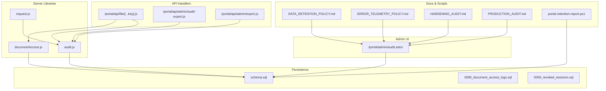
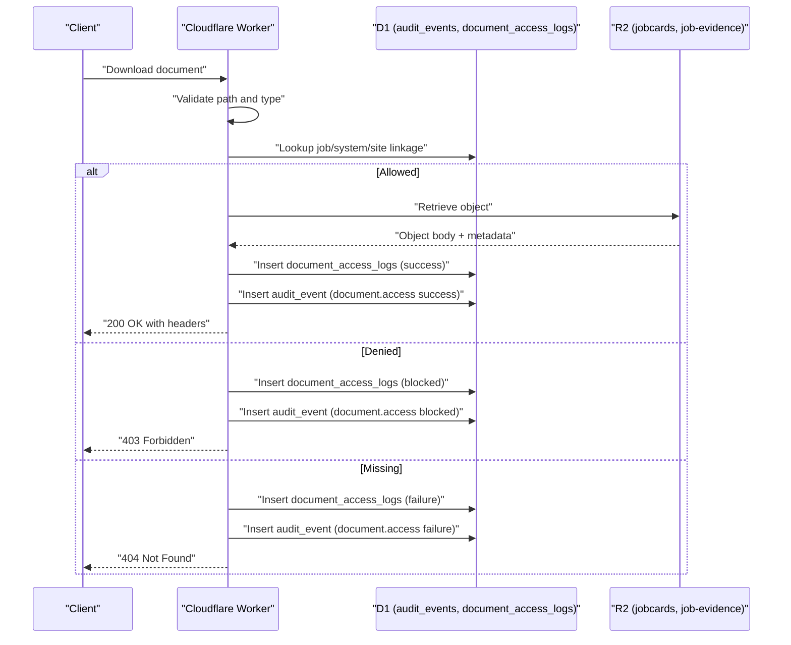
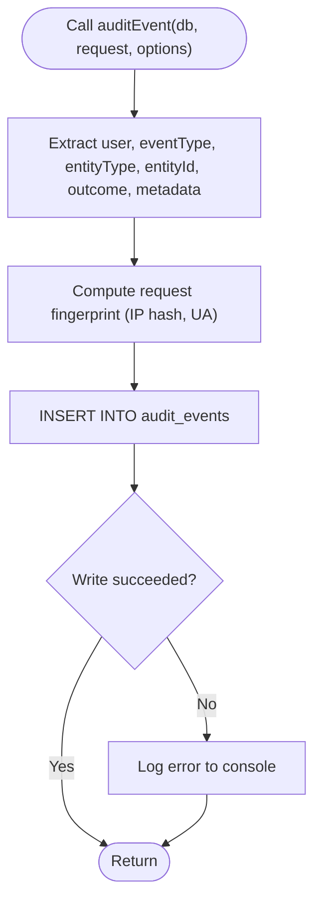
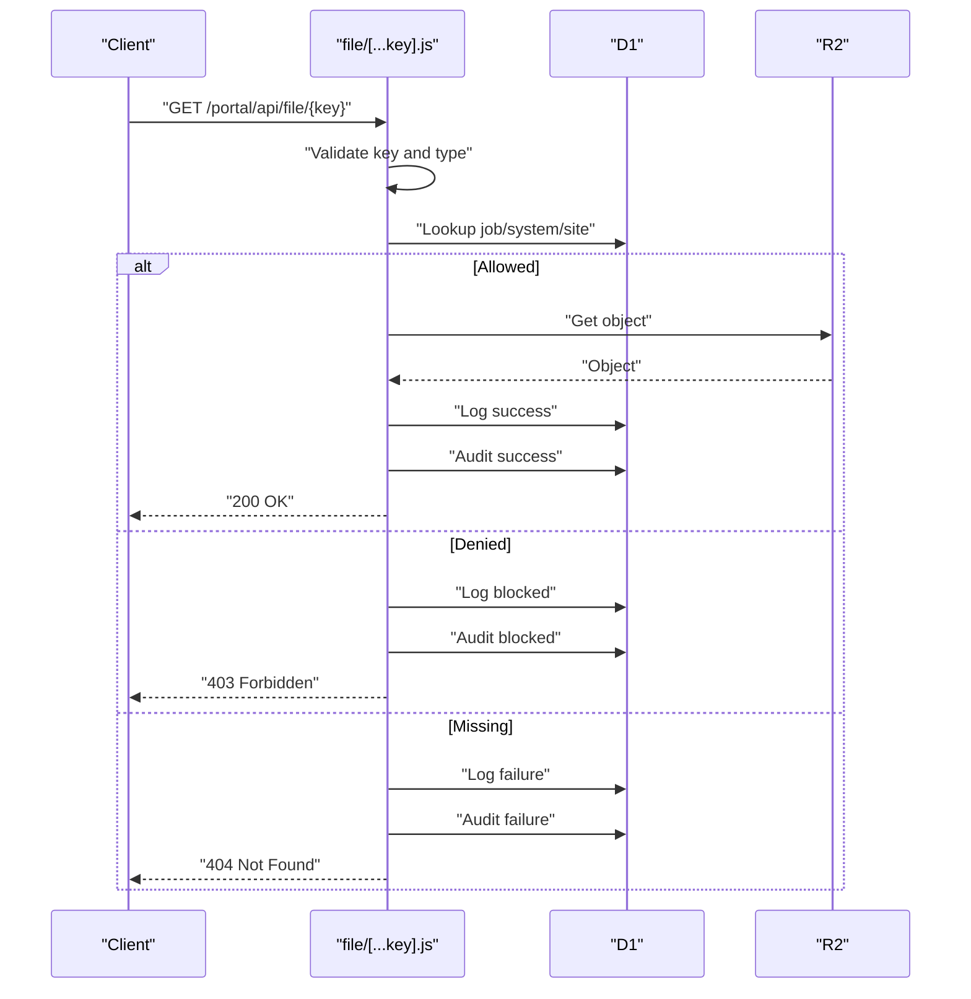
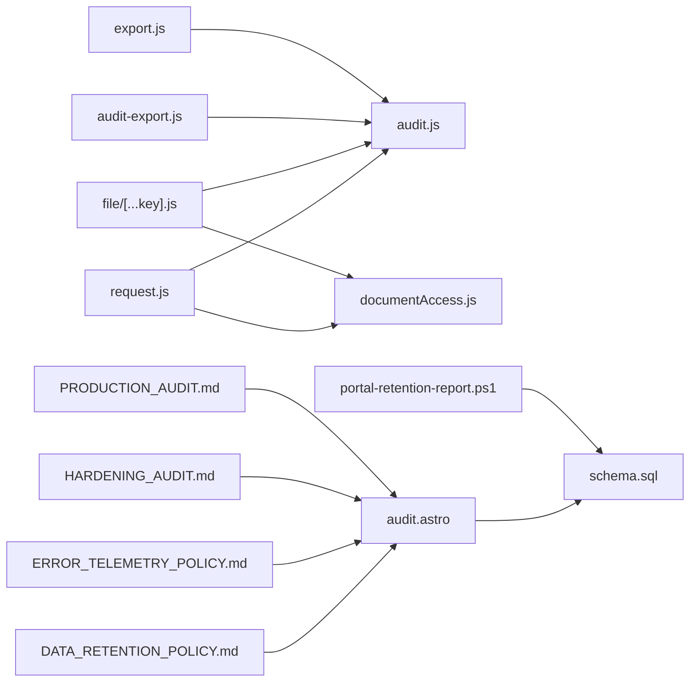

# Audit & Compliance

<cite>
**Referenced Files in This Document**
- [audit.js](file://src/lib/server/audit.js)
- [request.js](file://src/lib/server/request.js)
- [documentAccess.js](file://src/lib/server/documentAccess.js)
- [audit.astro](file://src/pages/portal/admin/audit.astro)
- [audit-export.js](file://src/pages/portal/api/admin/audit-export.js)
- [export.js](file://src/pages/portal/api/admin/export.js)
- [file/[...key].js](file://src/pages/portal/api/file/[...key].js)
- [0008_document_access_logs.sql](file://migrations/0008_document_access_logs.sql)
- [0009_revoked_sessions.sql](file://migrations/0009_revoked_sessions.sql)
- [schema.sql](file://schema.sql)
- [DATA_RETENTION_POLICY.md](file://docs/roadmap/DATA_RETENTION_POLICY.md)
- [ERROR_TELEMETRY_POLICY.md](file://docs/roadmap/ERROR_TELEMETRY_POLICY.md)
- [HARDENING_AUDIT.md](file://docs/roadmap/HARDENING_AUDIT.md)
- [PRODUCTION_AUDIT.md](file://docs/roadmap/PRODUCTION_AUDIT.md)
- [portal-retention-report.ps1](file://scripts/portal-retention-report.ps1)
</cite>

## Table of Contents
1. [Introduction](#introduction)
2. [Project Structure](#project-structure)
3. [Core Components](#core-components)
4. [Architecture Overview](#architecture-overview)
5. [Detailed Component Analysis](#detailed-component-analysis)
6. [Dependency Analysis](#dependency-analysis)
7. [Performance Considerations](#performance-considerations)
8. [Troubleshooting Guide](#troubleshooting-guide)
9. [Conclusion](#conclusion)
10. [Appendices](#appendices)

## Introduction
This document describes the Audit and Compliance system for the Kharon Portal. It covers comprehensive logging, compliance tracking, and regulatory adherence across authentication, access control, document handling, and operational controls. It documents the audit trail functionality, compliance reporting mechanisms, and regulatory requirement fulfillment, including audit event categorization, data retention policies, and compliance monitoring workflows. It also explains the integration with Cloudflare D1 for audit data persistence, the audit log analysis tools, and practical examples of compliance reporting, audit trail investigations, and regulatory documentation preparation. Finally, it addresses audit security measures, data privacy considerations, and compliance automation features.

## Project Structure
The Audit and Compliance system spans server-side libraries, API endpoints, administrative UI, and supporting documentation and scripts:
- Server libraries provide audit event recording and request fingerprinting.
- API endpoints handle document access, audit exports, and administrative exports.
- Administrative pages present filtered views of audit events and enable CSV exports.
- Schema and migrations define D1 tables for audit events, document access logs, and session revocation.
- Policies and runbooks define retention, telemetry, hardening, and production readiness.

**Diagram sources**
- [audit.js:1-33](file://src/lib/server/audit.js#L1-L33)
- [request.js:1-36](file://src/lib/server/request.js#L1-L36)
- [documentAccess.js:1-28](file://src/lib/server/documentAccess.js#L1-L28)
- [file/[...key].js](file://src/pages/portal/api/file/[...key].js#L1-L137)
- [audit-export.js:1-100](file://src/pages/portal/api/admin/audit-export.js#L1-L100)
- [export.js:1-64](file://src/pages/portal/api/admin/export.js#L1-L64)
- [audit.astro:1-279](file://src/pages/portal/admin/audit.astro#L1-L279)
- [schema.sql:101-140](file://schema.sql#L101-L140)
- [0008_document_access_logs.sql:1-18](file://migrations/0008_document_access_logs.sql#L1-L18)
- [0009_revoked_sessions.sql:1-7](file://migrations/0009_revoked_sessions.sql#L1-L7)
- [DATA_RETENTION_POLICY.md:1-83](file://docs/roadmap/DATA_RETENTION_POLICY.md#L1-L83)
- [ERROR_TELEMETRY_POLICY.md:1-153](file://docs/roadmap/ERROR_TELEMETRY_POLICY.md#L1-L153)
- [HARDENING_AUDIT.md:1-104](file://docs/roadmap/HARDENING_AUDIT.md#L1-L104)
- [PRODUCTION_AUDIT.md:1-171](file://docs/roadmap/PRODUCTION_AUDIT.md#L1-L171)
- [portal-retention-report.ps1:1-61](file://scripts/portal-retention-report.ps1#L1-L61)

**Section sources**
- [audit.js:1-33](file://src/lib/server/audit.js#L1-L33)
- [request.js:1-36](file://src/lib/server/request.js#L1-L36)
- [documentAccess.js:1-28](file://src/lib/server/documentAccess.js#L1-L28)
- [audit.astro:1-279](file://src/pages/portal/admin/audit.astro#L1-L279)
- [audit-export.js:1-100](file://src/pages/portal/api/admin/audit-export.js#L1-L100)
- [export.js:1-64](file://src/pages/portal/api/admin/export.js#L1-L64)
- [file/[...key].js](file://src/pages/portal/api/file/[...key].js#L1-L137)
- [schema.sql:101-140](file://schema.sql#L101-L140)
- [0008_document_access_logs.sql:1-18](file://migrations/0008_document_access_logs.sql#L1-L18)
- [0009_revoked_sessions.sql:1-7](file://migrations/0009_revoked_sessions.sql#L1-L7)
- [DATA_RETENTION_POLICY.md:1-83](file://docs/roadmap/DATA_RETENTION_POLICY.md#L1-L83)
- [ERROR_TELEMETRY_POLICY.md:1-153](file://docs/roadmap/ERROR_TELEMETRY_POLICY.md#L1-L153)
- [HARDENING_AUDIT.md:1-104](file://docs/roadmap/HARDENING_AUDIT.md#L1-L104)
- [PRODUCTION_AUDIT.md:1-171](file://docs/roadmap/PRODUCTION_AUDIT.md#L1-L171)
- [portal-retention-report.ps1:1-61](file://scripts/portal-retention-report.ps1#L1-L61)

## Core Components
- Audit event recording library: centralizes insertion of audit events into D1 with hashed identity and metadata.
- Request fingerprinting: computes IP hash, optional subject hash, and user agent for correlation and privacy.
- Document access logging: records per-download outcomes, roles, site linkage, and reasons.
- Admin audit console: filters and displays recent audit events, highlights high-risk outcomes, and exports CSV.
- Audit export API: admin-only CSV export of filtered audit events with audit logging of the export action.
- Administrative data exports: CSV exports of users, sites, and systems for compliance and reconciliation.
- Document access API: enforces RBAC, logs access attempts, and records successes/failures/blocks.
- Persistence schema: D1 tables for audit_events, document_access_logs, revoked_sessions, and related indices.
- Retention and telemetry policies: retention thresholds, legal hold, weekly/monthly review cadence, and escalation thresholds.
- Hardening and production audit: security controls, session revocation, CSRF, rate limiting, and production readiness checks.

**Section sources**
- [audit.js:1-33](file://src/lib/server/audit.js#L1-L33)
- [request.js:1-36](file://src/lib/server/request.js#L1-L36)
- [documentAccess.js:1-28](file://src/lib/server/documentAccess.js#L1-L28)
- [audit.astro:1-279](file://src/pages/portal/admin/audit.astro#L1-L279)
- [audit-export.js:1-100](file://src/pages/portal/api/admin/audit-export.js#L1-L100)
- [export.js:1-64](file://src/pages/portal/api/admin/export.js#L1-L64)
- [file/[...key].js](file://src/pages/portal/api/file/[...key].js#L1-L137)
- [schema.sql:101-140](file://schema.sql#L101-L140)
- [DATA_RETENTION_POLICY.md:1-83](file://docs/roadmap/DATA_RETENTION_POLICY.md#L1-L83)
- [ERROR_TELEMETRY_POLICY.md:1-153](file://docs/roadmap/ERROR_TELEMETRY_POLICY.md#L1-L153)
- [HARDENING_AUDIT.md:1-104](file://docs/roadmap/HARDENING_AUDIT.md#L1-L104)
- [PRODUCTION_AUDIT.md:1-171](file://docs/roadmap/PRODUCTION_AUDIT.md#L1-L171)

## Architecture Overview
The system integrates Cloudflare Workers, D1, and R2 to capture, persist, and analyze audit and compliance-relevant events. The flow captures user actions, applies security checks, writes audit trails, and exposes read-only dashboards and exports for compliance teams.

**Diagram sources**
- [file/[...key].js](file://src/pages/portal/api/file/[...key].js#L1-L137)
- [documentAccess.js:1-28](file://src/lib/server/documentAccess.js#L1-L28)
- [audit.js:1-33](file://src/lib/server/audit.js#L1-L33)
- [schema.sql:101-140](file://schema.sql#L101-L140)

## Detailed Component Analysis

### Audit Event Recording Library
- Purpose: Insert standardized audit events into D1 with actor identity, role, event type, entity context, outcome, and hashed identifiers.
- Data model: Uses a UUID for id, optional actor_user_id, actor_role, event_type, entity_type, entity_id, outcome, ip_hash, user_agent, and metadata_json.
- Privacy: IP and subject are hashed before insertion; user agent length is truncated.
- Error handling: Writes are wrapped in try/catch with console error logging.

**Diagram sources**
- [audit.js:1-33](file://src/lib/server/audit.js#L1-L33)
- [request.js:1-36](file://src/lib/server/request.js#L1-L36)

**Section sources**
- [audit.js:1-33](file://src/lib/server/audit.js#L1-L33)
- [request.js:1-36](file://src/lib/server/request.js#L1-L36)

### Request Fingerprinting
- Computes a SHA-256 hash of the client IP and optionally a subject (e.g., email), then base64-url encodes the digest.
- Captures user agent with length limit.
- Returns ipHash, subjectHash, and userAgent for correlation while preserving privacy.

**Section sources**
- [request.js:1-36](file://src/lib/server/request.js#L1-L36)

### Document Access Logging
- Records per-download attempts with actor, role, site_id, storage_path, document_type, outcome, ip_hash, user_agent, and reason.
- Supports indexing for actor, site, and path to facilitate queries.

**Section sources**
- [documentAccess.js:1-28](file://src/lib/server/documentAccess.js#L1-L28)
- [0008_document_access_logs.sql:1-18](file://migrations/0008_document_access_logs.sql#L1-L18)

### Document Access API
- Validates path and type, prevents path traversal, and enforces RBAC against jobs/systems/sites.
- Logs outcomes (success, failure, blocked) and inserts audit events for each attempt.
- Sets cache-control and ETag headers for efficient retrieval.

**Diagram sources**
- [file/[...key].js](file://src/pages/portal/api/file/[...key].js#L1-L137)
- [documentAccess.js:1-28](file://src/lib/server/documentAccess.js#L1-L28)
- [audit.js:1-33](file://src/lib/server/audit.js#L1-L33)

**Section sources**
- [file/[...key].js](file://src/pages/portal/api/file/[...key].js#L1-L137)
- [documentAccess.js:1-28](file://src/lib/server/documentAccess.js#L1-L28)
- [audit.js:1-33](file://src/lib/server/audit.js#L1-L33)

### Admin Audit Console
- Filters audit events by category (auth, admin, finance, job, security, document), outcome, and date range.
- Highlights high-risk events (security.auth.failure/blocked, security.admin.failure/blocked).
- Exports filtered results to CSV via admin audit export endpoint.

**Section sources**
- [audit.astro:1-279](file://src/pages/portal/admin/audit.astro#L1-L279)

### Audit Export API
- Admin-only endpoint that returns CSV of filtered audit events.
- Logs the export action as an audit event with metadata (rowCount, filters).
- Limits result set for performance.

**Section sources**
- [audit-export.js:1-100](file://src/pages/portal/api/admin/audit-export.js#L1-L100)
- [audit.js:1-33](file://src/lib/server/audit.js#L1-L33)

### Administrative Data Export API
- Admin-only endpoint to export users, sites, and systems as CSV.
- Logs export actions as audit events.

**Section sources**
- [export.js:1-64](file://src/pages/portal/api/admin/export.js#L1-L64)
- [audit.js:1-33](file://src/lib/server/audit.js#L1-L33)

### Persistence Schema and Indices
- audit_events: actor identity, event_type, entity_type/id, outcome, ip_hash, user_agent, metadata_json, timestamps.
- document_access_logs: actor, role, site_id, storage_path, document_type, outcome, ip_hash, user_agent, reason, timestamps.
- revoked_sessions: session fingerprint and expiry for logout revocation.
- Indices optimized for common queries (actor, type, created_at, site, path).

**Section sources**
- [schema.sql:101-140](file://schema.sql#L101-L140)
- [0008_document_access_logs.sql:1-18](file://migrations/0008_document_access_logs.sql#L1-L18)
- [0009_revoked_sessions.sql:1-7](file://migrations/0009_revoked_sessions.sql#L1-L7)

### Data Retention and Legal Hold
- Defines retention periods for jobcards, evidence, financial records, maintenance requests, jobs, audit events, password reset tokens, rate-limit counters, and inactive users.
- Legal hold overrides retention thresholds; no automated deletion is enabled.
- Provides a non-destructive retention report script and a production cutover checklist.

**Section sources**
- [DATA_RETENTION_POLICY.md:1-83](file://docs/roadmap/DATA_RETENTION_POLICY.md#L1-L83)
- [portal-retention-report.ps1:1-61](file://scripts/portal-retention-report.ps1#L1-L61)

### Error Telemetry and Monitoring
- Structured categories for authentication failures, rate limit blocks, CSRF blocks, document access failures, and server errors.
- Weekly and monthly review checklists with thresholds and escalation criteria.
- Guidance for accessing Cloudflare Logs and D1 query results.

**Section sources**
- [ERROR_TELEMETRY_POLICY.md:1-153](file://docs/roadmap/ERROR_TELEMETRY_POLICY.md#L1-L153)

### Hardening and Production Readiness
- Session token revocation via revoked_sessions table and middleware checks.
- CSRF protection with HMAC tokens and validation for state-changing requests.
- Rate limiting for portal write APIs and contact form.
- TOTP MFA enforcement for admin/finance users.
- Document access logging and audit logging for all access attempts.
- Production audit checklist and redirection flow verification.

**Section sources**
- [HARDENING_AUDIT.md:1-104](file://docs/roadmap/HARDENING_AUDIT.md#L1-L104)
- [PRODUCTION_AUDIT.md:1-171](file://docs/roadmap/PRODUCTION_AUDIT.md#L1-L171)

## Dependency Analysis
The audit and compliance system exhibits strong cohesion within server libraries and clear separation of concerns across handlers, UI, and persistence.

**Diagram sources**
- [audit.js:1-33](file://src/lib/server/audit.js#L1-L33)
- [request.js:1-36](file://src/lib/server/request.js#L1-L36)
- [documentAccess.js:1-28](file://src/lib/server/documentAccess.js#L1-L28)
- [file/[...key].js](file://src/pages/portal/api/file/[...key].js#L1-L137)
- [audit-export.js:1-100](file://src/pages/portal/api/admin/audit-export.js#L1-L100)
- [audit.astro:1-279](file://src/pages/portal/admin/audit.astro#L1-L279)
- [export.js:1-64](file://src/pages/portal/api/admin/export.js#L1-L64)
- [schema.sql:101-140](file://schema.sql#L101-L140)
- [DATA_RETENTION_POLICY.md:1-83](file://docs/roadmap/DATA_RETENTION_POLICY.md#L1-L83)
- [ERROR_TELEMETRY_POLICY.md:1-153](file://docs/roadmap/ERROR_TELEMETRY_POLICY.md#L1-L153)
- [HARDENING_AUDIT.md:1-104](file://docs/roadmap/HARDENING_AUDIT.md#L1-L104)
- [PRODUCTION_AUDIT.md:1-171](file://docs/roadmap/PRODUCTION_AUDIT.md#L1-L171)
- [portal-retention-report.ps1:1-61](file://scripts/portal-retention-report.ps1#L1-L61)

**Section sources**
- [audit.js:1-33](file://src/lib/server/audit.js#L1-L33)
- [request.js:1-36](file://src/lib/server/request.js#L1-L36)
- [documentAccess.js:1-28](file://src/lib/server/documentAccess.js#L1-L28)
- [file/[...key].js](file://src/pages/portal/api/file/[...key].js#L1-L137)
- [audit-export.js:1-100](file://src/pages/portal/api/admin/audit-export.js#L1-L100)
- [audit.astro:1-279](file://src/pages/portal/admin/audit.astro#L1-L279)
- [export.js:1-64](file://src/pages/portal/api/admin/export.js#L1-L64)
- [schema.sql:101-140](file://schema.sql#L101-L140)
- [DATA_RETENTION_POLICY.md:1-83](file://docs/roadmap/DATA_RETENTION_POLICY.md#L1-L83)
- [ERROR_TELEMETRY_POLICY.md:1-153](file://docs/roadmap/ERROR_TELEMETRY_POLICY.md#L1-L153)
- [HARDENING_AUDIT.md:1-104](file://docs/roadmap/HARDENING_AUDIT.md#L1-L104)
- [PRODUCTION_AUDIT.md:1-171](file://docs/roadmap/PRODUCTION_AUDIT.md#L1-L171)
- [portal-retention-report.ps1:1-61](file://scripts/portal-retention-report.ps1#L1-L61)

## Performance Considerations
- Indexing: D1 indices on audit_events and document_access_logs optimize filtering by actor, type, and created_at, and on site/path for access logs.
- Query limits: Admin audit export caps results to 2000 rows; admin audit console limits to 100 events for responsiveness.
- Hashing: IP and subject hashing avoids storing sensitive data and supports correlation without privacy risk.
- Caching: Document retrieval sets cache-control headers to reduce repeated fetches.

[No sources needed since this section provides general guidance]

## Troubleshooting Guide
Common issues and remediation steps:
- Authentication failures: Review recent auth.login failures grouped by IP and email; lock accounts if thresholds exceeded.
- Rate limit blocks: Investigate spikes on portal endpoints; adjust limits if legitimate traffic patterns change.
- CSRF blocks: Verify session lifetime and cookie behavior; ensure middleware CSRF validation is not blocking legitimate users.
- Document access failures/blocks: Confirm RBAC rules and linkage to jobs/systems/sites; check for stale references or missing R2 objects.
- Server errors: Monitor Cloudflare Worker analytics for 5xx spikes; inspect D1 prepare/bind errors and R2 get/put errors.
- Escalations: Trigger immediate actions for admin/finance logins from unrecognised IPs, CSRF blocks on finance/admin endpoints, and R2 503 errors.

**Section sources**
- [ERROR_TELEMETRY_POLICY.md:1-153](file://docs/roadmap/ERROR_TELEMETRY_POLICY.md#L1-L153)

## Conclusion
The Audit and Compliance system provides robust, privacy-preserving logging of security and operational events, with clear categorization, retention policies, and monitoring workflows. It leverages Cloudflare D1 for persistence and integrates tightly with administrative dashboards and exports to support compliance reporting and regulatory adherence. Hardening measures, session revocation, CSRF protection, rate limiting, and MFA further strengthen security posture. The included policies and scripts formalize review cadences, legal hold procedures, and production readiness checks.

[No sources needed since this section summarizes without analyzing specific files]

## Appendices

### Audit Event Categorization
- Authentication: auth.login, auth.logout, auth.password_reset.
- Administration: admin.user_management, admin.export.*, admin.audit_export.
- Finance: finance.quote, finance.invoice, finance.payment_settled.
- Jobs: job.create, job.update_status, job.evidence_upload.
- Security: security.csrf, security.rate_limit, security.session_revoked.
- Documents: document.access (success, failure, blocked).

**Section sources**
- [audit.astro:16-23](file://src/pages/portal/admin/audit.astro#L16-L23)
- [audit-export.js:8-15](file://src/pages/portal/api/admin/audit-export.js#L8-L15)
- [audit.js:1-33](file://src/lib/server/audit.js#L1-L33)
- [file/[...key].js](file://src/pages/portal/api/file/[...key].js#L54-L88)

### Compliance Reporting Examples
- Weekly review: Query recent auth failures, rate-limit blocks, CSRF blocks, and document access failures; confirm D1 and R2 health; acknowledge contact submissions.
- Monthly summary: Aggregate auth failure counts by IP/time-of-day, verify CSRF block causes, confirm audit coverage for recent finance actions, and run retention report.
- Production cutover: Confirm MFA enforcement, review audit and document access logs, rotate credentials, configure DNS, and ensure POPIA-compliant analytics.

**Section sources**
- [ERROR_TELEMETRY_POLICY.md:104-130](file://docs/roadmap/ERROR_TELEMETRY_POLICY.md#L104-L130)
- [PRODUCTION_AUDIT.md:160-171](file://docs/roadmap/PRODUCTION_AUDIT.md#L160-L171)

### Regulatory Documentation Preparation
- Use admin audit console to filter and export audit events for specific timeframes and outcomes.
- Export users, sites, and systems CSVs for reconciliation and access control documentation.
- Maintain retention reports and legal hold records to demonstrate compliance with minimum retention periods.

**Section sources**
- [audit.astro:186-206](file://src/pages/portal/admin/audit.astro#L186-L206)
- [audit-export.js:1-100](file://src/pages/portal/api/admin/audit-export.js#L1-L100)
- [export.js:1-64](file://src/pages/portal/api/admin/export.js#L1-L64)
- [DATA_RETENTION_POLICY.md:53-83](file://docs/roadmap/DATA_RETENTION_POLICY.md#L53-L83)

### Audit Security Measures and Data Privacy
- IP and subject hashing in audit and document access logs; user agent truncation.
- Session revocation via revoked_sessions table and middleware checks.
- CSRF protection with HMAC tokens and validation for state-changing requests.
- Rate limiting for portal write APIs and contact form.
- TOTP MFA enforcement for admin/finance users.
- CSV formula injection prevention via tab-prefix sanitization.

**Section sources**
- [request.js:1-36](file://src/lib/server/request.js#L1-L36)
- [0009_revoked_sessions.sql:1-7](file://migrations/0009_revoked_sessions.sql#L1-L7)
- [HARDENING_AUDIT.md:75-84](file://docs/roadmap/HARDENING_AUDIT.md#L75-L84)

### Compliance Automation Features
- Non-destructive retention reporting script to assess counts across data classes.
- Admin-only CSV export endpoints for audit and administrative datasets.
- Production readiness checklist to gate cutover and enforce operational controls.

**Section sources**
- [portal-retention-report.ps1:1-61](file://scripts/portal-retention-report.ps1#L1-L61)
- [audit-export.js:1-100](file://src/pages/portal/api/admin/audit-export.js#L1-L100)
- [export.js:1-64](file://src/pages/portal/api/admin/export.js#L1-L64)
- [PRODUCTION_AUDIT.md:160-171](file://docs/roadmap/PRODUCTION_AUDIT.md#L160-L171)