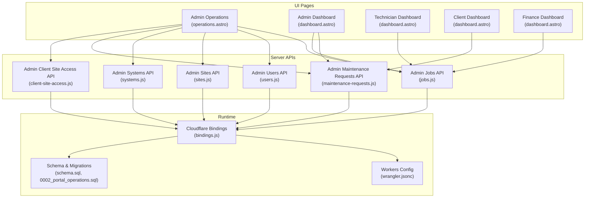
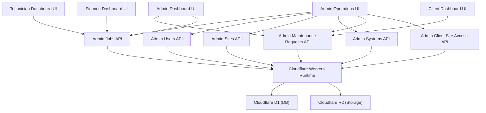
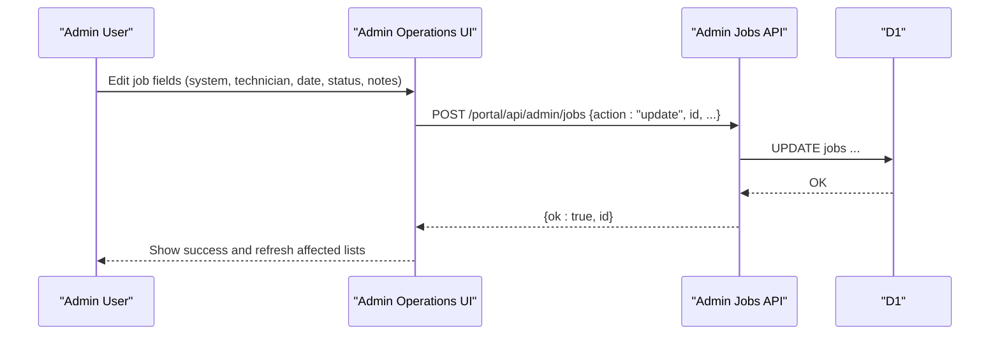
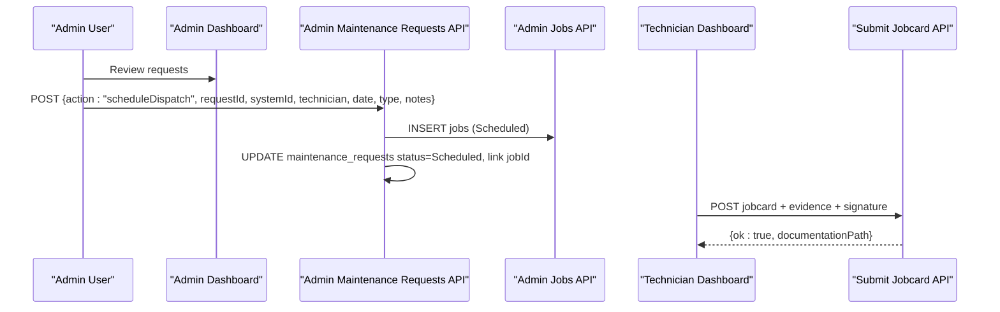
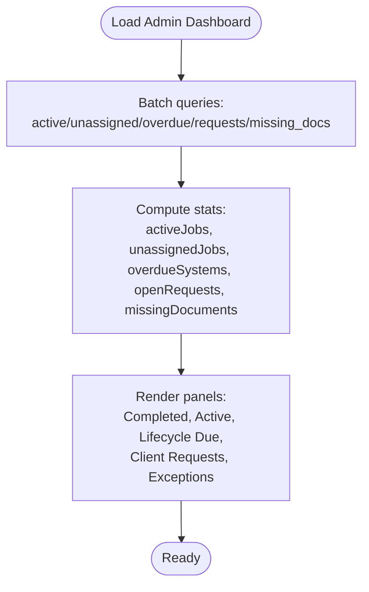
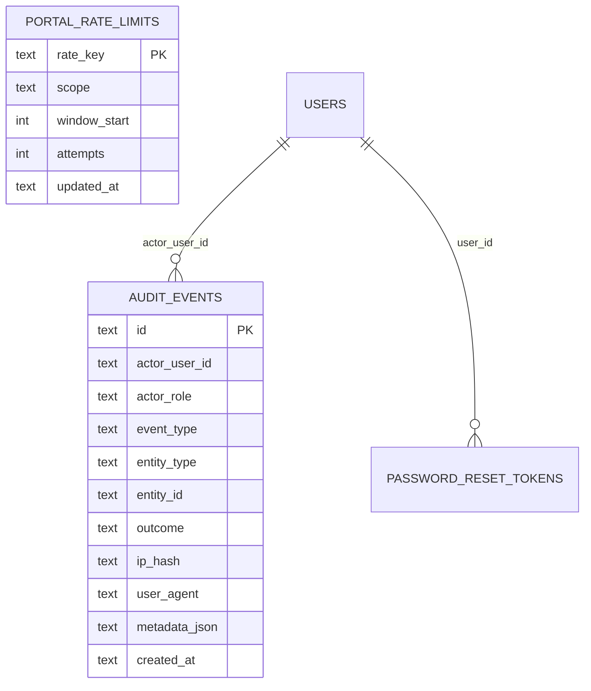
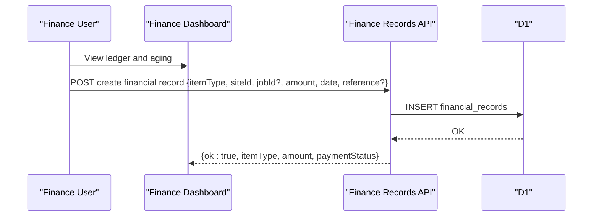
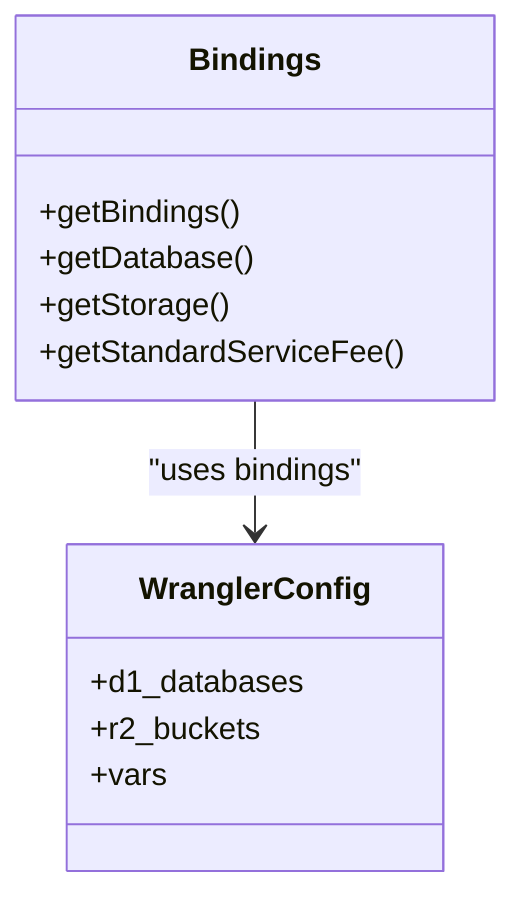
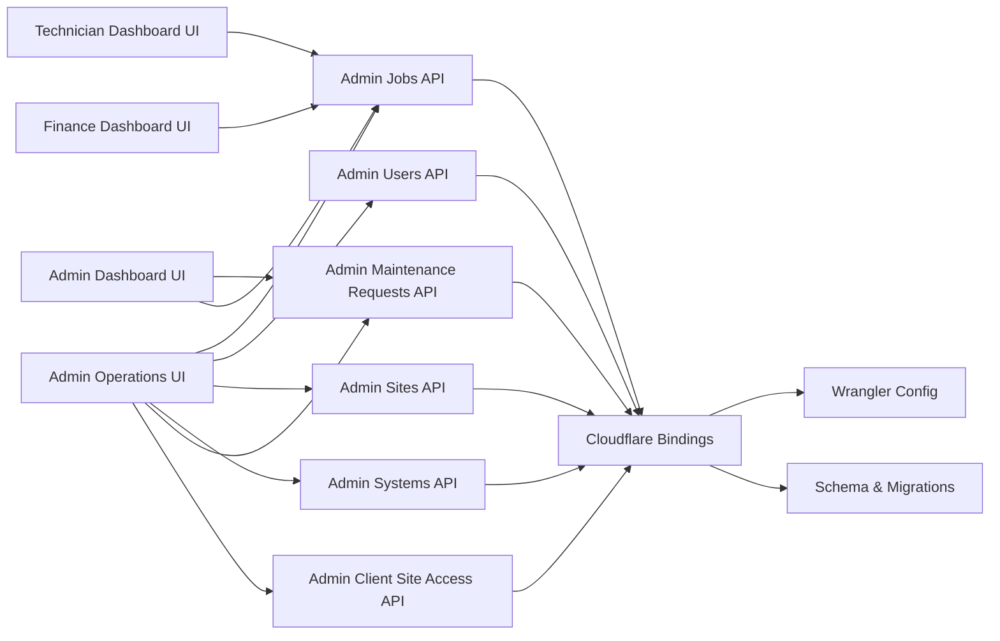

# Operations Monitoring

<cite>
**Referenced Files in This Document**
- [operations.astro](file://src/pages/portal/admin/operations.astro)
- [dashboard.astro (Admin)](file://src/pages/portal/admin/dashboard.astro)
- [dashboard.astro (Tech)](file://src/pages/portal/tech/dashboard.astro)
- [dashboard.astro (Client)](file://src/pages/portal/client/dashboard.astro)
- [dashboard.astro (Finance)](file://src/pages/portal/finance/dashboard.astro)
- [bindings.js](file://src/lib/server/bindings.js)
- [wrangler.jsonc](file://wrangler.jsonc)
- [schema.sql](file://schema.sql)
- [0002_portal_operations.sql](file://migrations/0002_portal_operations.sql)
- [jobs.js (Admin API)](file://src/pages/portal/api/admin/jobs.js)
- [users.js (Admin API)](file://src/pages/portal/api/admin/users.js)
- [sites.js (Admin API)](file://src/pages/portal/api/admin/sites.js)
- [systems.js (Admin API)](file://src/pages/portal/api/admin/systems.js)
- [maintenance-requests.js (Admin API)](file://src/pages/portal/api/admin/maintenance-requests.js)
- [client-site-access.js (Admin API)](file://src/pages/portal/api/admin/client-site-access.js)
</cite>

## Table of Contents
1. [Introduction](#introduction)
2. [Project Structure](#project-structure)
3. [Core Components](#core-components)
4. [Architecture Overview](#architecture-overview)
5. [Detailed Component Analysis](#detailed-component-analysis)
6. [Dependency Analysis](#dependency-analysis)
7. [Performance Considerations](#performance-considerations)
8. [Troubleshooting Guide](#troubleshooting-guide)
9. [Conclusion](#conclusion)
10. [Appendices](#appendices)

## Introduction
This document describes the Operations Monitoring system that provides real-time operational visibility and control across dispatch tracking, technician assignment workflows, and operational capacity management. It explains system health monitoring, resource allocation tracking, and operational efficiency metrics. It also documents the integration with Cloudflare Workers for real-time data processing, database query patterns for operational analytics, and practical workflows for operational decision-making, capacity planning, and performance optimization. Operational dashboard components, alert systems, and escalation procedures are included to support robust operations.

## Project Structure
The Operations Monitoring system spans UI pages, server-side APIs, and a Cloudflare D1-backed relational schema. Key areas:
- Admin dashboards and controls for dispatch, lifecycle, and exceptions
- Technician dispatch and jobcard closure
- Client self-service for lifecycle visibility and request submission
- Finance ledger and invoice linkage
- Admin CRUD and bulk operations for users, sites, systems, and client access
- Real-time data processing via Cloudflare Workers and D1 bindings

**Diagram sources**
- [operations.astro:1-808](file://src/pages/portal/admin/operations.astro#L1-L808)
- [dashboard.astro (Admin):1-395](file://src/pages/portal/admin/dashboard.astro#L1-L395)
- [dashboard.astro (Tech):1-308](file://src/pages/portal/tech/dashboard.astro#L1-L308)
- [dashboard.astro (Client):1-303](file://src/pages/portal/client/dashboard.astro#L1-L303)
- [dashboard.astro (Finance):1-410](file://src/pages/portal/finance/dashboard.astro#L1-L410)
- [bindings.js:1-42](file://src/lib/server/bindings.js#L1-L42)
- [wrangler.jsonc:1-38](file://wrangler.jsonc#L1-L38)
- [schema.sql:1-245](file://schema.sql#L1-L245)
- [0002_portal_operations.sql:1-30](file://migrations/0002_portal_operations.sql#L1-L30)
- [jobs.js (Admin API):1-96](file://src/pages/portal/api/admin/jobs.js#L1-L96)
- [users.js (Admin API):1-179](file://src/pages/portal/api/admin/users.js#L1-L179)
- [sites.js (Admin API):1-72](file://src/pages/portal/api/admin/sites.js#L1-L72)
- [systems.js (Admin API):1-77](file://src/pages/portal/api/admin/systems.js#L1-L77)
- [maintenance-requests.js (Admin API):1-102](file://src/pages/portal/api/admin/maintenance-requests.js#L1-L102)
- [client-site-access.js (Admin API):1-70](file://src/pages/portal/api/admin/client-site-access.js#L1-L70)

**Section sources**
- [operations.astro:1-808](file://src/pages/portal/admin/operations.astro#L1-L808)
- [dashboard.astro (Admin):1-395](file://src/pages/portal/admin/dashboard.astro#L1-L395)
- [dashboard.astro (Tech):1-308](file://src/pages/portal/tech/dashboard.astro#L1-L308)
- [dashboard.astro (Client):1-303](file://src/pages/portal/client/dashboard.astro#L1-L303)
- [dashboard.astro (Finance):1-410](file://src/pages/portal/finance/dashboard.astro#L1-L410)
- [bindings.js:1-42](file://src/lib/server/bindings.js#L1-L42)
- [wrangler.jsonc:1-38](file://wrangler.jsonc#L1-L38)
- [schema.sql:1-245](file://schema.sql#L1-L245)
- [0002_portal_operations.sql:1-30](file://migrations/0002_portal_operations.sql#L1-L30)

## Core Components
- Dispatch tracking interface: Admin Operations page aggregates jobs, allows creation/update, and filters by status and search terms. It integrates with Admin Jobs API for persistence and audit logging.
- Technician assignment workflows: Admin Dashboard surfaces client requests and supports scheduling dispatches that create jobs and link maintenance requests to jobs. Technician Dashboard shows assigned dispatches and jobcard closure.
- Operational capacity management: Admin Dashboard quick stats expose active jobs, unassigned jobs, overdue systems, open requests, and missing documents. These metrics guide capacity planning and escalation.
- System health monitoring: Audit events and rate limits tables track operational activity and protect against abuse. Finance dashboard exposes aging metrics and exception queue for overdue invoices.
- Resource allocation tracking: Finance ledger ties dispatches to financial records, enabling revenue visibility and reconciliation.
- Operational efficiency metrics: Queries compute counts and aging to surface underperforming areas (e.g., missing documents, overdue systems, pending approvals).
- Cloudflare Workers integration: D1 and R2 bindings enable serverless data access and storage. Wrangler config binds DB and STORAGE to the Worker runtime.
- Database query patterns: Batch queries, indexed lookups, and joins power dashboards and admin panels. Triggers maintain updated timestamps.

**Section sources**
- [operations.astro:1-808](file://src/pages/portal/admin/operations.astro#L1-L808)
- [dashboard.astro (Admin):1-395](file://src/pages/portal/admin/dashboard.astro#L1-L395)
- [dashboard.astro (Tech):1-308](file://src/pages/portal/tech/dashboard.astro#L1-L308)
- [dashboard.astro (Finance):1-410](file://src/pages/portal/finance/dashboard.astro#L1-L410)
- [bindings.js:1-42](file://src/lib/server/bindings.js#L1-L42)
- [wrangler.jsonc:1-38](file://wrangler.jsonc#L1-L38)
- [schema.sql:1-245](file://schema.sql#L1-L245)
- [0002_portal_operations.sql:1-30](file://migrations/0002_portal_operations.sql#L1-L30)

## Architecture Overview
The system uses a layered architecture:
- Presentation layer: Astro pages render dashboards and forms.
- API layer: Admin endpoints validate inputs, enforce roles, and persist changes to D1.
- Data layer: Cloudflare D1 stores relational data; R2 stores job evidence and jobcards.
- Observability: Audit events and rate limits tables support monitoring and security.

**Diagram sources**
- [operations.astro:1-808](file://src/pages/portal/admin/operations.astro#L1-L808)
- [dashboard.astro (Admin):1-395](file://src/pages/portal/admin/dashboard.astro#L1-L395)
- [dashboard.astro (Tech):1-308](file://src/pages/portal/tech/dashboard.astro#L1-L308)
- [dashboard.astro (Client):1-303](file://src/pages/portal/client/dashboard.astro#L1-L303)
- [dashboard.astro (Finance):1-410](file://src/pages/portal/finance/dashboard.astro#L1-L410)
- [jobs.js (Admin API):1-96](file://src/pages/portal/api/admin/jobs.js#L1-L96)
- [users.js (Admin API):1-179](file://src/pages/portal/api/admin/users.js#L1-L179)
- [sites.js (Admin API):1-72](file://src/pages/portal/api/admin/sites.js#L1-L72)
- [systems.js (Admin API):1-77](file://src/pages/portal/api/admin/systems.js#L1-L77)
- [maintenance-requests.js (Admin API):1-102](file://src/pages/portal/api/admin/maintenance-requests.js#L1-L102)
- [client-site-access.js (Admin API):1-70](file://src/pages/portal/api/admin/client-site-access.js#L1-L70)
- [bindings.js:1-42](file://src/lib/server/bindings.js#L1-L42)
- [wrangler.jsonc:1-38](file://wrangler.jsonc#L1-L38)

## Detailed Component Analysis

### Dispatch Tracking Interface
- Purpose: Centralized view of jobs with filtering, search, and inline editing for system, technician, schedule, status, job type, and site notes.
- Key flows:
  - Search/filter per panel (jobs, users, sites, systems).
  - Inline edit forms submit to Admin Jobs API.
  - Create job form posts to Admin Jobs API with action=create.
- Data sources: Jobs joined with systems and sites; technicians filtered by role and active flag.

**Diagram sources**
- [operations.astro:136-211](file://src/pages/portal/admin/operations.astro#L136-L211)
- [jobs.js (Admin API):10-91](file://src/pages/portal/api/admin/jobs.js#L10-L91)

**Section sources**
- [operations.astro:136-211](file://src/pages/portal/admin/operations.astro#L136-L211)
- [jobs.js (Admin API):10-91](file://src/pages/portal/api/admin/jobs.js#L10-L91)

### Technician Assignment Workflows
- Admin Dashboard:
  - Surfaces client requests ordered by priority and created date.
  - Supports updating request status and scheduling dispatches.
  - Scheduling creates a job and links it to the maintenance request.
- Technician Dashboard:
  - Shows assigned active jobs; admins see read-only view.
  - Start job transitions status to In Progress.
  - Jobcard form captures fault category, comments, parts, follow-up, customer info, evidence photos, and signature.

**Diagram sources**
- [dashboard.astro (Admin):226-316](file://src/pages/portal/admin/dashboard.astro#L226-L316)
- [maintenance-requests.js (Admin API):10-96](file://src/pages/portal/api/admin/maintenance-requests.js#L10-L96)
- [jobs.js (Admin API):10-91](file://src/pages/portal/api/admin/jobs.js#L10-L91)
- [dashboard.astro (Tech):104-157](file://src/pages/portal/tech/dashboard.astro#L104-L157)

**Section sources**
- [dashboard.astro (Admin):226-316](file://src/pages/portal/admin/dashboard.astro#L226-L316)
- [maintenance-requests.js (Admin API):10-96](file://src/pages/portal/api/admin/maintenance-requests.js#L10-L96)
- [dashboard.astro (Tech):104-157](file://src/pages/portal/tech/dashboard.astro#L104-L157)

### Operational Capacity Management
- Admin Dashboard quick stats:
  - Active jobs: count of jobs with status Scheduled or In Progress.
  - Unassigned jobs: count of jobs with status Scheduled or In Progress and no assigned technician.
  - Overdue systems: count of systems where next_due_date < now.
  - Open requests: count of maintenance_requests with status New or Reviewing.
  - Missing documents: count of jobs with status Completed or Invoiced and no documentation_path.
- Exception queues:
  - Overdue systems list.
  - Missing documentation list.
  - Finance follow-up by site with open records and amounts.

**Diagram sources**
- [dashboard.astro (Admin):23-122](file://src/pages/portal/admin/dashboard.astro#L23-L122)

**Section sources**
- [dashboard.astro (Admin):23-122](file://src/pages/portal/admin/dashboard.astro#L23-L122)

### System Health Monitoring
- Audit events: Track admin actions, user resets, MFA resets, and job/invoice updates with actor, entity, outcome, IP hash, and metadata.
- Rate limits: Per-key counters with scope and window to prevent abuse.
- Triggers: Automatic updated_at timestamps for all entities.

**Diagram sources**
- [schema.sql:101-148](file://schema.sql#L101-L148)
- [0002_portal_operations.sql:5-29](file://migrations/0002_portal_operations.sql#L5-L29)

**Section sources**
- [schema.sql:101-148](file://schema.sql#L101-L148)
- [0002_portal_operations.sql:5-29](file://migrations/0002_portal_operations.sql#L5-L29)

### Resource Allocation Tracking
- Finance dashboard aggregates:
  - Totals: Unpaid, Pending Approval, Settled.
  - Aging buckets: Current (0–29 days), 30 days, 60 days.
  - Exception queue: Completed jobs without linked financial records.
- Linking jobs to financial records enables dispatch-linked revenue visibility.

**Diagram sources**
- [dashboard.astro (Finance):114-279](file://src/pages/portal/finance/dashboard.astro#L114-L279)

**Section sources**
- [dashboard.astro (Finance):114-279](file://src/pages/portal/finance/dashboard.astro#L114-L279)

### Operational Efficiency Metrics
- Queries compute counts and aging to highlight inefficiencies:
  - Missing documents after job completion.
  - Overdue systems driving lifecycle risk.
  - Pending approvals delaying cash flow.
- Filters and search enable targeted remediation.

**Section sources**
- [dashboard.astro (Admin):23-122](file://src/pages/portal/admin/dashboard.astro#L23-L122)
- [dashboard.astro (Finance):19-95](file://src/pages/portal/finance/dashboard.astro#L19-L95)

### Integration with Cloudflare Workers
- Bindings:
  - getDatabase() returns the D1 binding DB.
  - getStorage() returns the R2 binding STORAGE.
  - getBindings() returns DB, STORAGE, and env.
- Wrangler configuration:
  - D1 database binding DB with migrations directory.
  - R2 bucket binding STORAGE.
  - Environment variables (e.g., STANDARD_SERVICE_FEE).

**Diagram sources**
- [bindings.js:3-41](file://src/lib/server/bindings.js#L3-L41)
- [wrangler.jsonc:19-36](file://wrangler.jsonc#L19-L36)

**Section sources**
- [bindings.js:3-41](file://src/lib/server/bindings.js#L3-L41)
- [wrangler.jsonc:19-36](file://wrangler.jsonc#L19-L36)

### Database Query Patterns for Operational Analytics
- Batch queries for stats aggregation.
- Indexed lookups for jobs by technician/status/scheduled date, systems by site/due date, and financial records by site/status/date.
- Joins across jobs, systems, sites, and maintenance requests to present unified views.
- Triggers to keep updated_at current for timely audits.

**Section sources**
- [dashboard.astro (Admin):23-122](file://src/pages/portal/admin/dashboard.astro#L23-L122)
- [dashboard.astro (Finance):19-95](file://src/pages/portal/finance/dashboard.astro#L19-L95)
- [schema.sql:160-183](file://schema.sql#L160-L183)
- [schema.sql:204-244](file://schema.sql#L204-L244)

### Practical Workflows

#### Dispatch Planning and Assignment
- Use Admin Dashboard to review client requests, prioritize by criticality, and schedule dispatches.
- Confirm technician availability and system readiness before setting scheduled date.
- Monitor unassigned jobs metric to balance workload.

**Section sources**
- [dashboard.astro (Admin):226-316](file://src/pages/portal/admin/dashboard.astro#L226-L316)
- [dashboard.astro (Admin):146-148](file://src/pages/portal/admin/dashboard.astro#L146-L148)

#### Capacity Planning
- Track active jobs and overdue systems to forecast workload.
- Adjust service intervals and technician schedules to reduce backlog.
- Use exception queues to identify systemic issues (e.g., missing documentation).

**Section sources**
- [dashboard.astro (Admin):140-165](file://src/pages/portal/admin/dashboard.astro#L140-L165)
- [dashboard.astro (Admin):280-314](file://src/pages/portal/admin/dashboard.astro#L280-L314)

#### Performance Optimization
- Monitor aging buckets to improve collections.
- Reduce missing documents by enforcing jobcard closure and evidence capture.
- Optimize search and filter logic to minimize UI latency.

**Section sources**
- [dashboard.astro (Finance):171-181](file://src/pages/portal/finance/dashboard.astro#L171-L181)
- [dashboard.astro (Finance):183-208](file://src/pages/portal/finance/dashboard.astro#L183-L208)
- [dashboard.astro (Tech):251-305](file://src/pages/portal/tech/dashboard.astro#L251-L305)

#### Operational Decision-Making Examples
- Escalation: If unassigned jobs exceed threshold, promote to higher-priority dispatch or temporary staff.
- Risk mitigation: If overdue systems increase, review service intervals and reschedule preventive maintenance.
- Revenue assurance: If exception queue grows, reconcile completed jobs with invoicing.

**Section sources**
- [dashboard.astro (Admin):146-148](file://src/pages/portal/admin/dashboard.astro#L146-L148)
- [dashboard.astro (Admin):280-314](file://src/pages/portal/admin/dashboard.astro#L280-L314)
- [dashboard.astro (Finance):183-208](file://src/pages/portal/finance/dashboard.astro#L183-L208)

### Alert Systems and Escalation Procedures
- Alerts:
  - Unassigned jobs > 0 triggers “Assign” action prompt.
  - Overdue systems > 0 triggers “View lifecycle” action prompt.
  - Missing documents > 0 triggers “History” action prompt.
- Escalation:
  - Admins escalate critical or urgent requests to higher-priority dispatch.
  - Finance escalates overdue invoices to collections.
  - Operations review panel for exception queues to drive corrective actions.

**Section sources**
- [dashboard.astro (Admin):146-164](file://src/pages/portal/admin/dashboard.astro#L146-L164)
- [dashboard.astro (Admin):280-314](file://src/pages/portal/admin/dashboard.astro#L280-L314)
- [dashboard.astro (Finance):183-208](file://src/pages/portal/finance/dashboard.astro#L183-L208)

## Dependency Analysis
- UI pages depend on Admin APIs for mutations and on D1 for reads.
- Admin APIs depend on Cloudflare bindings and enforce role checks.
- Schema enforces referential integrity and indexes optimize queries.
- Audit and rate limit tables rely on triggers and indexes.

**Diagram sources**
- [operations.astro:1-808](file://src/pages/portal/admin/operations.astro#L1-L808)
- [dashboard.astro (Admin):1-395](file://src/pages/portal/admin/dashboard.astro#L1-L395)
- [dashboard.astro (Tech):1-308](file://src/pages/portal/tech/dashboard.astro#L1-L308)
- [dashboard.astro (Finance):1-410](file://src/pages/portal/finance/dashboard.astro#L1-L410)
- [jobs.js (Admin API):1-96](file://src/pages/portal/api/admin/jobs.js#L1-L96)
- [users.js (Admin API):1-179](file://src/pages/portal/api/admin/users.js#L1-L179)
- [sites.js (Admin API):1-72](file://src/pages/portal/api/admin/sites.js#L1-L72)
- [systems.js (Admin API):1-77](file://src/pages/portal/api/admin/systems.js#L1-L77)
- [maintenance-requests.js (Admin API):1-102](file://src/pages/portal/api/admin/maintenance-requests.js#L1-L102)
- [client-site-access.js (Admin API):1-70](file://src/pages/portal/api/admin/client-site-access.js#L1-L70)
- [bindings.js:1-42](file://src/lib/server/bindings.js#L1-L42)
- [wrangler.jsonc:1-38](file://wrangler.jsonc#L1-L38)
- [schema.sql:1-245](file://schema.sql#L1-L245)

**Section sources**
- [schema.sql:160-183](file://schema.sql#L160-L183)
- [0002_portal_operations.sql:27-29](file://migrations/0002_portal_operations.sql#L27-L29)

## Performance Considerations
- Use batch queries for stats to minimize round-trips.
- Leverage indexes on frequently filtered columns (jobs: technician/status/scheduled date; systems: site/due date; financial records: site/status/date).
- Limit result sets with appropriate LIMIT clauses and pagination where applicable.
- Minimize payload sizes by avoiding unnecessary fields in UI lists.
- Offload heavy analytics to scheduled reports or export endpoints.

[No sources needed since this section provides general guidance]

## Troubleshooting Guide
- Authentication and authorization:
  - Admin-only endpoints return method-not-allowed or unauthorized responses when accessed by non-admins.
- Validation errors:
  - Admin APIs return bad-request with specific messages for invalid inputs (IDs, dates, choices).
- Operational failures:
  - UI displays load errors when database queries fail.
  - Finance dashboard shows “Finance ledger could not be loaded.”
- Audit and rate limiting:
  - Audit events capture outcomes and metadata for forensic analysis.
  - Rate limits help mitigate abuse; monitor attempts and window_start.

**Section sources**
- [jobs.js (Admin API):93-95](file://src/pages/portal/api/admin/jobs.js#L93-L95)
- [users.js (Admin API):169-173](file://src/pages/portal/api/admin/users.js#L169-L173)
- [sites.js (Admin API):62-66](file://src/pages/portal/api/admin/sites.js#L62-L66)
- [systems.js (Admin API):67-71](file://src/pages/portal/api/admin/systems.js#L67-L71)
- [maintenance-requests.js (Admin API):92-96](file://src/pages/portal/api/admin/maintenance-requests.js#L92-L96)
- [client-site-access.js (Admin API):60-64](file://src/pages/portal/api/admin/client-site-access.js#L60-L64)
- [dashboard.astro (Admin):119-122](file://src/pages/portal/admin/dashboard.astro#L119-L122)
- [dashboard.astro (Finance):96-99](file://src/pages/portal/finance/dashboard.astro#L96-L99)

## Conclusion
The Operations Monitoring system integrates UI dashboards, Admin APIs, and Cloudflare Workers to deliver real-time operational visibility and control. It supports dispatch tracking, technician assignment, capacity management, health monitoring, and financial reconciliation. By leveraging batch queries, indexes, and audit trails, it enables efficient operations and informed decision-making. The documented workflows and escalation procedures provide a practical foundation for maintaining system performance and reliability.

[No sources needed since this section summarizes without analyzing specific files]

## Appendices

### API Definitions and Endpoints
- Admin Jobs API
  - Method: POST
  - Actions: create, update, markInvoiced
  - Required role: Admin
  - Example mutation: update job fields and status

- Admin Users API
  - Method: POST
  - Actions: create, update, deactivate, reset-link, reset-mfa
  - Required role: Admin

- Admin Sites API
  - Method: POST
  - Actions: create, update
  - Required role: Admin

- Admin Systems API
  - Method: POST
  - Actions: create, update
  - Required role: Admin

- Admin Maintenance Requests API
  - Method: POST
  - Actions: updateStatus, scheduleDispatch
  - Required role: Admin

- Admin Client Site Access API
  - Method: POST
  - Actions: grant, revoke
  - Required role: Admin

**Section sources**
- [jobs.js (Admin API):10-91](file://src/pages/portal/api/admin/jobs.js#L10-L91)
- [users.js (Admin API):12-173](file://src/pages/portal/api/admin/users.js#L12-L173)
- [sites.js (Admin API):8-66](file://src/pages/portal/api/admin/sites.js#L8-L66)
- [systems.js (Admin API):10-71](file://src/pages/portal/api/admin/systems.js#L10-L71)
- [maintenance-requests.js (Admin API):10-96](file://src/pages/portal/api/admin/maintenance-requests.js#L10-L96)
- [client-site-access.js (Admin API):8-64](file://src/pages/portal/api/admin/client-site-access.js#L8-L64)