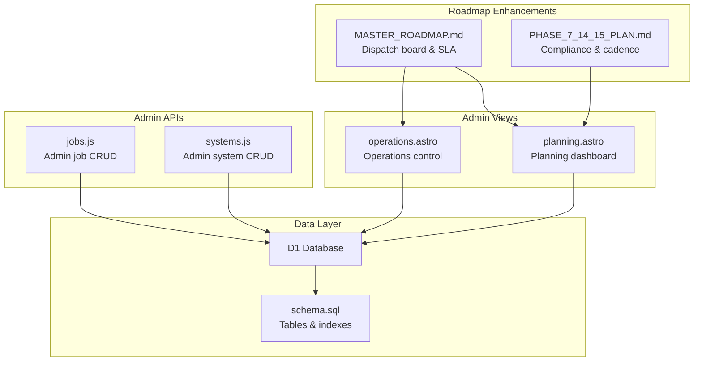
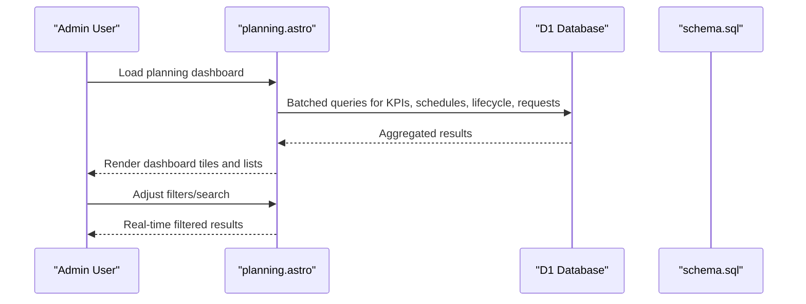
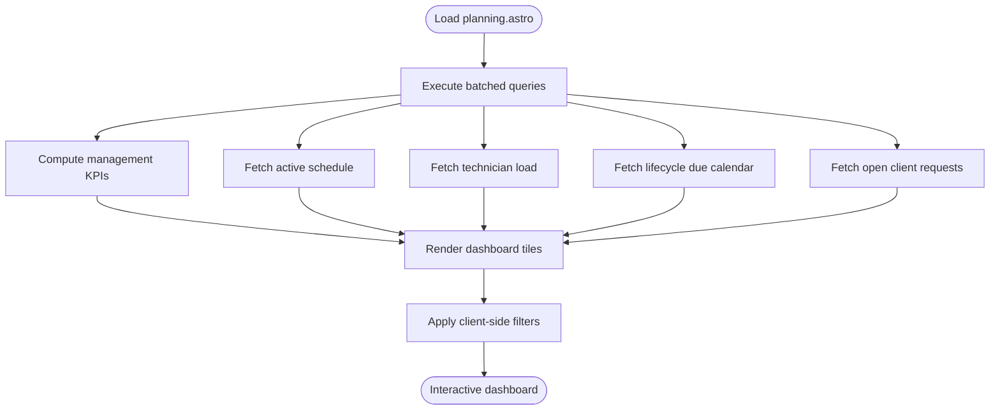
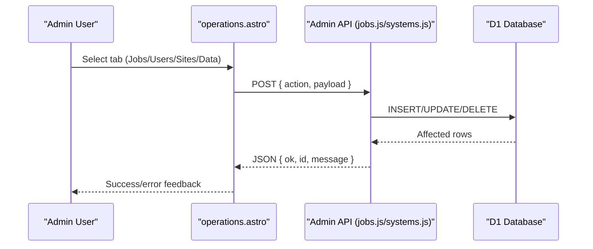
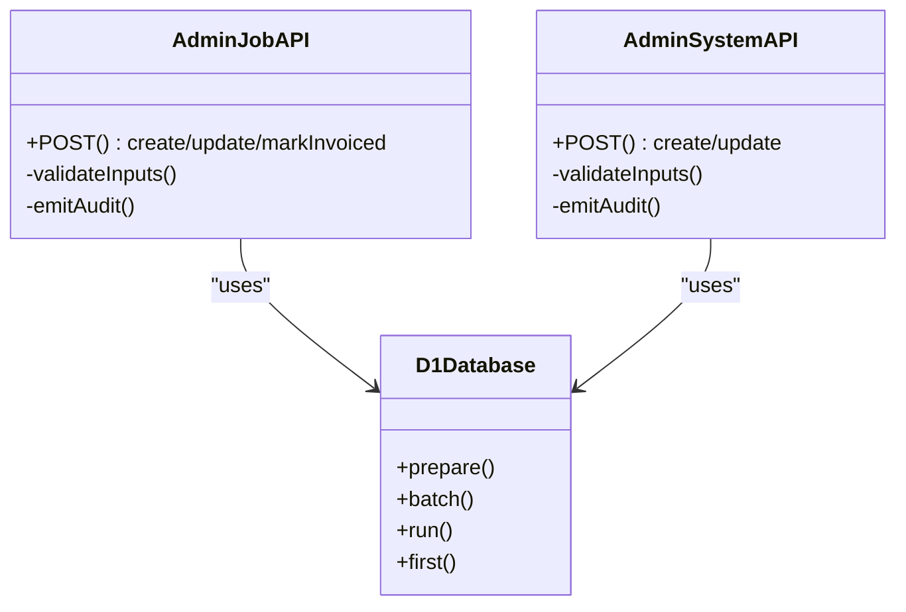
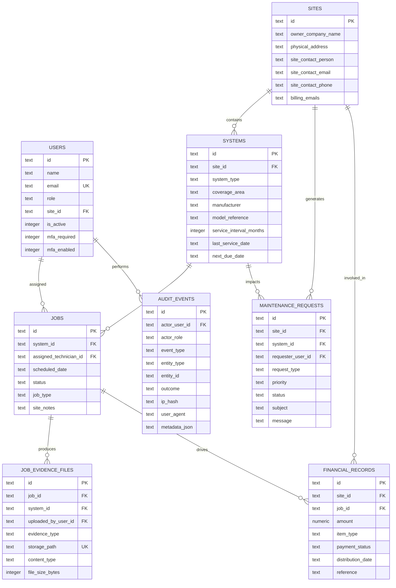
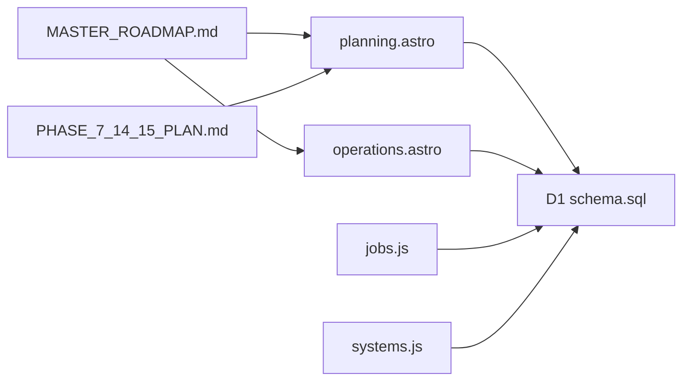

# Strategic Planning

<cite>
**Referenced Files in This Document**
- [planning.astro](file://src/pages/portal/admin/planning.astro)
- [operations.astro](file://src/pages/portal/admin/operations.astro)
- [jobs.js](file://src/pages/portal/api/admin/jobs.js)
- [systems.js](file://src/pages/portal/api/admin/systems.js)
- [schema.sql](file://schema.sql)
- [MASTER_ROADMAP.md](file://docs/roadmap/MASTER_ROADMAP.md)
- [PHASE_7_14_15_PLAN.md](file://docs/roadmap/PHASE_7_14_15_PLAN.md)
- [0002_portal_operations.sql](file://migrations/0002_portal_operations.sql)
</cite>

## Table of Contents
1. [Introduction](#introduction)
2. [Project Structure](#project-structure)
3. [Core Components](#core-components)
4. [Architecture Overview](#architecture-overview)
5. [Detailed Component Analysis](#detailed-component-analysis)
6. [Dependency Analysis](#dependency-analysis)
7. [Performance Considerations](#performance-considerations)
8. [Troubleshooting Guide](#troubleshooting-guide)
9. [Conclusion](#conclusion)
10. [Appendices](#appendices)

## Introduction
This document describes the Strategic Planning system for long-term operational planning, resource forecasting, and capacity management. It explains the lifecycle planning interface, predictive analytics for system maintenance, and strategic resource allocation. It also covers planning workflows for system upgrades, capacity expansion, and operational optimization, and details integration with historical data for trend analysis and future demand forecasting. Practical examples, capacity planning calculations, and resource allocation strategies are included, along with the planning tools, forecasting models, and decision support systems used in operational planning.

## Project Structure
The Strategic Planning system is implemented as part of the portal’s administrative interface. It consists of:
- A planning dashboard that surfaces operational KPIs, lifecycle due dates, and open client requests.
- An operations control panel for managing users, sites, systems, and jobs.
- Admin APIs for creating and updating jobs and systems.
- A relational schema that persists lifecycle, dispatch, and maintenance data.
- Roadmap-driven enhancements that define future dispatch boards, SLA operations, and compliance workflows.

**Diagram sources**
- [planning.astro](file://src/pages/portal/admin/planning.astro)
- [operations.astro](file://src/pages/portal/admin/operations.astro)
- [jobs.js](file://src/pages/portal/api/admin/jobs.js)
- [systems.js](file://src/pages/portal/api/admin/systems.js)
- [schema.sql](file://schema.sql)
- [MASTER_ROADMAP.md](file://docs/roadmap/MASTER_ROADMAP.md)
- [PHASE_7_14_15_PLAN.md](file://docs/roadmap/PHASE_7_14_15_PLAN.md)

**Section sources**
- [planning.astro](file://src/pages/portal/admin/planning.astro)
- [operations.astro](file://src/pages/portal/admin/operations.astro)
- [jobs.js](file://src/pages/portal/api/admin/jobs.js)
- [systems.js](file://src/pages/portal/api/admin/systems.js)
- [schema.sql](file://schema.sql)
- [MASTER_ROADMAP.md](file://docs/roadmap/MASTER_ROADMAP.md)
- [PHASE_7_14_15_PLAN.md](file://docs/roadmap/PHASE_7_14_15_PLAN.md)

## Core Components
- Planning dashboard: Aggregates operational metrics (scheduled, in-progress, overdue, due soon, critical requests, unassigned jobs), displays active schedules, technician load snapshots, lifecycle due calendar, and open client requests. Provides client-side filtering for schedule and lifecycle lists.
- Operations control: Manages users, sites, systems, and jobs; supports creation and updates via admin APIs; includes import/export and client-site access controls.
- Admin APIs: Enforce validation and auditing for job and system administration, ensuring only authorized actions are performed.
- Data model: Defines lifecycle, dispatch, and maintenance entities with indexes supporting planning queries.
- Roadmap: Outlines future dispatch board, SLA operations, and compliance workflows to evolve the planning system.

**Section sources**
- [planning.astro](file://src/pages/portal/admin/planning.astro)
- [operations.astro](file://src/pages/portal/admin/operations.astro)
- [jobs.js](file://src/pages/portal/api/admin/jobs.js)
- [systems.js](file://src/pages/portal/api/admin/systems.js)
- [schema.sql](file://schema.sql)
- [MASTER_ROADMAP.md](file://docs/roadmap/MASTER_ROADMAP.md)

## Architecture Overview
The Strategic Planning system integrates UI views, admin APIs, and a relational data model. The planning dashboard performs batched queries to compute operational KPIs and render planning tiles. The operations panel provides CRUD controls for systems and jobs, backed by admin endpoints. The schema defines lifecycle and dispatch entities with indexes enabling efficient planning queries.

**Diagram sources**
- [planning.astro](file://src/pages/portal/admin/planning.astro)
- [schema.sql](file://schema.sql)

**Section sources**
- [planning.astro](file://src/pages/portal/admin/planning.astro)
- [schema.sql](file://schema.sql)

## Detailed Component Analysis

### Planning Dashboard
The planning dashboard computes and displays:
- Management KPIs: scheduled jobs, in-progress jobs, overdue systems, due within 30 days, critical requests, and unassigned jobs.
- Active schedule: lists upcoming jobs with search and status filtering.
- Technician load: shows scheduled and in-progress counts per technician.
- Lifecycle due calendar: lists systems due within a 90-day horizon, color-coded by risk.
- Open client requests: prioritized queue for review and scheduling.

Client-side filtering logic enables quick discovery of relevant jobs and systems.

**Diagram sources**
- [planning.astro](file://src/pages/portal/admin/planning.astro)

**Section sources**
- [planning.astro](file://src/pages/portal/admin/planning.astro)

### Operations Control Panel
The operations panel organizes administrative tasks across tabs:
- Enquiries: Displays recent contact submissions.
- Jobs: Lists jobs with search, status filter, and inline edit/update/create forms.
- Users: Manages user profiles, roles, and MFA settings.
- Sites & Systems: Manages client sites, system records, and service intervals.
- Data: Supports CSV import/export for users, sites, and systems.

Admin actions are validated and audited via centralized admin helpers and endpoints.

**Diagram sources**
- [operations.astro](file://src/pages/portal/admin/operations.astro)
- [jobs.js](file://src/pages/portal/api/admin/jobs.js)
- [systems.js](file://src/pages/portal/api/admin/systems.js)

**Section sources**
- [operations.astro](file://src/pages/portal/admin/operations.astro)
- [jobs.js](file://src/pages/portal/api/admin/jobs.js)
- [systems.js](file://src/pages/portal/api/admin/systems.js)

### Admin APIs for Planning
Admin APIs enforce validation and auditing for job and system administration:
- Job administration: supports create, update, and “mark as invoiced” transitions with status checks.
- System administration: supports create, update, and maintains service intervals and due dates.

Both endpoints emit audit events for traceability.

**Diagram sources**
- [jobs.js](file://src/pages/portal/api/admin/jobs.js)
- [systems.js](file://src/pages/portal/api/admin/systems.js)

**Section sources**
- [jobs.js](file://src/pages/portal/api/admin/jobs.js)
- [systems.js](file://src/pages/portal/api/admin/systems.js)

### Data Model for Lifecycle and Capacity Planning
The schema defines core entities for lifecycle and capacity planning:
- Users, Sites, Systems, Jobs, Maintenance Requests, Financial Records, Job Evidence Files, Document Access Logs, Audit Events, Rate Limits, Password Reset Tokens, Revoked Sessions, Contact Submissions.
- Indexes support efficient querying for planning views (e.g., systems by due date, jobs by status and technician, maintenance requests by status and priority).

**Diagram sources**
- [schema.sql](file://schema.sql)

**Section sources**
- [schema.sql](file://schema.sql)

### Predictive Analytics for System Maintenance
Predictive analytics for maintenance can be built on:
- Historical service intervals and due-date trends from the Systems table.
- Job completion and evidence from Jobs and Job Evidence Files.
- Maintenance request patterns from Maintenance Requests.

Potential models:
- Exponential smoothing for next due date prediction.
- Regression on service interval vs. actual lifespan.
- Classification models for defect severity to prioritize follow-ups.

Integration points:
- Use D1 SQL aggregates and indexes to compute historical trends.
- Extend the planning dashboard with forecast tiles and anomaly alerts.

[No sources needed since this section provides conceptual guidance]

### Strategic Resource Allocation
Resource allocation leverages:
- Technician load snapshots from the planning dashboard.
- Unassigned jobs and overdue systems to balance capacity.
- Priority and SLA status (future roadmap) to allocate high-impact tasks.

Allocation strategies:
- Even distribution of scheduled and in-progress jobs per technician.
- Surge capacity planning for critical and overdue systems.
- Cross-training and secondary technician assignments for high-priority tasks.

[No sources needed since this section provides conceptual guidance]

### Planning Workflows
- System upgrades: Use the Sites & Systems panel to update system attributes and service intervals; leverage lifecycle due calendar to schedule upgrades.
- Capacity expansion: Monitor technician load and overdue systems; plan additional resources based on growth trends.
- Operational optimization: Use the Jobs panel to track status transitions, identify bottlenecks, and improve scheduling efficiency.

[No sources needed since this section provides conceptual guidance]

### Integration with Historical Data
Historical data integration supports:
- Trend analysis of overdue systems and critical requests.
- Forecasting future demand using service intervals and job histories.
- Capacity planning by correlating job volumes with technician load.

[No sources needed since this section provides conceptual guidance]

### Practical Examples
- Capacity planning calculation: Compute average jobs per technician per month from historical Jobs data; compare against current scheduled loads to determine headroom or shortages.
- Resource allocation strategy: Prioritize overdue systems and critical requests; assign unassigned jobs to the least busy technicians within proximity.
- Strategic scenario: If the lifecycle due calendar shows a surge in due dates over the next quarter, increase temporary capacity or adjust service intervals to spread workload.

[No sources needed since this section provides conceptual guidance]

## Dependency Analysis
The planning system depends on:
- UI components (planning.astro, operations.astro) for rendering and filtering.
- Admin APIs (jobs.js, systems.js) for data mutations.
- D1 schema (schema.sql) for persistence and indexing.
- Roadmap documents (MASTER_ROADMAP.md, PHASE_7_14_15_PLAN.md) for future enhancements.

**Diagram sources**
- [planning.astro](file://src/pages/portal/admin/planning.astro)
- [operations.astro](file://src/pages/portal/admin/operations.astro)
- [jobs.js](file://src/pages/portal/api/admin/jobs.js)
- [systems.js](file://src/pages/portal/api/admin/systems.js)
- [schema.sql](file://schema.sql)
- [MASTER_ROADMAP.md](file://docs/roadmap/MASTER_ROADMAP.md)
- [PHASE_7_14_15_PLAN.md](file://docs/roadmap/PHASE_7_14_15_PLAN.md)

**Section sources**
- [planning.astro](file://src/pages/portal/admin/planning.astro)
- [operations.astro](file://src/pages/portal/admin/operations.astro)
- [jobs.js](file://src/pages/portal/api/admin/jobs.js)
- [systems.js](file://src/pages/portal/api/admin/systems.js)
- [schema.sql](file://schema.sql)
- [MASTER_ROADMAP.md](file://docs/roadmap/MASTER_ROADMAP.md)
- [PHASE_7_14_15_PLAN.md](file://docs/roadmap/PHASE_7_14_15_PLAN.md)

## Performance Considerations
- Use D1 indexes to accelerate planning queries (e.g., systems by due date, jobs by status and technician).
- Batch queries in the planning dashboard to minimize round-trips.
- Paginate or lazy-load large lists in the operations panel to avoid UI slowdowns.
- Cache frequently accessed configuration data (e.g., service intervals) in memory where appropriate.

[No sources needed since this section provides general guidance]

## Troubleshooting Guide
Common issues and resolutions:
- Planning data not loading: Verify database connectivity and permissions; check for errors emitted in the planning view.
- Admin actions failing: Confirm CSRF tokens, authentication, and endpoint methods; inspect audit logs for failures.
- Import/export errors: Validate CSV headers and data types; review failure lists for row-specific issues.
- Missing or delayed metrics: Ensure indexes exist and are up to date; re-run migrations if schema changes are applied.

**Section sources**
- [planning.astro](file://src/pages/portal/admin/planning.astro)
- [operations.astro](file://src/pages/portal/admin/operations.astro)
- [jobs.js](file://src/pages/portal/api/admin/jobs.js)
- [systems.js](file://src/pages/portal/api/admin/systems.js)
- [0002_portal_operations.sql](file://migrations/0002_portal_operations.sql)

## Conclusion
The Strategic Planning system provides a robust foundation for operational planning, lifecycle management, and capacity allocation. Its dashboard and operations panel enable administrators to monitor KPIs, manage systems and jobs, and prepare for future enhancements such as dispatch boards and SLA operations. By leveraging the schema, admin APIs, and roadmap-defined improvements, organizations can evolve toward predictive, data-driven planning and resource optimization.

[No sources needed since this section summarizes without analyzing specific files]

## Appendices

### Appendix A: Roadmap-Driven Enhancements for Planning
- Dispatch Board and SLA Operations: Introduce a dispatch board with unassigned queues, technician columns, required-by dates, priority, and SLA status.
- Admin Workspace Split: Separate dense operations into focused workspaces for Users, Sites, Systems, Jobs, Client Access, and Data.
- Compliance and Defects: Add compliance workspace with defect registers, certificates, and SANS-aligned workflows.

**Section sources**
- [MASTER_ROADMAP.md](file://docs/roadmap/MASTER_ROADMAP.md)

### Appendix B: Compliance and Maintenance Cadence
- Maintenance cadence tables and defect severity classifications support lifecycle planning and risk reduction.
- Certificate readiness logic ensures compliance before issuing certificates.

**Section sources**
- [PHASE_7_14_15_PLAN.md](file://docs/roadmap/PHASE_7_14_15_PLAN.md)