# Authentication & Authorization

<cite>
**Referenced Files in This Document**
- [auth.js](file://src/lib/server/auth.js)
- [csrf.js](file://src/lib/server/csrf.js)
- [rateLimit.js](file://src/lib/server/rateLimit.js)
- [request.js](file://src/lib/server/request.js)
- [bindings.js](file://src/lib/server/bindings.js)
- [middleware.js](file://src/middleware.js)
- [auth.api.js](file://src/pages/portal/api/auth.js)
- [logout.api.js](file://src/pages/portal/api/logout.js)
- [mfa.api.js](file://src/pages/portal/api/mfa.js)
- [change-password.api.js](file://src/pages/portal/api/change-password.js)
- [reset-password.api.js](file://src/pages/portal/api/reset-password.js)
- [mfa.js](file://src/lib/server/mfa.js)
- [login.astro](file://src/pages/portal/login.astro)
- [mfa.astro](file://src/pages/portal/account/mfa.astro)
- [password.astro](file://src/pages/portal/account/password.astro)
- [0007_user_mfa.sql](file://migrations/0007_user_mfa.sql)
- [0009_revoked_sessions.sql](file://migrations/0009_revoked_sessions.sql)
- [0011_contact_submissions.sql](file://migrations/0011_contact_submissions.sql)
- [PORTAL_ROLE_QA_CHECKLIST.md](file://docs/qa/PORTAL_ROLE_QA_CHECKLIST.md)
</cite>

## Table of Contents
1. [Introduction](#introduction)
2. [Project Structure](#project-structure)
3. [Core Components](#core-components)
4. [Architecture Overview](#architecture-overview)
5. [Detailed Component Analysis](#detailed-component-analysis)
6. [Dependency Analysis](#dependency-analysis)
7. [Performance Considerations](#performance-considerations)
8. [Troubleshooting Guide](#troubleshooting-guide)
9. [Conclusion](#conclusion)
10. [Appendices](#appendices)

## Introduction
This document explains the authentication and authorization model for the multi-role portal. It covers JWT-like session tokens, role hierarchy (technician, admin, client, finance), MFA integration, and the middleware security layer (CSRF protection, rate limiting, request validation). It also documents the end-to-end authentication flow from login through session management to logout, along with role-based access control patterns, permission inheritance, and security best practices tailored for the Workers/D1 environment.

## Project Structure
The authentication system spans server-side libraries, middleware, and API endpoints:
- Session and password utilities: [auth.js](file://src/lib/server/auth.js)
- CSRF protection: [csrf.js](file://src/lib/server/csrf.js)
- Rate limiting: [rateLimit.js](file://src/lib/server/rateLimit.js)
- Request fingerprinting: [request.js](file://src/lib/server/request.js)
- Cloudflare bindings: [bindings.js](file://src/lib/server/bindings.js)
- Global middleware: [middleware.js](file://src/middleware.js)
- Authentication endpoints: [auth.api.js](file://src/pages/portal/api/auth.js), [logout.api.js](file://src/pages/portal/api/logout.js), [mfa.api.js](file://src/pages/portal/api/mfa.js), [change-password.api.js](file://src/pages/portal/api/change-password.js), [reset-password.api.js](file://src/pages/portal/api/reset-password.js)
- MFA utilities: [mfa.js](file://src/lib/server/mfa.js)
- Role-based UI pages: [login.astro](file://src/pages/portal/login.astro), [mfa.astro](file://src/pages/portal/account/mfa.astro), [password.astro](file://src/pages/portal/account/password.astro)
- Schema migrations: [0007_user_mfa.sql](file://migrations/0007_user_mfa.sql), [0009_revoked_sessions.sql](file://migrations/0009_revoked_sessions.sql), [0011_contact_submissions.sql](file://migrations/0011_contact_submissions.sql)
- QA checklist: [PORTAL_ROLE_QA_CHECKLIST.md](file://docs/qa/PORTAL_ROLE_QA_CHECKLIST.md)

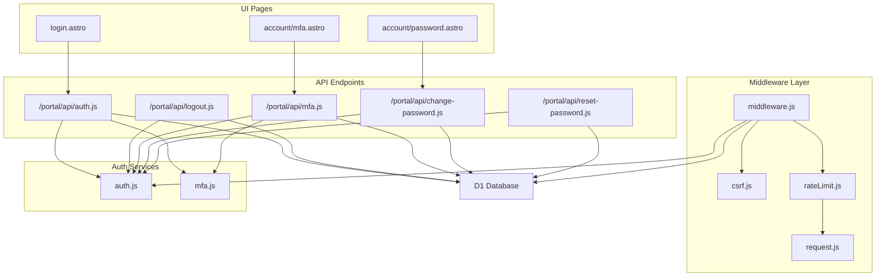

**Diagram sources**
- [middleware.js:1-214](file://src/middleware.js#L1-L214)
- [csrf.js:1-107](file://src/lib/server/csrf.js#L1-L107)
- [rateLimit.js:1-56](file://src/lib/server/rateLimit.js#L1-L56)
- [request.js:1-36](file://src/lib/server/request.js#L1-L36)
- [auth.js:1-217](file://src/lib/server/auth.js#L1-L217)
- [mfa.js:1-132](file://src/lib/server/mfa.js#L1-L132)
- [auth.api.js:1-171](file://src/pages/portal/api/auth.js#L1-L171)
- [logout.api.js:1-37](file://src/pages/portal/api/logout.js#L1-L37)
- [mfa.api.js:1-165](file://src/pages/portal/api/mfa.js#L1-L165)
- [change-password.api.js:1-114](file://src/pages/portal/api/change-password.js#L1-L114)
- [reset-password.api.js:1-94](file://src/pages/portal/api/reset-password.js#L1-L94)

**Section sources**
- [middleware.js:1-214](file://src/middleware.js#L1-L214)
- [auth.js:1-217](file://src/lib/server/auth.js#L1-L217)
- [csrf.js:1-107](file://src/lib/server/csrf.js#L1-L107)
- [rateLimit.js:1-56](file://src/lib/server/rateLimit.js#L1-L56)
- [request.js:1-36](file://src/lib/server/request.js#L1-L36)
- [bindings.js:1-42](file://src/lib/server/bindings.js#L1-L42)
- [auth.api.js:1-171](file://src/pages/portal/api/auth.js#L1-L171)
- [logout.api.js:1-37](file://src/pages/portal/api/logout.js#L1-L37)
- [mfa.api.js:1-165](file://src/pages/portal/api/mfa.js#L1-L165)
- [change-password.api.js:1-114](file://src/pages/portal/api/change-password.js#L1-L114)
- [reset-password.api.js:1-94](file://src/pages/portal/api/reset-password.js#L1-L94)
- [mfa.js:1-132](file://src/lib/server/mfa.js#L1-L132)
- [login.astro](file://src/pages/portal/login.astro)
- [mfa.astro](file://src/pages/portal/account/mfa.astro)
- [password.astro](file://src/pages/portal/account/password.astro)

## Core Components
- Session Token Management
  - Creation and verification of HMAC-signed tokens with expiration.
  - Cookie helpers for session and CSRF tokens.
  - Token revocation via a fingerprint table.
- CSRF Protection
  - HMAC-protected CSRF tokens with per-user expiration.
  - Validation via header token and cookie.
- Rate Limiting
  - Per-scope, per-subject, sliding-window counters persisted in D1.
- MFA Integration
  - TOTP secret generation and validation.
  - Encrypted storage of secrets in the database.
- Middleware Security Layer
  - Enforces role-based access control, redirects for forced actions, and security headers.
- Authentication Endpoints
  - Login with optional MFA, logout, MFA setup/enable/disable, password change, and password reset.

**Section sources**
- [auth.js:48-157](file://src/lib/server/auth.js#L48-L157)
- [csrf.js:36-106](file://src/lib/server/csrf.js#L36-L106)
- [rateLimit.js:3-46](file://src/lib/server/rateLimit.js#L3-L46)
- [mfa.js:36-131](file://src/lib/server/mfa.js#L36-L131)
- [middleware.js:110-213](file://src/middleware.js#L110-L213)
- [auth.api.js:36-166](file://src/pages/portal/api/auth.js#L36-L166)
- [logout.api.js:9-32](file://src/pages/portal/api/logout.js#L9-L32)
- [mfa.api.js:28-160](file://src/pages/portal/api/mfa.js#L28-L160)
- [change-password.api.js:8-109](file://src/pages/portal/api/change-password.js#L8-L109)
- [reset-password.api.js:10-93](file://src/pages/portal/api/reset-password.js#L10-L93)

## Architecture Overview
The system enforces authentication and authorization centrally via middleware and exposes REST-like endpoints for state-changing operations. Sessions are cookie-based with strict attributes and short-lived tokens. CSRF tokens are validated for state-changing requests. Rate limits protect sensitive endpoints. MFA is integrated during login and can be enabled/disabled by eligible roles.

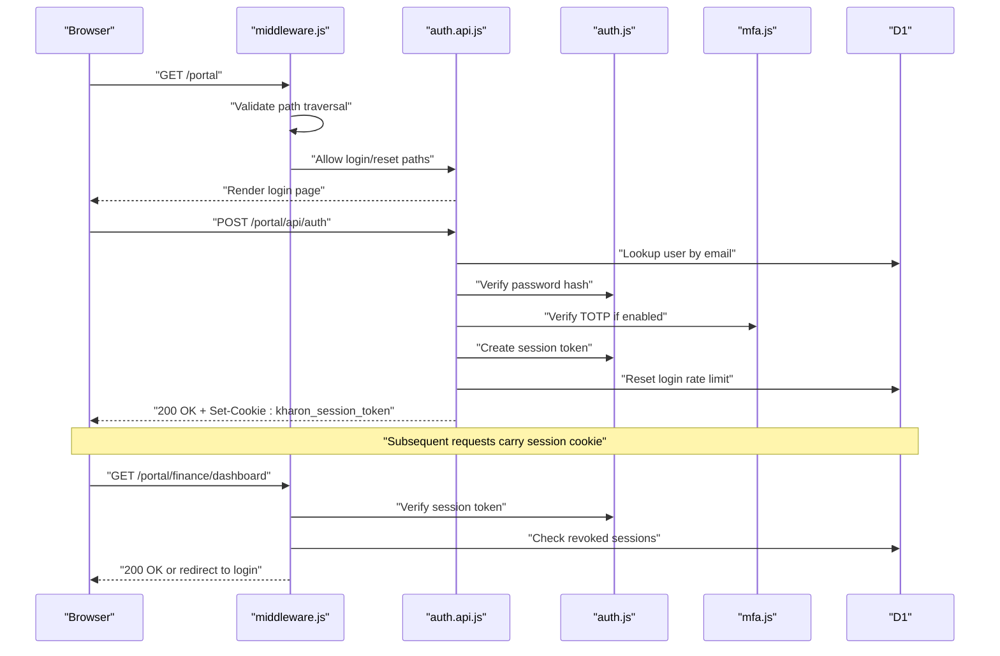

**Diagram sources**
- [middleware.js:110-213](file://src/middleware.js#L110-L213)
- [auth.api.js:36-166](file://src/pages/portal/api/auth.js#L36-L166)
- [auth.js:75-108](file://src/lib/server/auth.js#L75-L108)
- [mfa.js:108-119](file://src/lib/server/mfa.js#L108-L119)

## Detailed Component Analysis

### Session Token Management
- Token format: base64Url-encoded payload concatenated with HMAC signature.
- Payload includes user identity, role, site association, flags, and expiration.
- Verification validates signature, role, and expiration; rejects malformed or expired tokens.
- Revocation: fingerprints are stored with expiry; revoked tokens are rejected even if otherwise valid.
- Cookies: session cookie is HttpOnly, SameSite=Strict, Max-Age aligned with token TTL; secure flag applied outside local environments.

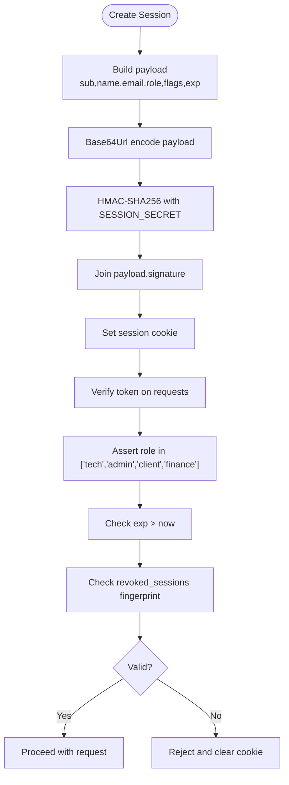

**Diagram sources**
- [auth.js:48-108](file://src/lib/server/auth.js#L48-L108)
- [auth.js:125-157](file://src/lib/server/auth.js#L125-L157)

**Section sources**
- [auth.js:48-157](file://src/lib/server/auth.js#L48-L157)
- [auth.js:125-157](file://src/lib/server/auth.js#L125-L157)

### CSRF Protection
- CSRF tokens are HMAC-signed, per-user, and expire after a fixed duration.
- Tokens are validated from both cookie and x-csrf-token header.
- On state-changing requests, middleware enforces CSRF; otherwise returns 403.
- CSRF cookie is set alongside session cookie when needed.

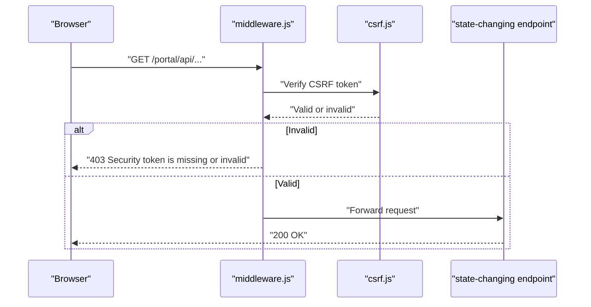

**Diagram sources**
- [middleware.js:146-184](file://src/middleware.js#L146-L184)
- [csrf.js:36-70](file://src/lib/server/csrf.js#L36-L70)

**Section sources**
- [csrf.js:36-106](file://src/lib/server/csrf.js#L36-L106)
- [middleware.js:146-184](file://src/middleware.js#L146-L184)

### Rate Limiting
- Sliding window implemented via INSERT ... ON CONFLICT UPDATE with window_start tracking.
- Keys combine scope, IP hash, and subject hash to isolate limits per endpoint and user/IP.
- Responses include Retry-After and 429 status for blocked requests.
- Specific scopes and thresholds are defined for portal APIs.

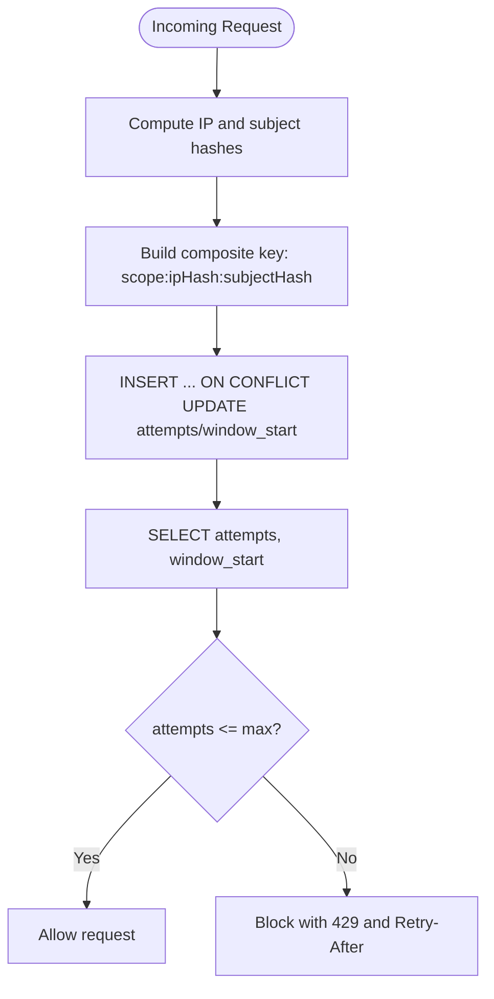

**Diagram sources**
- [rateLimit.js:3-46](file://src/lib/server/rateLimit.js#L3-L46)
- [request.js:26-35](file://src/lib/server/request.js#L26-L35)
- [middleware.js:166-183](file://src/middleware.js#L166-L183)

**Section sources**
- [rateLimit.js:3-46](file://src/lib/server/rateLimit.js#L3-L46)
- [request.js:26-35](file://src/lib/server/request.js#L26-L35)
- [middleware.js:88-108](file://src/middleware.js#L88-L108)

### MFA Integration
- Secret generation uses cryptographically secure randomness and base32 encoding.
- TOTP verification allows a configurable time window around the current counter.
- Secrets are encrypted at rest using AES-GCM with a derived key from a secret.
- During login, if MFA is required and enabled, the provided code is validated.
- MFA endpoints support setup (generate secret), enable (verify code and persist), and disable (require current code).

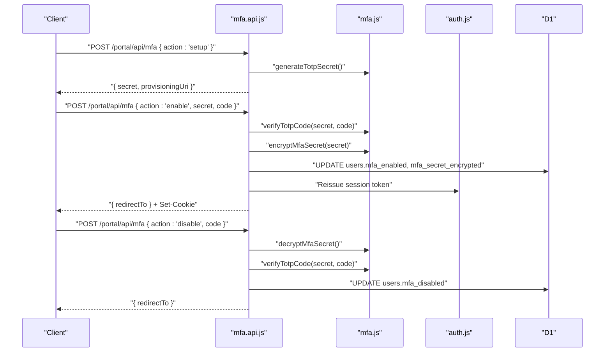

**Diagram sources**
- [mfa.api.js:28-160](file://src/pages/portal/api/mfa.js#L28-L160)
- [mfa.js:36-131](file://src/lib/server/mfa.js#L36-L131)
- [auth.js:120-123](file://src/lib/server/auth.js#L120-L123)

**Section sources**
- [mfa.js:36-131](file://src/lib/server/mfa.js#L36-L131)
- [mfa.api.js:28-160](file://src/pages/portal/api/mfa.js#L28-L160)

### Middleware Security Layer
- Enforces portal path isolation and rejects path traversal attempts.
- Allows unauthenticated access to login and reset routes.
- Verifies session, checks revocation, injects user context, sets CSRF cookie if needed.
- Redirects to role-specific dashboards or enforces required actions (force password change, MFA enable).
- Applies strict security headers to all portal responses.

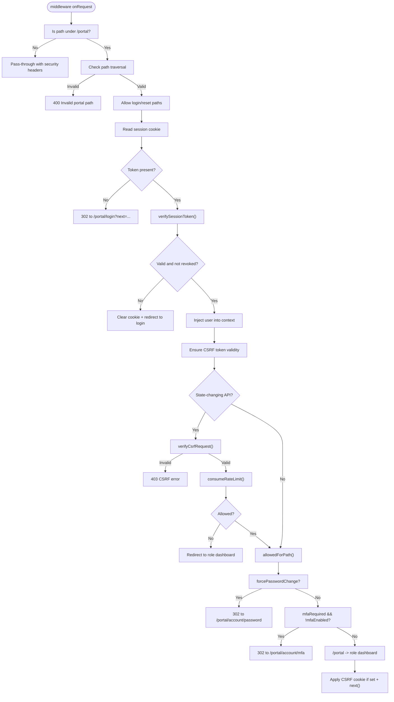

**Diagram sources**
- [middleware.js:110-213](file://src/middleware.js#L110-L213)

**Section sources**
- [middleware.js:110-213](file://src/middleware.js#L110-L213)

### Authentication Flow: Login to Logout
- Login
  - Accepts JSON or form data with email, password, and optional MFA code.
  - Enforces login rate limit scoped to email.
  - Validates credentials and optional MFA; creates session and sets cookie.
  - Redirects to role dashboard or required action pages.
- Session Management
  - Middleware verifies token and revocation on each request.
  - Enforces CSRF and rate limits for state-changing APIs.
- Logout
  - Revokes the current session token, clears session and CSRF cookies, audits event.

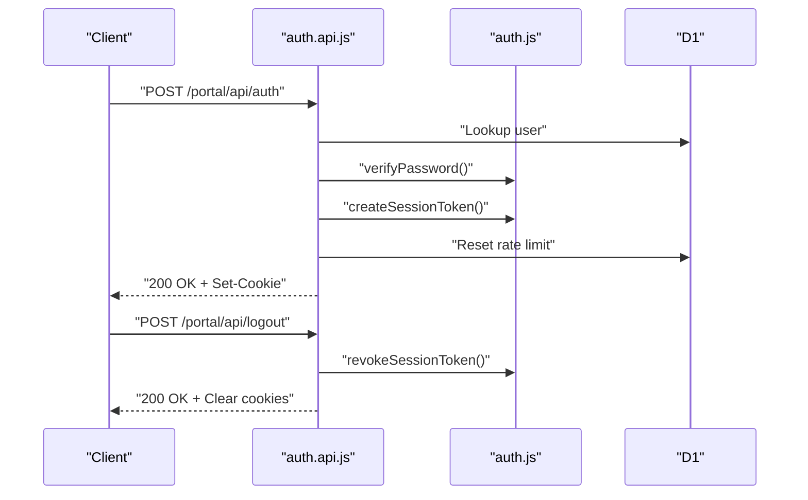

**Diagram sources**
- [auth.api.js:36-166](file://src/pages/portal/api/auth.js#L36-L166)
- [auth.js:138-157](file://src/lib/server/auth.js#L138-L157)
- [logout.api.js:9-32](file://src/pages/portal/api/logout.js#L9-L32)

**Section sources**
- [auth.api.js:36-166](file://src/pages/portal/api/auth.js#L36-L166)
- [logout.api.js:9-32](file://src/pages/portal/api/logout.js#L9-L32)

### Role-Based Access Control Patterns
- Role hierarchy and allowed paths:
  - Technician and Admin can access technician area.
  - Admin-only area.
  - Finance and Admin can access finance area.
  - Client-only area.
- Enforcement occurs in middleware via allowedForPath() and redirects to role dashboards.

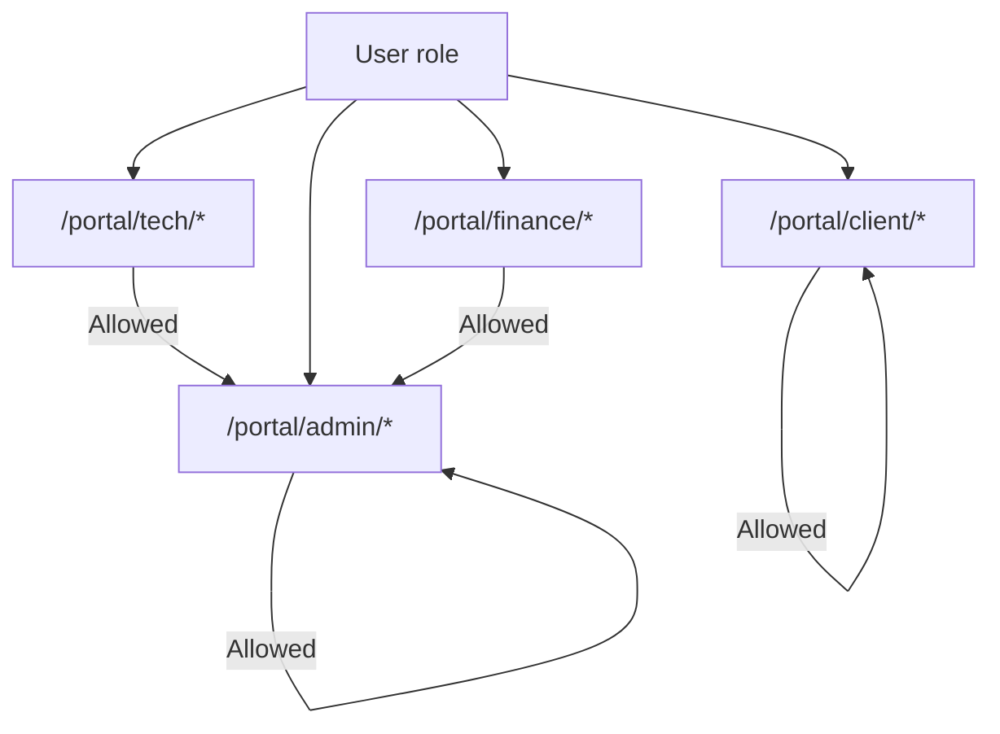

**Diagram sources**
- [middleware.js:57-63](file://src/middleware.js#L57-L63)

**Section sources**
- [middleware.js:57-63](file://src/middleware.js#L57-L63)

### Password Change and Reset
- Change Password
  - Requires current password verification, enforces new password rules, updates hash, clears force flag, reissues session.
- Reset Password
  - Validates token hash, checks expiry and usage, enforces rate limit, updates password and marks force change.

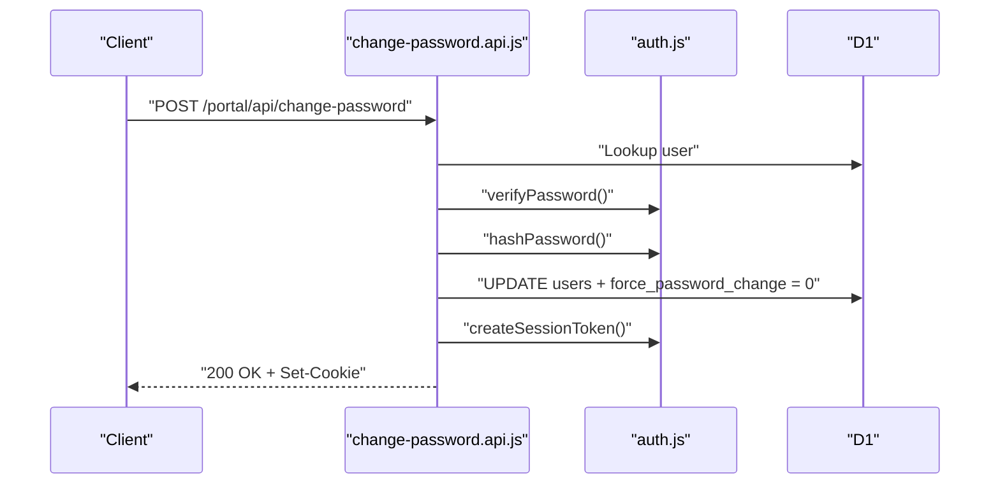

**Diagram sources**
- [change-password.api.js:8-109](file://src/pages/portal/api/change-password.js#L8-L109)
- [auth.js:159-203](file://src/lib/server/auth.js#L159-L203)

**Section sources**
- [change-password.api.js:8-109](file://src/pages/portal/api/change-password.js#L8-L109)
- [reset-password.api.js:10-93](file://src/pages/portal/api/reset-password.js#L10-L93)

## Dependency Analysis
- Middleware depends on auth, csrf, rateLimit, and audit modules.
- API endpoints depend on auth, mfa, rateLimit, and database bindings.
- Database schema supports users, revoked sessions, rate limits, and password reset tokens.

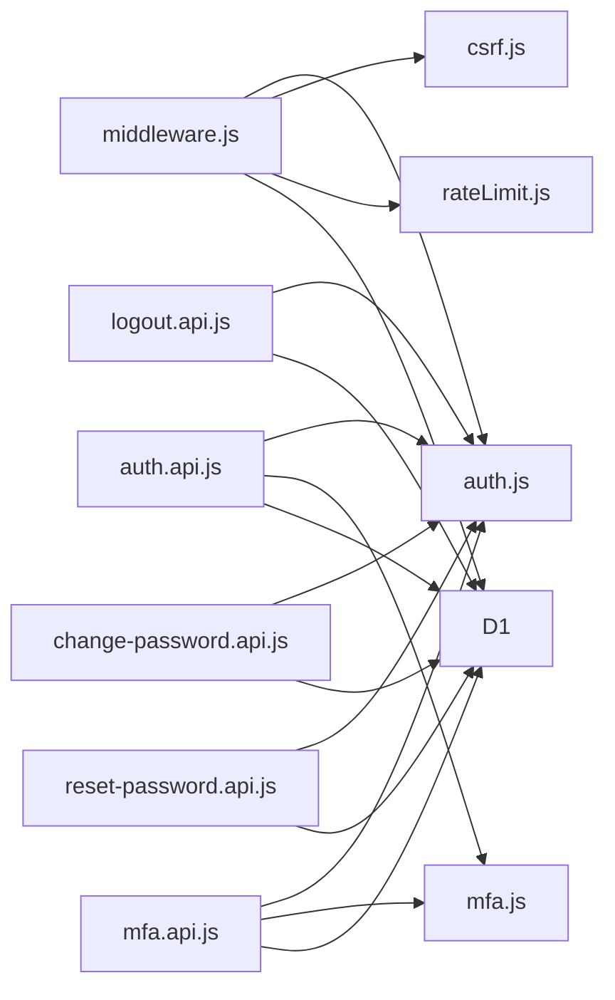

**Diagram sources**
- [middleware.js:1-214](file://src/middleware.js#L1-L214)
- [auth.api.js:1-171](file://src/pages/portal/api/auth.js#L1-L171)
- [logout.api.js:1-37](file://src/pages/portal/api/logout.js#L1-L37)
- [mfa.api.js:1-165](file://src/pages/portal/api/mfa.js#L1-L165)
- [change-password.api.js:1-114](file://src/pages/portal/api/change-password.js#L1-L114)
- [reset-password.api.js:1-94](file://src/pages/portal/api/reset-password.js#L1-L94)

**Section sources**
- [middleware.js:1-214](file://src/middleware.js#L1-L214)
- [auth.api.js:1-171](file://src/pages/portal/api/auth.js#L1-L171)
- [logout.api.js:1-37](file://src/pages/portal/api/logout.js#L1-L37)
- [mfa.api.js:1-165](file://src/pages/portal/api/mfa.js#L1-L165)
- [change-password.api.js:1-114](file://src/pages/portal/api/change-password.js#L1-L114)
- [reset-password.api.js:1-94](file://src/pages/portal/api/reset-password.js#L1-L94)

## Performance Considerations
- Token verification and HMAC operations are CPU-bound; keep payloads minimal.
- Rate-limit keys include IP and subject hashes to prevent abuse while allowing legitimate users.
- Revoked sessions check uses SHA-256 fingerprints; ensure database indexing on fingerprint and expires_at.
- Use SameSite=Strict and HttpOnly cookies to mitigate XSS and CSRF risks.
- Apply CDN-level caching only for static assets; dynamic portal responses should be fresh.

[No sources needed since this section provides general guidance]

## Troubleshooting Guide
- Session cookie not set or immediately cleared
  - Verify SESSION_SECRET is configured with sufficient entropy.
  - Ensure environment is not local when Secure flag is required.
  - Confirm token expiration and revocation logic.
- CSRF errors on state-changing requests
  - Ensure x-csrf-token header matches cookie and is not expired.
  - Re-fetch CSRF token if user context changes.
- Rate limit exceeded
  - Check scope and subject hashing; adjust maxAttempts or windowSeconds if needed.
  - Use resetRateLimit for testing or administrative resets.
- MFA issues
  - Confirm MFA_SECRET is set and long enough.
  - Validate authenticator app time sync and code window.
- Login failures
  - Check user.isActive and password hash verification.
  - Review audit events for detailed failure reasons.

**Section sources**
- [auth.js:34-40](file://src/lib/server/auth.js#L34-L40)
- [csrf.js:24-29](file://src/lib/server/csrf.js#L24-L29)
- [rateLimit.js:3-46](file://src/lib/server/rateLimit.js#L3-L46)
- [mfa.js:23-29](file://src/lib/server/mfa.js#L23-L29)
- [auth.api.js:78-102](file://src/pages/portal/api/auth.js#L78-L102)
- [middleware.js:154-164](file://src/middleware.js#L154-L164)

## Conclusion
The portal implements a robust, layered security model centered on short-lived, HMAC-signed session tokens, enforced by middleware that handles CSRF, rate limiting, and role-based access control. MFA is integrated seamlessly for eligible roles, and endpoints provide clear flows for login, logout, password change, and password reset. Adhering to the best practices outlined here ensures a secure and maintainable authentication and authorization system.

[No sources needed since this section summarizes without analyzing specific files]

## Appendices

### Practical Examples and Endpoints
- Login
  - Endpoint: POST /portal/api/auth
  - Body: email, password, optional mfaCode
  - Response: user info, redirectTo, Set-Cookie: kharon_session_token
- Logout
  - Endpoint: POST /portal/api/logout
  - Response: { ok: true, redirectTo: "/portal/login" }; clears session and CSRF cookies
- MFA Setup/Enable/Disable
  - Endpoint: POST /portal/api/mfa
  - Actions: setup, enable, disable
  - Response: { ok: true, redirectTo, ... } with updated session cookie when applicable
- Change Password
  - Endpoint: POST /portal/api/change-password
  - Body: currentPassword, newPassword, confirmPassword
  - Response: { ok: true, redirectTo } with refreshed session
- Reset Password
  - Endpoint: POST /portal/api/reset-password
  - Body: token, password
  - Response: { ok: true, redirectTo: "/portal/login" }

**Section sources**
- [auth.api.js:36-166](file://src/pages/portal/api/auth.js#L36-L166)
- [logout.api.js:9-32](file://src/pages/portal/api/logout.js#L9-L32)
- [mfa.api.js:28-160](file://src/pages/portal/api/mfa.js#L28-L160)
- [change-password.api.js:8-109](file://src/pages/portal/api/change-password.js#L8-L109)
- [reset-password.api.js:10-93](file://src/pages/portal/api/reset-password.js#L10-L93)

### Token Lifecycle and Security Notes
- Token lifetime: approximately 12 hours; cookie Max-Age matches token TTL.
- Refresh: no separate refresh token; clients rely on re-authentication after expiration.
- Revocation: immediate effect via revoked_sessions table; recommended for logout and suspicious activity.
- Secrets: SESSION_SECRET, CSRF_SECRET, MFA_SECRET must be at least 32 characters; avoid weak values.
- Headers: Strict-Transport-Security, CSP, XFO, and other hardening headers are applied.

**Section sources**
- [auth.js:5, 110-118:5-118](file://src/lib/server/auth.js#L5-L118)
- [middleware.js:19-31](file://src/middleware.js#L19-L31)
- [auth.js:34-40](file://src/lib/server/auth.js#L34-L40)
- [csrf.js:24-29](file://src/lib/server/csrf.js#L24-L29)
- [mfa.js:23-29](file://src/lib/server/mfa.js#L23-L29)

### Role-Based Access Control Reference
- Technician: access to /portal/tech/*
- Admin: access to /portal/admin/* and extended permissions
- Finance: access to /portal/finance/* and admin-extended permissions
- Client: access to /portal/client/*

**Section sources**
- [middleware.js:57-63](file://src/middleware.js#L57-L63)

### QA and Hardening Checklist
- Verify role-based routing and redirection.
- Confirm CSRF enforcement for all state-changing APIs.
- Validate rate limits for login and sensitive endpoints.
- Test MFA setup, enable, disable flows.
- Audit session revocation and cookie attributes.
- Review security headers and CSP policies.

**Section sources**
- [PORTAL_ROLE_QA_CHECKLIST.md](file://docs/qa/PORTAL_ROLE_QA_CHECKLIST.md)