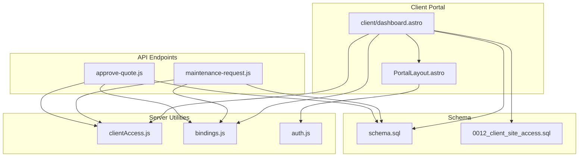
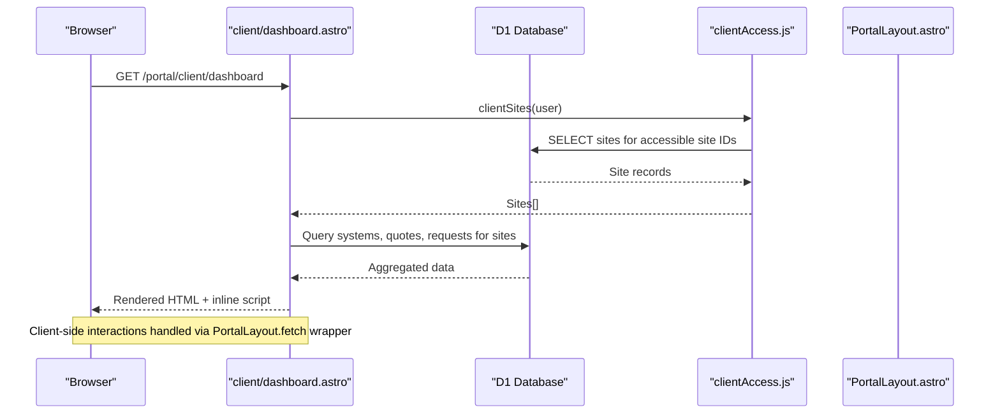
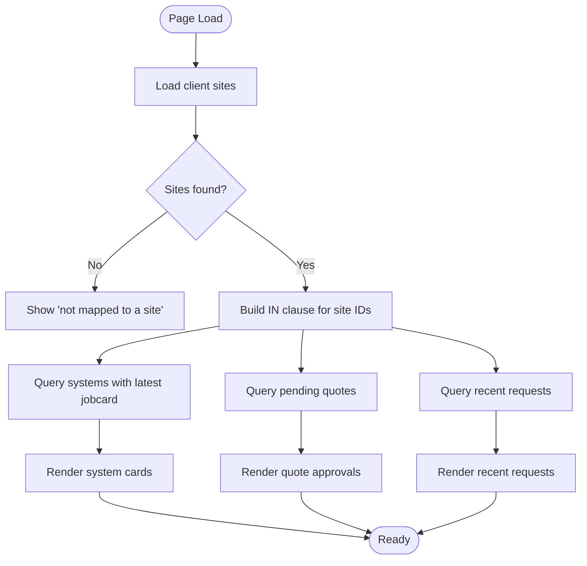
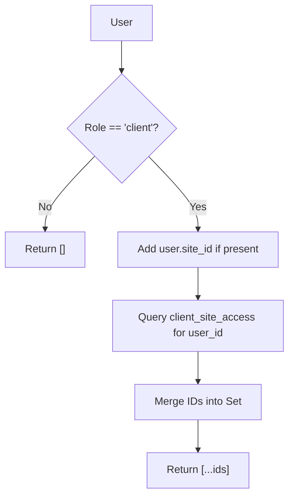
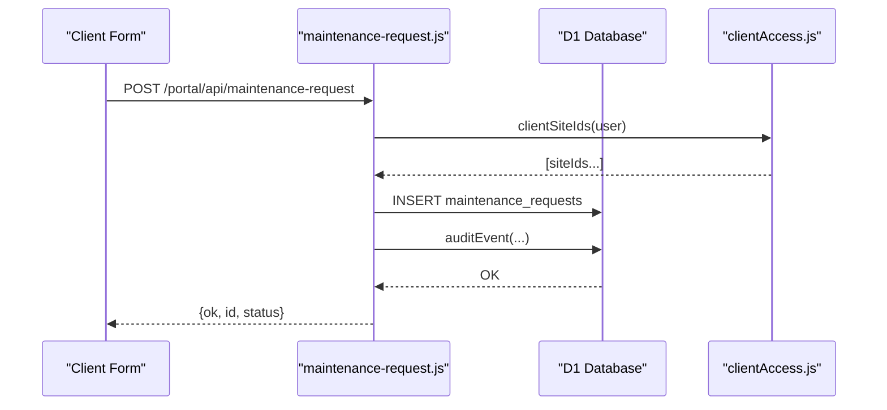
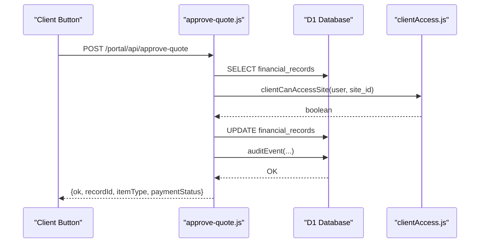
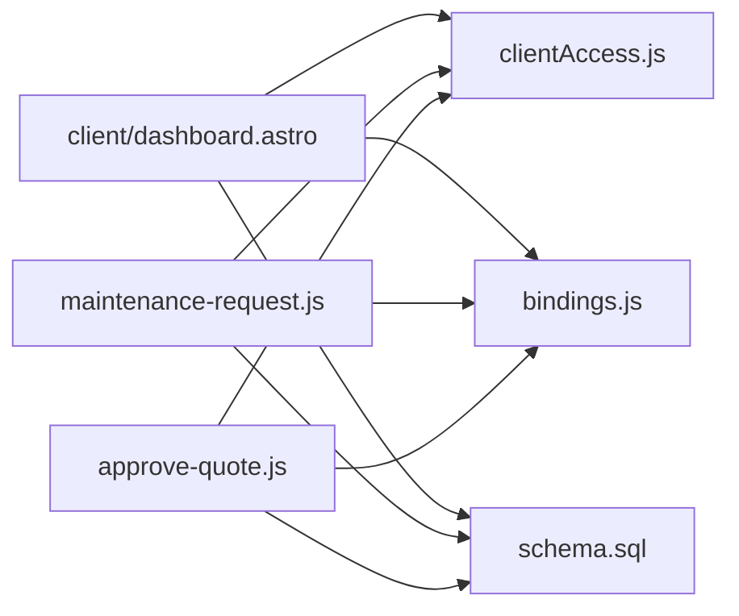

# Client Dashboard

<cite>
**Referenced Files in This Document**
- [client\dashboard.astro](file://src/pages/portal/client/dashboard.astro)
- [clientAccess.js](file://src/lib/server/clientAccess.js)
- [bindings.js](file://src/lib/server/bindings.js)
- [PortalLayout.astro](file://src/layouts/portal/PortalLayout.astro)
- [maintenance-request.js](file://src/pages/portal/api/maintenance-request.js)
- [approve-quote.js](file://src/pages/portal/api/approve-quote.js)
- [auth.js](file://src/lib/server/auth.js)
- [schema.sql](file://schema.sql)
- [0012_client_site_access.sql](file://migrations/0012_client_site_access.sql)
</cite>

## Table of Contents
1. [Introduction](#introduction)
2. [Project Structure](#project-structure)
3. [Core Components](#core-components)
4. [Architecture Overview](#architecture-overview)
5. [Detailed Component Analysis](#detailed-component-analysis)
6. [Dependency Analysis](#dependency-analysis)
7. [Performance Considerations](#performance-considerations)
8. [Troubleshooting Guide](#troubleshooting-guide)
9. [Conclusion](#conclusion)
10. [Appendices](#appendices)

## Introduction
This document explains the client dashboard functionality for the Kharon Portal. It covers the system monitoring interface, site mapping and access controls, dashboard layout, client access control mechanisms, database queries for multi-site accounts, error handling patterns, and practical examples for navigation, interpreting system status, and visualizing maintenance scheduling. It also addresses responsive design considerations and client experience optimization.

## Project Structure
The client dashboard is implemented as an Astro page with server-side rendering and client-side interactivity. It integrates with shared portal layout, authentication utilities, and server-side helpers for client site access and database bindings.

**Diagram sources**
- [client\dashboard.astro:1-303](file://src/pages/portal/client/dashboard.astro#L1-L303)
- [clientAccess.js:1-53](file://src/lib/server/clientAccess.js#L1-L53)
- [bindings.js:1-42](file://src/lib/server/bindings.js#L1-L42)
- [PortalLayout.astro:1-108](file://src/layouts/portal/PortalLayout.astro#L1-L108)
- [maintenance-request.js:1-95](file://src/pages/portal/api/maintenance-request.js#L1-L95)
- [approve-quote.js:1-100](file://src/pages/portal/api/approve-quote.js#L1-L100)
- [schema.sql:1-245](file://schema.sql#L1-L245)
- [0012_client_site_access.sql:1-11](file://migrations/0012_client_site_access.sql#L1-L11)

**Section sources**
- [client\dashboard.astro:1-303](file://src/pages/portal/client/dashboard.astro#L1-L303)
- [PortalLayout.astro:1-108](file://src/layouts/portal/PortalLayout.astro#L1-L108)

## Core Components
- Client dashboard page: Loads client sites, systems, quotes, and recent requests; renders system cards, quote approvals, and recent service requests; handles client-initiated actions via API endpoints.
- Client site access utilities: Resolve accessible site IDs for a client user, fetch site details, and enforce site access checks.
- Database bindings: Provide Cloudflare D1 and R2 accessors used by server-side code.
- Authentication utilities: Manage session tokens, CSRF protection, and token revocation.
- API endpoints: Validate and persist client-submitted maintenance requests and quote approvals with strict access checks.

**Section sources**
- [client\dashboard.astro:1-303](file://src/pages/portal/client/dashboard.astro#L1-L303)
- [clientAccess.js:1-53](file://src/lib/server/clientAccess.js#L1-L53)
- [bindings.js:1-42](file://src/lib/server/bindings.js#L1-L42)
- [auth.js:1-217](file://src/lib/server/auth.js#L1-L217)
- [maintenance-request.js:1-95](file://src/pages/portal/api/maintenance-request.js#L1-L95)
- [approve-quote.js:1-100](file://src/pages/portal/api/approve-quote.js#L1-L100)

## Architecture Overview
The client dashboard follows a server-rendered Astro page pattern with client-side JavaScript for dynamic interactions. It enforces client access controls at both the UI and API layers.

**Diagram sources**
- [client\dashboard.astro:1-303](file://src/pages/portal/client/dashboard.astro#L1-L303)
- [clientAccess.js:28-42](file://src/lib/server/clientAccess.js#L28-L42)
- [bindings.js:18-26](file://src/lib/server/bindings.js#L18-L26)
- [PortalLayout.astro:48-55](file://src/layouts/portal/PortalLayout.astro#L48-L55)

## Detailed Component Analysis

### Client Dashboard Page
Responsibilities:
- Load client-accessible sites and derive site IDs.
- Query systems with latest jobcard documents, quotes pending approval, and recent maintenance requests.
- Render system cards with due dates and latest jobcard download links.
- Render pending quote approvals with inline approval actions.
- Provide a form to submit maintenance requests with site/system filtering.
- Display recent service requests with status and linkage to scheduled dispatches.

Key behaviors:
- Site filtering: Systems dropdown is filtered by selected site.
- Quote approval: Inline buttons trigger API endpoint to convert a quote to an invoice.
- Maintenance request submission: Validates inputs, enforces site/system access, persists request, and logs audit events.

**Diagram sources**
- [client\dashboard.astro:16-84](file://src/pages/portal/client/dashboard.astro#L16-L84)

**Section sources**
- [client\dashboard.astro:1-303](file://src/pages/portal/client/dashboard.astro#L1-L303)

### Client Site Access Controls
Responsibilities:
- Resolve all accessible site IDs for a client user (direct assignment and explicit grants).
- Fetch site details for rendering.
- Enforce site access checks for API endpoints.

Implementation highlights:
- Combines user.site_id with client_site_access entries.
- Uses an IN clause builder for safe SQL queries.
- Provides a helper to check if a given site is accessible.

**Diagram sources**
- [clientAccess.js:1-26](file://src/lib/server/clientAccess.js#L1-L26)

**Section sources**
- [clientAccess.js:1-53](file://src/lib/server/clientAccess.js#L1-L53)

### Database Queries for Multi-Site Accounts
The dashboard performs three primary queries scoped to accessible sites:
- Systems: Joins systems with sites and latest jobcard to surface completion status and due dates.
- Quotes: Filters financial_records for quotes pending approval.
- Requests: Retrieves recent maintenance_requests linked to systems and sites.

These queries rely on:
- IN clauses built from accessible site IDs.
- Indexes on site_id and status for efficient filtering.

**Section sources**
- [client\dashboard.astro:25-79](file://src/pages/portal/client/dashboard.astro#L25-L79)
- [schema.sql:164-172](file://schema.sql#L164-L172)
- [0012_client_site_access.sql:1-11](file://migrations/0012_client_site_access.sql#L1-L11)

### Maintenance Request Submission
Behavior:
- Validates request type, priority, subject, and message.
- Resolves effective site ID from request body, user defaults, or system association.
- Ensures the selected site/system belongs to accessible sites.
- Inserts a new maintenance request and emits an audit event.

**Diagram sources**
- [maintenance-request.js:32-90](file://src/pages/portal/api/maintenance-request.js#L32-L90)
- [clientAccess.js:1-26](file://src/lib/server/clientAccess.js#L1-L26)

**Section sources**
- [maintenance-request.js:1-95](file://src/pages/portal/api/maintenance-request.js#L1-L95)

### Quote Approval
Behavior:
- Validates recordId format and checks site access.
- Confirms the record is a pending quote.
- Updates the record to an unpaid invoice with generated reference and logs audit event.

**Diagram sources**
- [approve-quote.js:14-95](file://src/pages/portal/api/approve-quote.js#L14-L95)
- [clientAccess.js:44-48](file://src/lib/server/clientAccess.js#L44-L48)

**Section sources**
- [approve-quote.js:1-100](file://src/pages/portal/api/approve-quote.js#L1-L100)

### Portal Layout and Client Experience
- Navigation: Role-aware links and active-state highlighting.
- CSRF protection: Global fetch wrapper injects x-csrf-token header.
- Responsive design: Grid layouts adapt to screen sizes; form fields use consistent spacing and typography.
- Logout: Single-click logout via the portal fetch wrapper.

**Section sources**
- [PortalLayout.astro:1-108](file://src/layouts/portal/PortalLayout.astro#L1-L108)

## Dependency Analysis
- The dashboard depends on:
  - Client site access utilities for visibility scoping.
  - Database bindings for D1 access.
  - Schema-defined tables and indexes for query performance.
- API endpoints depend on:
  - Client site access utilities for authorization.
  - Audit logging for compliance.
  - Database bindings for persistence.

**Diagram sources**
- [client\dashboard.astro:1-303](file://src/pages/portal/client/dashboard.astro#L1-L303)
- [clientAccess.js:1-53](file://src/lib/server/clientAccess.js#L1-L53)
- [bindings.js:1-42](file://src/lib/server/bindings.js#L1-L42)
- [schema.sql:1-245](file://schema.sql#L1-L245)
- [maintenance-request.js:1-95](file://src/pages/portal/api/maintenance-request.js#L1-L95)
- [approve-quote.js:1-100](file://src/pages/portal/api/approve-quote.js#L1-L100)

**Section sources**
- [client\dashboard.astro:1-303](file://src/pages/portal/client/dashboard.astro#L1-L303)
- [clientAccess.js:1-53](file://src/lib/server/clientAccess.js#L1-L53)
- [bindings.js:1-42](file://src/lib/server/bindings.js#L1-L42)
- [schema.sql:1-245](file://schema.sql#L1-L245)
- [maintenance-request.js:1-95](file://src/pages/portal/api/maintenance-request.js#L1-L95)
- [approve-quote.js:1-100](file://src/pages/portal/api/approve-quote.js#L1-L100)

## Performance Considerations
- Index usage:
  - Systems: site_id and next_due_date index supports efficient due-date ordering.
  - Financial records: site_id and payment_status index supports quote filtering.
  - Maintenance requests: site_id and created_at index supports recent requests retrieval.
- Query patterns:
  - IN clauses constructed from resolved site IDs avoid cross-site data leakage.
  - Subqueries for latest jobcard minimize redundant joins.
- Rendering:
  - Limit recent requests to a small fixed number to reduce DOM size.
  - Use responsive grids to optimize layout on mobile devices.

[No sources needed since this section provides general guidance]

## Troubleshooting Guide
Common scenarios and resolutions:
- Client account not mapped to any site:
  - The dashboard displays a clear error and prevents further queries.
  - Ensure the user has either a direct site assignment or explicit grants in client_site_access.
- Access denied for site or system:
  - API endpoints return forbidden when the selection is not accessible to the client.
  - Verify site access grants and that the selected system belongs to the chosen site.
- Quote approval blocked:
  - The endpoint validates record existence, type, and status; ensure the record is a pending quote.
- Request submission failures:
  - Validate request type, priority, subject length, and message length.
  - Ensure siteId/systemId selections align with accessible sites.

**Section sources**
- [client\dashboard.astro:20-22](file://src/pages/portal/client/dashboard.astro#L20-L22)
- [maintenance-request.js:32-53](file://src/pages/portal/api/maintenance-request.js#L32-L53)
- [approve-quote.js:37-63](file://src/pages/portal/api/approve-quote.js#L37-L63)

## Conclusion
The client dashboard provides a secure, role-scoped view of systems, quotes, and requests. It enforces access controls at the UI and API layers, uses indexed database queries for performance, and offers a responsive, user-friendly interface. The design balances transparency with data privacy, ensuring clients can monitor lifecycle status while remaining within their authorized scope.

## Appendices

### Practical Examples

- Dashboard navigation:
  - From the portal header, navigate to the client dashboard and quotes sections using role-aware links.
  - Use the “Mapped client sites” section to confirm access scope.

- Interpreting system status:
  - System cards display system type, coverage area, owner company, and due date.
  - Latest jobcard availability is indicated; download when present.

- Maintenance scheduling visualization:
  - Upcoming due dates are surfaced in system cards.
  - Recent service requests show status and any linked dispatch IDs.

- Submitting a maintenance request:
  - Select a site; the system dropdown filters to systems at that site.
  - Choose request type, priority, subject, and message; submit via the form.
  - On success, the result banner shows the new request ID.

- Approving a quote:
  - Click the “Approve quote” button next to a pending quote.
  - On success, the record updates to an unpaid invoice.

**Section sources**
- [client\dashboard.astro:105-225](file://src/pages/portal/client/dashboard.astro#L105-L225)
- [PortalLayout.astro:10-35](file://src/layouts/portal/PortalLayout.astro#L10-L35)
- [maintenance-request.js:248-279](file://src/pages/portal/api/maintenance-request.js#L248-L279)
- [approve-quote.js:281-300](file://src/pages/portal/api/approve-quote.js#L281-L300)