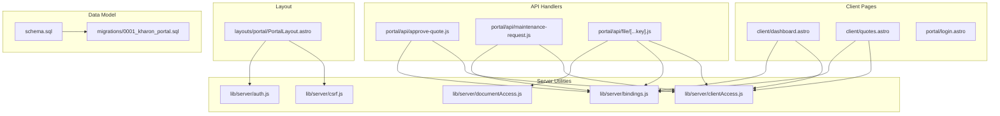
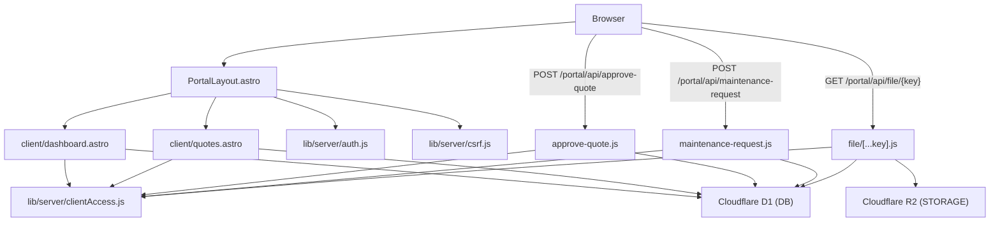
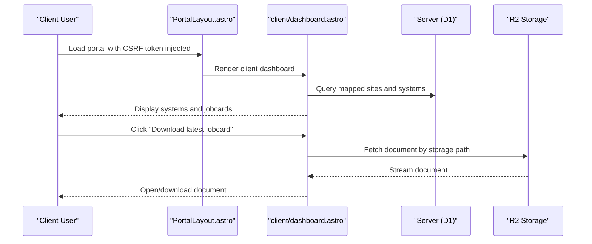
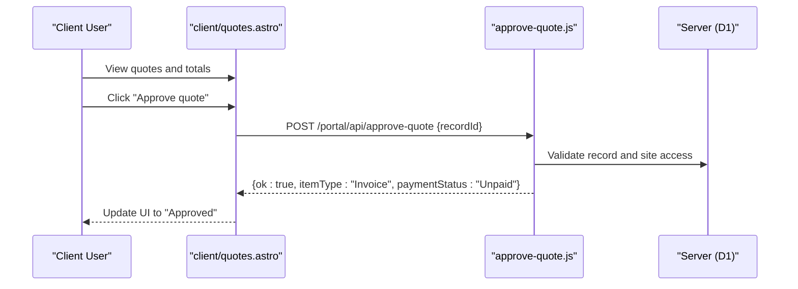
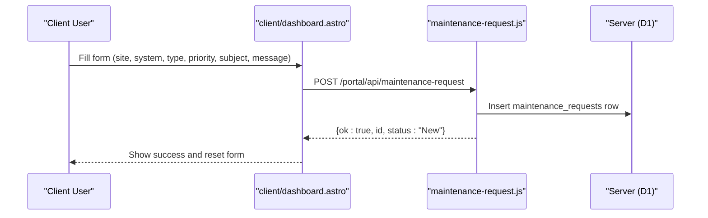
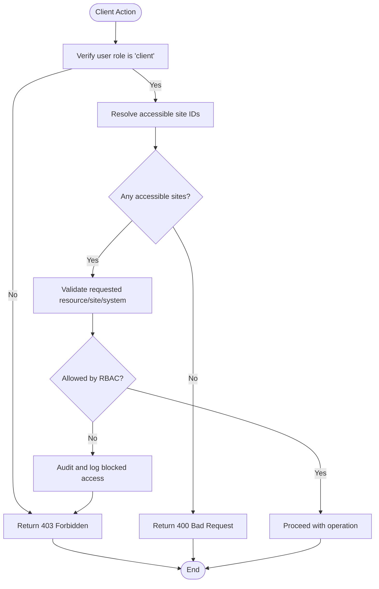
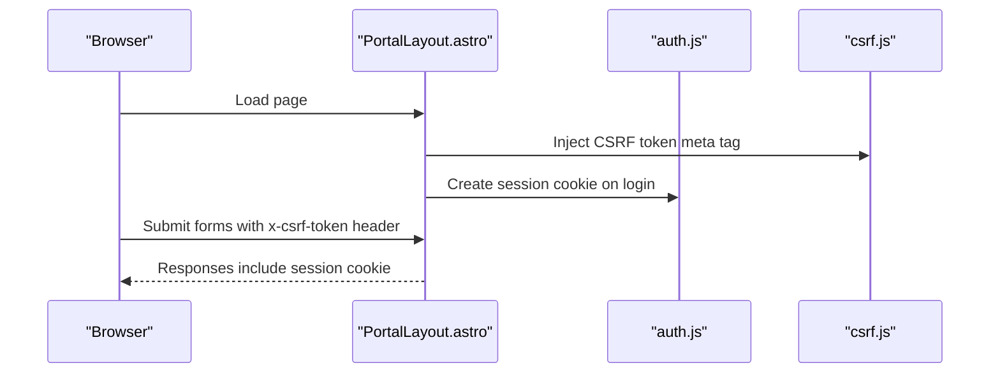
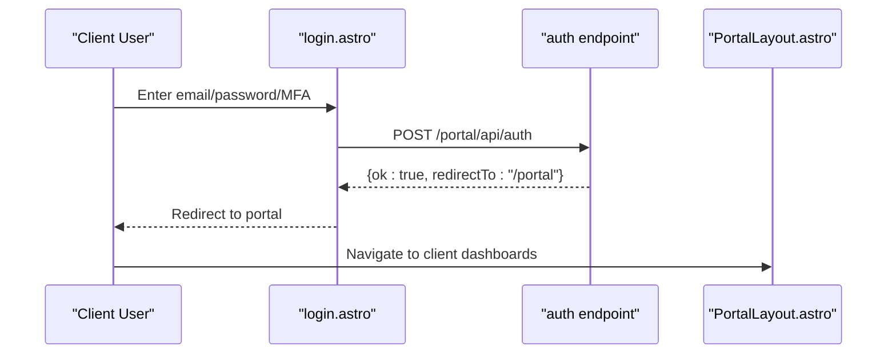
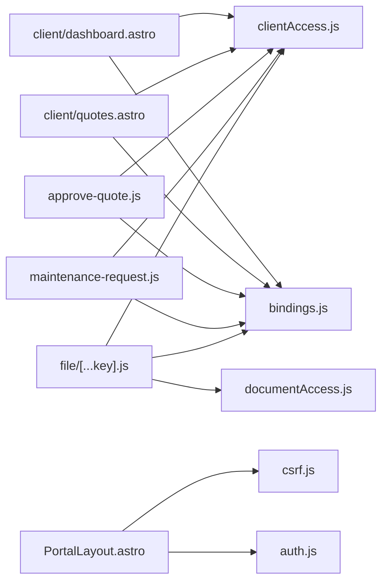
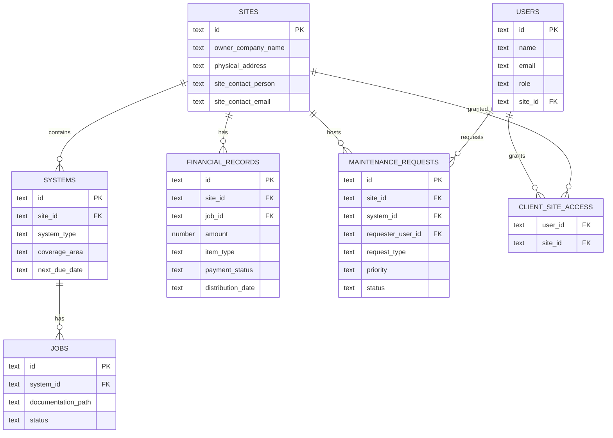

# Client Portal Features

<cite>
**Referenced Files in This Document**
- [dashboard.astro](file://src/pages/portal/client/dashboard.astro)
- [quotes.astro](file://src/pages/portal/client/quotes.astro)
- [clientAccess.js](file://src/lib/server/clientAccess.js)
- [auth.js](file://src/lib/server/auth.js)
- [csrf.js](file://src/lib/server/csrf.js)
- [bindings.js](file://src/lib/server/bindings.js)
- [approve-quote.js](file://src/pages/portal/api/approve-quote.js)
- [maintenance-request.js](file://src/pages/portal/api/maintenance-request.js)
- [file route handler](file://src/pages/portal/api/file/[...key].js)
- [documentAccess.js](file://src/lib/server/documentAccess.js)
- [PortalLayout.astro](file://src/layouts/portal/PortalLayout.astro)
- [login.astro](file://src/pages/portal/login.astro)
- [0001_kharon_portal.sql](file://migrations/0001_kharon_portal.sql)
- [schema.sql](file://schema.sql)
</cite>

## Table of Contents
1. [Introduction](#introduction)
2. [Project Structure](#project-structure)
3. [Core Components](#core-components)
4. [Architecture Overview](#architecture-overview)
5. [Detailed Component Analysis](#detailed-component-analysis)
6. [Dependency Analysis](#dependency-analysis)
7. [Performance Considerations](#performance-considerations)
8. [Troubleshooting Guide](#troubleshooting-guide)
9. [Conclusion](#conclusion)
10. [Appendices](#appendices)

## Introduction
This document describes the client-facing features and self-service capabilities of the Kharon Portal. It covers the client dashboard for system monitoring, maintenance scheduling, and service history; the quote management system and payment history; site management and access controls; secure authentication and communication; onboarding and account management; and support integration via maintenance requests. Practical examples illustrate client interactions, system status monitoring, quote evaluation, and payment processing. Guidance is also included for optimizing the client experience, ensuring mobile responsiveness, and integrating support workflows.

## Project Structure
The client portal is implemented as an Astro application with server-side rendering and Cloudflare Workers/D1/R2 integration. Key areas:
- Client-facing pages under src/pages/portal/client
- Shared portal layout and navigation under src/layouts/portal
- Server-side utilities for authentication, CSRF, database bindings, and access control under src/lib/server
- API endpoints under src/pages/portal/api for client actions (quote approval, maintenance requests, file downloads)
- Database schema and migrations define the data model for users, sites, systems, jobs, financial records, and maintenance requests

**Diagram sources**
- [dashboard.astro:1-303](file://src/pages/portal/client/dashboard.astro#L1-L303)
- [quotes.astro:1-239](file://src/pages/portal/client/quotes.astro#L1-L239)
- [PortalLayout.astro:1-108](file://src/layouts/portal/PortalLayout.astro#L1-L108)
- [clientAccess.js:1-53](file://src/lib/server/clientAccess.js#L1-L53)
- [auth.js:1-217](file://src/lib/server/auth.js#L1-L217)
- [csrf.js:1-107](file://src/lib/server/csrf.js#L1-L107)
- [bindings.js:1-42](file://src/lib/server/bindings.js#L1-L42)
- [approve-quote.js:1-100](file://src/pages/portal/api/approve-quote.js#L1-L100)
- [maintenance-request.js:1-95](file://src/pages/portal/api/maintenance-request.js#L1-L95)
- [file route handler:1-137](file://src/pages/portal/api/file/[...key].js#L1-L137)
- [documentAccess.js:1-28](file://src/lib/server/documentAccess.js#L1-L28)
- [schema.sql:1-245](file://schema.sql#L1-L245)
- [0001_kharon_portal.sql:1-112](file://migrations/0001_kharon_portal.sql#L1-L112)

**Section sources**
- [dashboard.astro:1-303](file://src/pages/portal/client/dashboard.astro#L1-L303)
- [quotes.astro:1-239](file://src/pages/portal/client/quotes.astro#L1-L239)
- [PortalLayout.astro:1-108](file://src/layouts/portal/PortalLayout.astro#L1-L108)
- [clientAccess.js:1-53](file://src/lib/server/clientAccess.js#L1-L53)
- [auth.js:1-217](file://src/lib/server/auth.js#L1-L217)
- [csrf.js:1-107](file://src/lib/server/csrf.js#L1-L107)
- [bindings.js:1-42](file://src/lib/server/bindings.js#L1-L42)
- [approve-quote.js:1-100](file://src/pages/portal/api/approve-quote.js#L1-L100)
- [maintenance-request.js:1-95](file://src/pages/portal/api/maintenance-request.js#L1-L95)
- [file route handler:1-137](file://src/pages/portal/api/file/[...key].js#L1-L137)
- [documentAccess.js:1-28](file://src/lib/server/documentAccess.js#L1-L28)
- [schema.sql:1-245](file://schema.sql#L1-L245)
- [0001_kharon_portal.sql:1-112](file://migrations/0001_kharon_portal.sql#L1-L112)

## Core Components
- Client Dashboard: Displays mapped sites, system status and upcoming due dates, latest jobcard documents, pending quote approvals, and recent maintenance requests. Includes a form to submit maintenance requests and JavaScript to filter systems per site and handle quote approvals.
- Quote Management: Shows pending approvals, unpaid invoices, and paid amounts per site, with filtering and search. Allows clients to approve quotes, transitioning them to invoices.
- Site Access Control: Enforces that clients can only access data for sites mapped to their account, using a dedicated mapping table and helper functions.
- Authentication and Security: Session tokens with HMAC signatures, secure cookies, CSRF protection, and MFA readiness. Document access is audited and restricted by role and site membership.
- Maintenance Requests: Clients can submit requests tied to a site and optional system, with type, priority, subject, and message validated server-side.
- File Downloads: Secure retrieval of jobcards and evidence photos from R2, with access checks and logging.

**Section sources**
- [dashboard.astro:1-303](file://src/pages/portal/client/dashboard.astro#L1-L303)
- [quotes.astro:1-239](file://src/pages/portal/client/quotes.astro#L1-L239)
- [clientAccess.js:1-53](file://src/lib/server/clientAccess.js#L1-L53)
- [auth.js:1-217](file://src/lib/server/auth.js#L1-L217)
- [csrf.js:1-107](file://src/lib/server/csrf.js#L1-L107)
- [approve-quote.js:1-100](file://src/pages/portal/api/approve-quote.js#L1-L100)
- [maintenance-request.js:1-95](file://src/pages/portal/api/maintenance-request.js#L1-L95)
- [file route handler:1-137](file://src/pages/portal/api/file/[...key].js#L1-L137)
- [documentAccess.js:1-28](file://src/lib/server/documentAccess.js#L1-L28)

## Architecture Overview
The client portal follows a layered architecture:
- Presentation layer: Astro static and dynamic components render the client dashboard and quote history.
- Layout and navigation: A shared portal layout injects CSRF protection and provides role-aware navigation.
- Server utilities: Authentication, CSRF, database and storage bindings, and access control helpers.
- API handlers: Server endpoints for quote approval, maintenance request creation, and document retrieval.
- Data model: Relational schema with indexes and triggers supporting efficient queries and audit trails.

**Diagram sources**
- [PortalLayout.astro:1-108](file://src/layouts/portal/PortalLayout.astro#L1-L108)
- [dashboard.astro:1-303](file://src/pages/portal/client/dashboard.astro#L1-L303)
- [quotes.astro:1-239](file://src/pages/portal/client/quotes.astro#L1-L239)
- [auth.js:1-217](file://src/lib/server/auth.js#L1-L217)
- [csrf.js:1-107](file://src/lib/server/csrf.js#L1-L107)
- [clientAccess.js:1-53](file://src/lib/server/clientAccess.js#L1-L53)
- [approve-quote.js:1-100](file://src/pages/portal/api/approve-quote.js#L1-L100)
- [maintenance-request.js:1-95](file://src/pages/portal/api/maintenance-request.js#L1-L95)
- [file route handler:1-137](file://src/pages/portal/api/file/[...key].js#L1-L137)

## Detailed Component Analysis

### Client Dashboard
The dashboard aggregates:
- Mapped client sites and their contact details
- Systems with type, coverage area, owner company, last service date, next due date, and latest jobcard download link
- Pending quote approvals with “Approve” actions
- Maintenance request submission form with site/system filtering and priority/type selection
- Recent service requests with status and linkage to dispatches

**Diagram sources**
- [PortalLayout.astro:48-55](file://src/layouts/portal/PortalLayout.astro#L48-L55)
- [dashboard.astro:144-149](file://src/pages/portal/client/dashboard.astro#L144-L149)
- [file route handler:92-127](file://src/pages/portal/api/file/[...key].js#L92-L127)

**Section sources**
- [dashboard.astro:1-303](file://src/pages/portal/client/dashboard.astro#L1-L303)
- [PortalLayout.astro:48-55](file://src/layouts/portal/PortalLayout.astro#L48-L55)
- [file route handler:1-137](file://src/pages/portal/api/file/[...key].js#L1-L137)

### Quote Management System
The quotes page displays:
- Totals for pending approvals, unpaid invoices, and paid amounts
- A searchable and filterable ledger of financial records linked to sites and jobs
- Per-record actions for quote approvals

**Diagram sources**
- [quotes.astro:170-175](file://src/pages/portal/client/quotes.astro#L170-L175)
- [approve-quote.js:14-95](file://src/pages/portal/api/approve-quote.js#L14-L95)

**Section sources**
- [quotes.astro:1-239](file://src/pages/portal/client/quotes.astro#L1-L239)
- [approve-quote.js:1-100](file://src/pages/portal/api/approve-quote.js#L1-L100)

### Maintenance Request Submission
Clients can submit maintenance requests with:
- Site selection (filtered to accessible sites)
- Optional system selection bound to the chosen site
- Type, priority, subject, and message validated server-side
- Audit trail and response with request ID and status

**Diagram sources**
- [dashboard.astro:179-203](file://src/pages/portal/client/dashboard.astro#L179-L203)
- [maintenance-request.js:32-90](file://src/pages/portal/api/maintenance-request.js#L32-L90)

**Section sources**
- [dashboard.astro:175-225](file://src/pages/portal/client/dashboard.astro#L175-L225)
- [maintenance-request.js:1-95](file://src/pages/portal/api/maintenance-request.js#L1-L95)

### Site Management and Access Controls
Client access is enforced via:
- A dedicated mapping table linking users to sites
- Helper functions to resolve accessible site IDs and validate access
- Role-based access checks for document retrieval and request creation

**Diagram sources**
- [clientAccess.js:1-53](file://src/lib/server/clientAccess.js#L1-L53)
- [approve-quote.js:37-47](file://src/pages/portal/api/approve-quote.js#L37-L47)
- [maintenance-request.js:47-53](file://src/pages/portal/api/maintenance-request.js#L47-L53)
- [file route handler:65-90](file://src/pages/portal/api/file/[...key].js#L65-L90)

**Section sources**
- [clientAccess.js:1-53](file://src/lib/server/clientAccess.js#L1-L53)
- [approve-quote.js:1-100](file://src/pages/portal/api/approve-quote.js#L1-L100)
- [maintenance-request.js:1-95](file://src/pages/portal/api/maintenance-request.js#L1-L95)
- [file route handler:1-137](file://src/pages/portal/api/file/[...key].js#L1-L137)

### Secure Communication Channels
- Session tokens with HMAC signatures and expiration
- Secure, HttpOnly, SameSite=Strict cookies for sessions and CSRF
- CSRF protection via meta token and header verification
- Document access auditing and logging for traceability

**Diagram sources**
- [PortalLayout.astro:48-55](file://src/layouts/portal/PortalLayout.astro#L48-L55)
- [auth.js:110-118](file://src/lib/server/auth.js#L110-L118)
- [csrf.js:84-101](file://src/lib/server/csrf.js#L84-L101)

**Section sources**
- [auth.js:1-217](file://src/lib/server/auth.js#L1-L217)
- [csrf.js:1-107](file://src/lib/server/csrf.js#L1-L107)
- [PortalLayout.astro:48-55](file://src/layouts/portal/PortalLayout.astro#L48-L55)

### Client Onboarding, Account Management, and Support Integration
- Onboarding: Users log in via the login page, which posts credentials to the authentication endpoint and redirects upon success.
- Account management: Navigation includes password and MFA management for eligible roles.
- Support integration: Maintenance requests are created client-side and persisted server-side with audit events.

**Diagram sources**
- [login.astro:63-84](file://src/pages/portal/login.astro#L63-L84)
- [PortalLayout.astro:10-29](file://src/layouts/portal/PortalLayout.astro#L10-L29)

**Section sources**
- [login.astro:1-88](file://src/pages/portal/login.astro#L1-L88)
- [PortalLayout.astro:1-108](file://src/layouts/portal/PortalLayout.astro#L1-L108)

## Dependency Analysis
Key dependencies and relationships:
- Client pages depend on server access control helpers and database bindings
- API handlers depend on access control and database utilities
- Document retrieval depends on storage bindings and access control
- Layout injects CSRF token and provides role-aware navigation

**Diagram sources**
- [dashboard.astro:1-8](file://src/pages/portal/client/dashboard.astro#L1-L8)
- [quotes.astro:1-8](file://src/pages/portal/client/quotes.astro#L1-L8)
- [clientAccess.js:1-53](file://src/lib/server/clientAccess.js#L1-L53)
- [bindings.js:1-42](file://src/lib/server/bindings.js#L1-L42)
- [approve-quote.js:1-4](file://src/pages/portal/api/approve-quote.js#L1-L4)
- [maintenance-request.js:1-4](file://src/pages/portal/api/maintenance-request.js#L1-L4)
- [file route handler:1-5](file://src/pages/portal/api/file/[...key].js#L1-L5)
- [documentAccess.js:1-28](file://src/lib/server/documentAccess.js#L1-L28)
- [PortalLayout.astro:1-9](file://src/layouts/portal/PortalLayout.astro#L1-L9)
- [csrf.js:1-107](file://src/lib/server/csrf.js#L1-L107)
- [auth.js:1-217](file://src/lib/server/auth.js#L1-L217)

**Section sources**
- [dashboard.astro:1-8](file://src/pages/portal/client/dashboard.astro#L1-L8)
- [quotes.astro:1-8](file://src/pages/portal/client/quotes.astro#L1-L8)
- [approve-quote.js:1-4](file://src/pages/portal/api/approve-quote.js#L1-L4)
- [maintenance-request.js:1-4](file://src/pages/portal/api/maintenance-request.js#L1-L4)
- [file route handler:1-5](file://src/pages/portal/api/file/[...key].js#L1-L5)
- [PortalLayout.astro:1-9](file://src/layouts/portal/PortalLayout.astro#L1-L9)

## Performance Considerations
- Database queries use indexed columns (e.g., site_id, next_due_date, payment_status) to minimize scan costs.
- Batched queries are used for aggregated totals and records to reduce round-trips.
- Pagination and limits are applied to recent request listings to keep UI responsive.
- Indexes on foreign keys and frequently filtered columns improve join performance.

[No sources needed since this section provides general guidance]

## Troubleshooting Guide
Common issues and resolutions:
- Session or CSRF errors: Verify cookies and meta token presence; ensure SameSite and Secure flags align with environment.
- Access denied to documents: Confirm the user’s role and site membership; check audit logs for blocked access reasons.
- Maintenance request failures: Validate input lengths and choices; confirm site/system access; review audit events.
- Quote approval failures: Ensure the record exists, belongs to an accessible site, and is in the correct state.

**Section sources**
- [auth.js:110-118](file://src/lib/server/auth.js#L110-L118)
- [csrf.js:88-96](file://src/lib/server/csrf.js#L88-L96)
- [file route handler:72-90](file://src/pages/portal/api/file/[...key].js#L72-L90)
- [approve-quote.js:37-63](file://src/pages/portal/api/approve-quote.js#L37-L63)
- [maintenance-request.js:32-90](file://src/pages/portal/api/maintenance-request.js#L32-L90)

## Conclusion
The client portal provides a secure, role-scoped interface for monitoring systems, managing quotes, submitting maintenance requests, and accessing documents. Built-in access controls, auditing, and CSRF protections ensure data privacy and integrity. The modular architecture supports maintainability and scalability while delivering a responsive client experience.

[No sources needed since this section summarizes without analyzing specific files]

## Appendices

### Data Model Overview
The schema defines core entities and relationships used by the client portal.

**Diagram sources**
- [schema.sql:3-245](file://schema.sql#L3-L245)
- [0001_kharon_portal.sql:3-112](file://migrations/0001_kharon_portal.sql#L3-L112)