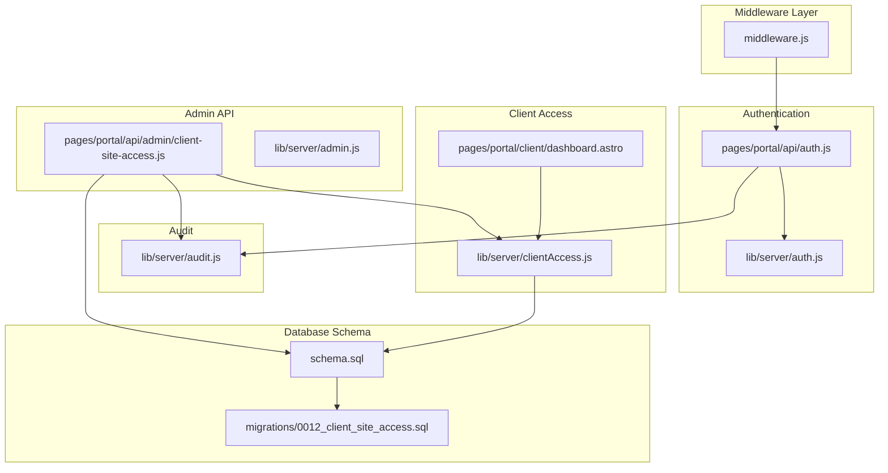
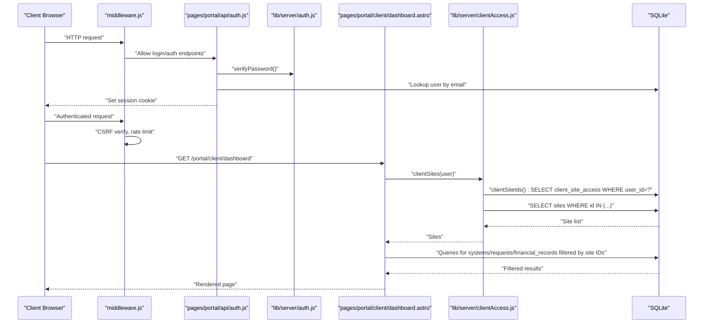
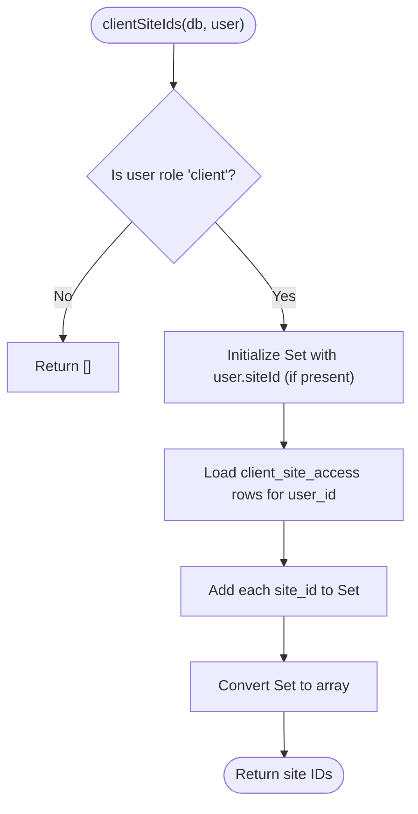
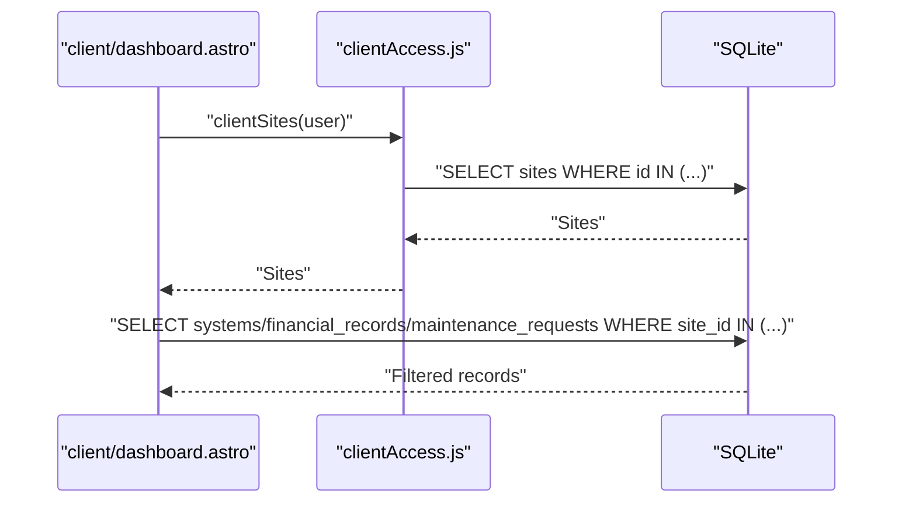
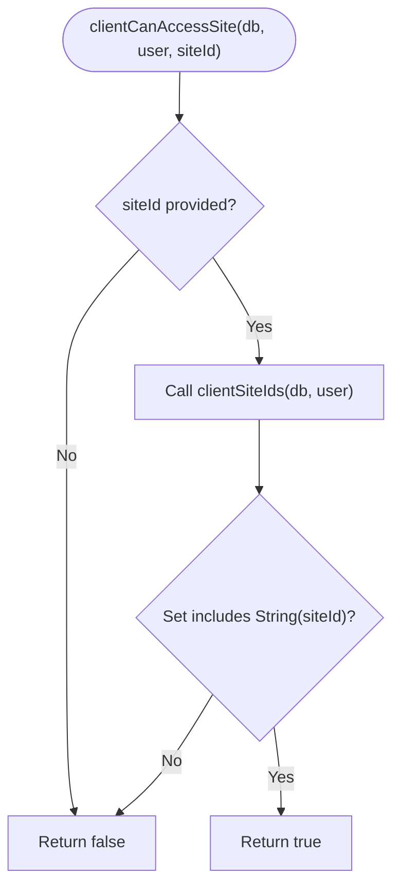
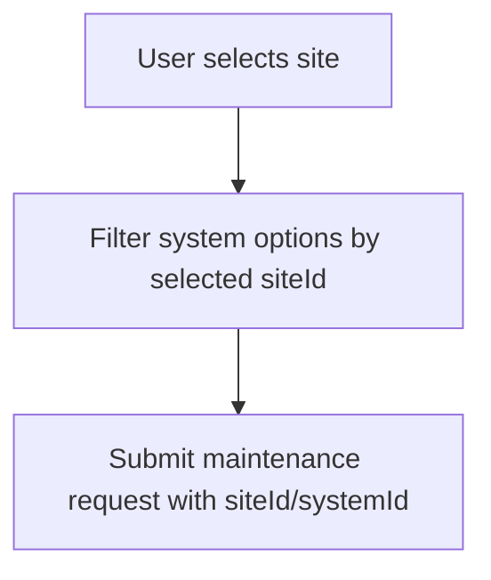
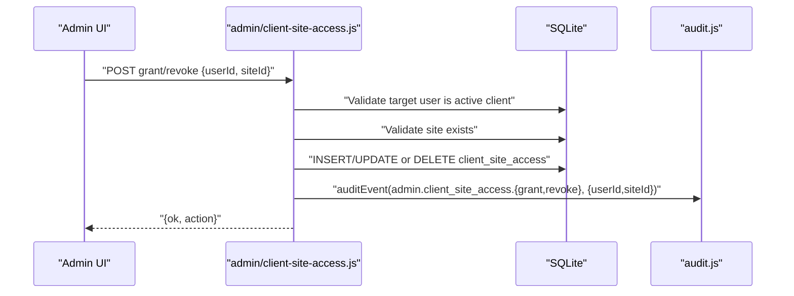
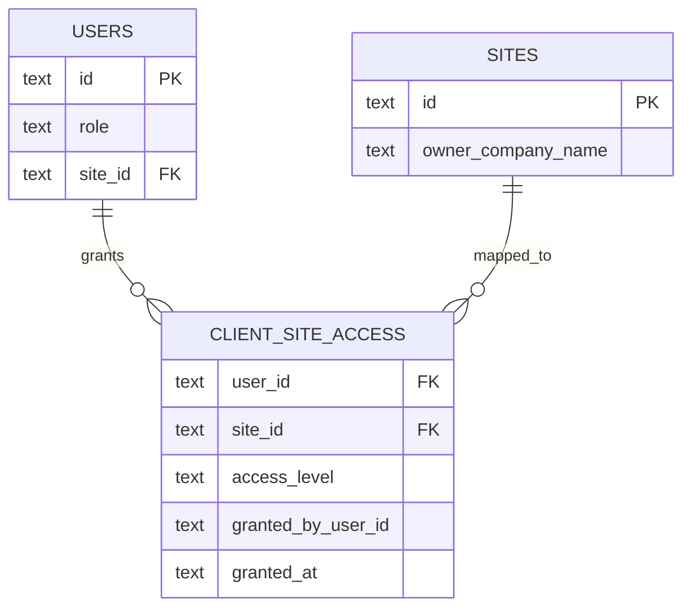
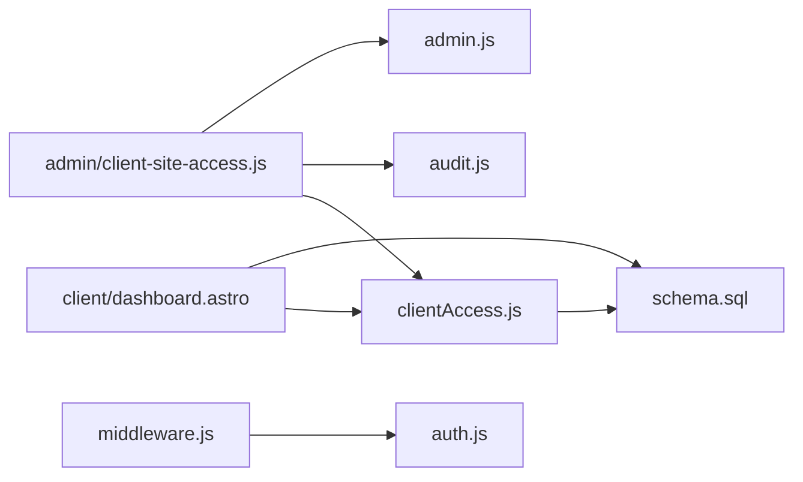

# Client Site Access Control

<cite>
**Referenced Files in This Document**
- [clientAccess.js](file://src/lib/server/clientAccess.js)
- [auth.js](file://src/lib/server/auth.js)
- [middleware.js](file://src/middleware.js)
- [0012_client_site_access.sql](file://migrations/0012_client_site_access.sql)
- [schema.sql](file://schema.sql)
- [client-site-access.js](file://src/pages/portal/api/admin/client-site-access.js)
- [dashboard.astro](file://src/pages/portal/client/dashboard.astro)
- [auth.js](file://src/pages/portal/api/auth.js)
- [audit.js](file://src/lib/server/audit.js)
- [admin.js](file://src/lib/server/admin.js)
</cite>

## Table of Contents
1. [Introduction](#introduction)
2. [Project Structure](#project-structure)
3. [Core Components](#core-components)
4. [Architecture Overview](#architecture-overview)
5. [Detailed Component Analysis](#detailed-component-analysis)
6. [Dependency Analysis](#dependency-analysis)
7. [Performance Considerations](#performance-considerations)
8. [Troubleshooting Guide](#troubleshooting-guide)
9. [Conclusion](#conclusion)

## Introduction
This document explains the client site access control mechanisms used by the portal. It covers how client-site relationships are mapped, how multi-site accounts are handled, and how data isolation is enforced. It documents the clientSites function, site filtering logic, and access permission validation. It also describes the site selection dropdown functionality, system filtering based on site associations, and data visibility restrictions. Finally, it outlines database query patterns, site ID validation, client authorization checks, security considerations, access logging, and client data protection measures.

## Project Structure
The client site access control spans several layers:
- Middleware enforces authentication, CSRF protection, rate limiting, and role-based access.
- Authentication creates and verifies session tokens and logs events.
- Client access utilities compute site IDs, fetch client sites, and validate access.
- Admin API grants or revokes client-site access and audits changes.
- Client dashboard renders site-specific data and provides site selection controls.
- Database schema defines the client_site_access table and supporting indexes.

**Diagram sources**
- [middleware.js:110-213](file://src/middleware.js#L110-L213)
- [auth.js:36-171](file://src/pages/portal/api/auth.js#L36-L171)
- [auth.js:48-108](file://src/lib/server/auth.js#L48-L108)
- [clientAccess.js:1-52](file://src/lib/server/clientAccess.js#L1-L52)
- [dashboard.astro:18-86](file://src/pages/portal/client/dashboard.astro#L18-L86)
- [client-site-access.js:8-69](file://src/pages/portal/api/admin/client-site-access.js#L8-L69)
- [admin.js:3-8](file://src/lib/server/admin.js#L3-L8)
- [audit.js:3-32](file://src/lib/server/audit.js#L3-L32)
- [schema.sql:92-99](file://schema.sql#L92-L99)
- [0012_client_site_access.sql:1-11](file://migrations/0012_client_site_access.sql#L1-L11)

**Section sources**
- [middleware.js:110-213](file://src/middleware.js#L110-L213)
- [clientAccess.js:1-52](file://src/lib/server/clientAccess.js#L1-L52)
- [client-site-access.js:8-69](file://src/pages/portal/api/admin/client-site-access.js#L8-L69)
- [dashboard.astro:18-86](file://src/pages/portal/client/dashboard.astro#L18-L86)
- [schema.sql:92-99](file://schema.sql#L92-L99)
- [0012_client_site_access.sql:1-11](file://migrations/0012_client_site_access.sql#L1-L11)

## Core Components
- clientSiteIds(db, user): Builds the set of site IDs accessible to a client user, including their primary site and any additional sites granted via client_site_access.
- clientSites(db, user): Returns the list of mapped sites for a client user, ordered by owner company name.
- clientCanAccessSite(db, user, siteId): Validates whether a given site ID is accessible to the client user.
- inClause(values, startIndex): Generates SQLite positional parameter placeholders for IN clauses.
- Admin client-site access API: Grants or revokes client access to a site and audits the action.
- Middleware and authentication: Enforce session validity, CSRF, rate limits, and role-based access.
- Audit logging: Records security-relevant events with IP hash and user agent.

**Section sources**
- [clientAccess.js:1-52](file://src/lib/server/clientAccess.js#L1-L52)
- [client-site-access.js:8-69](file://src/pages/portal/api/admin/client-site-access.js#L8-L69)
- [middleware.js:110-213](file://src/middleware.js#L110-L213)
- [audit.js:3-32](file://src/lib/server/audit.js#L3-L32)

## Architecture Overview
The client site access control architecture ensures that:
- Client users see only systems, jobs, quotes, and requests associated with their mapped sites.
- Administrators can grant or revoke additional site access without altering the client’s primary site association.
- All state-changing API requests are CSRF-protected and rate-limited.
- Access events are audited for accountability.

**Diagram sources**
- [middleware.js:110-213](file://src/middleware.js#L110-L213)
- [auth.js:36-171](file://src/pages/portal/api/auth.js#L36-L171)
- [auth.js:48-108](file://src/lib/server/auth.js#L48-L108)
- [clientAccess.js:1-52](file://src/lib/server/clientAccess.js#L1-L52)
- [dashboard.astro:18-86](file://src/pages/portal/client/dashboard.astro#L18-L86)

## Detailed Component Analysis

### Client Site Relationship Mapping
Client-site mapping supports two sources:
- Primary site association via users.site_id.
- Additional site associations via client_site_access entries.

**Diagram sources**
- [clientAccess.js:1-26](file://src/lib/server/clientAccess.js#L1-L26)

**Section sources**
- [clientAccess.js:1-26](file://src/lib/server/clientAccess.js#L1-L26)
- [schema.sql:92-99](file://schema.sql#L92-L99)
- [0012_client_site_access.sql:1-11](file://migrations/0012_client_site_access.sql#L1-L11)

### Multi-Site Account Handling and Data Isolation
- clientSites(db, user): Uses clientSiteIds to build an IN (...) clause and fetches mapped sites.
- Dashboard queries filter by site IDs to enforce data isolation:
  - Systems joined to sites and filtered by site IDs.
  - Financial records (quotes) filtered by site IDs and item type/payment status.
  - Maintenance requests filtered by site IDs.

**Diagram sources**
- [clientAccess.js:28-42](file://src/lib/server/clientAccess.js#L28-L42)
- [dashboard.astro:27-81](file://src/pages/portal/client/dashboard.astro#L27-L81)

**Section sources**
- [clientAccess.js:28-42](file://src/lib/server/clientAccess.js#L28-L42)
- [dashboard.astro:27-81](file://src/pages/portal/client/dashboard.astro#L27-L81)

### Access Permission Validation
- clientCanAccessSite(db, user, siteId): Validates a requested site ID against the computed set of accessible site IDs.
- Middleware enforces role-based access to portal areas and redirects unauthorized users.

**Diagram sources**
- [clientAccess.js:44-48](file://src/lib/server/clientAccess.js#L44-L48)
- [middleware.js:57-63](file://src/middleware.js#L57-L63)

**Section sources**
- [clientAccess.js:44-48](file://src/lib/server/clientAccess.js#L44-L48)
- [middleware.js:57-63](file://src/middleware.js#L57-L63)

### Site Selection Dropdown Functionality
- The client dashboard builds a site selection dropdown from mapped sites.
- A system selection dropdown is filtered to show only systems belonging to the selected site.
- Submission of maintenance requests includes the selected siteId.

**Diagram sources**
- [dashboard.astro:190-214](file://src/pages/portal/client/dashboard.astro#L190-L214)
- [dashboard.astro:244-256](file://src/pages/portal/client/dashboard.astro#L244-L256)

**Section sources**
- [dashboard.astro:190-214](file://src/pages/portal/client/dashboard.astro#L190-L214)
- [dashboard.astro:244-256](file://src/pages/portal/client/dashboard.astro#L244-L256)

### Admin Client-Site Access Management
- The admin endpoint validates the caller’s admin role, checks that the target user is a currently active client, verifies the site exists, and either grants or revokes access.
- On success, it audits the action with metadata including user ID and site ID.

**Diagram sources**
- [client-site-access.js:8-69](file://src/pages/portal/api/admin/client-site-access.js#L8-L69)
- [admin.js:3-8](file://src/lib/server/admin.js#L3-L8)
- [audit.js:3-32](file://src/lib/server/audit.js#L3-L32)

**Section sources**
- [client-site-access.js:8-69](file://src/pages/portal/api/admin/client-site-access.js#L8-L69)
- [admin.js:3-8](file://src/lib/server/admin.js#L3-L8)
- [audit.js:3-32](file://src/lib/server/audit.js#L3-L32)

### Database Query Patterns for Multi-Site Access
- clientSiteIds: Single query to client_site_access to collect additional site IDs.
- clientSites: Single query to sites with an IN (...) clause built from site IDs.
- Dashboard queries: Multiple queries to systems, financial_records, and maintenance_requests filtered by site IDs.
- Indexes: client_site_access(site_id, user_id) supports efficient lookups.

**Diagram sources**
- [schema.sql:3-20](file://schema.sql#L3-L20)
- [schema.sql:22-32](file://schema.sql#L22-L32)
- [schema.sql:92-99](file://schema.sql#L92-L99)
- [0012_client_site_access.sql:1-11](file://migrations/0012_client_site_access.sql#L1-L11)

**Section sources**
- [clientAccess.js:1-52](file://src/lib/server/clientAccess.js#L1-L52)
- [dashboard.astro:27-81](file://src/pages/portal/client/dashboard.astro#L27-L81)
- [schema.sql:92-99](file://schema.sql#L92-L99)
- [0012_client_site_access.sql:1-11](file://migrations/0012_client_site_access.sql#L1-L11)

### Site ID Validation and Authorization Checks
- Site ID validation occurs in the admin endpoint:
  - Ensures the target user is a currently active client.
  - Ensures the site exists.
- Authorization checks:
  - Middleware enforces role-based access to portal areas.
  - Admin-only endpoint for client-site access management.

**Section sources**
- [client-site-access.js:20-30](file://src/pages/portal/api/admin/client-site-access.js#L20-L30)
- [middleware.js:57-63](file://src/middleware.js#L57-L63)
- [admin.js:3-8](file://src/lib/server/admin.js#L3-L8)

### Practical Examples
- Site mapping:
  - A client user with a primary site can be granted access to additional sites via the admin endpoint. The mapping persists in client_site_access.
- Access control implementation:
  - The dashboard loads mapped sites and filters all downstream queries by those site IDs.
- Data segregation patterns:
  - Systems, financial records, and maintenance requests are joined to sites and filtered by site IDs to prevent cross-site leakage.

**Section sources**
- [client-site-access.js:31-48](file://src/pages/portal/api/admin/client-site-access.js#L31-L48)
- [dashboard.astro:27-81](file://src/pages/portal/client/dashboard.astro#L27-L81)

## Dependency Analysis
- clientAccess.js depends on the client_site_access table and the sites table.
- Admin client-site access API depends on admin.js for validation and audit.js for logging.
- Dashboard depends on clientAccess.js and performs additional queries filtered by site IDs.
- Middleware depends on auth.js for session verification and CSRF utilities.

**Diagram sources**
- [clientAccess.js:1-52](file://src/lib/server/clientAccess.js#L1-L52)
- [dashboard.astro:18-86](file://src/pages/portal/client/dashboard.astro#L18-L86)
- [client-site-access.js:8-69](file://src/pages/portal/api/admin/client-site-access.js#L8-L69)
- [admin.js:3-8](file://src/lib/server/admin.js#L3-L8)
- [audit.js:3-32](file://src/lib/server/audit.js#L3-L32)
- [middleware.js:110-213](file://src/middleware.js#L110-L213)
- [auth.js:48-108](file://src/lib/server/auth.js#L48-L108)

**Section sources**
- [clientAccess.js:1-52](file://src/lib/server/clientAccess.js#L1-L52)
- [client-site-access.js:8-69](file://src/pages/portal/api/admin/client-site-access.js#L8-L69)
- [dashboard.astro:18-86](file://src/pages/portal/client/dashboard.astro#L18-L86)
- [middleware.js:110-213](file://src/middleware.js#L110-L213)

## Performance Considerations
- Efficient indexing:
  - client_site_access(site_id, user_id) supports fast reverse lookup from site to users.
- Minimal round trips:
  - clientSiteIds consolidates primary and granted site IDs in a single pass.
- Parameterized IN clauses:
  - inClause generates placeholders safely to avoid SQL injection while enabling batched queries.
- Rate limiting and CSRF:
  - Middleware protects APIs from abuse and CSRF attacks, indirectly improving throughput by failing malicious requests early.

[No sources needed since this section provides general guidance]

## Troubleshooting Guide
- Client sees no data:
  - Verify the client user has at least one mapped site via clientSiteIds. If empty, the dashboard displays a load error indicating no site mapping.
- Admin cannot grant access:
  - Ensure the target user is a currently active client and the site exists. The endpoint validates these conditions and returns appropriate errors.
- Access denied to portal area:
  - Middleware redirects unauthenticated or unauthorized users to the login or role-specific dashboard.
- Audit and logging:
  - Use audit events to investigate login failures, MFA failures, rate-limit blocks, and admin client-site access actions.

**Section sources**
- [dashboard.astro:22-24](file://src/pages/portal/client/dashboard.astro#L22-L24)
- [client-site-access.js:24-26](file://src/pages/portal/api/admin/client-site-access.js#L24-L26)
- [middleware.js:127-142](file://src/middleware.js#L127-L142)
- [audit.js:3-32](file://src/lib/server/audit.js#L3-L32)

## Conclusion
The client site access control system combines explicit client-site mappings with primary site associations to deliver robust multi-site visibility for client users. It enforces strict data isolation by filtering all downstream queries by site IDs, protects administrative changes with role checks and auditing, and secures all portal interactions with authentication, CSRF protection, and rate limiting. Together, these mechanisms ensure secure, auditable, and scalable access to client data across multiple sites.