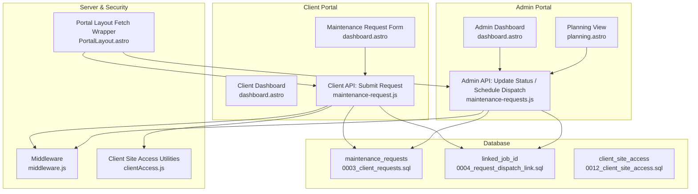
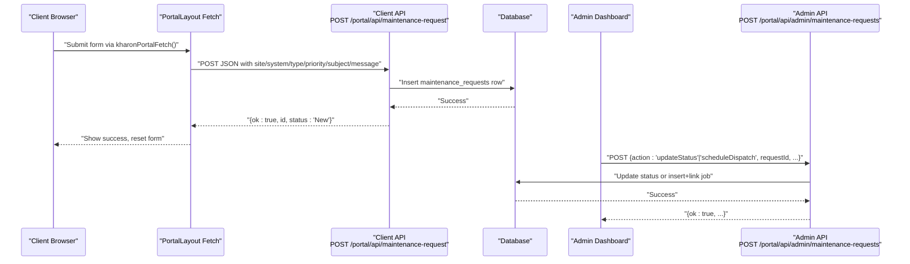
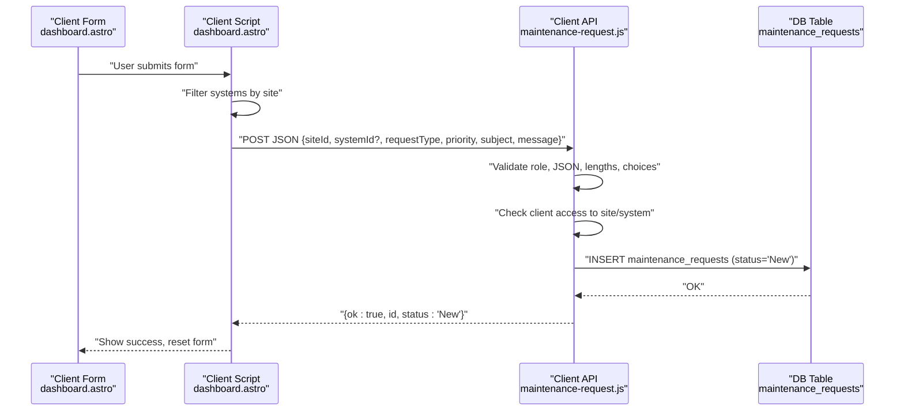
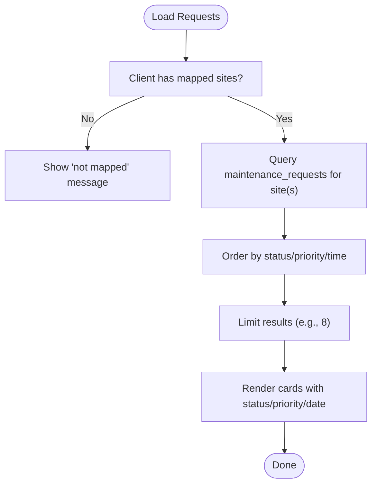
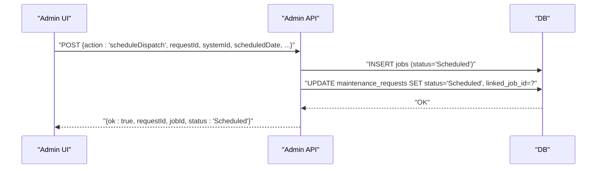
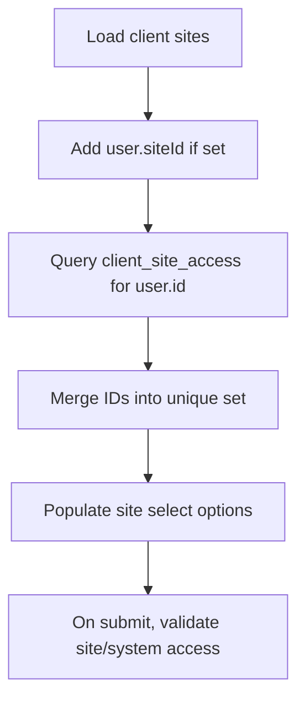
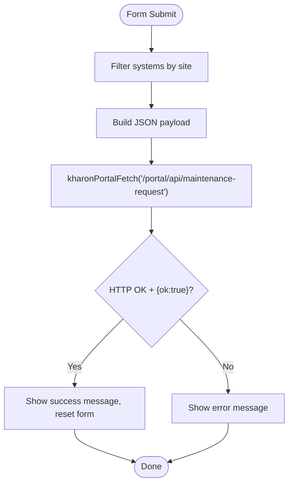
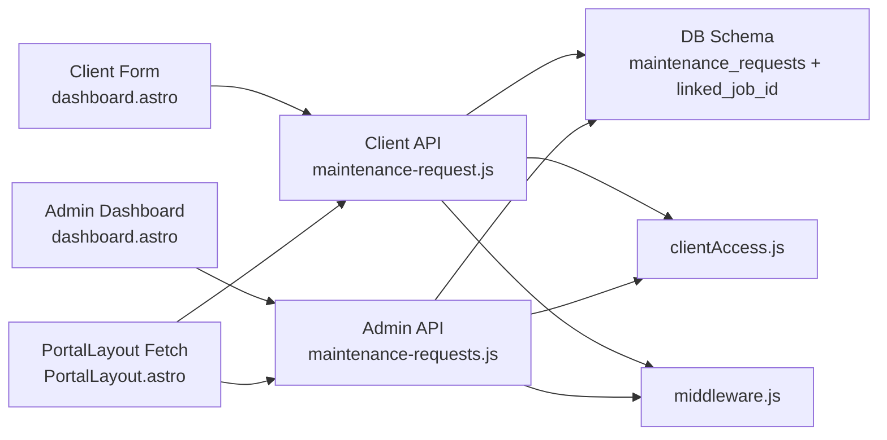

# Maintenance Request System

<cite>
**Referenced Files in This Document**
- [maintenance-request.js](file://src/pages/portal/api/maintenance-request.js)
- [maintenance-requests.js](file://src/pages/portal/api/admin/maintenance-requests.js)
- [dashboard.astro (client)](file://src/pages/portal/client/dashboard.astro)
- [dashboard.astro (admin)](file://src/pages/portal/admin/dashboard.astro)
- [planning.astro](file://src/pages/portal/admin/planning.astro)
- [clientAccess.js](file://src/lib/server/clientAccess.js)
- [middleware.js](file://src/middleware.js)
- [0003_client_requests.sql](file://migrations/0003_client_requests.sql)
- [0004_request_dispatch_link.sql](file://migrations/0004_request_dispatch_link.sql)
- [0012_client_site_access.sql](file://migrations/0012_client_site_access.sql)
- [PortalLayout.astro](file://src/layouts/portal/PortalLayout.astro)
</cite>

## Table of Contents
1. [Introduction](#introduction)
2. [Project Structure](#project-structure)
3. [Core Components](#core-components)
4. [Architecture Overview](#architecture-overview)
5. [Detailed Component Analysis](#detailed-component-analysis)
6. [Dependency Analysis](#dependency-analysis)
7. [Performance Considerations](#performance-considerations)
8. [Troubleshooting Guide](#troubleshooting-guide)
9. [Conclusion](#conclusion)

## Introduction
This document explains the client maintenance request submission and tracking system. It covers how clients submit requests, how administrators manage them, and how dispatches are linked back to requests. It documents the request form fields (site selection, system association, request types, priority levels), filtering and status tracking, dispatch linking, client-side validation and submission handling, error handling, and the end-to-end request lifecycle.

## Project Structure
The system spans client and admin UI pages, server-side API endpoints, database schema, and middleware for security and rate limiting.

**Diagram sources**
- [dashboard.astro (client):185-235](file://src/pages/portal/client/dashboard.astro#L185-L235)
- [maintenance-request.js:32-94](file://src/pages/portal/api/maintenance-request.js#L32-L94)
- [dashboard.astro (admin):67-81](file://src/pages/portal/admin/dashboard.astro#L67-L81)
- [planning.astro:105-116](file://src/pages/portal/admin/planning.astro#L105-L116)
- [maintenance-requests.js:10-96](file://src/pages/portal/api/admin/maintenance-requests.js#L10-L96)
- [middleware.js:110-213](file://src/middleware.js#L110-L213)
- [PortalLayout.astro:48-55](file://src/layouts/portal/PortalLayout.astro#L48-L55)
- [clientAccess.js:1-53](file://src/lib/server/clientAccess.js#L1-L53)
- [0003_client_requests.sql:1-25](file://migrations/0003_client_requests.sql#L1-L25)
- [0004_request_dispatch_link.sql:1-3](file://migrations/0004_request_dispatch_link.sql#L1-L3)
- [0012_client_site_access.sql:1-10](file://migrations/0012_client_site_access.sql#L1-L10)

**Section sources**
- [dashboard.astro (client):1-313](file://src/pages/portal/client/dashboard.astro#L1-L313)
- [maintenance-request.js:1-94](file://src/pages/portal/api/maintenance-request.js#L1-L94)
- [dashboard.astro (admin):60-87](file://src/pages/portal/admin/dashboard.astro#L60-L87)
- [planning.astro:90-117](file://src/pages/portal/admin/planning.astro#L90-L117)
- [maintenance-requests.js:1-102](file://src/pages/portal/api/admin/maintenance-requests.js#L1-L102)
- [middleware.js:110-213](file://src/middleware.js#L110-L213)
- [PortalLayout.astro:38-66](file://src/layouts/portal/PortalLayout.astro#L38-L66)
- [clientAccess.js:1-53](file://src/lib/server/clientAccess.js#L1-L53)
- [0003_client_requests.sql:1-25](file://migrations/0003_client_requests.sql#L1-L25)
- [0004_request_dispatch_link.sql:1-3](file://migrations/0004_request_dispatch_link.sql#L1-L3)
- [0012_client_site_access.sql:1-10](file://migrations/0012_client_site_access.sql#L1-L10)

## Core Components
- Client request form: site selection, optional system association, request type, priority, subject, and message.
- Client API endpoint: validates inputs, enforces client access, persists request, and emits audit events.
- Admin API endpoint: updates status and schedules dispatches, linking jobs back to requests.
- Client dashboard: displays recent requests and allows new submissions.
- Admin dashboards: list requests by priority/status and enable status updates and scheduling.
- Middleware: enforces authentication, CSRF protection, and rate limits for state-changing APIs.

**Section sources**
- [dashboard.astro (client):189-213](file://src/pages/portal/client/dashboard.astro#L189-L213)
- [maintenance-request.js:32-94](file://src/pages/portal/api/maintenance-request.js#L32-L94)
- [maintenance-requests.js:10-96](file://src/pages/portal/api/admin/maintenance-requests.js#L10-L96)
- [dashboard.astro (admin):67-81](file://src/pages/portal/admin/dashboard.astro#L67-L81)
- [planning.astro:105-116](file://src/pages/portal/admin/planning.astro#L105-L116)
- [middleware.js:154-184](file://src/middleware.js#L154-L184)

## Architecture Overview
The system uses a layered approach:
- UI renders forms and displays lists.
- Client and admin APIs handle mutations.
- Middleware secures and throttles requests.
- Database stores requests, dispatch links, and access mappings.

**Diagram sources**
- [PortalLayout.astro:48-55](file://src/layouts/portal/PortalLayout.astro#L48-L55)
- [maintenance-request.js:32-94](file://src/pages/portal/api/maintenance-request.js#L32-L94)
- [maintenance-requests.js:10-96](file://src/pages/portal/api/admin/maintenance-requests.js#L10-L96)
- [dashboard.astro (client):258-289](file://src/pages/portal/client/dashboard.astro#L258-L289)
- [dashboard.astro (admin):332-362](file://src/pages/portal/admin/dashboard.astro#L332-L362)

## Detailed Component Analysis

### Client Request Submission Flow
- Form fields:
  - siteId (required): selects the client-mapped site.
  - systemId (optional): associates a specific system; filtered by site.
  - requestType (required): one of Maintenance, Fault, Compliance Documentation, Quote Request, Emergency Follow-up.
  - priority (required): Routine, Urgent, or Critical.
  - subject (required): 3–160 characters.
  - message (required): 10–2000 characters.
- Client-side behavior:
  - Filters system options by selected site.
  - Submits via a wrapper fetch that injects CSRF token.
  - Handles success/failure feedback and resets form.
- Server-side validation and persistence:
  - Validates role (client), JSON body, and field lengths/types.
  - Enforces client site/system access.
  - Inserts a new maintenance request with status New.
  - Emits audit event.

**Diagram sources**
- [dashboard.astro (client):189-213](file://src/pages/portal/client/dashboard.astro#L189-L213)
- [dashboard.astro (client):244-289](file://src/pages/portal/client/dashboard.astro#L244-L289)
- [maintenance-request.js:32-94](file://src/pages/portal/api/maintenance-request.js#L32-L94)
- [0003_client_requests.sql:1-25](file://migrations/0003_client_requests.sql#L1-L25)

**Section sources**
- [dashboard.astro (client):189-213](file://src/pages/portal/client/dashboard.astro#L189-L213)
- [dashboard.astro (client):244-289](file://src/pages/portal/client/dashboard.astro#L244-L289)
- [maintenance-request.js:32-94](file://src/pages/portal/api/maintenance-request.js#L32-L94)
- [clientAccess.js:1-53](file://src/lib/server/clientAccess.js#L1-L53)
- [0003_client_requests.sql:1-25](file://migrations/0003_client_requests.sql#L1-L25)

### Request Filtering and Status Tracking
- Client dashboard:
  - Lists recent requests for mapped sites.
  - Shows status badges and priority/date stamps.
- Admin dashboard:
  - Lists requests with status New/Reviewing/Scheduled.
  - Orders by priority (Critical/Urgent first) then creation time.
- Planning view:
  - Highlights critical and urgent open requests for planning.

**Diagram sources**
- [dashboard.astro (client):65-81](file://src/pages/portal/client/dashboard.astro#L65-L81)
- [dashboard.astro (admin):67-81](file://src/pages/portal/admin/dashboard.astro#L67-L81)
- [planning.astro:105-116](file://src/pages/portal/admin/planning.astro#L105-L116)

**Section sources**
- [dashboard.astro (client):65-81](file://src/pages/portal/client/dashboard.astro#L65-L81)
- [dashboard.astro (admin):67-81](file://src/pages/portal/admin/dashboard.astro#L67-L81)
- [planning.astro:105-116](file://src/pages/portal/admin/planning.astro#L105-L116)

### Dispatch Linking and Lifecycle Management
- Admin actions:
  - Update status: transitions can move a request from New/Reviewing to Scheduled/Closed.
  - Schedule dispatch: creates a job and links it back to the request via linked_job_id.
- Lifecycle:
  - New → Reviewing → Scheduled (with linked job) → Closed.

**Diagram sources**
- [maintenance-requests.js:10-96](file://src/pages/portal/api/admin/maintenance-requests.js#L10-L96)
- [0004_request_dispatch_link.sql:1-3](file://migrations/0004_request_dispatch_link.sql#L1-L3)

**Section sources**
- [maintenance-requests.js:10-96](file://src/pages/portal/api/admin/maintenance-requests.js#L10-L96)
- [0004_request_dispatch_link.sql:1-3](file://migrations/0004_request_dispatch_link.sql#L1-L3)

### Client Access and Site Selection
- Client site access is derived from:
  - The user’s primary siteId.
  - Additional mappings stored in client_site_access.
- The client dashboard populates site options from these mapped sites.
- On submission, the system verifies the selected site/system against the client’s accessible set.

**Diagram sources**
- [clientAccess.js:1-53](file://src/lib/server/clientAccess.js#L1-L53)
- [0012_client_site_access.sql:1-10](file://migrations/0012_client_site_access.sql#L1-L10)
- [dashboard.astro (client):189-192](file://src/pages/portal/client/dashboard.astro#L189-L192)

**Section sources**
- [clientAccess.js:1-53](file://src/lib/server/clientAccess.js#L1-L53)
- [0012_client_site_access.sql:1-10](file://migrations/0012_client_site_access.sql#L1-L10)
- [dashboard.astro (client):189-192](file://src/pages/portal/client/dashboard.astro#L189-L192)

### Client-Side Validation, Submission Handling, and Feedback
- Client-side:
  - Filters system options by selected site.
  - Submits via kharonPortalFetch which injects CSRF token.
  - Displays success (green) or error (red) feedback.
- Server-side:
  - Validates JSON, lengths, and choices.
  - Enforces role and access.
  - Returns structured error messages or success with request id/status.

**Diagram sources**
- [dashboard.astro (client):244-289](file://src/pages/portal/client/dashboard.astro#L244-L289)
- [PortalLayout.astro:48-55](file://src/layouts/portal/PortalLayout.astro#L48-L55)
- [maintenance-request.js:32-94](file://src/pages/portal/api/maintenance-request.js#L32-L94)

**Section sources**
- [dashboard.astro (client):244-289](file://src/pages/portal/client/dashboard.astro#L244-L289)
- [PortalLayout.astro:48-55](file://src/layouts/portal/PortalLayout.astro#L48-L55)
- [maintenance-request.js:32-94](file://src/pages/portal/api/maintenance-request.js#L32-L94)

## Dependency Analysis
- Client API depends on:
  - Database schema for maintenance_requests and linked_job_id.
  - Client site access utilities for validation.
  - Middleware for authentication, CSRF, and rate limiting.
- Admin API depends on:
  - Same schema and access utilities.
  - Batch operations to create jobs and update requests atomically.
- UI components depend on:
  - Client API for submission.
  - Admin API for status updates and scheduling.

**Diagram sources**
- [dashboard.astro (client):189-213](file://src/pages/portal/client/dashboard.astro#L189-L213)
- [maintenance-request.js:32-94](file://src/pages/portal/api/maintenance-request.js#L32-L94)
- [dashboard.astro (admin):67-81](file://src/pages/portal/admin/dashboard.astro#L67-L81)
- [maintenance-requests.js:10-96](file://src/pages/portal/api/admin/maintenance-requests.js#L10-L96)
- [clientAccess.js:1-53](file://src/lib/server/clientAccess.js#L1-L53)
- [middleware.js:154-184](file://src/middleware.js#L154-L184)
- [PortalLayout.astro:48-55](file://src/layouts/portal/PortalLayout.astro#L48-L55)
- [0003_client_requests.sql:1-25](file://migrations/0003_client_requests.sql#L1-L25)
- [0004_request_dispatch_link.sql:1-3](file://migrations/0004_request_dispatch_link.sql#L1-L3)

**Section sources**
- [dashboard.astro (client):189-213](file://src/pages/portal/client/dashboard.astro#L189-L213)
- [maintenance-request.js:32-94](file://src/pages/portal/api/maintenance-request.js#L32-L94)
- [dashboard.astro (admin):67-81](file://src/pages/portal/admin/dashboard.astro#L67-L81)
- [maintenance-requests.js:10-96](file://src/pages/portal/api/admin/maintenance-requests.js#L10-L96)
- [clientAccess.js:1-53](file://src/lib/server/clientAccess.js#L1-L53)
- [middleware.js:154-184](file://src/middleware.js#L154-L184)
- [PortalLayout.astro:48-55](file://src/layouts/portal/PortalLayout.astro#L48-L55)
- [0003_client_requests.sql:1-25](file://migrations/0003_client_requests.sql#L1-L25)
- [0004_request_dispatch_link.sql:1-3](file://migrations/0004_request_dispatch_link.sql#L1-L3)

## Performance Considerations
- Indexes on maintenance_requests support filtering by site/status and prioritization queries.
- Batched writes in admin scheduling reduce round-trips.
- Rate limiting prevents abuse of state-changing endpoints.
- Client dashboard limits recent request listings to reduce rendering overhead.

[No sources needed since this section provides general guidance]

## Troubleshooting Guide
Common issues and resolutions:
- Unauthorized or forbidden:
  - Occurs if the user is not a client or lacks access to the selected site/system.
- Bad request:
  - Invalid JSON, out-of-range lengths, invalid choices, or mismatched system/site.
- Not found:
  - Request ID does not exist in admin operations.
- Already linked:
  - Attempting to schedule a request that is already linked to a job.
- Rate limited:
  - Too many write attempts; wait for the cooldown period.

Operational checks:
- Verify client site access mappings if a client reports “not mapped”.
- Confirm system belongs to the selected site when association fails.
- Ensure CSRF token is present in requests (handled automatically by the fetch wrapper).

**Section sources**
- [maintenance-request.js:32-94](file://src/pages/portal/api/maintenance-request.js#L32-L94)
- [maintenance-requests.js:10-96](file://src/pages/portal/api/admin/maintenance-requests.js#L10-L96)
- [middleware.js:166-184](file://src/middleware.js#L166-L184)
- [clientAccess.js:1-53](file://src/lib/server/clientAccess.js#L1-L53)

## Conclusion
The maintenance request system provides a secure, auditable, and user-friendly pathway for clients to submit requests and for administrators to triage, update status, and schedule dispatches. Client-side filtering and feedback improve usability, while middleware and database constraints enforce security and data integrity. The lifecycle supports clear progression from New to Scheduled to Closed, with dispatch linkage enabling end-to-end traceability.