# Quote Management System

<cite>
**Referenced Files in This Document**
- [quotes.astro](file://src/pages/portal/client/quotes.astro)
- [approve-quote.js](file://src/pages/portal/api/approve-quote.js)
- [clientAccess.js](file://src/lib/server/clientAccess.js)
- [bindings.js](file://src/lib/server/bindings.js)
- [schema.sql](file://schema.sql)
- [payments.js](file://src/pages/portal/api/finance/payments.js)
- [records.js](file://src/pages/portal/api/finance/records.js)
- [export.js](file://src/pages/portal/api/finance/export.js)
- [audit.js](file://src/lib/server/audit.js)
- [http.js](file://src/lib/server/http.js)
</cite>

## Table of Contents
1. [Introduction](#introduction)
2. [Project Structure](#project-structure)
3. [Core Components](#core-components)
4. [Architecture Overview](#architecture-overview)
5. [Detailed Component Analysis](#detailed-component-analysis)
6. [Dependency Analysis](#dependency-analysis)
7. [Performance Considerations](#performance-considerations)
8. [Troubleshooting Guide](#troubleshooting-guide)
9. [Conclusion](#conclusion)

## Introduction
This document describes the client quote management system within the Kharon Portal. It covers the quote approval workflow, pending approval tracking, and quote history viewing. It also documents the quote data model, financial record integration, payment status tracking, filtering and search capabilities, practical examples of quote evaluation and approval workflows, payment processing integration, quote lifecycle management, approval notifications, and client communication patterns.

## Project Structure
The quote management system spans client-facing pages, server-side APIs, and shared server utilities. Key areas include:
- Client quote history page with filtering and approval actions
- Quote approval API endpoint with client verification and status updates
- Financial record creation and payment capture APIs
- Shared database bindings and client site access utilities
- Audit logging for compliance and traceability

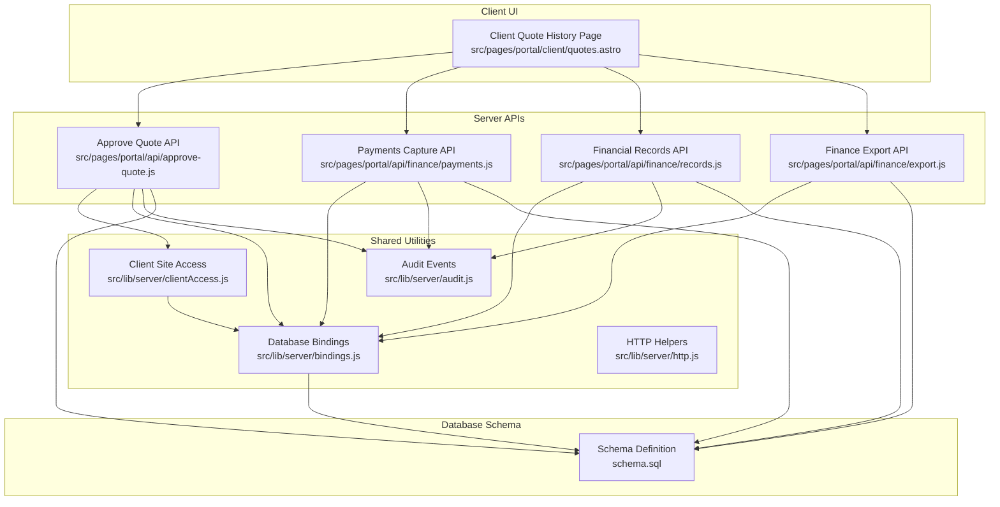

**Diagram sources**
- [quotes.astro](file://src/pages/portal/client/quotes.astro)
- [approve-quote.js](file://src/pages/portal/api/approve-quote.js)
- [payments.js](file://src/pages/portal/api/finance/payments.js)
- [records.js](file://src/pages/portal/api/finance/records.js)
- [export.js](file://src/pages/portal/api/finance/export.js)
- [clientAccess.js](file://src/lib/server/clientAccess.js)
- [bindings.js](file://src/lib/server/bindings.js)
- [audit.js](file://src/lib/server/audit.js)
- [http.js](file://src/lib/server/http.js)
- [schema.sql](file://schema.sql)

**Section sources**
- [quotes.astro](file://src/pages/portal/client/quotes.astro)
- [approve-quote.js](file://src/pages/portal/api/approve-quote.js)
- [payments.js](file://src/pages/portal/api/finance/payments.js)
- [records.js](file://src/pages/portal/api/finance/records.js)
- [export.js](file://src/pages/portal/api/finance/export.js)
- [clientAccess.js](file://src/lib/server/clientAccess.js)
- [bindings.js](file://src/lib/server/bindings.js)
- [audit.js](file://src/lib/server/audit.js)
- [http.js](file://src/lib/server/http.js)
- [schema.sql](file://schema.sql)

## Core Components
- Client Quote History Page: Displays financial records, aggregates totals, supports filtering by status and type, and provides client-initiated quote approval actions.
- Approve Quote API: Validates client permissions, checks quote eligibility, transitions quotes to invoices, generates invoice references, and logs audit events.
- Financial Records API: Creates quotes and invoices with validation, ensures job/site linkage, and sets initial statuses.
- Payments Capture API: Records payments against unpaid invoices, creates mirrored payment records, and logs audit events.
- Finance Export API: Exports ledger data for reporting and reconciliation.
- Client Site Access Utilities: Enforces client-to-site access controls and builds dynamic SQL clauses.
- Database Bindings: Provides Cloudflare D1 database access and constants.
- Audit Logging: Centralized audit event recording for compliance and monitoring.

**Section sources**
- [quotes.astro](file://src/pages/portal/client/quotes.astro)
- [approve-quote.js](file://src/pages/portal/api/approve-quote.js)
- [records.js](file://src/pages/portal/api/finance/records.js)
- [payments.js](file://src/pages/portal/api/finance/payments.js)
- [export.js](file://src/pages/portal/api/finance/export.js)
- [clientAccess.js](file://src/lib/server/clientAccess.js)
- [bindings.js](file://src/lib/server/bindings.js)
- [audit.js](file://src/lib/server/audit.js)

## Architecture Overview
The system integrates client UI interactions with server-side APIs and database operations. Client users can view quotes, filter by status/type, and approve eligible quotes. Approved quotes are transformed into invoices with generated references. Finance users can record payments against invoices, which are mirrored as payment records. All actions are audited for compliance.

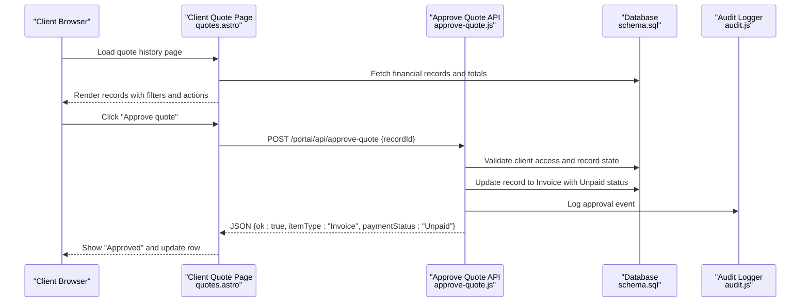

**Diagram sources**
- [quotes.astro](file://src/pages/portal/client/quotes.astro)
- [approve-quote.js](file://src/pages/portal/api/approve-quote.js)
- [audit.js](file://src/lib/server/audit.js)
- [schema.sql](file://schema.sql)

## Detailed Component Analysis

### Quote Data Model and Financial Record Integration
The financial record model underpins quotes, invoices, and payments:
- Entity: financial_records
- Fields: id, site_id, job_id, amount, item_type, payment_status, distribution_date, reference, timestamps
- Constraints: item_type restricted to Quote, Invoice, Payment; payment_status restricted to Pending Approval, Unpaid, Settled
- Indexes: optimized lookups by site and status, job, and created/distribution dates

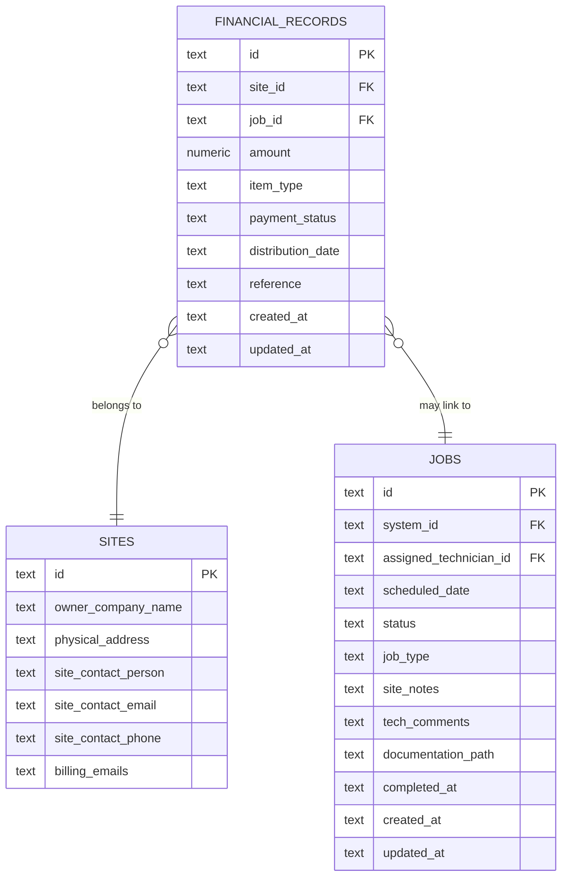

**Diagram sources**
- [schema.sql](file://schema.sql)

**Section sources**
- [schema.sql](file://schema.sql)

### Client Quote History Page
Key behaviors:
- Loads mapped client sites and aggregates financial totals (pending, unpaid, settled)
- Renders a scrollable ledger with columns for site, reference, type, status, amount, date, job, and action
- Provides interactive filters: search by site/reference/type, status filter (All, Pending Approval, Unpaid, Paid in Sage), and type filter (All, Quote, Invoice)
- Displays approval buttons only for quotes with Pending Approval status
- Uses client-side filtering logic to show/hide rows and a "no results" indicator

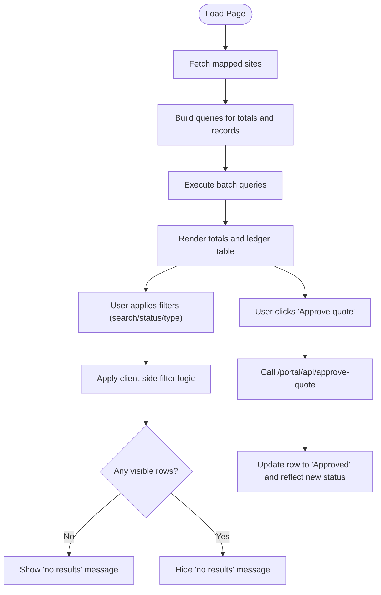

**Diagram sources**
- [quotes.astro](file://src/pages/portal/client/quotes.astro)

**Section sources**
- [quotes.astro](file://src/pages/portal/client/quotes.astro)

### Quote Approval Workflow
The approval process enforces client verification, state validation, and atomic updates:
- Authentication and Role Check: Only authenticated clients can approve quotes
- Client Access Verification: Ensures the quote belongs to a site accessible by the client
- State Validation: Only quotes with Pending Approval status can be approved
- Transformation: Updates record to Invoice with Unpaid status, sets distribution_date, and assigns a generated invoice reference if missing
- Audit Logging: Records success/failure outcomes with metadata for compliance

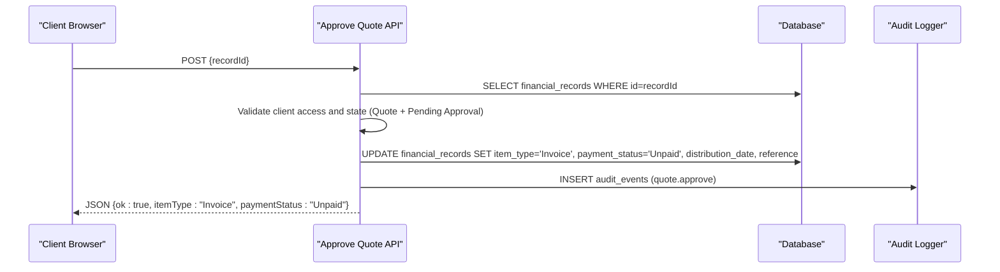

**Diagram sources**
- [approve-quote.js](file://src/pages/portal/api/approve-quote.js)
- [audit.js](file://src/lib/server/audit.js)
- [schema.sql](file://schema.sql)

**Section sources**
- [approve-quote.js](file://src/pages/portal/api/approve-quote.js)
- [audit.js](file://src/lib/server/audit.js)
- [schema.sql](file://schema.sql)

### Payment Processing Integration
Payment capture is handled by a dedicated API:
- Authentication and Role Check: Only finance/admin users can record payments
- Validation: Ensures the target record is an unpaid invoice
- Atomic Operation: Marks the invoice as Settled and inserts a mirrored Payment record with the same amount and reference pattern
- Audit Logging: Captures payment reference, invoice reference, and related identifiers

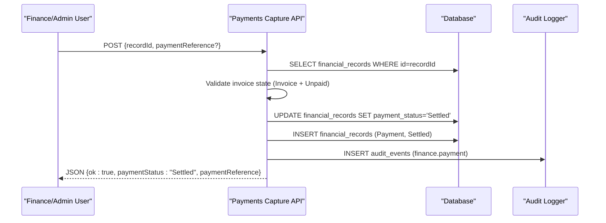

**Diagram sources**
- [payments.js](file://src/pages/portal/api/finance/payments.js)
- [audit.js](file://src/lib/server/audit.js)
- [schema.sql](file://schema.sql)

**Section sources**
- [payments.js](file://src/pages/portal/api/finance/payments.js)
- [audit.js](file://src/lib/server/audit.js)
- [schema.sql](file://schema.sql)

### Financial Record Creation
The financial records API enables creation of quotes and invoices with strict validation:
- Role Restriction: Only finance/admin users can create records
- Validation: siteId existence, optional jobId linkage, amount/date/reference sanitization, and uniqueness per job per item type
- Initial Status: Quotes start as Pending Approval; Invoices start as Unpaid
- Audit Logging: Records creation metadata for compliance

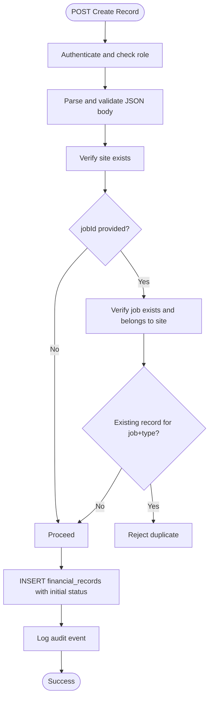

**Diagram sources**
- [records.js](file://src/pages/portal/api/finance/records.js)
- [audit.js](file://src/lib/server/audit.js)
- [schema.sql](file://schema.sql)

**Section sources**
- [records.js](file://src/pages/portal/api/finance/records.js)
- [audit.js](file://src/lib/server/audit.js)
- [schema.sql](file://schema.sql)

### Finance Export
The export API generates a CSV of ledger data for reporting:
- Role Restriction: Only finance/admin users can export
- Query: Joins financial_records with sites for client and billing emails
- Output: CSV with headers and rows, attachment disposition

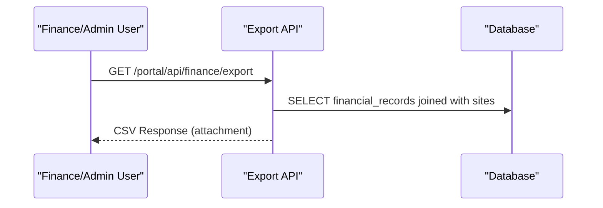

**Diagram sources**
- [export.js](file://src/pages/portal/api/finance/export.js)
- [schema.sql](file://schema.sql)

**Section sources**
- [export.js](file://src/pages/portal/api/finance/export.js)
- [schema.sql](file://schema.sql)

### Client Verification and Access Controls
Client site access is enforced via:
- Client Site IDs: Aggregates primary site and additional mapped sites
- Site Query: Retrieves site details for the client's accessible sites
- Access Check: Ensures a user can only act on records belonging to their mapped sites
- Dynamic SQL: Builds parameterized placeholders for safe queries

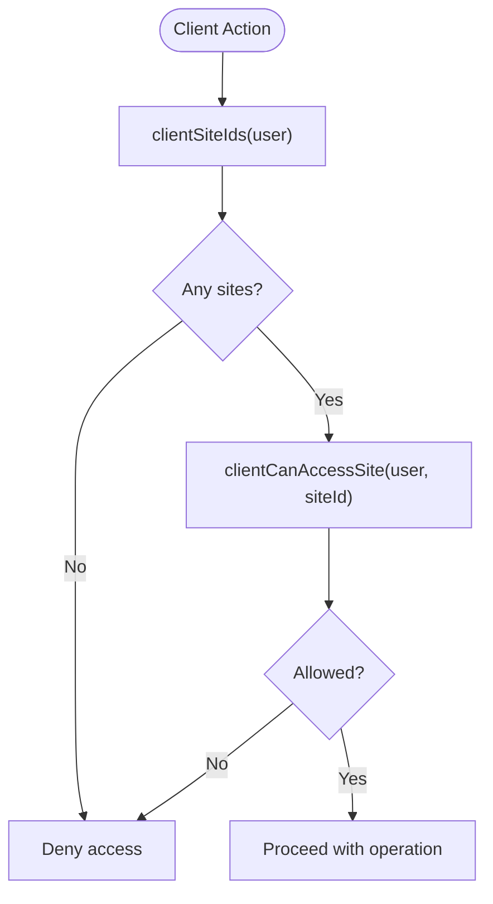

**Diagram sources**
- [clientAccess.js](file://src/lib/server/clientAccess.js)

**Section sources**
- [clientAccess.js](file://src/lib/server/clientAccess.js)

### Quote Lifecycle Management
Lifecycle stages:
- Creation: Quotes and invoices are created with initial statuses
- Pending Approval: Clients review and approve quotes
- Approval: Quotes become invoices with Unpaid status and generated references
- Payment: Finance/admin records payments, marking invoices as Settled and creating mirrored Payment records
- Reporting: Export API provides CSV for reconciliation

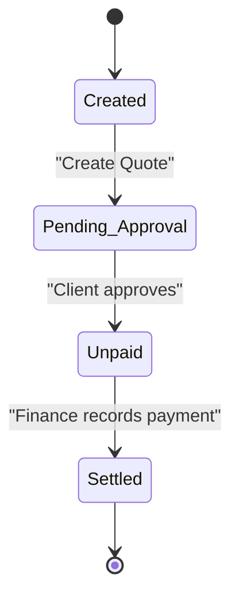

**Diagram sources**
- [records.js](file://src/pages/portal/api/finance/records.js)
- [approve-quote.js](file://src/pages/portal/api/approve-quote.js)
- [payments.js](file://src/pages/portal/api/finance/payments.js)
- [schema.sql](file://schema.sql)

**Section sources**
- [records.js](file://src/pages/portal/api/finance/records.js)
- [approve-quote.js](file://src/pages/portal/api/approve-quote.js)
- [payments.js](file://src/pages/portal/api/finance/payments.js)
- [schema.sql](file://schema.sql)

### Quote Filtering, Sorting, and Search
Client-side filtering and sorting:
- Search: Text search across site name, reference, and item type
- Status Filter: Dropdown to filter by Pending Approval, Unpaid, Paid in Sage
- Type Filter: Dropdown to filter by Quote or Invoice
- Sorting: Ledger sorts by distribution_date and created_at (server-side), with client-side filtering applied

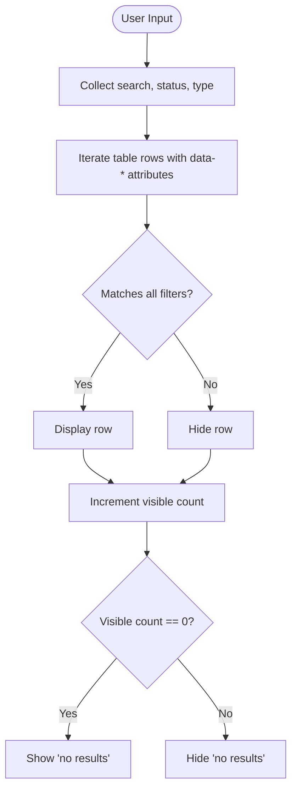

**Diagram sources**
- [quotes.astro](file://src/pages/portal/client/quotes.astro)

**Section sources**
- [quotes.astro](file://src/pages/portal/client/quotes.astro)

### Practical Examples

#### Example 1: Evaluating a Pending Quote
- Scenario: Client views the quote history page and identifies a pending quote requiring approval.
- Action: Clicks the "Approve quote" button for the relevant record.
- Outcome: The system validates client access and quote state, transforms the record to an invoice with Unpaid status, and updates the UI to reflect the approval.

**Section sources**
- [quotes.astro](file://src/pages/portal/client/quotes.astro)
- [approve-quote.js](file://src/pages/portal/api/approve-quote.js)

#### Example 2: Creating a New Quote
- Scenario: Finance user creates a new quote for a job at a specific site.
- Action: Calls the financial records API with validated inputs (siteId, jobId, amount, distributionDate).
- Outcome: The system verifies site/job linkage, prevents duplicates, and inserts the quote with Pending Approval status.

**Section sources**
- [records.js](file://src/pages/portal/api/finance/records.js)

#### Example 3: Recording a Payment
- Scenario: Finance user records a payment received for an unpaid invoice.
- Action: Calls the payments API with the invoice recordId and optional paymentReference.
- Outcome: The system marks the invoice as Settled and inserts a mirrored Payment record with a generated reference.

**Section sources**
- [payments.js](file://src/pages/portal/api/finance/payments.js)

#### Example 4: Exporting Ledger Data
- Scenario: Finance admin exports ledger data for reconciliation.
- Action: Calls the export API.
- Outcome: The system returns a CSV file containing all financial records with client and billing details.

**Section sources**
- [export.js](file://src/pages/portal/api/finance/export.js)

## Dependency Analysis
The system exhibits clear separation of concerns:
- UI depends on server APIs for state changes and data retrieval
- APIs depend on shared utilities for access control, database bindings, and audit logging
- Database schema defines constraints and indexes supporting performance and integrity
- Audit logging is centralized and invoked by APIs for compliance

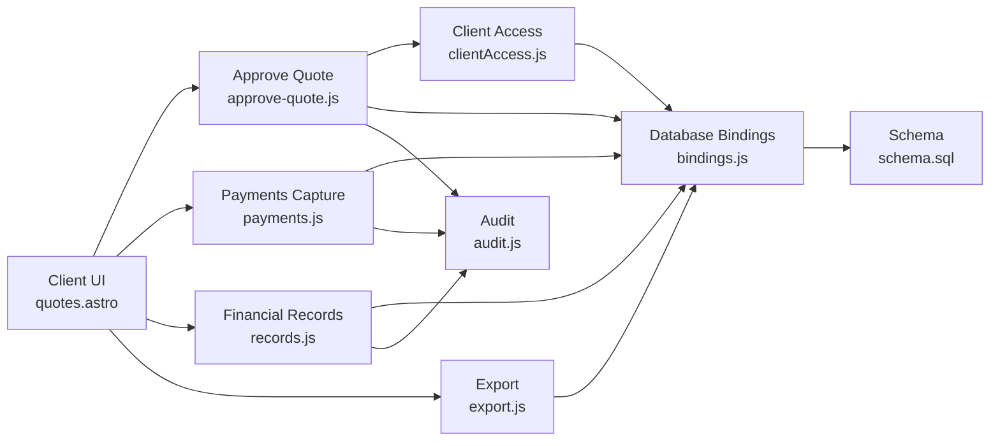

**Diagram sources**
- [quotes.astro](file://src/pages/portal/client/quotes.astro)
- [approve-quote.js](file://src/pages/portal/api/approve-quote.js)
- [payments.js](file://src/pages/portal/api/finance/payments.js)
- [records.js](file://src/pages/portal/api/finance/records.js)
- [export.js](file://src/pages/portal/api/finance/export.js)
- [clientAccess.js](file://src/lib/server/clientAccess.js)
- [bindings.js](file://src/lib/server/bindings.js)
- [audit.js](file://src/lib/server/audit.js)
- [schema.sql](file://schema.sql)

**Section sources**
- [quotes.astro](file://src/pages/portal/client/quotes.astro)
- [approve-quote.js](file://src/pages/portal/api/approve-quote.js)
- [payments.js](file://src/pages/portal/api/finance/payments.js)
- [records.js](file://src/pages/portal/api/finance/records.js)
- [export.js](file://src/pages/portal/api/finance/export.js)
- [clientAccess.js](file://src/lib/server/clientAccess.js)
- [bindings.js](file://src/lib/server/bindings.js)
- [audit.js](file://src/lib/server/audit.js)
- [schema.sql](file://schema.sql)

## Performance Considerations
- Database Indexes: Indexes on financial_records (site_id, payment_status, distribution_date) and (job_id) support efficient filtering and joins.
- Batch Queries: The client quote history page uses a batch query to fetch totals and records concurrently.
- Client-Side Filtering: Reduces server load by filtering visible rows without re-querying.
- Parameterized Placeholders: Dynamic SQL clause construction prevents injection and supports variable site lists.

[No sources needed since this section provides general guidance]

## Troubleshooting Guide
Common issues and resolutions:
- Unauthorized or Forbidden: Ensure the user is authenticated and has the correct role (client for approvals, finance/admin for payments/exports).
- Bad Request: Verify request body format and required fields (recordId, siteId, itemType, amount, dates).
- Not Found: Confirm the record exists and belongs to an accessible site.
- Invalid State: Approvals require item_type Quote and payment_status Pending Approval; payments require item_type Invoice and payment_status Unpaid.
- Audit Failures: Audit writes are best-effort; errors are logged and do not block operations.

**Section sources**
- [approve-quote.js](file://src/pages/portal/api/approve-quote.js)
- [payments.js](file://src/pages/portal/api/finance/payments.js)
- [records.js](file://src/pages/portal/api/finance/records.js)
- [http.js](file://src/lib/server/http.js)
- [audit.js](file://src/lib/server/audit.js)

## Conclusion
The client quote management system provides a secure, auditable, and user-friendly workflow for quote approvals, invoice generation, and payment recording. It leverages client site access controls, robust validation, and centralized audit logging to maintain integrity and compliance. The modular architecture supports scalable enhancements while preserving clear data models and operational boundaries.