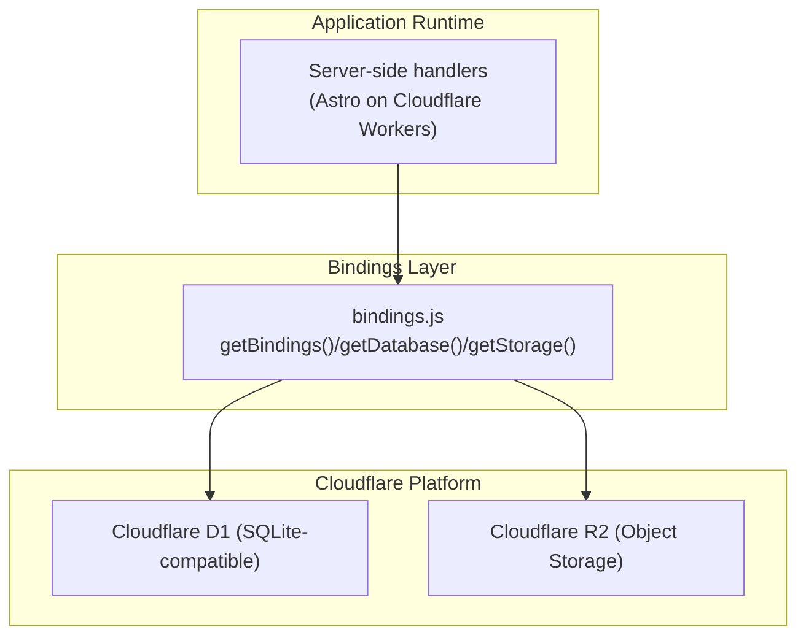
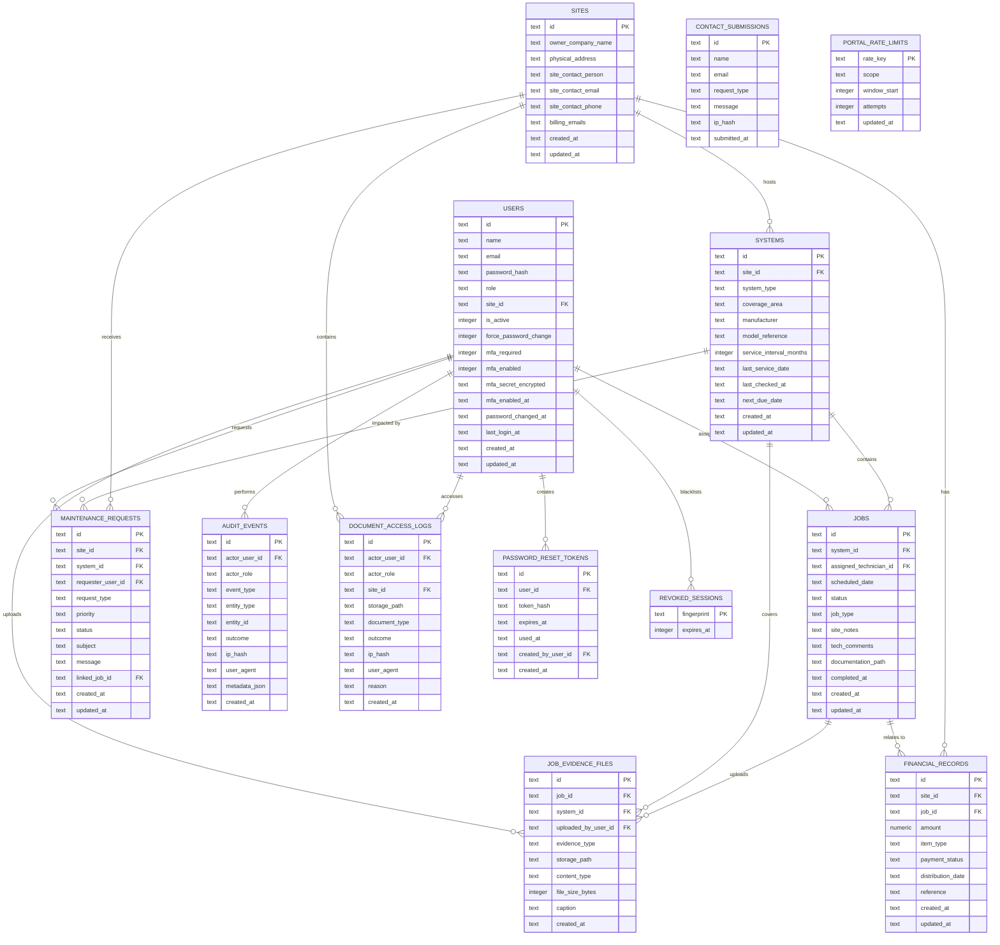
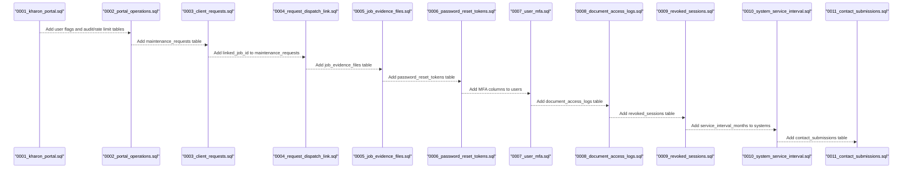
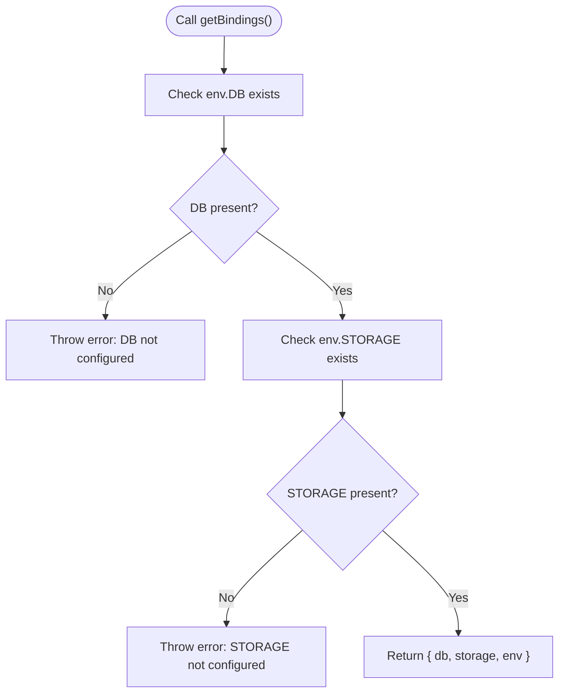
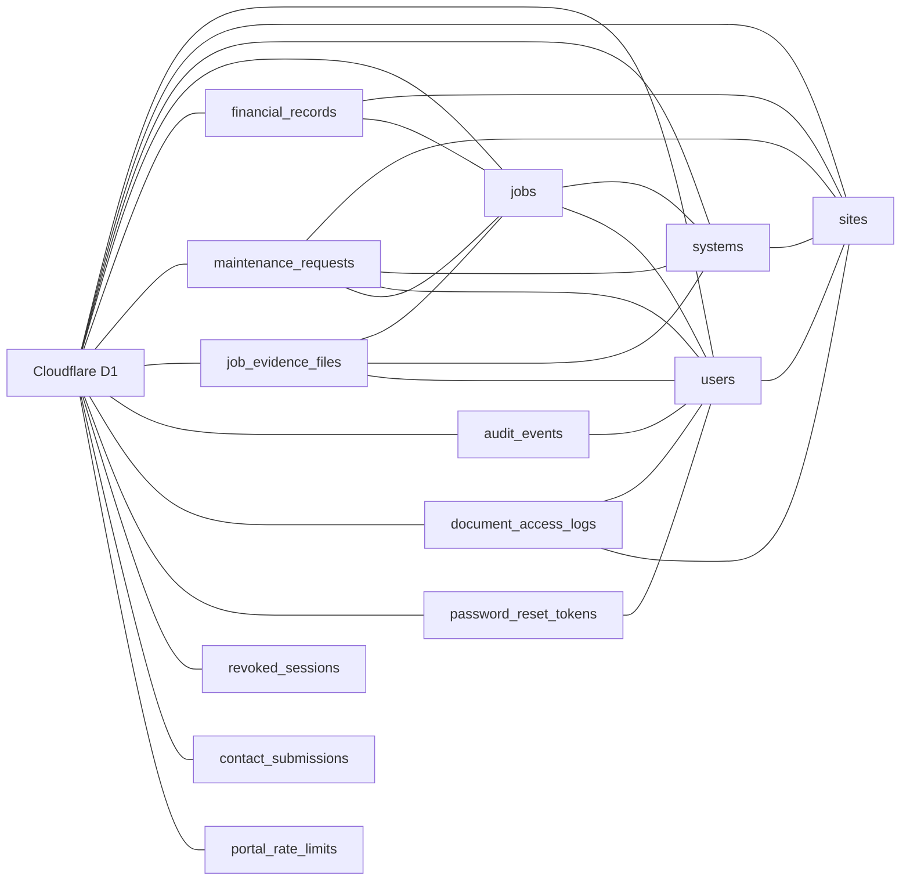

# Database Design & Schema

<cite>
**Referenced Files in This Document**
- [schema.sql](file://schema.sql)
- [0001_kharon_portal.sql](file://migrations/0001_kharon_portal.sql)
- [0002_portal_operations.sql](file://migrations/0002_portal_operations.sql)
- [0003_client_requests.sql](file://migrations/0003_client_requests.sql)
- [0004_request_dispatch_link.sql](file://migrations/0004_request_dispatch_link.sql)
- [0005_job_evidence_files.sql](file://migrations/0005_job_evidence_files.sql)
- [0006_password_reset_tokens.sql](file://migrations/0006_password_reset_tokens.sql)
- [0007_user_mfa.sql](file://migrations/0007_user_mfa.sql)
- [0008_document_access_logs.sql](file://migrations/0008_document_access_logs.sql)
- [0009_revoked_sessions.sql](file://migrations/0009_revoked_sessions.sql)
- [0010_system_service_interval.sql](file://migrations/0010_system_service_interval.sql)
- [0011_contact_submissions.sql](file://migrations/0011_contact_submissions.sql)
- [bindings.js](file://src/lib/server/bindings.js)
</cite>

## Table of Contents
1. [Introduction](#introduction)
2. [Project Structure](#project-structure)
3. [Core Components](#core-components)
4. [Architecture Overview](#architecture-overview)
5. [Detailed Component Analysis](#detailed-component-analysis)
6. [Dependency Analysis](#dependency-analysis)
7. [Performance Considerations](#performance-considerations)
8. [Troubleshooting Guide](#troubleshooting-guide)
9. [Conclusion](#conclusion)
10. [Appendices](#appendices)

## Introduction
This document describes the Cloudflare D1 database design and migration management for the Kharon portal. It covers the complete entity relationship model, including users, sites, systems, jobs, financial records, maintenance requests, evidence files, and supporting operational tables. It documents table structures, primary and foreign keys, indexing strategies, and data integrity constraints. It also explains the migration system evolution from the initial schema to the current state, outlines data retention and backup considerations, and details the bindings layer for database operations, query patterns, and performance optimization. Practical examples of common operations, data access patterns, and schema modification procedures are included, along with data lifecycle management, archiving strategies, and compliance considerations.

## Project Structure
The database schema and migrations are organized as follows:
- Initial schema and indexes are defined in a single SQL script.
- Subsequent schema changes are captured in numbered migration files under the migrations directory.
- The server-side bindings module exposes Cloudflare D1 and R2 bindings to application code.

```mermaid
graph TB
A["schema.sql"] --> B["Initial schema<br/>users, sites, systems, jobs,<br/>financial_records"]
A --> C["Indexes and triggers"]
D["migrations/0001_kharon_portal.sql"] --> A
E["migrations/0002_portal_operations.sql"] --> F["audit_events<br/>portal_rate_limits"]
G["migrations/0003_client_requests.sql"] --> H["maintenance_requests"]
I["migrations/0004_request_dispatch_link.sql"] --> H
J["migrations/0005_job_evidence_files.sql"] --> K["job_evidence_files"]
L["migrations/0006_password_reset_tokens.sql"] --> M["password_reset_tokens"]
N["migrations/0007_user_mfa.sql"] --> O["users MFA columns"]
P["migrations/0008_document_access_logs.sql"] --> Q["document_access_logs"]
R["migrations/0009_revoked_sessions.sql"] --> S["revoked_sessions"]
T["migrations/0010_system_service_interval.sql"] --> U["systems.service_interval_months"]
V["migrations/0011_contact_submissions.sql"] --> W["contact_submissions"]
X["src/lib/server/bindings.js"] --> Y["DB (D1) and STORAGE (R2) access"]
```

**Diagram sources**
- [schema.sql](file://schema.sql)
- [0001_kharon_portal.sql](file://migrations/0001_kharon_portal.sql)
- [0002_portal_operations.sql](file://migrations/0002_portal_operations.sql)
- [0003_client_requests.sql](file://migrations/0003_client_requests.sql)
- [0004_request_dispatch_link.sql](file://migrations/0004_request_dispatch_link.sql)
- [0005_job_evidence_files.sql](file://migrations/0005_job_evidence_files.sql)
- [0006_password_reset_tokens.sql](file://migrations/0006_password_reset_tokens.sql)
- [0007_user_mfa.sql](file://migrations/0007_user_mfa.sql)
- [0008_document_access_logs.sql](file://migrations/0008_document_access_logs.sql)
- [0009_revoked_sessions.sql](file://migrations/0009_revoked_sessions.sql)
- [0010_system_service_interval.sql](file://migrations/0010_system_service_interval.sql)
- [0011_contact_submissions.sql](file://migrations/0011_contact_submissions.sql)
- [bindings.js](file://src/lib/server/bindings.js)

**Section sources**
- [schema.sql](file://schema.sql)
- [0001_kharon_portal.sql](file://migrations/0001_kharon_portal.sql)
- [0002_portal_operations.sql](file://migrations/0002_portal_operations.sql)
- [0003_client_requests.sql](file://migrations/0003_client_requests.sql)
- [0004_request_dispatch_link.sql](file://migrations/0004_request_dispatch_link.sql)
- [0005_job_evidence_files.sql](file://migrations/0005_job_evidence_files.sql)
- [0006_password_reset_tokens.sql](file://migrations/0006_password_reset_tokens.sql)
- [0007_user_mfa.sql](file://migrations/0007_user_mfa.sql)
- [0008_document_access_logs.sql](file://migrations/0008_document_access_logs.sql)
- [0009_revoked_sessions.sql](file://migrations/0009_revoked_sessions.sql)
- [0010_system_service_interval.sql](file://migrations/0010_system_service_interval.sql)
- [0011_contact_submissions.sql](file://migrations/0011_contact_submissions.sql)
- [bindings.js](file://src/lib/server/bindings.js)

## Core Components
This section summarizes the core entities and their relationships, constraints, and indexes.

- Users
  - Purpose: Authentication, roles, site association, MFA, and activity tracking.
  - Key constraints: Role enumeration, email uniqueness and lowercase, password hash length, active and MFA flags.
  - Foreign keys: site_id references sites(id) with ON DELETE SET NULL.
  - Indexes: role, site_id, composite role/mfa_required/mfa_enabled.
  - Triggers: updated_at auto-updated on updates.

- Sites
  - Purpose: Client site metadata and billing contacts.
  - Key constraints: Owner company name and address length checks, optional contact email format check.
  - Indexes: owner_company_name.
  - Triggers: updated_at auto-updated on updates.

- Systems
  - Purpose: Equipment inventory per site with service scheduling.
  - Key constraints: System type enumeration, coverage area length, service interval bounds.
  - Foreign keys: site_id references sites(id) with ON DELETE CASCADE.
  - Indexes: site_id/next_due_date.
  - Triggers: updated_at auto-updated on updates.

- Jobs
  - Purpose: Maintenance tasks assigned to technicians against systems.
  - Key constraints: Status and type enumerations, documentation path pattern, timestamps.
  - Foreign keys: system_id (CASCADE), assigned_technician_id (SET NULL).
  - Indexes: technician/status/scheduled_date, system/status.
  - Triggers: updated_at auto-updated on updates.

- Financial Records
  - Purpose: Quotes, invoices, and payments linked to sites and optionally jobs.
  - Key constraints: Amount non-negative, item_type and payment_status enumerations.
  - Foreign keys: site_id (CASCADE), job_id (SET NULL).
  - Indexes: site/payment_status/distribution_date, job_id.
  - Triggers: updated_at auto-updated on updates.

- Maintenance Requests
  - Purpose: Client-generated work orders with priority and status.
  - Key constraints: Types and priorities enumerations, subject/message length checks.
  - Foreign keys: site_id (CASCADE), system_id (SET NULL), requester_user_id (SET NULL), linked_job_id (SET NULL).
  - Indexes: site/status/created_at, status/priority/created_at, system_id, linked_job_id.
  - Triggers: updated_at auto-updated on updates.

- Evidence Files
  - Purpose: Photos uploaded for jobs and systems.
  - Key constraints: Evidence type enumeration, storage path pattern, content type enumeration, file size bounds.
  - Foreign keys: job_id and system_id (CASCADE), uploaded_by_user_id (SET NULL).
  - Indexes: job_id/created_at, system_id/created_at.
  - Notes: storage_path is unique.

- Audit Events
  - Purpose: Security and administrative audit trail.
  - Constraints: Event and entity type lengths, outcome enumeration, optional actor role enumeration.
  - Foreign keys: actor_user_id (SET NULL).
  - Indexes: actor_user_id/created_at, event_type/created_at.

- Document Access Logs
  - Purpose: Track access to jobcards and evidence photos.
  - Constraints: Storage path pattern, document type enumeration, outcome enumeration.
  - Foreign keys: actor_user_id (SET NULL), site_id (SET NULL).
  - Indexes: actor_user_id/created_at, site_id/created_at, storage_path/created_at.

- Password Reset Tokens
  - Purpose: Secure password reset tokens with expiry and usage tracking.
  - Constraints: Token hash length, expiry and usage timestamps.
  - Foreign keys: user_id (CASCADE), created_by_user_id (SET NULL).
  - Indexes: user_id/created_at, expires_at/used_at.

- Revoked Sessions
  - Purpose: Session blacklisting via device fingerprints.
  - Constraints: Expiry timestamp.
  - Indexes: expires_at.

- Contact Submissions
  - Purpose: Public contact form submissions.
  - Constraints: Name/email/subject/message length checks, email format check, IP hash.
  - Indexes: submitted_at.

- Rate Limits
  - Purpose: Global rate limiting keyed by scope and window.
  - Constraints: Attempts non-negative.
  - Indexes: scope/window_start.

**Section sources**
- [schema.sql](file://schema.sql)
- [0001_kharon_portal.sql](file://migrations/0001_kharon_portal.sql)
- [0002_portal_operations.sql](file://migrations/0002_portal_operations.sql)
- [0003_client_requests.sql](file://migrations/0003_client_requests.sql)
- [0004_request_dispatch_link.sql](file://migrations/0004_request_dispatch_link.sql)
- [0005_job_evidence_files.sql](file://migrations/0005_job_evidence_files.sql)
- [0006_password_reset_tokens.sql](file://migrations/0006_password_reset_tokens.sql)
- [0007_user_mfa.sql](file://migrations/0007_user_mfa.sql)
- [0008_document_access_logs.sql](file://migrations/0008_document_access_logs.sql)
- [0009_revoked_sessions.sql](file://migrations/0009_revoked_sessions.sql)
- [0010_system_service_interval.sql](file://migrations/0010_system_service_interval.sql)
- [0011_contact_submissions.sql](file://migrations/0011_contact_submissions.sql)

## Architecture Overview
The database architecture centers around Cloudflare D1 with a clear separation of concerns:
- D1 holds relational data for entities and operational logs.
- R2 stores binary content referenced by storage_path fields in job evidence and jobcards.
- Application code retrieves bindings via a dedicated module and executes queries.

**Diagram sources**
- [bindings.js](file://src/lib/server/bindings.js)

**Section sources**
- [bindings.js](file://src/lib/server/bindings.js)

## Detailed Component Analysis

### Entity Relationship Model
The ER model captures primary and foreign keys, referential actions, and cardinalities.

**Diagram sources**
- [schema.sql](file://schema.sql)

**Section sources**
- [schema.sql](file://schema.sql)

### Migration Evolution
The schema evolved incrementally through migrations. The following sequence shows additions and modifications:

**Diagram sources**
- [0001_kharon_portal.sql](file://migrations/0001_kharon_portal.sql)
- [0002_portal_operations.sql](file://migrations/0002_portal_operations.sql)
- [0003_client_requests.sql](file://migrations/0003_client_requests.sql)
- [0004_request_dispatch_link.sql](file://migrations/0004_request_dispatch_link.sql)
- [0005_job_evidence_files.sql](file://migrations/0005_job_evidence_files.sql)
- [0006_password_reset_tokens.sql](file://migrations/0006_password_reset_tokens.sql)
- [0007_user_mfa.sql](file://migrations/0007_user_mfa.sql)
- [0008_document_access_logs.sql](file://migrations/0008_document_access_logs.sql)
- [0009_revoked_sessions.sql](file://migrations/0009_revoked_sessions.sql)
- [0010_system_service_interval.sql](file://migrations/0010_system_service_interval.sql)
- [0011_contact_submissions.sql](file://migrations/0011_contact_submissions.sql)

**Section sources**
- [0001_kharon_portal.sql](file://migrations/0001_kharon_portal.sql)
- [0002_portal_operations.sql](file://migrations/0002_portal_operations.sql)
- [0003_client_requests.sql](file://migrations/0003_client_requests.sql)
- [0004_request_dispatch_link.sql](file://migrations/0004_request_dispatch_link.sql)
- [0005_job_evidence_files.sql](file://migrations/0005_job_evidence_files.sql)
- [0006_password_reset_tokens.sql](file://migrations/0006_password_reset_tokens.sql)
- [0007_user_mfa.sql](file://migrations/0007_user_mfa.sql)
- [0008_document_access_logs.sql](file://migrations/0008_document_access_logs.sql)
- [0009_revoked_sessions.sql](file://migrations/0009_revoked_sessions.sql)
- [0010_system_service_interval.sql](file://migrations/0010_system_service_interval.sql)
- [0011_contact_submissions.sql](file://migrations/0011_contact_submissions.sql)

### Bindings Layer Implementation
The bindings module centralizes access to Cloudflare resources:
- getBindings(): Returns { db, storage, env } with validation.
- getDatabase(): Returns D1 database handle with validation.
- getStorage(): Returns R2 storage handle with validation.
- getStandardServiceFee(): Reads a numeric environment variable with defaults.

**Diagram sources**
- [bindings.js](file://src/lib/server/bindings.js)

**Section sources**
- [bindings.js](file://src/lib/server/bindings.js)

### Indexing Strategy and Data Integrity
- Indexes
  - Composite indexes optimize frequent queries: users(role), users(site_id, mfa_required, mfa_enabled), systems(site_id, next_due_date), jobs(assigned_technician_id, status, scheduled_date), jobs(system_id, status), financial_records(site_id, payment_status, distribution_date), financial_records(job_id), maintenance_requests(site_id, status, created_at), maintenance_requests(status, priority, created_at), maintenance_requests(system_id), maintenance_requests(linked_job_id), job_evidence_files(job_id, created_at), job_evidence_files(system_id, created_at), document_access_logs(actor_user_id, created_at), document_access_logs(site_id, created_at), document_access_logs(storage_path, created_at), portal_rate_limits(scope, window_start), password_reset_tokens(user_id, created_at), password_reset_tokens(expires_at, used_at), revoked_sessions(expires_at), contact_submissions(submitted_at).
- Triggers
  - Auto-update updated_at on updates for users, sites, systems, jobs, financial_records, maintenance_requests.
- Constraints
  - Enumerations for statuses, types, outcomes, content types.
  - Length checks for names, emails, subjects, messages.
  - Numeric bounds for amounts and file sizes.
  - Pattern checks for storage paths and email formats.
  - Foreign keys with ON DELETE actions: CASCADE for parent-child relationships, SET NULL for optional associations.

**Section sources**
- [schema.sql](file://schema.sql)

### Query Patterns and Performance Optimization
Common query patterns observed in indexes and foreign keys:
- List jobs by technician and status with date ordering.
- Filter financial records by site and payment status with distribution date sorting.
- Retrieve maintenance requests by site and status with priority-aware ordering.
- Fetch evidence files by job or system with creation timestamp ordering.
- Audit and document access logs filtered by actor, site, or path.
- Rate-limit lookups by scope and window.
- Password reset token queries by user and expiry.

Optimization recommendations:
- Use composite indexes aligned with WHERE/HAVING and ORDER BY clauses.
- Prefer equality predicates on indexed columns for range scans.
- Limit SELECT lists to required columns to reduce I/O.
- Batch reads/writes for bulk operations.
- Monitor long-running queries and add appropriate indexes.

[No sources needed since this section provides general guidance]

### Practical Examples
- Insert a new job for a system and assign a technician.
- Update job status and completion timestamp.
- Upload evidence photo with storage path validation.
- Query financial records for a site within a date range.
- Log document access with outcome and reason.
- Create a password reset token with expiry.
- Revoke sessions by inserting fingerprints with expiry.

[No sources needed since this section provides general guidance]

### Data Lifecycle Management, Archiving, and Compliance
- Retention and archival
  - Define retention periods for audit events, document access logs, and contact submissions.
  - Archive old financial records and maintenance requests after retention thresholds.
  - Purge expired password reset tokens and revoked session fingerprints.
- Backup considerations
  - Back up D1 database snapshots regularly.
  - Store R2 objects separately with versioning enabled.
- Compliance
  - Enforce data minimization and purpose limitation.
  - Implement access logging and audit trails.
  - Encrypt sensitive fields at rest and in transit.
  - Provide data portability and erasure capabilities.

[No sources needed since this section provides general guidance]

## Dependency Analysis
This section maps internal dependencies among tables and external dependencies on Cloudflare services.

**Diagram sources**
- [schema.sql](file://schema.sql)

**Section sources**
- [schema.sql](file://schema.sql)

## Performance Considerations
- Index selection
  - Ensure indexes match query patterns: technician/status/date, site/status/date, system/status, job_id, storage_path.
- Trigger overhead
  - Triggers update updated_at on every write; minimize unnecessary updates.
- Data types
  - Use appropriate numeric and text constraints to prevent excessive storage and improve query plans.
- I/O efficiency
  - Use LIMIT and pagination for large result sets.
  - Avoid wildcard LIKE unless necessary; prefer exact matches or prefix matching.

[No sources needed since this section provides general guidance]

## Troubleshooting Guide
- Binding errors
  - Symptoms: Errors indicating missing DB or STORAGE bindings.
  - Resolution: Verify environment variables in Wrangler configuration and redeploy.
- Constraint violations
  - Symptoms: Errors on INSERT/UPDATE due to CHECK constraints or foreign keys.
  - Resolution: Validate inputs against schema constraints and ensure referential integrity.
- Missing indexes
  - Symptoms: Slow queries on joins or filters.
  - Resolution: Add composite indexes aligned with query patterns.
- Trigger conflicts
  - Symptoms: Unexpected updated_at changes or cascading deletes.
  - Resolution: Review trigger logic and ON DELETE actions.

**Section sources**
- [bindings.js](file://src/lib/server/bindings.js)
- [schema.sql](file://schema.sql)

## Conclusion
The database design for the Kharon portal is centered on a normalized relational model with strong referential integrity and comprehensive indexing. The migration system has consistently extended the schema to support operational needs, while the bindings layer provides safe and reliable access to Cloudflare D1 and R2. By aligning queries with existing indexes, enforcing constraints, and implementing robust retention and backup strategies, the system supports efficient operations and compliance.

[No sources needed since this section summarizes without analyzing specific files]

## Appendices

### Appendix A: Migration Checklist
- Review migration order and dependencies.
- Test schema changes in staging before production.
- Validate indexes and constraints post-deployment.
- Update application code to reflect schema changes.

[No sources needed since this section provides general guidance]