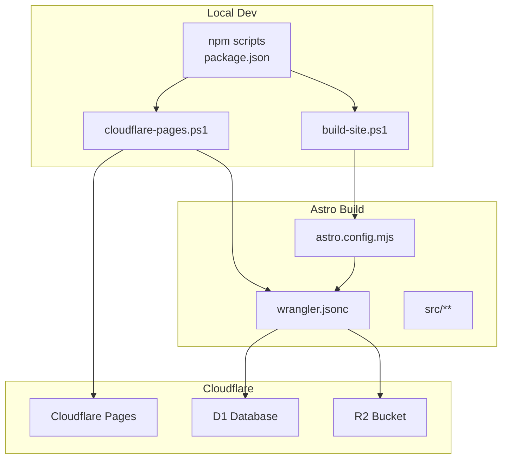
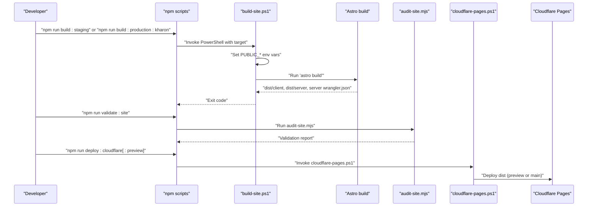
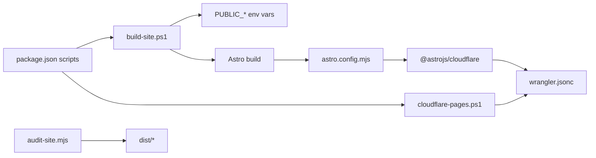

# Build Automation

<cite>
**Referenced Files in This Document**
- [build-site.ps1](file://scripts/build-site.ps1)
- [cloudflare-pages.ps1](file://scripts/cloudflare-pages.ps1)
- [package.json](file://package.json)
- [astro.config.mjs](file://astro.config.mjs)
- [wrangler.jsonc](file://wrangler.jsonc)
- [audit-site.mjs](file://scripts/audit-site.mjs)
- [middleware.js](file://src/middleware.js)
- [csrf.js](file://src/lib/server/csrf.js)
- [site.js](file://src/data/site.js)
- [env.d.ts](file://src/env.d.ts)
</cite>

## Table of Contents
1. [Introduction](#introduction)
2. [Project Structure](#project-structure)
3. [Core Components](#core-components)
4. [Architecture Overview](#architecture-overview)
5. [Detailed Component Analysis](#detailed-component-analysis)
6. [Dependency Analysis](#dependency-analysis)
7. [Performance Considerations](#performance-considerations)
8. [Troubleshooting Guide](#troubleshooting-guide)
9. [Conclusion](#conclusion)
10. [Appendices](#appendices)

## Introduction
This document explains the complete build automation pipeline for the website, including local development, staging and production builds, Cloudflare Pages deployment, and validation. It covers the PowerShell build scripts, npm scripts, Astro configuration, Cloudflare integration, and the static site generation process. Practical examples show how to run builds locally, configure environment variables, and troubleshoot common issues.

## Project Structure
The build system centers on:
- PowerShell scripts under scripts/ for orchestrating builds and deployments
- npm scripts in package.json for invoking the PowerShell scripts and running validations
- Astro configuration for serverless output and Cloudflare adapter integration
- Wrangler configuration for Cloudflare Pages and D1/R2 bindings
- Validation script to assert build correctness and security posture

**Diagram sources**
- [package.json:10-32](file://package.json#L10-L32)
- [build-site.ps1:1-22](file://scripts/build-site.ps1#L1-L22)
- [cloudflare-pages.ps1:1-122](file://scripts/cloudflare-pages.ps1#L1-L122)
- [astro.config.mjs:1-21](file://astro.config.mjs#L1-L21)
- [wrangler.jsonc:1-38](file://wrangler.jsonc#L1-L38)

**Section sources**
- [package.json:10-32](file://package.json#L10-L32)
- [astro.config.mjs:7-20](file://astro.config.mjs#L7-L20)
- [wrangler.jsonc:1-38](file://wrangler.jsonc#L1-L38)

## Core Components
- PowerShell build script: sets environment variables per target and runs the Astro build.
- Cloudflare Pages script: manages Wrangler login, project creation, domain checks, and deploys either preview or production.
- npm scripts: expose convenient commands for local builds, validation, and Cloudflare operations.
- Astro configuration: configures server output, Cloudflare adapter, and Vite build limits.
- Wrangler configuration: defines routes, D1/R2 bindings, and runtime variables.
- Audit script: validates build artifacts and enforces security and content policies.

**Section sources**
- [build-site.ps1:1-22](file://scripts/build-site.ps1#L1-L22)
- [cloudflare-pages.ps1:1-122](file://scripts/cloudflare-pages.ps1#L1-L122)
- [package.json:10-32](file://package.json#L10-L32)
- [astro.config.mjs:7-20](file://astro.config.mjs#L7-L20)
- [wrangler.jsonc:1-38](file://wrangler.jsonc#L1-L38)
- [audit-site.mjs:1-383](file://scripts/audit-site.mjs#L1-L383)

## Architecture Overview
The build pipeline executes in stages:
- Environment preparation: set PUBLIC_* variables based on target.
- Static site generation: Astro builds server output with Cloudflare adapter.
- Artifact generation: dist/client and dist/server produced; server bundle includes a generated wrangler.json.
- Validation: audit-site.mjs verifies presence of required assets, server entry, and security headers.
- Deployment: cloudflare-pages.ps1 deploys to Cloudflare Pages or runs a dry-run for preview.

**Diagram sources**
- [package.json:13-31](file://package.json#L13-L31)
- [build-site.ps1:10-21](file://scripts/build-site.ps1#L10-L21)
- [astro.config.mjs:9-13](file://astro.config.mjs#L9-L13)
- [audit-site.mjs:35-127](file://scripts/audit-site.mjs#L35-L127)
- [cloudflare-pages.ps1:101-120](file://scripts/cloudflare-pages.ps1#L101-L120)

## Detailed Component Analysis

### PowerShell Build Script: build-site.ps1
Purpose:
- Configure environment variables for PUBLIC_SITE_URL, PUBLIC_PORTAL_URL, and PUBLIC_CONTACT_EMAIL based on the target.
- Delegate to npm to run the Astro build.

Parameters:
- Target: "staging" or "production". Defaults to "staging".

Execution flow:
- Sets ErrorActionPreference to stop.
- Changes to repository root.
- Sets environment variables according to target.
- Invokes npm run build.

Staging vs production:
- Staging uses tequit domains and admin contact.
- Production uses kharon domains and admin contact.

**Section sources**
- [build-site.ps1:1-22](file://scripts/build-site.ps1#L1-L22)

### Cloudflare Pages Script: cloudflare-pages.ps1
Purpose:
- Manage Cloudflare authentication and project lifecycle.
- Deploy preview or production builds to Cloudflare Pages.
- Provide helpers for domain status and OAuth token retrieval.

Actions:
- login: Authenticate via Wrangler and verify identity.
- whoami: Show current authenticated identity.
- list: List Cloudflare Pages projects.
- create: Create the project with compatibility date and branch.
- domains: List project domains and their validation/verification status.
- retry-portal: Retry portal domain provisioning via API.
- check-portal: DNS resolution and HTTPS probe for portal domain.
- preview: Build staging, run a dry-run if server config exists, otherwise deploy to preview branch.
- production: Build staging, deploy to production branch.

Authentication:
- Uses OAuth token from Wrangler config; ignores CLOUDFLARE_API_TOKEN for this command to allow OAuth.
- Requires ~/.wrangler/config/default.toml to contain oauth_token.

Deployment:
- If dist/server/wrangler.json exists, uses it for server deployment.
- Otherwise, deploys dist to Cloudflare Pages with project name and branch.

**Section sources**
- [cloudflare-pages.ps1:1-122](file://scripts/cloudflare-pages.ps1#L1-L122)

### npm Scripts: package.json
Key scripts:
- dev: Start Astro dev server.
- build: Run Astro build.
- build:staging: Invoke build-site.ps1 with staging target.
- build:production:kharon: Invoke build-site.ps1 with production target.
- validate:site: Build staging, then run audit-site.mjs.
- preview: Start Astro preview server.
- auth:cloudflare: Login to Cloudflare via Wrangler.
- cloudflare:*: Wrangle Cloudflare operations (whoami, list, create, domains, retry-portal, check-portal).
- deploy:cloudflare: Deploy to production.
- deploy:cloudflare:preview: Deploy preview.

These scripts orchestrate the entire pipeline from local builds to Cloudflare deployments.

**Section sources**
- [package.json:10-32](file://package.json#L10-L32)

### Astro Configuration: astro.config.mjs
Purpose:
- Configure site URL, output mode, adapter, and Vite plugins/build settings.

Key settings:
- site: Uses PUBLIC_SITE_URL environment variable or defaults to a staging URL.
- output: "server" for Cloudflare serverless runtime.
- adapter: @astrojs/cloudflare with configPath pointing to wrangler.jsonc and persistState enabled.
- vite.plugins: Tailwind plugin.
- vite.build.chunkSizeWarningLimit: Increased to reduce noise for larger chunks.

Integration with Cloudflare:
- The adapter generates a server-side entry and a server-side wrangler.json during build.

**Section sources**
- [astro.config.mjs:5-20](file://astro.config.mjs#L5-L20)

### Wrangler Configuration: wrangler.jsonc
Purpose:
- Define Cloudflare Pages project, routes, D1 database binding, R2 bucket binding, and runtime variables.

Routes:
- Multiple patterns for tequit.co.za and www.tequit.co.za, plus portal.tequit.co.za.

Bindings:
- D1 database named kharon-portal with migrations directory.
- R2 bucket named kharon-portal-storage.
- Runtime variables for session cookie name and standard service fee.

Compatibility:
- compatibility_date set to a future date suitable for serverless features.

**Section sources**
- [wrangler.jsonc:1-38](file://wrangler.jsonc#L1-L38)

### Build Output Structure and Static Site Generation
Static site generation:
- Astro builds server output with Cloudflare adapter.
- Generates dist/client and dist/server.
- dist/server includes a generated wrangler.json that merges with the project’s wrangler.jsonc.

Asset optimization:
- Tailwind plugin is included in Vite.
- Chunk size warning limit increased to accommodate larger bundles.

Runtime behavior:
- Middleware enforces security headers and portal access controls.
- CSRF protection is enforced for state-changing portal APIs.

**Section sources**
- [astro.config.mjs:14-19](file://astro.config.mjs#L14-L19)
- [middleware.js:19-38](file://src/middleware.js#L19-L38)
- [csrf.js:36-70](file://src/lib/server/csrf.js#L36-L70)

### Validation Pipeline: audit-site.mjs
Purpose:
- Enforce build correctness and security requirements.

Checks performed:
- Presence of dist directory and client/server outputs.
- Generated server entry and server wrangler.json with required bindings.
- Absence of forbidden content in built assets.
- Presence of required client assets (favicon, logos, OG image, _headers, _redirects).
- Presence of expected source routes for portal and public pages.
- Required implementation markers in key source files.
- Compliance with roadmap, SOP, retention policy, and seed process documents.
- CSRF enforcement markers and security headers in middleware and _headers.
- Database schema markers for portal tables.

Exit behavior:
- Exits with failure if any checks fail; success otherwise.

**Section sources**
- [audit-site.mjs:35-127](file://scripts/audit-site.mjs#L35-L127)
- [audit-site.mjs:169-208](file://scripts/audit-site.mjs#L169-L208)
- [audit-site.mjs:210-276](file://scripts/audit-site.mjs#L210-L276)
- [audit-site.mjs:278-295](file://scripts/audit-site.mjs#L278-L295)
- [audit-site.mjs:335-357](file://scripts/audit-site.mjs#L335-L357)

## Dependency Analysis
High-level dependencies:
- package.json scripts depend on scripts/build-site.ps1 and scripts/cloudflare-pages.ps1.
- build-site.ps1 depends on environment variables PUBLIC_SITE_URL, PUBLIC_PORTAL_URL, PUBLIC_CONTACT_EMAIL.
- Astro build depends on astro.config.mjs and @astrojs/cloudflare adapter.
- Cloudflare deployment depends on wrangler.jsonc and the generated server wrangler.json.
- Validation depends on the presence of dist and specific source files.

**Diagram sources**
- [package.json:10-32](file://package.json#L10-L32)
- [build-site.ps1:10-21](file://scripts/build-site.ps1#L10-L21)
- [astro.config.mjs:9-13](file://astro.config.mjs#L9-L13)
- [cloudflare-pages.ps1:101-120](file://scripts/cloudflare-pages.ps1#L101-L120)
- [audit-site.mjs:35-127](file://scripts/audit-site.mjs#L35-L127)

**Section sources**
- [package.json:10-32](file://package.json#L10-L32)
- [build-site.ps1:10-21](file://scripts/build-site.ps1#L10-L21)
- [astro.config.mjs:9-13](file://astro.config.mjs#L9-L13)
- [cloudflare-pages.ps1:101-120](file://scripts/cloudflare-pages.ps1#L101-L120)
- [audit-site.mjs:35-127](file://scripts/audit-site.mjs#L35-L127)

## Performance Considerations
- Chunk size warning limit is increased in Vite to reduce noise for larger server bundles.
- Tailwind plugin is enabled for efficient CSS processing.
- Serverless output targets Cloudflare’s runtime characteristics; keep bundle sizes reasonable to minimize cold starts.

[No sources needed since this section provides general guidance]

## Troubleshooting Guide
Common issues and resolutions:
- Missing dist directory after build:
  - Ensure you ran the staging build first.
  - Verify the build succeeded without errors.
  - See [audit-site.mjs:35-37](file://scripts/audit-site.mjs#L35-L37).

- Missing dist/client or dist/server:
  - Confirm Astro output is "server".
  - Check that the Cloudflare adapter is configured correctly.
  - See [astro.config.mjs:9-13](file://astro.config.mjs#L9-L13).

- Missing server entry or generated wrangler.json:
  - Validate that the adapter generated dist/server/wrangler.json.
  - Ensure wrangler.jsonc is present and valid.
  - See [audit-site.mjs:96-114](file://scripts/audit-site.mjs#L96-L114).

- Forbidden content detected:
  - Review audit output for forbidden terms and remove them from source or assets.
  - See [audit-site.mjs:70-77](file://scripts/audit-site.mjs#L70-L77).

- Missing required client assets:
  - Ensure favicon.svg, brand assets, OG image, _headers, and _redirects exist in public or dist root.
  - See [audit-site.mjs:129-133](file://scripts/audit-site.mjs#L129-L133).

- CSRF token or security header issues:
  - Verify middleware sets security headers and CSRF tokens.
  - Ensure CSRF enforcement is present in portal APIs.
  - See [middleware.js:19-38](file://src/middleware.js#L19-L38) and [csrf.js:36-70](file://src/lib/server/csrf.js#L36-L70).

- Cloudflare authentication problems:
  - Ensure ~/.wrangler/config/default.toml contains oauth_token.
  - Use the auth script to log in and verify identity.
  - See [cloudflare-pages.ps1:19-31](file://scripts/cloudflare-pages.ps1#L19-L31).

- Domain validation or portal connectivity:
  - Use domains and check-portal actions to inspect status and probe HTTPS.
  - Retry portal domain provisioning if needed.
  - See [cloudflare-pages.ps1:58-100](file://scripts/cloudflare-pages.ps1#L58-L100).

**Section sources**
- [audit-site.mjs:35-133](file://scripts/audit-site.mjs#L35-L133)
- [middleware.js:19-38](file://src/middleware.js#L19-L38)
- [csrf.js:36-70](file://src/lib/server/csrf.js#L36-L70)
- [cloudflare-pages.ps1:19-31](file://scripts/cloudflare-pages.ps1#L19-L31)
- [cloudflare-pages.ps1:58-100](file://scripts/cloudflare-pages.ps1#L58-L100)

## Conclusion
The build automation system combines PowerShell orchestration, npm scripts, Astro serverless configuration, and Cloudflare Pages deployment. It enforces strict validation and security policies while supporting both staging and production workflows. Following the documented steps ensures reliable local builds, robust deployments, and consistent validation.

[No sources needed since this section summarizes without analyzing specific files]

## Appendices

### Running Builds Locally
- Local development:
  - Start dev server: [package.json:11](file://package.json#L11)
- Staging build:
  - Run staging build: [package.json:13](file://package.json#L13)
  - Or run the PowerShell script directly: [build-site.ps1:10-21](file://scripts/build-site.ps1#L10-L21)
- Production build:
  - Run production build: [package.json:14](file://package.json#L14)
  - Or run the PowerShell script with production target.
- Preview server:
  - Start preview: [package.json:22](file://package.json#L22)

**Section sources**
- [package.json:11-22](file://package.json#L11-L22)
- [build-site.ps1:10-21](file://scripts/build-site.ps1#L10-L21)

### Environment Variables and Configuration
- PUBLIC_SITE_URL: Controls site base URL; defaults to staging value if unset.
- PUBLIC_PORTAL_URL: Controls portal base URL; defaults to staging value if unset.
- PUBLIC_CONTACT_EMAIL: Controls contact email shown in site data; defaults to admin email if unset.
- These are set by build-site.ps1 depending on target.

**Section sources**
- [build-site.ps1:10-18](file://scripts/build-site.ps1#L10-L18)
- [astro.config.mjs:5](file://astro.config.mjs#L5)
- [site.js:1-3](file://src/data/site.js#L1-L3)

### Difference Between Staging and Production Builds
- Staging:
  - Uses tequit domains and admin contact.
  - Suitable for preview deployments and testing.
- Production:
  - Uses kharon domains and admin contact.
  - Deploys to main branch on Cloudflare Pages.

**Section sources**
- [build-site.ps1:10-18](file://scripts/build-site.ps1#L10-L18)
- [cloudflare-pages.ps1:111-120](file://scripts/cloudflare-pages.ps1#L111-L120)

### Build Validation Steps
- Run validation after staging build:
  - [package.json:16](file://package.json#L16)
- The validator checks:
  - Presence of dist and server entry.
  - Generated server wrangler.json with required bindings.
  - Absence of forbidden content.
  - Required client assets and source routes.
  - Security headers and CSRF enforcement.
  - Compliance documents and schema markers.

**Section sources**
- [package.json:16](file://package.json#L16)
- [audit-site.mjs:35-127](file://scripts/audit-site.mjs#L35-L127)

### Cloudflare Authentication and Deployment
- Authenticate:
  - [package.json:23](file://package.json#L23)
  - [cloudflare-pages.ps1:68-77](file://scripts/cloudflare-pages.ps1#L68-L77)
- Deploy preview:
  - [package.json:30](file://package.json#L30)
  - [cloudflare-pages.ps1:101-110](file://scripts/cloudflare-pages.ps1#L101-L110)
- Deploy production:
  - [package.json:31](file://package.json#L31)
  - [cloudflare-pages.ps1:111-120](file://scripts/cloudflare-pages.ps1#L111-L120)

**Section sources**
- [package.json:23-31](file://package.json#L23-L31)
- [cloudflare-pages.ps1:68-120](file://scripts/cloudflare-pages.ps1#L68-L120)