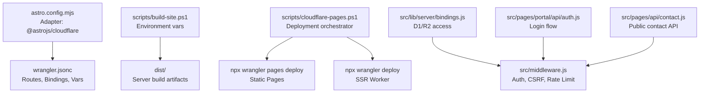
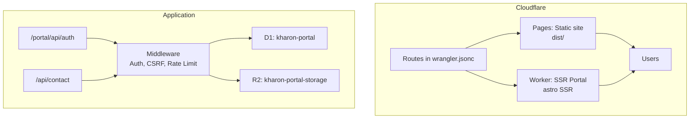
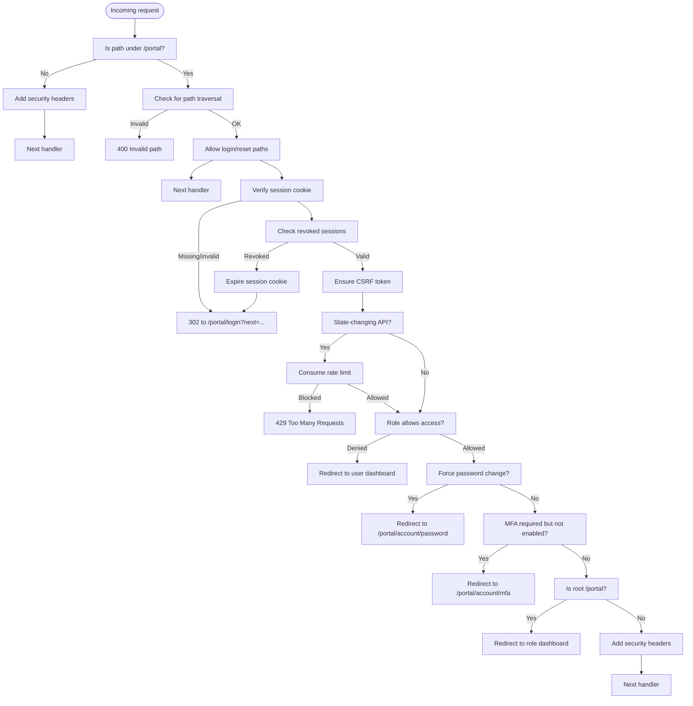
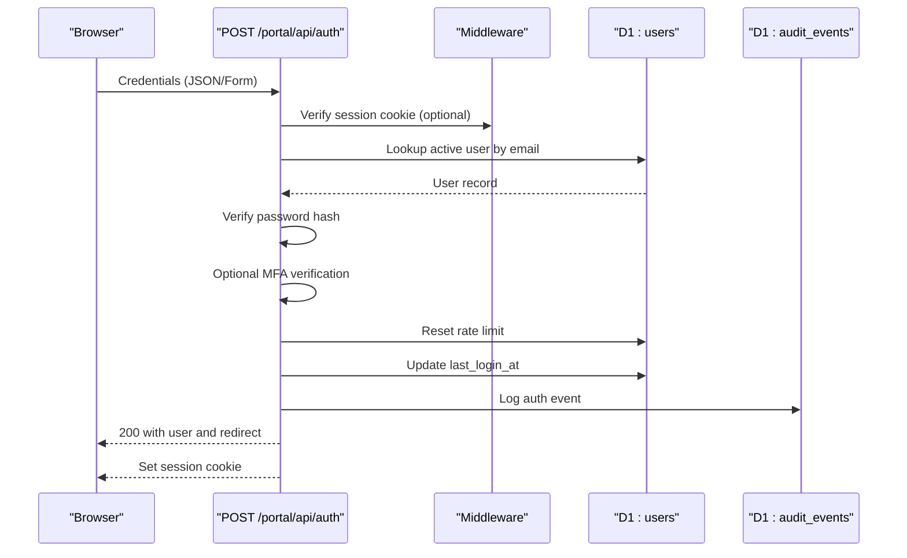
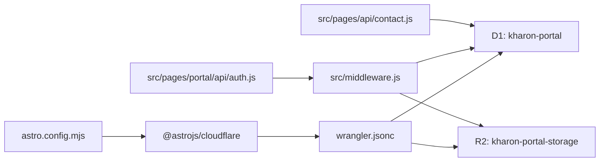

# Cloudflare Deployment

<cite>
**Referenced Files in This Document**
- [wrangler.jsonc](file://wrangler.jsonc)
- [astro.config.mjs](file://astro.config.mjs)
- [package.json](file://package.json)
- [scripts/cloudflare-pages.ps1](file://scripts/cloudflare-pages.ps1)
- [scripts/build-site.ps1](file://scripts/build-site.ps1)
- [docs/roadmap/DEPLOYMENT_RUNBOOK.md](file://docs/roadmap/DEPLOYMENT_RUNBOOK.md)
- [src/lib/server/bindings.js](file://src/lib/server/bindings.js)
- [src/middleware.js](file://src/middleware.js)
- [src/lib/server/auth.js](file://src/lib/server/auth.js)
- [src/pages/api/contact.js](file://src/pages/api/contact.js)
- [src/pages/portal/api/auth.js](file://src/pages/portal/api/auth.js)
- [schema.sql](file://schema.sql)
</cite>

## Table of Contents
1. [Introduction](#introduction)
2. [Project Structure](#project-structure)
3. [Core Components](#core-components)
4. [Architecture Overview](#architecture-overview)
5. [Detailed Component Analysis](#detailed-component-analysis)
6. [Dependency Analysis](#dependency-analysis)
7. [Performance Considerations](#performance-considerations)
8. [Troubleshooting Guide](#troubleshooting-guide)
9. [Conclusion](#conclusion)
10. [Appendices](#appendices)

## Introduction
This document provides end-to-end Cloudflare deployment guidance for the Astro-based portal backend. It covers configuration via wrangler.jsonc, the difference between static Cloudflare Pages and SSR Worker deployments, domain and route management, authentication and session handling, D1 database and R2 storage bindings, and step-by-step deployment from staging to production. It also includes practical commands, environment setup, and troubleshooting tips.

## Project Structure
The project uses Astro with the Cloudflare adapter for SSR on Cloudflare’s serverless platform. The deployment configuration is centralized in wrangler.jsonc, while build and deployment orchestration is handled by npm scripts and PowerShell helpers.

**Diagram sources**
- [astro.config.mjs:1-21](file://astro.config.mjs#L1-L21)
- [wrangler.jsonc:1-38](file://wrangler.jsonc#L1-L38)
- [scripts/build-site.ps1:1-22](file://scripts/build-site.ps1#L1-L22)
- [scripts/cloudflare-pages.ps1:1-122](file://scripts/cloudflare-pages.ps1#L1-L122)
- [src/lib/server/bindings.js:1-42](file://src/lib/server/bindings.js#L1-L42)
- [src/middleware.js:1-214](file://src/middleware.js#L1-L214)
- [src/pages/portal/api/auth.js:1-171](file://src/pages/portal/api/auth.js#L1-L171)
- [src/pages/api/contact.js:1-116](file://src/pages/api/contact.js#L1-L116)

**Section sources**
- [astro.config.mjs:1-21](file://astro.config.mjs#L1-L21)
- [wrangler.jsonc:1-38](file://wrangler.jsonc#L1-L38)
- [scripts/build-site.ps1:1-22](file://scripts/build-site.ps1#L1-L22)
- [scripts/cloudflare-pages.ps1:1-122](file://scripts/cloudflare-pages.ps1#L1-L122)

## Core Components
- wrangler.jsonc: Defines the Cloudflare Worker application name, compatibility date, routes, D1 database binding, R2 bucket binding, and runtime variables.
- Astro configuration: Uses the Cloudflare adapter with a custom config path and persistent state for SSR.
- Deployment scripts: PowerShell orchestration for Pages vs Worker deployments, OAuth login, domain checks, and preview/production flows.
- Server-side bindings: Access to D1 and R2 via Cloudflare env bindings with runtime validation.
- Middleware: Enforces security headers, session verification, CSRF tokens, MFA gating, and rate limits for portal routes.
- Authentication and APIs: Login endpoint validates credentials, enforces MFA, sets session cookies, and audits events; public contact form is rate-limited and persisted to D1.

**Section sources**
- [wrangler.jsonc:1-38](file://wrangler.jsonc#L1-L38)
- [astro.config.mjs:1-21](file://astro.config.mjs#L1-L21)
- [scripts/cloudflare-pages.ps1:1-122](file://scripts/cloudflare-pages.ps1#L1-L122)
- [src/lib/server/bindings.js:1-42](file://src/lib/server/bindings.js#L1-L42)
- [src/middleware.js:1-214](file://src/middleware.js#L1-L214)
- [src/pages/portal/api/auth.js:1-171](file://src/pages/portal/api/auth.js#L1-L171)
- [src/pages/api/contact.js:1-116](file://src/pages/api/contact.js#L1-L116)

## Architecture Overview
The portal runs as an SSR Worker on Cloudflare. Static assets and public pages are served via Cloudflare Pages, while authenticated portal routes are handled by the Worker. Routes are configured in wrangler.jsonc to direct traffic to the Worker for portal domains and to Pages for static content.

**Diagram sources**
- [wrangler.jsonc:5-18](file://wrangler.jsonc#L5-L18)
- [src/middleware.js:110-213](file://src/middleware.js#L110-L213)
- [src/pages/portal/api/auth.js:36-166](file://src/pages/portal/api/auth.js#L36-L166)
- [src/pages/api/contact.js:40-115](file://src/pages/api/contact.js#L40-L115)

## Detailed Component Analysis

### wrangler.jsonc Configuration
- Application identity and compatibility: name and compatibility date align with Astro 6 and Cloudflare runtime.
- Routes: Three host patterns routed to the Worker for portal functionality and static content.
- D1 binding: DB bound to kharon-portal with migrations directory.
- R2 binding: STORAGE bound to kharon-portal-storage.
- Runtime variables: SESSION_COOKIE_NAME and STANDARD_SERVICE_FEE.

Operational notes:
- Routes must match the active custom domains in Cloudflare.
- D1 and R2 bindings must be provisioned and attached to the Worker application.

**Section sources**
- [wrangler.jsonc:1-38](file://wrangler.jsonc#L1-L38)

### Astro SSR Adapter and Build
- Adapter: @astrojs/cloudflare with configPath pointing to wrangler.jsonc.
- Output: Server-side rendering build for Cloudflare Workers.
- Tailwind plugin and chunk size tuning included.

Build-time environment variables:
- PUBLIC_SITE_URL and PUBLIC_PORTAL_URL drive canonical URLs and portal links.
- PUBLIC_CONTACT_EMAIL controls contact form notifications.

**Section sources**
- [astro.config.mjs:1-21](file://astro.config.mjs#L1-L21)
- [scripts/build-site.ps1:10-18](file://scripts/build-site.ps1#L10-L18)

### Deployment Orchestration (PowerShell)
The script supports:
- OAuth login and identity verification.
- Project creation and listing.
- Domain listing and retry logic for portal domain validation.
- Preview deployment to Pages or Worker depending on build artifacts.
- Production deployment to Pages or Worker based on presence of a worker config.

Key behaviors:
- Ignores stale CLOUDFLARE_API_TOKEN for OAuth flows.
- Uses dist/server/wrangler.json if present for Worker deployment.
- Otherwise defaults to Pages deployment with project and branch targeting.

**Section sources**
- [scripts/cloudflare-pages.ps1:1-122](file://scripts/cloudflare-pages.ps1#L1-L122)

### Server Bindings and Secrets
- D1 binding: DB must be configured; missing binding throws an error.
- R2 binding: STORAGE must be configured; missing binding throws an error.
- Standard service fee: read from env with fallback.

Runtime safety:
- Early validation prevents accidental misconfiguration.

**Section sources**
- [src/lib/server/bindings.js:1-42](file://src/lib/server/bindings.js#L1-L42)

### Middleware: Authentication, CSRF, Rate Limits, and Security Headers
Responsibilities:
- Enforce security headers on all portal requests.
- Verify session cookie and block revoked tokens.
- Redirect unauthenticated users to login with next param.
- Enforce role-based access to portal subpaths.
- Generate and validate CSRF tokens.
- Apply granular rate limits for portal API endpoints.
- Redirect to role-specific dashboards and enforce MFA gating.

**Diagram sources**
- [src/middleware.js:110-213](file://src/middleware.js#L110-L213)

**Section sources**
- [src/middleware.js:1-214](file://src/middleware.js#L1-L214)

### Authentication Flow
- Accepts JSON or form-encoded credentials.
- Enforces rate limiting per email.
- Verifies password hash and optional MFA.
- Creates session token with HMAC signature and sets a secure cookie.
- Audits login attempts and redirects to appropriate dashboard.

**Diagram sources**
- [src/pages/portal/api/auth.js:36-166](file://src/pages/portal/api/auth.js#L36-L166)
- [src/middleware.js:125-142](file://src/middleware.js#L125-L142)
- [src/lib/server/auth.js:48-108](file://src/lib/server/auth.js#L48-L108)

**Section sources**
- [src/pages/portal/api/auth.js:1-171](file://src/pages/portal/api/auth.js#L1-L171)
- [src/lib/server/auth.js:1-217](file://src/lib/server/auth.js#L1-L217)

### Public Contact API
- Validates request body and request type.
- Computes IP hash for rate limiting.
- Inserts contact submission into D1.
- Returns JSON responses with appropriate status codes.

**Section sources**
- [src/pages/api/contact.js:1-116](file://src/pages/api/contact.js#L1-L116)

### Database Schema and Migrations
- Full schema and indexes are defined in schema.sql.
- Migrations directory contains incremental upgrades.
- Apply schema first for a fresh database; apply pending migrations sequentially for upgrades.

**Section sources**
- [schema.sql:1-245](file://schema.sql#L1-L245)
- [docs/roadmap/DEPLOYMENT_RUNBOOK.md:186-224](file://docs/roadmap/DEPLOYMENT_RUNBOOK.md#L186-L224)

## Dependency Analysis
- Astro build depends on the Cloudflare adapter and wrangler.jsonc for SSR configuration.
- Worker runtime depends on D1 and R2 bindings being present.
- Middleware depends on authentication utilities and rate-limiting logic.
- Public APIs depend on D1 for persistence and rate limiting.

**Diagram sources**
- [astro.config.mjs:1-21](file://astro.config.mjs#L1-L21)
- [wrangler.jsonc:19-32](file://wrangler.jsonc#L19-L32)
- [src/middleware.js:1-214](file://src/middleware.js#L1-L214)
- [src/pages/portal/api/auth.js:1-171](file://src/pages/portal/api/auth.js#L1-L171)
- [src/pages/api/contact.js:1-116](file://src/pages/api/contact.js#L1-L116)

**Section sources**
- [astro.config.mjs:1-21](file://astro.config.mjs#L1-L21)
- [wrangler.jsonc:19-32](file://wrangler.jsonc#L19-L32)
- [src/middleware.js:1-214](file://src/middleware.js#L1-L214)
- [src/pages/portal/api/auth.js:1-171](file://src/pages/portal/api/auth.js#L1-L171)
- [src/pages/api/contact.js:1-116](file://src/pages/api/contact.js#L1-L116)

## Performance Considerations
- Keep build chunk sizes reasonable; adjust Vite chunkSizeWarningLimit if needed.
- Use D1 indexes strategically to optimize frequent queries (users, jobs, audit logs).
- Prefer R2 for large assets; keep ephemeral data in D1.
- Monitor rate-limit windows and adjust thresholds for portal APIs as usage grows.

## Troubleshooting Guide
Common issues and resolutions:
- OAuth login conflicts with API token: Clear CLOUDFLARE_API_TOKEN for the session before running OAuth login.
- Missing D1/R2 bindings: Ensure DB and STORAGE bindings are configured in wrangler.jsonc and attached to the Worker application.
- Stale Pages output on portal domains: Remove conflicting custom domains from Pages or add Worker routes/custom domains to the Worker deployment.
- Domain validation failures: Use the domains listing and retry helpers to re-validate portal domains.
- Preview vs production mismatch: Confirm whether dist/server/wrangler.json exists; if present, Worker deployment is used; otherwise Pages deployment is used.

Operational commands:
- Pre-deploy gate checklist and environment setup.
- Pages project lifecycle: create, list, domains.
- OAuth login and identity verification.
- Preview and production deployment flows.

**Section sources**
- [docs/roadmap/DEPLOYMENT_RUNBOOK.md:38-64](file://docs/roadmap/DEPLOYMENT_RUNBOOK.md#L38-L64)
- [docs/roadmap/DEPLOYMENT_RUNBOOK.md:65-112](file://docs/roadmap/DEPLOYMENT_RUNBOOK.md#L65-L112)
- [scripts/cloudflare-pages.ps1:14-17](file://scripts/cloudflare-pages.ps1#L14-L17)
- [scripts/cloudflare-pages.ps1:58-121](file://scripts/cloudflare-pages.ps1#L58-L121)

## Conclusion
This guide outlines a complete Cloudflare deployment workflow for the Astro portal backend. By configuring wrangler.jsonc, managing routes and bindings, and leveraging the provided scripts, teams can reliably deploy previews and promote to production. The middleware and APIs enforce strong security and operational controls, while D1 and R2 provide robust persistence.

## Appendices

### Step-by-Step Deployment Workflow
- Pre-deploy gate: Install dependencies, build staging, audit, verify Wrangler version, and check identity and projects.
- Create or confirm the Cloudflare application and configure build settings.
- Authenticate via OAuth; avoid stale API tokens for OAuth flows.
- Deploy preview: Build staging and deploy to Pages or Worker depending on artifacts.
- Validate security headers, redirects, and portal routing.
- Attach domains: Add www, apex, and portal subdomains to the Worker application.
- Deploy production: Build staging and deploy to Pages or Worker; confirm branch targeting.
- Post-deploy checks: Verify canonical domains, portal authentication, and public contact flow.

**Section sources**
- [docs/roadmap/DEPLOYMENT_RUNBOOK.md:38-112](file://docs/roadmap/DEPLOYMENT_RUNBOOK.md#L38-L112)

### Static Pages vs SSR Worker Differences
- Static Pages: Ideal for marketing pages and public content; uses dist/ and Pages routing.
- SSR Worker: Required for authenticated portal routes; uses Astro SSR and Cloudflare Worker runtime.
- Route management: Configure wrangler.jsonc routes to direct portal traffic to the Worker and static traffic to Pages.

**Section sources**
- [docs/roadmap/DEPLOYMENT_RUNBOOK.md:67-76](file://docs/roadmap/DEPLOYMENT_RUNBOOK.md#L67-L76)
- [wrangler.jsonc:5-18](file://wrangler.jsonc#L5-L18)

### Domain Management and SSL
- Custom domains: Attach www, apex, and portal subdomains to the Worker application.
- Redirects: Use Cloudflare Redirect Rules for apex/www canonical forwarding; avoid Pages _redirects for host-level rules.
- SSL: Managed by Cloudflare; ensure DNS records point to the correct targets.

**Section sources**
- [docs/roadmap/DEPLOYMENT_RUNBOOK.md:113-121](file://docs/roadmap/DEPLOYMENT_RUNBOOK.md#L113-L121)
- [docs/roadmap/DEPLOYMENT_RUNBOOK.md:161-169](file://docs/roadmap/DEPLOYMENT_RUNBOOK.md#L161-L169)

### Environment Setup and Commands
- Build targets: staging and production set PUBLIC_SITE_URL, PUBLIC_PORTAL_URL, and PUBLIC_CONTACT_EMAIL.
- Scripts: npm run build:staging and build:production:kharon; preview and production deployment via npm run deploy:cloudflare and deploy:cloudflare:preview.
- OAuth: npm run auth:cloudflare; identity checks via npm run cloudflare:whoami.

**Section sources**
- [scripts/build-site.ps1:10-18](file://scripts/build-site.ps1#L10-L18)
- [package.json:10-32](file://package.json#L10-L32)
- [scripts/cloudflare-pages.ps1:68-77](file://scripts/cloudflare-pages.ps1#L68-L77)

### D1 and R2 Configuration
- D1 binding: DB connected to kharon-portal; apply schema and migrations before deploying.
- R2 binding: STORAGE for job evidence and job cards; ensure bucket permissions and CORS policies.
- Secrets: SESSION_SECRET must be configured for signed session tokens.

**Section sources**
- [wrangler.jsonc:19-32](file://wrangler.jsonc#L19-L32)
- [src/lib/server/bindings.js:1-42](file://src/lib/server/bindings.js#L1-L42)
- [src/lib/server/auth.js:34-40](file://src/lib/server/auth.js#L34-L40)