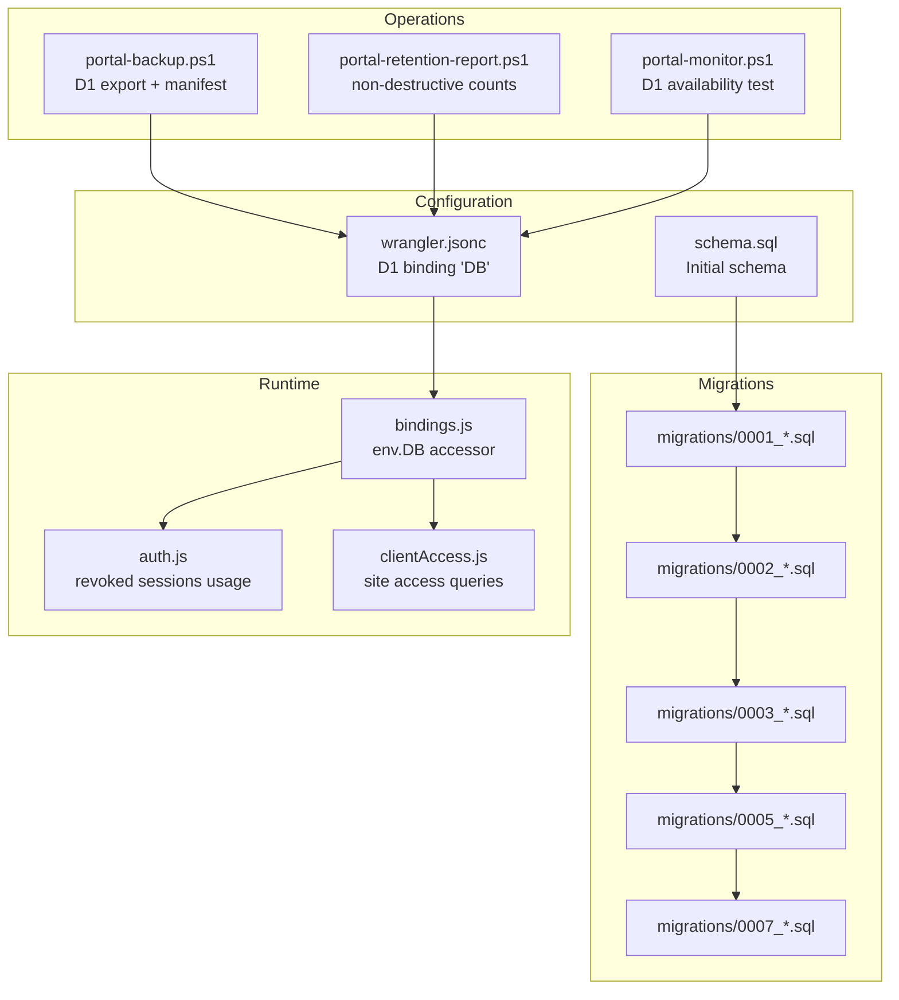
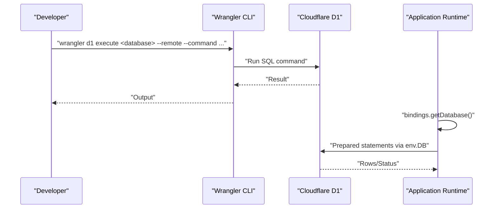
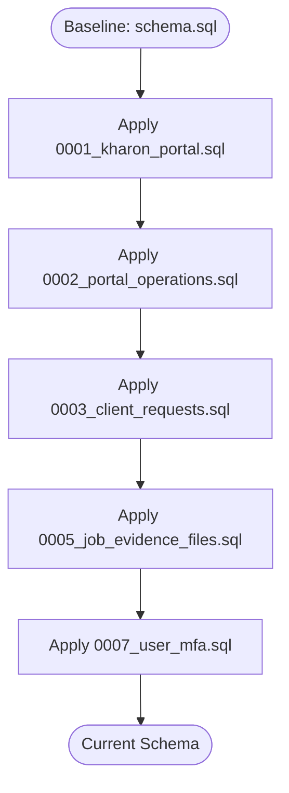
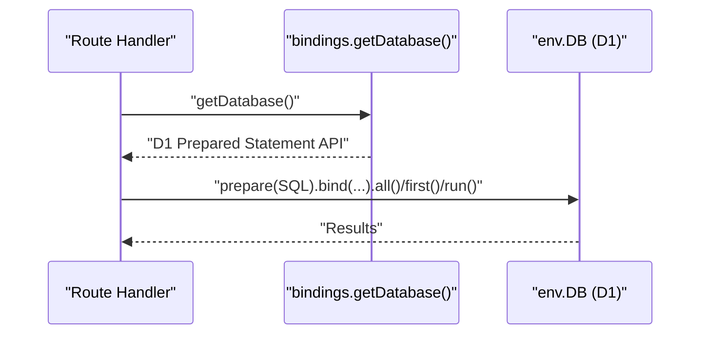
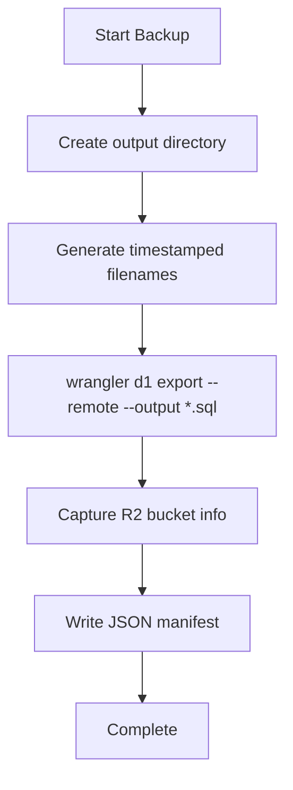
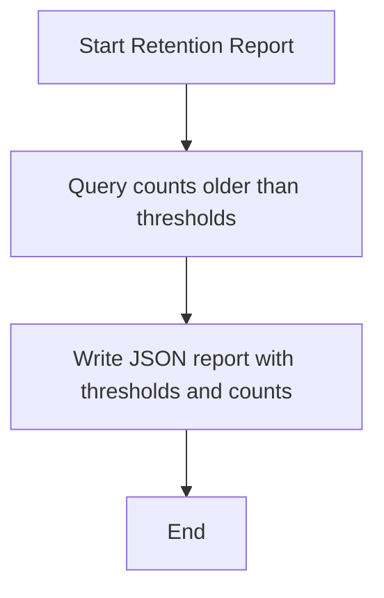
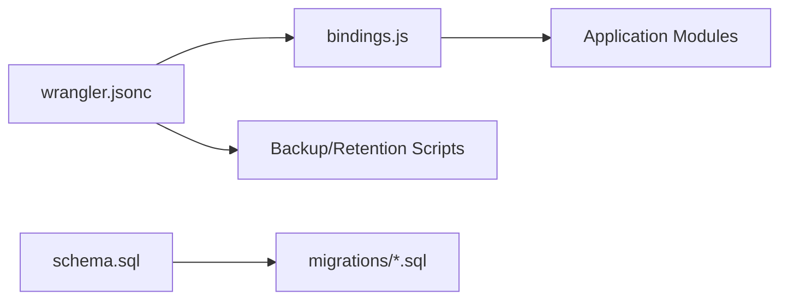

# Database Management

<cite>
**Referenced Files in This Document**
- [schema.sql](file://schema.sql)
- [wrangler.jsonc](file://wrangler.jsonc)
- [portal-backup.ps1](file://scripts/portal-backup.ps1)
- [portal-retention-report.ps1](file://scripts/portal-retention-report.ps1)
- [bindings.js](file://src/lib/server/bindings.js)
- [auth.js](file://src/lib/server/auth.js)
- [clientAccess.js](file://src/lib/server/clientAccess.js)
- [0001_kharon_portal.sql](file://migrations/0001_kharon_portal.sql)
- [0002_portal_operations.sql](file://migrations/0002_portal_operations.sql)
- [0003_client_requests.sql](file://migrations/0003_client_requests.sql)
- [0005_job_evidence_files.sql](file://migrations/0005_job_evidence_files.sql)
- [0007_user_mfa.sql](file://migrations/0007_user_mfa.sql)
- [portal-monitor.ps1](file://scripts/portal-monitor.ps1)
</cite>

## Table of Contents
1. [Introduction](#introduction)
2. [Project Structure](#project-structure)
3. [Core Components](#core-components)
4. [Architecture Overview](#architecture-overview)
5. [Detailed Component Analysis](#detailed-component-analysis)
6. [Dependency Analysis](#dependency-analysis)
7. [Performance Considerations](#performance-considerations)
8. [Troubleshooting Guide](#troubleshooting-guide)
9. [Conclusion](#conclusion)
10. [Appendices](#appendices)

## Introduction
This document provides comprehensive database management guidance for the project’s Cloudflare D1-backed backend. It covers schema definition, migration management, bindings configuration, connection patterns, migration execution for local and remote environments, backup and retention procedures, and operational best practices. It also explains how the initial schema in schema.sql relates to the migration suite and outlines the correct initialization sequence.

## Project Structure
The database-related assets are organized as follows:
- Initial schema: schema.sql defines the baseline schema and triggers.
- Migration suite: migrations/<version>_...sql files implement incremental changes.
- Wrangler configuration: wrangler.jsonc declares the D1 database binding and migration directory.
- Backup and retention scripts: PowerShell scripts under scripts/ handle D1 exports and retention reporting.
- Application bindings: src/lib/server/bindings.js exposes the D1 binding to application code.
- Operational monitoring: scripts/portal-monitor.ps1 validates D1 availability via Wrangler.

**Diagram sources**
- [wrangler.jsonc](file://wrangler.jsonc)
- [schema.sql](file://schema.sql)
- [0001_kharon_portal.sql](file://migrations/0001_kharon_portal.sql)
- [0002_portal_operations.sql](file://migrations/0002_portal_operations.sql)
- [0003_client_requests.sql](file://migrations/0003_client_requests.sql)
- [0005_job_evidence_files.sql](file://migrations/0005_job_evidence_files.sql)
- [0007_user_mfa.sql](file://migrations/0007_user_mfa.sql)
- [bindings.js](file://src/lib/server/bindings.js)
- [auth.js](file://src/lib/server/auth.js)
- [clientAccess.js](file://src/lib/server/clientAccess.js)
- [portal-backup.ps1](file://scripts/portal-backup.ps1)
- [portal-retention-report.ps1](file://scripts/portal-retention-report.ps1)
- [portal-monitor.ps1](file://scripts/portal-monitor.ps1)

**Section sources**
- [wrangler.jsonc](file://wrangler.jsonc)
- [schema.sql](file://schema.sql)
- [migrations/0001_kharon_portal.sql](file://migrations/0001_kharon_portal.sql)
- [migrations/0002_portal_operations.sql](file://migrations/0002_portal_operations.sql)
- [migrations/0003_client_requests.sql](file://migrations/0003_client_requests.sql)
- [migrations/0005_job_evidence_files.sql](file://migrations/0005_job_evidence_files.sql)
- [migrations/0007_user_mfa.sql](file://migrations/0007_user_mfa.sql)
- [bindings.js](file://src/lib/server/bindings.js)
- [portal-backup.ps1](file://scripts/portal-backup.ps1)
- [portal-retention-report.ps1](file://scripts/portal-retention-report.ps1)
- [portal-monitor.ps1](file://scripts/portal-monitor.ps1)

## Core Components
- D1 database binding and migrations:
  - The D1 database is bound as DB in wrangler.jsonc with a migrations directory set to migrations/.
  - The binding associates a logical database name with a Cloudflare-provisioned D1 database.
- Initial schema:
  - schema.sql defines the baseline schema and includes triggers for automatic updated_at timestamps.
- Migration system:
  - Incremental migrations are applied in order by versioned files under migrations/.
  - Each migration file encapsulates schema changes and related indexes/triggers.
- Application bindings:
  - bindings.js provides safe accessors for env.DB and env.STORAGE, throwing explicit errors if bindings are missing.
- Operational scripts:
  - portal-backup.ps1 exports the D1 database to SQL and writes a JSON manifest.
  - portal-retention-report.ps1 queries counts for data older than policy thresholds without modifying data.
  - portal-monitor.ps1 tests D1 availability via Wrangler.

**Section sources**
- [wrangler.jsonc](file://wrangler.jsonc)
- [schema.sql](file://schema.sql)
- [bindings.js](file://src/lib/server/bindings.js)
- [portal-backup.ps1](file://scripts/portal-backup.ps1)
- [portal-retention-report.ps1](file://scripts/portal-retention-report.ps1)
- [portal-monitor.ps1](file://scripts/portal-monitor.ps1)

## Architecture Overview
The runtime architecture ties configuration, schema, migrations, and application code together:

**Diagram sources**
- [wrangler.jsonc](file://wrangler.jsonc)
- [bindings.js](file://src/lib/server/bindings.js)
- [portal-monitor.ps1](file://scripts/portal-monitor.ps1)

## Detailed Component Analysis

### Schema Definition and Relationship to Migrations
- schema.sql establishes the initial schema and includes triggers for automatic updated_at updates on several tables.
- The migration files represent incremental changes applied after the initial schema:
  - 0001 adds the foundational tables and initial indexes/triggers.
  - Subsequent migrations introduce new tables (e.g., maintenance_requests, job_evidence_files), alter existing tables (e.g., adding MFA columns), and add supporting indexes/triggers.
- The relationship:
  - schema.sql is the authoritative baseline snapshot.
  - migrations/<version>.sql files are applied in ascending numeric order to evolve the schema from the baseline.

**Diagram sources**
- [schema.sql](file://schema.sql)
- [migrations/0001_kharon_portal.sql](file://migrations/0001_kharon_portal.sql)
- [migrations/0002_portal_operations.sql](file://migrations/0002_portal_operations.sql)
- [migrations/0003_client_requests.sql](file://migrations/0003_client_requests.sql)
- [migrations/0005_job_evidence_files.sql](file://migrations/0005_job_evidence_files.sql)
- [migrations/0007_user_mfa.sql](file://migrations/0007_user_mfa.sql)

**Section sources**
- [schema.sql](file://schema.sql)
- [migrations/0001_kharon_portal.sql](file://migrations/0001_kharon_portal.sql)
- [migrations/0002_portal_operations.sql](file://migrations/0002_portal_operations.sql)
- [migrations/0003_client_requests.sql](file://migrations/0003_client_requests.sql)
- [migrations/0005_job_evidence_files.sql](file://migrations/0005_job_evidence_files.sql)
- [migrations/0007_user_mfa.sql](file://migrations/0007_user_mfa.sql)

### Database Bindings and Application Connections
- The D1 binding is named DB in wrangler.jsonc and is accessed via env.DB in the application.
- bindings.js provides:
  - getDatabase(): returns env.DB with a guard against missing bindings.
  - getBindings(): returns { db, storage, env } with similar guards.
- Typical usage:
  - Import getDatabase() in route handlers or server modules.
  - Use prepared statements for all queries to prevent injection and leverage D1’s statement caching.

**Diagram sources**
- [wrangler.jsonc](file://wrangler.jsonc)
- [bindings.js](file://src/lib/server/bindings.js)

**Section sources**
- [wrangler.jsonc](file://wrangler.jsonc)
- [bindings.js](file://src/lib/server/bindings.js)

### Migration Execution (Local vs Remote)
- Local development:
  - Use Wrangler to apply migrations to a local preview or a named D1 database.
  - The migrations directory is configured in wrangler.jsonc under d1_databases[].migrations_dir.
- Remote deployment:
  - Wrangler applies migrations automatically when pushing to Cloudflare Workers using the configured binding and migrations_dir.
- Rollback procedures:
  - D1 migrations are applied incrementally; there is no built-in rollback command in this repository.
  - To “undo” a migration, create a new migration that reverses the schema change (e.g., drop indexes, revert column alterations, or remove tables).
  - Alternatively, re-initialize the database to a known-good migration version by re-applying earlier migrations and skipping newer ones.

Practical steps (conceptual):
- Identify the target migration version.
- Apply migrations up to that version using Wrangler commands aligned with the configured binding and migrations_dir.
- Verify schema and indexes using D1 inspection commands.

**Section sources**
- [wrangler.jsonc](file://wrangler.jsonc)

### Backup and Restore Procedures
- Backup:
  - portal-backup.ps1 exports the D1 database to an SQL file and writes a JSON manifest with metadata.
  - The script uses Wrangler D1 export with remote database targeting and captures R2 bucket info for context.
- Restore:
  - The repository does not include a dedicated restore script.
  - To restore from a prior export, use Wrangler D1 import against the target database and migrations directory.
  - After restore, ensure migrations are reapplied to reach the current schema version.

**Diagram sources**
- [portal-backup.ps1](file://scripts/portal-backup.ps1)
- [wrangler.jsonc](file://wrangler.jsonc)

**Section sources**
- [portal-backup.ps1](file://scripts/portal-backup.ps1)
- [wrangler.jsonc](file://wrangler.jsonc)

### Retention Policies and Data Lifecycle Management
- Non-destructive retention reporting:
  - portal-retention-report.ps1 queries counts of records older than policy thresholds and writes a JSON report.
  - Thresholds include jobcards, financial records, maintenance requests, audit events, password reset tokens, and rate limit rows.
- Data lifecycle:
  - Use the retention report to inform decisions about archival or deletion.
  - The report explicitly warns that it does not modify data and that legal holds override thresholds.
- R2 considerations:
  - The retention script checks R2 bucket availability and notes that prefix-level retention reviews require additional credentials and approved tools.

**Diagram sources**
- [portal-retention-report.ps1](file://scripts/portal-retention-report.ps1)

**Section sources**
- [portal-retention-report.ps1](file://scripts/portal-retention-report.ps1)

### Operational Monitoring
- Availability check:
  - portal-monitor.ps1 executes a simple SELECT COUNT(*) against the users table on the remote D1 database via Wrangler.
  - It reports pass/fail and includes captured output for diagnostics.

**Section sources**
- [portal-monitor.ps1](file://scripts/portal-monitor.ps1)

### Practical Examples

- Applying migrations:
  - Use Wrangler commands to execute SQL against the configured D1 database and migrations directory.
  - Ensure the environment targets the correct database name and uses the remote flag for production-like testing.

- Managing database connections:
  - Retrieve the D1 binding via bindings.getDatabase() in route handlers.
  - Use prepared statements for all queries to ensure safety and performance.

- Troubleshooting database issues:
  - Confirm D1 availability using portal-monitor.ps1.
  - Validate that the DB binding is present in the environment and that bindings.getDatabase() is being called correctly.
  - Inspect schema and indexes by exporting the database with portal-backup.ps1 and reviewing the generated SQL.

**Section sources**
- [bindings.js](file://src/lib/server/bindings.js)
- [portal-monitor.ps1](file://scripts/portal-monitor.ps1)
- [portal-backup.ps1](file://scripts/portal-backup.ps1)

## Dependency Analysis
- Configuration-to-runtime:
  - wrangler.jsonc configures the D1 binding and migrations_dir.
  - bindings.js depends on env.DB being present.
- Schema-to-migrations:
  - schema.sql is the baseline; migrations/<version>.sql files depend on it and on each other in order.
- Application-to-database:
  - Application modules (e.g., auth.js, clientAccess.js) depend on env.DB for prepared statements.
- Operations-to-configuration:
  - Backup and retention scripts depend on the database name configured in wrangler.jsonc.

**Diagram sources**
- [wrangler.jsonc](file://wrangler.jsonc)
- [schema.sql](file://schema.sql)
- [bindings.js](file://src/lib/server/bindings.js)
- [migrations/0001_kharon_portal.sql](file://migrations/0001_kharon_portal.sql)
- [migrations/0002_portal_operations.sql](file://migrations/0002_portal_operations.sql)
- [migrations/0003_client_requests.sql](file://migrations/0003_client_requests.sql)
- [migrations/0005_job_evidence_files.sql](file://migrations/0005_job_evidence_files.sql)
- [migrations/0007_user_mfa.sql](file://migrations/0007_user_mfa.sql)

**Section sources**
- [wrangler.jsonc](file://wrangler.jsonc)
- [schema.sql](file://schema.sql)
- [bindings.js](file://src/lib/server/bindings.js)
- [migrations/0001_kharon_portal.sql](file://migrations/0001_kharon_portal.sql)
- [migrations/0002_portal_operations.sql](file://migrations/0002_portal_operations.sql)
- [migrations/0003_client_requests.sql](file://migrations/0003_client_requests.sql)
- [migrations/0005_job_evidence_files.sql](file://migrations/0005_job_evidence_files.sql)
- [migrations/0007_user_mfa.sql](file://migrations/0007_user_mfa.sql)

## Performance Considerations
- Indexes:
  - Migrations add targeted indexes to optimize common query patterns (e.g., status filters, date ranges, foreign keys).
- Triggers:
  - Automatic updated_at triggers reduce application logic but incur write overhead; ensure they align with update frequency.
- Prepared statements:
  - Using prepared statements improves performance and reduces parsing overhead in repeated queries.

[No sources needed since this section provides general guidance]

## Troubleshooting Guide
- Missing D1 binding:
  - bindings.getDatabase() throws if env.DB is absent; verify wrangler.jsonc configuration and deployment environment.
- Migration failures:
  - Review the specific migration file and ensure prerequisites (e.g., referenced tables/columns) exist.
  - For rollbacks, author a compensating migration rather than relying on a built-in rollback.
- Backup/restore:
  - Use portal-backup.ps1 to export the database; confirm the manifest and exported SQL.
  - For restore, use Wrangler D1 import against the configured database and re-apply migrations.
- Availability checks:
  - Run portal-monitor.ps1 to validate connectivity and basic query capability.

**Section sources**
- [bindings.js](file://src/lib/server/bindings.js)
- [wrangler.jsonc](file://wrangler.jsonc)
- [portal-backup.ps1](file://scripts/portal-backup.ps1)
- [portal-monitor.ps1](file://scripts/portal-monitor.ps1)

## Conclusion
The project’s database management relies on a clear separation between the initial schema (schema.sql) and a well-ordered migration suite (migrations/). Wrangler configuration binds the D1 database and its migrations directory, while bindings.js centralizes access to the DB binding. Operational scripts support backup, retention reporting, and availability checks. Adhering to the migration sequence and using prepared statements ensures reliable and maintainable database operations.

[No sources needed since this section summarizes without analyzing specific files]

## Appendices

### Initialization Sequence
- Initialize the database using the configured D1 binding and migrations directory.
- Apply migrations in ascending order from 0001 to the latest version.
- Verify schema and indexes using the backup script or Wrangler D1 inspection commands.

**Section sources**
- [wrangler.jsonc](file://wrangler.jsonc)
- [schema.sql](file://schema.sql)
- [migrations/0001_kharon_portal.sql](file://migrations/0001_kharon_portal.sql)
- [migrations/0002_portal_operations.sql](file://migrations/0002_portal_operations.sql)
- [migrations/0003_client_requests.sql](file://migrations/0003_client_requests.sql)
- [migrations/0005_job_evidence_files.sql](file://migrations/0005_job_evidence_files.sql)
- [migrations/0007_user_mfa.sql](file://migrations/0007_user_mfa.sql)