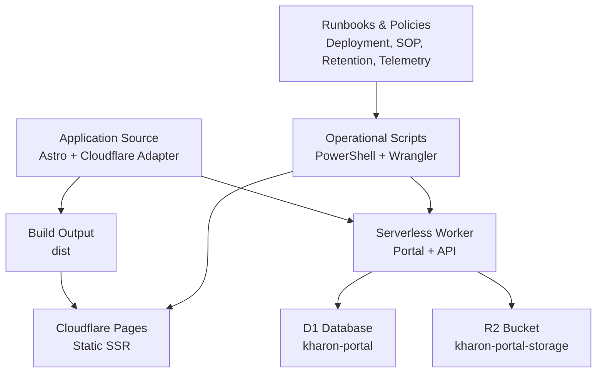
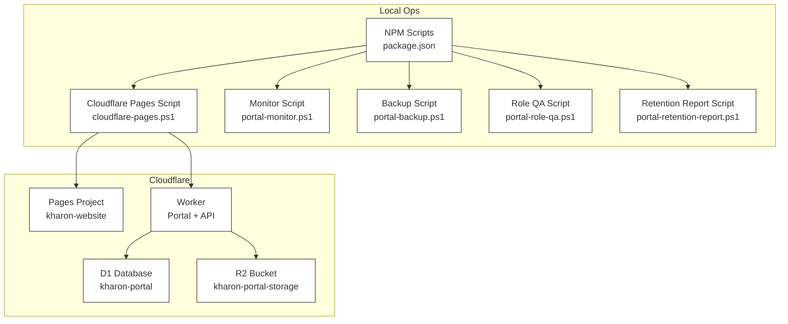
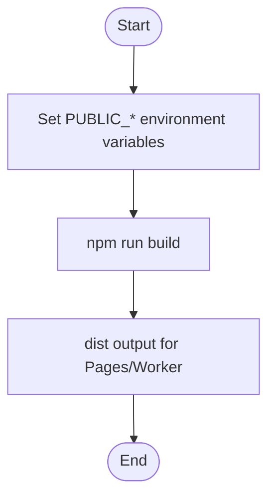
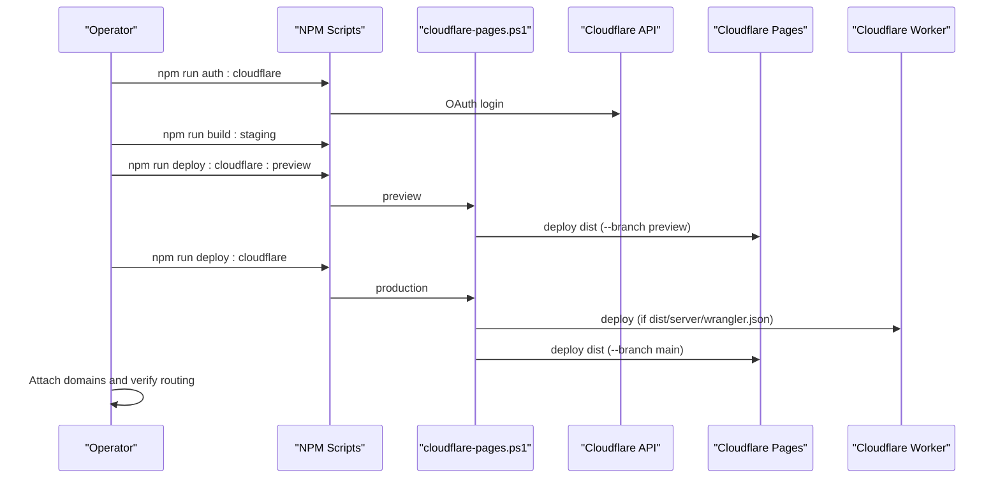
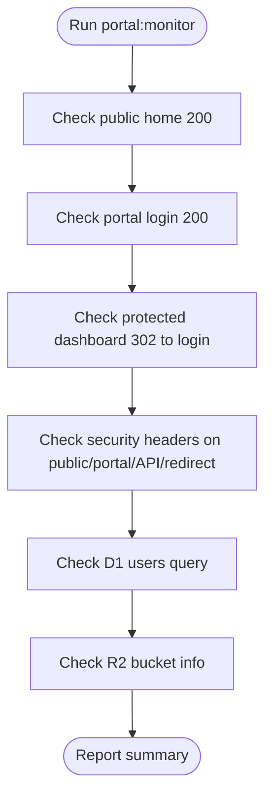
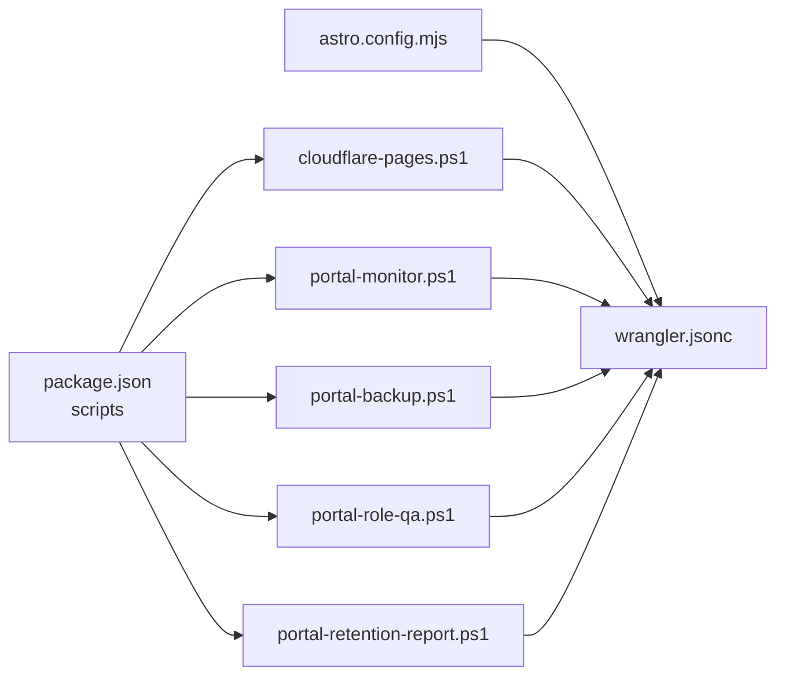

# Deployment & Operations

<cite>
**Referenced Files in This Document**
- [README.md](file://README.md)
- [DEPLOYMENT_RUNBOOK.md](file://docs/roadmap/DEPLOYMENT_RUNBOOK.md)
- [OPERATIONS_SOP.md](file://docs/roadmap/OPERATIONS_SOP.md)
- [HARDENING_AUDIT.md](file://docs/roadmap/HARDENING_AUDIT.md)
- [ERROR_TELEMETRY_POLICY.md](file://docs/roadmap/ERROR_TELEMETRY_POLICY.md)
- [DATA_RETENTION_POLICY.md](file://docs/roadmap/DATA_RETENTION_POLICY.md)
- [package.json](file://package.json)
- [astro.config.mjs](file://astro.config.mjs)
- [wrangler.jsonc](file://wrangler.jsonc)
- [cloudflare-pages.ps1](file://scripts/cloudflare-pages.ps1)
- [build-site.ps1](file://scripts/build-site.ps1)
- [portal-monitor.ps1](file://scripts/portal-monitor.ps1)
- [portal-backup.ps1](file://scripts/portal-backup.ps1)
- [portal-role-qa.ps1](file://scripts/portal-role-qa.ps1)
- [portal-retention-report.ps1](file://scripts/portal-retention-report.ps1)
</cite>

## Table of Contents
1. [Introduction](#introduction)
2. [Project Structure](#project-structure)
3. [Core Components](#core-components)
4. [Architecture Overview](#architecture-overview)
5. [Detailed Component Analysis](#detailed-component-analysis)
6. [Dependency Analysis](#dependency-analysis)
7. [Performance Considerations](#performance-considerations)
8. [Troubleshooting Guide](#troubleshooting-guide)
9. [Conclusion](#conclusion)
10. [Appendices](#appendices)

## Introduction
This document provides comprehensive deployment and operations guidance for the Astro-based website and SSR portal hosted on Cloudflare Workers/Pages. It covers the CI/CD pipeline, environment configuration, staging and production workflows, build automation, preview deployments, rollback procedures, monitoring and alerting, backup and recovery, incident response, operational runbooks, maintenance procedures, performance optimization, security hardening, compliance, and disaster recovery planning.

## Project Structure
The repository is organized around:
- Application source and configuration for Astro and the Cloudflare adapter
- Operational scripts for Cloudflare deployment, monitoring, backups, and QA
- Operational runbooks and policies for deployment, monitoring, retention, and incident response

**Diagram sources**
- [astro.config.mjs:1-21](file://astro.config.mjs#L1-L21)
- [wrangler.jsonc:1-38](file://wrangler.jsonc#L1-L38)
- [cloudflare-pages.ps1:1-122](file://scripts/cloudflare-pages.ps1#L1-L122)

**Section sources**
- [README.md:1-51](file://README.md#L1-L51)
- [package.json:1-48](file://package.json#L1-L48)

## Core Components
- Build and configuration
  - Astro SSR build targeting Cloudflare with the Cloudflare adapter
  - Environment variables controlling site and portal URLs and contact email
- Cloudflare deployment
  - Pages project for static SSR hosting
  - Worker deployment for the portal and APIs
  - D1 and R2 bindings and migrations
- Operational scripts
  - Cloudflare authentication and project/domain management
  - Preview and production deployments
  - Monitoring, backup, retention reporting, and role QA
- Runbooks and policies
  - Deployment runbook, operations SOP, hardening audit, telemetry policy, and retention policy

**Section sources**
- [astro.config.mjs:1-21](file://astro.config.mjs#L1-L21)
- [wrangler.jsonc:1-38](file://wrangler.jsonc#L1-L38)
- [package.json:10-32](file://package.json#L10-L32)
- [cloudflare-pages.ps1:1-122](file://scripts/cloudflare-pages.ps1#L1-L122)
- [build-site.ps1:1-22](file://scripts/build-site.ps1#L1-L22)
- [portal-monitor.ps1:1-133](file://scripts/portal-monitor.ps1#L1-L133)
- [portal-backup.ps1:1-32](file://scripts/portal-backup.ps1#L1-L32)
- [portal-role-qa.ps1:1-291](file://scripts/portal-role-qa.ps1#L1-L291)
- [portal-retention-report.ps1:1-61](file://scripts/portal-retention-report.ps1#L1-L61)

## Architecture Overview
The system comprises:
- Static SSR site served via Cloudflare Pages
- SSR portal and APIs served via a Cloudflare Worker
- D1 for relational data and R2 for evidence storage
- Operational scripts orchestrate authentication, builds, deployments, and validations

**Diagram sources**
- [package.json:10-32](file://package.json#L10-L32)
- [cloudflare-pages.ps1:1-122](file://scripts/cloudflare-pages.ps1#L1-L122)
- [wrangler.jsonc:19-36](file://wrangler.jsonc#L19-L36)
- [portal-monitor.ps1:1-133](file://scripts/portal-monitor.ps1#L1-L133)
- [portal-backup.ps1:1-32](file://scripts/portal-backup.ps1#L1-L32)
- [portal-role-qa.ps1:1-291](file://scripts/portal-role-qa.ps1#L1-L291)
- [portal-retention-report.ps1:1-61](file://scripts/portal-retention-report.ps1#L1-L61)

## Detailed Component Analysis

### Build Automation and Environment Configuration
- Build targets
  - Static SSR output directory: dist
  - Build command: npm run build
  - Node engine requirement: >= 22.12.0
- Environment variables
  - PUBLIC_SITE_URL: canonical site URL
  - PUBLIC_PORTAL_URL: portal host URL
  - PUBLIC_CONTACT_EMAIL: contact email
- Targeted environments
  - Staging: PUBLIC_SITE_URL=https://www.tequit.co.za, PUBLIC_PORTAL_URL=https://portal.tequit.co.za
  - Production: PUBLIC_SITE_URL=https://www.kharon.co.za, PUBLIC_PORTAL_URL=https://portal.kharon.co.za

**Diagram sources**
- [build-site.ps1:10-22](file://scripts/build-site.ps1#L10-L22)
- [astro.config.mjs:5-20](file://astro.config.mjs#L5-L20)
- [README.md:21-27](file://README.md#L21-L27)

**Section sources**
- [README.md:17-27](file://README.md#L17-L27)
- [build-site.ps1:1-22](file://scripts/build-site.ps1#L1-L22)
- [astro.config.mjs:1-21](file://astro.config.mjs#L1-L21)

### Cloudflare Deployment Process
- Project settings
  - Framework/runtime: Astro with @astrojs/cloudflare
  - Build command: npm run build
  - Build output directory: dist
  - Compatibility date: aligned with repository configuration
- Authentication and OAuth
  - Clear CLOUDFLARE_API_TOKEN for OAuth login
  - Use npm run auth:cloudflare to authenticate
- Preview deployment
  - Build staging bundle
  - Deploy to preview branch or Worker config if present
- Production deployment
  - Build staging bundle
  - Deploy to main branch; attach domains and verify routing
- Domain redirects
  - Apex/www forwarding configured at Cloudflare zone level, not Pages _redirects
  - Portal routes configured in wrangler.jsonc

**Diagram sources**
- [cloudflare-pages.ps1:68-121](file://scripts/cloudflare-pages.ps1#L68-L121)
- [package.json:23-31](file://package.json#L23-L31)
- [wrangler.jsonc:19-36](file://wrangler.jsonc#L19-L36)

**Section sources**
- [DEPLOYMENT_RUNBOOK.md:65-111](file://docs/roadmap/DEPLOYMENT_RUNBOOK.md#L65-L111)
- [cloudflare-pages.ps1:14-17](file://scripts/cloudflare-pages.ps1#L14-L17)
- [cloudflare-pages.ps1:101-120](file://scripts/cloudflare-pages.ps1#L101-L120)
- [wrangler.jsonc:1-38](file://wrangler.jsonc#L1-L38)

### Preview Deployments
- Build staging bundle
- Dry-run or deploy to preview branch
- Validate portal routes and security headers

**Section sources**
- [cloudflare-pages.ps1:101-110](file://scripts/cloudflare-pages.ps1#L101-L110)
- [DEPLOYMENT_RUNBOOK.md:89-94](file://docs/roadmap/DEPLOYMENT_RUNBOOK.md#L89-L94)

### Rollback Procedures
- Re-point production alias/domain to last known good deployment
- Confirm critical routes and contact path
- Open fix branch, re-run pre-deploy gate, and redeploy

**Section sources**
- [DEPLOYMENT_RUNBOOK.md:334-342](file://docs/roadmap/DEPLOYMENT_RUNBOOK.md#L334-L342)

### Monitoring and Alerting
- Monitoring script validates:
  - Public home, portal login, protected dashboard redirect
  - Security headers on public, portal, API JSON, and redirect responses
  - D1 availability and R2 bucket reachability
- Frequency and failure response guidance
- Error telemetry policy defines categories, thresholds, and Cloudflare log review process

**Diagram sources**
- [portal-monitor.ps1:108-118](file://scripts/portal-monitor.ps1#L108-L118)

**Section sources**
- [OPERATIONS_SOP.md:5-41](file://docs/roadmap/OPERATIONS_SOP.md#L5-L41)
- [ERROR_TELEMETRY_POLICY.md:9-66](file://docs/roadmap/ERROR_TELEMETRY_POLICY.md#L9-L66)

### Backup and Recovery
- D1 backup
  - Export remote database to backups/<timestamp>.sql
  - Generate manifest with metadata and R2 availability note
- R2 evidence backup
  - Use Cloudflare R2 S3-compatible credentials with an approved tool
  - Mirror bucket to secure backup storage and verify restore
- Restore drill
  - Keep recent export available externally
  - Test restore into non-production D1 before production recovery
  - Record export timestamp, operator, and outcome

**Section sources**
- [OPERATIONS_SOP.md:42-102](file://docs/roadmap/OPERATIONS_SOP.md#L42-L102)
- [portal-backup.ps1:14-31](file://scripts/portal-backup.ps1#L14-L31)

### Incident Response Protocols
- Severity guide and immediate containment
- Investigation checklist focusing on audit and document access logs
- Recovery actions and escalation guidance
- Production cutover checklist including secrets, bindings, and validation

**Section sources**
- [OPERATIONS_SOP.md:198-285](file://docs/roadmap/OPERATIONS_SOP.md#L198-L285)

### Operational Runbooks
- Pre-deploy gate checklist
- Domain and portal routing validation
- Post-deploy checks and regression smoke checklist
- Final cutover build and deploy for production

**Section sources**
- [DEPLOYMENT_RUNBOOK.md:38-64](file://docs/roadmap/DEPLOYMENT_RUNBOOK.md#L38-L64)
- [DEPLOYMENT_RUNBOOK.md:303-342](file://docs/roadmap/DEPLOYMENT_RUNBOOK.md#L303-L342)

### Maintenance Procedures
- User onboarding SOP
- Dispatch and jobcard SOP
- Password reset and MFA operations
- Admin CSV import and export controls
- Retention review and legal hold process

**Section sources**
- [OPERATIONS_SOP.md:109-157](file://docs/roadmap/OPERATIONS_SOP.md#L109-L157)
- [OPERATIONS_SOP.md:158-197](file://docs/roadmap/OPERATIONS_SOP.md#L158-L197)
- [OPERATIONS_SOP.md:304-354](file://docs/roadmap/OPERATIONS_SOP.md#L304-L354)
- [DATA_RETENTION_POLICY.md:53-83](file://docs/roadmap/DATA_RETENTION_POLICY.md#L53-L83)

### Performance Optimization Strategies
- Static-first design with minimal client-side JavaScript
- CSS budget and chunk size limits
- Lighthouse scoring guidance and continuous improvement
- CDN and edge caching via Cloudflare

**Section sources**
- [HARDENING_AUDIT.md:41-48](file://docs/roadmap/HARDENING_AUDIT.md#L41-L48)
- [astro.config.mjs:16-18](file://astro.config.mjs#L16-L18)

### Security Hardening and Compliance
- Hardening audit outcomes and remediation
- CSP and security headers enforcement
- CSRF protection, rate limiting, and session token revocation
- MFA enrollment and password reset security
- Compliance considerations for email and data retention

**Section sources**
- [HARDENING_AUDIT.md:17-94](file://docs/roadmap/HARDENING_AUDIT.md#L17-L94)
- [OPERATIONS_SOP.md:322-334](file://docs/roadmap/OPERATIONS_SOP.md#L322-L334)
- [ERROR_TELEMETRY_POLICY.md:133-153](file://docs/roadmap/ERROR_TELEMETRY_POLICY.md#L133-L153)

### Disaster Recovery Planning
- Backup and restore procedures for D1 and R2
- Validation of restore drills and external storage
- Cutover readiness and rollback path

**Section sources**
- [OPERATIONS_SOP.md:63-102](file://docs/roadmap/OPERATIONS_SOP.md#L63-L102)
- [DEPLOYMENT_RUNBOOK.md:334-342](file://docs/roadmap/DEPLOYMENT_RUNBOOK.md#L334-L342)

## Dependency Analysis
- NPM scripts orchestrate PowerShell scripts and Wrangler commands
- Astro configuration integrates Cloudflare adapter and sets site URL
- Wrangler configuration binds D1 and R2 and defines routes and vars
- Operational scripts depend on Wrangler for Cloudflare interactions

**Diagram sources**
- [package.json:10-32](file://package.json#L10-L32)
- [astro.config.mjs:1-21](file://astro.config.mjs#L1-L21)
- [wrangler.jsonc:1-38](file://wrangler.jsonc#L1-L38)

**Section sources**
- [package.json:10-32](file://package.json#L10-L32)
- [astro.config.mjs:1-21](file://astro.config.mjs#L1-L21)
- [wrangler.jsonc:1-38](file://wrangler.jsonc#L1-L38)

## Performance Considerations
- Minimize client-side JavaScript and rely on static SSR
- Monitor CSS budget and reduce payload sizes
- Use Cloudflare’s edge network for global performance
- Validate build output and security headers to avoid unnecessary retries

[No sources needed since this section provides general guidance]

## Troubleshooting Guide
- Authentication and OAuth
  - Clear CLOUDFLARE_API_TOKEN if login fails with API token present
  - Use npm run auth:cloudflare and verify whoami
- Domain and routing
  - Validate portal and dashboard redirects; ensure domains attached to correct application
  - Use portal:monitor to check security headers and D1/R2 availability
- D1 and R2 issues
  - Confirm bindings and database/bucket health
  - Export D1 and verify R2 bucket info before manual corrections
- Rate limiting and CSRF
  - Review audit events and adjust limits as needed
  - Validate CSRF token exposure and blocking behavior

**Section sources**
- [DEPLOYMENT_RUNBOOK.md:154-159](file://docs/roadmap/DEPLOYMENT_RUNBOOK.md#L154-L159)
- [OPERATIONS_SOP.md:33-41](file://docs/roadmap/OPERATIONS_SOP.md#L33-L41)
- [ERROR_TELEMETRY_POLICY.md:69-98](file://docs/roadmap/ERROR_TELEMETRY_POLICY.md#L69-L98)

## Conclusion
This document consolidates the CI/CD pipeline, operational procedures, and runbooks for deploying and operating the Astro website and SSR portal on Cloudflare. By following the build and deployment steps, maintaining robust monitoring and backups, and adhering to incident response and retention policies, teams can ensure reliable, secure, and compliant operations across staging and production environments.

[No sources needed since this section summarizes without analyzing specific files]

## Appendices

### Practical Examples
- Build and deploy staging preview
  - npm run build:staging
  - npm run deploy:cloudflare:preview
- Build and deploy production
  - npm run build:staging
  - npm run deploy:cloudflare
- Authentication and project management
  - npm run auth:cloudflare
  - npm run cloudflare:list-projects
  - npm run cloudflare:create-project
- Monitoring and validation
  - npm run portal:monitor
  - npm run portal:qa:roles -- -BaseUrl "<portal-host>"
- Backups
  - npm run portal:backup:d1
- Retention review
  - npm run portal:retention:report

**Section sources**
- [package.json:13-31](file://package.json#L13-L31)
- [DEPLOYMENT_RUNBOOK.md:77-111](file://docs/roadmap/DEPLOYMENT_RUNBOOK.md#L77-L111)
- [OPERATIONS_SOP.md:9-22](file://docs/roadmap/OPERATIONS_SOP.md#L9-L22)
- [DATA_RETENTION_POLICY.md:55-65](file://docs/roadmap/DATA_RETENTION_POLICY.md#L55-L65)