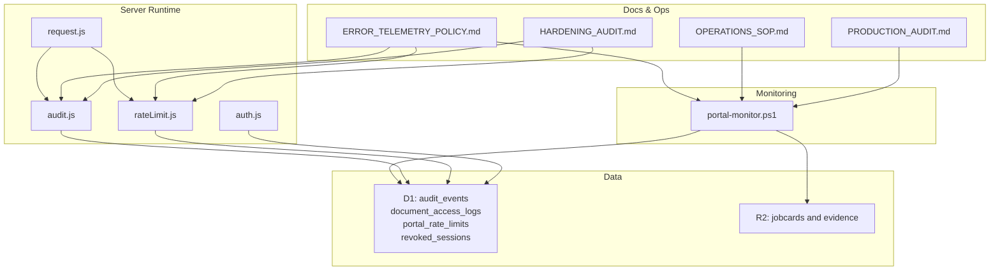
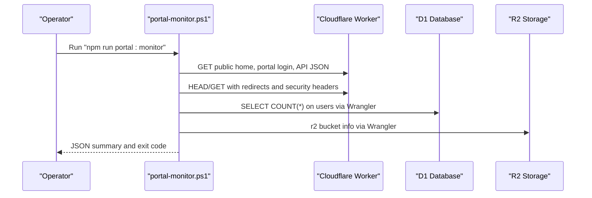
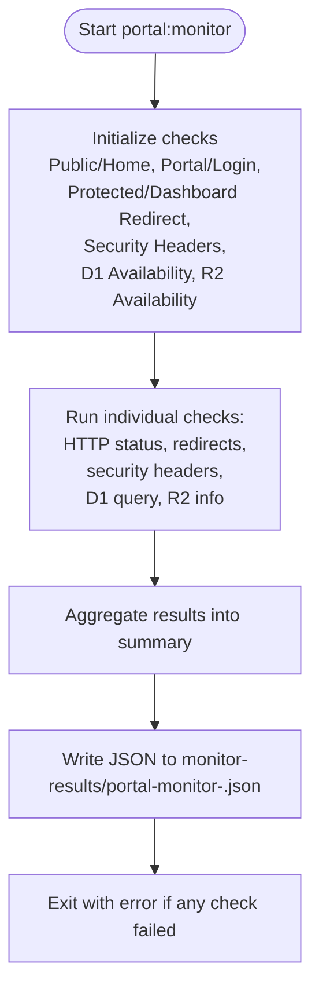
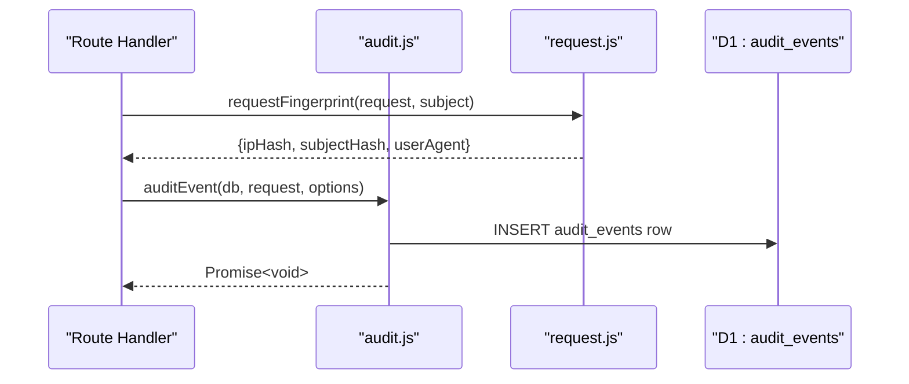
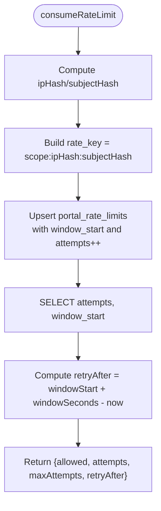
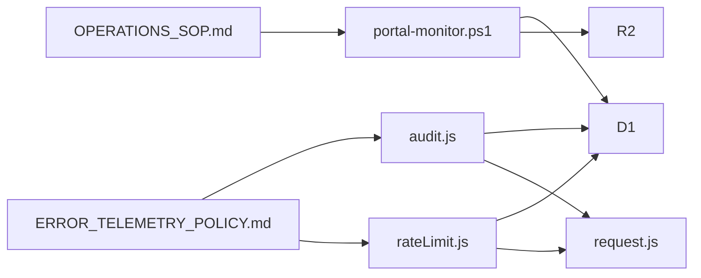
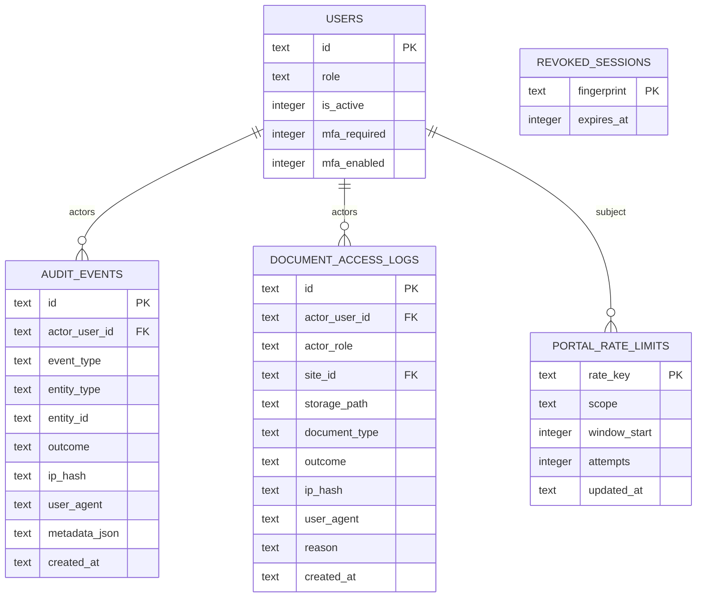

# Monitoring & Alerting

<cite>
**Referenced Files in This Document**
- [portal-monitor.ps1](file://scripts/portal-monitor.ps1)
- [audit.js](file://src/lib/server/audit.js)
- [rateLimit.js](file://src/lib/server/rateLimit.js)
- [request.js](file://src/lib/server/request.js)
- [ERROR_TELEMETRY_POLICY.md](file://docs/roadmap/ERROR_TELEMETRY_POLICY.md)
- [OPERATIONS_SOP.md](file://docs/roadmap/OPERATIONS_SOP.md)
- [HARDENING_AUDIT.md](file://docs/roadmap/HARDENING_AUDIT.md)
- [PRODUCTION_AUDIT.md](file://docs/roadmap/PRODUCTION_AUDIT.md)
- [schema.sql](file://schema.sql)
- [0008_document_access_logs.sql](file://migrations/0008_document_access_logs.sql)
- [0009_revoked_sessions.sql](file://migrations/0009_revoked_sessions.sql)
- [package.json](file://package.json)
- [auth.js](file://src/lib/server/auth.js)
</cite>

## Table of Contents
1. [Introduction](#introduction)
2. [Project Structure](#project-structure)
3. [Core Components](#core-components)
4. [Architecture Overview](#architecture-overview)
5. [Detailed Component Analysis](#detailed-component-analysis)
6. [Dependency Analysis](#dependency-analysis)
7. [Performance Considerations](#performance-considerations)
8. [Troubleshooting Guide](#troubleshooting-guide)
9. [Conclusion](#conclusion)
10. [Appendices](#appendices)

## Introduction
This document describes the operational observability and health checking systems for the Kharon portal and public website hosted on Cloudflare Workers. It focuses on:
- The portal-monitor.ps1 script and its uptime checks, security header validation, and infrastructure connectivity tests
- The audit logging system capturing security events and user activities
- The rate limiting implementation and its abuse prevention characteristics
- Error telemetry policy and incident response procedures
- Practical examples for setting up monitoring alerts, interpreting logs, and responding to incidents
- Integration points with Cloudflare analytics and internal audit systems

## Project Structure
The monitoring and alerting ecosystem spans:
- A PowerShell health monitor script that validates public and portal endpoints, redirects, security headers, and infrastructure bindings
- Server-side audit logging and rate limiting utilities that integrate with D1 and R2
- Operational and policy documents that define review cadences, thresholds, and escalation procedures
- Package scripts that expose monitoring and operational tasks

**Diagram sources**
- [portal-monitor.ps1:1-133](file://scripts/portal-monitor.ps1#L1-L133)
- [audit.js:1-33](file://src/lib/server/audit.js#L1-L33)
- [rateLimit.js:1-56](file://src/lib/server/rateLimit.js#L1-L56)
- [request.js:1-36](file://src/lib/server/request.js#L1-L36)
- [auth.js:1-217](file://src/lib/server/auth.js#L1-L217)
- [ERROR_TELEMETRY_POLICY.md:1-153](file://docs/roadmap/ERROR_TELEMETRY_POLICY.md#L1-L153)
- [OPERATIONS_SOP.md:1-416](file://docs/roadmap/OPERATIONS_SOP.md#L1-L416)
- [HARDENING_AUDIT.md:1-104](file://docs/roadmap/HARDENING_AUDIT.md#L1-L104)
- [PRODUCTION_AUDIT.md:1-171](file://docs/roadmap/PRODUCTION_AUDIT.md#L1-L171)

**Section sources**
- [portal-monitor.ps1:1-133](file://scripts/portal-monitor.ps1#L1-L133)
- [package.json:10-32](file://package.json#L10-L32)
- [ERROR_TELEMETRY_POLICY.md:69-153](file://docs/roadmap/ERROR_TELEMETRY_POLICY.md#L69-L153)
- [OPERATIONS_SOP.md:5-41](file://docs/roadmap/OPERATIONS_SOP.md#L5-L41)

## Core Components
- Health Monitor (portal-monitor.ps1)
  - Validates public and portal endpoints, redirects, and security headers
  - Tests D1 and R2 connectivity using Wrangler
  - Outputs a machine-readable JSON summary and fails fast on any failure
- Audit Logging (audit.js)
  - Captures security and operational events into D1 audit_events with request fingerprinting
- Rate Limiting (rateLimit.js)
  - Enforces sliding-window rate limits keyed by scope, IP hash, and subject hash
  - Returns allowed/attempts/maxAttempts/retryAfter for middleware integration
- Request Fingerprinting (request.js)
  - Produces deterministic ipHash and subjectHash used by audit and rate limiting
- Operational and Policy Documents
  - Define thresholds, cadence, escalation, and Cloudflare log review procedures

**Section sources**
- [portal-monitor.ps1:106-133](file://scripts/portal-monitor.ps1#L106-L133)
- [audit.js:3-32](file://src/lib/server/audit.js#L3-L32)
- [rateLimit.js:3-46](file://src/lib/server/rateLimit.js#L3-L46)
- [request.js:26-35](file://src/lib/server/request.js#L26-L35)
- [ERROR_TELEMETRY_POLICY.md:9-66](file://docs/roadmap/ERROR_TELEMETRY_POLICY.md#L9-L66)

## Architecture Overview
The monitoring and alerting architecture integrates Cloudflare Workers, D1, and R2 with internal operational scripts and policies.

**Diagram sources**
- [portal-monitor.ps1:106-128](file://scripts/portal-monitor.ps1#L106-L128)
- [package.json:18](file://package.json#L18)

**Section sources**
- [portal-monitor.ps1:106-128](file://scripts/portal-monitor.ps1#L106-L128)
- [OPERATIONS_SOP.md:5-41](file://docs/roadmap/OPERATIONS_SOP.md#L5-L41)

## Detailed Component Analysis

### Health Monitor: portal-monitor.ps1
Capabilities:
- Uptime checks for public and portal endpoints
- Redirect validation for protected dashboards
- Security header validation for public, portal, API JSON, and protected redirect responses
- D1 availability test using a simple query against the users table
- R2 availability test via bucket info

Processing logic:
- Uses curl.exe and HttpClient to probe endpoints and capture status codes and headers
- Builds a result object per check with name, ok flag, and details
- Aggregates results into a summary with checkedAt and ok flag
- Writes JSON output to monitor-results/ and fails if any check fails

**Diagram sources**
- [portal-monitor.ps1:106-128](file://scripts/portal-monitor.ps1#L106-L128)

**Section sources**
- [portal-monitor.ps1:106-133](file://scripts/portal-monitor.ps1#L106-L133)
- [OPERATIONS_SOP.md:5-41](file://docs/roadmap/OPERATIONS_SOP.md#L5-L41)

### Audit Logging: audit.js
Purpose:
- Capture security and operational events with actor, entity, outcome, and request fingerprinting
- Persist to D1 audit_events for later review and incident response

Implementation highlights:
- Computes request fingerprint (ipHash, userAgent) and optional subjectHash
- Inserts a row into audit_events with eventType, entityType, entityId, outcome, ipHash, userAgent, and metadata_json
- Handles write failures gracefully with console error logging

**Diagram sources**
- [audit.js:3-32](file://src/lib/server/audit.js#L3-L32)
- [request.js:26-35](file://src/lib/server/request.js#L26-L35)

**Section sources**
- [audit.js:3-32](file://src/lib/server/audit.js#L3-L32)
- [schema.sql:101-113](file://schema.sql#L101-L113)

### Rate Limiting: rateLimit.js
Purpose:
- Prevent abuse on portal write endpoints and public contact form
- Provide allowed/attempts/maxAttempts/retryAfter to middleware

Implementation highlights:
- Sliding window keyed by scope:ipHash:subjectHash
- On each request, upsert attempts and window_start, then select current attempts
- Compute retryAfter seconds based on window boundary
- Expose resetRateLimit to clear counters for a key

**Diagram sources**
- [rateLimit.js:3-46](file://src/lib/server/rateLimit.js#L3-L46)

**Section sources**
- [rateLimit.js:3-46](file://src/lib/server/rateLimit.js#L3-L46)
- [schema.sql:142-148](file://schema.sql#L142-L148)

### Request Fingerprinting: request.js
Purpose:
- Provide deterministic identifiers for IP and subject to support audit and rate limiting

Implementation highlights:
- Extract client IP from Cloudflare headers or X-Forwarded-For
- Hash IP and optional subject (e.g., email) with SHA-256 and base64Url encode
- Return userAgent for audit trail

**Section sources**
- [request.js:9-35](file://src/lib/server/request.js#L9-L35)

### Session Revocation and CSRF: auth.js and hardened audit
- Session token revocation uses a fingerprint table to invalidate sessions
- CSRF protection uses HMAC tokens validated on state-changing portal POSTs
- These guardrails are reflected in the hardened audit and production readiness documents

**Section sources**
- [auth.js:125-157](file://src/lib/server/auth.js#L125-L157)
- [HARDENING_AUDIT.md:77-84](file://docs/roadmap/HARDENING_AUDIT.md#L77-L84)
- [PRODUCTION_AUDIT.md:86-118](file://docs/roadmap/PRODUCTION_AUDIT.md#L86-L118)

## Dependency Analysis
- portal-monitor.ps1 depends on:
  - curl.exe for HTTP probing
  - Wrangler CLI for D1 and R2 checks
  - Cloudflare Worker endpoints and bindings
- audit.js depends on:
  - request.js for fingerprinting
  - D1 audit_events table
- rateLimit.js depends on:
  - request.js for fingerprinting
  - D1 portal_rate_limits table
- Operational scripts and policies depend on:
  - D1 audit_events and document_access_logs
  - Cloudflare Worker logs and analytics

**Diagram sources**
- [portal-monitor.ps1:106-128](file://scripts/portal-monitor.ps1#L106-L128)
- [audit.js:3-32](file://src/lib/server/audit.js#L3-L32)
- [rateLimit.js:3-46](file://src/lib/server/rateLimit.js#L3-L46)
- [request.js:26-35](file://src/lib/server/request.js#L26-L35)
- [ERROR_TELEMETRY_POLICY.md:69-98](file://docs/roadmap/ERROR_TELEMETRY_POLICY.md#L69-L98)
- [OPERATIONS_SOP.md:5-41](file://docs/roadmap/OPERATIONS_SOP.md#L5-L41)

**Section sources**
- [portal-monitor.ps1:106-128](file://scripts/portal-monitor.ps1#L106-L128)
- [audit.js:3-32](file://src/lib/server/audit.js#L3-L32)
- [rateLimit.js:3-46](file://src/lib/server/rateLimit.js#L3-L46)
- [request.js:26-35](file://src/lib/server/request.js#L26-L35)
- [ERROR_TELEMETRY_POLICY.md:69-98](file://docs/roadmap/ERROR_TELEMETRY_POLICY.md#L69-L98)
- [OPERATIONS_SOP.md:5-41](file://docs/roadmap/OPERATIONS_SOP.md#L5-L41)

## Performance Considerations
- Health monitor timeouts are bounded to minimize impact on Cloudflare Worker latency
- Rate limiting uses lightweight hashing and atomic upsert/select to avoid heavy contention
- Audit logging writes are minimal and non-blocking aside from console error fallback
- D1 and R2 checks leverage Wrangler’s remote execution to avoid local overhead

[No sources needed since this section provides general guidance]

## Troubleshooting Guide
Common scenarios and actions:
- Public route failure
  - Check Cloudflare Worker deployment, routes, and DNS
- Portal login failure
  - Verify Worker deployment, SESSION_SECRET, adapter output, and Cloudflare routes
- Protected redirect failure
  - Treat as auth middleware regression until proven otherwise
- Security header failure
  - Treat as middleware or deployment regression until public, portal, API, and redirect responses are all covered
- D1 failure
  - Check D1 binding DB, database availability, and Wrangler authentication
- R2 failure
  - Check R2 binding STORAGE, bucket availability, and Wrangler authentication
- Error telemetry review
  - Use D1 queries to review auth failures, rate-limit blocks, CSRF blocks, and document access failures
  - Weekly and monthly review checklists define thresholds and actions
- Incident response
  - Immediate containment: disable affected users, rotate passwords/MFA, preserve logs, run monitoring script, export D1 before manual corrections
  - Escalation thresholds are defined for critical and high-severity conditions

**Section sources**
- [OPERATIONS_SOP.md:33-41](file://docs/roadmap/OPERATIONS_SOP.md#L33-L41)
- [ERROR_TELEMETRY_POLICY.md:69-153](file://docs/roadmap/ERROR_TELEMETRY_POLICY.md#L69-L153)

## Conclusion
The monitoring and alerting framework combines a pragmatic health monitor, robust audit logging, and sliding-window rate limiting to maintain portal stability and security. Operational and policy documents define clear thresholds, cadences, and escalation paths, integrating Cloudflare analytics and internal audit systems for effective observability and incident response.

[No sources needed since this section summarizes without analyzing specific files]

## Appendices

### Appendix A: Monitoring Alerts Setup Examples
- Daily health checks
  - Schedule “npm run portal:monitor” after deployments and before QA
  - Treat any failure as a blocking alert requiring remediation
- Weekly D1 review
  - Query audit_events and document_access_logs for spikes in failures/blocks
  - Use thresholds from the error telemetry policy to trigger deeper investigations
- Cloudflare analytics
  - Monitor Workers analytics for 5xx rates and correlate with D1 findings
  - Use real-time logs to observe live Worker output and errors

**Section sources**
- [OPERATIONS_SOP.md:24-41](file://docs/roadmap/OPERATIONS_SOP.md#L24-L41)
- [ERROR_TELEMETRY_POLICY.md:69-115](file://docs/roadmap/ERROR_TELEMETRY_POLICY.md#L69-L115)

### Appendix B: Interpreting Log Data
- audit_events
  - Filter by event_type and outcome to detect brute force, rate-limit blocks, CSRF blocks, and unauthorized access
- document_access_logs
  - Look for blocked outcomes and reasons to identify unauthorized downloads or stale references
- Cloudflare Worker logs
  - Watch for 500/503 responses and D1/R2 binding errors

**Section sources**
- [ERROR_TELEMETRY_POLICY.md:16-66](file://docs/roadmap/ERROR_TELEMETRY_POLICY.md#L16-L66)
- [schema.sql:128-140](file://schema.sql#L128-L140)

### Appendix C: Rate Limiting Behavior Reference
- Scope: endpoint or functional group (e.g., portal.login, portal.admin.*, public.contact)
- Window: configurable seconds (default 15 minutes)
- Max attempts: configurable per scope (default 8)
- Response: allowed flag, attempts count, maxAttempts, and retryAfter seconds

**Section sources**
- [rateLimit.js:4-8](file://src/lib/server/rateLimit.js#L4-L8)
- [rateLimit.js:36-45](file://src/lib/server/rateLimit.js#L36-L45)
- [ERROR_TELEMETRY_POLICY.md:24-34](file://docs/roadmap/ERROR_TELEMETRY_POLICY.md#L24-L34)

### Appendix D: Data Models Overview

**Diagram sources**
- [schema.sql:3-20](file://schema.sql#L3-L20)
- [schema.sql:101-113](file://schema.sql#L101-L113)
- [schema.sql:128-140](file://schema.sql#L128-L140)
- [schema.sql:142-148](file://schema.sql#L142-L148)
- [schema.sql:185-188](file://schema.sql#L185-L188)