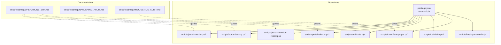
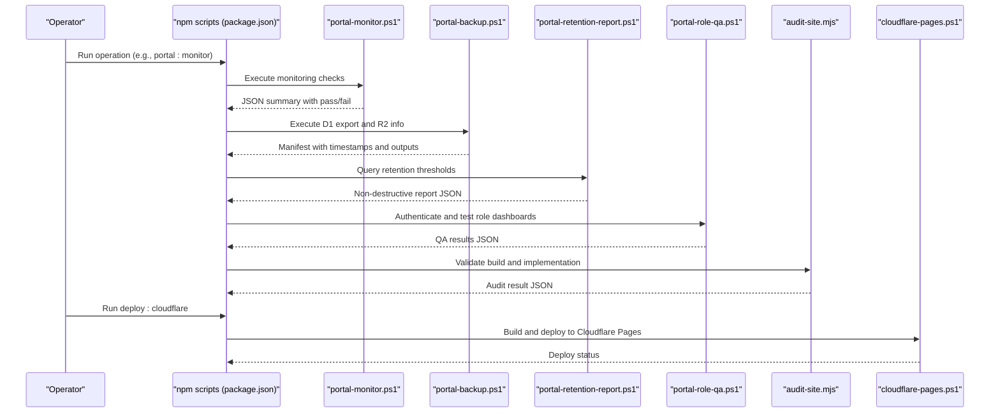
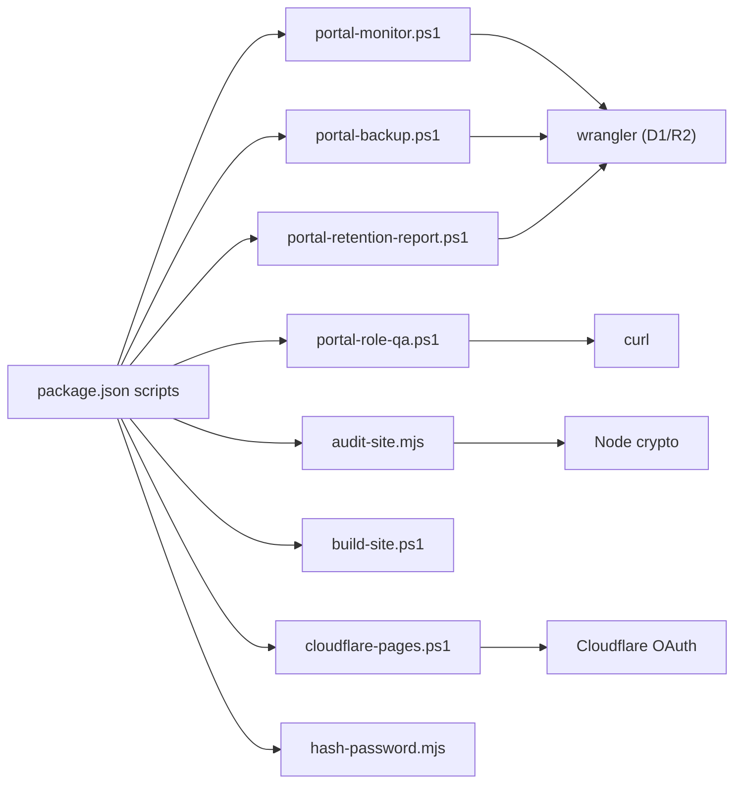
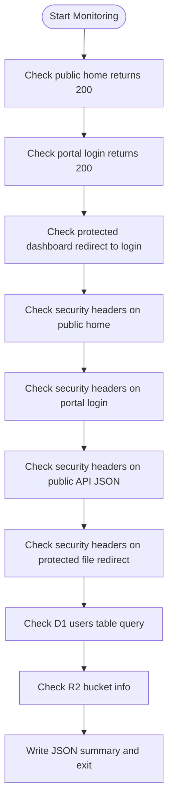
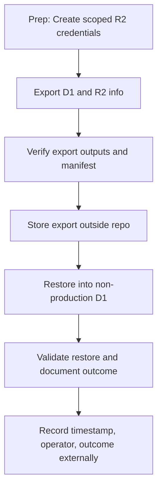
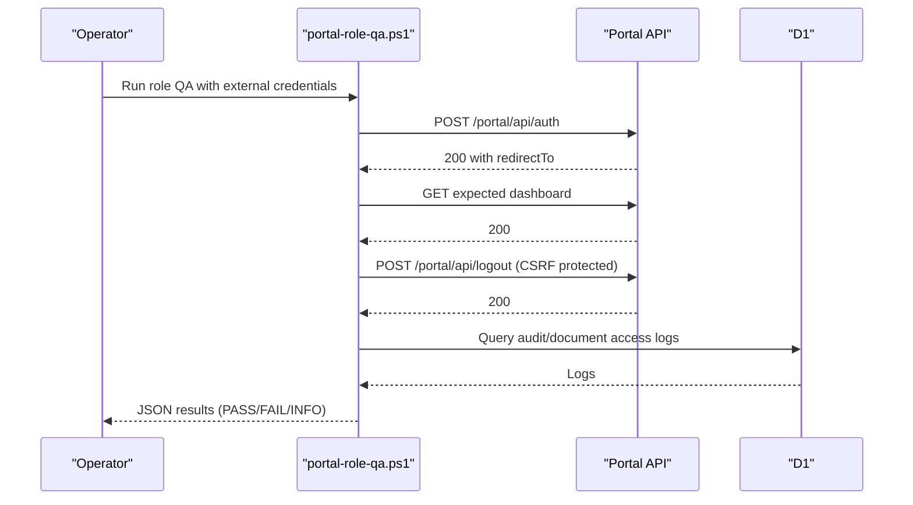

# Operational Procedures

<cite>
**Referenced Files in This Document**
- [OPERATIONS_SOP.md](file://docs/roadmap/OPERATIONS_SOP.md)
- [HARDENING_AUDIT.md](file://docs/roadmap/HARDENING_AUDIT.md)
- [PRODUCTION_AUDIT.md](file://docs/roadmap/PRODUCTION_AUDIT.md)
- [portal-monitor.ps1](file://scripts/portal-monitor.ps1)
- [portal-backup.ps1](file://scripts/portal-backup.ps1)
- [portal-retention-report.ps1](file://scripts/portal-retention-report.ps1)
- [portal-role-qa.ps1](file://scripts/portal-role-qa.ps1)
- [audit-site.mjs](file://scripts/audit-site.mjs)
- [build-site.ps1](file://scripts/build-site.ps1)
- [cloudflare-pages.ps1](file://scripts/cloudflare-pages.ps1)
- [hash-password.mjs](file://scripts/hash-password.mjs)
- [package.json](file://package.json)
</cite>

## Table of Contents
1. [Introduction](#introduction)
2. [Project Structure](#project-structure)
3. [Core Components](#core-components)
4. [Architecture Overview](#architecture-overview)
5. [Detailed Component Analysis](#detailed-component-analysis)
6. [Dependency Analysis](#dependency-analysis)
7. [Performance Considerations](#performance-considerations)
8. [Troubleshooting Guide](#troubleshooting-guide)
9. [Conclusion](#conclusion)
10. [Appendices](#appendices)

## Introduction
This document defines the operational procedures and maintenance workflows for the KharonOps portal. It consolidates the standard operating procedures (SOP), hardening and security compliance processes, production readiness and quality assurance, incident response, backup and recovery, and disaster recovery planning. It also explains how operational tasks integrate with the automated scripts in the scripts/ directory and how to maintain accurate operational documentation.

## Project Structure
Operational tasks are orchestrated through npm scripts defined in the project’s package.json. These scripts wrap PowerShell and Node-based operational utilities located under scripts/. The operational documentation is maintained under docs/roadmap/.

**Diagram sources**
- [package.json:10-32](file://package.json#L10-L32)
- [portal-monitor.ps1:1-133](file://scripts/portal-monitor.ps1#L1-L133)
- [portal-backup.ps1:1-32](file://scripts/portal-backup.ps1#L1-L32)
- [portal-retention-report.ps1:1-61](file://scripts/portal-retention-report.ps1#L1-L61)
- [portal-role-qa.ps1:1-291](file://scripts/portal-role-qa.ps1#L1-L291)
- [audit-site.mjs:1-383](file://scripts/audit-site.mjs#L1-L383)
- [build-site.ps1:1-22](file://scripts/build-site.ps1#L1-L22)
- [cloudflare-pages.ps1:1-122](file://scripts/cloudflare-pages.ps1#L1-L122)
- [hash-password.mjs:1-32](file://scripts/hash-password.mjs#L1-L32)
- [OPERATIONS_SOP.md:1-416](file://docs/roadmap/OPERATIONS_SOP.md#L1-L416)
- [HARDENING_AUDIT.md:1-104](file://docs/roadmap/HARDENING_AUDIT.md#L1-L104)
- [PRODUCTION_AUDIT.md:1-171](file://docs/roadmap/PRODUCTION_AUDIT.md#L1-L171)

**Section sources**
- [package.json:10-32](file://package.json#L10-L32)

## Core Components
- Monitoring and health checks: Automated HTTP reachability, redirect, and security header validation against staging and production URLs; D1 and R2 connectivity checks.
- Backup and recovery: D1 export and R2 availability verification; external mirroring guidance for evidence.
- Retention and governance: Non-destructive reporting of records exceeding retention thresholds; guidance for legal hold and approvals.
- Role-based access and QA: Automated role-based access tests, CSRF token exposure, and post-logout token replay behavior.
- Site hardening and validation: Static and SSR build auditing, forbidden content checks, security headers, and required implementation markers.
- Deployment and environment configuration: Build targeting staging or production domains and Cloudflare Pages orchestration.

**Section sources**
- [OPERATIONS_SOP.md:5-416](file://docs/roadmap/OPERATIONS_SOP.md#L5-L416)
- [HARDENING_AUDIT.md:1-104](file://docs/roadmap/HARDENING_AUDIT.md#L1-L104)
- [PRODUCTION_AUDIT.md:1-171](file://docs/roadmap/PRODUCTION_AUDIT.md#L1-L171)
- [portal-monitor.ps1:1-133](file://scripts/portal-monitor.ps1#L1-L133)
- [portal-backup.ps1:1-32](file://scripts/portal-backup.ps1#L1-L32)
- [portal-retention-report.ps1:1-61](file://scripts/portal-retention-report.ps1#L1-L61)
- [portal-role-qa.ps1:1-291](file://scripts/portal-role-qa.ps1#L1-L291)
- [audit-site.mjs:1-383](file://scripts/audit-site.mjs#L1-L383)
- [build-site.ps1:1-22](file://scripts/build-site.ps1#L1-L22)
- [cloudflare-pages.ps1:1-122](file://scripts/cloudflare-pages.ps1#L1-L122)
- [hash-password.mjs:1-32](file://scripts/hash-password.mjs#L1-L32)

## Architecture Overview
The operational architecture ties together documentation-driven SOPs with automated scripts and Cloudflare infrastructure. The npm scripts act as the central orchestrator, invoking PowerShell and Node utilities that validate, monitor, back up, and report on the system. Production readiness is gated by the production audit and hardening audit documents.

**Diagram sources**
- [package.json:10-32](file://package.json#L10-L32)
- [portal-monitor.ps1:106-129](file://scripts/portal-monitor.ps1#L106-L129)
- [portal-backup.ps1:14-31](file://scripts/portal-backup.ps1#L14-L31)
- [portal-retention-report.ps1:24-60](file://scripts/portal-retention-report.ps1#L24-L60)
- [portal-role-qa.ps1:237-286](file://scripts/portal-role-qa.ps1#L237-L286)
- [audit-site.mjs:371-382](file://scripts/audit-site.mjs#L371-L382)
- [cloudflare-pages.ps1:111-120](file://scripts/cloudflare-pages.ps1#L111-L120)

## Detailed Component Analysis

### Daily, Weekly, and Monthly Operational Tasks
- Daily:
  - Run monitoring checks against staging and production URLs to validate public routes, portal login, protected dashboard redirect, security headers, D1 availability, and R2 availability. Outputs are written to a gitignored directory for evidence.
  - Review contact form submissions and error telemetry as per policy cadence.
- Weekly:
  - Perform a weekly error telemetry review using the policy-defined checklist.
  - Run role QA checks using external credentials to validate CSRF protection and post-logout token replay behavior.
- Monthly:
  - Conduct retention review to identify records older than thresholds and produce a non-destructive report.
  - Validate D1 and R2 evidence backups and document outcomes externally.

**Section sources**
- [OPERATIONS_SOP.md:28-41](file://docs/roadmap/OPERATIONS_SOP.md#L28-L41)
- [OPERATIONS_SOP.md:355-371](file://docs/roadmap/OPERATIONS_SOP.md#L355-L371)
- [OPERATIONS_SOP.md:384-394](file://docs/roadmap/OPERATIONS_SOP.md#L384-L394)

### System Maintenance
- Pre-migration backups:
  - Take D1 export and confirm R2 availability prior to schema migrations and bulk imports.
- Restore drills:
  - Keep at least one recent export available outside the repository; test restore into a non-production D1 database; record export timestamp, operator, and outcome externally.
- Evidence backup:
  - Use Cloudflare R2 S3-compatible credentials to mirror storage; verify at least one jobcard PDF can be restored and opened.

**Section sources**
- [OPERATIONS_SOP.md:58-67](file://docs/roadmap/OPERATIONS_SOP.md#L58-L67)
- [OPERATIONS_SOP.md:79-86](file://docs/roadmap/OPERATIONS_SOP.md#L79-L86)

### User Management
- Onboarding:
  - Confirm role, client site mapping, and MFA requirements; enforce “force password change”; issue reset link via approved external channel; record actions externally.
- Deactivation and role changes:
  - Disable user, run role QA for disabled login, and re-run RBAC QA after role changes; require password rotation and MFA review for privileged roles.
- Password reset and MFA:
  - Tokens are single-use, hashed, and expire; reset links are copy-to-clipboard only; MFA uses app-based TOTP with encrypted secrets.

**Section sources**
- [OPERATIONS_SOP.md:109-157](file://docs/roadmap/OPERATIONS_SOP.md#L109-L157)
- [OPERATIONS_SOP.md:304-334](file://docs/roadmap/OPERATIONS_SOP.md#L304-L334)

### Dispatch and Jobcard Operations
- Admin scheduling and technician closure:
  - Validate client site and system; convert requests to scheduled dispatches; ensure correct job type and notes; attach up to three relevant evidence photos; capture client signatures; confirm online stability before submission.
- Exception handling:
  - Preserve evidence, retain local notes and photos, and retry from stable connectivity; escalate for incorrect jobcard closures; protect raw R2 paths; verify PDF generation via document access logs.

**Section sources**
- [OPERATIONS_SOP.md:158-197](file://docs/roadmap/OPERATIONS_SOP.md#L158-L197)

### Performance Monitoring
- Monitoring script checks:
  - Public home, portal login, protected dashboard redirect, security headers on public, portal, API JSON, and protected redirect responses, D1 users table query, and R2 bucket metadata reachability.
- Output:
  - JSON summary and pass/fail status; failure response guidance for each check.

**Section sources**
- [OPERATIONS_SOP.md:5-41](file://docs/roadmap/OPERATIONS_SOP.md#L5-L41)
- [portal-monitor.ps1:108-129](file://scripts/portal-monitor.ps1#L108-L129)

### Hardening Audit and Security Compliance
- Build and deployment:
  - Static-first Astro build; no public app JavaScript bundle; canonical output domains for staging and production; hardened deployment pipeline.
- Security:
  - CSP via public headers; mitigations for inline scripts and unsafe patterns; dependency audit; runtime protections (CSRF, rate limiting, MFA, password reset).
- UX, content, and routing:
  - Compact homepage; contextual inquiry forms; removal of forbidden terms and imagery.
- Operational notes:
  - Canonical forwarding via Cloudflare Redirect Rules; residual external control items noted.

**Section sources**
- [HARDENING_AUDIT.md:9-104](file://docs/roadmap/HARDENING_AUDIT.md#L9-L104)

### Production Audit and Quality Assurance
- Production readiness:
  - Staging build pass, static assets and JS bundles check, security headers auditing, D1/R2 infrastructure binding status.
- Financial workflow alignment:
  - Reframed as operational tracking queue; terminology and guardrails aligned with Sage; manual reconciliation required.
- Hardened security and redirection flow:
  - Path traversal checks, session token revocation, CSRF validation, rate limiting, MFA enforcement, CSV formula sanitization.
- Staging QA checklist:
  - Authentication/session rotation, MFA, RBAC, and document access scenarios using external credentials.

**Section sources**
- [PRODUCTION_AUDIT.md:21-171](file://docs/roadmap/PRODUCTION_AUDIT.md#L21-L171)

### Incident Response Workflow
- Severity guide:
  - Critical, high, medium, low categorization for access issues, credential compromise, role leakage, and document-access anomalies.
- Immediate containment:
  - Disable affected user, rotate password and reset MFA for privileged accounts, preserve logs, run monitoring and role QA, export D1 before manual corrections.
- Investigation:
  - Identify user ID, role, time window, and affected route; check audit and document access logs; confirm user attributes and route behavior.
- Recovery and escalation:
  - Re-enable users after root cause, issue new reset links, require MFA for affected accounts, record incident externally; escalate to management for client notification or legal requirements.

**Section sources**
- [OPERATIONS_SOP.md:198-239](file://docs/roadmap/OPERATIONS_SOP.md#L198-L239)

### Backup and Recovery Procedures
- D1 backup:
  - Use the dedicated script to export the remote database; outputs include SQL and a manifest; keep at least one recent export outside the repository; test restore into non-production; record outcomes externally.
- R2 evidence backup:
  - Use Cloudflare R2 S3-compatible credentials to mirror storage; verify restore of a representative jobcard PDF; document process externally.
- Restore drill:
  - Maintain external evidence of export timestamp, operator, and outcome; validate restore into non-production before production recovery.

**Section sources**
- [OPERATIONS_SOP.md:42-102](file://docs/roadmap/OPERATIONS_SOP.md#L42-L102)
- [portal-backup.ps1:14-31](file://scripts/portal-backup.ps1#L14-L31)

### Disaster Recovery Planning
- Recovery path:
  - Re-point portal access to staging or disable production route while preserving D1/R2 evidence; maintain offsite backups and documented restore ownership.
- Validation:
  - Confirm D1 and R2 connectivity; verify jobcard and evidence downloads; ensure document access logging integrity.

**Section sources**
- [OPERATIONS_SOP.md:284-285](file://docs/roadmap/OPERATIONS_SOP.md#L284-L285)

### Practical Examples of Executing Operational Tasks
- Monitoring:
  - Run the monitoring script and review the generated JSON summary; if failing, consult the failure response guidance and remediate Cloudflare Worker deployment, routes, DNS, or bindings.
- Backup:
  - Execute the backup script; verify D1 export and R2 bucket info outputs; create a manifest and store it with the export; mirror R2 evidence externally.
- Retention:
  - Run the retention report; review counts per threshold; confirm D1 and R2 checks; take backups and approve cleanup decisions per policy.
- Role QA:
  - Set environment variables for external QA credentials; run the role QA script; review PASS/FAIL/INFO results and remediate CSRF or redirect issues.
- Site audit:
  - Build staging, then run the audit script; review failures and warnings; fix missing files, forbidden patterns, or missing security markers.

**Section sources**
- [OPERATIONS_SOP.md:5-41](file://docs/roadmap/OPERATIONS_SOP.md#L5-L41)
- [portal-monitor.ps1:106-129](file://scripts/portal-monitor.ps1#L106-L129)
- [portal-backup.ps1:14-31](file://scripts/portal-backup.ps1#L14-L31)
- [portal-retention-report.ps1:24-60](file://scripts/portal-retention-report.ps1#L24-L60)
- [portal-role-qa.ps1:237-286](file://scripts/portal-role-qa.ps1#L237-L286)
- [audit-site.mjs:371-382](file://scripts/audit-site.mjs#L371-L382)

### Maintaining Operational Documentation
- Store monitoring, backup, and retention outputs in gitignored directories; record operator actions externally; avoid storing secrets, tokens, or exported evidence in version control.
- Update SOP with latest staging evidence and cadence adjustments; maintain hardening and production audit artifacts; ensure all scripts and package.json entries are synchronized with SOP.

**Section sources**
- [OPERATIONS_SOP.md:24-26](file://docs/roadmap/OPERATIONS_SOP.md#L24-L26)
- [OPERATIONS_SOP.md:69-73](file://docs/roadmap/OPERATIONS_SOP.md#L69-L73)
- [OPERATIONS_SOP.md:382](file://docs/roadmap/OPERATIONS_SOP.md#L382)

### Integration Between Operational Procedures and Automated Scripts
- npm scripts orchestrate:
  - portal:monitor, portal:backup:d1, portal:retention:report, portal:qa:roles, audit:site, validate:site, build:staging, build:production:kharon, deploy:cloudflare, cloudflare:* helpers.
- Scripts integrate with:
  - Wrangler for D1 exports and R2 bucket info; curl for HTTP checks; Node crypto for hashing; Cloudflare OAuth for Pages deployments.

**Section sources**
- [package.json:10-32](file://package.json#L10-L32)
- [portal-monitor.ps1:13-129](file://scripts/portal-monitor.ps1#L13-L129)
- [portal-backup.ps1:14-31](file://scripts/portal-backup.ps1#L14-L31)
- [portal-retention-report.ps1:12-60](file://scripts/portal-retention-report.ps1#L12-L60)
- [portal-role-qa.ps1:237-286](file://scripts/portal-role-qa.ps1#L237-L286)
- [audit-site.mjs:371-382](file://scripts/audit-site.mjs#L371-L382)
- [cloudflare-pages.ps1:19-120](file://scripts/cloudflare-pages.ps1#L19-L120)
- [build-site.ps1:10-18](file://scripts/build-site.ps1#L10-L18)
- [hash-password.mjs:17-31](file://scripts/hash-password.mjs#L17-L31)

## Dependency Analysis
Operational scripts depend on:
- Wrangler for D1 and R2 operations.
- Cloudflare OAuth for Pages deployments.
- Curl for HTTP checks.
- Node crypto for hashing utilities.
- Environment variables for secrets and configuration.

**Diagram sources**
- [package.json:10-32](file://package.json#L10-L32)
- [portal-monitor.ps1:46-61](file://scripts/portal-monitor.ps1#L46-L61)
- [portal-backup.ps1:14-19](file://scripts/portal-backup.ps1#L14-L19)
- [portal-retention-report.ps1:15-21](file://scripts/portal-retention-report.ps1#L15-L21)
- [portal-role-qa.ps1:77-97](file://scripts/portal-role-qa.ps1#L77-L97)
- [audit-site.mjs:371-382](file://scripts/audit-site.mjs#L371-L382)
- [cloudflare-pages.ps1:19-31](file://scripts/cloudflare-pages.ps1#L19-L31)
- [hash-password.mjs:17-31](file://scripts/hash-password.mjs#L17-L31)

**Section sources**
- [package.json:10-32](file://package.json#L10-L32)

## Performance Considerations
- Prefer non-destructive operations (e.g., retention reporting) to minimize risk.
- Use gitignored output directories for operational artifacts to avoid bloating repositories.
- Batch related tasks (monitoring, backup, retention) during scheduled windows to reduce operational overhead.

[No sources needed since this section provides general guidance]

## Troubleshooting Guide
- Monitoring failures:
  - Public route failure: check Cloudflare Worker deployment, routes, and DNS.
  - Portal login failure: verify Worker deployment, SESSION_SECRET, adapter output, and Cloudflare routes.
  - Protected redirect failure: treat as auth middleware regression.
  - Security header failure: verify middleware or deployment; ensure public, portal, API JSON, and redirect responses include required headers.
  - D1 failure: check DB binding, database availability, and Wrangler authentication.
  - R2 failure: check STORAGE binding, bucket availability, and Wrangler authentication.
- Backup failures:
  - D1 export errors: confirm remote database connectivity and credentials; rerun with skip confirmation if needed.
  - R2 bucket info failures: verify R2 credentials and endpoint; mirror using S3-compatible tools.
- Retention report failures:
  - D1 queries failing: check database connectivity and SQL commands; rerun with correct database name.
- Role QA failures:
  - CSRF token exposure or missing CSRF blocked: verify portal layout and middleware; ensure CSRF meta tag and hidden input are present.
  - Post-logout token replay: confirm server-side revocation is active; pre-Phase-10 behavior may show 12h window.

**Section sources**
- [OPERATIONS_SOP.md:33-41](file://docs/roadmap/OPERATIONS_SOP.md#L33-L41)
- [portal-monitor.ps1:130-133](file://scripts/portal-monitor.ps1#L130-L133)
- [portal-backup.ps1:17-18](file://scripts/portal-backup.ps1#L17-L18)
- [portal-retention-report.ps1:16-18](file://scripts/portal-retention-report.ps1#L16-L18)
- [portal-role-qa.ps1:195-231](file://scripts/portal-role-qa.ps1#L195-L231)

## Conclusion
The operational procedures outlined here provide a comprehensive framework for daily, weekly, and monthly maintenance, security hardening, production readiness, incident response, and disaster recovery. They are tightly integrated with automated scripts that validate, monitor, back up, and report on the system, ensuring reliable and auditable operations.

[No sources needed since this section summarizes without analyzing specific files]

## Appendices

### Appendix A: Monitoring Check Flow

**Diagram sources**
- [portal-monitor.ps1:108-129](file://scripts/portal-monitor.ps1#L108-L129)

### Appendix B: Backup and Restore Drill

**Diagram sources**
- [OPERATIONS_SOP.md:63-67](file://docs/roadmap/OPERATIONS_SOP.md#L63-L67)
- [portal-backup.ps1:21-31](file://scripts/portal-backup.ps1#L21-L31)

### Appendix C: Role QA Sequence

**Diagram sources**
- [portal-role-qa.ps1:170-235](file://scripts/portal-role-qa.ps1#L170-L235)