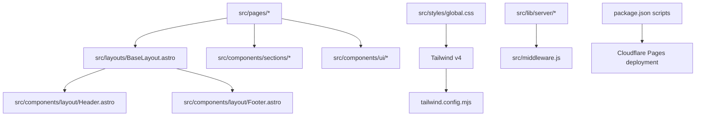
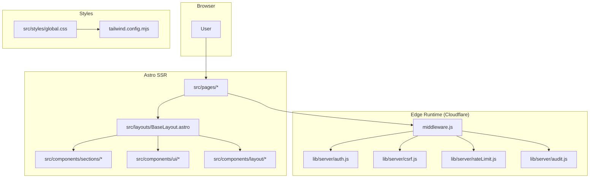
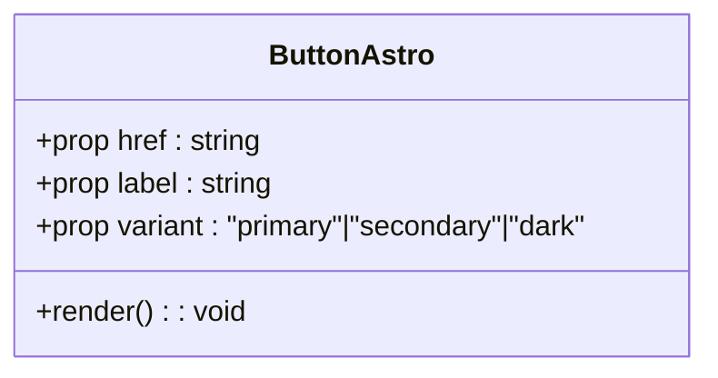
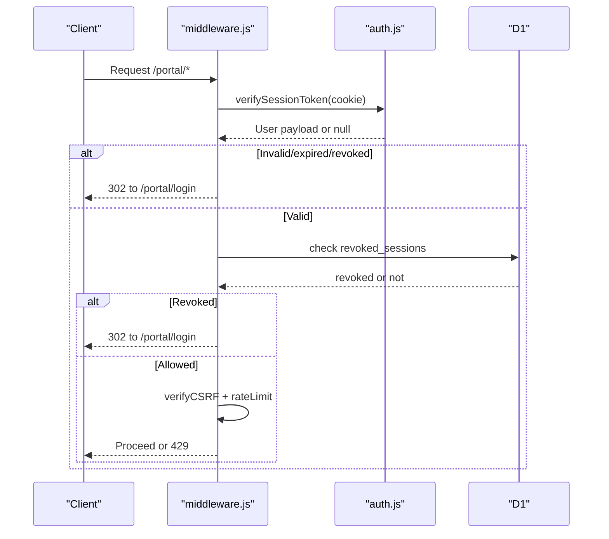
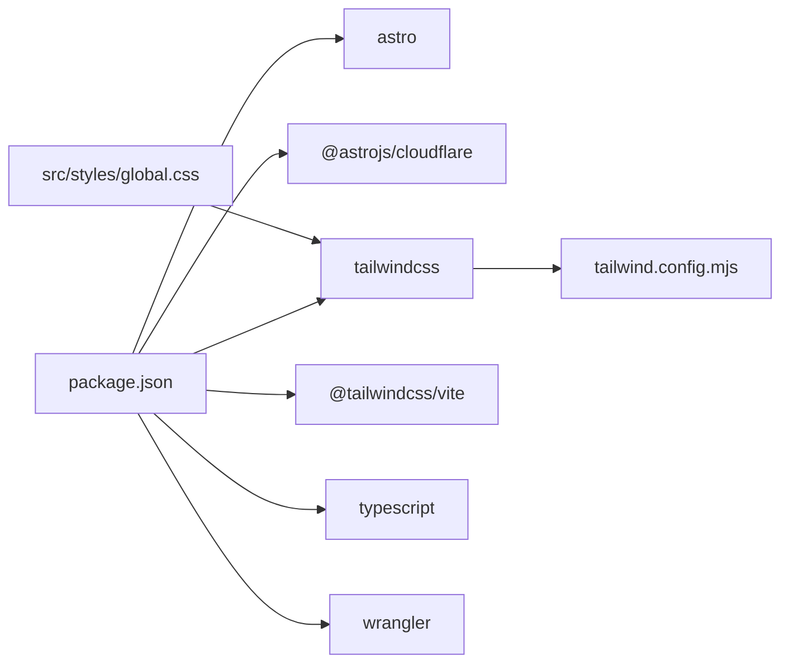
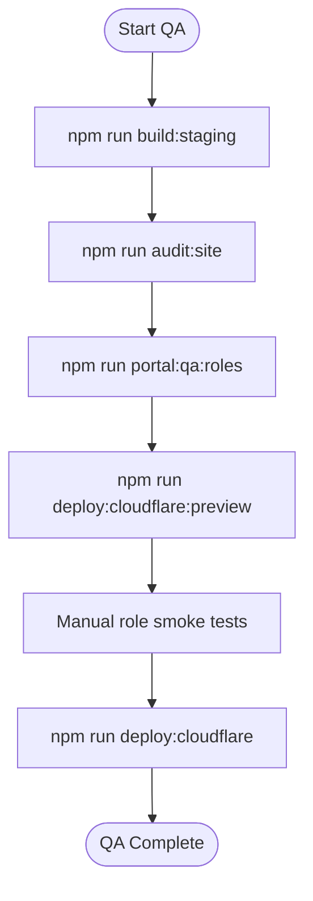
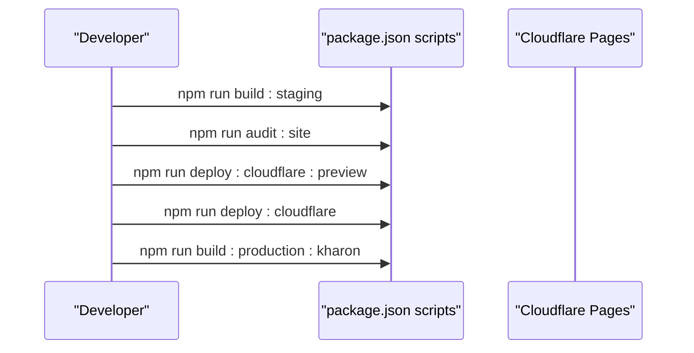

# Development Guidelines

<cite>
**Referenced Files in This Document**
- [README.md](file://README.md)
- [package.json](file://package.json)
- [tailwind.config.mjs](file://tailwind.config.mjs)
- [src/env.d.ts](file://src/env.d.ts)
- [src/styles/global.css](file://src/styles/global.css)
- [src/components/ui/Button.astro](file://src/components/ui/Button.astro)
- [src/components/layout/Header.astro](file://src/components/layout/Header.astro)
- [src/components/layout/Footer.astro](file://src/components/layout/Footer.astro)
- [src/layouts/BaseLayout.astro](file://src/layouts/BaseLayout.astro)
- [src/data/site.js](file://src/data/site.js)
- [src/components/sections/Hero.astro](file://src/components/sections/Hero.astro)
- [src/components/sections/CTA.astro](file://src/components/sections/CTA.astro)
- [src/lib/server/auth.js](file://src/lib/server/auth.js)
- [src/middleware.js](file://src/middleware.js)
- [docs/roadmap/MASTER_ROADMAP.md](file://docs/roadmap/MASTER_ROADMAP.md)
</cite>

## Table of Contents
1. [Introduction](#introduction)
2. [Project Structure](#project-structure)
3. [Core Components](#core-components)
4. [Architecture Overview](#architecture-overview)
5. [Detailed Component Analysis](#detailed-component-analysis)
6. [Dependency Analysis](#dependency-analysis)
7. [Performance Considerations](#performance-considerations)
8. [Testing Strategies and Quality Assurance](#testing-strategies-and-quality-assurance)
9. [Development Workflow, Branching, and Release Procedures](#development-workflow-branching-and-release-procedures)
10. [Component Composition Patterns and Prop Interfaces](#component-composition-patterns-and-prop-interfaces)
11. [State Management Approaches](#state-management-approaches)
12. [Styling Guidelines with TailwindCSS](#styling-guidelines-with-tailwindcss)
13. [Accessibility Requirements](#accessibility-requirements)
14. [Troubleshooting Guide](#troubleshooting-guide)
15. [Conclusion](#conclusion)

## Introduction
This document defines comprehensive development guidelines for the Kharon website built with Astro and TailwindCSS. It covers coding standards, component development patterns, styling conventions, testing strategies, code review processes, quality assurance procedures, development workflow, branching and release practices, component composition, prop interfaces, state management, performance optimization, accessibility, and maintainability best practices. These guidelines are grounded in the repository’s existing patterns and documented roadmap.

## Project Structure
The project follows a feature-based and layer-based organization:
- Astro pages and layouts under src/pages and src/layouts
- UI primitives under src/components/ui
- Page sections under src/components/sections
- Layout scaffolding under src/components/layout
- Global styles and Tailwind configuration under src/styles and tailwind.config.mjs
- Server-side libraries under src/lib/server
- Build and deployment scripts under scripts and package.json
- Documentation and roadmaps under docs



**Diagram sources**
- [src/layouts/BaseLayout.astro:1-117](file://src/layouts/BaseLayout.astro#L1-L117)
- [src/components/layout/Header.astro:1-171](file://src/components/layout/Header.astro#L1-L171)
- [src/components/layout/Footer.astro:1-38](file://src/components/layout/Footer.astro#L1-L38)
- [src/styles/global.css:1-483](file://src/styles/global.css#L1-L483)
- [tailwind.config.mjs:1-4](file://tailwind.config.mjs#L1-L4)
- [src/lib/server/auth.js:1-217](file://src/lib/server/auth.js#L1-L217)
- [src/middleware.js:1-214](file://src/middleware.js#L1-L214)
- [package.json:10-32](file://package.json#L10-L32)

**Section sources**
- [README.md:1-51](file://README.md#L1-L51)
- [package.json:10-32](file://package.json#L10-L32)
- [tailwind.config.mjs:1-4](file://tailwind.config.mjs#L1-L4)
- [src/styles/global.css:1-483](file://src/styles/global.css#L1-L483)

## Core Components
- UI primitives: Button.astro demonstrates props, variants, and Tailwind classes.
- Layout scaffolding: Header.astro and Footer.astro implement responsive navigation, skip-link, and branding.
- Sections: Hero.astro and CTA.astro illustrate composition of content blocks with consistent spacing and typography.
- Data: site.js centralizes site metadata, navigation, and page metadata for SEO.
- BaseLayout.astro composes head metadata, canonical URL, OpenGraph, and JSON-LD structured data.

**Section sources**
- [src/components/ui/Button.astro:1-21](file://src/components/ui/Button.astro#L1-L21)
- [src/components/layout/Header.astro:1-171](file://src/components/layout/Header.astro#L1-L171)
- [src/components/layout/Footer.astro:1-38](file://src/components/layout/Footer.astro#L1-L38)
- [src/components/sections/Hero.astro:1-77](file://src/components/sections/Hero.astro#L1-L77)
- [src/components/sections/CTA.astro:1-23](file://src/components/sections/CTA.astro#L1-L23)
- [src/data/site.js:1-303](file://src/data/site.js#L1-L303)
- [src/layouts/BaseLayout.astro:1-117](file://src/layouts/BaseLayout.astro#L1-L117)

## Architecture Overview
The application uses Astro SSR with the Cloudflare adapter. Middleware enforces authentication, CSRF protection, rate limiting, and RBAC. Server-side libraries handle session tokens, password hashing, and audit logging. TailwindCSS v4 provides utility-first styling with a custom color palette and responsive utilities.



**Diagram sources**
- [src/middleware.js:1-214](file://src/middleware.js#L1-L214)
- [src/lib/server/auth.js:1-217](file://src/lib/server/auth.js#L1-L217)
- [src/layouts/BaseLayout.astro:1-117](file://src/layouts/BaseLayout.astro#L1-L117)
- [src/styles/global.css:1-483](file://src/styles/global.css#L1-L483)
- [tailwind.config.mjs:1-4](file://tailwind.config.mjs#L1-L4)

## Detailed Component Analysis

### UI Primitive: Button
- Props: href, label, variant
- Variant mapping: primary, secondary, dark
- Styling: Tailwind utilities for rounded corners, padding, font weight, and color variants
- Accessibility: Semantic anchor element with clear text



**Diagram sources**
- [src/components/ui/Button.astro:1-21](file://src/components/ui/Button.astro#L1-L21)

**Section sources**
- [src/components/ui/Button.astro:1-21](file://src/components/ui/Button.astro#L1-L21)

### Layout: Header
- Navigation: Desktop and mobile menus with active-state highlighting
- Accessibility: Skip link, ARIA labels, keyboard navigation for dropdowns
- Responsiveness: Mobile hamburger menu toggles details element; desktop navigation collapses to dropdown for “Solutions”
- Branding: Logo and site name; portal CTA

```mermaid
sequenceDiagram
participant User as "User"
participant Header as "Header.astro"
participant Details as "details.dropdown"
User->>Header : Click "Solutions"
Header->>Details : Toggle open/close
User->>Details : Press Escape
Details-->>Header : Remove open attribute
User->>Header : Click menu item
Header-->>User : Close menu and navigate
```

**Diagram sources**
- [src/components/layout/Header.astro:146-171](file://src/components/layout/Header.astro#L146-L171)

**Section sources**
- [src/components/layout/Header.astro:1-171](file://src/components/layout/Header.astro#L1-L171)

### Layout: Footer
- Content: Brand logo and description, contact info, and footer links
- Consistency: Uses site metadata from data module

**Section sources**
- [src/components/layout/Footer.astro:1-38](file://src/components/layout/Footer.astro#L1-L38)
- [src/data/site.js:1-303](file://src/data/site.js#L1-L303)

### Section: Hero
- Composition: Background gradients, SVG-based cinematic elements, and call-to-action buttons
- Spacing: Uses hero-padding and reveal animations
- Typography: kharon-h1 and responsive headings

**Section sources**
- [src/components/sections/Hero.astro:1-77](file://src/components/sections/Hero.astro#L1-L77)
- [src/styles/global.css:52-320](file://src/styles/global.css#L52-L320)

### Section: CTA
- Composition: Full-width section with heading, description, and button
- Spacing: section-padding for consistent vertical rhythm

**Section sources**
- [src/components/sections/CTA.astro:1-23](file://src/components/sections/CTA.astro#L1-L23)

### Authentication and Middleware
- Session tokens: JWT-like base64Url-encoded payload + signature; HMAC SHA-256; cookie attributes include HttpOnly, SameSite=Strict, and Secure in non-local environments
- Token verification: Decoding, signature verification, expiry check, and role validation
- Revocation: Fingerprint-based revoked_sessions table
- Middleware: Enforces authentication, CSRF, rate limits, RBAC, and redirects to role dashboards



**Diagram sources**
- [src/middleware.js:110-213](file://src/middleware.js#L110-L213)
- [src/lib/server/auth.js:75-157](file://src/lib/server/auth.js#L75-L157)

**Section sources**
- [src/lib/server/auth.js:1-217](file://src/lib/server/auth.js#L1-L217)
- [src/middleware.js:1-214](file://src/middleware.js#L1-L214)

## Dependency Analysis
- Astro and Cloudflare: Astro SSR with @astrojs/cloudflare adapter; build outputs for Cloudflare Pages
- TailwindCSS v4: Utility-first CSS with custom color tokens and global styles
- Node engine: >= 22.12.0
- Scripts: Dev, build, preview, Cloudflare auth/deploy, portal QA, backups, audits



**Diagram sources**
- [package.json:33-47](file://package.json#L33-L47)
- [tailwind.config.mjs:1-4](file://tailwind.config.mjs#L1-L4)
- [src/styles/global.css:1-4](file://src/styles/global.css#L1-L4)

**Section sources**
- [package.json:10-32](file://package.json#L10-L32)
- [README.md:17-19](file://README.md#L17-L19)

## Performance Considerations
- Static-first rendering: Astro SSR with Cloudflare adapter; public pages server-rendered
- Lightweight branding: Fake-3D cinematic hero uses SVG/CSS instead of WebGL to preserve performance
- CSS animations: Reduced-motion support via prefers-reduced-motion media query
- Image and asset strategy: Industrial imagery represented by code-native schematics; plan to add approved imagery and optimized assets as roadmap progresses
- Bundle hygiene: Tailwind purges unused classes via content globs; ensure new Astro/Templating files are included

**Section sources**
- [docs/roadmap/MASTER_ROADMAP.md:50-53](file://docs/roadmap/MASTER_ROADMAP.md#L50-L53)
- [src/styles/global.css:346-354](file://src/styles/global.css#L346-L354)
- [tailwind.config.mjs:2-2](file://tailwind.config.mjs#L2-L2)

## Testing Strategies and Quality Assurance
- Site audit: npm run audit:site and npm run validate:site to build and scan
- Portal QA: scripts/portal-role-qa.ps1 for smoke tests across roles
- Cloudflare auth and deployments: scripts/cloudflare-pages.ps1 for login, whoami, list, create, domains, retry-portal, check-portal, production, preview
- Middleware and security: CSRF enforcement, rate limiting, RBAC, and audit logging in middleware
- QA checklist: docs/qa/PORTAL_ROLE_QA_CHECKLIST.md outlines manual role-based checks



**Section sources**
- [package.json:15-31](file://package.json#L15-L31)
- [docs/roadmap/MASTER_ROADMAP.md:138-162](file://docs/roadmap/MASTER_ROADMAP.md#L138-L162)

## Development Workflow, Branching, and Release Procedures
- Windows workflow: Use PowerShell for Cloudflare scripts; npm commands from PowerShell
- Build commands: npm run build:staging and npm run build:production:kharon
- Preview and production deploys: npm run deploy:cloudflare:preview and npm run deploy:cloudflare
- Domain and environment variables: PUBLIC_SITE_URL, PUBLIC_PORTAL_URL, PUBLIC_CONTACT_EMAIL
- Production cutover: Use npm run build:production:kharon only when preparing final cutover



**Section sources**
- [README.md:29-47](file://README.md#L29-L47)
- [package.json:10-32](file://package.json#L10-L32)

## Component Composition Patterns and Prop Interfaces
- Props pattern: Astro.props destructuring with defaults for UI components
- Composition: Sections assemble UI primitives and layout scaffolding; BaseLayout composes SEO metadata and structured data
- Naming: PascalCase for Astro components; kebab-case for page routes; consistent Tailwind utility classes

Examples to reference:
- Button props and variant mapping: [src/components/ui/Button.astro:1-21](file://src/components/ui/Button.astro#L1-L21)
- Section composition with spacing and typography: [src/components/sections/Hero.astro:1-77](file://src/components/sections/Hero.astro#L1-L77), [src/components/sections/CTA.astro:1-23](file://src/components/sections/CTA.astro#L1-L23)
- Layout composition: [src/layouts/BaseLayout.astro:1-117](file://src/layouts/BaseLayout.astro#L1-L117)

**Section sources**
- [src/components/ui/Button.astro:1-21](file://src/components/ui/Button.astro#L1-L21)
- [src/components/sections/Hero.astro:1-77](file://src/components/sections/Hero.astro#L1-L77)
- [src/components/sections/CTA.astro:1-23](file://src/components/sections/CTA.astro#L1-L23)
- [src/layouts/BaseLayout.astro:1-117](file://src/layouts/BaseLayout.astro#L1-L117)

## State Management Approaches
- Client-side: Minimal interactivity; most state is server-rendered HTML
- Portal state: Managed server-side via session tokens, CSRF tokens, and middleware-controlled access
- Data fetching: D1 for relational data, R2 for file storage; server endpoints serve portal APIs
- Rate limiting and CSRF: Enforced centrally in middleware for authenticated state-changing APIs

**Section sources**
- [src/middleware.js:110-213](file://src/middleware.js#L110-L213)
- [src/lib/server/auth.js:48-108](file://src/lib/server/auth.js#L48-L108)

## Styling Guidelines with TailwindCSS
- Color palette: Define tokens in CSS variables and theme; use Tailwind color utilities consistently
- Utilities: Prefer Tailwind utilities over custom CSS for spacing, colors, and responsive breakpoints
- Purge: Ensure content globs include all Astro/JSX/TSX files to remove unused styles
- Global styles: Centralize typography, transitions, focus styles, and animations in global.css
- Responsive patterns: Use mobile-first utilities; override on larger screens as needed

Practical references:
- Tailwind content configuration: [tailwind.config.mjs:2-2](file://tailwind.config.mjs#L2-L2)
- Global CSS tokens and utilities: [src/styles/global.css:5-30](file://src/styles/global.css#L5-L30), [src/styles/global.css:117-120](file://src/styles/global.css#L117-L120)
- Component classes: [src/components/ui/Button.astro:15-20](file://src/components/ui/Button.astro#L15-L20), [src/components/layout/Header.astro:23-144](file://src/components/layout/Header.astro#L23-L144)

**Section sources**
- [tailwind.config.mjs:1-4](file://tailwind.config.mjs#L1-L4)
- [src/styles/global.css:1-483](file://src/styles/global.css#L1-L483)
- [src/components/ui/Button.astro:15-20](file://src/components/ui/Button.astro#L15-L20)
- [src/components/layout/Header.astro:23-144](file://src/components/layout/Header.astro#L23-L144)

## Accessibility Requirements
- Focus management: Visible focus styles and skip link to main content
- ARIA: ARIA labels and aria-current for active states; details/summary with keyboard support
- Reduced motion: Disable or minimize animations for reduced-motion users
- Forms and labels: Semantic labels and accessible form controls
- Contrast and readability: Maintain sufficient contrast; avoid color-only indicators

References:
- Focus styles and skip link: [src/components/layout/Header.astro:24-29](file://src/components/layout/Header.astro#L24-L29), [src/styles/global.css:117-120](file://src/styles/global.css#L117-L120)
- Details/summary keyboard handling: [src/components/layout/Header.astro:146-171](file://src/components/layout/Header.astro#L146-L171)
- Reduced motion: [src/styles/global.css:346-354](file://src/styles/global.css#L346-L354)

**Section sources**
- [src/components/layout/Header.astro:24-29](file://src/components/layout/Header.astro#L24-L29)
- [src/styles/global.css:117-120](file://src/styles/global.css#L117-L120)
- [src/components/layout/Header.astro:146-171](file://src/components/layout/Header.astro#L146-L171)
- [src/styles/global.css:346-354](file://src/styles/global.css#L346-L354)

## Troubleshooting Guide
- Build failures: Verify Node version and install dependencies; ensure PUBLIC_* environment variables are set
- Cloudflare deployment: Use npm run auth:cloudflare and cloudflare:whoami to verify credentials; check cloudflare:list-projects and cloudflare:create-project
- Portal authentication: Ensure SESSION_SECRET is configured; verify cookie attributes and expiration
- Rate limiting: Review middleware rate limit configurations and retry-after headers
- Security headers: Confirm presence of security headers in middleware responses

**Section sources**
- [README.md:17-19](file://README.md#L17-L19)
- [package.json:10-32](file://package.json#L10-L32)
- [src/lib/server/auth.js:34-40](file://src/lib/server/auth.js#L34-L40)
- [src/middleware.js:19-31](file://src/middleware.js#L19-L31)

## Conclusion
These guidelines consolidate the project’s established patterns for component development, styling, security, and operations. By adhering to the outlined standards—consistent props interfaces, Tailwind utilities, middleware-driven security, and documented QA processes—the team can maintain a robust, accessible, and scalable Astro + Cloudflare codebase aligned with the roadmap’s production readiness goals.