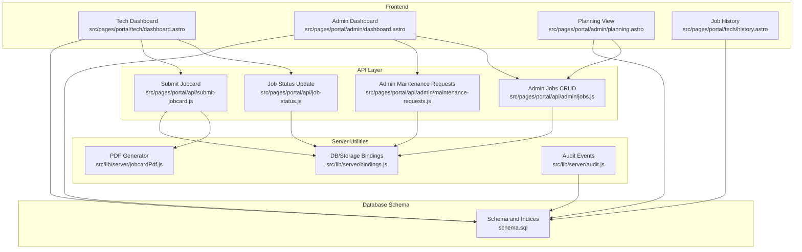
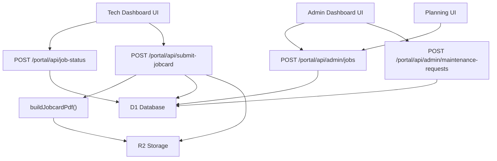
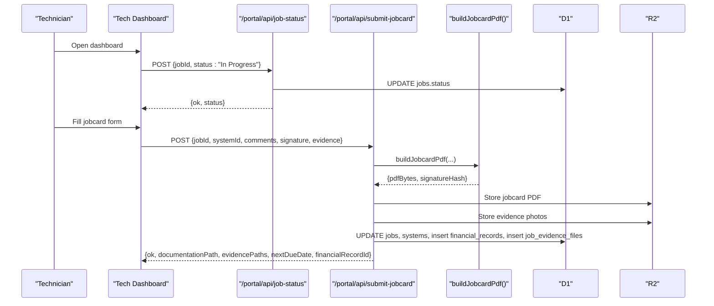
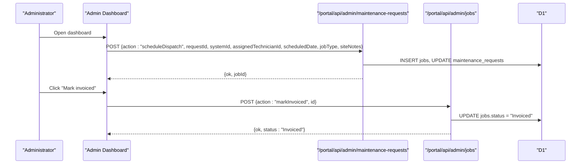
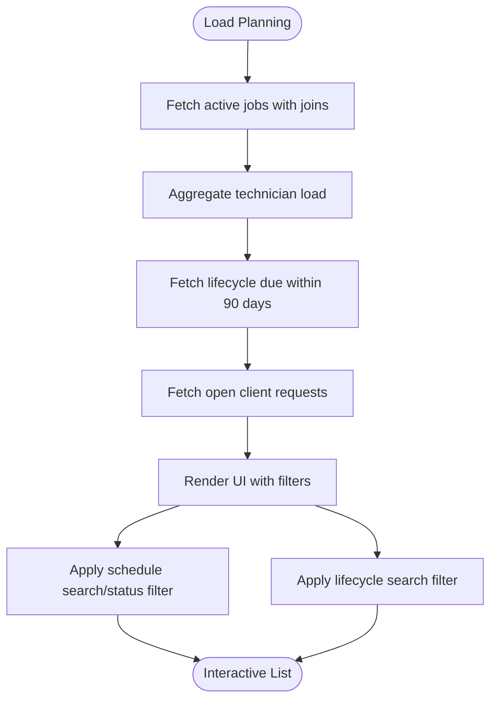
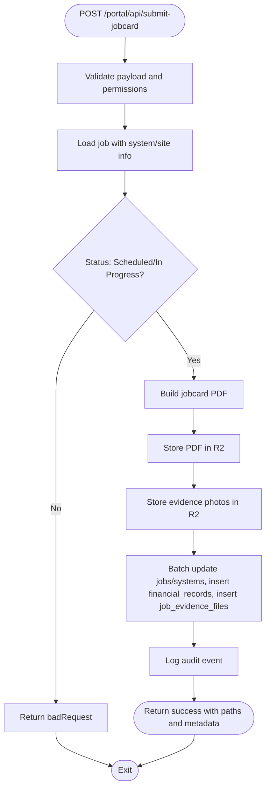
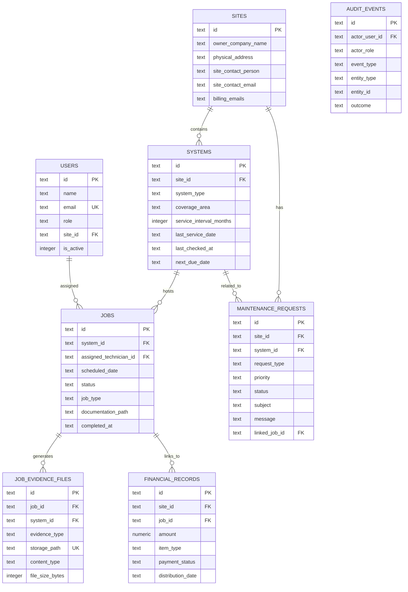
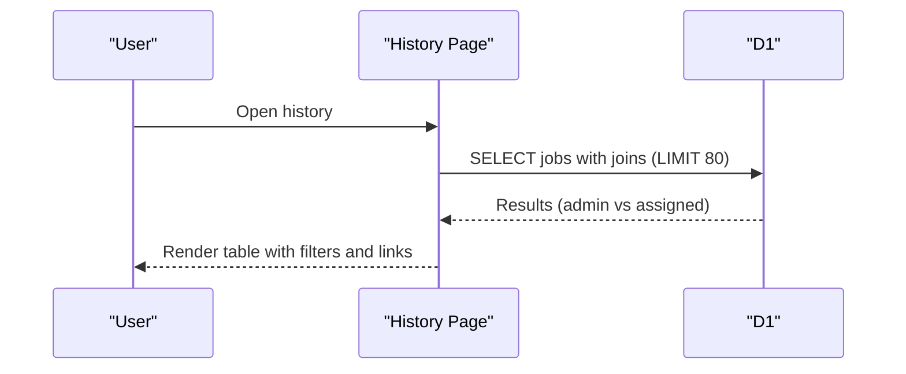
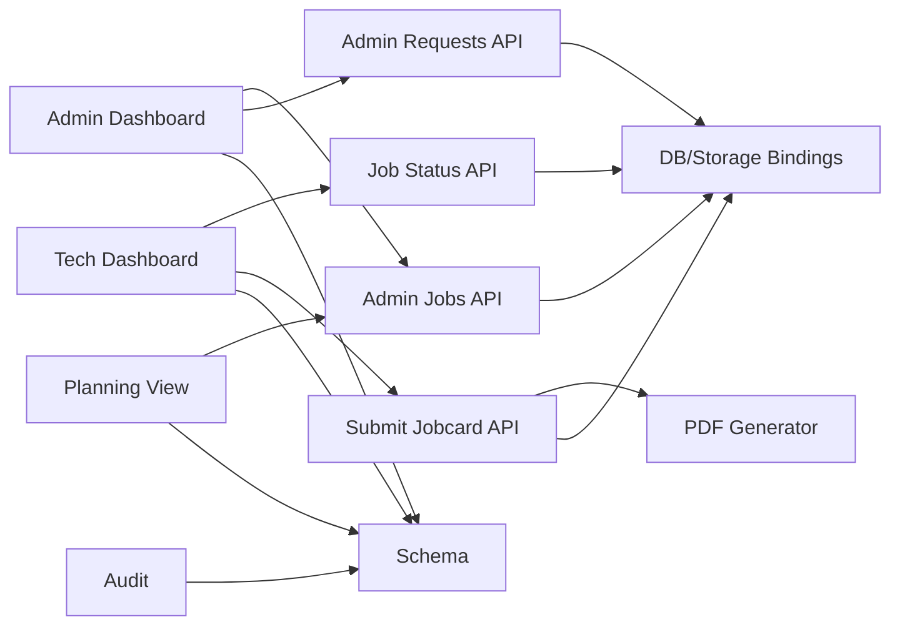

# Dispatch Management System

<cite>
**Referenced Files in This Document**
- [schema.sql](file://schema.sql)
- [dashboard.astro](file://src/pages/portal/tech/dashboard.astro)
- [dashboard.astro](file://src/pages/portal/admin/dashboard.astro)
- [planning.astro](file://src/pages/portal/admin/planning.astro)
- [jobs.js](file://src/pages/portal/api/admin/jobs.js)
- [submit-jobcard.js](file://src/pages/portal/api/submit-jobcard.js)
- [job-status.js](file://src/pages/portal/api/job-status.js)
- [maintenance-requests.js](file://src/pages/portal/api/admin/maintenance-requests.js)
- [jobcardPdf.js](file://src/lib/server/jobcardPdf.js)
- [history.astro](file://src/pages/portal/tech/history.astro)
- [bindings.js](file://src/lib/server/bindings.js)
- [audit.js](file://src/lib/server/audit.js)
</cite>

## Table of Contents
1. [Introduction](#introduction)
2. [Project Structure](#project-structure)
3. [Core Components](#core-components)
4. [Architecture Overview](#architecture-overview)
5. [Detailed Component Analysis](#detailed-component-analysis)
6. [Dependency Analysis](#dependency-analysis)
7. [Performance Considerations](#performance-considerations)
8. [Troubleshooting Guide](#troubleshooting-guide)
9. [Conclusion](#conclusion)

## Introduction
This document describes the Dispatch Management System that powers field service dispatches, technician workflows, job documentation, and administrative oversight. It covers the complete lifecycle from client request through dispatch scheduling, field execution, documentation generation, evidence collection, and financial follow-up. The system integrates Cloudflare Workers primitives (D1 database and R2 storage) with Astro-based frontend pages and server-side API endpoints.

## Project Structure
The system is organized around:
- Database schema defining jobs, systems, sites, maintenance requests, and supporting entities
- Technician and admin dashboards for dispatch visibility and control
- Administrative planning and operations views
- Server-side API endpoints for job administration, status updates, and jobcard submission
- PDF generation for jobcards and evidence handling
- Audit logging and access controls

**Diagram sources**
- [dashboard.astro:1-303](file://src/pages/portal/tech/dashboard.astro#L1-L303)
- [dashboard.astro:1-395](file://src/pages/portal/admin/dashboard.astro#L1-L395)
- [planning.astro:1-375](file://src/pages/portal/admin/planning.astro#L1-L375)
- [jobs.js:1-96](file://src/pages/portal/api/admin/jobs.js#L1-L96)
- [submit-jobcard.js:1-307](file://src/pages/portal/api/submit-jobcard.js#L1-L307)
- [job-status.js:1-76](file://src/pages/portal/api/job-status.js#L1-L76)
- [maintenance-requests.js:1-102](file://src/pages/portal/api/admin/maintenance-requests.js#L1-L102)
- [jobcardPdf.js:1-236](file://src/lib/server/jobcardPdf.js#L1-L236)
- [bindings.js:1-42](file://src/lib/server/bindings.js#L1-L42)
- [audit.js:1-33](file://src/lib/server/audit.js#L1-L33)
- [schema.sql:1-245](file://schema.sql#L1-L245)

**Section sources**
- [schema.sql:1-245](file://schema.sql#L1-L245)
- [dashboard.astro:1-303](file://src/pages/portal/tech/dashboard.astro#L1-L303)
- [dashboard.astro:1-395](file://src/pages/portal/admin/dashboard.astro#L1-L395)
- [planning.astro:1-375](file://src/pages/portal/admin/planning.astro#L1-L375)
- [jobs.js:1-96](file://src/pages/portal/api/admin/jobs.js#L1-L96)
- [submit-jobcard.js:1-307](file://src/pages/portal/api/submit-jobcard.js#L1-L307)
- [job-status.js:1-76](file://src/pages/portal/api/job-status.js#L1-L76)
- [maintenance-requests.js:1-102](file://src/pages/portal/api/admin/maintenance-requests.js#L1-L102)
- [jobcardPdf.js:1-236](file://src/lib/server/jobcardPdf.js#L1-L236)
- [bindings.js:1-42](file://src/lib/server/bindings.js#L1-L42)
- [audit.js:1-33](file://src/lib/server/audit.js#L1-L33)

## Core Components
- Database schema: Defines jobs, systems, sites, maintenance requests, financial records, job evidence, and audit logs with appropriate constraints and indexes.
- Technician dashboard: Lists assigned dispatches, allows starting jobs, and submits jobcards with evidence and signatures.
- Admin dashboard: Provides operational overview, request queue, exception tracking, and invoicing controls.
- Planning view: Displays active schedules, technician load, lifecycle due dates, and open client requests.
- Admin job administration: Creates, updates, and marks jobs as invoiced.
- Jobcard submission pipeline: Validates inputs, generates PDF, stores documents and evidence, updates job/system state, and creates financial records.
- PDF generator: Builds jobcards with embedded signature hashes and structured content.
- Audit and bindings: Centralized DB/storage access and audit event logging.

**Section sources**
- [schema.sql:49-126](file://schema.sql#L49-L126)
- [dashboard.astro:11-36](file://src/pages/portal/tech/dashboard.astro#L11-L36)
- [dashboard.astro:20-122](file://src/pages/portal/admin/dashboard.astro#L20-L122)
- [planning.astro:42-139](file://src/pages/portal/admin/planning.astro#L42-L139)
- [jobs.js:10-91](file://src/pages/portal/api/admin/jobs.js#L10-L91)
- [submit-jobcard.js:51-301](file://src/pages/portal/api/submit-jobcard.js#L51-L301)
- [jobcardPdf.js:128-235](file://src/lib/server/jobcardPdf.js#L128-L235)
- [audit.js:3-28](file://src/lib/server/audit.js#L3-L28)
- [bindings.js:3-16](file://src/lib/server/bindings.js#L3-L16)

## Architecture Overview
The system follows a layered architecture:
- Presentation layer: Astro pages render dashboards and forms.
- API layer: Server endpoints handle job administration, status updates, and jobcard submission.
- Domain services: PDF generation and storage utilities.
- Persistence layer: Cloudflare D1 for relational data and R2 for binary documents.

**Diagram sources**
- [dashboard.astro:227-300](file://src/pages/portal/tech/dashboard.astro#L227-L300)
- [dashboard.astro:320-392](file://src/pages/portal/admin/dashboard.astro#L320-L392)
- [planning.astro:328-373](file://src/pages/portal/admin/planning.astro#L328-L373)
- [job-status.js:15-71](file://src/pages/portal/api/job-status.js#L15-L71)
- [submit-jobcard.js:51-301](file://src/pages/portal/api/submit-jobcard.js#L51-L301)
- [jobs.js:10-91](file://src/pages/portal/api/admin/jobs.js#L10-L91)
- [maintenance-requests.js:10-96](file://src/pages/portal/api/admin/maintenance-requests.js#L10-L96)
- [jobcardPdf.js:128-235](file://src/lib/server/jobcardPdf.js#L128-L235)
- [bindings.js:3-16](file://src/lib/server/bindings.js#L3-L16)

## Detailed Component Analysis

### Technician Dashboard: Dispatch Assignment and Closure
The technician dashboard presents scheduled and in-progress jobs, supports starting a job, and captures jobcard details including evidence photos and a signature. The UI posts to server endpoints to update status and submit jobcards.

**Diagram sources**
- [dashboard.astro:227-300](file://src/pages/portal/tech/dashboard.astro#L227-L300)
- [job-status.js:15-71](file://src/pages/portal/api/job-status.js#L15-L71)
- [submit-jobcard.js:51-301](file://src/pages/portal/api/submit-jobcard.js#L51-L301)
- [jobcardPdf.js:128-235](file://src/lib/server/jobcardPdf.js#L128-L235)

**Section sources**
- [dashboard.astro:11-36](file://src/pages/portal/tech/dashboard.astro#L11-L36)
- [dashboard.astro:57-154](file://src/pages/portal/tech/dashboard.astro#L57-L154)
- [job-status.js:15-71](file://src/pages/portal/api/job-status.js#L15-L71)
- [submit-jobcard.js:51-301](file://src/pages/portal/api/submit-jobcard.js#L51-L301)

### Admin Dashboard: Operations Review and Dispatch Management
The admin dashboard aggregates statistics, displays recent completions, active dispatches, lifecycle due dates, client requests, missing documents, and finance follow-ups. It supports updating request statuses and scheduling dispatches from requests.

**Diagram sources**
- [dashboard.astro:331-392](file://src/pages/portal/admin/dashboard.astro#L331-L392)
- [maintenance-requests.js:10-96](file://src/pages/portal/api/admin/maintenance-requests.js#L10-L96)
- [jobs.js:10-91](file://src/pages/portal/api/admin/jobs.js#L10-L91)

**Section sources**
- [dashboard.astro:20-122](file://src/pages/portal/admin/dashboard.astro#L20-L122)
- [dashboard.astro:331-392](file://src/pages/portal/admin/dashboard.astro#L331-L392)
- [maintenance-requests.js:10-96](file://src/pages/portal/api/admin/maintenance-requests.js#L10-L96)
- [jobs.js:10-91](file://src/pages/portal/api/admin/jobs.js#L10-L91)

### Planning View: Dispatch Load and Lifecycle Exposure
The planning view shows active schedules, technician load snapshots, lifecycle due calendars, and open client requests. It includes filtering and search capabilities for dispatches and systems.

**Diagram sources**
- [planning.astro:42-139](file://src/pages/portal/admin/planning.astro#L42-L139)
- [planning.astro:328-373](file://src/pages/portal/admin/planning.astro#L328-L373)

**Section sources**
- [planning.astro:42-139](file://src/pages/portal/admin/planning.astro#L42-L139)
- [planning.astro:328-373](file://src/pages/portal/admin/planning.astro#L328-L373)

### Job Submission Pipeline: Validation, PDF Generation, Storage, and Updates
The job submission endpoint validates inputs, ensures the job belongs to the authenticated technician and is in a valid state, builds a PDF with embedded signature hash, stores documents and evidence, updates job/system state, and creates financial records if needed.

**Diagram sources**
- [submit-jobcard.js:51-301](file://src/pages/portal/api/submit-jobcard.js#L51-L301)
- [jobcardPdf.js:128-235](file://src/lib/server/jobcardPdf.js#L128-L235)
- [bindings.js:3-16](file://src/lib/server/bindings.js#L3-L16)
- [audit.js:3-28](file://src/lib/server/audit.js#L3-L28)

**Section sources**
- [submit-jobcard.js:51-301](file://src/pages/portal/api/submit-jobcard.js#L51-L301)
- [jobcardPdf.js:128-235](file://src/lib/server/jobcardPdf.js#L128-L235)
- [audit.js:3-28](file://src/lib/server/audit.js#L3-L28)

### Database Schema: Entities and Relationships
The schema defines core entities and their relationships, with constraints ensuring data integrity and indexes optimizing common queries.

**Diagram sources**
- [schema.sql:3-126](file://schema.sql#L3-L126)

**Section sources**
- [schema.sql:3-126](file://schema.sql#L3-L126)

### Job History System: Reporting and Access Controls
The job history page lists completed and invoiced jobs, filtered by technician or all jobs for admins. It supports searching and status filtering and links to stored PDFs.

**Diagram sources**
- [history.astro:11-43](file://src/pages/portal/tech/history.astro#L11-L43)
- [history.astro:95-131](file://src/pages/portal/tech/history.astro#L95-L131)

**Section sources**
- [history.astro:11-43](file://src/pages/portal/tech/history.astro#L11-L43)
- [history.astro:95-131](file://src/pages/portal/tech/history.astro#L95-L131)

## Dependency Analysis
Key dependencies and coupling:
- UI pages depend on server endpoints for all mutations and most reads.
- API endpoints depend on centralized bindings for DB and storage access.
- Jobcard submission depends on PDF generation and storage utilities.
- Audit logging is invoked across endpoints for compliance tracking.
- Database schema enforces referential integrity and indexes optimize queries.

**Diagram sources**
- [dashboard.astro:1-303](file://src/pages/portal/tech/dashboard.astro#L1-L303)
- [dashboard.astro:1-395](file://src/pages/portal/admin/dashboard.astro#L1-L395)
- [planning.astro:1-375](file://src/pages/portal/admin/planning.astro#L1-L375)
- [jobs.js:1-96](file://src/pages/portal/api/admin/jobs.js#L1-L96)
- [submit-jobcard.js:1-307](file://src/pages/portal/api/submit-jobcard.js#L1-L307)
- [job-status.js:1-76](file://src/pages/portal/api/job-status.js#L1-L76)
- [maintenance-requests.js:1-102](file://src/pages/portal/api/admin/maintenance-requests.js#L1-L102)
- [jobcardPdf.js:1-236](file://src/lib/server/jobcardPdf.js#L1-L236)
- [bindings.js:1-42](file://src/lib/server/bindings.js#L1-L42)
- [audit.js:1-33](file://src/lib/server/audit.js#L1-L33)
- [schema.sql:1-245](file://schema.sql#L1-L245)

**Section sources**
- [bindings.js:3-16](file://src/lib/server/bindings.js#L3-L16)
- [audit.js:3-28](file://src/lib/server/audit.js#L3-L28)
- [schema.sql:160-183](file://schema.sql#L160-L183)

## Performance Considerations
- Indexes on jobs, systems, maintenance_requests, and document access logs improve query performance for common filters and joins.
- Batched writes during jobcard submission reduce round-trips.
- PDF generation runs client-side signature normalization and hashing to minimize server CPU load.
- Pagination and limits in dashboard queries prevent large result sets.
- Storage metadata and HTTP content disposition optimize document delivery.

[No sources needed since this section provides general guidance]

## Troubleshooting Guide
Common issues and resolutions:
- Unauthorized or forbidden access: Ensure the user role matches the endpoint requirement (e.g., only technicians can start jobs or submit jobcards).
- Invalid job status transitions: Jobs must be in "Scheduled" or "In Progress" to be started or closed.
- Missing or invalid signature: Signature is mandatory and must be a valid image data URI or base64.
- Evidence validation errors: Photos must be JPEG/PNG/WebP and under 1.5 MB; maximum 3 photos per submission.
- Financial record conflicts: Invoice creation is skipped if an existing financial record exists for the job.
- Audit failures: Audit writes are best-effort and logged to console if they fail.

**Section sources**
- [job-status.js:15-71](file://src/pages/portal/api/job-status.js#L15-L71)
- [submit-jobcard.js:51-301](file://src/pages/portal/api/submit-jobcard.js#L51-L301)
- [audit.js:29-31](file://src/lib/server/audit.js#L29-L31)

## Conclusion
The Dispatch Management System provides a robust, auditable workflow for managing field service dispatches. It integrates technician self-service with administrative oversight, automates documentation and evidence capture, and maintains lifecycle visibility through planning tools. The modular design, centralized bindings, and strong schema constraints support scalability and maintainability.