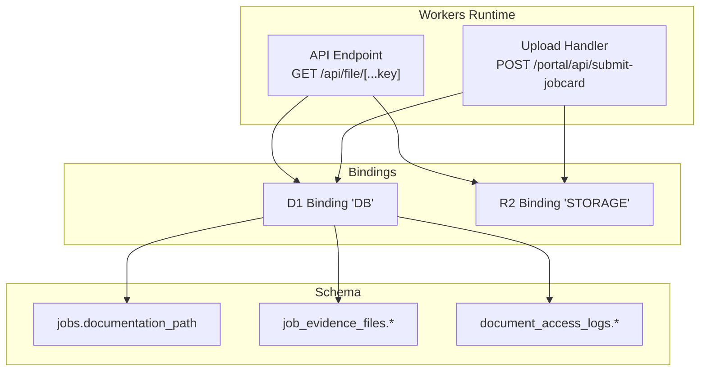
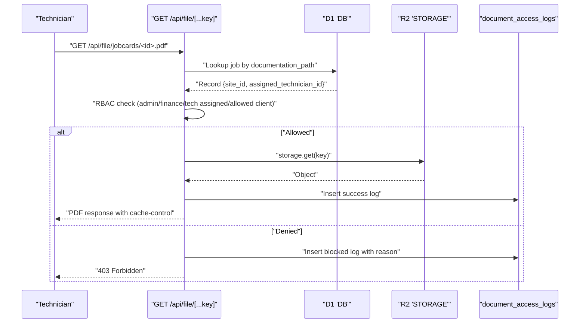
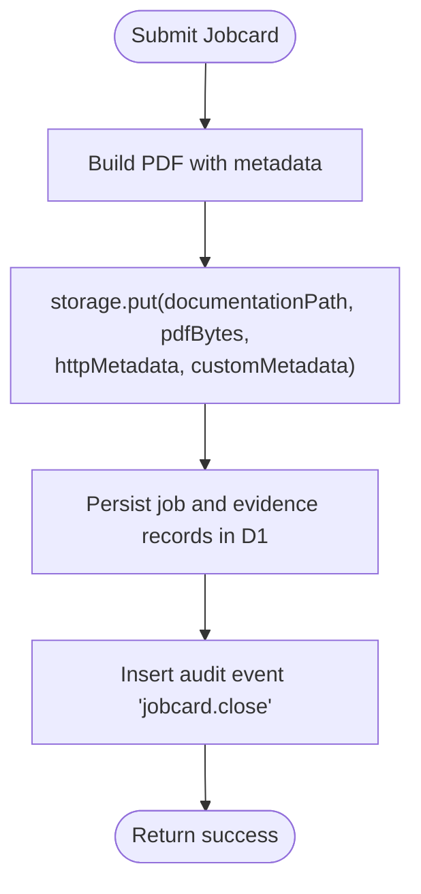
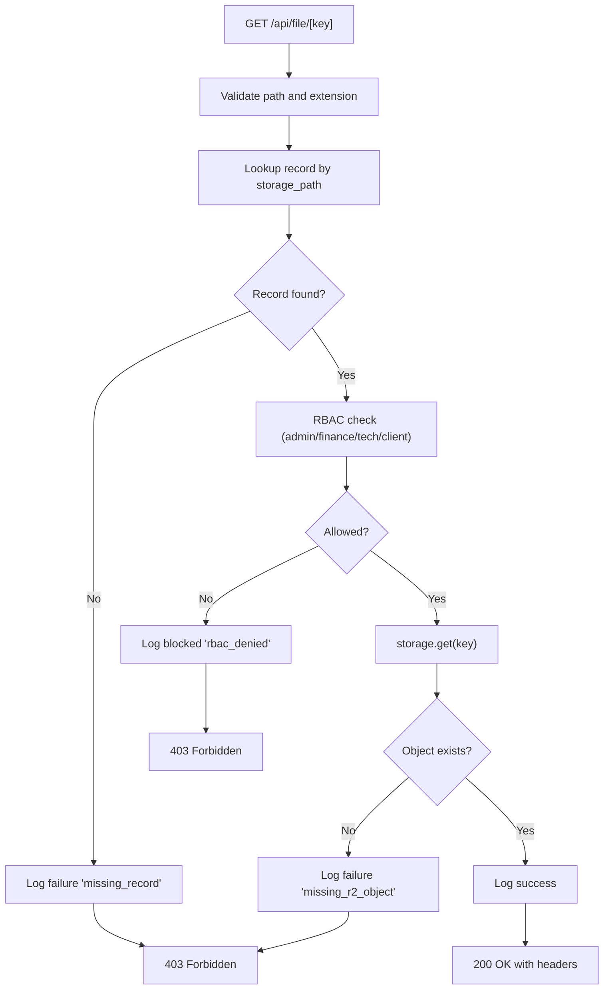
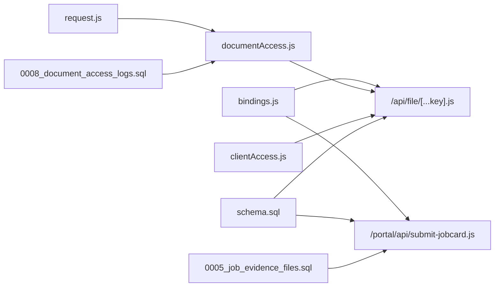

# File Storage & Management

<cite>
**Referenced Files in This Document**
- [wrangler.jsonc](file://wrangler.jsonc)
- [schema.sql](file://schema.sql)
- [src/lib/server/bindings.js](file://src/lib/server/bindings.js)
- [src/lib/server/request.js](file://src/lib/server/request.js)
- [src/lib/server/documentAccess.js](file://src/lib/server/documentAccess.js)
- [src/pages/portal/api/file/[...key].js](file://src/pages/portal/api/file/[...key].js)
- [src/pages/portal/api/submit-jobcard.js](file://src/pages/portal/api/submit-jobcard.js)
- [src/lib/server/clientAccess.js](file://src/lib/server/clientAccess.js)
- [migrations/0005_job_evidence_files.sql](file://migrations/0005_job_evidence_files.sql)
- [migrations/0008_document_access_logs.sql](file://migrations/0008_document_access_logs.sql)
- [docs/roadmap/OPERATIONS_SOP.md](file://docs/roadmap/OPERATIONS_SOP.md)
</cite>

## Table of Contents
1. [Introduction](#introduction)
2. [Project Structure](#project-structure)
3. [Core Components](#core-components)
4. [Architecture Overview](#architecture-overview)
5. [Detailed Component Analysis](#detailed-component-analysis)
6. [Dependency Analysis](#dependency-analysis)
7. [Performance Considerations](#performance-considerations)
8. [Troubleshooting Guide](#troubleshooting-guide)
9. [Conclusion](#conclusion)
10. [Appendices](#appendices)

## Introduction
This document explains the file storage and management system built on Cloudflare R2 and D1. It covers how documents are uploaded, stored, validated, retrieved, and audited; how access control is enforced; and how compliance and retention are supported. It also outlines operational logging, security validation, and practical workflows for job documentation and evidence collection.

## Project Structure
The file storage system spans configuration, database schema, server-side bindings, request fingerprinting, access logging, and API endpoints for uploads and downloads.

**Diagram sources**
- [wrangler.jsonc:27-32](file://wrangler.jsonc#L27-L32)
- [src/pages/portal/api/file/[...key].js](file://src/pages/portal/api/file/[...key].js#L1-L137)
- [src/pages/portal/api/submit-jobcard.js:157-193](file://src/pages/portal/api/submit-jobcard.js#L157-L193)
- [schema.sql:49-62](file://schema.sql#L49-L62)
- [schema.sql:115-126](file://schema.sql#L115-L126)
- [schema.sql:128-140](file://schema.sql#L128-L140)

**Section sources**
- [wrangler.jsonc:1-38](file://wrangler.jsonc#L1-L38)
- [schema.sql:1-245](file://schema.sql#L1-L245)

## Core Components
- Cloudflare Bindings: D1 database and R2 bucket are exposed via Workers runtime bindings.
- Storage Paths: Documents are organized under two prefixes:
  - jobcards/<uuid>.pdf for job completion PDFs
  - job-evidence/<jobId>/<uuid>.{jpg,jpeg,png,webp} for evidence photos
- Access Control: Role-based checks plus client site access mapping.
- Audit and Logging: Dedicated document access logs and audit events track outcomes and reasons.
- Upload Pipeline: Job completion handler builds a PDF and stores it with metadata; evidence photos are normalized and persisted.

**Section sources**
- [wrangler.jsonc:27-32](file://wrangler.jsonc#L27-L32)
- [src/lib/server/bindings.js:1-41](file://src/lib/server/bindings.js#L1-L41)
- [src/pages/portal/api/file/[...key].js](file://src/pages/portal/api/file/[...key].js#L14-L19)
- [src/pages/portal/api/submit-jobcard.js:157-193](file://src/pages/portal/api/submit-jobcard.js#L157-L193)
- [schema.sql:58-58](file://schema.sql#L58-L58)
- [schema.sql:121-121](file://schema.sql#L121-L121)
- [src/lib/server/documentAccess.js:3-27](file://src/lib/server/documentAccess.js#L3-L27)

## Architecture Overview
The system integrates Cloudflare Workers with D1 and R2. Uploads are handled by the job submission endpoint, which writes PDFs to R2 and persists metadata to D1. Downloads are served by a dedicated API endpoint that enforces access control and records access logs.

**Diagram sources**
- [src/pages/portal/api/file/[...key].js](file://src/pages/portal/api/file/[...key].js#L21-L127)
- [schema.sql:128-140](file://schema.sql#L128-L140)

**Section sources**
- [src/pages/portal/api/file/[...key].js](file://src/pages/portal/api/file/[...key].js#L1-L137)
- [src/lib/server/documentAccess.js:3-27](file://src/lib/server/documentAccess.js#L3-L27)

## Detailed Component Analysis

### Cloudflare Bindings and Environment
- D1 binding "DB" and R2 binding "STORAGE" are required and validated at runtime.
- Standard service fee is exposed via a typed getter.

**Section sources**
- [src/lib/server/bindings.js:1-41](file://src/lib/server/bindings.js#L1-L41)
- [wrangler.jsonc:27-36](file://wrangler.jsonc#L27-L36)

### Storage Path Organization and Validation
- Job documentation: jobcards/<uuid>.pdf
- Evidence photos: job-evidence/<jobId>/<uuid>.{jpg,jpeg,png,webp}
- Path validation rejects non-conforming keys and disallows path traversal.

**Section sources**
- [src/pages/portal/api/file/[...key].js](file://src/pages/portal/api/file/[...key].js#L14-L19)
- [schema.sql:58-58](file://schema.sql#L58-L58)
- [schema.sql:121-121](file://schema.sql#L121-L121)

### Upload Mechanisms (Job Completion)
- Builds a PDF with embedded metadata and signature hash.
- Stores the PDF in R2 with HTTP metadata (content type, content disposition) and custom metadata (jobId, systemId, technicianId, signatureSha256, completedAt, faultCategory).
- Persists evidence photos into job_evidence_files with constraints on content type and size.
- Inserts audit events for job closure.

**Diagram sources**
- [src/pages/portal/api/submit-jobcard.js:157-193](file://src/pages/portal/api/submit-jobcard.js#L157-L193)
- [src/pages/portal/api/submit-jobcard.js:246-257](file://src/pages/portal/api/submit-jobcard.js#L246-L257)

**Section sources**
- [src/pages/portal/api/submit-jobcard.js:157-193](file://src/pages/portal/api/submit-jobcard.js#L157-L193)
- [src/pages/portal/api/submit-jobcard.js:246-257](file://src/pages/portal/api/submit-jobcard.js#L246-L257)

### Download and Access Control
- Validates path format and disallows traversal.
- Resolves the requested key to either a job documentation_path or a job evidence storage_path.
- Enforces RBAC:
  - Admin and Finance roles: always allowed
  - Technician: must be assigned to the job
  - Client: must have access to the site
- Records access logs and audit events for success, failure, and block outcomes.

**Diagram sources**
- [src/pages/portal/api/file/[...key].js](file://src/pages/portal/api/file/[...key].js#L14-L127)
- [src/lib/server/documentAccess.js:3-27](file://src/lib/server/documentAccess.js#L3-L27)

**Section sources**
- [src/pages/portal/api/file/[...key].js](file://src/pages/portal/api/file/[...key].js#L21-L127)
- [src/lib/server/clientAccess.js:44-48](file://src/lib/server/clientAccess.js#L44-L48)

### Metadata Management and Constraints
- Jobs: documentation_path must match jobcards/<uuid>.pdf pattern.
- Evidence: storage_path must match job-evidence/<jobId>/...; content_type restricted to image/jpeg, image/png, image/webp; file_size_bytes constrained to 1–1,572,864 bytes.
- Document access logs: enforce storage_path prefix constraints and document_type enumeration.

**Section sources**
- [schema.sql:58-58](file://schema.sql#L58-L58)
- [schema.sql:121-123](file://schema.sql#L121-L123)
- [schema.sql:128-140](file://schema.sql#L128-L140)
- [migrations/0005_job_evidence_files.sql:6-9](file://migrations/0005_job_evidence_files.sql#L6-L9)
- [migrations/0008_document_access_logs.sql:6-7](file://migrations/0008_document_access_logs.sql#L6-L7)

### Security Validation and Fingerprinting
- IP and User-Agent are hashed for logging and correlation.
- Access logs include ip_hash and user_agent for forensic analysis.

**Section sources**
- [src/lib/server/request.js:26-35](file://src/lib/server/request.js#L26-L35)
- [src/lib/server/documentAccess.js:5-24](file://src/lib/server/documentAccess.js#L5-L24)

### Integration with Job Documentation and Evidence Collection
- Job completion PDFs are stored with custom metadata enabling downstream processing and verification.
- Evidence photos are normalized client-side (type and size checks) and persisted with captions and content types.

**Section sources**
- [src/pages/portal/api/submit-jobcard.js:34-49](file://src/pages/portal/api/submit-jobcard.js#L34-L49)
- [src/pages/portal/api/submit-jobcard.js:157-193](file://src/pages/portal/api/submit-jobcard.js#L157-L193)
- [src/pages/portal/api/submit-jobcard.js:246-257](file://src/pages/portal/api/submit-jobcard.js#L246-L257)

### Compliance and Retention Support
- Document access logs capture outcomes and reasons for access attempts.
- Audit exports support filtering by category including "document" and outcomes for compliance reporting.
- SOP guidance emphasizes reviewing access logs during disputes and audits.

**Section sources**
- [migrations/0008_document_access_logs.sql:1-18](file://migrations/0008_document_access_logs.sql#L1-L18)
- [src/lib/server/documentAccess.js:3-27](file://src/lib/server/documentAccess.js#L3-L27)
- [src/pages/portal/api/admin/audit-export.js:8-15](file://src/pages/portal/api/admin/audit-export.js#L8-L15)
- [docs/roadmap/OPERATIONS_SOP.md:410-416](file://docs/roadmap/OPERATIONS_SOP.md#L410-L416)

## Dependency Analysis
The following diagram shows the primary dependencies among components involved in file storage and retrieval.

**Diagram sources**
- [src/lib/server/bindings.js:1-41](file://src/lib/server/bindings.js#L1-L41)
- [src/pages/portal/api/file/[...key].js](file://src/pages/portal/api/file/[...key].js#L1-L137)
- [src/pages/portal/api/submit-jobcard.js:157-193](file://src/pages/portal/api/submit-jobcard.js#L157-L193)
- [src/lib/server/request.js:26-35](file://src/lib/server/request.js#L26-L35)
- [src/lib/server/documentAccess.js:3-27](file://src/lib/server/documentAccess.js#L3-L27)
- [src/lib/server/clientAccess.js:44-48](file://src/lib/server/clientAccess.js#L44-L48)
- [schema.sql:49-62](file://schema.sql#L49-L62)
- [schema.sql:115-126](file://schema.sql#L115-L126)
- [schema.sql:128-140](file://schema.sql#L128-L140)
- [migrations/0005_job_evidence_files.sql:1-16](file://migrations/0005_job_evidence_files.sql#L1-L16)
- [migrations/0008_document_access_logs.sql:1-18](file://migrations/0008_document_access_logs.sql#L1-L18)

**Section sources**
- [src/lib/server/bindings.js:1-41](file://src/lib/server/bindings.js#L1-L41)
- [src/pages/portal/api/file/[...key].js](file://src/pages/portal/api/file/[...key].js#L1-L137)
- [src/pages/portal/api/submit-jobcard.js:157-193](file://src/pages/portal/api/submit-jobcard.js#L157-L193)
- [src/lib/server/documentAccess.js:3-27](file://src/lib/server/documentAccess.js#L3-L27)
- [src/lib/server/clientAccess.js:44-48](file://src/lib/server/clientAccess.js#L44-L48)
- [schema.sql:49-62](file://schema.sql#L49-L62)
- [schema.sql:115-126](file://schema.sql#L115-L126)
- [schema.sql:128-140](file://schema.sql#L128-L140)
- [migrations/0005_job_evidence_files.sql:1-16](file://migrations/0005_job_evidence_files.sql#L1-L16)
- [migrations/0008_document_access_logs.sql:1-18](file://migrations/0008_document_access_logs.sql#L1-L18)

## Performance Considerations
- Cache-Control: Responses set private caching to balance freshness and performance.
- Content-Type: Defaults are applied conservatively when unknown.
- Indexes: D1 indexes on document access logs and evidence tables optimize lookups.
- Size limits: Evidence photos are capped at 1.5 MB to reduce latency and storage costs.

**Section sources**
- [src/pages/portal/api/file/[...key].js](file://src/pages/portal/api/file/[...key].js#L121-L126)
- [schema.sql:178-180](file://schema.sql#L178-L180)
- [schema.sql:176-177](file://schema.sql#L176-L177)
- [src/pages/portal/api/submit-jobcard.js:34-36](file://src/pages/portal/api/submit-jobcard.js#L34-L36)

## Troubleshooting Guide
Common issues and diagnostics:
- Invalid path or traversal: The endpoint rejects keys not matching expected prefixes or containing path traversal segments.
- Missing record: If the storage_path does not resolve to a job or evidence record, access is denied and logged as a failure.
- Missing R2 object: If the object is not present in the bucket, a 404 is returned after logging a failure.
- RBAC denied: Access is blocked for unprivileged users or clients without site access, with a blocked outcome recorded.
- Unauthorized or missing session: Requests without a valid user context receive 401.
- Upload errors: Client-side evidence validation ensures acceptable types and sizes; server-side normalization throws descriptive errors.

Operational checks:
- Verify R2 bucket binding and D1 database binding are configured.
- Review document_access_logs for recent access attempts and reasons.
- Export audit events filtered by "document" category for compliance reviews.

**Section sources**
- [src/pages/portal/api/file/[...key].js](file://src/pages/portal/api/file/[...key].js#L14-L19)
- [src/pages/portal/api/file/[...key].js](file://src/pages/portal/api/file/[...key].js#L46-L63)
- [src/pages/portal/api/file/[...key].js](file://src/pages/portal/api/file/[...key].js#L92-L103)
- [src/pages/portal/api/file/[...key].js](file://src/pages/portal/api/file/[...key].js#L72-L90)
- [src/pages/portal/api/file/[...key].js](file://src/pages/portal/api/file/[...key].js#L12-L12)
- [src/pages/portal/api/submit-jobcard.js:34-49](file://src/pages/portal/api/submit-jobcard.js#L34-L49)
- [src/lib/server/documentAccess.js:3-27](file://src/lib/server/documentAccess.js#L3-L27)
- [src/pages/portal/api/admin/audit-export.js:8-15](file://src/pages/portal/api/admin/audit-export.js#L8-L15)

## Conclusion
The file storage and management system leverages Cloudflare Workers, D1, and R2 to securely store and serve job documentation and evidence. Strict path validation, robust access control, and comprehensive logging enable compliance and operational visibility. Uploads are standardized with metadata and constraints, while downloads enforce RBAC and record outcomes for auditing.

## Appendices

### Practical Examples

- Upload a job completion PDF:
  - Build the PDF with required metadata.
  - Store to R2 under jobcards/<uuid>.pdf with appropriate HTTP and custom metadata.
  - Persist job and evidence records in D1.

- Retrieve a job documentation:
  - Call GET /api/file/jobcards/<id>.pdf.
  - Ensure RBAC passes; otherwise expect a blocked or failure outcome in logs.

- Retrieve evidence photos:
  - Call GET /api/file/job-evidence/<jobId>/<uuid>.{jpg,jpeg,png,webp}.
  - Validate content type and size constraints on upload.

- Access logging and retention:
  - Monitor document_access_logs for access trends and anomalies.
  - Use audit exports to generate compliance reports.

**Section sources**
- [src/pages/portal/api/submit-jobcard.js:157-193](file://src/pages/portal/api/submit-jobcard.js#L157-L193)
- [src/pages/portal/api/file/[...key].js](file://src/pages/portal/api/file/[...key].js#L14-L127)
- [migrations/0008_document_access_logs.sql:1-18](file://migrations/0008_document_access_logs.sql#L1-L18)
- [src/pages/portal/api/admin/audit-export.js:8-15](file://src/pages/portal/api/admin/audit-export.js#L8-L15)