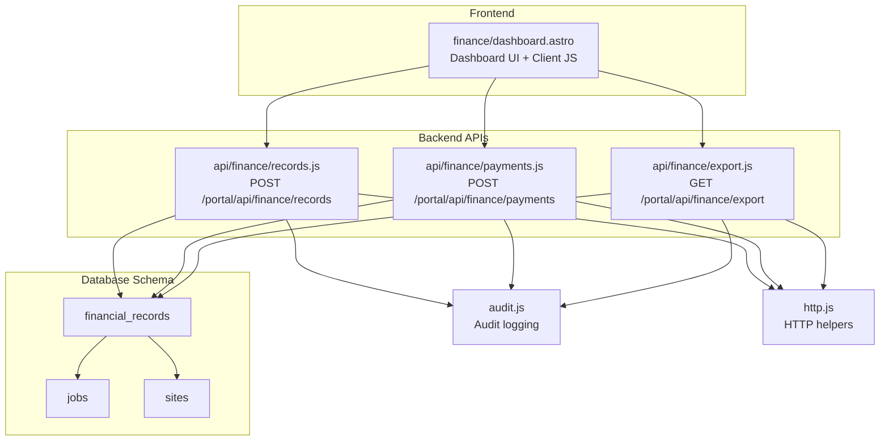
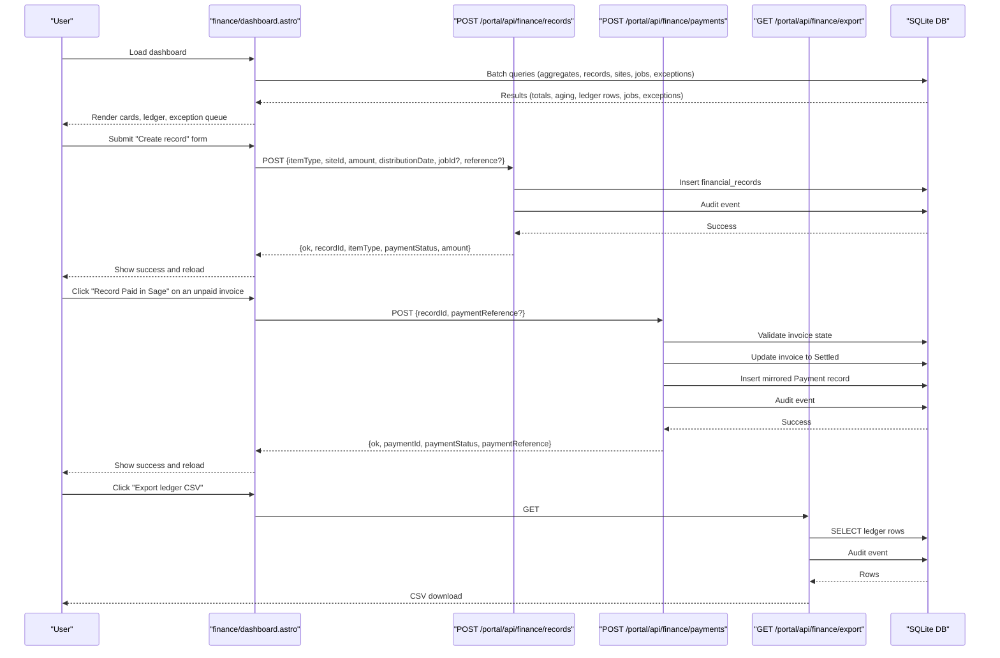
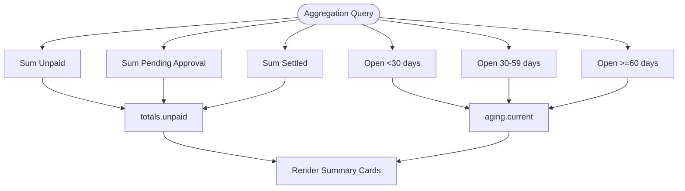
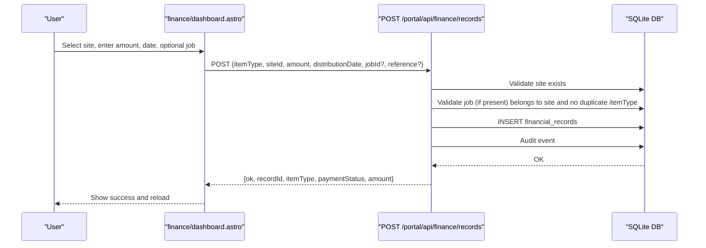
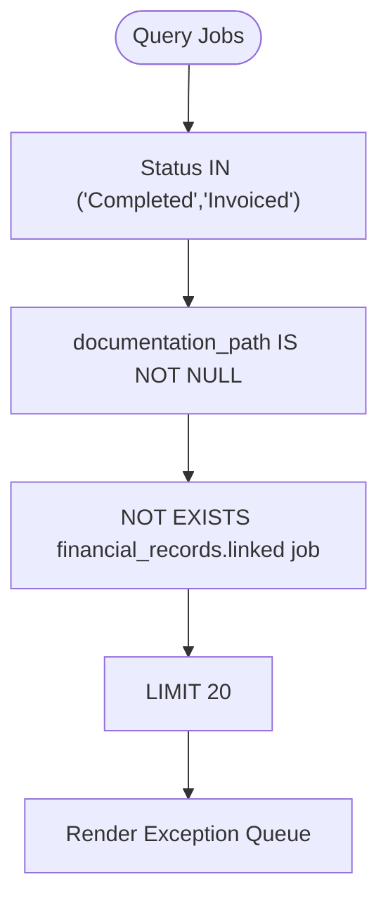
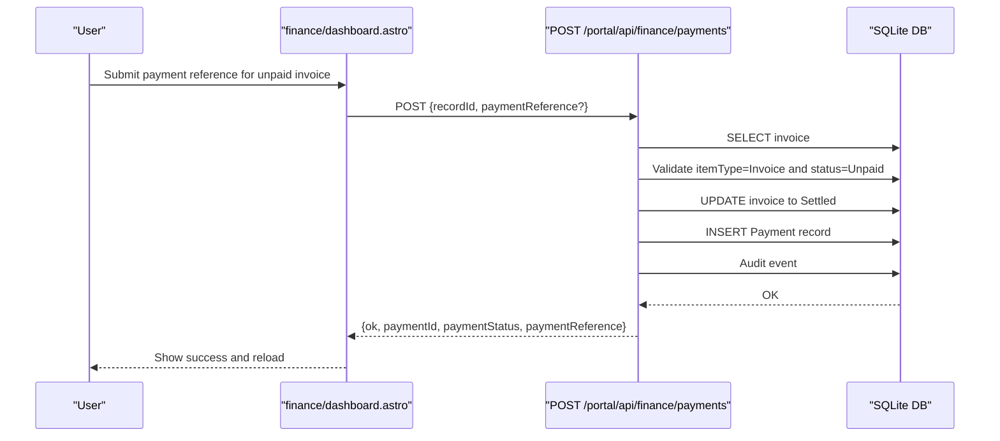
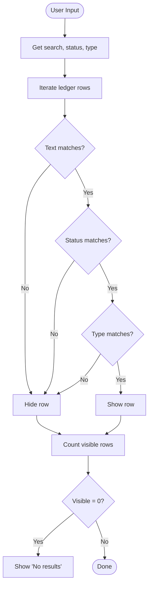
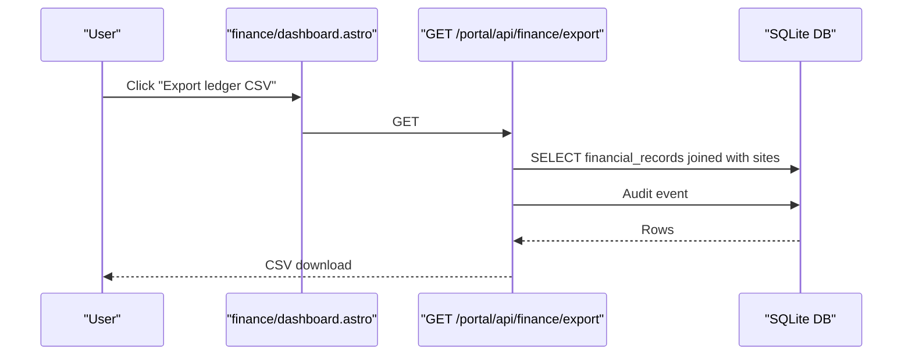
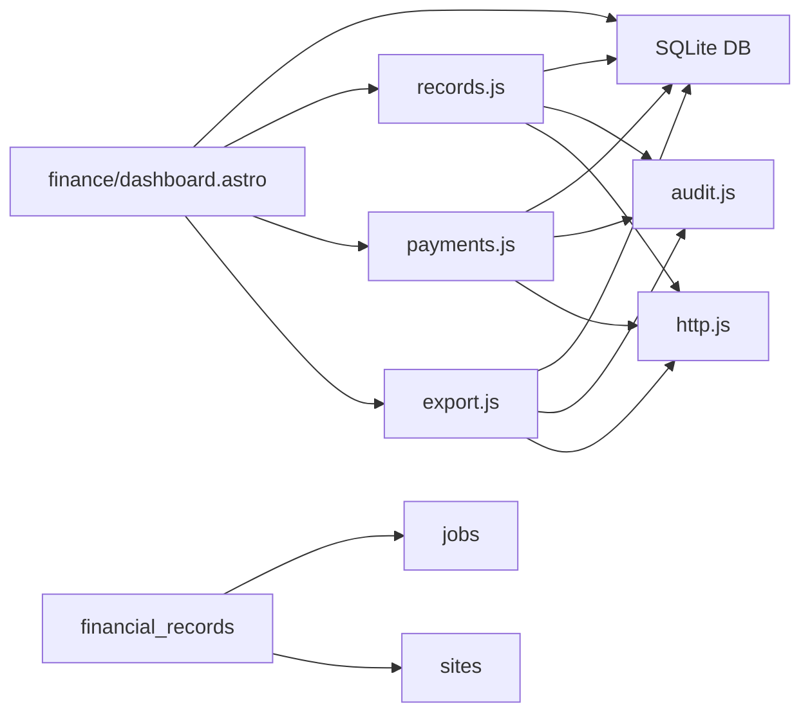

# Finance Dashboard

<cite>
**Referenced Files in This Document**
- [finance/dashboard.astro](file://src/pages/portal/finance/dashboard.astro)
- [finance/records.js](file://src/pages/portal/api/finance/records.js)
- [finance/payments.js](file://src/pages/portal/api/finance/payments.js)
- [finance/export.js](file://src/pages/portal/api/finance/export.js)
- [schema.sql](file://schema.sql)
- [audit.js](file://src/lib/server/audit.js)
- [http.js](file://src/lib/server/http.js)
</cite>

## Table of Contents
1. [Introduction](#introduction)
2. [Project Structure](#project-structure)
3. [Core Components](#core-components)
4. [Architecture Overview](#architecture-overview)
5. [Detailed Component Analysis](#detailed-component-analysis)
6. [Dependency Analysis](#dependency-analysis)
7. [Performance Considerations](#performance-considerations)
8. [Troubleshooting Guide](#troubleshooting-guide)
9. [Conclusion](#conclusion)

## Introduction
The Finance Dashboard provides a comprehensive financial overview and ledger management system for dispatch-linked commercial records. It displays key financial summaries (unpaid, pending approval, settled), aging analysis for open receivables (0–29, 30–59, 60+ days), and offers end-to-end workflows for creating financial records, recording payments, and exporting ledger data. It also surfaces an exception queue of completed jobs awaiting invoicing.

## Project Structure
The Finance Dashboard is implemented as an Astro page with embedded client-side JavaScript for filtering, search, and form submission. Backend APIs handle financial record creation, payment recording, and CSV exports. The system integrates with a SQLite-backed schema containing financial_records, jobs, and sites.

**Diagram sources**
- [finance/dashboard.astro:1-410](file://src/pages/portal/finance/dashboard.astro#L1-L410)
- [finance/records.js:1-137](file://src/pages/portal/api/finance/records.js#L1-L137)
- [finance/payments.js:1-106](file://src/pages/portal/api/finance/payments.js#L1-L106)
- [finance/export.js:1-74](file://src/pages/portal/api/finance/export.js#L1-L74)
- [schema.sql:64-75](file://schema.sql#L64-L75)
- [audit.js:1-33](file://src/lib/server/audit.js#L1-L33)
- [http.js:1-47](file://src/lib/server/http.js#L1-L47)

**Section sources**
- [finance/dashboard.astro:1-410](file://src/pages/portal/finance/dashboard.astro#L1-L410)
- [finance/records.js:1-137](file://src/pages/portal/api/finance/records.js#L1-L137)
- [finance/payments.js:1-106](file://src/pages/portal/api/finance/payments.js#L1-L106)
- [finance/export.js:1-74](file://src/pages/portal/api/finance/export.js#L1-L74)
- [schema.sql:64-75](file://schema.sql#L64-L75)

## Core Components
- Financial Overview Cards: Unpaid, Pending Approval, and Paid in Sage totals derived from aggregated financial_records.
- Aging Analysis: Open receivables grouped into three buckets based on distribution_date and payment_status.
- Financial Record Creation Form: Supports item types (Quote/Invoice), client site selection, optional job linking, amount input, distribution date, and reference fields.
- Exception Queue: Lists completed jobs without a linked financial record, guiding invoice creation.
- Filtering and Search: Real-time client-side filters by status and type, plus text search across client and reference.
- Payment Recording: Submits Sage payment references for unpaid invoices, updating status and creating mirrored Payment records.
- CSV Export: Generates a downloadable ledger snapshot for reporting.

**Section sources**
- [finance/dashboard.astro:171-181](file://src/pages/portal/finance/dashboard.astro#L171-L181)
- [finance/dashboard.astro:126-167](file://src/pages/portal/finance/dashboard.astro#L126-L167)
- [finance/dashboard.astro:183-208](file://src/pages/portal/finance/dashboard.astro#L183-L208)
- [finance/dashboard.astro:210-277](file://src/pages/portal/finance/dashboard.astro#L210-L277)
- [finance/payments.js:13-101](file://src/pages/portal/api/finance/payments.js#L13-L101)
- [finance/export.js:12-69](file://src/pages/portal/api/finance/export.js#L12-L69)

## Architecture Overview
The Finance Dashboard orchestrates frontend rendering and user interactions with backend APIs. The frontend fetches initial data via batched queries, renders summaries and ledger, and handles user actions through AJAX calls to the APIs. Audit events are logged for all sensitive operations.

**Diagram sources**
- [finance/dashboard.astro:19-99](file://src/pages/portal/finance/dashboard.astro#L19-L99)
- [finance/records.js:36-127](file://src/pages/portal/api/finance/records.js#L36-L127)
- [finance/payments.js:13-92](file://src/pages/portal/api/finance/payments.js#L13-L92)
- [finance/export.js:12-64](file://src/pages/portal/api/finance/export.js#L12-L64)

## Detailed Component Analysis

### Financial Overview and Aging
- Aggregation SQL computes totals for Unpaid, Pending Approval, and Settled amounts.
- Aging buckets compute sums for open receivables within 0–29, 30–59, and 60+ days based on distribution_date.
- Frontend renders summary cards and aging blocks with formatted currency values.

**Diagram sources**
- [finance/dashboard.astro:20-32](file://src/pages/portal/finance/dashboard.astro#L20-L32)

**Section sources**
- [finance/dashboard.astro:171-181](file://src/pages/portal/finance/dashboard.astro#L171-L181)

### Financial Record Creation Form
- Fields: Item type (Quote/Invoice), Client site, Optional job linking, Amount (ZAR), Distribution date, Reference.
- Client-side behavior:
  - Pre-populates today’s date for distribution date.
  - Dynamically populates job options based on selected site.
  - Submits form via POST to /portal/api/finance/records.
  - On success, clears form, resets job select, refreshes after delay.
- Server-side validation ensures:
  - Authorized roles (finance/admin).
  - Valid siteId and itemType.
  - Amount and date formatting constraints.
  - Optional jobId linkage with cross-checks against site and uniqueness per itemType.
  - Audit event logged on success.

**Diagram sources**
- [finance/dashboard.astro:337-407](file://src/pages/portal/finance/dashboard.astro#L337-L407)
- [finance/records.js:36-127](file://src/pages/portal/api/finance/records.js#L36-L127)

**Section sources**
- [finance/dashboard.astro:126-167](file://src/pages/portal/finance/dashboard.astro#L126-L167)
- [finance/records.js:36-127](file://src/pages/portal/api/finance/records.js#L36-L127)
- [schema.sql:64-75](file://schema.sql#L64-L75)

### Exception Queue Workflow
- The dashboard queries for completed jobs with documentation present but no linked financial record.
- Displays a queue with client, system type, coverage area, completion date, status, and job ID.
- Guides users to create a financial record for each job via the creation form.

**Diagram sources**
- [finance/dashboard.astro:55-71](file://src/pages/portal/finance/dashboard.astro#L55-L71)

**Section sources**
- [finance/dashboard.astro:183-208](file://src/pages/portal/finance/dashboard.astro#L183-L208)

### Payment Recording Process
- Available only for unpaid Invoice records.
- Requires a Sage payment reference (auto-generated if none provided).
- Updates the invoice status to Settled and inserts a mirrored Payment record with the same amount and job/site linkage.
- Logs audit event with payment metadata.

**Diagram sources**
- [finance/dashboard.astro:262-271](file://src/pages/portal/finance/dashboard.astro#L262-L271)
- [finance/payments.js:13-92](file://src/pages/portal/api/finance/payments.js#L13-L92)

**Section sources**
- [finance/dashboard.astro:262-271](file://src/pages/portal/finance/dashboard.astro#L262-L271)
- [finance/payments.js:13-92](file://src/pages/portal/api/finance/payments.js#L13-L92)

### Filtering and Search Functionality
- Client-side filtering supports:
  - Text search across client name and reference/type.
  - Status filter (Unpaid, Pending Approval, Paid in Sage).
  - Type filter (Quote, Invoice).
- Matching rows are shown; otherwise a "No results" indicator appears.

**Diagram sources**
- [finance/dashboard.astro:288-305](file://src/pages/portal/finance/dashboard.astro#L288-L305)

**Section sources**
- [finance/dashboard.astro:210-231](file://src/pages/portal/finance/dashboard.astro#L210-L231)
- [finance/dashboard.astro:288-305](file://src/pages/portal/finance/dashboard.astro#L288-L305)

### CSV Export Capabilities
- Accessible via the dashboard header button.
- Returns a CSV file with columns: id, reference, type, status, amount, distribution_date, job_id, client, billing_emails.
- Enforces role-based permissions and logs audit event with row count.

**Diagram sources**
- [finance/dashboard.astro:108-110](file://src/pages/portal/finance/dashboard.astro#L108-L110)
- [finance/export.js:12-64](file://src/pages/portal/api/finance/export.js#L12-L64)

**Section sources**
- [finance/dashboard.astro:108-110](file://src/pages/portal/finance/dashboard.astro#L108-L110)
- [finance/export.js:12-69](file://src/pages/portal/api/finance/export.js#L12-L69)

## Dependency Analysis
- The dashboard depends on:
  - Database queries for aggregates, ledger rows, sites, jobs, and exception queue.
  - Client-side JavaScript for filtering, job selection population, and form submission.
- Backend APIs depend on:
  - Database for persistence and audit logging.
  - HTTP helpers for standardized responses.
- Schema defines referential integrity between financial_records, jobs, and sites.

**Diagram sources**
- [finance/dashboard.astro:19-99](file://src/pages/portal/finance/dashboard.astro#L19-L99)
- [finance/records.js:1-137](file://src/pages/portal/api/finance/records.js#L1-L137)
- [finance/payments.js:1-106](file://src/pages/portal/api/finance/payments.js#L1-L106)
- [finance/export.js:1-74](file://src/pages/portal/api/finance/export.js#L1-L74)
- [schema.sql:64-75](file://schema.sql#L64-L75)
- [audit.js:1-33](file://src/lib/server/audit.js#L1-L33)
- [http.js:1-47](file://src/lib/server/http.js#L1-L47)

**Section sources**
- [finance/dashboard.astro:19-99](file://src/pages/portal/finance/dashboard.astro#L19-L99)
- [finance/records.js:1-137](file://src/pages/portal/api/finance/records.js#L1-L137)
- [finance/payments.js:1-106](file://src/pages/portal/api/finance/payments.js#L1-L106)
- [finance/export.js:1-74](file://src/pages/portal/api/finance/export.js#L1-L74)
- [schema.sql:64-75](file://schema.sql#L64-L75)

## Performance Considerations
- Database batching reduces round-trips for dashboard initialization.
- Indexes on financial_records (site_id, payment_status, distribution_date) and job_id support efficient filtering and joins.
- Client-side filtering avoids server round-trips for search and status/type filters.
- CSV export limits result set size and streams response for large datasets.

[No sources needed since this section provides general guidance]

## Troubleshooting Guide
- Authentication/Authorization:
  - Ensure the user has role finance or admin for record creation, payment recording, and export.
- Record creation errors:
  - Verify siteId exists and itemType is Quote or Invoice.
  - Ensure amount and distributionDate meet validation constraints.
  - If linking a job, confirm the job belongs to the selected site and no duplicate itemType exists for that job.
- Payment recording errors:
  - Only unpaid Invoice records can be marked paid.
  - Confirm the recordId exists and the request body is valid JSON.
- Export failures:
  - Confirm the user has proper role and the system can query financial_records.

**Section sources**
- [finance/records.js:36-104](file://src/pages/portal/api/finance/records.js#L36-L104)
- [finance/payments.js:13-60](file://src/pages/portal/api/finance/payments.js#L13-L60)
- [finance/export.js:12-16](file://src/pages/portal/api/finance/export.js#L12-L16)
- [http.js:22-46](file://src/lib/server/http.js#L22-L46)

## Conclusion
The Finance Dashboard delivers a robust financial oversight solution with real-time summaries, aging analytics, and end-to-end workflows for creating financial records, recording payments, and exporting data. Its exception queue ensures completed jobs are promptly invoiced, while client-side filtering and search streamline ledger navigation. The system’s design balances user experience with strong validation, auditability, and performance.