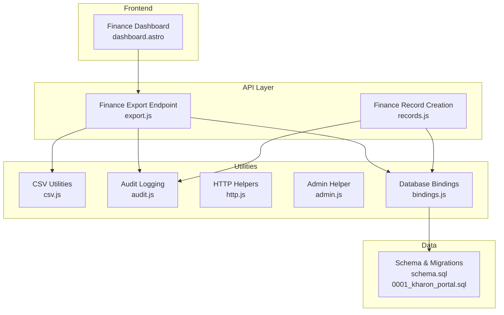
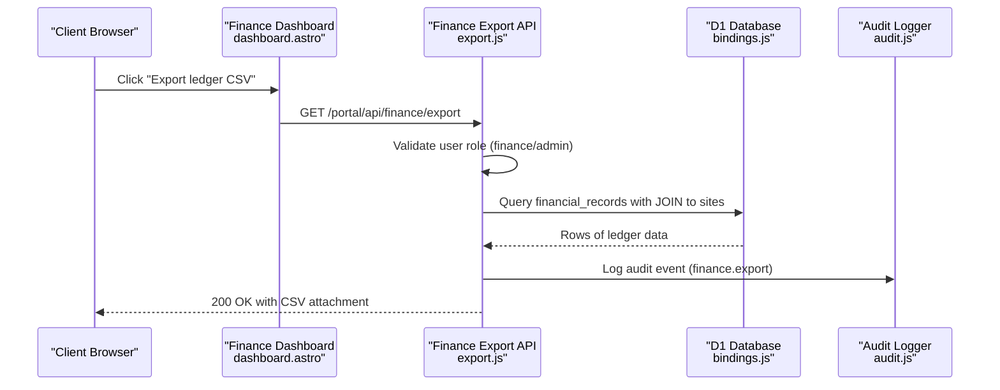
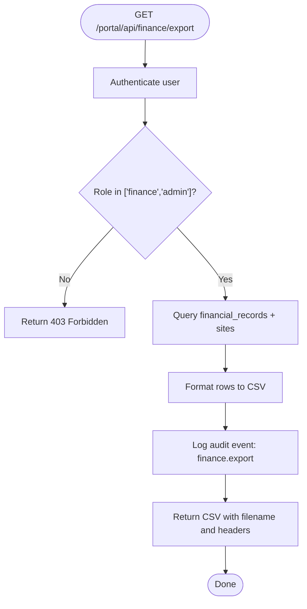
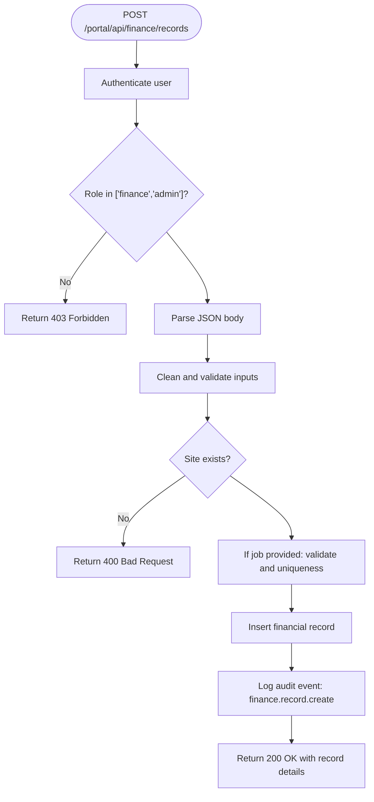
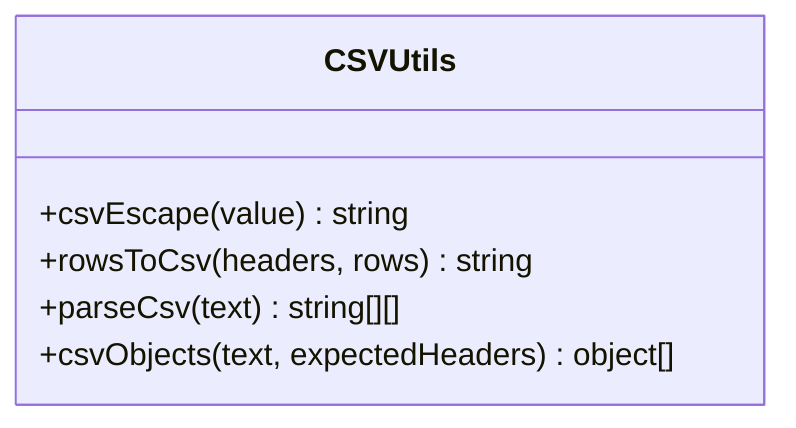
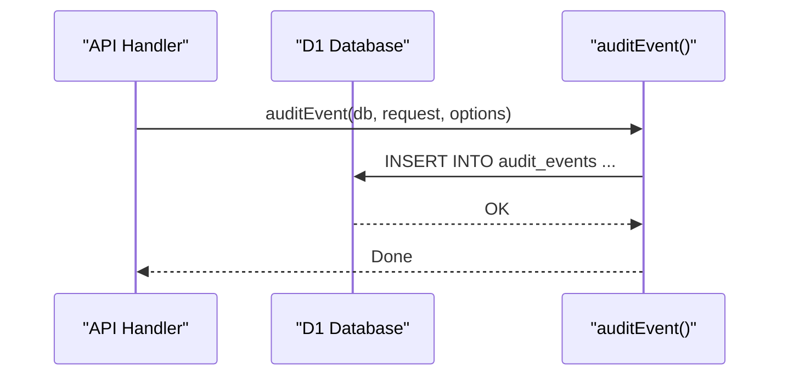
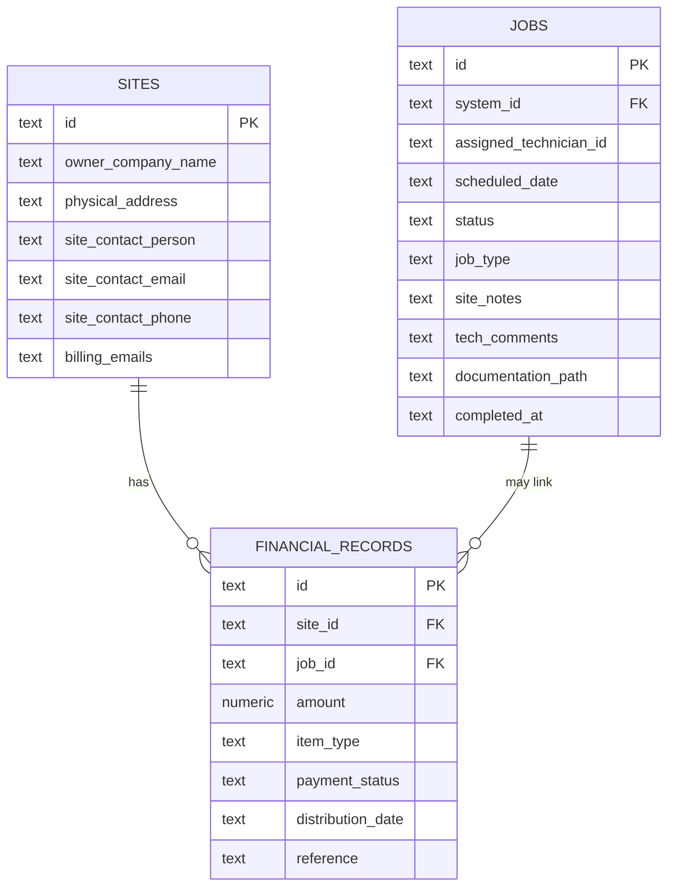
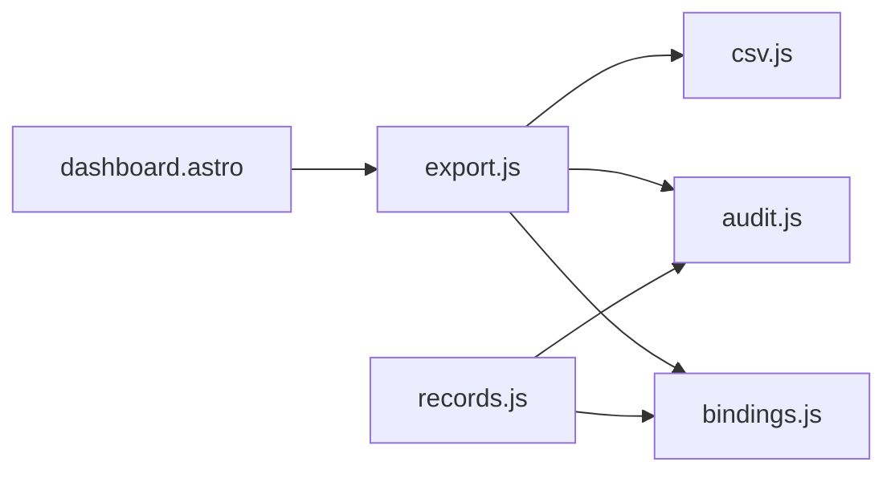

# Financial Export & Reporting

<cite>
**Referenced Files in This Document**
- [export.js](file://src/pages/portal/api/finance/export.js)
- [records.js](file://src/pages/portal/api/finance/records.js)
- [csv.js](file://src/lib/server/csv.js)
- [audit.js](file://src/lib/server/audit.js)
- [bindings.js](file://src/lib/server/bindings.js)
- [http.js](file://src/lib/server/http.js)
- [admin.js](file://src/lib/server/admin.js)
- [schema.sql](file://schema.sql)
- [0001_kharon_portal.sql](file://migrations/0001_kharon_portal.sql)
- [dashboard.astro](file://src/pages/portal/finance/dashboard.astro)
</cite>

## Table of Contents
1. [Introduction](#introduction)
2. [Project Structure](#project-structure)
3. [Core Components](#core-components)
4. [Architecture Overview](#architecture-overview)
5. [Detailed Component Analysis](#detailed-component-analysis)
6. [Dependency Analysis](#dependency-analysis)
7. [Performance Considerations](#performance-considerations)
8. [Troubleshooting Guide](#troubleshooting-guide)
9. [Conclusion](#conclusion)
10. [Appendices](#appendices)

## Introduction
This document describes the financial export and reporting system that powers CSV exports of financial ledger data for integration with external accounting systems such as Sage. It covers the export API endpoint, CSV formatting standards, data fields included in exports, export scheduling capabilities, integration with accounting workflows, data validation and quality assurance, automated and manual export triggers, and export result tracking via audit trails.

## Project Structure
The financial export system is implemented as a Cloudflare Workers-based API with server-side CSV generation and robust audit logging. The key components are:
- Finance export API endpoint for generating CSV ledger data
- Finance record creation API with validation and audit
- Shared CSV utilities for safe CSV formatting
- Audit logging for compliance and traceability
- Database bindings and schema for financial records and related entities
- Frontend dashboard that exposes the export link

**Diagram sources**
- [export.js:12-69](file://src/pages/portal/api/finance/export.js#L12-L69)
- [records.js:36-132](file://src/pages/portal/api/finance/records.js#L36-L132)
- [csv.js:1-71](file://src/lib/server/csv.js#L1-L71)
- [audit.js:3-32](file://src/lib/server/audit.js#L3-L32)
- [bindings.js:18-26](file://src/lib/server/bindings.js#L18-L26)
- [schema.sql:64-75](file://schema.sql#L64-L75)
- [0001_kharon_portal.sql:56-67](file://migrations/0001_kharon_portal.sql#L56-L67)
- [dashboard.astro:108-110](file://src/pages/portal/finance/dashboard.astro#L108-L110)

**Section sources**
- [export.js:12-69](file://src/pages/portal/api/finance/export.js#L12-L69)
- [records.js:36-132](file://src/pages/portal/api/finance/records.js#L36-L132)
- [csv.js:1-71](file://src/lib/server/csv.js#L1-L71)
- [audit.js:3-32](file://src/lib/server/audit.js#L3-L32)
- [bindings.js:18-26](file://src/lib/server/bindings.js#L18-L26)
- [schema.sql:64-75](file://schema.sql#L64-L75)
- [0001_kharon_portal.sql:56-67](file://migrations/0001_kharon_portal.sql#L56-L67)
- [dashboard.astro:108-110](file://src/pages/portal/finance/dashboard.astro#L108-L110)

## Core Components
- Finance Export Endpoint: Generates a CSV of financial ledger data for accounting integration. Accessible via a dedicated API route and surfaced on the Finance Dashboard.
- Finance Record Creation API: Validates and persists financial records (Quotes and Invoices), linking optional jobs and sites, and logs audit events.
- CSV Utilities: Provides CSV escaping and parsing helpers to ensure safe, compliant CSV output.
- Audit Logging: Centralized audit event recording with metadata for compliance and traceability.
- Database Bindings: Provides access to Cloudflare D1 database and enforces configuration checks.
- Schema and Indices: Defines financial_records and supporting tables with constraints and indices optimized for export queries.

**Section sources**
- [export.js:12-69](file://src/pages/portal/api/finance/export.js#L12-L69)
- [records.js:36-132](file://src/pages/portal/api/finance/records.js#L36-L132)
- [csv.js:1-71](file://src/lib/server/csv.js#L1-L71)
- [audit.js:3-32](file://src/lib/server/audit.js#L3-L32)
- [bindings.js:18-26](file://src/lib/server/bindings.js#L18-L26)
- [schema.sql:64-75](file://schema.sql#L64-L75)

## Architecture Overview
The export pipeline is a request-response flow that validates permissions, queries financial data, formats it to CSV, and returns a downloadable file while recording an audit event.

**Diagram sources**
- [dashboard.astro:108-110](file://src/pages/portal/finance/dashboard.astro#L108-L110)
- [export.js:12-69](file://src/pages/portal/api/finance/export.js#L12-L69)
- [audit.js:3-32](file://src/lib/server/audit.js#L3-L32)
- [bindings.js:18-26](file://src/lib/server/bindings.js#L18-L26)

## Detailed Component Analysis

### Finance Export Endpoint
- Purpose: Exports financial ledger data as CSV for accounting integration.
- Authentication and Authorization: Requires an authenticated user; only users with roles "finance" or "admin" can access.
- Data Query: Retrieves financial_records joined with sites to include client and billing emails; orders by distribution_date descending.
- CSV Formatting: Uses a dedicated CSV cell formatter to escape quotes and wrap fields; header row includes standardized column names.
- Filename: Dynamically generated with the current date to prevent collisions.
- Response: Returns a CSV file with cache-control set to no-store and appropriate content disposition.

**Diagram sources**
- [export.js:12-69](file://src/pages/portal/api/finance/export.js#L12-L69)
- [audit.js:3-32](file://src/lib/server/audit.js#L3-L32)

**Section sources**
- [export.js:12-69](file://src/pages/portal/api/finance/export.js#L12-L69)

### Finance Record Creation API
- Purpose: Creates financial records (Quotes and Invoices) linked to optional jobs and sites.
- Validation:
  - Site existence checked before insert.
  - Optional job linkage validated and enforced uniqueness per item type per job.
  - Amount constrained to a positive range and formatted to two decimal places.
  - Date format enforced to YYYY-MM-DD.
  - Reference trimmed to a maximum length.
- Persistence: Inserts into financial_records with initial payment_status based on item type.
- Audit: Logs a structured audit event with metadata for downstream traceability.

**Diagram sources**
- [records.js:36-132](file://src/pages/portal/api/finance/records.js#L36-L132)
- [audit.js:3-32](file://src/lib/server/audit.js#L3-L32)

**Section sources**
- [records.js:36-132](file://src/pages/portal/api/finance/records.js#L36-L132)

### CSV Utilities
- Purpose: Provide robust CSV escaping and parsing to ensure safe output and future-proof import compatibility.
- Features:
  - Escapes leading formula characters and quotes.
  - Wraps fields containing commas, quotes, carriage returns, or tabs.
  - Converts rows to CSV with CR+LF line endings.
  - Parses CSV text into arrays with trimming and header validation.

**Diagram sources**
- [csv.js:1-71](file://src/lib/server/csv.js#L1-L71)

**Section sources**
- [csv.js:1-71](file://src/lib/server/csv.js#L1-L71)

### Audit Logging
- Purpose: Maintain an audit trail for all sensitive actions, including exports and record creation.
- Behavior: Writes to audit_events with actor details, event type, entity info, outcome, IP hash, user agent, and metadata JSON.

**Diagram sources**
- [audit.js:3-32](file://src/lib/server/audit.js#L3-L32)

**Section sources**
- [audit.js:3-32](file://src/lib/server/audit.js#L3-L32)

### Database Bindings and Schema
- Bindings: Ensures Cloudflare D1 and R2 are configured and provides access to the database handle.
- Schema: Defines financial_records with constraints for amounts, item types, and payment statuses; includes supporting tables (sites, jobs) and indices optimized for export queries.

**Diagram sources**
- [schema.sql:22-32](file://schema.sql#L22-L32)
- [schema.sql:49-62](file://schema.sql#L49-L62)
- [schema.sql:64-75](file://schema.sql#L64-L75)

**Section sources**
- [bindings.js:18-26](file://src/lib/server/bindings.js#L18-L26)
- [schema.sql:22-32](file://schema.sql#L22-L32)
- [schema.sql:49-62](file://schema.sql#L49-L62)
- [schema.sql:64-75](file://schema.sql#L64-L75)
- [0001_kharon_portal.sql:56-67](file://migrations/0001_kharon_portal.sql#L56-L67)

## Dependency Analysis
- Export endpoint depends on:
  - Database bindings for queries
  - CSV utilities for formatting
  - Audit logging for compliance
  - HTTP helpers for consistent responses
- Record creation depends on:
  - Database bindings for persistence
  - Audit logging for compliance
  - Input validation helpers and constraints from schema

**Diagram sources**
- [export.js:12-69](file://src/pages/portal/api/finance/export.js#L12-L69)
- [records.js:36-132](file://src/pages/portal/api/finance/records.js#L36-L132)
- [csv.js:1-71](file://src/lib/server/csv.js#L1-L71)
- [audit.js:3-32](file://src/lib/server/audit.js#L3-L32)
- [bindings.js:18-26](file://src/lib/server/bindings.js#L18-L26)
- [dashboard.astro:108-110](file://src/pages/portal/finance/dashboard.astro#L108-L110)

**Section sources**
- [export.js:12-69](file://src/pages/portal/api/finance/export.js#L12-L69)
- [records.js:36-132](file://src/pages/portal/api/finance/records.js#L36-L132)
- [csv.js:1-71](file://src/lib/server/csv.js#L1-L71)
- [audit.js:3-32](file://src/lib/server/audit.js#L3-L32)
- [bindings.js:18-26](file://src/lib/server/bindings.js#L18-L26)
- [dashboard.astro:108-110](file://src/pages/portal/finance/dashboard.astro#L108-L110)

## Performance Considerations
- Export query ordering: Results are ordered by distribution_date descending to prioritize recent entries, reducing client-side sorting overhead.
- Index usage: Schema includes indices on financial_records for efficient filtering and sorting during exports.
- CSV generation: Streaming large datasets directly to CSV is not implemented; consider pagination or chunked writes for very large exports to reduce memory pressure.
- Audit writes: Each export writes a single audit event; keep metadata minimal to avoid large payloads.

[No sources needed since this section provides general guidance]

## Troubleshooting Guide
Common issues and resolutions:
- Unauthorized or forbidden access:
  - Ensure the user is authenticated and has role "finance" or "admin".
  - Verify the request reaches the correct endpoint.
- Export fails with server error:
  - Check database connectivity and bindings configuration.
  - Review server logs for detailed error messages.
- CSV import issues in external systems:
  - Confirm the exported CSV uses comma delimiters and double-quoted fields when needed.
  - Ensure dates are in YYYY-MM-DD format and amounts are numeric with two decimals.
- Audit trail missing:
  - Confirm audit logging is enabled and database writes succeed.
  - Verify the audit_events table exists and indices are present.

**Section sources**
- [export.js:12-69](file://src/pages/portal/api/finance/export.js#L12-L69)
- [records.js:36-132](file://src/pages/portal/api/finance/records.js#L36-L132)
- [audit.js:3-32](file://src/lib/server/audit.js#L3-L32)
- [bindings.js:18-26](file://src/lib/server/bindings.js#L18-L26)

## Conclusion
The financial export and reporting system provides a secure, auditable, and standardized mechanism to produce CSV exports of financial ledger data for accounting integration. It enforces strict validation, ensures compliance via audit trails, and offers a straightforward manual trigger from the Finance Dashboard. For large-scale or recurring needs, consider extending the system with scheduled exports and asynchronous processing.

[No sources needed since this section summarizes without analyzing specific files]

## Appendices

### CSV Export Fields and Standards
- Standardized header row: id, reference, type, status, amount, distribution_date, job_id, client, billing_emails
- Field formatting:
  - Numeric amounts are formatted to two decimal places.
  - Dates are in YYYY-MM-DD.
  - Fields containing commas, quotes, carriage returns, or tabs are quoted and escaped.
  - Leading formula characters are escaped to prevent spreadsheet injection risks.
- Content-Disposition: Filename includes the current date to avoid collisions.

**Section sources**
- [export.js:39-64](file://src/pages/portal/api/finance/export.js#L39-L64)
- [csv.js:1-13](file://src/lib/server/csv.js#L1-L13)

### Export Scheduling Capabilities
- Manual trigger: Available via the Finance Dashboard link to the export endpoint.
- Automated scheduling: Not implemented in the current codebase. To add scheduling, integrate a cron-like scheduler to periodically invoke the export endpoint and upload results to a storage bucket or send to an integration service.

**Section sources**
- [dashboard.astro:108-110](file://src/pages/portal/finance/dashboard.astro#L108-L110)
- [export.js:12-69](file://src/pages/portal/api/finance/export.js#L12-L69)

### Accounting Workflow Integration (Sage)
- Data alignment: Export includes client and billing emails for reconciliation and posting to Sage.
- Field mapping:
  - type → Invoice/Quote indicator
  - status → Payment status aligned with Sage workflows
  - amount → Monetary value with two decimals
  - distribution_date → Posting date for journal entries
  - job_id → Optional linkage to work performed
  - client and billing_emails → Contact and email for correspondence
- Import process:
  - Import the CSV into Sage using standard CSV import tools.
  - Map columns to Sage fields and validate amounts and dates.
  - Run post-import reconciliations and approvals.

**Section sources**
- [export.js:19-28](file://src/pages/portal/api/finance/export.js#L19-L28)
- [schema.sql:64-75](file://schema.sql#L64-L75)

### Data Validation and Quality Assurance
- Input validation for record creation:
  - Amount limits and decimal formatting
  - Date format enforcement
  - Unique constraint per job and item type
  - Site and job existence checks
- Audit quality:
  - Structured metadata for traceability
  - IP hash and user agent capture
  - Outcome tracking (success/failure/blocked)

**Section sources**
- [records.js:10-22](file://src/pages/portal/api/finance/records.js#L10-L22)
- [records.js:50-71](file://src/pages/portal/api/finance/records.js#L50-L71)
- [audit.js:3-32](file://src/lib/server/audit.js#L3-L32)

### Export Result Tracking and Compliance
- Audit events:
  - Event types: finance.export, finance.record.create
  - Metadata includes row counts and record identifiers
  - Timestamps and actor details retained for audits
- Compliance:
  - Retain audit_events for regulatory periods
  - Ensure filenames and headers remain consistent for historical comparisons

**Section sources**
- [export.js:30-37](file://src/pages/portal/api/finance/export.js#L30-L37)
- [records.js:118-125](file://src/pages/portal/api/finance/records.js#L118-L125)
- [schema.sql:101-113](file://schema.sql#L101-L113)