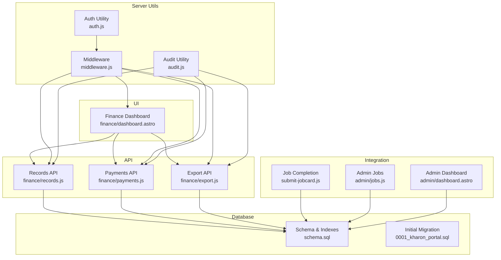
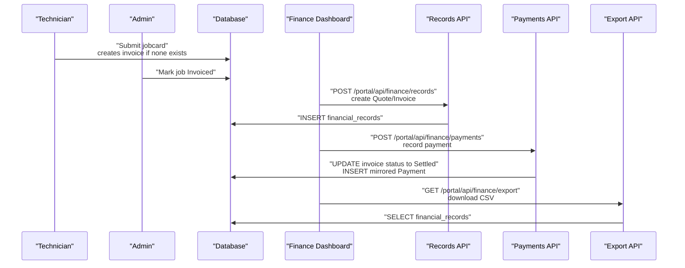
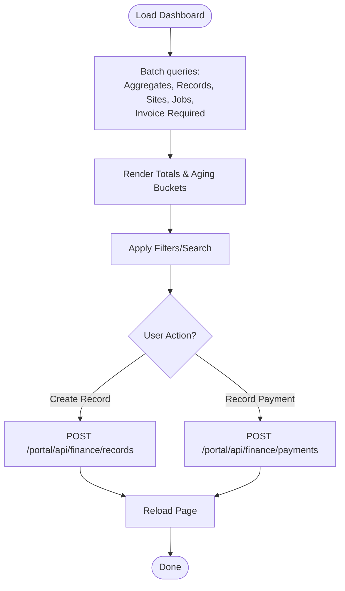
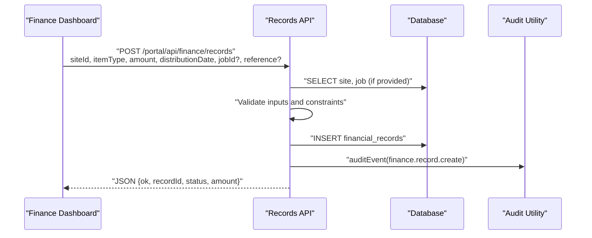
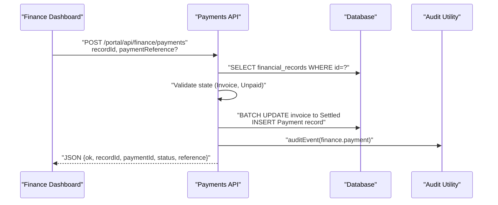
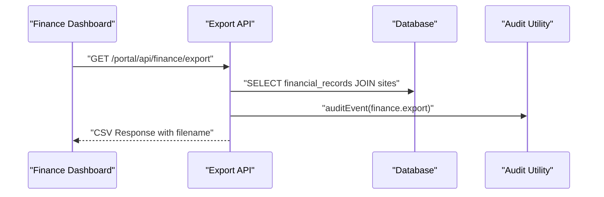
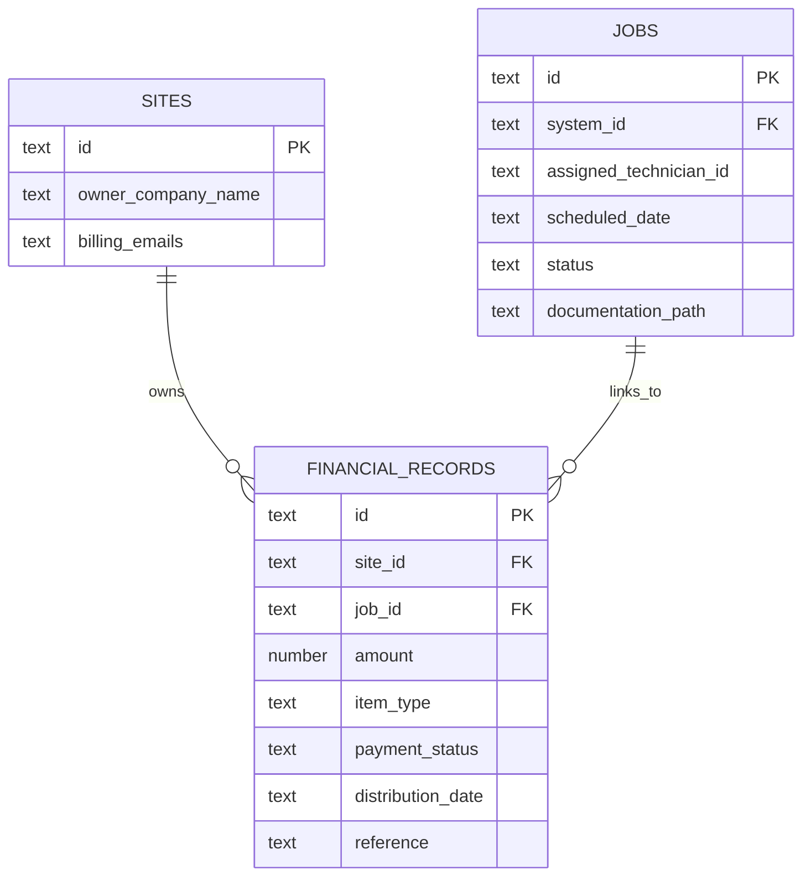
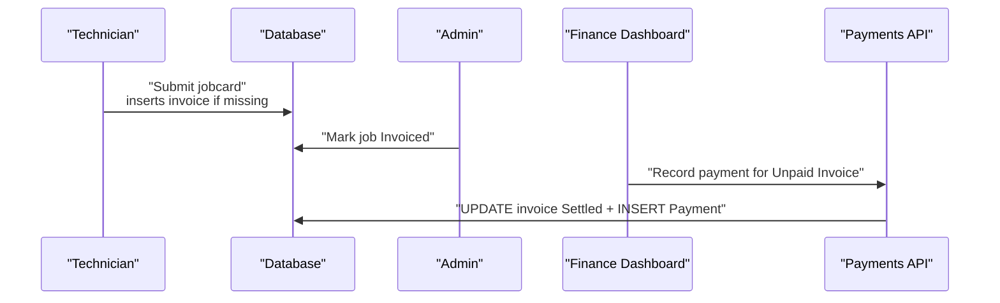
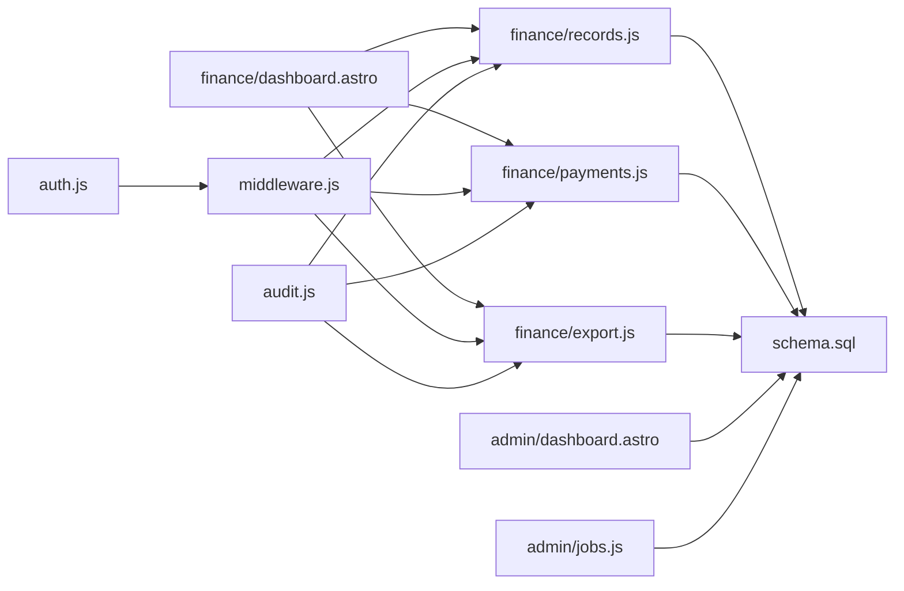

# Financial Management

<cite>
**Referenced Files in This Document**
- [finance/dashboard.astro](file://src/pages/portal/finance/dashboard.astro)
- [finance/export.js](file://src/pages/portal/api/finance/export.js)
- [finance/payments.js](file://src/pages/portal/api/finance/payments.js)
- [finance/records.js](file://src/pages/portal/api/finance/records.js)
- [schema.sql](file://schema.sql)
- [audit.js](file://src/lib/server/audit.js)
- [auth.js](file://src/lib/server/auth.js)
- [middleware.js](file://src/middleware.js)
- [submit-jobcard.js](file://src/pages/portal/api/submit-jobcard.js)
- [admin/jobs.js](file://src/pages/portal/api/admin/jobs.js)
- [admin/dashboard.astro](file://src/pages/portal/admin/dashboard.astro)
- [0001_kharon_portal.sql](file://migrations/0001_kharon_portal.sql)
</cite>

## Table of Contents
1. [Introduction](#introduction)
2. [Project Structure](#project-structure)
3. [Core Components](#core-components)
4. [Architecture Overview](#architecture-overview)
5. [Detailed Component Analysis](#detailed-component-analysis)
6. [Dependency Analysis](#dependency-analysis)
7. [Performance Considerations](#performance-considerations)
8. [Troubleshooting Guide](#troubleshooting-guide)
9. [Conclusion](#conclusion)
10. [Appendices](#appendices)

## Introduction
This document describes the complete financial management system for the portal, focusing on the finance dashboard, payment processing workflows, financial ledger management, invoice generation, payment tracking, export functionality for accounting integration, financial reporting, revenue tracking, and compliance documentation. It also explains the integration between job completion, invoicing, and payment collection, and provides practical examples and security/audit guidance.

## Project Structure
The financial domain spans UI pages, API endpoints, database schema, and middleware/security controls:
- Finance UI: a dashboard page that aggregates ledger data, allows creating financial records, and records payments against invoices.
- Finance APIs: endpoints for creating financial records, recording payments, and exporting ledger data.
- Database schema: tables for jobs, sites, and financial_records, with indexes and triggers supporting performance and integrity.
- Middleware and security: session verification, CSRF protection, rate limiting, and audit logging.
- Audit and auth utilities: structured audit events and session/token handling.

**Diagram sources**
- [finance/dashboard.astro:1-410](file://src/pages/portal/finance/dashboard.astro#L1-L410)
- [finance/records.js:1-137](file://src/pages/portal/api/finance/records.js#L1-L137)
- [finance/payments.js:1-106](file://src/pages/portal/api/finance/payments.js#L1-L106)
- [finance/export.js:1-74](file://src/pages/portal/api/finance/export.js#L1-L74)
- [schema.sql:64-75](file://schema.sql#L64-L75)
- [0001_kharon_portal.sql:56-67](file://migrations/0001_kharon_portal.sql#L56-L67)
- [middleware.js:110-213](file://src/middleware.js#L110-L213)
- [audit.js:1-33](file://src/lib/server/audit.js#L1-L33)
- [auth.js:1-217](file://src/lib/server/auth.js#L1-L217)
- [submit-jobcard.js:78-306](file://src/pages/portal/api/submit-jobcard.js#L78-L306)
- [admin/jobs.js:1-38](file://src/pages/portal/api/admin/jobs.js#L1-L38)
- [admin/dashboard.astro:1-395](file://src/pages/portal/admin/dashboard.astro#L1-L395)

**Section sources**
- [finance/dashboard.astro:1-410](file://src/pages/portal/finance/dashboard.astro#L1-L410)
- [finance/records.js:1-137](file://src/pages/portal/api/finance/records.js#L1-L137)
- [finance/payments.js:1-106](file://src/pages/portal/api/finance/payments.js#L1-L106)
- [finance/export.js:1-74](file://src/pages/portal/api/finance/export.js#L1-L74)
- [schema.sql:64-75](file://schema.sql#L64-L75)
- [0001_kharon_portal.sql:56-67](file://migrations/0001_kharon_portal.sql#L56-L67)
- [middleware.js:110-213](file://src/middleware.js#L110-L213)
- [audit.js:1-33](file://src/lib/server/audit.js#L1-L33)
- [auth.js:1-217](file://src/lib/server/auth.js#L1-L217)
- [submit-jobcard.js:78-306](file://src/pages/portal/api/submit-jobcard.js#L78-L306)
- [admin/jobs.js:1-38](file://src/pages/portal/api/admin/jobs.js#L1-L38)
- [admin/dashboard.astro:1-395](file://src/pages/portal/admin/dashboard.astro#L1-L395)

## Core Components
- Finance Dashboard: loads and displays ledger summaries, aging buckets, and recent records; supports filtering and searching; provides forms to create financial records and to record payments.
- Records API: validates inputs, ensures job/site linkage, and inserts new financial records with appropriate initial statuses.
- Payments API: transitions an unpaid invoice to settled and inserts a mirrored Payment record; generates a payment reference.
- Export API: produces a CSV export of financial records with audit event logging.
- Schema and Indices: defines financial_records and related tables with constraints and indexes for performance.
- Middleware and Security: enforces session-based access, CSRF checks, rate limits, and audit logging for security events.
- Audit Utility: writes audit_events with actor, event type, entity, outcome, IP hash, and metadata.
- Auth Utility: manages session tokens, revocation, and password hashing.
- Integration with Jobs: automatic invoice creation on job completion and manual “mark invoiced” admin action.

**Section sources**
- [finance/dashboard.astro:16-99](file://src/pages/portal/finance/dashboard.astro#L16-L99)
- [finance/records.js:36-131](file://src/pages/portal/api/finance/records.js#L36-L131)
- [finance/payments.js:13-100](file://src/pages/portal/api/finance/payments.js#L13-L100)
- [finance/export.js:12-68](file://src/pages/portal/api/finance/export.js#L12-L68)
- [schema.sql:64-75](file://schema.sql#L64-L75)
- [middleware.js:110-213](file://src/middleware.js#L110-L213)
- [audit.js:3-32](file://src/lib/server/audit.js#L3-L32)
- [auth.js:48-157](file://src/lib/server/auth.js#L48-L157)
- [submit-jobcard.js:233-244](file://src/pages/portal/api/submit-jobcard.js#L233-L244)
- [admin/jobs.js:20-37](file://src/pages/portal/api/admin/jobs.js#L20-L37)

## Architecture Overview
The finance system is a cohesive loop:
- Job completion triggers an invoice record insertion.
- Finance users can create quotes/invoices and link them to jobs.
- Payments are recorded against unpaid invoices, generating mirrored Payment records.
- Admins can mark jobs as “Invoiced” to align operational status with finance.
- Export API provides CSV for accounting integration.
- Middleware and audit utilities enforce security and maintain audit trails.

**Diagram sources**
- [submit-jobcard.js:233-244](file://src/pages/portal/api/submit-jobcard.js#L233-L244)
- [admin/jobs.js:20-37](file://src/pages/portal/api/admin/jobs.js#L20-L37)
- [finance/records.js:109-116](file://src/pages/portal/api/finance/records.js#L109-L116)
- [finance/payments.js:65-81](file://src/pages/portal/api/finance/payments.js#L65-L81)
- [finance/export.js:19-28](file://src/pages/portal/api/finance/export.js#L19-L28)

## Detailed Component Analysis

### Finance Dashboard
- Loads aggregated totals (unpaid, pending, settled) and aging buckets (current, 30-day, 60+).
- Lists recent financial records with client, type, status, amount, date, age, and optional actions.
- Provides a form to create financial records (Quote/Invoice) linked optionally to a job.
- Provides per-invoice “Record Paid in Sage” form that posts to the Payments API.
- Includes an “Export ledger CSV” link to the Export API endpoint.

**Diagram sources**
- [finance/dashboard.astro:19-95](file://src/pages/portal/finance/dashboard.astro#L19-L95)
- [finance/records.js:36-127](file://src/pages/portal/api/finance/records.js#L36-L127)
- [finance/payments.js:13-92](file://src/pages/portal/api/finance/payments.js#L13-L92)

**Section sources**
- [finance/dashboard.astro:16-99](file://src/pages/portal/finance/dashboard.astro#L16-L99)
- [finance/dashboard.astro:102-279](file://src/pages/portal/finance/dashboard.astro#L102-L279)

### Records API (Create Financial Records)
- Validates role (finance/admin), JSON body, and numeric/date formats.
- Ensures site exists and optional job belongs to the same site.
- Prevents duplicate job+item_type combinations.
- Inserts a new financial record with initial status based on item type.
- Writes an audit event with metadata.

**Diagram sources**
- [finance/records.js:36-127](file://src/pages/portal/api/finance/records.js#L36-L127)
- [audit.js:3-32](file://src/lib/server/audit.js#L3-L32)

**Section sources**
- [finance/records.js:36-131](file://src/pages/portal/api/finance/records.js#L36-L131)

### Payments API (Record Payment)
- Validates role and JSON body; ensures record exists and is an unpaid invoice.
- Generates a payment reference (or uses provided note).
- Performs a batch update to settle the invoice and insert a mirrored Payment record.
- Writes an audit event with payment metadata.

**Diagram sources**
- [finance/payments.js:13-92](file://src/pages/portal/api/finance/payments.js#L13-L92)
- [audit.js:3-32](file://src/lib/server/audit.js#L3-L32)

**Section sources**
- [finance/payments.js:13-100](file://src/pages/portal/api/finance/payments.js#L13-L100)

### Export API (CSV Export)
- Requires finance/admin role.
- Queries financial_records joined with sites for client and billing emails.
- Produces CSV with headers and rows; sets cache-control and filename.
- Writes an audit event with row count.

**Diagram sources**
- [finance/export.js:12-68](file://src/pages/portal/api/finance/export.js#L12-L68)
- [audit.js:3-32](file://src/lib/server/audit.js#L3-L32)

**Section sources**
- [finance/export.js:12-68](file://src/pages/portal/api/finance/export.js#L12-L68)

### Database Schema and Indices
- financial_records table stores quotes, invoices, and payment mirror entries with constraints on item_type and payment_status.
- Jobs and Sites tables support linking financial records to jobs and clients.
- Indexes on financial_records improve query performance for status and date filters.
- Triggers keep updated_at timestamps current.

**Diagram sources**
- [schema.sql:22-32](file://schema.sql#L22-L32)
- [schema.sql:49-62](file://schema.sql#L49-L62)
- [schema.sql:64-75](file://schema.sql#L64-L75)

**Section sources**
- [schema.sql:64-75](file://schema.sql#L64-L75)
- [0001_kharon_portal.sql:56-67](file://migrations/0001_kharon_portal.sql#L56-L67)

### Integration Between Job Completion, Invoicing, and Payment Collection
- Automatic invoice creation on job completion if none exists.
- Admin can mark jobs as “Invoiced” to align operational status with finance.
- Finance dashboard highlights “exception queue” of completed jobs without linked invoices.
- Payments API settles invoices and inserts mirrored Payment records.

**Diagram sources**
- [submit-jobcard.js:233-244](file://src/pages/portal/api/submit-jobcard.js#L233-L244)
- [admin/jobs.js:20-37](file://src/pages/portal/api/admin/jobs.js#L20-L37)
- [finance/payments.js:65-81](file://src/pages/portal/api/finance/payments.js#L65-L81)

**Section sources**
- [submit-jobcard.js:233-244](file://src/pages/portal/api/submit-jobcard.js#L233-L244)
- [admin/jobs.js:20-37](file://src/pages/portal/api/admin/jobs.js#L20-L37)
- [finance/dashboard.astro:183-208](file://src/pages/portal/finance/dashboard.astro#L183-L208)

## Dependency Analysis
- UI depends on API endpoints for create/payment actions and on the Export endpoint for CSV downloads.
- APIs depend on the database schema and write audit events.
- Middleware enforces session, CSRF, and rate limits for all state-changing API calls.
- Auth utility underpins session tokens and revocation.
- Admin dashboard consumes the same financial data and exposes “mark invoiced” for jobs.

**Diagram sources**
- [finance/dashboard.astro:1-410](file://src/pages/portal/finance/dashboard.astro#L1-L410)
- [finance/records.js:1-137](file://src/pages/portal/api/finance/records.js#L1-L137)
- [finance/payments.js:1-106](file://src/pages/portal/api/finance/payments.js#L1-L106)
- [finance/export.js:1-74](file://src/pages/portal/api/finance/export.js#L1-L74)
- [schema.sql:64-75](file://schema.sql#L64-L75)
- [middleware.js:110-213](file://src/middleware.js#L110-L213)
- [auth.js:1-217](file://src/lib/server/auth.js#L1-L217)
- [audit.js:1-33](file://src/lib/server/audit.js#L1-L33)
- [admin/dashboard.astro:1-395](file://src/pages/portal/admin/dashboard.astro#L1-L395)
- [admin/jobs.js:1-38](file://src/pages/portal/api/admin/jobs.js#L1-L38)

**Section sources**
- [finance/dashboard.astro:1-410](file://src/pages/portal/finance/dashboard.astro#L1-L410)
- [finance/records.js:1-137](file://src/pages/portal/api/finance/records.js#L1-L137)
- [finance/payments.js:1-106](file://src/pages/portal/api/finance/payments.js#L1-L106)
- [finance/export.js:1-74](file://src/pages/portal/api/finance/export.js#L1-L74)
- [schema.sql:64-75](file://schema.sql#L64-L75)
- [middleware.js:110-213](file://src/middleware.js#L110-L213)
- [auth.js:1-217](file://src/lib/server/auth.js#L1-L217)
- [audit.js:1-33](file://src/lib/server/audit.js#L1-L33)
- [admin/dashboard.astro:1-395](file://src/pages/portal/admin/dashboard.astro#L1-L395)
- [admin/jobs.js:1-38](file://src/pages/portal/api/admin/jobs.js#L1-L38)

## Performance Considerations
- Database indices on financial_records for site, status, and distribution_date improve filtering and aggregation performance.
- Batch queries in the dashboard reduce round-trips.
- Rate limiting on state-changing APIs prevents abuse and maintains responsiveness.
- Audit writes are lightweight and occur after successful operations.

[No sources needed since this section provides general guidance]

## Troubleshooting Guide
Common issues and resolutions:
- Unauthorized or forbidden access to finance endpoints: ensure the user role is finance or admin.
- Invalid JSON or malformed request bodies: verify JSON validity and required fields.
- Record not found when posting payment: confirm the record ID exists and is an unpaid invoice.
- Duplicate job+item_type: remove the jobId or change item type to avoid duplicates.
- Export failures: check permissions and that the database query returns results.
- Session or CSRF errors: ensure a valid session cookie and CSRF token are present.

**Section sources**
- [finance/records.js:39-42](file://src/pages/portal/api/finance/records.js#L39-L42)
- [finance/payments.js:16-17](file://src/pages/portal/api/finance/payments.js#L16-L17)
- [finance/payments.js:38-48](file://src/pages/portal/api/finance/payments.js#L38-L48)
- [finance/export.js:15-16](file://src/pages/portal/api/finance/export.js#L15-L16)
- [middleware.js:154-183](file://src/middleware.js#L154-L183)

## Conclusion
The financial management system integrates job operations, invoicing, payment recording, and export for accounting with strong security and audit controls. The dashboard provides visibility into ledger status and aging, while APIs enable robust financial workflows. Compliance and operational SOPs support ongoing governance and retention practices.

[No sources needed since this section summarizes without analyzing specific files]

## Appendices

### Practical Examples

- Payment Processing Example
  - Navigate to the Finance Ledger and locate an unpaid invoice.
  - Enter a payment reference and click “Record Paid in Sage.”
  - The system updates the invoice to settled and inserts a mirrored Payment record.

  **Section sources**
  - [finance/dashboard.astro:262-271](file://src/pages/portal/finance/dashboard.astro#L262-L271)
  - [finance/payments.js:65-81](file://src/pages/portal/api/finance/payments.js#L65-L81)

- Financial Reporting Example
  - Use the Finance Ledger filters to isolate records by status or type.
  - Export the filtered dataset via the “Export ledger CSV” link for reporting.

  **Section sources**
  - [finance/dashboard.astro:210-229](file://src/pages/portal/finance/dashboard.astro#L210-L229)
  - [finance/export.js:19-28](file://src/pages/portal/api/finance/export.js#L19-L28)

- Export Procedure Example
  - Access the Export API endpoint with finance/admin credentials.
  - Download the generated CSV for integration with accounting systems.

  **Section sources**
  - [finance/export.js:12-68](file://src/pages/portal/api/finance/export.js#L12-L68)

- Reconciliation Workflow Example
  - Compare exported CSV with Sage records.
  - Use the Payments API to reconcile outstanding invoices by recording payments.

  **Section sources**
  - [finance/export.js:30-37](file://src/pages/portal/api/finance/export.js#L30-L37)
  - [finance/payments.js:83-90](file://src/pages/portal/api/finance/payments.js#L83-L90)

### Financial Security Measures, Audit Trails, and Compliance
- Session-based access control with role checks.
- CSRF protection for state-changing API calls.
- Rate limiting for portal write operations.
- Audit events for all finance actions and security events.
- Revocable sessions and secure cookies.
- Compliance documentation and SOPs referenced in the repository.

**Section sources**
- [middleware.js:110-213](file://src/middleware.js#L110-L213)
- [audit.js:3-32](file://src/lib/server/audit.js#L3-L32)
- [auth.js:125-157](file://src/lib/server/auth.js#L125-L157)
- [admin/dashboard.astro:303-313](file://src/pages/portal/admin/dashboard.astro#L303-L313)