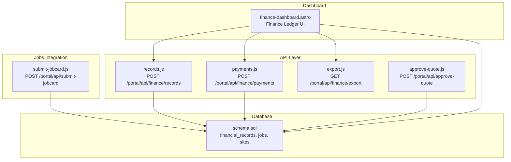
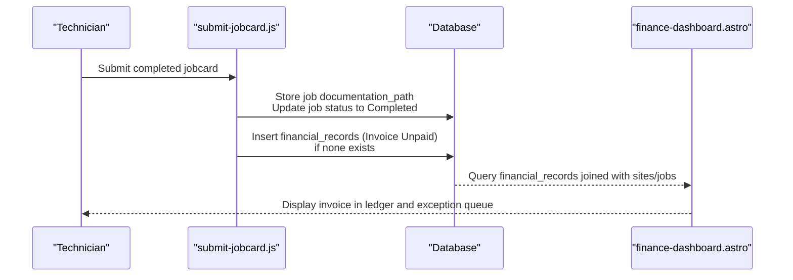
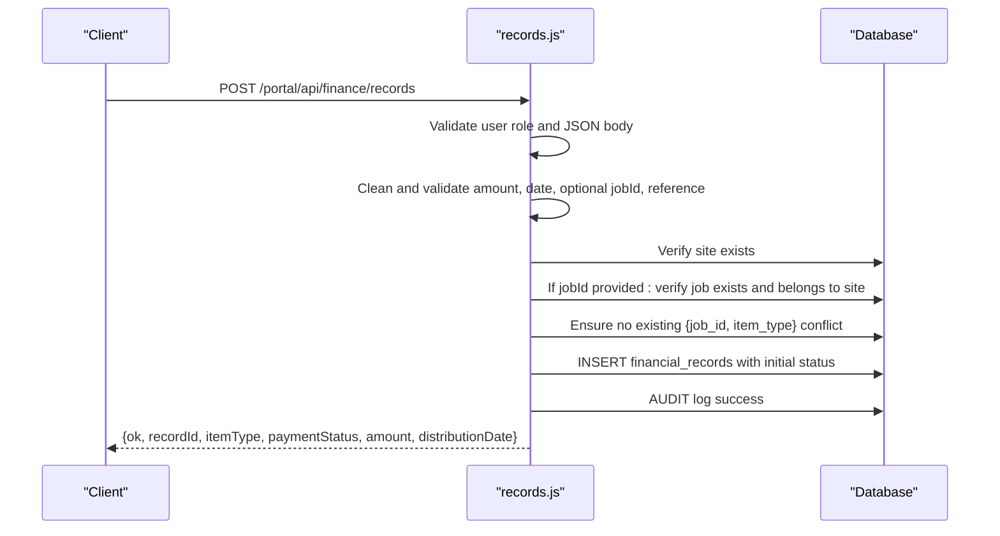
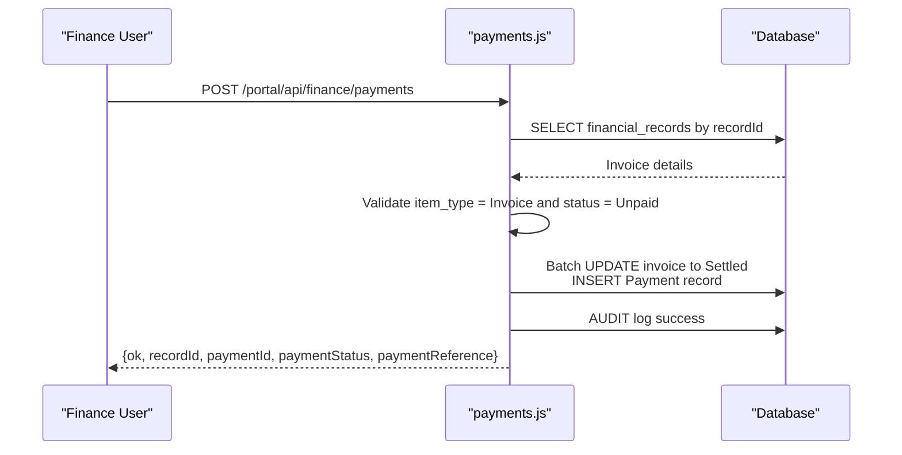
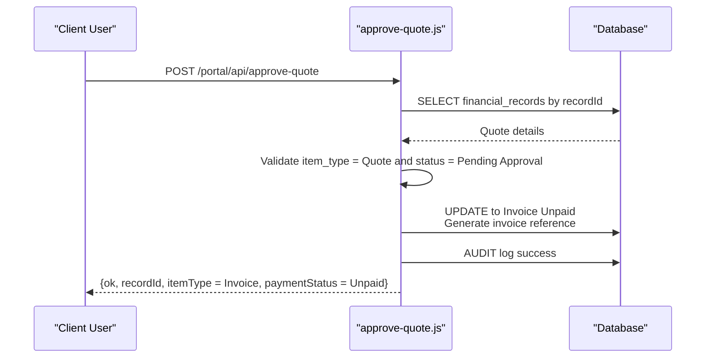
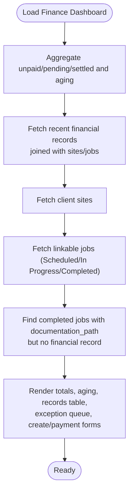
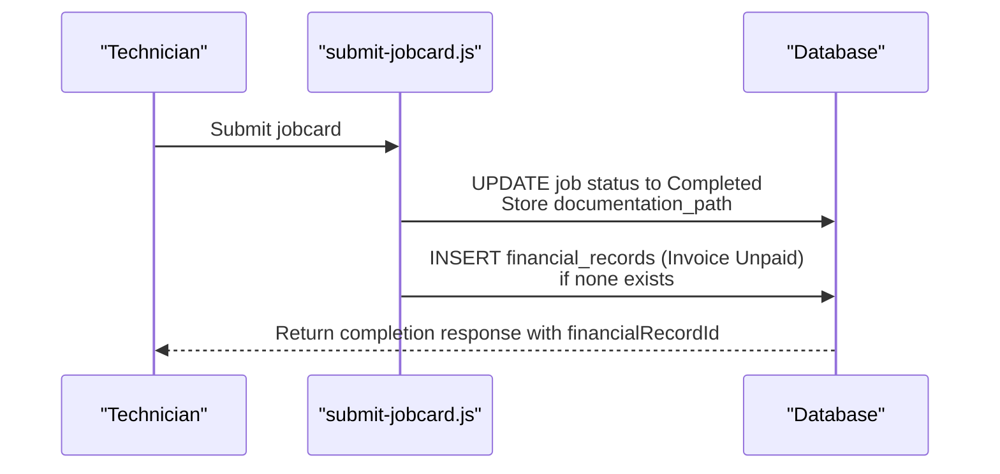
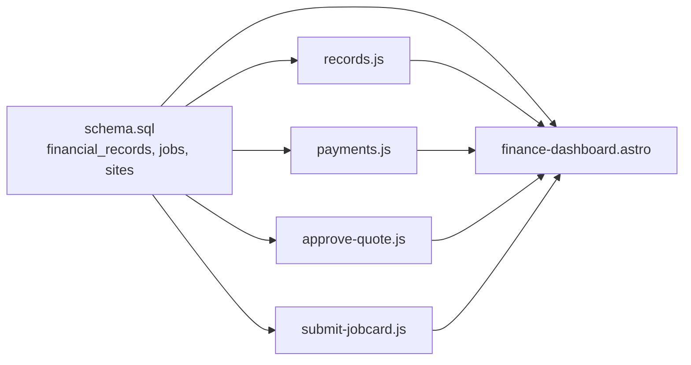

# Financial Records Management

<cite>
**Referenced Files in This Document**
- [records.js](file://src/pages/portal/api/finance/records.js)
- [payments.js](file://src/pages/portal/api/finance/payments.js)
- [export.js](file://src/pages/portal/api/finance/export.js)
- [approve-quote.js](file://src/pages/portal/api/approve-quote.js)
- [finance-dashboard.astro](file://src/pages/portal/finance/dashboard.astro)
- [submit-jobcard.js](file://src/pages/portal/api/submit-jobcard.js)
- [schema.sql](file://schema.sql)
</cite>

## Table of Contents
1. [Introduction](#introduction)
2. [Project Structure](#project-structure)
3. [Core Components](#core-components)
4. [Architecture Overview](#architecture-overview)
5. [Detailed Component Analysis](#detailed-component-analysis)
6. [Dependency Analysis](#dependency-analysis)
7. [Performance Considerations](#performance-considerations)
8. [Troubleshooting Guide](#troubleshooting-guide)
9. [Conclusion](#conclusion)
10. [Appendices](#appendices)

## Introduction
This document describes the financial records management system for creating, modifying, and tracking financial transactions. It covers the creation of Quotes and Invoices, their lifecycle from creation through payment processing to settlement, and the integration with job completion workflows. It also documents the exception queue for completed jobs without financial records and the requirement for documentation paths before financial record creation.

## Project Structure
The financial management functionality is implemented as a set of API endpoints and a finance dashboard page:
- API endpoints for creating financial records, capturing payments, exporting ledger data, and approving quotes
- A dashboard page that displays financial records, provides filtering/searching, and exposes the exception queue
- Job completion integration that automatically creates invoices when a job is completed without an existing financial record
- Database schema defining financial records, jobs, sites, and related entities

**Diagram sources**
- [records.js:36-137](file://src/pages/portal/api/finance/records.js#L36-L137)
- [payments.js:13-106](file://src/pages/portal/api/finance/payments.js#L13-L106)
- [export.js:12-74](file://src/pages/portal/api/finance/export.js#L12-L74)
- [approve-quote.js:14-100](file://src/pages/portal/api/approve-quote.js#L14-L100)
- [finance-dashboard.astro:1-410](file://src/pages/portal/finance/dashboard.astro#L1-L410)
- [submit-jobcard.js:51-307](file://src/pages/portal/api/submit-jobcard.js#L51-L307)
- [schema.sql:64-75](file://schema.sql#L64-L75)

**Section sources**
- [records.js:1-137](file://src/pages/portal/api/finance/records.js#L1-L137)
- [payments.js:1-106](file://src/pages/portal/api/finance/payments.js#L1-L106)
- [export.js:1-74](file://src/pages/portal/api/finance/export.js#L1-L74)
- [approve-quote.js:1-100](file://src/pages/portal/api/approve-quote.js#L1-L100)
- [finance-dashboard.astro:1-410](file://src/pages/portal/finance/dashboard.astro#L1-L410)
- [submit-jobcard.js:1-307](file://src/pages/portal/api/submit-jobcard.js#L1-L307)
- [schema.sql:64-75](file://schema.sql#L64-L75)

## Core Components
- Financial Record Creation API: Validates inputs, ensures job/site integrity, prevents duplicate records per job/item type, and inserts records with appropriate initial statuses.
- Payment Capture API: Transitions unpaid invoices to settled, records a mirrored payment record, and logs audit events.
- Quote Approval API: Converts a pending quote to an invoice, auto-generates an invoice reference, and updates distribution date.
- Finance Dashboard: Displays ledger entries, filters/searches, and shows the exception queue of completed jobs without financial records.
- Job Completion Integration: Automatically creates an unpaid invoice when a job is completed and no existing financial record links to it.
- Export Endpoint: Generates a CSV of ledger data for finance/admin users.

**Section sources**
- [records.js:36-137](file://src/pages/portal/api/finance/records.js#L36-L137)
- [payments.js:13-106](file://src/pages/portal/api/finance/payments.js#L13-L106)
- [approve-quote.js:14-100](file://src/pages/portal/api/approve-quote.js#L14-L100)
- [finance-dashboard.astro:1-410](file://src/pages/portal/finance/dashboard.astro#L1-L410)
- [submit-jobcard.js:51-307](file://src/pages/portal/api/submit-jobcard.js#L51-L307)
- [export.js:12-74](file://src/pages/portal/api/finance/export.js#L12-L74)

## Architecture Overview
The system integrates job completion with financial record creation and provides explicit APIs for manual creation, payment recording, quote approval, and reporting.

**Diagram sources**
- [submit-jobcard.js:233-244](file://src/pages/portal/api/submit-jobcard.js#L233-L244)
- [finance-dashboard.astro:19-95](file://src/pages/portal/finance/dashboard.astro#L19-L95)
- [schema.sql:64-75](file://schema.sql#L64-L75)

## Detailed Component Analysis

### Financial Record Creation API
Purpose:
- Create Quotes and Invoices linked to a client site and optionally a job.
- Enforce validation for amounts, dates, IDs, and references.
- Prevent duplicate records per job and item type.
- Initialize payment status appropriately for each item type.

Key behaviors:
- Authentication and authorization checks restrict creation to finance/admin roles.
- Input sanitization and validation ensure data integrity.
- Optional job linkage validated against site and uniqueness constraints.
- Audit logging captures successful creation events.

**Diagram sources**
- [records.js:36-137](file://src/pages/portal/api/finance/records.js#L36-L137)
- [schema.sql:64-75](file://schema.sql#L64-L75)

**Section sources**
- [records.js:36-137](file://src/pages/portal/api/finance/records.js#L36-L137)
- [schema.sql:64-75](file://schema.sql#L64-L75)

### Payment Capture API
Purpose:
- Record payments for unpaid invoices and mark them as settled.
- Create a mirrored Payment record with a generated reference.
- Enforce state checks and audit failures for invalid states.

Key behaviors:
- Validates user role and JSON body.
- Confirms the record exists, is an unpaid Invoice.
- Updates the invoice to settled and inserts a Payment record.
- Logs audit events for success/failure.

**Diagram sources**
- [payments.js:13-106](file://src/pages/portal/api/finance/payments.js#L13-L106)
- [schema.sql:64-75](file://schema.sql#L64-L75)

**Section sources**
- [payments.js:13-106](file://src/pages/portal/api/finance/payments.js#L13-L106)
- [schema.sql:64-75](file://schema.sql#L64-L75)

### Quote Approval API
Purpose:
- Convert a pending quote to an invoice upon client approval.
- Auto-generate invoice reference and update distribution date.
- Restrict access to client users and enforce state checks.

Key behaviors:
- Validates user role and JSON body.
- Confirms quote exists, belongs to the client's site, and is Pending Approval.
- Updates item_type to Invoice, sets status to Unpaid, and generates reference.

**Diagram sources**
- [approve-quote.js:14-100](file://src/pages/portal/api/approve-quote.js#L14-L100)
- [schema.sql:64-75](file://schema.sql#L64-L75)

**Section sources**
- [approve-quote.js:14-100](file://src/pages/portal/api/approve-quote.js#L14-L100)
- [schema.sql:64-75](file://schema.sql#L64-L75)

### Finance Dashboard and Exception Queue
Purpose:
- Display financial records with filtering and search.
- Show totals and aging metrics.
- Highlight completed jobs without financial records (exception queue).
- Provide forms to create records and record payments.

Key behaviors:
- Loads aggregated totals and aging, recent records, sites, and linkable jobs.
- Queries completed/invoiced jobs with documentation_path but no financial record linkage.
- Provides UI controls to create records and record payments.

**Diagram sources**
- [finance-dashboard.astro:19-95](file://src/pages/portal/finance/dashboard.astro#L19-L95)
- [schema.sql:64-75](file://schema.sql#L64-L75)

**Section sources**
- [finance-dashboard.astro:1-410](file://src/pages/portal/finance/dashboard.astro#L1-L410)
- [schema.sql:64-75](file://schema.sql#L64-L75)

### Job Completion Integration and Financial Record Creation
Purpose:
- Automatically create an unpaid invoice when a job is completed without an existing financial record.
- Ensure documentation_path exists before creating the invoice.
- Link the invoice to the job and site.

Key behaviors:
- On job completion, if no existing financial record exists, insert an Invoice Unpaid.
- Use a standard service fee and generate a reference describing the job.
- Audit event captures metadata including financialRecordId.

**Diagram sources**
- [submit-jobcard.js:233-244](file://src/pages/portal/api/submit-jobcard.js#L233-L244)
- [schema.sql:64-75](file://schema.sql#L64-L75)

**Section sources**
- [submit-jobcard.js:51-307](file://src/pages/portal/api/submit-jobcard.js#L51-L307)
- [schema.sql:64-75](file://schema.sql#L64-L75)

### Export Endpoint
Purpose:
- Allow finance/admin users to export ledger data as CSV.
- Include key fields for reconciliation and reporting.

Key behaviors:
- Validates user role and queries financial_records joined with sites.
- Builds CSV with headers and rows, sets appropriate content disposition.

**Section sources**
- [export.js:12-74](file://src/pages/portal/api/finance/export.js#L12-L74)
- [schema.sql:64-75](file://schema.sql#L64-L75)

## Dependency Analysis
The system relies on a shared database schema and several API endpoints. The dashboard depends on the database for queries and on the APIs for mutations. Job completion triggers financial record creation via the job submission endpoint.

**Diagram sources**
- [schema.sql:64-75](file://schema.sql#L64-L75)
- [records.js:36-137](file://src/pages/portal/api/finance/records.js#L36-L137)
- [payments.js:13-106](file://src/pages/portal/api/finance/payments.js#L13-L106)
- [approve-quote.js:14-100](file://src/pages/portal/api/approve-quote.js#L14-L100)
- [submit-jobcard.js:51-307](file://src/pages/portal/api/submit-jobcard.js#L51-L307)
- [finance-dashboard.astro:1-410](file://src/pages/portal/finance/dashboard.astro#L1-L410)

**Section sources**
- [schema.sql:64-75](file://schema.sql#L64-L75)
- [records.js:36-137](file://src/pages/portal/api/finance/records.js#L36-L137)
- [payments.js:13-106](file://src/pages/portal/api/finance/payments.js#L13-L106)
- [approve-quote.js:14-100](file://src/pages/portal/api/approve-quote.js#L14-L100)
- [submit-jobcard.js:51-307](file://src/pages/portal/api/submit-jobcard.js#L51-L307)
- [finance-dashboard.astro:1-410](file://src/pages/portal/finance/dashboard.astro#L1-L410)

## Performance Considerations
- Indexes on financial_records support efficient filtering and sorting by site, status, and distribution date.
- Dashboard queries use batched statements to minimize round-trips.
- CSV export streams results to avoid large memory usage.
- Input validation occurs early to fail fast and reduce database load.

[No sources needed since this section provides general guidance]

## Troubleshooting Guide
Common issues and resolutions:
- Unauthorized or forbidden requests: Ensure the user has the correct role (finance, admin, client, tech).
- Invalid JSON body: Confirm the request body is valid JSON.
- Validation errors during record creation:
  - Amount out of range or invalid format
  - Date not in YYYY-MM-DD format
  - Invalid jobId format or missing constraints
  - Site not found or job does not belong to the selected site
  - Duplicate record per job and item type
- Payment capture failures:
  - Invoice not found
  - Invoice not in Unpaid state
- Quote approval failures:
  - Quote not found or wrong site
  - Quote not in Pending Approval state
- Exception queue:
  - Jobs must have documentation_path populated and no existing financial record to appear in the exception queue.

**Section sources**
- [records.js:36-137](file://src/pages/portal/api/finance/records.js#L36-L137)
- [payments.js:13-106](file://src/pages/portal/api/finance/payments.js#L13-L106)
- [approve-quote.js:14-100](file://src/pages/portal/api/approve-quote.js#L14-L100)
- [finance-dashboard.astro:183-208](file://src/pages/portal/finance/dashboard.astro#L183-L208)

## Conclusion
The financial records management system provides a robust foundation for creating and tracking Quotes and Invoices, integrating seamlessly with job completion workflows. It enforces data integrity, supports audit logging, and offers a dashboard for oversight and exception handling. The APIs enable both automated and manual financial record creation, ensuring dispatch-linked revenue visibility and accurate reconciliation.

[No sources needed since this section summarizes without analyzing specific files]

## Appendices

### Practical Examples

- Creating a Quote:
  - Use the Finance Ledger UI to select "Quote" as item type, choose a client site, optionally link to a job, enter amount and distribution date, and submit.
  - The system validates inputs and creates the record with "Pending Approval" status.

- Creating an Invoice:
  - Use the Finance Ledger UI to select "Invoice" as item type, choose a client site, optionally link to a job, enter amount and distribution date, and submit.
  - The system validates inputs and creates the record with "Unpaid" status.

- Linking to a Specific Job:
  - Select a site to populate available jobs; choose a job to link the financial record.
  - The system ensures the job belongs to the selected site and no duplicate record exists for the job and item type.

- Managing the Exception Queue:
  - Completed jobs with documentation_path but no financial record appear in the exception queue.
  - Create an unpaid invoice for each job using the form in the Finance Ledger UI.

- Recording a Payment:
  - From the Finance Ledger, locate an unpaid invoice and submit a payment reference.
  - The system transitions the invoice to "Settled" and creates a mirrored Payment record.

**Section sources**
- [finance-dashboard.astro:120-169](file://src/pages/portal/finance/dashboard.astro#L120-L169)
- [records.js:36-137](file://src/pages/portal/api/finance/records.js#L36-L137)
- [payments.js:13-106](file://src/pages/portal/api/finance/payments.js#L13-L106)
- [submit-jobcard.js:233-244](file://src/pages/portal/api/submit-jobcard.js#L233-L244)
- [finance-dashboard.astro:183-208](file://src/pages/portal/finance/dashboard.astro#L183-L208)