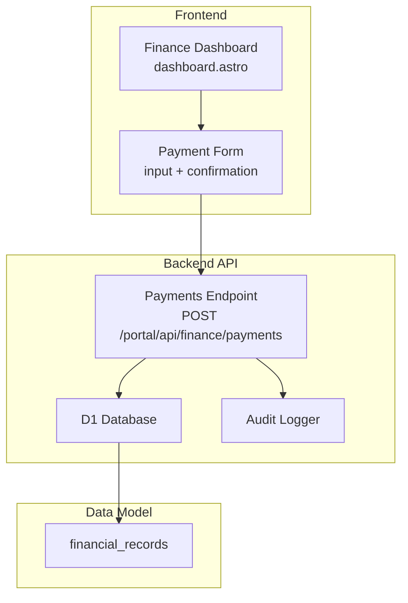
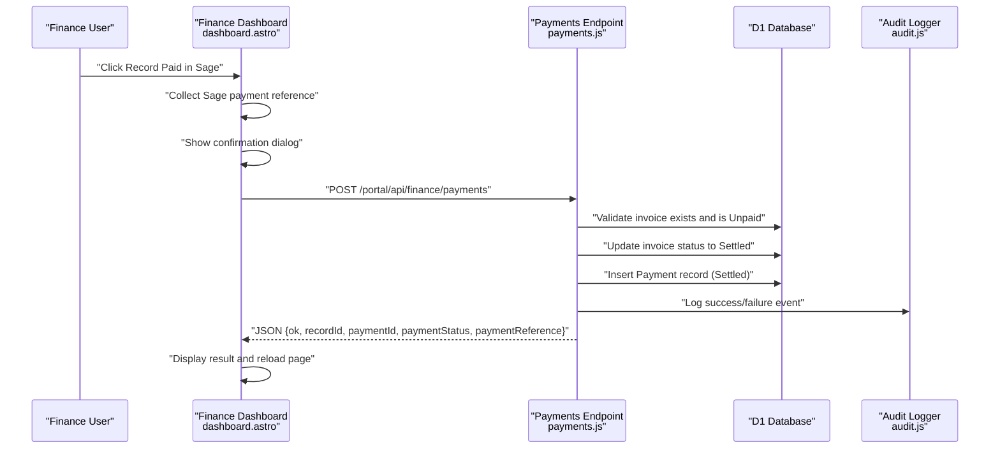
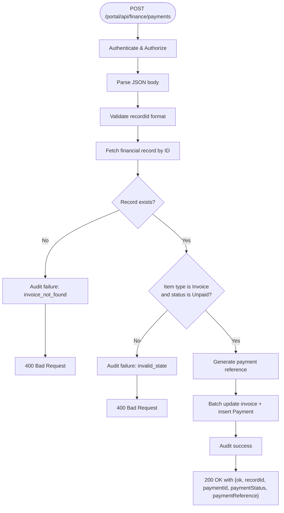
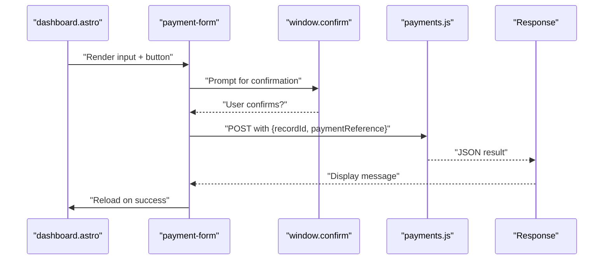
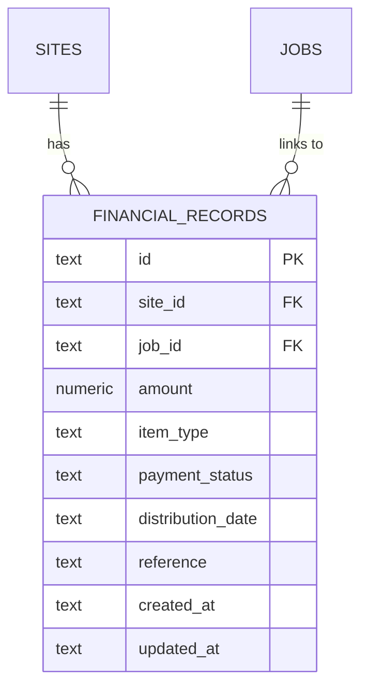
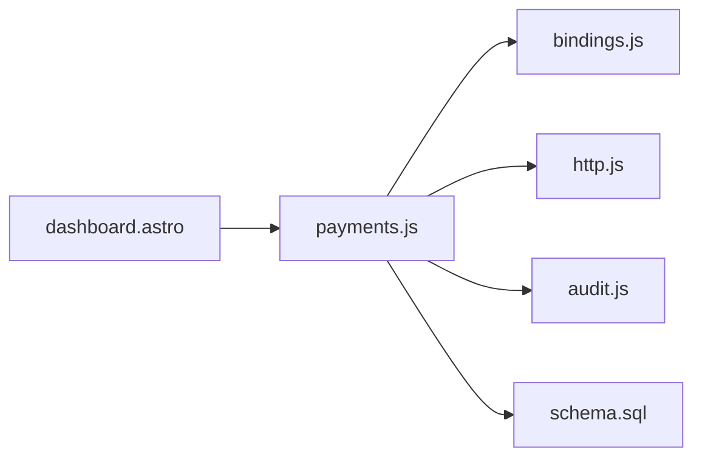

# Payment Processing

<cite>
**Referenced Files in This Document**
- [payments.js](file://src/pages/portal/api/finance/payments.js)
- [records.js](file://src/pages/portal/api/finance/records.js)
- [dashboard.astro](file://src/pages/portal/finance/dashboard.astro)
- [audit.js](file://src/lib/server/audit.js)
- [bindings.js](file://src/lib/server/bindings.js)
- [http.js](file://src/lib/server/http.js)
- [schema.sql](file://schema.sql)
- [PRODUCTION_AUDIT.md](file://docs/roadmap/PRODUCTION_AUDIT.md)
- [MASTER_ROADMAP.md](file://docs/roadmap/MASTER_ROADMAP.md)
</cite>

## Table of Contents
1. [Introduction](#introduction)
2. [Project Structure](#project-structure)
3. [Core Components](#core-components)
4. [Architecture Overview](#architecture-overview)
5. [Detailed Component Analysis](#detailed-component-analysis)
6. [Dependency Analysis](#dependency-analysis)
7. [Performance Considerations](#performance-considerations)
8. [Troubleshooting Guide](#troubleshooting-guide)
9. [Conclusion](#conclusion)
10. [Appendices](#appendices)

## Introduction
This document describes the payment processing system for capturing and reconciling customer payments against Sage accounting records. It covers the payment recording API endpoint, frontend validation and confirmation flows, error handling, audit logging, and the financial settlement workflow. It also explains the status transitions from Unpaid to Settled, required reference inputs, and practical examples for successful processing, failure handling, and audit trail maintenance.

## Project Structure
The payment processing system spans frontend and backend components:
- Frontend: Finance dashboard page renders payment forms and triggers the payment recording API.
- Backend: A Cloudflare Worker API endpoint validates inputs, enforces business rules, updates financial records, and logs audit events.
- Data model: Financial records table stores invoices, quotes, and payment entries with statuses and references.
- Audit: Centralized audit event logging for all sensitive actions.

**Diagram sources**
- [dashboard.astro:262-272](file://src/pages/portal/finance/dashboard.astro#L262-L272)
- [payments.js:13-105](file://src/pages/portal/api/finance/payments.js#L13-L105)
- [audit.js:3-32](file://src/lib/server/audit.js#L3-L32)
- [schema.sql:64-75](file://schema.sql#L64-L75)

**Section sources**
- [dashboard.astro:257-280](file://src/pages/portal/finance/dashboard.astro#L257-L280)
- [payments.js:1-105](file://src/pages/portal/api/finance/payments.js#L1-L105)
- [schema.sql:64-75](file://schema.sql#L64-L75)

## Core Components
- Payment Recording API
  - Validates authenticated user roles and request payload.
  - Ensures the target record is an unpaid Invoice.
  - Generates a Settled Payment entry and updates the original Invoice status.
  - Emits audit events for success and failure scenarios.
- Finance Dashboard
  - Renders payment forms for Unpaid Invoices.
  - Collects Sage payment reference input.
  - Presents a confirmation dialog before submission.
  - Displays feedback messages and reloads after success.
- Audit Logging
  - Captures event metadata including user, IP hash, user agent, and outcomes.
- Database Bindings
  - Provides access to Cloudflare D1 and R2 with runtime checks.

**Section sources**
- [payments.js:13-105](file://src/pages/portal/api/finance/payments.js#L13-L105)
- [dashboard.astro:262-272](file://src/pages/portal/finance/dashboard.astro#L262-L272)
- [audit.js:3-32](file://src/lib/server/audit.js#L3-L32)
- [bindings.js:18-26](file://src/lib/server/bindings.js#L18-L26)

## Architecture Overview
The payment capture flow integrates frontend UI, backend API, database, and audit logging.

**Diagram sources**
- [dashboard.astro:312-335](file://src/pages/portal/finance/dashboard.astro#L312-L335)
- [payments.js:13-105](file://src/pages/portal/api/finance/payments.js#L13-L105)
- [audit.js:3-32](file://src/lib/server/audit.js#L3-L32)

## Detailed Component Analysis

### Payment Recording API
Responsibilities:
- Authentication and authorization checks.
- Input validation for record identifiers and payment references.
- Business rule enforcement: only unpaid Invoice records can be captured.
- Atomic update of the Invoice and insertion of a Payment record.
- Audit event emission for both success and failure.

Key behaviors:
- Accepts JSON payload with recordId and optional paymentReference.
- Generates a default payment reference if none provided.
- Enforces role-based access (finance or admin).
- Uses batched database operations to maintain consistency.

**Diagram sources**
- [payments.js:13-105](file://src/pages/portal/api/finance/payments.js#L13-L105)
- [audit.js:3-32](file://src/lib/server/audit.js#L3-L32)

**Section sources**
- [payments.js:13-105](file://src/pages/portal/api/finance/payments.js#L13-L105)
- [http.js:22-32](file://src/lib/server/http.js#L22-L32)

### Finance Dashboard Payment Form
Responsibilities:
- Render payment input per Unpaid Invoice row.
- Capture Sage payment reference.
- Confirm action via browser dialog.
- Submit to backend API and display feedback.

Validation and UX:
- Input field for Sage payment reference with max length.
- Confirmation prompt before sending the request.
- Live feedback area for success or error messages.
- Automatic page reload upon success.

**Diagram sources**
- [dashboard.astro:262-272](file://src/pages/portal/finance/dashboard.astro#L262-L272)
- [dashboard.astro:312-335](file://src/pages/portal/finance/dashboard.astro#L312-L335)

**Section sources**
- [dashboard.astro:262-272](file://src/pages/portal/finance/dashboard.astro#L262-L272)
- [dashboard.astro:312-335](file://src/pages/portal/finance/dashboard.astro#L312-L335)

### Audit Trail and Compliance Alignment
- Audit events capture actor, role, event type, entity, outcome, IP hash, user agent, and metadata.
- Payment capture emits success/failure events with payment and invoice references.
- Terminology aligned with Sage: “Record Paid in Sage,” optional Sage references, and “Paid in Sage” status.

**Section sources**
- [audit.js:3-32](file://src/lib/server/audit.js#L3-L32)
- [payments.js:38-90](file://src/pages/portal/api/finance/payments.js#L38-L90)
- [PRODUCTION_AUDIT.md:77-85](file://docs/roadmap/PRODUCTION_AUDIT.md#L77-L85)

### Data Model: Financial Records
- Stores invoices, quotes, and payment entries.
- Supports item types: Quote, Invoice, Payment.
- Supports payment statuses: Pending Approval, Unpaid, Settled.
- Includes amount, distribution_date, optional job_id linkage, and reference fields.

**Diagram sources**
- [schema.sql:64-75](file://schema.sql#L64-L75)

**Section sources**
- [schema.sql:64-75](file://schema.sql#L64-L75)

### Sage Integration and Settlement Process
- No automated Sage API integration is implemented.
- Manual Sage references are accepted and stored alongside records.
- Payment capture sets status to Settled and inserts a Payment record with the provided or generated reference.
- Terminology and workflow emphasize manual reconciliation and Sage authority.

**Section sources**
- [MASTER_ROADMAP.md:235-242](file://docs/roadmap/MASTER_ROADMAP.md#L235-L242)
- [PRODUCTION_AUDIT.md:77-85](file://docs/roadmap/PRODUCTION_AUDIT.md#L77-L85)
- [payments.js:62-81](file://src/pages/portal/api/finance/payments.js#L62-L81)

## Dependency Analysis
- API depends on database bindings and HTTP utilities for consistent responses.
- Audit logger is invoked from API endpoints for all critical actions.
- Frontend relies on the API for payment capture and displays results.

**Diagram sources**
- [payments.js:1-3](file://src/pages/portal/api/finance/payments.js#L1-L3)
- [bindings.js:18-26](file://src/lib/server/bindings.js#L18-L26)
- [http.js:1-10](file://src/lib/server/http.js#L1-L10)
- [audit.js:3-32](file://src/lib/server/audit.js#L3-L32)
- [dashboard.astro:312-335](file://src/pages/portal/finance/dashboard.astro#L312-L335)
- [schema.sql:64-75](file://schema.sql#L64-L75)

**Section sources**
- [payments.js:1-3](file://src/pages/portal/api/finance/payments.js#L1-L3)
- [bindings.js:18-26](file://src/lib/server/bindings.js#L18-L26)
- [http.js:1-10](file://src/lib/server/http.js#L1-L10)
- [audit.js:3-32](file://src/lib/server/audit.js#L3-L32)
- [dashboard.astro:312-335](file://src/pages/portal/finance/dashboard.astro#L312-L335)
- [schema.sql:64-75](file://schema.sql#L64-L75)

## Performance Considerations
- Single-row fetch and batched writes minimize transaction overhead.
- Indexes on financial_records support efficient filtering and aggregation.
- Frontend reload after success simplifies state synchronization.

## Troubleshooting Guide
Common failure scenarios and handling:
- Unauthorized or insufficient permissions
  - Ensure the user has finance or admin role.
  - Expect a 401 or 403 response with a descriptive error.
- Invalid request body or malformed JSON
  - Expect a 400 response indicating invalid JSON.
- Record not found or invalid state
  - Only unpaid Invoice records can be captured.
  - Expect a 400 response with a reason included in the audit metadata.
- Server-side errors
  - Unexpected conditions return a 500 response; check server logs.

Audit events
- Review audit_events for timestamps, outcomes, and metadata to diagnose issues.

**Section sources**
- [payments.js:38-60](file://src/pages/portal/api/finance/payments.js#L38-L60)
- [payments.js:93-100](file://src/pages/portal/api/finance/payments.js#L93-L100)
- [audit.js:3-32](file://src/lib/server/audit.js#L3-L32)

## Conclusion
The payment processing system provides a secure, auditable pathway to mark Sage payments for unpaid invoices. It enforces strict business rules, supports manual Sage references, and maintains a complete audit trail. While no automated reconciliation or Sage API integration is implemented, the current design aligns with Sage authority and safeguards against double-entry errors through explicit confirmation and role-based controls.

## Appendices

### API Definition: Payment Capture
- Endpoint: POST /portal/api/finance/payments
- Request headers: Content-Type: application/json
- Request body:
  - recordId: string, required, validated format
  - paymentReference: string, optional, up to 80 chars
- Success response: 200 OK with { ok, recordId, paymentId, paymentStatus, paymentReference }
- Error responses:
  - 400 Bad Request for validation or business rule violations
  - 401 Unauthorized for missing or invalid session
  - 403 Forbidden for insufficient permissions
  - 500 Internal Server Error for unexpected failures

**Section sources**
- [payments.js:13-105](file://src/pages/portal/api/finance/payments.js#L13-L105)
- [http.js:22-46](file://src/lib/server/http.js#L22-L46)

### Practical Examples

- Successful payment capture
  - Scenario: An unpaid Invoice exists; user submits a Sage payment reference.
  - Outcome: Invoice status becomes Settled; a Payment record is inserted with the reference; audit event logged; UI shows success and reloads.
  - References: [payments.js:62-92](file://src/pages/portal/api/finance/payments.js#L62-L92), [dashboard.astro:312-335](file://src/pages/portal/finance/dashboard.astro#L312-L335)

- Payment failure: record not found
  - Scenario: A recordId is provided that does not exist.
  - Outcome: 400 Bad Request; audit failure event emitted with reason invoice_not_found.
  - References: [payments.js:38-47](file://src/pages/portal/api/finance/payments.js#L38-L47)

- Payment failure: invalid state
  - Scenario: Attempting to capture payment for a non-Unpaid Invoice.
  - Outcome: 400 Bad Request; audit failure event emitted with reason invalid_state.
  - References: [payments.js:50-59](file://src/pages/portal/api/finance/payments.js#L50-L59)

- Payment failure: unauthorized
  - Scenario: Non-finance/admin user attempts to capture payment.
  - Outcome: 403 Forbidden; no database mutation occurs.
  - References: [payments.js:15-17](file://src/pages/portal/api/finance/payments.js#L15-L17)

- Maintaining audit trails
  - All payment capture attempts emit an audit event with outcome and metadata.
  - References: [payments.js:38-90](file://src/pages/portal/api/finance/payments.js#L38-L90), [audit.js:3-32](file://src/lib/server/audit.js#L3-L32)