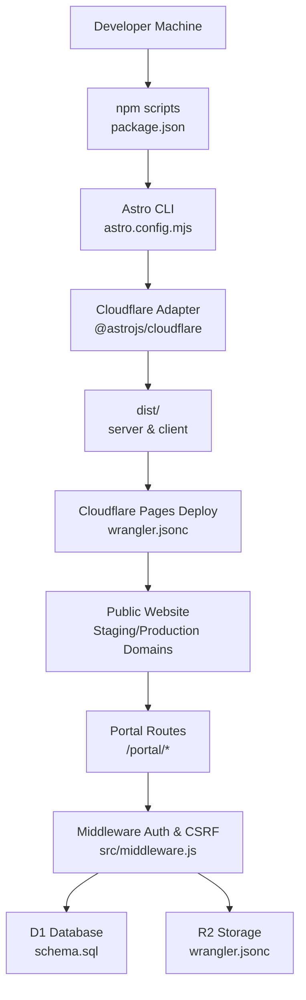
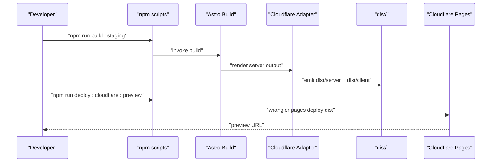
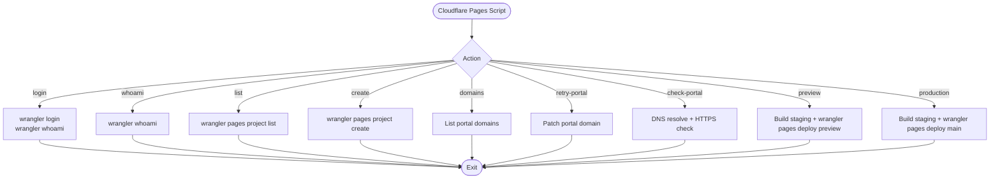
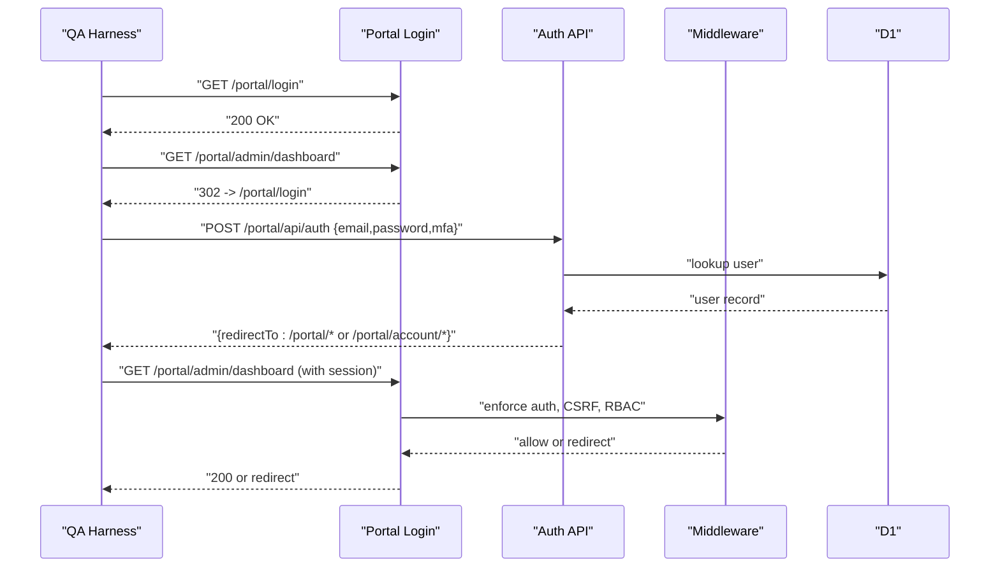
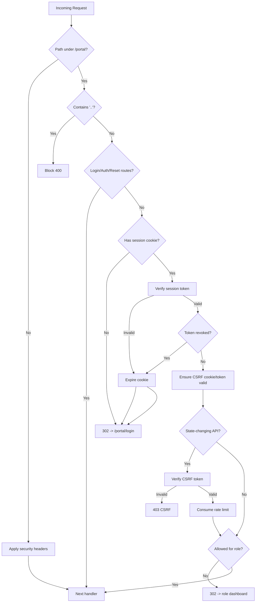
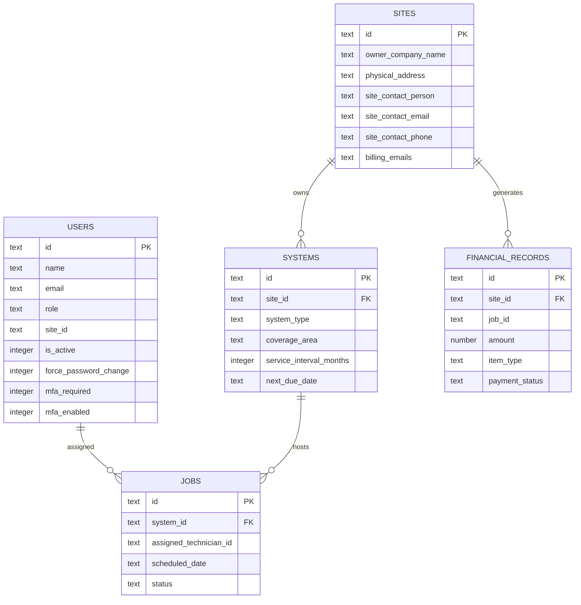
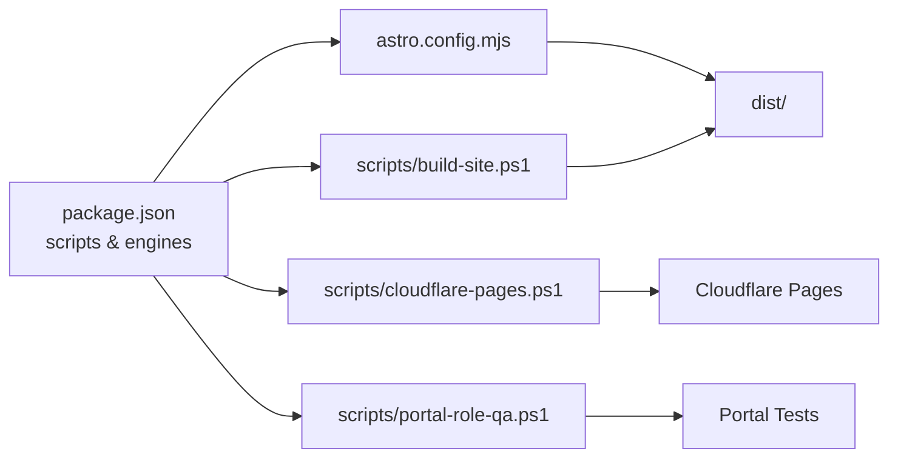

# Getting Started

<cite>
**Referenced Files in This Document**
- [README.md](file://README.md)
- [package.json](file://package.json)
- [astro.config.mjs](file://astro.config.mjs)
- [wrangler.jsonc](file://wrangler.jsonc)
- [tailwind.config.mjs](file://tailwind.config.mjs)
- [scripts/build-site.ps1](file://scripts/build-site.ps1)
- [scripts/cloudflare-pages.ps1](file://scripts/cloudflare-pages.ps1)
- [scripts/portal-role-qa.ps1](file://scripts/portal-role-qa.ps1)
- [src/middleware.js](file://src/middleware.js)
- [src/lib/server/auth.js](file://src/lib/server/auth.js)
- [schema.sql](file://schema.sql)
- [src/env.d.ts](file://src/env.d.ts)
</cite>

## Table of Contents
1. [Introduction](#introduction)
2. [Project Structure](#project-structure)
3. [Core Components](#core-components)
4. [Architecture Overview](#architecture-overview)
5. [Detailed Component Analysis](#detailed-component-analysis)
6. [Dependency Analysis](#dependency-analysis)
7. [Performance Considerations](#performance-considerations)
8. [Troubleshooting Guide](#troubleshooting-guide)
9. [Conclusion](#conclusion)
10. [Appendices](#appendices)

## Introduction
This guide helps you set up and develop the Kharon website locally, configure Cloudflare deployment, and test both the public website and the portal. It covers prerequisites, environment setup, local development workflow, Windows-specific script execution patterns, environment variables, and troubleshooting.

## Project Structure
The project is an Astro-based website with a Cloudflare SSR adapter and a companion portal secured by middleware and D1/R2 storage. Key areas:
- Public website under src/pages and src/components
- Portal pages under src/pages/portal and server-side logic under src/lib/server
- Build and deployment automation via npm scripts and PowerShell scripts
- Wrangler configuration for Cloudflare Pages and D1/R2 bindings

**Diagram sources**
- [package.json:10-32](file://package.json#L10-L32)
- [astro.config.mjs:1-21](file://astro.config.mjs#L1-L21)
- [wrangler.jsonc:1-38](file://wrangler.jsonc#L1-L38)
- [src/middleware.js:1-214](file://src/middleware.js#L1-L214)
- [schema.sql:1-245](file://schema.sql#L1-L245)

**Section sources**
- [README.md:1-51](file://README.md#L1-L51)
- [package.json:10-32](file://package.json#L10-L32)
- [astro.config.mjs:1-21](file://astro.config.mjs#L1-L21)
- [wrangler.jsonc:1-38](file://wrangler.jsonc#L1-L38)
- [tailwind.config.mjs:1-4](file://tailwind.config.mjs#L1-L4)

## Core Components
- Node.js and npm: The project enforces a minimum Node.js version and uses npm scripts for development and deployment.
- Astro with Cloudflare adapter: Builds a server output optimized for Cloudflare Workers/Pages.
- Wrangler configuration: Defines D1 database, R2 bucket, routes, and runtime variables.
- PowerShell scripts: Automate builds, Cloudflare authentication and deployments, and portal QA.
- Middleware and server auth: Enforces role-based routing, CSRF protection, rate limiting, and session management.

**Section sources**
- [package.json:6-9](file://package.json#L6-L9)
- [astro.config.mjs:5-20](file://astro.config.mjs#L5-L20)
- [wrangler.jsonc:19-37](file://wrangler.jsonc#L19-L37)
- [scripts/build-site.ps1:1-22](file://scripts/build-site.ps1#L1-L22)
- [scripts/cloudflare-pages.ps1:1-122](file://scripts/cloudflare-pages.ps1#L1-L122)
- [src/middleware.js:110-213](file://src/middleware.js#L110-L213)
- [src/lib/server/auth.js:34-118](file://src/lib/server/auth.js#L34-L118)

## Architecture Overview
The development and deployment pipeline integrates local tooling with Cloudflare’s platform:
- Local development runs via Astro dev server
- Builds target Cloudflare Pages with server output
- Portal routes are protected by middleware enforcing auth, CSRF, RBAC, and rate limits
- D1 and R2 are bound via Wrangler for persistent storage and file access

**Diagram sources**
- [package.json:13-31](file://package.json#L13-L31)
- [scripts/build-site.ps1:10-21](file://scripts/build-site.ps1#L10-L21)
- [scripts/cloudflare-pages.ps1:101-120](file://scripts/cloudflare-pages.ps1#L101-L120)
- [astro.config.mjs:9-13](file://astro.config.mjs#L9-L13)

## Detailed Component Analysis

### Prerequisites and Environment Setup
- Node.js and npm: Ensure Node.js meets the minimum version requirement and npm is recent enough.
- Cloudflare account and tokens: Configure Wrangler OAuth and ensure account ID/API token availability if needed.
- Windows execution policy: PowerShell scripts require bypassing default policies for local runs.
- Environment variables: PUBLIC_SITE_URL, PUBLIC_PORTAL_URL, PUBLIC_CONTACT_EMAIL control branding and links.

Step-by-step setup:
1. Install Node.js meeting the minimum requirement.
2. Open a terminal and navigate to the project root.
3. Install dependencies using the project’s npm script.
4. Configure environment variables for staging or production domains.
5. Authenticate with Cloudflare using the provided npm script.
6. Verify Wrangler whoami and project list.

Verification steps:
- Confirm the dev server starts and serves the public website.
- Confirm build outputs to dist with server and client assets.
- Confirm Cloudflare authentication and project listing succeed.

**Section sources**
- [package.json:6-9](file://package.json#L6-L9)
- [README.md:29-46](file://README.md#L29-L46)
- [scripts/cloudflare-pages.ps1:68-81](file://scripts/cloudflare-pages.ps1#L68-L81)
- [scripts/build-site.ps1:10-18](file://scripts/build-site.ps1#L10-L18)
- [astro.config.mjs:5](file://astro.config.mjs#L5)

### Local Development Workflow
- Install dependencies: Use the npm script to fetch all dependencies.
- Build staging: The staging build sets staging URLs and invokes the Astro build.
- Preview and deploy: Use Cloudflare Pages scripts to preview and promote to production.
- Development server: Start the Astro dev server for local iteration.

Windows-specific notes:
- Run PowerShell scripts with bypass execution policy.
- Use Node/npm commands from PowerShell for deterministic environment handling.

**Section sources**
- [package.json:10-32](file://package.json#L10-L32)
- [scripts/build-site.ps1:10-21](file://scripts/build-site.ps1#L10-L21)
- [scripts/cloudflare-pages.ps1:101-120](file://scripts/cloudflare-pages.ps1#L101-L120)
- [README.md:29-42](file://README.md#L29-L42)

### Cloudflare Pages and Wrangler Configuration
- Wrangler configuration defines:
  - Project name and compatibility date
  - Routes for staging and portal domains
  - D1 database binding and migrations directory
  - R2 bucket binding
  - Runtime variables (e.g., session cookie name, fee)
- Cloudflare Pages script supports:
  - OAuth login and whoami
  - Project listing and creation
  - Domain inspection and portal retry
  - Preview and production deployments

**Diagram sources**
- [scripts/cloudflare-pages.ps1:67-121](file://scripts/cloudflare-pages.ps1#L67-L121)
- [wrangler.jsonc:19-37](file://wrangler.jsonc#L19-L37)

**Section sources**
- [wrangler.jsonc:1-38](file://wrangler.jsonc#L1-L38)
- [scripts/cloudflare-pages.ps1:19-31](file://scripts/cloudflare-pages.ps1#L19-L31)
- [scripts/cloudflare-pages.ps1:58-121](file://scripts/cloudflare-pages.ps1#L58-L121)

### Portal Functionality Testing
- Automated role QA harness validates:
  - Unauthenticated access to dashboards is redirected
  - Encoded traversal is handled safely
  - Authenticated dashboards expose CSRF tokens
  - Logout prevents token replay
  - Credentials can authenticate per role
- Manual QA checklist covers authentication, MFA, RBAC, data access, state-changing actions, documents, technician workflow, admin UX, and public contact form behavior.

**Diagram sources**
- [scripts/portal-role-qa.ps1:239-265](file://scripts/portal-role-qa.ps1#L239-L265)
- [src/middleware.js:110-213](file://src/middleware.js#L110-L213)
- [src/lib/server/auth.js:48-108](file://src/lib/server/auth.js#L48-L108)

**Section sources**
- [scripts/portal-role-qa.ps1:1-291](file://scripts/portal-role-qa.ps1#L1-L291)
- [docs/qa/PORTAL_ROLE_QA_CHECKLIST.md:1-136](file://docs/qa/PORTAL_ROLE_QA_CHECKLIST.md#L1-L136)
- [src/middleware.js:110-213](file://src/middleware.js#L110-L213)
- [src/lib/server/auth.js:34-118](file://src/lib/server/auth.js#L34-L118)

### Middleware and Security Controls
- Authentication and session management:
  - Session token creation and verification using HMAC
  - Revocation via fingerprinted tokens stored in D1
  - Cookie configuration with secure flags depending on environment
- CSRF protection:
  - CSRF token generation and verification
  - Blocking state-changing requests without valid CSRF
- Rate limiting:
  - Per-endpoint rate limits with retry-after headers
- RBAC and traversal checks:
  - Role-based allowed paths
  - Traversal detection and blocking

**Diagram sources**
- [src/middleware.js:110-213](file://src/middleware.js#L110-L213)
- [src/lib/server/auth.js:48-157](file://src/lib/server/auth.js#L48-L157)

**Section sources**
- [src/middleware.js:19-31](file://src/middleware.js#L19-L31)
- [src/middleware.js:57-71](file://src/middleware.js#L57-L71)
- [src/middleware.js:110-213](file://src/middleware.js#L110-L213)
- [src/lib/server/auth.js:34-118](file://src/lib/server/auth.js#L34-L118)

### Database Schema and Bindings
- D1 schema defines core entities: users, sites, systems, jobs, financial records, maintenance requests, audit logs, job evidence, document access logs, rate limits, password reset tokens, revoked sessions, and contact submissions.
- Wrangler binds D1 and R2 to the worker and exposes them to the application.

**Diagram sources**
- [schema.sql:3-245](file://schema.sql#L3-L245)
- [wrangler.jsonc:19-32](file://wrangler.jsonc#L19-L32)

**Section sources**
- [schema.sql:1-245](file://schema.sql#L1-L245)
- [wrangler.jsonc:19-32](file://wrangler.jsonc#L19-L32)

## Dependency Analysis
- Toolchain dependencies:
  - Astro, TailwindCSS, and Cloudflare adapter for SSR
  - Wrangler for Cloudflare Pages and D1/R2 operations
- Scripts orchestrate:
  - Build selection (staging vs production) via environment variables
  - Cloudflare authentication and deployment flows
  - Portal QA harness with role-based assertions

**Diagram sources**
- [package.json:10-32](file://package.json#L10-L32)
- [astro.config.mjs:1-21](file://astro.config.mjs#L1-L21)
- [scripts/cloudflare-pages.ps1:1-122](file://scripts/cloudflare-pages.ps1#L1-L122)
- [scripts/build-site.ps1:1-22](file://scripts/build-site.ps1#L1-L22)
- [scripts/portal-role-qa.ps1:1-291](file://scripts/portal-role-qa.ps1#L1-L291)

**Section sources**
- [package.json:33-41](file://package.json#L33-L41)
- [package.json:10-32](file://package.json#L10-L32)

## Performance Considerations
- Chunk size warnings are tuned in Vite to balance bundle size and load performance.
- Middleware performs lightweight checks; keep CSRF and rate-limit scopes minimal and targeted.
- Prefer static assets and minimize dynamic server rendering for frequently accessed public pages.

[No sources needed since this section provides general guidance]

## Troubleshooting Guide
Common setup and development issues:
- Node.js version mismatch:
  - Symptom: npm install or build fails early.
  - Fix: Upgrade Node.js to meet the minimum version and retry installation.
- PowerShell execution policy errors:
  - Symptom: Scripts fail with execution policy errors.
  - Fix: Run scripts with the documented bypass flags from PowerShell.
- Cloudflare authentication failures:
  - Symptom: Wrangler login or whoami fails.
  - Fix: Re-run the authentication script and confirm OAuth consent; check environment variables for account ID/tokens if used.
- Missing SESSION_SECRET:
  - Symptom: Session creation/validation errors.
  - Fix: Set the required session secret in the Cloudflare environment variables.
- Portal dashboards redirect unexpectedly:
  - Symptom: Redirects to login or role dashboard.
  - Fix: Ensure credentials match roles and MFA requirements; review middleware enforcement and CSRF cookie presence.
- Rate limit exceeded:
  - Symptom: 429 responses with retry-after.
  - Fix: Back off and retry; reduce bursty API calls to the portal endpoints.
- D1/R2 connectivity:
  - Symptom: Database or storage errors during portal operations.
  - Fix: Confirm Wrangler bindings and migration status; verify database permissions and bucket access.

**Section sources**
- [package.json:6-9](file://package.json#L6-L9)
- [scripts/cloudflare-pages.ps1:19-31](file://scripts/cloudflare-pages.ps1#L19-L31)
- [src/lib/server/auth.js:34-40](file://src/lib/server/auth.js#L34-L40)
- [src/middleware.js:166-183](file://src/middleware.js#L166-L183)
- [wrangler.jsonc:19-37](file://wrangler.jsonc#L19-L37)

## Conclusion
You now have a complete path to set up the development environment, build and deploy the website to Cloudflare, and test the portal’s security and functionality. Use the provided scripts and configuration to streamline local development and ensure consistent staging and production behavior.

[No sources needed since this section summarizes without analyzing specific files]

## Appendices

### Environment Variables Reference
- PUBLIC_SITE_URL: Controls canonical and www domains for the public website.
- PUBLIC_PORTAL_URL: Controls portal hostname and routes.
- PUBLIC_CONTACT_EMAIL: Used in public forms and notifications.
- SESSION_SECRET or AUTH_SECRET: Required for session token signing.
- CLOUDFLARE_ACCOUNT_ID: Optional override for Wrangler account selection.
- CLOUDFLARE_API_TOKEN: Optional for direct API usage; OAuth preferred for most commands.

**Section sources**
- [README.md:21-27](file://README.md#L21-L27)
- [scripts/build-site.ps1:10-18](file://scripts/build-site.ps1#L10-L18)
- [src/lib/server/auth.js:34-40](file://src/lib/server/auth.js#L34-L40)
- [scripts/cloudflare-pages.ps1:10-17](file://scripts/cloudflare-pages.ps1#L10-L17)

### Initial Verification Checklist
- Node.js and npm satisfy engine requirements.
- npm install completes without errors.
- npm run build:staging succeeds and emits dist.
- npm run auth:cloudflare completes and shows whoami.
- npm run deploy:cloudflare:preview deploys successfully.
- npm run dev starts the local server and serves pages.
- Portal QA harness reports PASS for unauthenticated and traversal checks.
- Role-based authentication and CSRF protections are validated.

**Section sources**
- [package.json:6-9](file://package.json#L6-L9)
- [package.json:13-31](file://package.json#L13-L31)
- [scripts/build-site.ps1:20](file://scripts/build-site.ps1#L20)
- [scripts/cloudflare-pages.ps1:68-81](file://scripts/cloudflare-pages.ps1#L68-L81)
- [scripts/portal-role-qa.ps1:239-265](file://scripts/portal-role-qa.ps1#L239-L265)