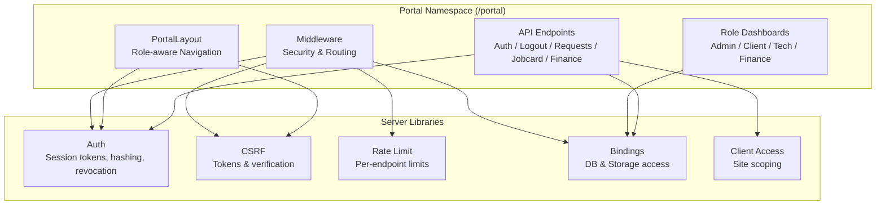
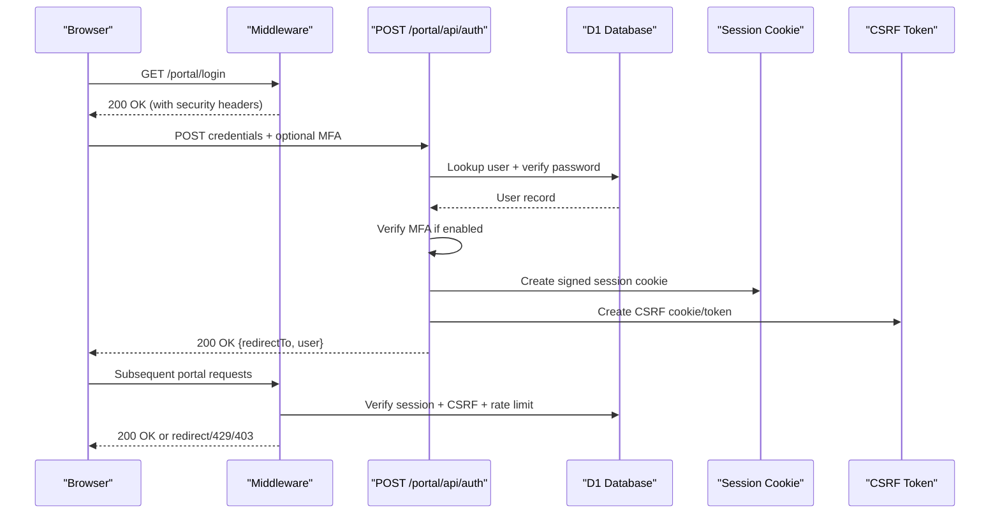
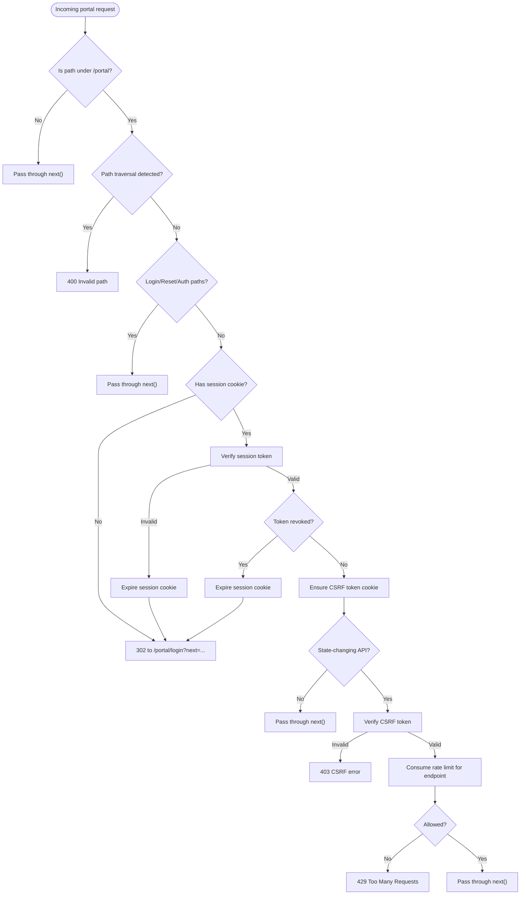
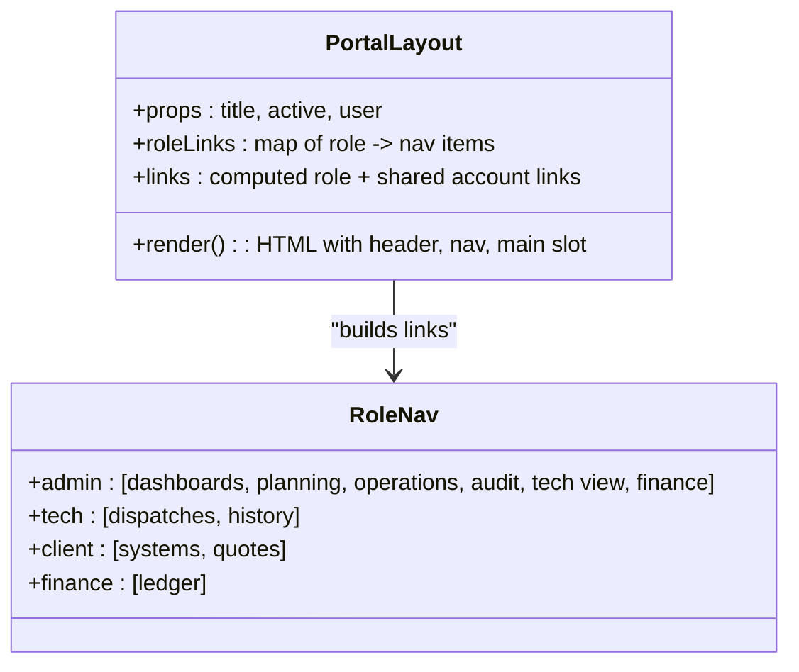
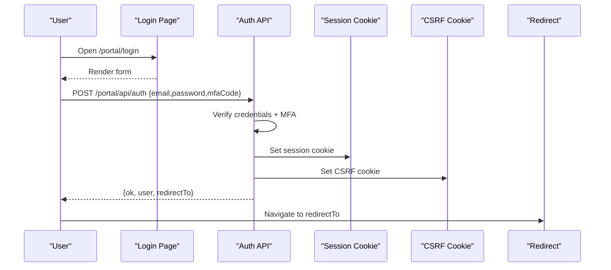
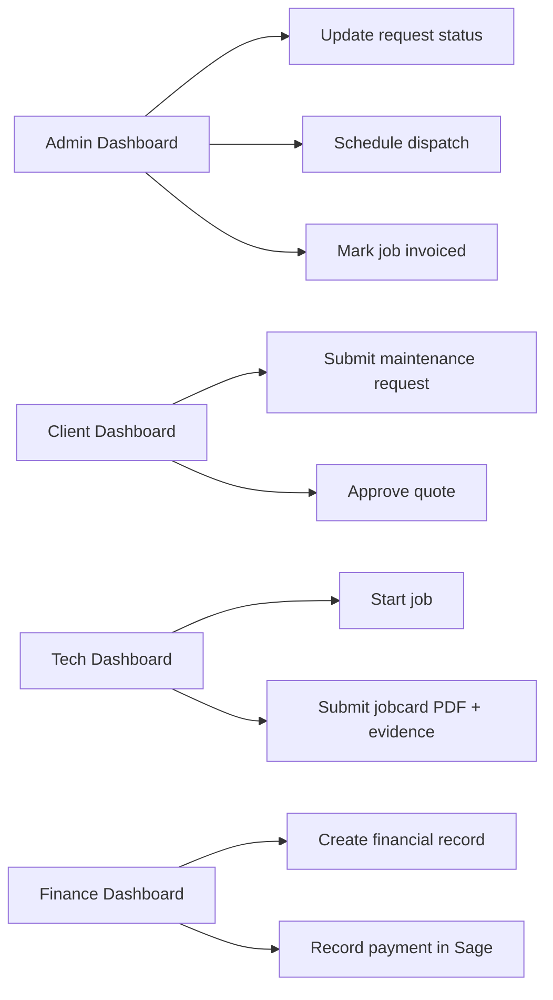
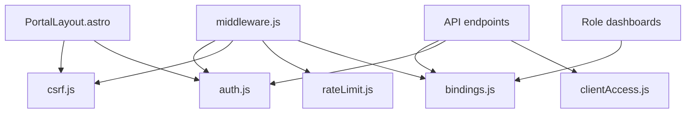

# Portal System Architecture

<cite>
**Referenced Files in This Document**
- [middleware.js](file://src/middleware.js)
- [PortalLayout.astro](file://src/layouts/portal/PortalLayout.astro)
- [auth.js](file://src/lib/server/auth.js)
- [login.astro](file://src/pages/portal/login.astro)
- [auth.js](file://src/pages/portal/api/auth.js)
- [logout.js](file://src/pages/portal/api/logout.js)
- [maintenance-request.js](file://src/pages/portal/api/maintenance-request.js)
- [submit-jobcard.js](file://src/pages/portal/api/submit-jobcard.js)
- [admin-dashboard.astro](file://src/pages/portal/admin/dashboard.astro)
- [client-dashboard.astro](file://src/pages/portal/client/dashboard.astro)
- [tech-dashboard.astro](file://src/pages/portal/tech/dashboard.astro)
- [finance-dashboard.astro](file://src/pages/portal/finance/dashboard.astro)
- [csrf.js](file://src/lib/server/csrf.js)
- [rateLimit.js](file://src/lib/server/rateLimit.js)
- [bindings.js](file://src/lib/server/bindings.js)
- [clientAccess.js](file://src/lib/server/clientAccess.js)
</cite>

## Table of Contents
1. [Introduction](#introduction)
2. [Project Structure](#project-structure)
3. [Core Components](#core-components)
4. [Architecture Overview](#architecture-overview)
5. [Detailed Component Analysis](#detailed-component-analysis)
6. [Dependency Analysis](#dependency-analysis)
7. [Performance Considerations](#performance-considerations)
8. [Troubleshooting Guide](#troubleshooting-guide)
9. [Conclusion](#conclusion)

## Introduction
This document describes the portal system architecture for a multi-role dashboard environment. It explains the portal layout system with role-specific navigation, the middleware security enforcement layer, and the modular API endpoint organization. It also covers portal routing patterns, authentication integration, role-based content rendering, separation from public website functionality, secure data access patterns, responsive design adaptation, and user experience optimization. Practical examples illustrate portal navigation, role-specific dashboards, and administrative workflows, alongside performance considerations, security hardening, and user session management.

## Project Structure
The portal is implemented as part of an Astro-based site with a dedicated portal namespace under /portal. The structure separates:
- Middleware for global security and routing enforcement
- Layout templates for role-aware navigation
- Role-specific dashboard pages
- Modular API endpoints for portal operations
- Server-side libraries for auth, CSRF, rate limiting, and data access

**Diagram sources**
- [middleware.js:110-213](file://src/middleware.js#L110-L213)
- [PortalLayout.astro:10-35](file://src/layouts/portal/PortalLayout.astro#L10-L35)
- [auth.js:48-108](file://src/lib/server/auth.js#L48-L108)
- [csrf.js:36-70](file://src/lib/server/csrf.js#L36-L70)
- [rateLimit.js:3-46](file://src/lib/server/rateLimit.js#L3-L46)
- [bindings.js:3-16](file://src/lib/server/bindings.js#L3-L16)
- [clientAccess.js:1-26](file://src/lib/server/clientAccess.js#L1-L26)

**Section sources**
- [middleware.js:110-213](file://src/middleware.js#L110-L213)
- [PortalLayout.astro:10-35](file://src/layouts/portal/PortalLayout.astro#L10-L35)

## Core Components
- Middleware enforces security headers, session validation, CSRF protection, rate limiting, and role-based access for portal routes.
- PortalLayout renders role-specific navigation and injects CSRF token for frontend fetch helpers.
- Authentication integrates login, MFA verification, session creation, and logout with audit logging.
- API endpoints encapsulate state-changing operations with strict input validation, authorization checks, and audit events.
- Role dashboards render role-specific content and orchestrate user workflows via AJAX to API endpoints.

**Section sources**
- [middleware.js:19-31](file://src/middleware.js#L19-L31)
- [PortalLayout.astro:10-35](file://src/layouts/portal/PortalLayout.astro#L10-L35)
- [auth.js:48-108](file://src/lib/server/auth.js#L48-L108)
- [auth.js:36-166](file://src/pages/portal/api/auth.js#L36-L166)
- [logout.js:9-32](file://src/pages/portal/api/logout.js#L9-L32)

## Architecture Overview
The portal architecture follows a layered approach:
- Transport and Edge: Cloudflare Workers runtime with D1 (SQLite) and R2 storage.
- Middleware: Global request interception for security and routing.
- Frontend: Astro components with role-aware layouts and interactive widgets.
- Backend APIs: Modular endpoints for authentication, logout, maintenance requests, jobcard closure, and finance operations.
- Security: HMAC-signed sessions, CSRF tokens, rate limiting, and audit trails.

**Diagram sources**
- [middleware.js:110-213](file://src/middleware.js#L110-L213)
- [auth.js:36-166](file://src/pages/portal/api/auth.js#L36-L166)
- [login.astro:59-84](file://src/pages/portal/login.astro#L59-L84)

## Detailed Component Analysis

### Middleware Security Enforcement Layer
Responsibilities:
- Enforce security headers on all portal responses.
- Redirect unauthenticated users to login with next param.
- Validate session tokens and revoked tokens.
- Inject CSRF tokens and enforce CSRF on state-changing API calls.
- Apply per-endpoint rate limits for sensitive operations.
- Redirect to role-specific dashboards and enforce path-based role access.
- Audit blocked attempts for security events.

Key behaviors:
- Path traversal detection prevents directory traversal in URLs.
- Role-based allowedForPath restricts access to role-specific namespaces.
- Rate limit configuration is keyed by endpoint path with per-scope limits.
- Force password change and MFA enforcement redirect users to remediation pages.

**Diagram sources**
- [middleware.js:110-213](file://src/middleware.js#L110-L213)
- [csrf.js:36-70](file://src/lib/server/csrf.js#L36-L70)
- [rateLimit.js:3-46](file://src/lib/server/rateLimit.js#L3-L46)

**Section sources**
- [middleware.js:19-31](file://src/middleware.js#L19-L31)
- [middleware.js:57-63](file://src/middleware.js#L57-L63)
- [middleware.js:88-108](file://src/middleware.js#L88-L108)
- [middleware.js:117-119](file://src/middleware.js#L117-L119)
- [middleware.js:146-152](file://src/middleware.js#L146-L152)
- [middleware.js:154-184](file://src/middleware.js#L154-L184)
- [middleware.js:186-208](file://src/middleware.js#L186-L208)

### Portal Layout System and Role-Specific Navigation
- PortalLayout constructs role-aware navigation menus and appends a CSRF meta tag for frontend fetch helper.
- Navigation links vary by role and include role-specific dashboards and shared account settings.
- The layout injects a window.kharonPortalFetch helper that auto-attaches CSRF tokens.

**Diagram sources**
- [PortalLayout.astro:10-35](file://src/layouts/portal/PortalLayout.astro#L10-L35)
- [PortalLayout.astro:48-55](file://src/layouts/portal/PortalLayout.astro#L48-L55)

**Section sources**
- [PortalLayout.astro:10-35](file://src/layouts/portal/PortalLayout.astro#L10-L35)
- [PortalLayout.astro:48-55](file://src/layouts/portal/PortalLayout.astro#L48-L55)
- [PortalLayout.astro:97-105](file://src/layouts/portal/PortalLayout.astro#L97-L105)

### Authentication Integration and Session Management
- Login page posts credentials to /portal/api/auth, optionally including MFA code.
- Server verifies credentials, applies rate limiting, and creates an HMAC-signed session token.
- Session cookie is HttpOnly, SameSite=Strict, and includes role, name, email, and MFA flags.
- On successful login, users are redirected to role-specific dashboards or remediation pages (password change or MFA enablement).
- Logout revokes the session token and clears session and CSRF cookies.

**Diagram sources**
- [login.astro:59-84](file://src/pages/portal/login.astro#L59-L84)
- [auth.js:36-166](file://src/pages/portal/api/auth.js#L36-L166)
- [auth.js:110-118](file://src/lib/server/auth.js#L110-L118)
- [csrf.js:98-106](file://src/lib/server/csrf.js#L98-L106)
- [logout.js:9-32](file://src/pages/portal/api/logout.js#L9-L32)

**Section sources**
- [login.astro:28-55](file://src/pages/portal/login.astro#L28-L55)
- [auth.js:36-166](file://src/pages/portal/api/auth.js#L36-L166)
- [auth.js:110-118](file://src/lib/server/auth.js#L110-L118)
- [logout.js:9-32](file://src/pages/portal/api/logout.js#L9-L32)

### Role-Based Content Rendering and Workflows
- Admin dashboard aggregates operational metrics, client requests, overdue systems, missing documentation, and finance follow-ups. It supports updating request status and scheduling dispatches, and marking jobs as invoiced.
- Client dashboard displays mapped sites, system lifecycle status, pending quotes, and recent requests. It allows submitting maintenance requests and approving quotes.
- Tech dashboard lists assigned dispatches, enables starting jobs, and captures jobcard submissions with signature, photos, and comments.
- Finance dashboard shows ledger totals, aging, and exceptions requiring invoices. It supports creating financial records and recording payments.

**Diagram sources**
- [admin-dashboard.astro:331-392](file://src/pages/portal/admin/dashboard.astro#L331-L392)
- [client-dashboard.astro:248-300](file://src/pages/portal/client/dashboard.astro#L248-L300)
- [tech-dashboard.astro:227-300](file://src/pages/portal/tech/dashboard.astro#L227-L300)
- [finance-dashboard.astro:312-335](file://src/pages/portal/finance/dashboard.astro#L312-L335)

**Section sources**
- [admin-dashboard.astro:20-123](file://src/pages/portal/admin/dashboard.astro#L20-L123)
- [client-dashboard.astro:16-84](file://src/pages/portal/client/dashboard.astro#L16-L84)
- [tech-dashboard.astro:11-36](file://src/pages/portal/tech/dashboard.astro#L11-L36)
- [finance-dashboard.astro:16-99](file://src/pages/portal/finance/dashboard.astro#L16-L99)

### Modular API Endpoint Organization
Endpoints are organized by domain:
- Authentication: /portal/api/auth (POST), /portal/api/logout (POST)
- Client operations: /portal/api/maintenance-request (POST)
- Field operations: /portal/api/job-status (POST), /portal/api/submit-jobcard (POST)
- Finance: /portal/api/finance/records (POST), /portal/api/finance/payments (POST), export endpoints
- Admin: /portal/api/admin/* (users, sites, systems, jobs, import, maintenance-requests, audits, exports)

Each endpoint validates inputs, enforces authorization, performs database operations, and logs audit events. Rate limiting is applied per endpoint with tailored thresholds.

**Section sources**
- [auth.js:36-166](file://src/pages/portal/api/auth.js#L36-L166)
- [logout.js:9-32](file://src/pages/portal/api/logout.js#L9-L32)
- [maintenance-request.js:32-90](file://src/pages/portal/api/maintenance-request.js#L32-L90)
- [submit-jobcard.js:51-302](file://src/pages/portal/api/submit-jobcard.js#L51-L302)
- [finance-dashboard.astro:326-335](file://src/pages/portal/finance/dashboard.astro#L326-L335)

### Secure Data Access Patterns
- Database and storage bindings are accessed via a unified getter that throws if bindings are missing.
- Client access is scoped to mapped sites using clientSiteIds and clientCanAccessSite helpers.
- Evidence photos and jobcards are stored in R2 with metadata and controlled content types.
- Audit events are recorded for all significant actions (auth, CSRF, rate limit, jobcard close, finance operations).

**Section sources**
- [bindings.js:3-16](file://src/lib/server/bindings.js#L3-L16)
- [clientAccess.js:1-26](file://src/lib/server/clientAccess.js#L1-L26)
- [submit-jobcard.js:180-209](file://src/pages/portal/api/submit-jobcard.js#L180-L209)

### Responsive Design Adaptation and UX Optimization
- Layout uses viewport meta and Tailwind-based responsive grids and spacing.
- Role-specific dashboards adapt content density and controls for different tasks (forms, tables, canvases).
- Interactive elements include client-side filtering, dynamic selects, and confirmation dialogs for irreversible actions.

**Section sources**
- [PortalLayout.astro:42-47](file://src/layouts/portal/PortalLayout.astro#L42-L47)
- [client-dashboard.astro:234-246](file://src/pages/portal/client/dashboard.astro#L234-L246)
- [finance-dashboard.astro:288-310](file://src/pages/portal/finance/dashboard.astro#L288-L310)

## Dependency Analysis
The middleware orchestrates cross-cutting concerns and delegates to server libraries for auth, CSRF, rate limiting, and database access. Role dashboards depend on database queries and API endpoints. API endpoints depend on server libraries for validation, hashing, storage, and auditing.

**Diagram sources**
- [middleware.js:110-213](file://src/middleware.js#L110-L213)
- [PortalLayout.astro:10-35](file://src/layouts/portal/PortalLayout.astro#L10-L35)
- [bindings.js:3-16](file://src/lib/server/bindings.js#L3-L16)
- [clientAccess.js:1-26](file://src/lib/server/clientAccess.js#L1-L26)

**Section sources**
- [middleware.js:110-213](file://src/middleware.js#L110-L213)
- [PortalLayout.astro:10-35](file://src/layouts/portal/PortalLayout.astro#L10-L35)

## Performance Considerations
- Middleware rate limiting reduces load on sensitive endpoints; tune maxAttempts per endpoint to balance usability and abuse prevention.
- Batched database queries in dashboards minimize round-trips; ensure indexes exist for join and filter columns.
- Client-side filtering avoids unnecessary network requests; debounce search inputs for large ledgers.
- Storage writes for jobcards and evidence are asynchronous; ensure upload sizes and counts are validated before upload.
- Session and CSRF cookies are short-lived; reduce cookie overhead and improve cacheability for static assets outside the portal.

## Troubleshooting Guide
Common issues and remedies:
- 400 Invalid portal path: Indicates path traversal detection; sanitize inputs and avoid ../ segments.
- 401 Unauthorized: Missing or invalid session; ensure cookies are accepted and session not revoked.
- 403 CSRF error: Missing or invalid x-csrf-token; confirm CSRF cookie is set and fetch helper attaches token.
- 429 Too Many Requests: Exceeded rate limit for endpoint; wait for retry-after or reduce request frequency.
- 403 Forbidden: Insufficient permissions or wrong technician assignment; verify role and ownership.
- 400 Bad Request: Validation errors in API payloads; check input types, lengths, and required fields.

**Section sources**
- [middleware.js:117-119](file://src/middleware.js#L117-L119)
- [middleware.js:131-142](file://src/middleware.js#L131-L142)
- [middleware.js:154-164](file://src/middleware.js#L154-L164)
- [middleware.js:173-182](file://src/middleware.js#L173-L182)
- [maintenance-request.js:32-90](file://src/pages/portal/api/maintenance-request.js#L32-L90)
- [submit-jobcard.js:51-302](file://src/pages/portal/api/submit-jobcard.js#L51-L302)

## Conclusion
The portal system employs a robust middleware-driven security model, role-aware layouts, and modular API endpoints to deliver a secure, responsive, and efficient multi-role dashboard environment. Strong session and CSRF protections, granular rate limiting, and strict authorization checks ensure safe access to sensitive operations. Dashboards are optimized for their roles, with clear navigation and streamlined workflows. The architecture balances performance with security and provides clear audit trails for compliance and monitoring.