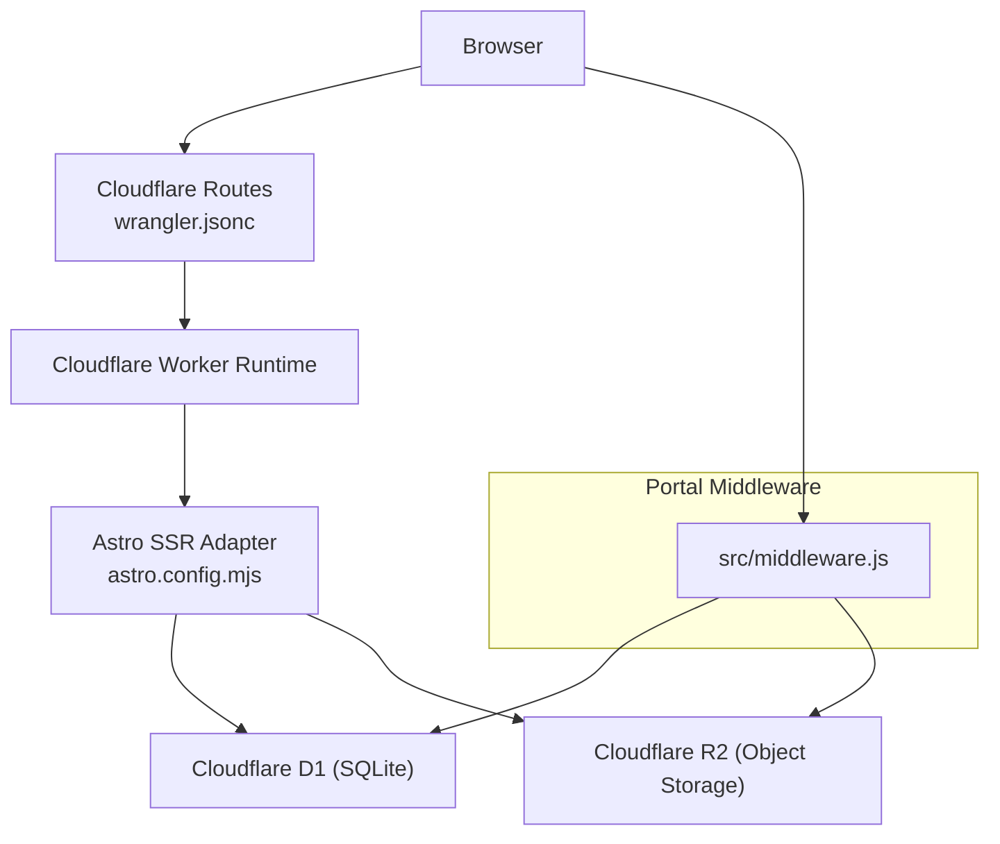
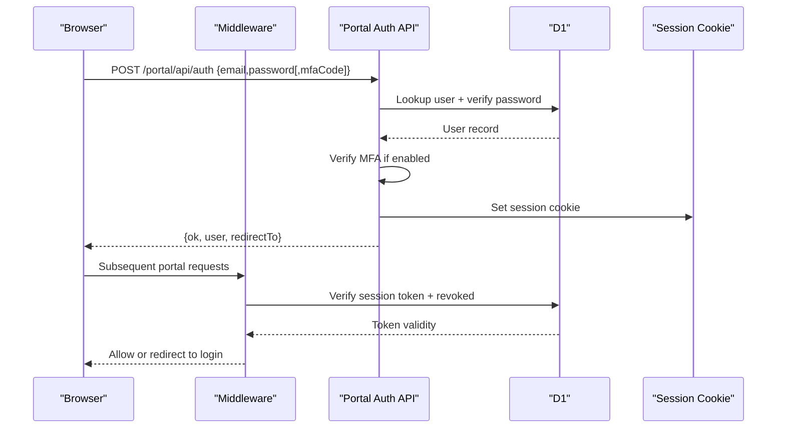
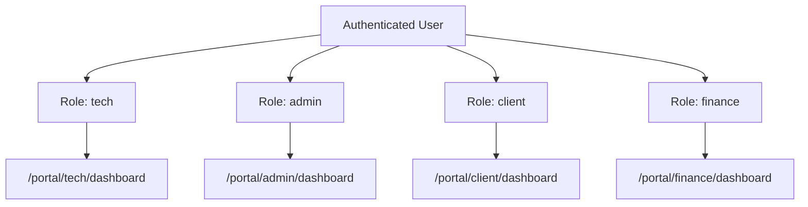
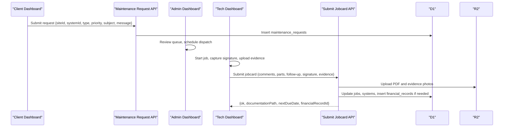
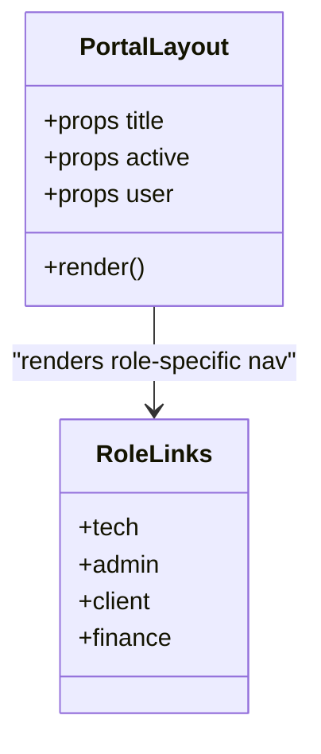
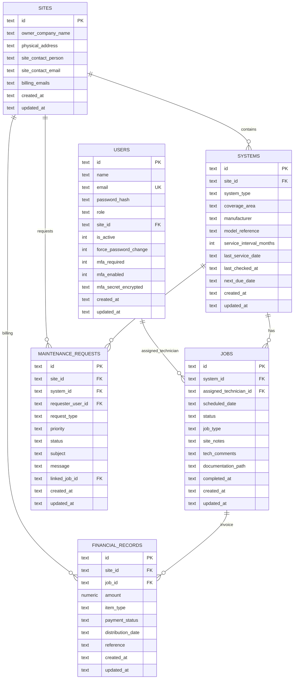
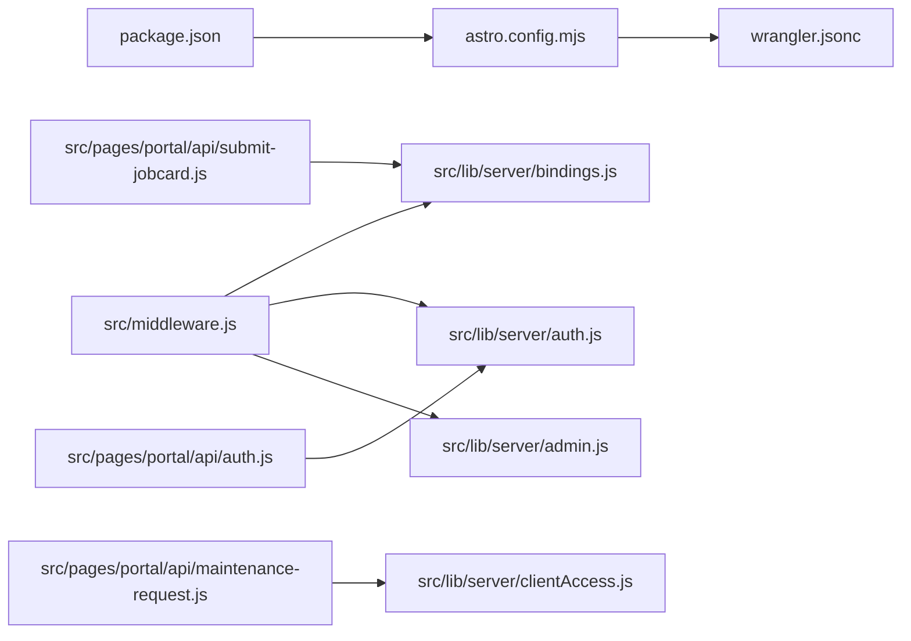

# Project Overview

<cite>
**Referenced Files in This Document**
- [README.md](file://README.md)
- [package.json](file://package.json)
- [astro.config.mjs](file://astro.config.mjs)
- [wrangler.jsonc](file://wrangler.jsonc)
- [src/middleware.js](file://src/middleware.js)
- [src/lib/server/auth.js](file://src/lib/server/auth.js)
- [src/lib/server/admin.js](file://src/lib/server/admin.js)
- [src/lib/server/bindings.js](file://src/lib/server/bindings.js)
- [src/lib/server/clientAccess.js](file://src/lib/server/clientAccess.js)
- [src/layouts/portal/PortalLayout.astro](file://src/layouts/portal/PortalLayout.astro)
- [src/pages/portal/api/auth.js](file://src/pages/portal/api/auth.js)
- [src/pages/portal/api/maintenance-request.js](file://src/pages/portal/api/maintenance-request.js)
- [src/pages/portal/api/submit-jobcard.js](file://src/pages/portal/api/submit-jobcard.js)
- [src/pages/portal/admin/dashboard.astro](file://src/pages/portal/admin/dashboard.astro)
- [src/pages/portal/tech/dashboard.astro](file://src/pages/portal/tech/dashboard.astro)
- [src/pages/portal/client/dashboard.astro](file://src/pages/portal/client/dashboard.astro)
- [schema.sql](file://schema.sql)
- [migrations/0001_kharon_portal.sql](file://migrations/0001_kharon_portal.sql)
</cite>

## Table of Contents
1. [Introduction](#introduction)
2. [Project Structure](#project-structure)
3. [Core Components](#core-components)
4. [Architecture Overview](#architecture-overview)
5. [Detailed Component Analysis](#detailed-component-analysis)
6. [Dependency Analysis](#dependency-analysis)
7. [Performance Considerations](#performance-considerations)
8. [Troubleshooting Guide](#troubleshooting-guide)
9. [Conclusion](#conclusion)

## Introduction
Kharon is a commercial fire protection solutions company focused on industrial and commercial clients. This website project serves two primary operations:
- Public website: showcases services, industry focus, compliance, and contact capabilities.
- Secure portal: a multi-role operations platform for dispatch management, lifecycle tracking, and administrative controls.

The platform is built with the Astro framework and deployed on Cloudflare’s serverless infrastructure (Workers, D1, R2), using TailwindCSS for styling. It implements a dual-host deployment strategy: public site and portal hosted under separate domains/subdomains, enabling clear separation between public exposure and secure operations.

## Project Structure
The repository is organized around Astro’s conventional structure with a dedicated portal subsystem and server-side libraries for authentication, authorization, and data access. Key areas:
- Public pages and marketing content under src/pages and src/components.
- Portal pages and layouts under src/pages/portal and src/layouts/portal.
- Server-side logic under src/lib/server for auth, CSRF, rate limiting, audit, and data access.
- Database schema and migrations under schema.sql and migrations/.
- Cloudflare configuration under wrangler.jsonc and Astro adapter configuration under astro.config.mjs.

```mermaid
graph TB
subgraph "Public Site"
P_Home["src/pages/index.astro"]
P_About["src/pages/about.astro"]
P_Contact["src/pages/contact.astro"]
P_Services["src/pages/fire-detection.astro<br/>gas-suppression.astro<br/>emergency-support.astro"]
end
subgraph "Portal"
PL["src/layouts/portal/PortalLayout.astro"]
PD_Admin["src/pages/portal/admin/dashboard.astro"]
PD_Tech["src/pages/portal/tech/dashboard.astro"]
PD_Client["src/pages/portal/client/dashboard.astro"]
API_Auth["src/pages/portal/api/auth.js"]
API_MR["src/pages/portal/api/maintenance-request.js"]
API_JC["src/pages/portal/api/submit-jobcard.js"]
end
subgraph "Server Libraries"
L_Bind["src/lib/server/bindings.js"]
L_Auth["src/lib/server/auth.js"]
L_Admin["src/lib/server/admin.js"]
L_Client["src/lib/server/clientAccess.js"]
end
subgraph "Infrastructure"
W["wrangler.jsonc"]
AC["astro.config.mjs"]
MW["src/middleware.js"]
end
P_Home --> PL
P_About --> PL
P_Contact --> PL
PD_Admin --> PL
PD_Tech --> PL
PD_Client --> PL
API_Auth --> L_Auth
API_MR --> L_Client
API_JC --> L_Bind
MW --> L_Auth
MW --> L_Admin
MW --> L_Bind
W --> L_Bind
AC --> W
```

**Diagram sources**
- [astro.config.mjs:1-21](file://astro.config.mjs#L1-L21)
- [wrangler.jsonc:1-38](file://wrangler.jsonc#L1-L38)
- [src/middleware.js:1-214](file://src/middleware.js#L1-L214)
- [src/lib/server/bindings.js:1-42](file://src/lib/server/bindings.js#L1-L42)
- [src/lib/server/auth.js:1-217](file://src/lib/server/auth.js#L1-L217)
- [src/lib/server/clientAccess.js:1-53](file://src/lib/server/clientAccess.js#L1-L53)
- [src/layouts/portal/PortalLayout.astro:1-108](file://src/layouts/portal/PortalLayout.astro#L1-L108)
- [src/pages/portal/api/auth.js:1-171](file://src/pages/portal/api/auth.js#L1-L171)
- [src/pages/portal/api/maintenance-request.js:1-95](file://src/pages/portal/api/maintenance-request.js#L1-L95)
- [src/pages/portal/api/submit-jobcard.js:1-307](file://src/pages/portal/api/submit-jobcard.js#L1-L307)

**Section sources**
- [README.md:1-51](file://README.md#L1-L51)
- [package.json:1-46](file://package.json#L1-L46)
- [astro.config.mjs:1-21](file://astro.config.mjs#L1-L21)
- [wrangler.jsonc:1-38](file://wrangler.jsonc#L1-L38)

## Core Components
- Astro + Cloudflare SSR adapter: builds server-rendered pages optimized for Cloudflare Workers runtime.
- TailwindCSS: utility-first styling integrated via Vite plugin.
- Dual-host deployment: public site and portal hosted on separate domains/subdomains for security and routing isolation.
- Middleware: enforces session verification, CSRF protection, rate limits, and role-based access control for portal routes.
- Multi-role user system: roles “tech”, “admin”, “client”, “finance” with distinct dashboards and permissions.
- Dispatch management: portal workflows for dispatch assignment, job status updates, and jobcard closure with evidence and PDF generation.
- Data persistence: Cloudflare D1 (SQLite) and R2 (object storage) bound via Wrangler configuration.

Practical examples:
- Public website: marketing pages for services and contact are served statically or server-rendered via Astro.
- Secure portal: 
  - Admin dashboard for dispatch oversight and lifecycle metrics.
  - Technician dashboard for starting jobs and submitting jobcards with evidence and signatures.
  - Client dashboard for viewing systems, submitting maintenance requests, and approving quotes.
  - Authentication and MFA flows protect access to the portal.

**Section sources**
- [README.md:5-47](file://README.md#L5-L47)
- [package.json:33-41](file://package.json#L33-L41)
- [src/middleware.js:110-213](file://src/middleware.js#L110-L213)
- [src/lib/server/auth.js:42-108](file://src/lib/server/auth.js#L42-L108)
- [src/pages/portal/admin/dashboard.astro:1-395](file://src/pages/portal/admin/dashboard.astro#L1-L395)
- [src/pages/portal/tech/dashboard.astro:1-293](file://src/pages/portal/tech/dashboard.astro#L1-L293)
- [src/pages/portal/client/dashboard.astro:1-303](file://src/pages/portal/client/dashboard.astro#L1-L303)
- [src/pages/portal/api/auth.js:36-166](file://src/pages/portal/api/auth.js#L36-L166)
- [src/pages/portal/api/maintenance-request.js:32-94](file://src/pages/portal/api/maintenance-request.js#L32-L94)
- [src/pages/portal/api/submit-jobcard.js:51-306](file://src/pages/portal/api/submit-jobcard.js#L51-L306)

## Architecture Overview
The system combines a static/public marketing surface with a secure, role-based portal backed by Cloudflare primitives.

**Diagram sources**
- [astro.config.mjs:7-20](file://astro.config.mjs#L7-L20)
- [wrangler.jsonc:5-37](file://wrangler.jsonc#L5-L37)
- [src/middleware.js:110-213](file://src/middleware.js#L110-L213)

**Section sources**
- [astro.config.mjs:7-20](file://astro.config.mjs#L7-L20)
- [wrangler.jsonc:19-36](file://wrangler.jsonc#L19-L36)
- [README.md:5-18](file://README.md#L5-L18)

## Detailed Component Analysis

### Authentication and Session Management
The portal enforces secure sessions with HMAC-signed tokens, CSRF protection, and MFA support. Middleware validates sessions, checks revocation, enforces role-based access, and applies granular rate limits to sensitive endpoints.

**Diagram sources**
- [src/pages/portal/api/auth.js:36-166](file://src/pages/portal/api/auth.js#L36-L166)
- [src/middleware.js:125-142](file://src/middleware.js#L125-L142)
- [src/lib/server/auth.js:75-108](file://src/lib/server/auth.js#L75-L108)

**Section sources**
- [src/lib/server/auth.js:48-118](file://src/lib/server/auth.js#L48-L118)
- [src/lib/server/auth.js:138-157](file://src/lib/server/auth.js#L138-L157)
- [src/middleware.js:125-142](file://src/middleware.js#L125-L142)
- [src/pages/portal/api/auth.js:104-119](file://src/pages/portal/api/auth.js#L104-L119)

### Multi-Role User System and Access Control
Roles drive navigation and access:
- Tech: dispatch visibility and jobcard closure.
- Admin: dispatch oversight, planning, operations, audit, and finance dashboards.
- Client: system status, lifecycle records, maintenance request submission, and quote approvals.
- Finance: financial ledger and related operations.

**Diagram sources**
- [src/lib/server/auth.js:42-46](file://src/lib/server/auth.js#L42-L46)
- [src/middleware.js:46-55](file://src/middleware.js#L46-L55)
- [src/layouts/portal/PortalLayout.astro:10-29](file://src/layouts/portal/PortalLayout.astro#L10-L29)

**Section sources**
- [src/lib/server/auth.js:42-46](file://src/lib/server/auth.js#L42-L46)
- [src/middleware.js:46-63](file://src/middleware.js#L46-L63)
- [src/layouts/portal/PortalLayout.astro:10-35](file://src/layouts/portal/PortalLayout.astro#L10-L35)

### Dispatch Management and Job Lifecycle
Dispatch management spans request intake, scheduling, field execution, and documentation closure.

**Diagram sources**
- [src/pages/portal/api/maintenance-request.js:32-94](file://src/pages/portal/api/maintenance-request.js#L32-L94)
- [src/pages/portal/admin/dashboard.astro:319-394](file://src/pages/portal/admin/dashboard.astro#L319-L394)
- [src/pages/portal/tech/dashboard.astro:236-291](file://src/pages/portal/tech/dashboard.astro#L236-L291)
- [src/pages/portal/api/submit-jobcard.js:51-306](file://src/pages/portal/api/submit-jobcard.js#L51-L306)

**Section sources**
- [src/pages/portal/client/dashboard.astro:175-225](file://src/pages/portal/client/dashboard.astro#L175-L225)
- [src/pages/portal/admin/dashboard.astro:319-394](file://src/pages/portal/admin/dashboard.astro#L319-L394)
- [src/pages/portal/tech/dashboard.astro:236-291](file://src/pages/portal/tech/dashboard.astro#L236-L291)
- [src/pages/portal/api/submit-jobcard.js:157-259](file://src/pages/portal/api/submit-jobcard.js#L157-L259)

### Portal Layout and Navigation
The portal layout centralizes navigation and logout, injecting a CSRF token for secure API calls.

**Diagram sources**
- [src/layouts/portal/PortalLayout.astro:1-108](file://src/layouts/portal/PortalLayout.astro#L1-L108)

**Section sources**
- [src/layouts/portal/PortalLayout.astro:10-35](file://src/layouts/portal/PortalLayout.astro#L10-L35)

### Data Model and Migrations
The schema defines entities for users, sites, systems, jobs, financial records, maintenance requests, and supporting audit and access logs. Migrations evolve the schema over time.

**Diagram sources**
- [schema.sql:3-245](file://schema.sql#L3-L245)

**Section sources**
- [schema.sql:3-245](file://schema.sql#L3-L245)
- [migrations/0001_kharon_portal.sql:1-112](file://migrations/0001_kharon_portal.sql#L1-L112)

## Dependency Analysis
- Astro adapter and Cloudflare integration: Astro SSR adapter configured with Cloudflare adapter and D1/R2 bindings.
- Middleware dependencies: session verification, CSRF, rate limiting, and audit logging.
- Portal APIs depend on server libraries for data access, validation, and storage.

**Diagram sources**
- [package.json:33-41](file://package.json#L33-L41)
- [astro.config.mjs:7-20](file://astro.config.mjs#L7-L20)
- [wrangler.jsonc:19-36](file://wrangler.jsonc#L19-L36)
- [src/middleware.js:1-7](file://src/middleware.js#L1-L7)
- [src/lib/server/bindings.js:1-16](file://src/lib/server/bindings.js#L1-L16)
- [src/lib/server/auth.js:1-7](file://src/lib/server/auth.js#L1-L7)
- [src/lib/server/admin.js:1-8](file://src/lib/server/admin.js#L1-L8)
- [src/lib/server/clientAccess.js:1-5](file://src/lib/server/clientAccess.js#L1-L5)
- [src/pages/portal/api/auth.js:1-7](file://src/pages/portal/api/auth.js#L1-L7)
- [src/pages/portal/api/maintenance-request.js:1-5](file://src/pages/portal/api/maintenance-request.js#L1-L5)
- [src/pages/portal/api/submit-jobcard.js:1-5](file://src/pages/portal/api/submit-jobcard.js#L1-L5)

**Section sources**
- [package.json:33-41](file://package.json#L33-L41)
- [astro.config.mjs:7-20](file://astro.config.mjs#L7-L20)
- [wrangler.jsonc:19-36](file://wrangler.jsonc#L19-L36)
- [src/middleware.js:1-7](file://src/middleware.js#L1-L7)

## Performance Considerations
- Chunk sizing: Vite chunk size warning limit is tuned to balance bundle size and cold start performance on Workers.
- Database indexing: Strategic indexes on frequently filtered/sorted fields reduce query times for dashboards and reporting.
- Static vs SSR: Public pages leverage Astro SSR for fast initial render while keeping portal logic server-side for security.
- Storage offloading: PDFs and evidence photos are stored in R2 to keep database payloads lean.

[No sources needed since this section provides general guidance]

## Troubleshooting Guide
Common issues and diagnostics:
- Authentication failures: verify credentials, MFA code, and rate-limit blocks; check audit events for blocked attempts.
- Session errors: confirm session cookie presence and expiration; ensure token is not revoked.
- Portal access denied: verify role-based route access and client site mapping for client users.
- Rate limit exceeded: review per-endpoint rate limits and retry-after headers.
- Storage upload failures: validate file types, sizes, and R2 bucket permissions.

**Section sources**
- [src/pages/portal/api/auth.js:78-119](file://src/pages/portal/api/auth.js#L78-L119)
- [src/lib/server/auth.js:125-157](file://src/lib/server/auth.js#L125-L157)
- [src/lib/server/clientAccess.js:44-48](file://src/lib/server/clientAccess.js#L44-L48)
- [src/middleware.js:166-183](file://src/middleware.js#L166-L183)
- [src/pages/portal/api/submit-jobcard.js:22-49](file://src/pages/portal/api/submit-jobcard.js#L22-L49)

## Conclusion
This project delivers a secure, scalable platform for Kharon’s public presence and internal operations. Astro’s SSR adapter paired with Cloudflare Workers, D1, and R2 provides a modern, serverless foundation. The multi-role portal supports dispatch management, lifecycle tracking, and financial workflows, with strong security through middleware, CSRF, rate limiting, and MFA. The dual-host deployment strategy ensures clear separation between public and secure surfaces, aligning with stakeholder needs for reliability and compliance.