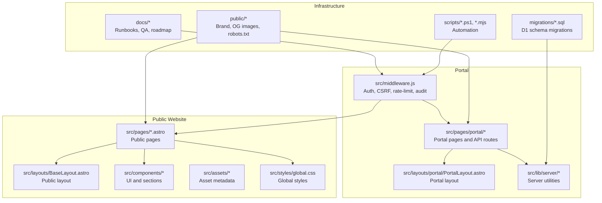
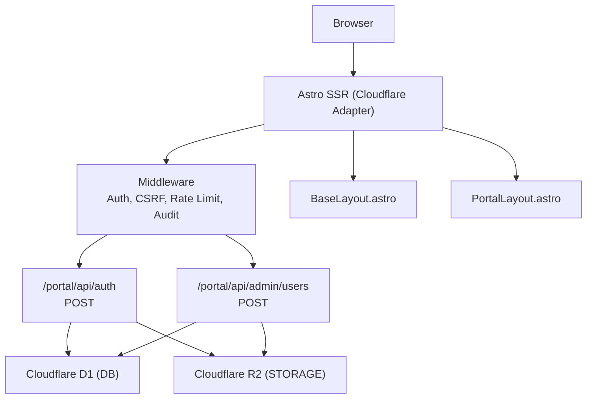
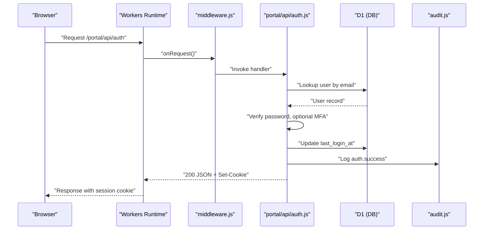
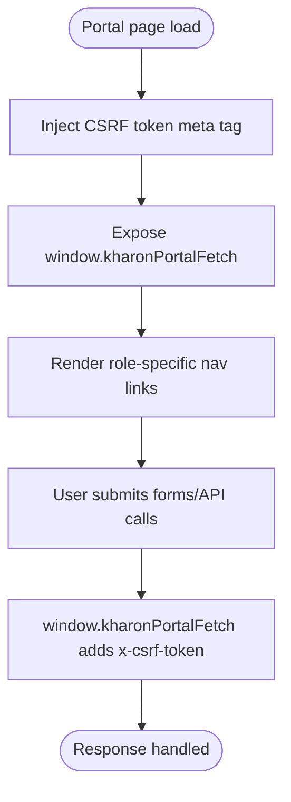
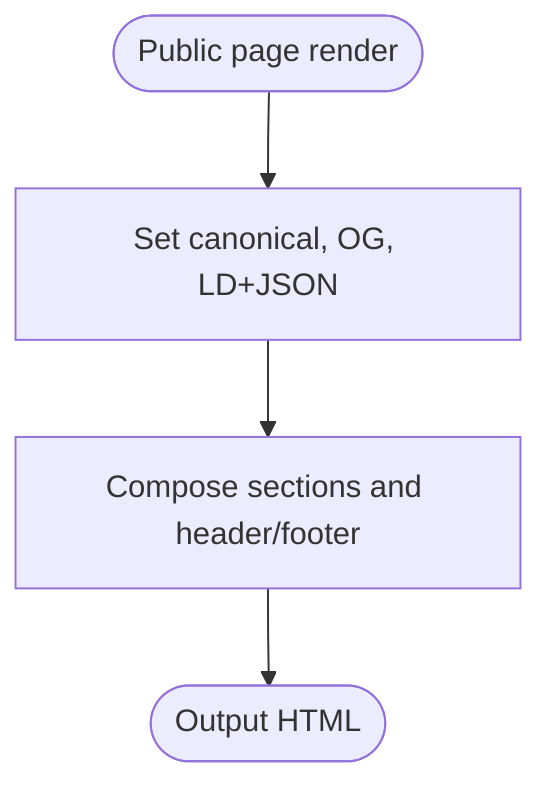
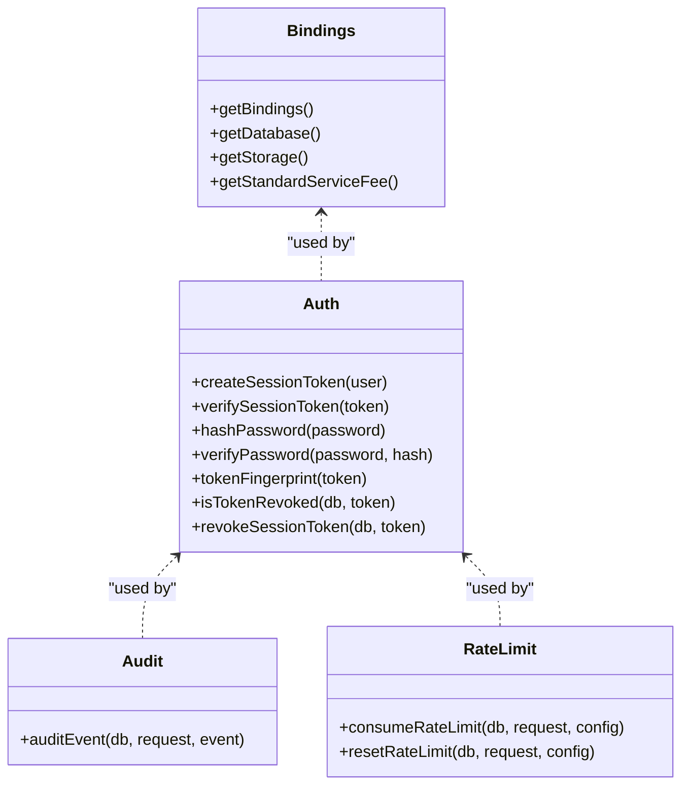
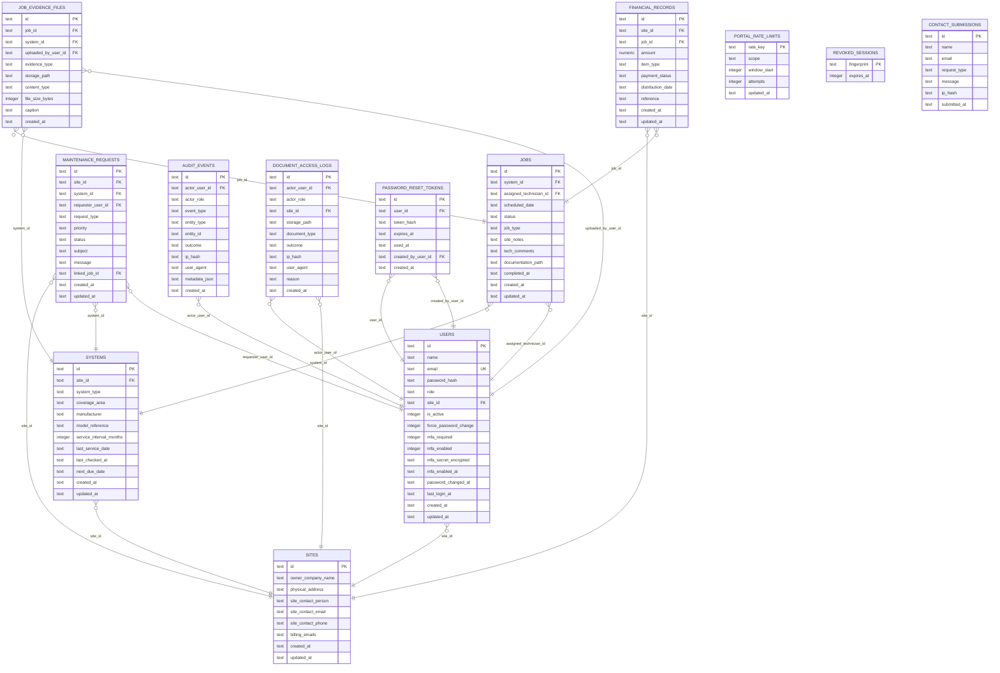
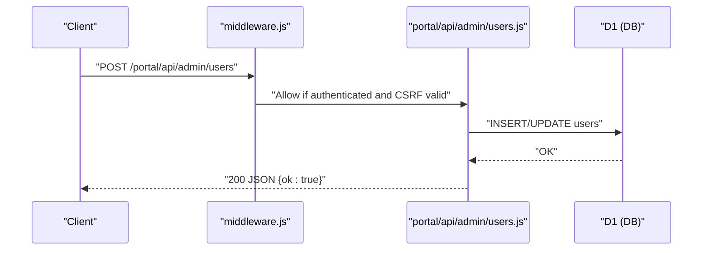
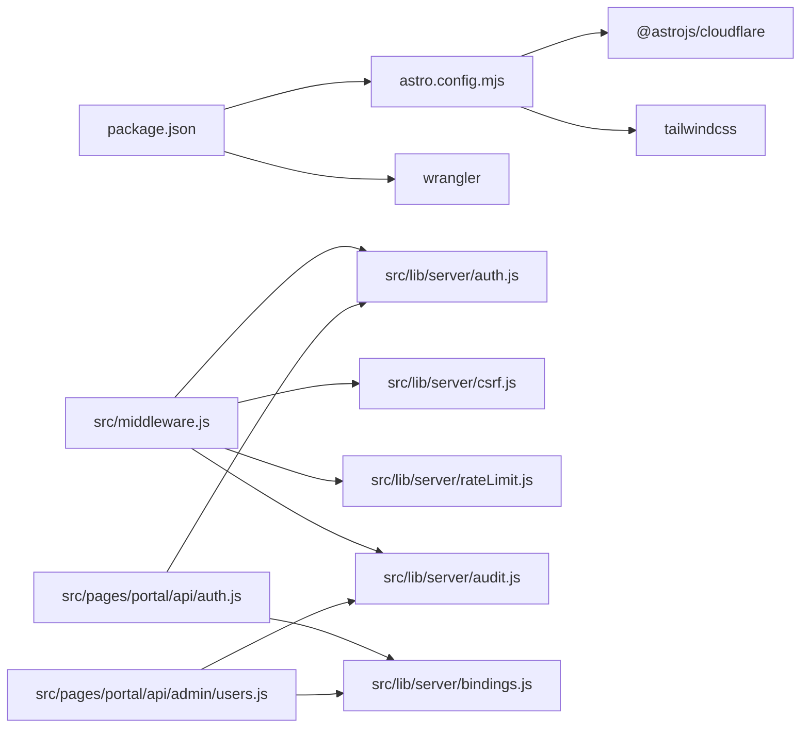

# Project Structure & Architecture

<cite>
**Referenced Files in This Document**
- [README.md](file://README.md)
- [package.json](file://package.json)
- [astro.config.mjs](file://astro.config.mjs)
- [src/middleware.js](file://src/middleware.js)
- [src/lib/server/bindings.js](file://src/lib/server/bindings.js)
- [src/lib/server/auth.js](file://src/lib/server/auth.js)
- [src/layouts/BaseLayout.astro](file://src/layouts/BaseLayout.astro)
- [src/layouts/portal/PortalLayout.astro](file://src/layouts/portal/PortalLayout.astro)
- [src/pages/index.astro](file://src/pages/index.astro)
- [src/pages/portal/api/auth.js](file://src/pages/portal/api/auth.js)
- [src/pages/portal/api/admin/users.js](file://src/pages/portal/api/admin/users.js)
- [schema.sql](file://schema.sql)
- [docs/roadmap/MASTER_ROADMAP.md](file://docs/roadmap/MASTER_ROADMAP.md)
- [migrations/0001_kharon_portal.sql](file://migrations/0001_kharon_portal.sql)
- [scripts/build-site.ps1](file://scripts/build-site.ps1)
</cite>

## Table of Contents
1. [Introduction](#introduction)
2. [Project Structure](#project-structure)
3. [Core Components](#core-components)
4. [Architecture Overview](#architecture-overview)
5. [Detailed Component Analysis](#detailed-component-analysis)
6. [Dependency Analysis](#dependency-analysis)
7. [Performance Considerations](#performance-considerations)
8. [Troubleshooting Guide](#troubleshooting-guide)
9. [Conclusion](#conclusion)
10. [Appendices](#appendices)

## Introduction
This document explains the project’s directory structure, architectural patterns, and design philosophy. The system is an Astro-based website with integrated Cloudflare SSR deployment and a secure portal for internal operations. It separates public-facing website assets from the portal’s protected functionality, organizes documentation and runbooks, and maintains a robust database migration and automation system.

## Project Structure
The repository is organized into distinct areas:
- src/: Astro pages, components, layouts, server-side libraries, and middleware
- public/: Static assets for branding and SEO
- docs/: Operational runbooks, QA checklists, and roadmaps
- migrations/: SQL migrations for the Cloudflare D1 database
- scripts/: Automation helpers for builds, monitoring, backups, and Cloudflare integration
- Root configuration files for Astro, dependencies, and deployment

**Diagram sources**
- [src/pages/index.astro:1-18](file://src/pages/index.astro#L1-L18)
- [src/layouts/BaseLayout.astro:1-117](file://src/layouts/BaseLayout.astro#L1-L117)
- [src/layouts/portal/PortalLayout.astro:1-108](file://src/layouts/portal/PortalLayout.astro#L1-L108)
- [src/middleware.js:1-214](file://src/middleware.js#L1-L214)
- [src/lib/server/bindings.js:1-42](file://src/lib/server/bindings.js#L1-L42)
- [public/robots.txt](file://public/robots.txt)
- [docs/roadmap/MASTER_ROADMAP.md:1-200](file://docs/roadmap/MASTER_ROADMAP.md#L1-L200)
- [migrations/0001_kharon_portal.sql:1-112](file://migrations/0001_kharon_portal.sql#L1-L112)
- [scripts/build-site.ps1:1-22](file://scripts/build-site.ps1#L1-L22)

**Section sources**
- [README.md:1-51](file://README.md#L1-L51)
- [package.json:1-46](file://package.json#L1-L46)
- [astro.config.mjs:1-21](file://astro.config.mjs#L1-L21)

## Core Components
- Astro SSR and Cloudflare Adapter: The site runs server-rendered pages with Cloudflare Workers/Pages, enabling fast, secure delivery.
- Middleware: Centralized authentication, CSRF protection, rate limiting, role-based access control, and audit logging for portal routes.
- Portal Layout: Role-aware navigation and CSRF token injection for authenticated state-changing API calls.
- Server Libraries: Authentication, database/storage bindings, audit, rate limiting, MFA, and HTTP helpers.
- Public Layout and Pages: SEO-focused base layout with structured data, canonical URLs, and OpenGraph metadata.
- Database Schema and Migrations: D1 schema with indexes, triggers, and migration files for incremental schema evolution.
- Automation Scripts: Build, Cloudflare auth/list/project/domain helpers, monitoring, backups, and QA.

**Section sources**
- [astro.config.mjs:1-21](file://astro.config.mjs#L1-L21)
- [src/middleware.js:1-214](file://src/middleware.js#L1-L214)
- [src/layouts/portal/PortalLayout.astro:1-108](file://src/layouts/portal/PortalLayout.astro#L1-L108)
- [src/lib/server/auth.js:1-217](file://src/lib/server/auth.js#L1-L217)
- [src/lib/server/bindings.js:1-42](file://src/lib/server/bindings.js#L1-L42)
- [src/layouts/BaseLayout.astro:1-117](file://src/layouts/BaseLayout.astro#L1-L117)
- [schema.sql:1-245](file://schema.sql#L1-L245)
- [migrations/0001_kharon_portal.sql:1-112](file://migrations/0001_kharon_portal.sql#L1-L112)
- [scripts/build-site.ps1:1-22](file://scripts/build-site.ps1#L1-L22)

## Architecture Overview
The system follows a layered, modular design:
- Presentation Layer: Astro pages and layouts render public and portal experiences.
- Application Layer: Middleware and API routes orchestrate authentication, authorization, and business logic.
- Data Layer: Cloudflare D1 stores relational data; Cloudflare R2 stores documents and evidence files.
- Infrastructure Layer: Wrangler manages deployments, secrets, and D1/R2 bindings.

**Diagram sources**
- [src/middleware.js:1-214](file://src/middleware.js#L1-L214)
- [src/pages/portal/api/auth.js:1-171](file://src/pages/portal/api/auth.js#L1-L171)
- [src/pages/portal/api/admin/users.js:1-179](file://src/pages/portal/api/admin/users.js#L1-L179)
- [src/lib/server/bindings.js:1-42](file://src/lib/server/bindings.js#L1-L42)
- [src/layouts/BaseLayout.astro:1-117](file://src/layouts/BaseLayout.astro#L1-L117)
- [src/layouts/portal/PortalLayout.astro:1-108](file://src/layouts/portal/PortalLayout.astro#L1-L108)

## Detailed Component Analysis

### Middleware and Portal Security
The middleware enforces:
- Path traversal prevention
- Session verification and revocation checks
- Role-based access control for portal subpaths
- CSRF token generation and validation
- Rate limiting for state-changing API endpoints
- Audit events for security-related actions

**Diagram sources**
- [src/middleware.js:110-184](file://src/middleware.js#L110-L184)
- [src/pages/portal/api/auth.js:36-161](file://src/pages/portal/api/auth.js#L36-L161)
- [src/lib/server/auth.js:75-108](file://src/lib/server/auth.js#L75-L108)

**Section sources**
- [src/middleware.js:1-214](file://src/middleware.js#L1-L214)
- [src/pages/portal/api/auth.js:1-171](file://src/pages/portal/api/auth.js#L1-L171)
- [src/lib/server/auth.js:1-217](file://src/lib/server/auth.js#L1-L217)

### Portal Layout and Navigation
The portal layout injects a CSRF token meta tag and a small fetch wrapper to ensure all authenticated portal API calls include the CSRF token. Navigation is role-driven, with dynamic links for each role.

**Diagram sources**
- [src/layouts/portal/PortalLayout.astro:48-55](file://src/layouts/portal/PortalLayout.astro#L48-L55)
- [src/layouts/portal/PortalLayout.astro:68-78](file://src/layouts/portal/PortalLayout.astro#L68-L78)

**Section sources**
- [src/layouts/portal/PortalLayout.astro:1-108](file://src/layouts/portal/PortalLayout.astro#L1-L108)

### Public Website Layout and SEO
The public base layout sets canonical URLs, OpenGraph metadata, structured data, and theme color. It composes reusable sections and renders the public header and footer.

**Diagram sources**
- [src/layouts/BaseLayout.astro:14-106](file://src/layouts/BaseLayout.astro#L14-L106)
- [src/pages/index.astro:11-17](file://src/pages/index.astro#L11-L17)

**Section sources**
- [src/layouts/BaseLayout.astro:1-117](file://src/layouts/BaseLayout.astro#L1-L117)
- [src/pages/index.astro:1-18](file://src/pages/index.astro#L1-L18)

### Server Libraries and Bindings
- Bindings: Centralized access to D1 and R2 via Cloudflare env bindings with runtime validation.
- Auth: JWT-like session tokens with HMAC signatures, PBKDF2 password hashing, MFA helpers, and session revocation.
- Audit: Event logging for security and administrative actions.
- Rate Limit: Sliding-window counters scoped per API endpoint and subject.
- HTTP Helpers: Standardized JSON responses and error codes.

**Diagram sources**
- [src/lib/server/bindings.js:1-42](file://src/lib/server/bindings.js#L1-L42)
- [src/lib/server/auth.js:1-217](file://src/lib/server/auth.js#L1-L217)

**Section sources**
- [src/lib/server/bindings.js:1-42](file://src/lib/server/bindings.js#L1-L42)
- [src/lib/server/auth.js:1-217](file://src/lib/server/auth.js#L1-L217)

### Database Schema and Migrations
The schema defines core entities (users, sites, systems, jobs, financial_records, maintenance_requests, audit_events, job_evidence_files, document_access_logs, portal_rate_limits, password_reset_tokens, revoked_sessions, contact_submissions) with constraints, indexes, and triggers. Migrations incrementally evolve the schema.

**Diagram sources**
- [schema.sql:1-245](file://schema.sql#L1-L245)
- [migrations/0001_kharon_portal.sql:1-112](file://migrations/0001_kharon_portal.sql#L1-L112)

**Section sources**
- [schema.sql:1-245](file://schema.sql#L1-L245)
- [migrations/0001_kharon_portal.sql:1-112](file://migrations/0001_kharon_portal.sql#L1-L112)

### API Endpoint Organization
- Modular API routes under src/pages/portal/api/ group functionality by domain (auth, finance, admin, file).
- Each route validates method, consumes rate limits, verifies CSRF for state-changing operations, and audits events.
- Admin endpoints enforce role checks and sanitize inputs.

**Diagram sources**
- [src/middleware.js:154-184](file://src/middleware.js#L154-L184)
- [src/pages/portal/api/admin/users.js:12-174](file://src/pages/portal/api/admin/users.js#L12-L174)

**Section sources**
- [src/pages/portal/api/admin/users.js:1-179](file://src/pages/portal/api/admin/users.js#L1-L179)
- [src/middleware.js:1-214](file://src/middleware.js#L1-L214)

### Documentation and Runbooks
- docs/roadmap/MASTER_ROADMAP.md outlines strategic positioning, current status, production gates, and operational alignment with Sage as the finance source of truth.
- docs/qa/PORTAL_ROLE_QA_CHECKLIST.md supports role-based testing and validation.

**Section sources**
- [docs/roadmap/MASTER_ROADMAP.md:1-200](file://docs/roadmap/MASTER_ROADMAP.md#L1-L200)

### Automation Scripts
- scripts/build-site.ps1 sets environment variables for site and portal URLs per target and runs the Astro build.
- Additional scripts handle Cloudflare authentication, project management, monitoring, backups, and role QA.

**Section sources**
- [scripts/build-site.ps1:1-22](file://scripts/build-site.ps1#L1-L22)
- [package.json:10-32](file://package.json#L10-L32)

## Dependency Analysis
- Astro and TailwindCSS: Frontend framework and styling pipeline.
- Cloudflare Adapter: SSR and edge runtime integration.
- Wrangler: Local development and deployment tooling.
- D1 and R2: Data and storage bindings accessed via src/lib/server/bindings.js.
- Middleware depends on server libraries for auth, CSRF, rate limiting, and audit.
- Portal API routes depend on middleware for security and on server libraries for data access.

**Diagram sources**
- [astro.config.mjs:1-21](file://astro.config.mjs#L1-L21)
- [package.json:33-41](file://package.json#L33-L41)
- [src/middleware.js:1-7](file://src/middleware.js#L1-L7)
- [src/pages/portal/api/auth.js:1-7](file://src/pages/portal/api/auth.js#L1-L7)
- [src/pages/portal/api/admin/users.js:1-7](file://src/pages/portal/api/admin/users.js#L1-L7)

**Section sources**
- [astro.config.mjs:1-21](file://astro.config.mjs#L1-L21)
- [package.json:1-46](file://package.json#L1-L46)
- [src/middleware.js:1-214](file://src/middleware.js#L1-L214)

## Performance Considerations
- Chunk size warnings are tuned in Vite build settings.
- Middleware applies security headers to reduce client-side risks and improve trust on CDN edges.
- Astro SSR reduces client JavaScript payload for public pages, keeping branding lightweight.
- Database indexes and triggers optimize common queries and enforce data integrity.

[No sources needed since this section provides general guidance]

## Troubleshooting Guide
- Build and deployment: Use scripts/build-site.ps1 to set environment variables and run Astro build. Authenticate with Cloudflare using npm scripts for login and project management.
- Portal authentication: Verify SESSION_SECRET is configured; ensure cookies are set with proper SameSite and Secure attributes.
- Database connectivity: Confirm D1 and R2 bindings are present in the Cloudflare environment; use getBindings() to surface configuration errors.
- Rate limiting and CSRF: If API calls fail with CSRF errors or 429 responses, inspect middleware logs and audit events for blocked attempts.

**Section sources**
- [scripts/build-site.ps1:1-22](file://scripts/build-site.ps1#L1-L22)
- [package.json:10-32](file://package.json#L10-L32)
- [src/lib/server/bindings.js:1-16](file://src/lib/server/bindings.js#L1-L16)
- [src/middleware.js:117-184](file://src/middleware.js#L117-L184)

## Conclusion
The project employs a clear separation between the public website and the secure portal, with robust middleware enforcing authentication, CSRF protection, and rate limiting. The modular API organization, centralized server libraries, and comprehensive documentation and runbooks support operational reliability. The D1 schema and migration system enable safe, incremental evolution of the data model, while automation scripts streamline builds and deployments on Cloudflare.

[No sources needed since this section summarizes without analyzing specific files]

## Appendices
- Deployment targets and domain configuration are documented in the repository’s README.
- The Astro configuration specifies server output and Cloudflare adapter settings.

**Section sources**
- [README.md:5-47](file://README.md#L5-L47)
- [astro.config.mjs:7-20](file://astro.config.mjs#L7-L20)