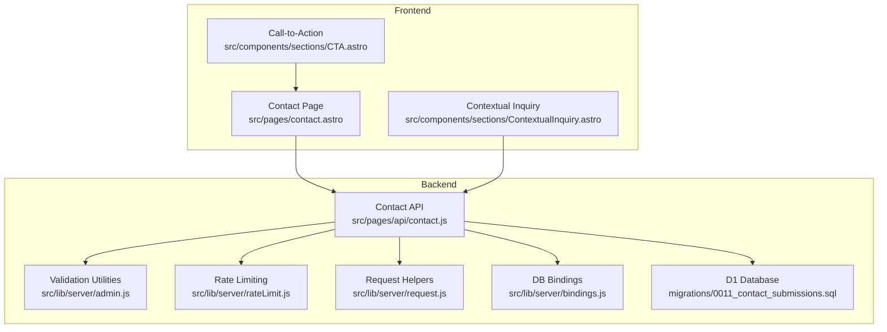
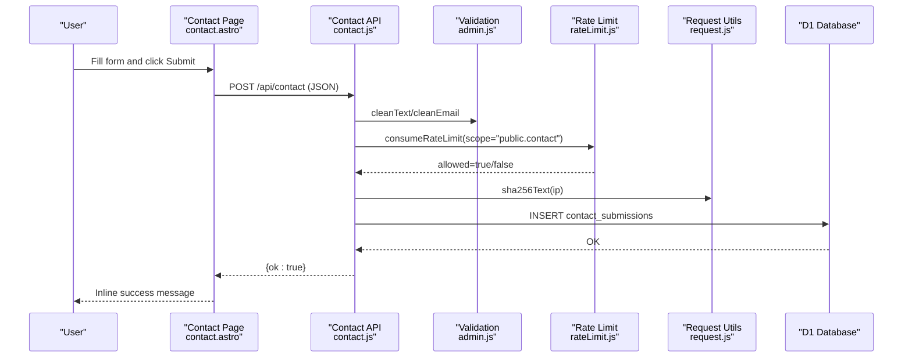
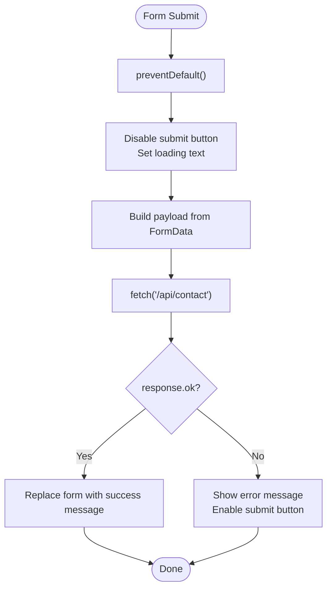
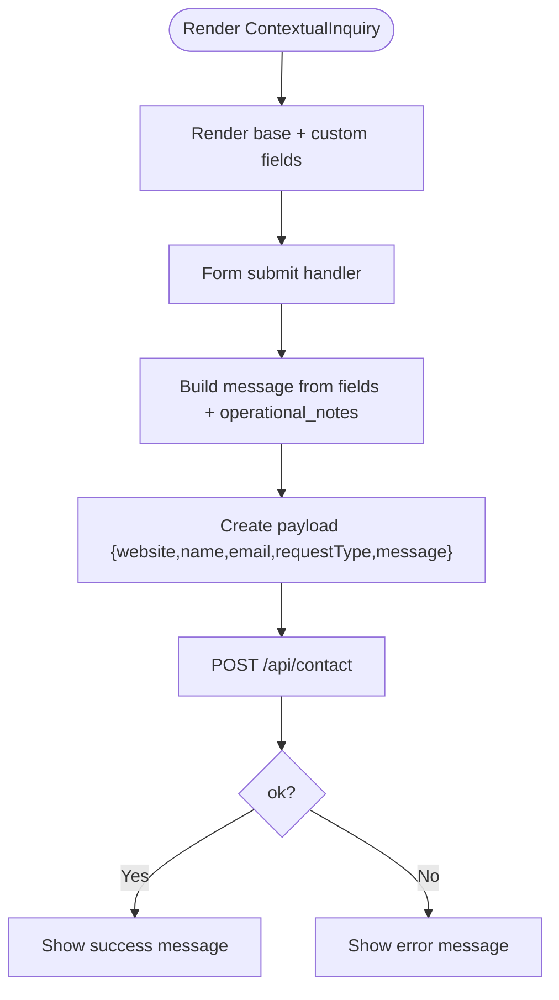
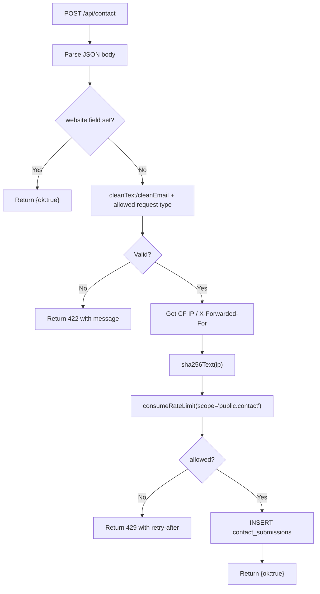
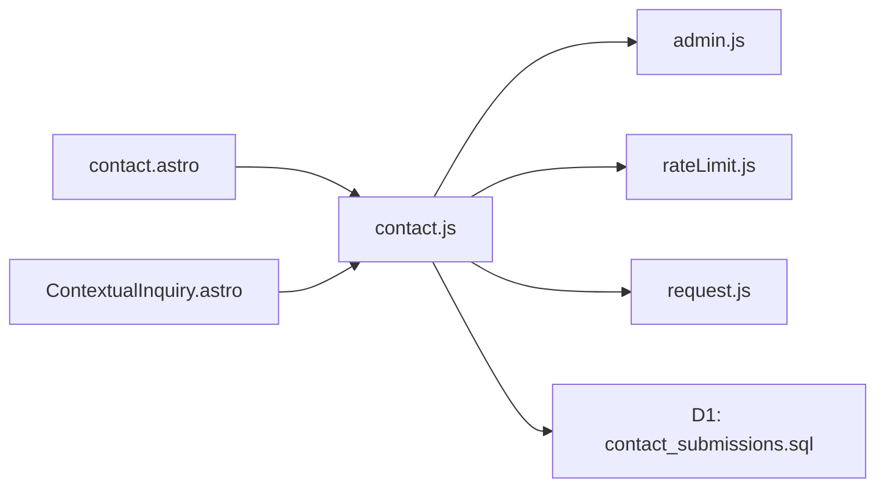
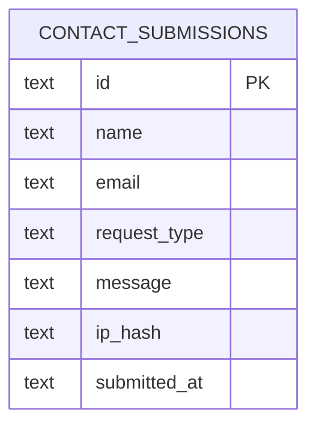

# Contact Form System

<cite>
**Referenced Files in This Document**
- [contact.astro](file://src/pages/contact.astro)
- [contact.js](file://src/pages/api/contact.js)
- [ContextualInquiry.astro](file://src/components/sections/ContextualInquiry.astro)
- [CTA.astro](file://src/components/sections/CTA.astro)
- [admin.js](file://src/lib/server/admin.js)
- [rateLimit.js](file://src/lib/server/rateLimit.js)
- [request.js](file://src/lib/server/request.js)
- [bindings.js](file://src/lib/server/bindings.js)
- [site.js](file://src/data/site.js)
- [0011_contact_submissions.sql](file://migrations/0011_contact_submissions.sql)
- [PORTAL_ROLE_QA_CHECKLIST.md](file://docs/qa/PORTAL_ROLE_QA_CHECKLIST.md)
- [wrangler.jsonc](file://wrangler.jsonc)
</cite>

## Table of Contents
1. [Introduction](#introduction)
2. [Project Structure](#project-structure)
3. [Core Components](#core-components)
4. [Architecture Overview](#architecture-overview)
5. [Detailed Component Analysis](#detailed-component-analysis)
6. [Dependency Analysis](#dependency-analysis)
7. [Performance Considerations](#performance-considerations)
8. [Troubleshooting Guide](#troubleshooting-guide)
9. [Conclusion](#conclusion)
10. [Appendices](#appendices)

## Introduction
This document describes the contact form system used across the website, including the main contact page, contextual inquiry forms, and the backend API that validates, rate-limits, and persists submissions. It explains the frontend implementation, validation patterns, error handling, spam protection, and outlines integration points for email notifications and CRM systems. Guidance is also provided for customization, accessibility compliance, and performance optimization.

## Project Structure
The contact form system spans three primary areas:
- Frontend page: renders the main contact form and handles client-side submission flow
- Contextual inquiry component: reusable form component for solution-specific workflows
- Backend API: validates input, enforces rate limits, persists submissions, and prepares for email/CMS integration

**Diagram sources**
- [contact.astro:84-145](file://src/pages/contact.astro#L84-L145)
- [contact.js:40-115](file://src/pages/api/contact.js#L40-L115)
- [ContextualInquiry.astro:33-69](file://src/components/sections/ContextualInquiry.astro#L33-L69)
- [admin.js:18-50](file://src/lib/server/admin.js#L18-L50)
- [rateLimit.js:3-46](file://src/lib/server/rateLimit.js#L3-L46)
- [request.js:21-35](file://src/lib/server/request.js#L21-L35)
- [bindings.js:18-26](file://src/lib/server/bindings.js#L18-L26)
- [0011_contact_submissions.sql:1-11](file://migrations/0011_contact_submissions.sql#L1-L11)

**Section sources**
- [contact.astro:1-195](file://src/pages/contact.astro#L1-L195)
- [contact.js:1-116](file://src/pages/api/contact.js#L1-L116)
- [ContextualInquiry.astro:1-133](file://src/components/sections/ContextualInquiry.astro#L1-L133)
- [CTA.astro:1-23](file://src/components/sections/CTA.astro#L1-L23)
- [admin.js:1-83](file://src/lib/server/admin.js#L1-L83)
- [rateLimit.js:1-56](file://src/lib/server/rateLimit.js#L1-L56)
- [request.js:1-36](file://src/lib/server/request.js#L1-L36)
- [bindings.js:1-42](file://src/lib/server/bindings.js#L1-L42)
- [0011_contact_submissions.sql:1-11](file://migrations/0011_contact_submissions.sql#L1-L11)

## Core Components
- Main Contact Page: Presents a form with name, email, request type, and message fields; includes a hidden honeypot field; handles client-side submission via fetch to the API endpoint; displays inline success/error messages.
- Contextual Inquiry Component: Reusable form component for solution-specific workflows. It builds a structured message from contextual fields and operational notes and posts to the same API endpoint.
- Contact API: Validates inputs, checks allowed request types, rate-limits submissions, hashes the client IP, persists to D1, and returns standardized JSON responses.
- Validation Utilities: Provides cleanText, cleanEmail, and other sanitization helpers used by the API.
- Rate Limiting: Consumes a sliding-window rate limiter scoped to public contact submissions.
- Request Helpers: Extracts client IP, user agent, and computes SHA-256 digests for fingerprinting.
- Database Bindings: Exposes Cloudflare D1 database connection and throws if not configured.
- Database Schema: Defines the contact_submissions table with constraints and indexes.

**Section sources**
- [contact.astro:84-145](file://src/pages/contact.astro#L84-L145)
- [ContextualInquiry.astro:33-69](file://src/components/sections/ContextualInquiry.astro#L33-L69)
- [contact.js:40-115](file://src/pages/api/contact.js#L40-L115)
- [admin.js:18-50](file://src/lib/server/admin.js#L18-L50)
- [rateLimit.js:3-46](file://src/lib/server/rateLimit.js#L3-L46)
- [request.js:9-35](file://src/lib/server/request.js#L9-L35)
- [bindings.js:18-26](file://src/lib/server/bindings.js#L18-L26)
- [0011_contact_submissions.sql:1-11](file://migrations/0011_contact_submissions.sql#L1-L11)

## Architecture Overview
The contact form system follows a unidirectional data flow:
- Frontend collects user input and sends a JSON payload to the API endpoint
- API validates inputs, enforces rate limits, and writes to D1
- On success, the API returns a success response; on failure, it returns an error with a message and appropriate HTTP status

**Diagram sources**
- [contact.astro:151-188](file://src/pages/contact.astro#L151-L188)
- [contact.js:40-115](file://src/pages/api/contact.js#L40-L115)
- [admin.js:18-50](file://src/lib/server/admin.js#L18-L50)
- [rateLimit.js:3-46](file://src/lib/server/rateLimit.js#L3-L46)
- [request.js:21-24](file://src/lib/server/request.js#L21-L24)
- [0011_contact_submissions.sql:1-11](file://migrations/0011_contact_submissions.sql#L1-L11)

## Detailed Component Analysis

### Main Contact Page (contact.astro)
- Purpose: Present a contact form with name, email, request type, and message; include a hidden honeypot field; handle client-side submission via fetch; show inline feedback.
- Key behaviors:
  - Hidden website field acts as a honeypot to deter bots
  - Client-side prevents default form submission and disables the submit button during submission
  - Builds a payload from FormData and posts to /api/contact
  - Updates the DOM with success or error messages based on the API response
- Accessibility:
  - Uses a screen-reader-only label for the hidden field
  - Labels wrap inputs for proper association
  - Required attributes on inputs enable native browser validation

**Diagram sources**
- [contact.astro:151-188](file://src/pages/contact.astro#L151-L188)

**Section sources**
- [contact.astro:84-145](file://src/pages/contact.astro#L84-L145)
- [contact.astro:146-189](file://src/pages/contact.astro#L146-L189)

### Contextual Inquiry Component (ContextualInquiry.astro)
- Purpose: Provide a reusable form for solution-specific workflows. Accepts props for eyebrow, title, text, and request type; supports dynamic fields; constructs a structured message from form entries.
- Key behaviors:
  - Generates a unique form ID from the request type
  - Includes a hidden website field (honeypot)
  - Collects base fields (name, email, optional company/site) plus custom fields
  - Builds a multi-line message combining contextual fields and operational notes
  - Submits to the same API endpoint with the same payload structure

**Diagram sources**
- [ContextualInquiry.astro:33-69](file://src/components/sections/ContextualInquiry.astro#L33-L69)
- [ContextualInquiry.astro:73-131](file://src/components/sections/ContextualInquiry.astro#L73-L131)

**Section sources**
- [ContextualInquiry.astro:1-133](file://src/components/sections/ContextualInquiry.astro#L1-L133)

### Contact API Endpoint (contact.js)
- Purpose: Validate incoming data, enforce rate limits, persist submissions, and return standardized JSON responses.
- Validation:
  - Uses cleanText and cleanEmail helpers to sanitize and validate inputs
  - Enforces allowed request types via a predefined set
- Rate limiting:
  - Uses consumeRateLimit with scope "public.contact"
  - Limits to 5 attempts per 15 minutes per hashed IP
- Persistence:
  - Inserts a row into contact_submissions with a generated ID and hashed IP
- Spam protection:
  - Returns success immediately for filled honeypot fields
  - Hashes client IP for rate-limiting and persistence
- Error handling:
  - Returns appropriate HTTP statuses (400, 422, 429, 500) with JSON bodies

**Diagram sources**
- [contact.js:40-115](file://src/pages/api/contact.js#L40-L115)
- [admin.js:18-50](file://src/lib/server/admin.js#L18-L50)
- [rateLimit.js:3-46](file://src/lib/server/rateLimit.js#L3-L46)
- [request.js:21-24](file://src/lib/server/request.js#L21-L24)

**Section sources**
- [contact.js:1-116](file://src/pages/api/contact.js#L1-L116)

### Validation Utilities (admin.js)
- Provides cleanText, cleanEmail, and other sanitization helpers used by the API to validate and normalize inputs.
- Enforces length constraints, required flags, and format checks.

**Section sources**
- [admin.js:18-50](file://src/lib/server/admin.js#L18-L50)

### Rate Limiting (rateLimit.js)
- Implements a sliding-window rate limiter keyed by a composite fingerprint (scope + IP hash + optional subject hash).
- Returns allowed status, attempts count, max attempts, and retry-after seconds.

**Section sources**
- [rateLimit.js:3-46](file://src/lib/server/rateLimit.js#L3-L46)

### Request Helpers (request.js)
- Extracts client IP from Cloudflare headers or forwarded-for
- Computes SHA-256 digests and base64-url encodes them for hashing
- Provides a request fingerprint utility combining IP, hashed IP, and user agent

**Section sources**
- [request.js:9-35](file://src/lib/server/request.js#L9-L35)

### Database Bindings (bindings.js)
- Exposes getDatabase to obtain the Cloudflare D1 binding
- Throws if the DB binding is not configured

**Section sources**
- [bindings.js:18-26](file://src/lib/server/bindings.js#L18-L26)

### Database Schema (contact_submissions)
- Defines the contact_submissions table with constraints for length and format
- Includes an index on submitted_at for efficient queries

**Section sources**
- [0011_contact_submissions.sql:1-11](file://migrations/0011_contact_submissions.sql#L1-L11)

### Call-to-Action (CTA) Component
- Provides a prominent CTA encouraging site assessments
- Links to the contact page with a prefilled intent parameter for request type

**Section sources**
- [CTA.astro:1-23](file://src/components/sections/CTA.astro#L1-L23)
- [site.js](file://src/data/site.js#L119)

### ContextualInquiry Section for Lead Generation
- Designed for lead generation and customer consultation workflows
- Supports dynamic fields and structured messaging for downstream triage
- Integrates seamlessly with the same API and validation pipeline

**Section sources**
- [ContextualInquiry.astro:1-133](file://src/components/sections/ContextualInquiry.astro#L1-L133)

## Dependency Analysis
The contact form system exhibits low coupling and clear separation of concerns:
- Frontend components depend on the API endpoint and share identical payload expectations
- The API depends on validation utilities, rate limiting, request helpers, and database bindings
- Database schema defines the persistence contract

**Diagram sources**
- [contact.astro:84-145](file://src/pages/contact.astro#L84-L145)
- [ContextualInquiry.astro:33-69](file://src/components/sections/ContextualInquiry.astro#L33-L69)
- [contact.js:1-115](file://src/pages/api/contact.js#L1-L115)
- [admin.js:1-83](file://src/lib/server/admin.js#L1-L83)
- [rateLimit.js:1-56](file://src/lib/server/rateLimit.js#L1-L56)
- [request.js:1-36](file://src/lib/server/request.js#L1-L36)
- [0011_contact_submissions.sql:1-11](file://migrations/0011_contact_submissions.sql#L1-L11)

**Section sources**
- [contact.astro:84-145](file://src/pages/contact.astro#L84-L145)
- [ContextualInquiry.astro:33-69](file://src/components/sections/ContextualInquiry.astro#L33-L69)
- [contact.js:1-115](file://src/pages/api/contact.js#L1-L115)

## Performance Considerations
- Client-side submission avoids full-page reloads, reducing latency and improving UX
- Rate limiting prevents abuse and reduces unnecessary database writes
- D1 indexing on submitted_at supports efficient retrieval for analytics or admin views
- SHA-256 hashing of IPs ensures privacy while enabling effective rate limiting
- Consider caching frequently accessed request type lists on the client to reduce DOM rendering overhead

[No sources needed since this section provides general guidance]

## Troubleshooting Guide
Common issues and resolutions:
- Submission fails with validation errors: Verify required fields meet length/format constraints enforced by the API
- Too many submissions error: The rate limiter restricts submissions to 5 per 15 minutes per IP; wait for the retry-after period
- Service temporarily unavailable: The API returns 503 when the database binding is not configured; check deployment bindings
- No email notification: The current API only persists to D1; integrate email or CRM hooks in the API or a worker
- Database not created: Ensure migrations are applied and the D1 binding is configured in Wrangler

**Section sources**
- [contact.js:40-115](file://src/pages/api/contact.js#L40-L115)
- [bindings.js:18-26](file://src/lib/server/bindings.js#L18-L26)
- [PORTAL_ROLE_QA_CHECKLIST.md:128-136](file://docs/qa/PORTAL_ROLE_QA_CHECKLIST.md#L128-L136)

## Conclusion
The contact form system provides a robust, validated, and rate-limited pathway for collecting user inquiries. Its modular design enables reuse across pages and components, while the shared API simplifies maintenance. Future enhancements can include email notifications and CRM integrations, with the current architecture supporting straightforward extensions.

[No sources needed since this section summarizes without analyzing specific files]

## Appendices

### API Definition
- Endpoint: POST /api/contact
- Content-Type: application/json
- Request fields:
  - website (string, optional, hidden honeypot)
  - name (string, required, 2–80 chars)
  - email (string, required, valid email)
  - requestType (string, required, must be in allowed set)
  - message (string, required, 10–3000 chars)
- Response:
  - Success: { ok: true }
  - Validation error: { ok: false, message: string } (422)
  - Rate-limited: { ok: false, message: string } (429 with Retry-After header)
  - Invalid request: { ok: false, message: string } (400)
  - Service unavailable: { ok: false, message: string } (503)

**Section sources**
- [contact.js:40-115](file://src/pages/api/contact.js#L40-L115)
- [admin.js:18-50](file://src/lib/server/admin.js#L18-L50)
- [rateLimit.js:3-46](file://src/lib/server/rateLimit.js#L3-L46)

### Database Model

**Diagram sources**
- [0011_contact_submissions.sql:1-11](file://migrations/0011_contact_submissions.sql#L1-L11)

### QA Checklist References
- Contact form submits to /api/contact via POST
- Inline success message on successful submission
- Honeypot field acceptance without storing a record
- Validation errors for missing required fields
- Rate limit enforcement (429 after 5 attempts in 15 minutes)
- Submissions appear in contact_submissions table

**Section sources**
- [PORTAL_ROLE_QA_CHECKLIST.md:128-136](file://docs/qa/PORTAL_ROLE_QA_CHECKLIST.md#L128-L136)

### Environment and Bindings
- D1 database binding named DB
- R2 bucket binding named STORAGE
- Standard service fee variable configured

**Section sources**
- [wrangler.jsonc:19-36](file://wrangler.jsonc#L19-L36)