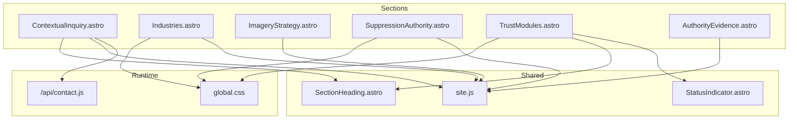
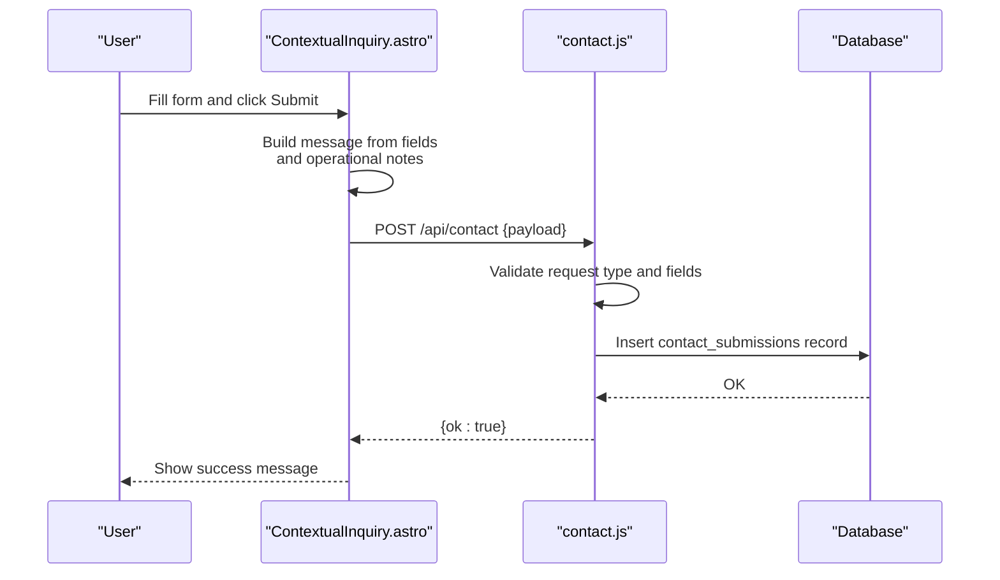
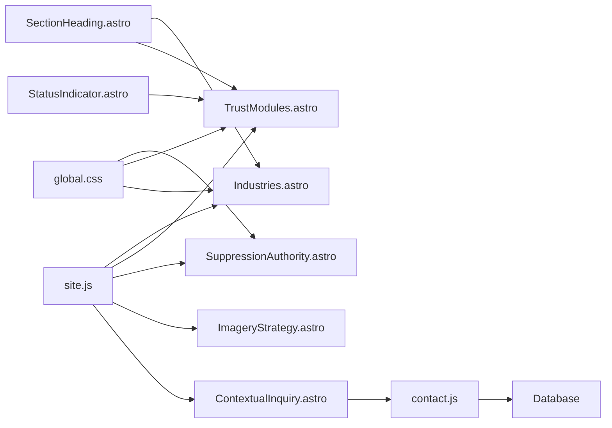

# Content Presentation Sections

<cite>
**Referenced Files in This Document**
- [ContextualInquiry.astro](file://src/components/sections/ContextualInquiry.astro)
- [Industries.astro](file://src/components/sections/Industries.astro)
- [ImageryStrategy.astro](file://src/components/sections/ImageryStrategy.astro)
- [SuppressionAuthority.astro](file://src/components/sections/SuppressionAuthority.astro)
- [TrustModules.astro](file://src/components/sections/TrustModules.astro)
- [AuthorityEvidence.astro](file://src/components/sections/AuthorityEvidence.astro)
- [SectionHeading.astro](file://src/components/sections/SectionHeading.astro)
- [StatusIndicator.astro](file://src/components/ui/StatusIndicator.astro)
- [site.js](file://src/data/site.js)
- [contact.js](file://src/pages/api/contact.js)
- [global.css](file://src/styles/global.css)
</cite>

## Table of Contents
1. [Introduction](#introduction)
2. [Project Structure](#project-structure)
3. [Core Components](#core-components)
4. [Architecture Overview](#architecture-overview)
5. [Detailed Component Analysis](#detailed-component-analysis)
6. [Dependency Analysis](#dependency-analysis)
7. [Performance Considerations](#performance-considerations)
8. [Troubleshooting Guide](#troubleshooting-guide)
9. [Conclusion](#conclusion)
10. [Appendices](#appendices)

## Introduction
This document explains the content presentation components that communicate company capabilities and industry expertise. It focuses on five key sections:
- ContextualInquiry: customer engagement and consultation intake
- Industries: sector-specific service offerings and market focus
- ImageryStrategy: visual content presentation and brand storytelling
- SuppressionAuthority: technical expertise demonstration and regulatory compliance
- TrustModules: credibility building and customer confidence features

These components share a consistent design language, typography, and color palette, and integrate with shared data and UI primitives to deliver cohesive, professional messaging across the website.

## Project Structure
The content presentation components are organized under the sections directory and leverage shared data and UI components:
- Components: src/components/sections/*
- Shared UI: src/components/ui/*
- Data: src/data/site.js
- Styles: src/styles/global.css
- API: src/pages/api/contact.js

**Diagram sources**
- [ContextualInquiry.astro:1-133](file://src/components/sections/ContextualInquiry.astro#L1-L133)
- [Industries.astro:1-26](file://src/components/sections/Industries.astro#L1-L26)
- [ImageryStrategy.astro:1-43](file://src/components/sections/ImageryStrategy.astro#L1-L43)
- [SuppressionAuthority.astro:1-65](file://src/components/sections/SuppressionAuthority.astro#L1-L65)
- [TrustModules.astro:1-27](file://src/components/sections/TrustModules.astro#L1-L27)
- [AuthorityEvidence.astro:1-58](file://src/components/sections/AuthorityEvidence.astro#L1-L58)
- [SectionHeading.astro:1-22](file://src/components/sections/SectionHeading.astro#L1-L22)
- [StatusIndicator.astro:1-15](file://src/components/ui/StatusIndicator.astro#L1-L15)
- [site.js:1-303](file://src/data/site.js#L1-L303)
- [contact.js:1-116](file://src/pages/api/contact.js#L1-L116)
- [global.css:1-483](file://src/styles/global.css#L1-L483)

**Section sources**
- [ContextualInquiry.astro:1-133](file://src/components/sections/ContextualInquiry.astro#L1-L133)
- [Industries.astro:1-26](file://src/components/sections/Industries.astro#L1-L26)
- [ImageryStrategy.astro:1-43](file://src/components/sections/ImageryStrategy.astro#L1-L43)
- [SuppressionAuthority.astro:1-65](file://src/components/sections/SuppressionAuthority.astro#L1-L65)
- [TrustModules.astro:1-27](file://src/components/sections/TrustModules.astro#L1-L27)
- [AuthorityEvidence.astro:1-58](file://src/components/sections/AuthorityEvidence.astro#L1-L58)
- [SectionHeading.astro:1-22](file://src/components/sections/SectionHeading.astro#L1-L22)
- [StatusIndicator.astro:1-15](file://src/components/ui/StatusIndicator.astro#L1-L15)
- [site.js:1-303](file://src/data/site.js#L1-L303)
- [contact.js:1-116](file://src/pages/api/contact.js#L1-L116)
- [global.css:1-483](file://src/styles/global.css#L1-L483)

## Core Components
- ContextualInquiry: A responsive, accessible form for customer requests with dynamic field composition, client-side validation, and server submission via a dedicated API endpoint.
- Industries: A data-driven grid showcasing sector-specific risks and priorities to highlight market focus.
- ImageryStrategy: A content section that communicates approved visual assets and brand storytelling guidelines for industrial environments.
- SuppressionAuthority: A visually rich section emphasizing technical authority and capability in critical environments.
- TrustModules: A module grid presenting compliance and maintenance as operating evidence, using a shared status indicator component.

**Section sources**
- [ContextualInquiry.astro:1-133](file://src/components/sections/ContextualInquiry.astro#L1-L133)
- [Industries.astro:1-26](file://src/components/sections/Industries.astro#L1-L26)
- [ImageryStrategy.astro:1-43](file://src/components/sections/ImageryStrategy.astro#L1-L43)
- [SuppressionAuthority.astro:1-65](file://src/components/sections/SuppressionAuthority.astro#L1-L65)
- [TrustModules.astro:1-27](file://src/components/sections/TrustModules.astro#L1-L27)

## Architecture Overview
The components follow a consistent pattern:
- Props-driven rendering with sensible defaults
- Shared design tokens and typography via CSS custom properties
- Data sourcing from a central site configuration module
- UI primitives for headings and status indicators
- Client-side form handling with server-side validation and persistence

**Diagram sources**
- [ContextualInquiry.astro:72-132](file://src/components/sections/ContextualInquiry.astro#L72-L132)
- [contact.js:40-115](file://src/pages/api/contact.js#L40-L115)

## Detailed Component Analysis

### ContextualInquiry Component
Purpose:
- Capture customer requests with operational context for routing and response.
- Provide a clear request type, field customization, and immediate feedback.

Key behaviors:
- Accepts props for eyebrow, title, text, requestType, and additional fields.
- Composes a base set of identity and contact fields plus any extra fields passed in.
- Builds a structured message combining contextual fields and operational notes.
- Submits to a dedicated API endpoint with client-side loading and error handling.

Implementation highlights:
- Dynamic field rendering with select or text inputs.
- Hidden anti-spam field and hidden request_type field.
- Accessible labels and screen-reader-friendly live region for messages.
- Client-side message assembly and JSON payload construction.
- Fetch-based submission with try/catch error handling and user feedback.

Content management patterns:
- Use props to customize eyebrow, title, and requestType per page.
- Extend fields array to capture domain-specific context (e.g., equipment type, site location).
- Keep operational_notes required to ensure sufficient context for routing.

User interaction design:
- Clear visual hierarchy with request type badge.
- Disabled button during submission with “Sending…” state.
- Immediate success message replacing the form; error messages announced via aria-live.

**Section sources**
- [ContextualInquiry.astro:1-133](file://src/components/sections/ContextualInquiry.astro#L1-L133)
- [contact.js:1-116](file://src/pages/api/contact.js#L1-L116)

### Industries Component
Purpose:
- Showcase the company’s focus on high-risk environments and sector-specific risks.
- Present a grid of industries with priority labels and concise risk statements.

Key behaviors:
- Imports industry data from site.js.
- Renders a centered SectionHeading header.
- Iterates over industries to display priority, title, and risk.

Content management patterns:
- Add or modify entries in the industries array to reflect evolving market focus.
- Use priority labels to signal emphasis (e.g., Continuity, Signal integrity).
- Keep risk statements concise and outcome-oriented.

User interaction design:
- Responsive grid layout adapts from 2–3 columns based on viewport.
- Consistent card styling with borders and background for readability.

**Section sources**
- [Industries.astro:1-26](file://src/components/sections/Industries.astro#L1-L26)
- [site.js:130-171](file://src/data/site.js#L130-L171)

### ImageryStrategy Component
Purpose:
- Communicate approved visual content guidelines for brand storytelling.
- Emphasize authenticity and relevance of imagery to industrial environments.

Key behaviors:
- Declares a required list of asset categories for approved imagery.
- Renders a two-column layout with headline and description on the left and a grid of required items on the right.

Content management patterns:
- Maintain the required list as a single source of truth for approved imagery categories.
- Update the list to reflect evolving brand and marketing needs while preserving clarity.

User interaction design:
- Minimal interactivity; focus on clear typography and spacing.
- Grid layout ensures easy scanning of required categories.

**Section sources**
- [ImageryStrategy.astro:1-43](file://src/components/sections/ImageryStrategy.astro#L1-L43)
- [site.js:1-303](file://src/data/site.js#L1-L303)

### SuppressionAuthority Component
Purpose:
- Demonstrate technical authority and capability in critical environments.
- Present environments served and capability statements with a visual accent layer.

Key behaviors:
- Defines environments and capabilities arrays.
- Uses a dark theme with cyan accents for emphasis.
- Renders a two-column layout with environment badges and capability cards.
- Includes a decorative, grid-based visual element to reinforce technical themes.

Content management patterns:
- Update environments and capabilities arrays to reflect current service offerings.
- Keep capability statements focused on outcomes and lifecycle support.

User interaction design:
- Dark theme with high contrast for readability.
- Badge-style chips for environments; numbered capability cards for emphasis.

**Section sources**
- [SuppressionAuthority.astro:1-65](file://src/components/sections/SuppressionAuthority.astro#L1-L65)
- [site.js:1-303](file://src/data/site.js#L1-L303)
- [global.css:1-483](file://src/styles/global.css#L1-L483)

### TrustModules Component
Purpose:
- Build credibility by communicating compliance and maintenance as operating evidence.
- Present trust signals through a grid of modules with status indicators.

Key behaviors:
- Accepts an items prop for module data.
- Uses SectionHeading for consistent header styling.
- Renders StatusIndicator components with configurable tones (cyan, amber, purple).
- Applies hover effects to cards for interactivity.

Content management patterns:
- Populate items with data from site.js trustModules array or page-specific data.
- Use tone to visually distinguish categories (e.g., Records, Cadence, Response, Outputs).

User interaction design:
- Cards with subtle hover state to indicate interactivity.
- Status indicators provide quick visual cues aligned with brand colors.

**Section sources**
- [TrustModules.astro:1-27](file://src/components/sections/TrustModules.astro#L1-L27)
- [SectionHeading.astro:1-22](file://src/components/sections/SectionHeading.astro#L1-L22)
- [StatusIndicator.astro:1-15](file://src/components/ui/StatusIndicator.astro#L1-L15)
- [site.js:191-216](file://src/data/site.js#L191-L216)

### Supporting Components and Data

#### SectionHeading
- Provides reusable heading blocks with eyebrow, title, and optional text.
- Supports dark mode styling and center alignment.

**Section sources**
- [SectionHeading.astro:1-22](file://src/components/sections/SectionHeading.astro#L1-L22)

#### StatusIndicator
- Renders a small status chip with a colored dot and label.
- Supports configurable tones mapped to brand colors.

**Section sources**
- [StatusIndicator.astro:1-15](file://src/components/ui/StatusIndicator.astro#L1-L15)

#### site.js Data
- Centralized configuration for site metadata, industries, trust modules, and capability proofs.
- Supplies data to multiple sections for consistent messaging.

**Section sources**
- [site.js:1-303](file://src/data/site.js#L1-L303)

#### AuthorityEvidence
- Demonstrates technical proof through competency, standards, and ecosystem familiarity.
- Complements TrustModules by reinforcing authority signals.

**Section sources**
- [AuthorityEvidence.astro:1-58](file://src/components/sections/AuthorityEvidence.astro#L1-L58)
- [site.js:245-291](file://src/data/site.js#L245-L291)

#### Global Styles
- Defines design tokens and typography classes used across sections.
- Ensures consistent spacing, colors, and responsive behavior.

**Section sources**
- [global.css:1-483](file://src/styles/global.css#L1-L483)

## Dependency Analysis
The components depend on shared resources and follow a layered architecture:
- Data layer: site.js supplies content and configuration.
- UI primitives: SectionHeading and StatusIndicator provide reusable elements.
- Runtime layer: contact.js handles form validation and persistence.
- Styling layer: global.css defines design tokens and responsive classes.

**Diagram sources**
- [site.js:1-303](file://src/data/site.js#L1-L303)
- [Industries.astro:1-26](file://src/components/sections/Industries.astro#L1-L26)
- [TrustModules.astro:1-27](file://src/components/sections/TrustModules.astro#L1-L27)
- [SuppressionAuthority.astro:1-65](file://src/components/sections/SuppressionAuthority.astro#L1-L65)
- [ImageryStrategy.astro:1-43](file://src/components/sections/ImageryStrategy.astro#L1-L43)
- [ContextualInquiry.astro:1-133](file://src/components/sections/ContextualInquiry.astro#L1-L133)
- [SectionHeading.astro:1-22](file://src/components/sections/SectionHeading.astro#L1-L22)
- [StatusIndicator.astro:1-15](file://src/components/ui/StatusIndicator.astro#L1-L15)
- [contact.js:1-116](file://src/pages/api/contact.js#L1-L116)
- [global.css:1-483](file://src/styles/global.css#L1-L483)

**Section sources**
- [site.js:1-303](file://src/data/site.js#L1-L303)
- [ContextualInquiry.astro:1-133](file://src/components/sections/ContextualInquiry.astro#L1-L133)
- [Industries.astro:1-26](file://src/components/sections/Industries.astro#L1-L26)
- [ImageryStrategy.astro:1-43](file://src/components/sections/ImageryStrategy.astro#L1-L43)
- [SuppressionAuthority.astro:1-65](file://src/components/sections/SuppressionAuthority.astro#L1-L65)
- [TrustModules.astro:1-27](file://src/components/sections/TrustModules.astro#L1-L27)
- [SectionHeading.astro:1-22](file://src/components/sections/SectionHeading.astro#L1-L22)
- [StatusIndicator.astro:1-15](file://src/components/ui/StatusIndicator.astro#L1-L15)
- [contact.js:1-116](file://src/pages/api/contact.js#L1-L116)
- [global.css:1-483](file://src/styles/global.css#L1-L483)

## Performance Considerations
- Minimize DOM updates: The ContextualInquiry form disables the submit button and replaces the form content upon success to reduce reflows.
- Efficient data fetching: The contact API endpoint performs validation and rate limiting server-side, reducing client-side error handling overhead.
- CSS performance: Global styles define efficient transitions and responsive breakpoints to avoid layout thrashing.
- Image and visual assets: The SuppressionAuthority section uses CSS-generated backgrounds and minimal images to keep render costs low.

[No sources needed since this section provides general guidance]

## Troubleshooting Guide
Common issues and resolutions:
- Form submission fails silently:
  - Verify the presence of the hidden anti-spam field and hidden request_type field.
  - Check the API endpoint availability and network connectivity.
  - Confirm that the request type is included in the allowed list.

- Validation errors:
  - Ensure required fields meet length constraints and formats.
  - Confirm that the request type matches one of the allowed values.

- Rate limiting:
  - Users may receive a 429 response if submitting too frequently; instruct them to wait and retry.

- Styling inconsistencies:
  - Confirm that global CSS variables and typography classes are applied consistently across sections.

**Section sources**
- [ContextualInquiry.astro:72-132](file://src/components/sections/ContextualInquiry.astro#L72-L132)
- [contact.js:40-115](file://src/pages/api/contact.js#L40-L115)
- [global.css:1-483](file://src/styles/global.css#L1-L483)

## Conclusion
These content presentation components collectively communicate Kharon’s capabilities, expertise, and trust signals across customer engagement, sector focus, visual storytelling, technical authority, and credibility. By leveraging shared data, UI primitives, and consistent styling, the sections deliver a cohesive, professional experience that supports both lead generation and brand positioning.

[No sources needed since this section summarizes without analyzing specific files]

## Appendices

### Implementation Examples and Patterns
- ContextualInquiry:
  - Customize requestType and fields for page-specific intake forms.
  - Keep operational_notes required to improve routing quality.
  - Reference: [ContextualInquiry.astro:1-133](file://src/components/sections/ContextualInquiry.astro#L1-L133), [contact.js:1-116](file://src/pages/api/contact.js#L1-L116)

- Industries:
  - Extend the industries array to reflect new markets or services.
  - Reference: [Industries.astro:1-26](file://src/components/sections/Industries.astro#L1-L26), [site.js:130-171](file://src/data/site.js#L130-L171)

- ImageryStrategy:
  - Maintain the required list as the single source of truth for approved imagery categories.
  - Reference: [ImageryStrategy.astro:1-43](file://src/components/sections/ImageryStrategy.astro#L1-L43), [site.js:1-303](file://src/data/site.js#L1-L303)

- SuppressionAuthority:
  - Update environments and capabilities arrays to reflect current service offerings.
  - Reference: [SuppressionAuthority.astro:1-65](file://src/components/sections/SuppressionAuthority.astro#L1-L65), [site.js:1-303](file://src/data/site.js#L1-L303), [global.css:1-483](file://src/styles/global.css#L1-L483)

- TrustModules:
  - Populate items from site.js trustModules or page-specific data.
  - Reference: [TrustModules.astro:1-27](file://src/components/sections/TrustModules.astro#L1-L27), [site.js:191-216](file://src/data/site.js#L191-L216), [StatusIndicator.astro:1-15](file://src/components/ui/StatusIndicator.astro#L1-L15)