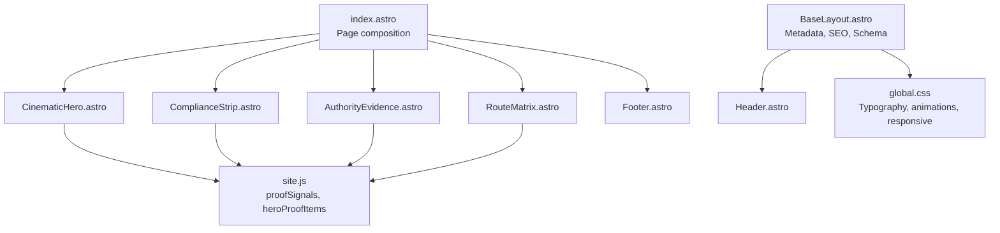
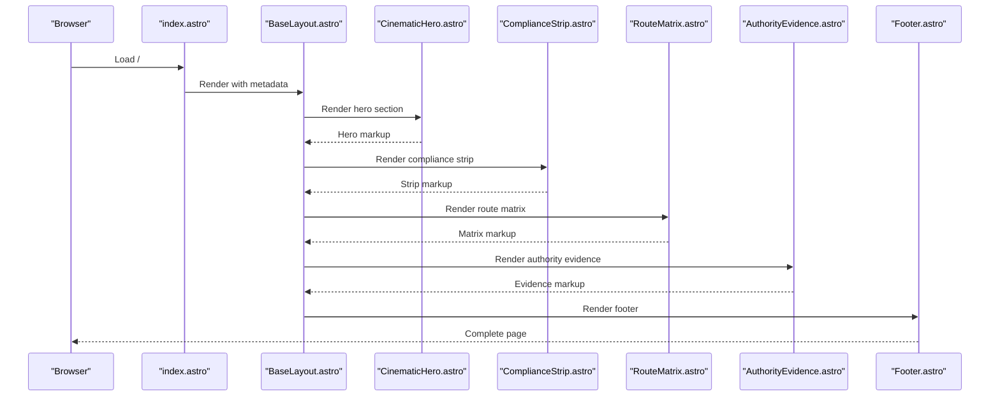
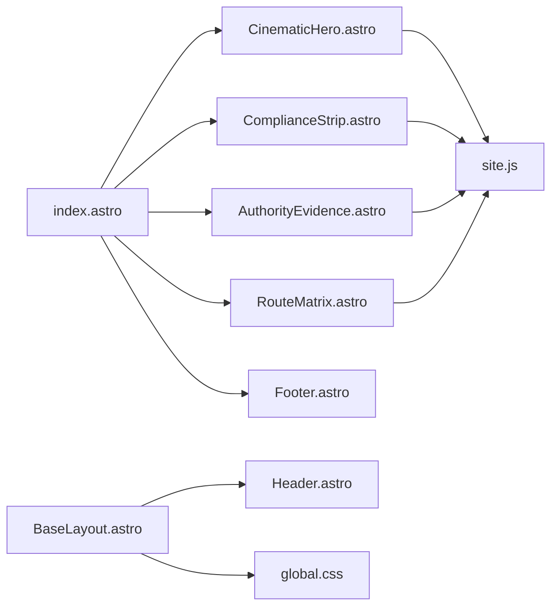

# Landing Page Components

<cite>
**Referenced Files in This Document**
- [index.astro](file://src/pages/index.astro)
- [BaseLayout.astro](file://src/layouts/BaseLayout.astro)
- [CinematicHero.astro](file://src/components/sections/CinematicHero.astro)
- [ComplianceStrip.astro](file://src/components/sections/ComplianceStrip.astro)
- [RouteMatrix.astro](file://src/components/sections/RouteMatrix.astro)
- [AuthorityEvidence.astro](file://src/components/sections/AuthorityEvidence.astro)
- [CTA.astro](file://src/components/sections/CTA.astro)
- [site.js](file://src/data/site.js)
- [global.css](file://src/styles/global.css)
- [Header.astro](file://src/components/layout/Header.astro)
- [Button.astro](file://src/components/ui/Button.astro)
- [SectionHeading.astro](file://src/components/sections/SectionHeading.astro)
</cite>

## Table of Contents
1. [Introduction](#introduction)
2. [Project Structure](#project-structure)
3. [Core Components](#core-components)
4. [Architecture Overview](#architecture-overview)
5. [Detailed Component Analysis](#detailed-component-analysis)
6. [Dependency Analysis](#dependency-analysis)
7. [Performance Considerations](#performance-considerations)
8. [Troubleshooting Guide](#troubleshooting-guide)
9. [Conclusion](#conclusion)
10. [Appendices](#appendices)

## Introduction
This document explains the landing page component architecture used on the homepage. It focuses on four key sections:
- CinematicHero: cinematic hero presentation with hero image handling, headline, and call-to-action buttons
- ComplianceStrip: regulatory certifications and trust indicators
- RouteMatrix: service area mapping and accessibility features
- AuthorityEvidence: regulatory approvals and documentation presentation

It also covers component composition patterns, prop interfaces, responsive design, customization examples, content management integration, and performance optimization techniques.

## Project Structure
The homepage composes multiple Astro components into a cohesive landing page. The index page imports and renders the hero, compliance strip, route matrix, authority evidence, and footer. Shared styles and metadata are provided by the base layout and global CSS.

**Diagram sources**
- [index.astro:1-18](file://src/pages/index.astro#L1-L18)
- [BaseLayout.astro:1-117](file://src/layouts/BaseLayout.astro#L1-L117)
- [CinematicHero.astro:1-64](file://src/components/sections/CinematicHero.astro#L1-L64)
- [ComplianceStrip.astro:1-17](file://src/components/sections/ComplianceStrip.astro#L1-L17)
- [RouteMatrix.astro:1-68](file://src/components/sections/RouteMatrix.astro#L1-L68)
- [AuthorityEvidence.astro:1-58](file://src/components/sections/AuthorityEvidence.astro#L1-L58)
- [site.js:245-303](file://src/data/site.js#L245-L303)
- [global.css:1-483](file://src/styles/global.css#L1-L483)

**Section sources**
- [index.astro:1-18](file://src/pages/index.astro#L1-L18)
- [BaseLayout.astro:1-117](file://src/layouts/BaseLayout.astro#L1-L117)

## Core Components
This section outlines the four landing page components and their roles.

- CinematicHero: Hero presentation with animated background elements, headline, subheading, trust signals, and CTAs.
- ComplianceStrip: Regulatory and compliance proof signals displayed as badges.
- RouteMatrix: Service pathways organized as cards with labels and descriptions.
- AuthorityEvidence: Technical proof and supported systems ecosystem presentation.

Each component reads data from a centralized data module and applies Tailwind-based styling with responsive breakpoints.

**Section sources**
- [CinematicHero.astro:1-64](file://src/components/sections/CinematicHero.astro#L1-L64)
- [ComplianceStrip.astro:1-17](file://src/components/sections/ComplianceStrip.astro#L1-L17)
- [RouteMatrix.astro:1-68](file://src/components/sections/RouteMatrix.astro#L1-L68)
- [AuthorityEvidence.astro:1-58](file://src/components/sections/AuthorityEvidence.astro#L1-L58)
- [site.js:245-303](file://src/data/site.js#L245-L303)

## Architecture Overview
The homepage composes components in a strict order to guide the visitor’s journey: establish presence (hero), signal trust (compliance strip), show capabilities (route matrix), and demonstrate authority (authority evidence). The base layout injects SEO metadata, Open Graph, and structured data.

**Diagram sources**
- [index.astro:1-18](file://src/pages/index.astro#L1-L18)
- [BaseLayout.astro:1-117](file://src/layouts/BaseLayout.astro#L1-L117)
- [CinematicHero.astro:1-64](file://src/components/sections/CinematicHero.astro#L1-L64)
- [ComplianceStrip.astro:1-17](file://src/components/sections/ComplianceStrip.astro#L1-L17)
- [RouteMatrix.astro:1-68](file://src/components/sections/RouteMatrix.astro#L1-L68)
- [AuthorityEvidence.astro:1-58](file://src/components/sections/AuthorityEvidence.astro#L1-L58)

## Detailed Component Analysis

### CinematicHero
Purpose:
- Establish brand presence with a cinematic hero layout
- Present headline, subheading, trust signals, and call-to-action buttons

Key features:
- Background atmosphere, structure, floor, and animated linework
- SVG-based animated elements with gradients and motion
- Responsive grid layout with headline, subheading, trust badges, and CTA buttons
- Accessibility: aria-hidden on decorative elements; skip link in header

Hero image handling:
- Uses a brand mark as a large decorative image with eager loading and async decoding
- Positioned absolutely and styled with perspective and mask effects

Headline and subheading:
- Headline uses a custom typography class with responsive sizing
- Subheading provides concise value proposition

Trust signals:
- Renders a static list of trust indicators directly in the component

CTA buttons:
- Two primary links for site assessment and emergency support
- Responsive button layout with wrapping on small screens

Prop interface:
- None declared in the component; relies on static data and props from the page

Responsive design:
- Grid layout adapts from single column to two-column layout at larger widths
- Typography scales across breakpoints
- Decorative elements scale and hide on smaller screens

Accessibility:
- Structural headings and paragraphs
- aria-hidden on decorative visuals
- Focus-visible outline for keyboard navigation

Customization examples:
- Replace trust signals by editing the static array
- Adjust headline and subheading by updating the HTML content
- Change CTAs by editing anchor hrefs and labels

Content management integration:
- Trust signals are currently hardcoded; consider sourcing from a CMS-backed data structure
- Headline and subheading could be externalized to a CMS field

Performance optimization:
- Image uses eager loading and async decoding for perceived performance
- SVG linework is lightweight and animated via CSS
- Avoids heavy JavaScript; relies on CSS animations

**Section sources**
- [CinematicHero.astro:1-64](file://src/components/sections/CinematicHero.astro#L1-L64)
- [global.css:132-266](file://src/styles/global.css#L132-L266)

### ComplianceStrip
Purpose:
- Display regulatory and compliance proof signals as badges

Key features:
- Reads compliance signals from a shared data module
- Renders a horizontal row of badge-like spans
- Includes a labeled eyebrow for context

Prop interface:
- None declared; consumes data via import

Responsive design:
- Badge layout wraps to accommodate varying numbers of signals
- Typography remains consistent across breakpoints

Accessibility:
- Uses an aria-label on the section for screen readers

Customization examples:
- Add or remove items in the complianceSignals array to update displayed badges
- Modify the eyebrow label text to reflect changing compliance themes

Content management integration:
- Data-driven; easy to manage via the data module

Performance optimization:
- Minimal DOM; renders a simple loop over a small dataset

**Section sources**
- [ComplianceStrip.astro:1-17](file://src/components/sections/ComplianceStrip.astro#L1-L17)
- [site.js:285-291](file://src/data/site.js#L285-L291)

### RouteMatrix
Purpose:
- Present service pathways as clickable cards with labels and descriptions

Key features:
- Static route definitions with title, label, href, and text
- Responsive grid layout scaling from 1 to 3 columns
- CTAs for assessment intake

Prop interface:
- None declared; uses local data

Responsive design:
- Grid adjusts from 1 to 3 columns based on viewport
- Typography scales appropriately

Accessibility:
- Cards are links; ensure focus states are visible
- Descriptive text and labels aid comprehension

Customization examples:
- Add new routes by extending the routes array
- Change labels to reflect evolving service categories
- Update descriptions to reflect current offerings

Content management integration:
- Data is static; consider externalizing to a CMS for dynamic updates

Performance optimization:
- Lightweight rendering of a small fixed set of cards

**Section sources**
- [RouteMatrix.astro:1-68](file://src/components/sections/RouteMatrix.astro#L1-L68)
- [site.js:2-39](file://src/data/site.js#L2-L39)

### AuthorityEvidence
Purpose:
- Demonstrate technical proof and supported systems ecosystem

Key features:
- Two-column layout: textual narrative and proof cards
- Dark-themed ecosystem section with white text
- Reads proof signals and supported ecosystem from data

Prop interface:
- None declared; consumes data via import

Responsive design:
- Two-column layout on large screens; stacks on smaller screens
- Typography scales for readability

Accessibility:
- Clear headings and contrast in both light and dark sections

Customization examples:
- Add new proof signals to the data module to expand demonstration
- Update ecosystem list to reflect current supported platforms

Content management integration:
- Data-driven; easy to manage via the data module

Performance optimization:
- Minimal DOM; renders a small fixed set of cards

**Section sources**
- [AuthorityEvidence.astro:1-58](file://src/components/sections/AuthorityEvidence.astro#L1-L58)
- [site.js:245-283](file://src/data/site.js#L245-L283)

### Additional Components Used in Composition
- BaseLayout: Provides SEO metadata, Open Graph, structured data, and canonical URLs
- Header: Navigation and skip link for accessibility
- SectionHeading: Reusable heading component with eyebrow, title, and optional text
- Button: Reusable button component with variants

These components support the landing page by providing consistent navigation, metadata, and reusable UI elements.

**Section sources**
- [BaseLayout.astro:1-117](file://src/layouts/BaseLayout.astro#L1-L117)
- [Header.astro:1-171](file://src/components/layout/Header.astro#L1-L171)
- [SectionHeading.astro:1-22](file://src/components/sections/SectionHeading.astro#L1-L22)
- [Button.astro:1-21](file://src/components/ui/Button.astro#L1-L21)

## Dependency Analysis
The homepage depends on:
- Data module for content and configuration
- Global CSS for typography, animations, and responsive behavior
- Base layout for SEO and structured data
- Shared UI components for consistency

**Diagram sources**
- [index.astro:1-18](file://src/pages/index.astro#L1-L18)
- [CinematicHero.astro:1-64](file://src/components/sections/CinematicHero.astro#L1-L64)
- [ComplianceStrip.astro:1-17](file://src/components/sections/ComplianceStrip.astro#L1-L17)
- [RouteMatrix.astro:1-68](file://src/components/sections/RouteMatrix.astro#L1-L68)
- [AuthorityEvidence.astro:1-58](file://src/components/sections/AuthorityEvidence.astro#L1-L58)
- [site.js:245-303](file://src/data/site.js#L245-L303)
- [BaseLayout.astro:1-117](file://src/layouts/BaseLayout.astro#L1-L117)
- [Header.astro:1-171](file://src/components/layout/Header.astro#L1-L171)
- [global.css:1-483](file://src/styles/global.css#L1-L483)

**Section sources**
- [index.astro:1-18](file://src/pages/index.astro#L1-L18)
- [site.js:245-303](file://src/data/site.js#L245-L303)
- [global.css:1-483](file://src/styles/global.css#L1-L483)

## Performance Considerations
- Hero image: Uses eager loading and async decoding to improve perceived performance; consider lazy-loading for non-critical images if needed
- SVG animations: CSS-driven animations are lightweight; ensure reduced-motion preferences are respected
- Data-driven rendering: Static arrays keep rendering fast; avoid large datasets in hero sections
- CSS animations: Prefer CSS animations over JavaScript for smoother performance
- Accessibility: Focus-visible outlines and skip links improve usability without impacting performance
- SEO: Structured data and metadata are injected server-side, reducing client-side overhead

[No sources needed since this section provides general guidance]

## Troubleshooting Guide
Common issues and resolutions:
- Missing trust signals in hero: Verify the static array is present and not empty
- Compliance strip not visible: Ensure the data import is correct and the array is populated
- Route cards misaligned: Check grid classes and ensure responsive breakpoints are applied
- Authority evidence text unreadable: Confirm contrast ratios in both light and dark sections
- Accessibility: Ensure focus states are visible and skip links are functional

**Section sources**
- [CinematicHero.astro:1-64](file://src/components/sections/CinematicHero.astro#L1-L64)
- [ComplianceStrip.astro:1-17](file://src/components/sections/ComplianceStrip.astro#L1-L17)
- [RouteMatrix.astro:1-68](file://src/components/sections/RouteMatrix.astro#L1-L68)
- [AuthorityEvidence.astro:1-58](file://src/components/sections/AuthorityEvidence.astro#L1-L58)

## Conclusion
The landing page components are designed for clarity, trust, and accessibility. They leverage a centralized data model, consistent styling, and responsive patterns to deliver a strong first impression. The composition prioritizes trust signals and clear pathways to services, while maintaining performance and accessibility best practices.

[No sources needed since this section summarizes without analyzing specific files]

## Appendices

### Component Composition Patterns
- Page-level composition: The index page imports and renders sections in a logical order
- Data-driven rendering: Components consume data from a shared module for consistency
- Reusable UI: Shared components like Button and SectionHeading promote consistency

**Section sources**
- [index.astro:1-18](file://src/pages/index.astro#L1-L18)
- [Button.astro:1-21](file://src/components/ui/Button.astro#L1-L21)
- [SectionHeading.astro:1-22](file://src/components/sections/SectionHeading.astro#L1-L22)

### Prop Interfaces Summary
- CinematicHero: No props; uses static data and page-level content
- ComplianceStrip: No props; consumes complianceSignals from data
- RouteMatrix: No props; uses local routes array
- AuthorityEvidence: No props; consumes proofSignals and supportedEcosystem from data
- BaseLayout: Props include title, description, ogImage, noindex, canonicalPath
- Header: Prop currentPath for active link highlighting
- SectionHeading: Props eyebrow, title, text, dark, align
- Button: Props href, label, variant

**Section sources**
- [CinematicHero.astro:1-64](file://src/components/sections/CinematicHero.astro#L1-L64)
- [ComplianceStrip.astro:1-17](file://src/components/sections/ComplianceStrip.astro#L1-L17)
- [RouteMatrix.astro:1-68](file://src/components/sections/RouteMatrix.astro#L1-L68)
- [AuthorityEvidence.astro:1-58](file://src/components/sections/AuthorityEvidence.astro#L1-L58)
- [BaseLayout.astro:6-12](file://src/layouts/BaseLayout.astro#L6-L12)
- [Header.astro:4](file://src/components/layout/Header.astro#L4)
- [SectionHeading.astro:2](file://src/components/sections/SectionHeading.astro#L2)
- [Button.astro:2-6](file://src/components/ui/Button.astro#L2-L6)

### Responsive Design Implementation
- Breakpoints: Tailwind utilities drive responsive layouts across mobile, tablet, and desktop
- Typography: Custom classes scale headings across breakpoints
- Animations: Media queries adjust animation intensity for reduced-motion preferences

**Section sources**
- [global.css:346-483](file://src/styles/global.css#L346-L483)

### Practical Customization Examples
- Replace trust signals in hero: Edit the static array in the hero component
- Add new compliance badges: Extend the complianceSignals array
- Add new route cards: Extend the routes array with new entries
- Expand authority evidence: Add new items to proofSignals and supportedEcosystem

**Section sources**
- [CinematicHero.astro:2](file://src/components/sections/CinematicHero.astro#L2)
- [ComplianceStrip.astro:2](file://src/components/sections/ComplianceStrip.astro#L2)
- [RouteMatrix.astro:2-39](file://src/components/sections/RouteMatrix.astro#L2-L39)
- [AuthorityEvidence.astro:2](file://src/components/sections/AuthorityEvidence.astro#L2)
- [site.js:245-291](file://src/data/site.js#L245-L291)
- [site.js:263-283](file://src/data/site.js#L263-L283)

### Content Management Integration
- Current state: Data is centralized in a JavaScript module for quick updates
- Recommendations: For dynamic content, integrate with a headless CMS and expose endpoints for runtime data fetching

**Section sources**
- [site.js:1-303](file://src/data/site.js#L1-L303)

### Accessibility Features
- Focus management: BaseLayout includes a skip link; Header manages focus for dropdowns
- Reduced motion: Media query reduces motion for users who prefer it
- ARIA attributes: Decorative elements use aria-hidden; interactive elements use aria-label and aria-current

**Section sources**
- [BaseLayout.astro:23-29](file://src/layouts/BaseLayout.astro#L23-L29)
- [Header.astro:146-171](file://src/components/layout/Header.astro#L146-L171)
- [global.css:346-354](file://src/styles/global.css#L346-L354)