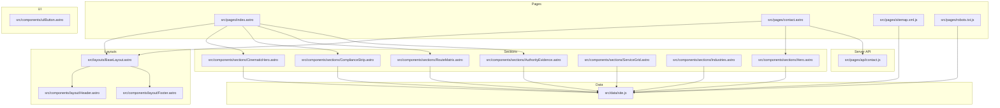
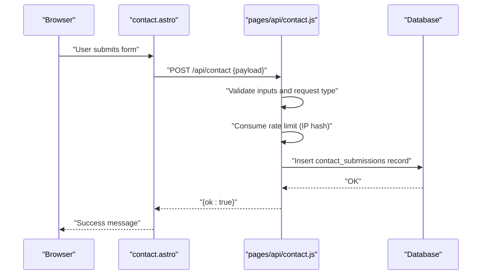
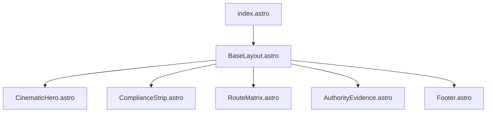
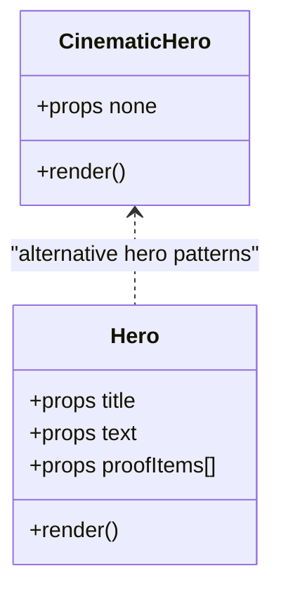
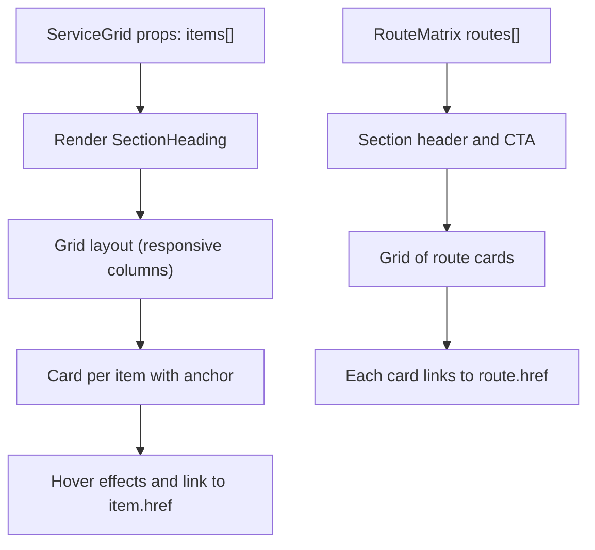
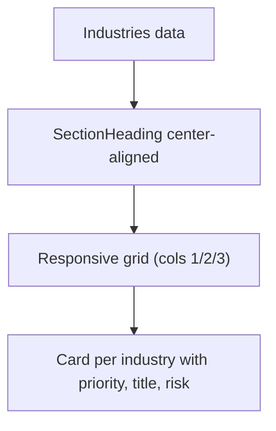
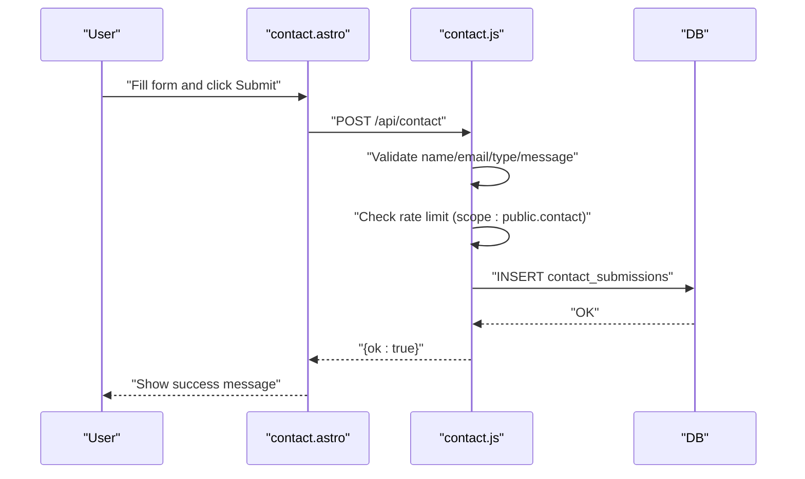
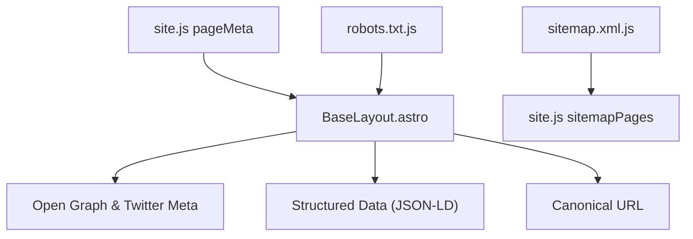
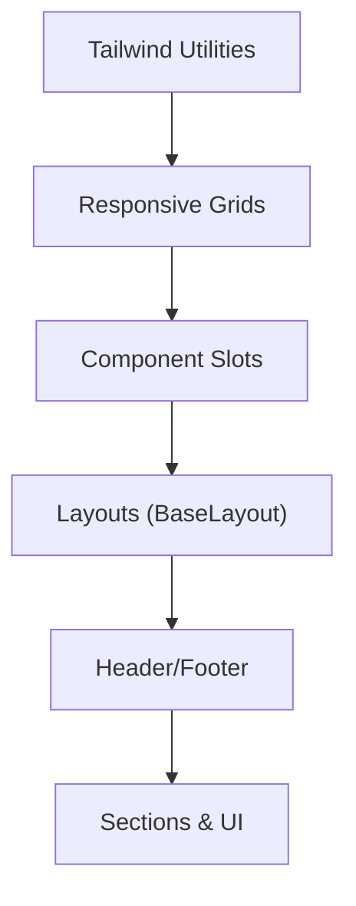
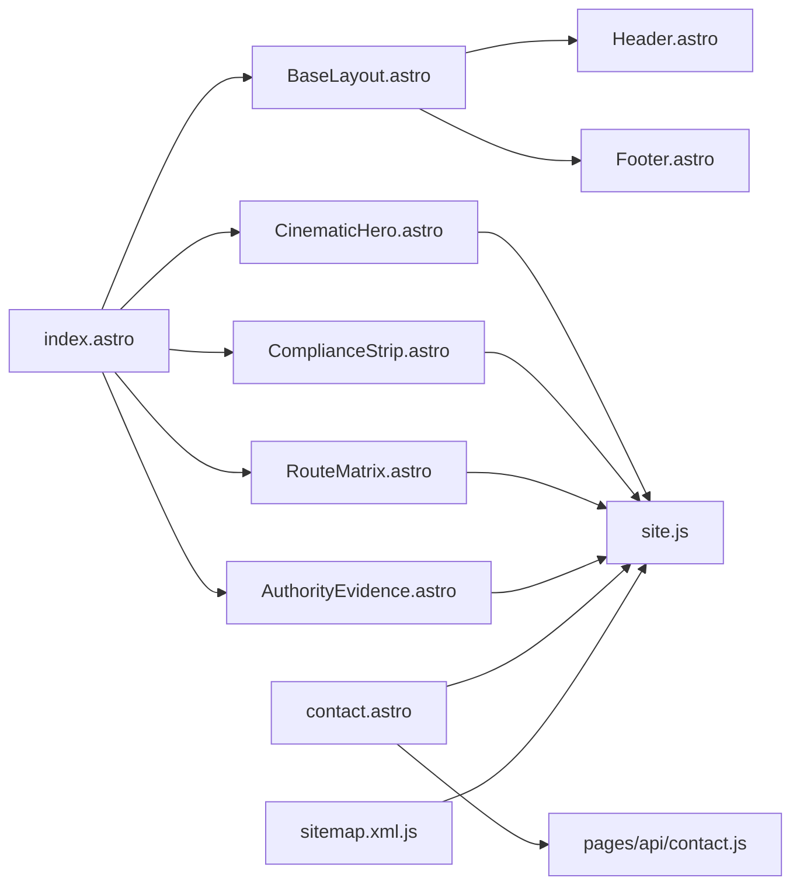

# Public Website Features

<cite>
**Referenced Files in This Document**
- [index.astro](file://src/pages/index.astro)
- [BaseLayout.astro](file://src/layouts/BaseLayout.astro)
- [CinematicHero.astro](file://src/components/sections/CinematicHero.astro)
- [ComplianceStrip.astro](file://src/components/sections/ComplianceStrip.astro)
- [RouteMatrix.astro](file://src/components/sections/RouteMatrix.astro)
- [AuthorityEvidence.astro](file://src/components/sections/AuthorityEvidence.astro)
- [Hero.astro](file://src/components/sections/Hero.astro)
- [ServiceGrid.astro](file://src/components/sections/ServiceGrid.astro)
- [Industries.astro](file://src/components/sections/Industries.astro)
- [Header.astro](file://src/components/layout/Header.astro)
- [Footer.astro](file://src/components/layout/Footer.astro)
- [Button.astro](file://src/components/ui/Button.astro)
- [contact.astro](file://src/pages/contact.astro)
- [contact.js](file://src/pages/api/contact.js)
- [site.js](file://src/data/site.js)
- [sitemap.xml.js](file://src/pages/sitemap.xml.js)
- [robots.txt.js](file://src/pages/robots.txt.js)
- [global.css](file://src/styles/global.css)
- [tailwind.config.mjs](file://tailwind.config.mjs)
</cite>

## Table of Contents
1. [Introduction](#introduction)
2. [Project Structure](#project-structure)
3. [Core Components](#core-components)
4. [Architecture Overview](#architecture-overview)
5. [Detailed Component Analysis](#detailed-component-analysis)
6. [Dependency Analysis](#dependency-analysis)
7. [Performance Considerations](#performance-considerations)
8. [Troubleshooting Guide](#troubleshooting-guide)
9. [Conclusion](#conclusion)
10. [Appendices](#appendices)

## Introduction
This document explains the public website functionality for showcasing fire protection services. It covers the landing page composition, hero sections, service showcases, industry-specific content, component architecture using Astro sections and UI elements, contact form implementation, SEO and sitemap features, responsive design with TailwindCSS, accessibility, performance, and content management workflows.

## Project Structure
The public website is built with Astro and organized by feature and layer:
- Pages define top-level routes and compose sections and layouts.
- Sections encapsulate reusable UI blocks for content presentation.
- UI components provide atomic elements like buttons.
- Layouts manage global HTML head, metadata, and shared navigation/footer.
- Data files centralize site metadata, navigation, and content lists.
- Server-side endpoints handle contact submissions and sitemap generation.

**Diagram sources**
- [index.astro:1-18](file://src/pages/index.astro#L1-L18)
- [BaseLayout.astro:1-117](file://src/layouts/BaseLayout.astro#L1-L117)
- [CinematicHero.astro:1-64](file://src/components/sections/CinematicHero.astro#L1-L64)
- [ComplianceStrip.astro:1-17](file://src/components/sections/ComplianceStrip.astro#L1-L17)
- [RouteMatrix.astro:1-68](file://src/components/sections/RouteMatrix.astro#L1-L68)
- [AuthorityEvidence.astro:1-58](file://src/components/sections/AuthorityEvidence.astro#L1-L58)
- [Hero.astro:1-77](file://src/components/sections/Hero.astro#L1-L77)
- [ServiceGrid.astro:1-37](file://src/components/sections/ServiceGrid.astro#L1-L37)
- [Industries.astro:1-26](file://src/components/sections/Industries.astro#L1-L26)
- [Header.astro:1-171](file://src/components/layout/Header.astro#L1-L171)
- [Footer.astro:1-38](file://src/components/layout/Footer.astro#L1-L38)
- [Button.astro:1-21](file://src/components/ui/Button.astro#L1-L21)
- [contact.astro:1-195](file://src/pages/contact.astro#L1-L195)
- [contact.js:1-116](file://src/pages/api/contact.js#L1-L116)
- [site.js:1-303](file://src/data/site.js#L1-L303)
- [sitemap.xml.js](file://src/pages/sitemap.xml.js)
- [robots.txt.js](file://src/pages/robots.txt.js)

**Section sources**
- [index.astro:1-18](file://src/pages/index.astro#L1-L18)
- [BaseLayout.astro:1-117](file://src/layouts/BaseLayout.astro#L1-L117)
- [site.js:1-303](file://src/data/site.js#L1-L303)

## Core Components
- Landing page composition: The homepage composes a cinematic hero, compliance strip, route matrix, authority evidence, and footer.
- Hero variants: A cinematic hero for strong first impressions and a flexible Hero section for page-specific messaging.
- Service showcase: A grid-based section for services with links and hover states.
- Industry-specific content: A centered section highlighting high-risk environments and mapped risks.
- Contact form: A client-side form posting to a server endpoint with validation and rate limiting.
- SEO and sitemaps: Canonical URLs, structured data, Open Graph/Twitter meta, and sitemap generation.
- Responsive design: Tailwind utilities and component composition patterns ensure mobile-first responsiveness.

**Section sources**
- [index.astro:1-18](file://src/pages/index.astro#L1-L18)
- [CinematicHero.astro:1-64](file://src/components/sections/CinematicHero.astro#L1-L64)
- [Hero.astro:1-77](file://src/components/sections/Hero.astro#L1-L77)
- [ServiceGrid.astro:1-37](file://src/components/sections/ServiceGrid.astro#L1-L37)
- [Industries.astro:1-26](file://src/components/sections/Industries.astro#L1-L26)
- [contact.astro:1-195](file://src/pages/contact.astro#L1-L195)
- [BaseLayout.astro:1-117](file://src/layouts/BaseLayout.astro#L1-L117)
- [sitemap.xml.js](file://src/pages/sitemap.xml.js)

## Architecture Overview
The public website follows a component-driven architecture:
- Pages render sections and pass props from centralized data.
- Layouts inject SEO metadata and structured data.
- UI components encapsulate styling and behavior.
- Server endpoints handle contact submissions with validation and rate limiting.

**Diagram sources**
- [contact.astro:146-189](file://src/pages/contact.astro#L146-L189)
- [contact.js:40-115](file://src/pages/api/contact.js#L40-L115)

## Detailed Component Analysis

### Landing Page Composition
The homepage composes reusable sections and a base layout. It renders a cinematic hero, compliance strip, route matrix, authority evidence, and a footer.

**Diagram sources**
- [index.astro:1-18](file://src/pages/index.astro#L1-L18)
- [BaseLayout.astro:1-117](file://src/layouts/BaseLayout.astro#L1-L117)
- [CinematicHero.astro:1-64](file://src/components/sections/CinematicHero.astro#L1-L64)
- [ComplianceStrip.astro:1-17](file://src/components/sections/ComplianceStrip.astro#L1-L17)
- [RouteMatrix.astro:1-68](file://src/components/sections/RouteMatrix.astro#L1-L68)
- [AuthorityEvidence.astro:1-58](file://src/components/sections/AuthorityEvidence.astro#L1-L58)
- [Footer.astro:1-38](file://src/components/layout/Footer.astro#L1-L38)

**Section sources**
- [index.astro:1-18](file://src/pages/index.astro#L1-L18)

### Hero Sections
- CinematicHero: A visually rich hero with animated linework and trust signals, optimized for strong first impressions.
- Hero: A flexible hero section for page-specific messaging with optional proof items and action buttons.

**Diagram sources**
- [CinematicHero.astro:1-64](file://src/components/sections/CinematicHero.astro#L1-L64)
- [Hero.astro:1-77](file://src/components/sections/Hero.astro#L1-L77)

**Section sources**
- [CinematicHero.astro:1-64](file://src/components/sections/CinematicHero.astro#L1-L64)
- [Hero.astro:1-77](file://src/components/sections/Hero.astro#L1-L77)

### Service Showcases
- ServiceGrid: Presents services as cards with icons, titles, summaries, and links.
- RouteMatrix: Highlights operational pathways to services with labels indicating category and concise descriptions.

**Diagram sources**
- [ServiceGrid.astro:1-37](file://src/components/sections/ServiceGrid.astro#L1-L37)
- [RouteMatrix.astro:1-68](file://src/components/sections/RouteMatrix.astro#L1-L68)

**Section sources**
- [ServiceGrid.astro:1-37](file://src/components/sections/ServiceGrid.astro#L1-L37)
- [RouteMatrix.astro:1-68](file://src/components/sections/RouteMatrix.astro#L1-L68)

### Industry-Specific Content
- Industries: A centered presentation of high-risk environments with priority labels and risk descriptions.

**Diagram sources**
- [Industries.astro:1-26](file://src/components/sections/Industries.astro#L1-L26)
- [site.js:130-171](file://src/data/site.js#L130-L171)

**Section sources**
- [Industries.astro:1-26](file://src/components/sections/Industries.astro#L1-L26)
- [site.js:130-171](file://src/data/site.js#L130-L171)

### Contact Form Implementation
- Client-side form: Collects name, email, request type, and message; includes a hidden field to deter bots.
- Submission flow: Validates presence and length, posts to /api/contact, and updates UI with success/error messages.
- Server endpoint: Validates fields, checks allowed request types, rate limits by IP hash, persists to database, and responds with JSON.

**Diagram sources**
- [contact.astro:84-145](file://src/pages/contact.astro#L84-L145)
- [contact.js:40-115](file://src/pages/api/contact.js#L40-L115)

**Section sources**
- [contact.astro:1-195](file://src/pages/contact.astro#L1-L195)
- [contact.js:1-116](file://src/pages/api/contact.js#L1-L116)

### SEO Optimization and Sitemap Generation
- BaseLayout: Injects canonical URL, Open Graph, Twitter Card, and structured data (Schema.org LocalBusiness, WebSite, Service).
- Metadata: Per-page titles and descriptions are provided via site.js.
- Sitemap: Generates XML sitemap from site.js sitemapPages.
- Robots: Provides robots.txt configuration.

**Diagram sources**
- [BaseLayout.astro:1-117](file://src/layouts/BaseLayout.astro#L1-L117)
- [site.js:22-73](file://src/data/site.js#L22-L73)
- [sitemap.xml.js](file://src/pages/sitemap.xml.js)
- [robots.txt.js](file://src/pages/robots.txt.js)

**Section sources**
- [BaseLayout.astro:1-117](file://src/layouts/BaseLayout.astro#L1-L117)
- [site.js:22-73](file://src/data/site.js#L22-L73)
- [sitemap.xml.js](file://src/pages/sitemap.xml.js)
- [robots.txt.js](file://src/pages/robots.txt.js)

### Responsive Design and Component Composition
- TailwindCSS: Utility classes drive responsive breakpoints and spacing.
- Component composition: Sections and UI components are designed to be reusable across pages.
- Navigation: Header adapts to desktop and mobile with accessible disclosure widgets.

**Diagram sources**
- [Header.astro:1-171](file://src/components/layout/Header.astro#L1-L171)
- [Footer.astro:1-38](file://src/components/layout/Footer.astro#L1-L38)
- [ServiceGrid.astro:1-37](file://src/components/sections/ServiceGrid.astro#L1-L37)
- [RouteMatrix.astro:1-68](file://src/components/sections/RouteMatrix.astro#L1-L68)

**Section sources**
- [Header.astro:1-171](file://src/components/layout/Header.astro#L1-L171)
- [Footer.astro:1-38](file://src/components/layout/Footer.astro#L1-L38)
- [ServiceGrid.astro:1-37](file://src/components/sections/ServiceGrid.astro#L1-L37)
- [RouteMatrix.astro:1-68](file://src/components/sections/RouteMatrix.astro#L1-L68)

### Practical Examples
- Service presentations: Use ServiceGrid to present service cards with links and summaries.
- Compliance documentation display: Use AuthorityEvidence to show proof signals and supported ecosystem.
- Customer engagement: Use Contact form with preselected intents and clear CTAs.

**Section sources**
- [ServiceGrid.astro:1-37](file://src/components/sections/ServiceGrid.astro#L1-L37)
- [AuthorityEvidence.astro:1-58](file://src/components/sections/AuthorityEvidence.astro#L1-L58)
- [contact.astro:1-195](file://src/pages/contact.astro#L1-L195)

## Dependency Analysis
Key dependencies and relationships:
- Pages depend on BaseLayout and sections.
- Sections depend on site.js for content and props.
- Contact page depends on contact API endpoint.
- Sitemap depends on site.js sitemapPages.
- Layouts depend on site.js for metadata and structured data.

**Diagram sources**
- [index.astro:1-18](file://src/pages/index.astro#L1-L18)
- [BaseLayout.astro:1-117](file://src/layouts/BaseLayout.astro#L1-L117)
- [CinematicHero.astro:1-64](file://src/components/sections/CinematicHero.astro#L1-L64)
- [ComplianceStrip.astro:1-17](file://src/components/sections/ComplianceStrip.astro#L1-L17)
- [RouteMatrix.astro:1-68](file://src/components/sections/RouteMatrix.astro#L1-L68)
- [AuthorityEvidence.astro:1-58](file://src/components/sections/AuthorityEvidence.astro#L1-L58)
- [contact.astro:1-195](file://src/pages/contact.astro#L1-L195)
- [contact.js:1-116](file://src/pages/api/contact.js#L1-L116)
- [Header.astro:1-171](file://src/components/layout/Header.astro#L1-L171)
- [Footer.astro:1-38](file://src/components/layout/Footer.astro#L1-L38)
- [site.js:1-303](file://src/data/site.js#L1-L303)
- [sitemap.xml.js](file://src/pages/sitemap.xml.js)

**Section sources**
- [site.js:1-303](file://src/data/site.js#L1-L303)

## Performance Considerations
- Static generation: Astro prerenders pages where possible, reducing server load.
- Minimal client-side JS: Contact form uses vanilla fetch; avoid heavy frameworks for simple forms.
- Image optimization: Lazy-load and decode asynchronously where applicable; use appropriate sizes.
- CSS and fonts: Keep global styles minimal; defer non-critical fonts.
- Rate limiting: Server endpoint throttles submissions to prevent abuse.
- Canonicalization: Prevents duplicate content and improves indexing performance.

[No sources needed since this section provides general guidance]

## Troubleshooting Guide
- Contact form errors:
  - Validation failures return 422 with a message; check name, email, request type, and message lengths.
  - Rate limit exceeded returns 429; instruct users to retry later.
  - Database insertion failures return 500; advise contacting admin directly.
- SEO issues:
  - Verify canonical URL and Open Graph images are absolute and correct.
  - Confirm structured data JSON-LD is injected and valid.
- Sitemap and robots:
  - Ensure sitemap.xml.js reads sitemapPages from site.js.
  - Confirm robots.txt allows/disallows appropriate paths.

**Section sources**
- [contact.js:40-115](file://src/pages/api/contact.js#L40-L115)
- [BaseLayout.astro:1-117](file://src/layouts/BaseLayout.astro#L1-L117)
- [site.js:117-128](file://src/data/site.js#L117-L128)

## Conclusion
The public website leverages Astro’s component model to deliver a cohesive, SEO-friendly, and accessible experience. Reusable sections, centralized data, and a straightforward contact pipeline enable efficient content management and reliable customer engagement across fire protection services.

[No sources needed since this section summarizes without analyzing specific files]

## Appendices

### Accessibility Compliance Notes
- Skip link: Header includes a skip-to-content link for keyboard/screen reader users.
- Focus management: Disclosure widgets close on Escape and outside clicks.
- Semantic markup: Proper headings, landmarks, and ARIA attributes in navigation and hero sections.
- Contrast and readable text: Tailwind color tokens ensure sufficient contrast.

**Section sources**
- [Header.astro:23-171](file://src/components/layout/Header.astro#L23-L171)
- [CinematicHero.astro:5-77](file://src/components/sections/CinematicHero.astro#L5-L77)
- [Hero.astro:10-77](file://src/components/sections/Hero.astro#L10-L77)

### Content Management Workflows
- Centralized content: site.js holds page metadata, navigation, industries, and sitemap pages.
- Adding new services: Extend solutionLinks and RouteMatrix routes; update site.js and relevant sections.
- Updating industries: Add entries to industries array; sections map over the list.
- Managing sitemap: Add new pages to sitemapPages in site.js.

**Section sources**
- [site.js:22-128](file://src/data/site.js#L22-L128)
- [RouteMatrix.astro:2-39](file://src/components/sections/RouteMatrix.astro#L2-L39)
- [Industries.astro:15-23](file://src/components/sections/Industries.astro#L15-L23)