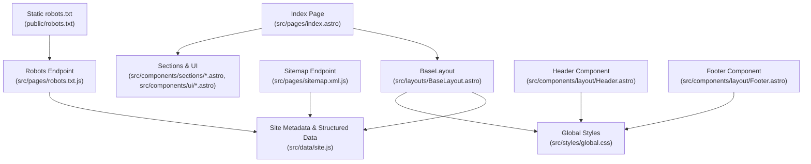
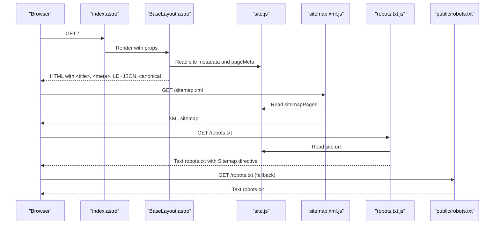
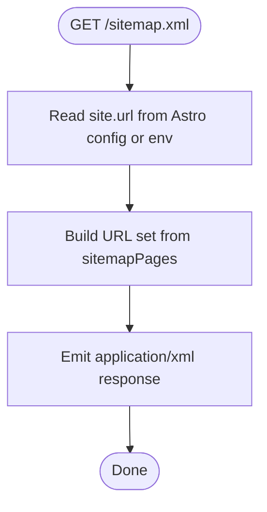
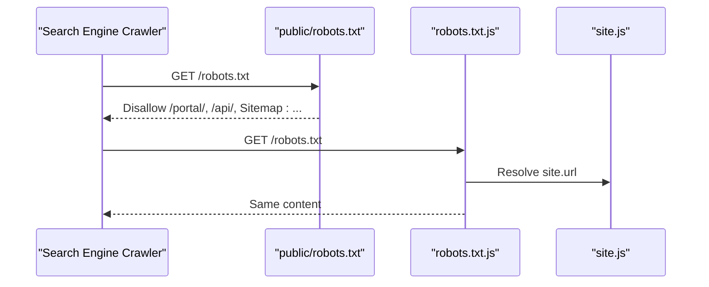
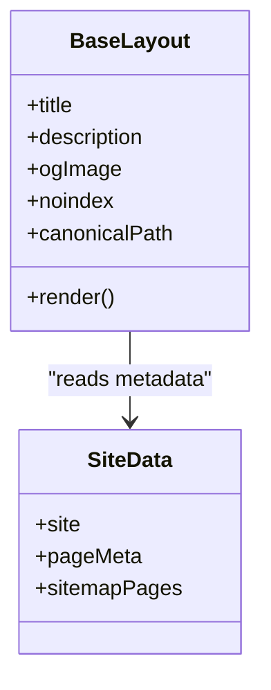
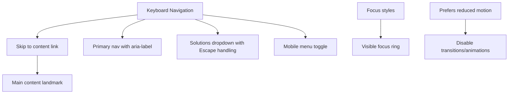
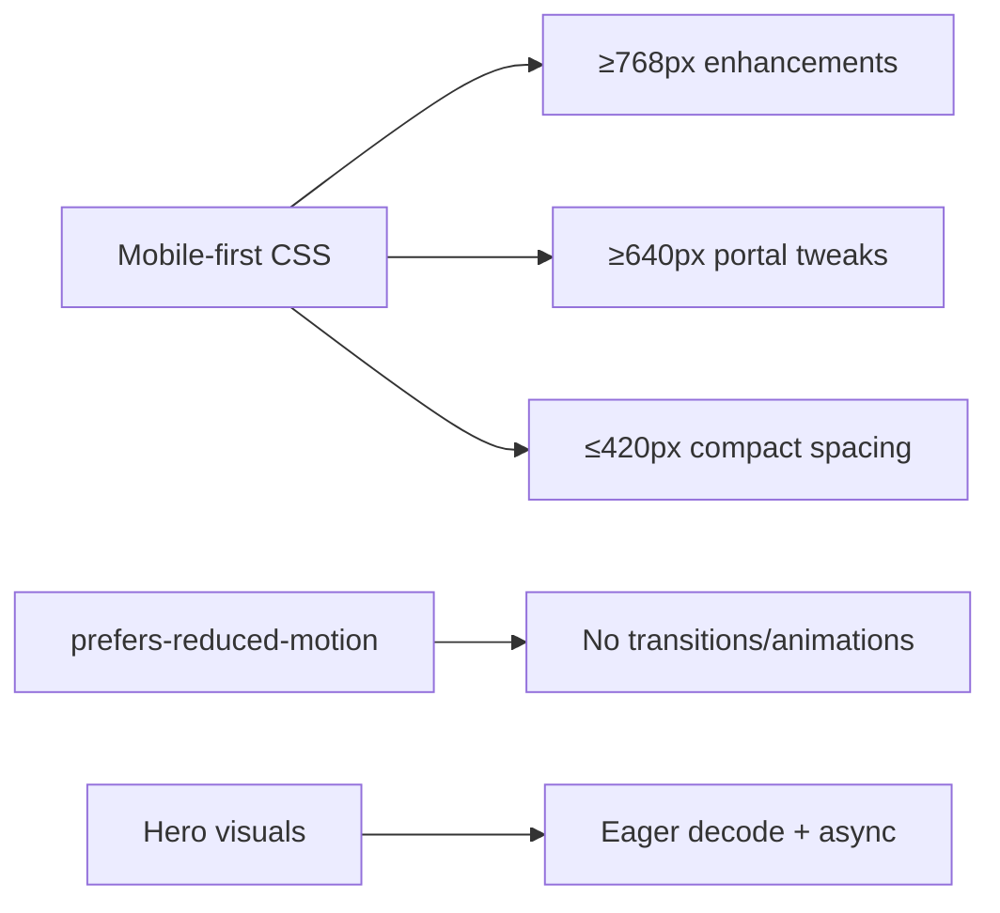
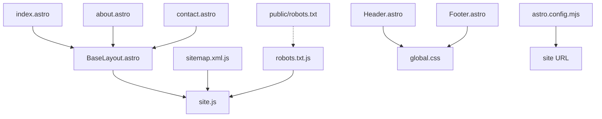

# SEO & Accessibility Features

<cite>
**Referenced Files in This Document**
- [public/robots.txt](file://public/robots.txt)
- [src/pages/robots.txt.js](file://src/pages/robots.txt.js)
- [src/pages/sitemap.xml.js](file://src/pages/sitemap.xml.js)
- [src/data/site.js](file://src/data/site.js)
- [src/layouts/BaseLayout.astro](file://src/layouts/BaseLayout.astro)
- [src/components/layout/Header.astro](file://src/components/layout/Header.astro)
- [src/components/layout/Footer.astro](file://src/components/layout/Footer.astro)
- [src/styles/global.css](file://src/styles/global.css)
- [src/pages/index.astro](file://src/pages/index.astro)
- [src/pages/about.astro](file://src/pages/about.astro)
- [src/pages/contact.astro](file://src/pages/contact.astro)
- [src/components/sections/Hero.astro](file://src/components/sections/Hero.astro)
- [src/components/ui/Button.astro](file://src/components/ui/Button.astro)
- [package.json](file://package.json)
- [astro.config.mjs](file://astro.config.mjs)
</cite>

## Table of Contents
1. [Introduction](#introduction)
2. [Project Structure](#project-structure)
3. [Core Components](#core-components)
4. [Architecture Overview](#architecture-overview)
5. [Detailed Component Analysis](#detailed-component-analysis)
6. [Dependency Analysis](#dependency-analysis)
7. [Performance Considerations](#performance-considerations)
8. [Troubleshooting Guide](#troubleshooting-guide)
9. [Conclusion](#conclusion)
10. [Appendices](#appendices)

## Introduction
This document explains how the public website implements SEO and accessibility across the codebase. It covers:
- Search engine indexing via sitemap generation and robots.txt configuration
- Site metadata management (Open Graph, Twitter Cards, structured data)
- Accessibility features (ARIA labels, keyboard navigation, screen reader compatibility)
- Performance optimization techniques and mobile-first design
- Practical examples and verification steps for SEO best practices

## Project Structure
The public website is built with Astro and Tailwind CSS. SEO and accessibility features are implemented primarily in:
- Global metadata and sitemap generation in layout and data modules
- Navigation and skip-link accessibility in header and footer components
- Global styles for focus management, reduced motion, and responsive design
- Page-level metadata injection via BaseLayout

**Diagram sources**
- [src/pages/index.astro:1-18](file://src/pages/index.astro#L1-L18)
- [src/layouts/BaseLayout.astro:1-117](file://src/layouts/BaseLayout.astro#L1-L117)
- [src/data/site.js:1-309](file://src/data/site.js#L1-L309)
- [src/styles/global.css:1-483](file://src/styles/global.css#L1-L483)
- [src/pages/sitemap.xml.js:1-26](file://src/pages/sitemap.xml.js#L1-L26)
- [src/pages/robots.txt.js:1-13](file://src/pages/robots.txt.js#L1-L13)
- [public/robots.txt:1-7](file://public/robots.txt#L1-L7)
- [src/components/layout/Header.astro:1-171](file://src/components/layout/Header.astro#L1-L171)
- [src/components/layout/Footer.astro:1-39](file://src/components/layout/Footer.astro#L1-L39)

**Section sources**
- [src/pages/index.astro:1-18](file://src/pages/index.astro#L1-L18)
- [src/layouts/BaseLayout.astro:1-117](file://src/layouts/BaseLayout.astro#L1-L117)
- [src/data/site.js:1-309](file://src/data/site.js#L1-L309)
- [src/styles/global.css:1-483](file://src/styles/global.css#L1-L483)
- [src/pages/sitemap.xml.js:1-26](file://src/pages/sitemap.xml.js#L1-L26)
- [src/pages/robots.txt.js:1-13](file://src/pages/robots.txt.js#L1-L13)
- [public/robots.txt:1-7](file://public/robots.txt#L1-L7)
- [src/components/layout/Header.astro:1-171](file://src/components/layout/Header.astro#L1-L171)
- [src/components/layout/Footer.astro:1-39](file://src/components/layout/Footer.astro#L1-L39)

## Core Components
- Site metadata and navigation data: centralized in [site.js:1-309](file://src/data/site.js#L1-L309)
- Canonical URLs, Open Graph, Twitter, and structured data: injected in [BaseLayout.astro:1-117](file://src/layouts/BaseLayout.astro#L1-L117)
- Sitemap generation endpoint: [sitemap.xml.js:1-26](file://src/pages/sitemap.xml.js#L1-L26)
- Robots configuration: static [public/robots.txt:1-7](file://public/robots.txt#L1-L7) and dynamic [robots.txt.js:1-13](file://src/pages/robots.txt.js#L1-L13)
- Accessibility: skip-to-content, ARIA attributes, keyboard navigation in [Header.astro:1-171](file://src/components/layout/Header.astro#L1-L171), focus styles in [global.css:117-120](file://src/styles/global.css#L117-L120)
- Mobile-first design and reduced motion: media queries and reduced motion handling in [global.css:346-354](file://src/styles/global.css#L346-L354)

**Section sources**
- [src/data/site.js:1-309](file://src/data/site.js#L1-L309)
- [src/layouts/BaseLayout.astro:1-117](file://src/layouts/BaseLayout.astro#L1-L117)
- [src/pages/sitemap.xml.js:1-26](file://src/pages/sitemap.xml.js#L1-L26)
- [src/pages/robots.txt.js:1-13](file://src/pages/robots.txt.js#L1-L13)
- [public/robots.txt:1-7](file://public/robots.txt#L1-L7)
- [src/components/layout/Header.astro:1-171](file://src/components/layout/Header.astro#L1-L171)
- [src/styles/global.css:117-120](file://src/styles/global.css#L117-L120)
- [src/styles/global.css:346-354](file://src/styles/global.css#L346-L354)

## Architecture Overview
The SEO and accessibility pipeline integrates data-driven metadata, server-rendered HTML, and runtime accessibility features.

**Diagram sources**
- [src/pages/index.astro:1-18](file://src/pages/index.astro#L1-L18)
- [src/layouts/BaseLayout.astro:1-117](file://src/layouts/BaseLayout.astro#L1-L117)
- [src/data/site.js:1-309](file://src/data/site.js#L1-L309)
- [src/pages/sitemap.xml.js:1-26](file://src/pages/sitemap.xml.js#L1-L26)
- [src/pages/robots.txt.js:1-13](file://src/pages/robots.txt.js#L1-L13)
- [public/robots.txt:1-7](file://public/robots.txt#L1-L7)

## Detailed Component Analysis

### Sitemap Generation
- The sitemap endpoint reads the canonical site URL and a curated list of pages from [site.js:122-134](file://src/data/site.js#L122-L134) to generate an XML sitemap.
- The sitemap sets a monthly change frequency and emits a URL set compliant with sitemaps.org schema.
- The robots configuration advertises the sitemap location to crawlers.

**Diagram sources**
- [src/pages/sitemap.xml.js:1-26](file://src/pages/sitemap.xml.js#L1-L26)
- [src/data/site.js:1-309](file://src/data/site.js#L1-L309)

**Section sources**
- [src/pages/sitemap.xml.js:1-26](file://src/pages/sitemap.xml.js#L1-L26)
- [src/data/site.js:122-134](file://src/data/site.js#L122-L134)

### Robots.txt Configuration
- A static robots.txt exists under [public/robots.txt:1-7](file://public/robots.txt#L1-L7) that disallows portal and API paths and points to the sitemap.
- A dynamic robots endpoint [robots.txt.js:1-13](file://src/pages/robots.txt.js#L1-L13) generates the same content and can be used if static files are not served as text/plain.

**Diagram sources**
- [public/robots.txt:1-7](file://public/robots.txt#L1-L7)
- [src/pages/robots.txt.js:1-13](file://src/pages/robots.txt.js#L1-L13)
- [src/data/site.js:1-309](file://src/data/site.js#L1-L309)

**Section sources**
- [public/robots.txt:1-7](file://public/robots.txt#L1-L7)
- [src/pages/robots.txt.js:1-13](file://src/pages/robots.txt.js#L1-L13)
- [src/data/site.js:1-309](file://src/data/site.js#L1-L309)

### Site Metadata Management (Open Graph, Twitter, Structured Data)
- Canonical URL construction ensures single-version indexing.
- Open Graph meta tags include title, description, type, URL, site name, image, image type, alt, and locale.
- Twitter card meta tags include card type, title, description, and image.
- Structured data includes LocalBusiness, WebSite, and Service with provider linkage and audience targeting.

**Diagram sources**
- [src/layouts/BaseLayout.astro:1-117](file://src/layouts/BaseLayout.astro#L1-L117)
- [src/data/site.js:1-309](file://src/data/site.js#L1-L309)

**Section sources**
- [src/layouts/BaseLayout.astro:1-117](file://src/layouts/BaseLayout.astro#L1-L117)
- [src/data/site.js:1-309](file://src/data/site.js#L1-L309)

### Accessibility Features
- Skip-to-content link allows keyboard users to bypass repeated navigation.
- ARIA attributes on interactive elements (navigation, menus, buttons) provide roles and states.
- Focus-visible styles highlight keyboard navigation targets.
- Reduced motion support disables animations/transitions for users who prefer reduced motion.
- Keyboard navigation for dropdowns and mobile menus is implemented in JavaScript within the header component.

**Diagram sources**
- [src/components/layout/Header.astro:1-171](file://src/components/layout/Header.astro#L1-L171)
- [src/styles/global.css:117-120](file://src/styles/global.css#L117-L120)
- [src/styles/global.css:346-354](file://src/styles/global.css#L346-L354)

**Section sources**
- [src/components/layout/Header.astro:1-171](file://src/components/layout/Header.astro#L1-L171)
- [src/styles/global.css:117-120](file://src/styles/global.css#L117-L120)
- [src/styles/global.css:346-354](file://src/styles/global.css#L346-L354)

### Mobile-First Design and Performance
- Mobile-first breakpoints progressively enhance layout for larger screens.
- Reduced motion media query reduces motion and transitions for user preference.
- Hero sections use eager loading for essential visuals and SVGs for crisp rendering.
- Buttons and links use concise ARIA labels and semantic anchors.

**Diagram sources**
- [src/styles/global.css:378-483](file://src/styles/global.css#L378-L483)
- [src/styles/global.css:346-354](file://src/styles/global.css#L346-L354)
- [src/components/sections/Hero.astro:1-77](file://src/components/sections/Hero.astro#L1-L77)
- [src/components/ui/Button.astro:1-21](file://src/components/ui/Button.astro#L1-L21)

**Section sources**
- [src/styles/global.css:378-483](file://src/styles/global.css#L378-L483)
- [src/styles/global.css:346-354](file://src/styles/global.css#L346-L354)
- [src/components/sections/Hero.astro:1-77](file://src/components/sections/Hero.astro#L1-L77)
- [src/components/ui/Button.astro:1-21](file://src/components/ui/Button.astro#L1-L21)

## Dependency Analysis
- BaseLayout depends on site metadata and page-specific props to render canonical, OG, Twitter, and structured data.
- Sitemap and robots endpoints depend on site URL resolution for correct sitemap advertisement.
- Header/Footer rely on global focus and reduced-motion styles for accessibility.
- Astro configuration sets the site origin and adapter for deployment.

**Diagram sources**
- [src/layouts/BaseLayout.astro:1-117](file://src/layouts/BaseLayout.astro#L1-L117)
- [src/data/site.js:1-309](file://src/data/site.js#L1-L309)
- [src/pages/index.astro:1-18](file://src/pages/index.astro#L1-L18)
- [src/pages/about.astro:1-50](file://src/pages/about.astro#L1-L50)
- [src/pages/contact.astro:1-195](file://src/pages/contact.astro#L1-L195)
- [src/pages/sitemap.xml.js:1-26](file://src/pages/sitemap.xml.js#L1-L26)
- [src/pages/robots.txt.js:1-13](file://src/pages/robots.txt.js#L1-L13)
- [public/robots.txt:1-7](file://public/robots.txt#L1-L7)
- [src/components/layout/Header.astro:1-171](file://src/components/layout/Header.astro#L1-L171)
- [src/components/layout/Footer.astro:1-39](file://src/components/layout/Footer.astro#L1-L39)
- [src/styles/global.css:1-483](file://src/styles/global.css#L1-L483)
- [astro.config.mjs:1-21](file://astro.config.mjs#L1-L21)

**Section sources**
- [src/layouts/BaseLayout.astro:1-117](file://src/layouts/BaseLayout.astro#L1-L117)
- [src/data/site.js:1-309](file://src/data/site.js#L1-L309)
- [src/pages/sitemap.xml.js:1-26](file://src/pages/sitemap.xml.js#L1-L26)
- [src/pages/robots.txt.js:1-13](file://src/pages/robots.txt.js#L1-L13)
- [public/robots.txt:1-7](file://public/robots.txt#L1-L7)
- [src/components/layout/Header.astro:1-171](file://src/components/layout/Header.astro#L1-L171)
- [src/components/layout/Footer.astro:1-39](file://src/components/layout/Footer.astro#L1-L39)
- [src/styles/global.css:1-483](file://src/styles/global.css#L1-L483)
- [astro.config.mjs:1-21](file://astro.config.mjs#L1-L21)

## Performance Considerations
- Canonical URL normalization prevents duplicate content and consolidates ranking signals.
- Structured data improves rich results and click-through rates.
- Lazy loading and decoding hints are applied to hero imagery to improve Core Web Vitals.
- Reduced motion media query reduces resource consumption for users who prefer minimal motion.
- Responsive breakpoints minimize layout thrashing on smaller screens.

[No sources needed since this section provides general guidance]

## Troubleshooting Guide
- Verify sitemap indexing:
  - Confirm sitemap endpoint returns application/xml and lists expected pages from [sitemapPages:122-134](file://src/data/site.js#L122-L134).
  - Ensure robots.txt advertises the sitemap via [robots.txt.js:1-13](file://src/pages/robots.txt.js#L1-L13) or [public/robots.txt:1-7](file://public/robots.txt#L1-L7).
- Validate metadata:
  - Check canonical URL and OG/Twitter tags in rendered HTML from [BaseLayout.astro:1-117](file://src/layouts/BaseLayout.astro#L1-L117).
  - Confirm structured data JSON-LD is present and valid.
- Accessibility checks:
  - Test skip-to-content link and focus styles from [Header.astro:1-171](file://src/components/layout/Header.astro#L1-L171) and [global.css:117-120](file://src/styles/global.css#L117-L120).
  - Verify keyboard navigation for dropdowns and mobile menu.
- Mobile responsiveness:
  - Inspect media queries in [global.css:378-483](file://src/styles/global.css#L378-L483) and ensure hero visuals load efficiently.

**Section sources**
- [src/pages/sitemap.xml.js:1-26](file://src/pages/sitemap.xml.js#L1-L26)
- [src/pages/robots.txt.js:1-13](file://src/pages/robots.txt.js#L1-L13)
- [public/robots.txt:1-7](file://public/robots.txt#L1-L7)
- [src/layouts/BaseLayout.astro:1-117](file://src/layouts/BaseLayout.astro#L1-L117)
- [src/components/layout/Header.astro:1-171](file://src/components/layout/Header.astro#L1-L171)
- [src/styles/global.css:117-120](file://src/styles/global.css#L117-L120)
- [src/styles/global.css:378-483](file://src/styles/global.css#L378-L483)

## Conclusion
The website’s SEO and accessibility implementation centers on:
- Centralized metadata and sitemap generation for discoverability and rich presentation
- Robust robots configuration to guide crawlers and prevent indexing of internal paths
- Accessible navigation and focus management for inclusive user experiences
- Mobile-first CSS and reduced motion support for performance and comfort

These practices collectively improve search rankings, user experience, and compliance with accessibility guidelines.

[No sources needed since this section summarizes without analyzing specific files]

## Appendices

### SEO Best Practices Demonstrated
- Canonical URL normalization to avoid duplicate content
- Open Graph and Twitter meta tags for social previews
- Structured data for business, website, and service information
- XML sitemap endpoint and robots.txt advertisement

**Section sources**
- [src/layouts/BaseLayout.astro:1-117](file://src/layouts/BaseLayout.astro#L1-L117)
- [src/pages/sitemap.xml.js:1-26](file://src/pages/sitemap.xml.js#L1-L26)
- [src/pages/robots.txt.js:1-13](file://src/pages/robots.txt.js#L1-L13)

### Accessibility Compliance Verification Checklist
- Verify skip-to-content link and focus styles
- Confirm ARIA attributes on navigation and interactive elements
- Test keyboard-only navigation for dropdowns and mobile menu
- Validate reduced motion behavior and color contrast

**Section sources**
- [src/components/layout/Header.astro:1-171](file://src/components/layout/Header.astro#L1-L171)
- [src/styles/global.css:117-120](file://src/styles/global.css#L117-L120)
- [src/styles/global.css:346-354](file://src/styles/global.css#L346-L354)

### Search Engine Optimization Strategies
- Maintain accurate sitemapPages and update as content grows
- Keep robots.txt aligned with site structure and crawl budget
- Use descriptive pageMeta per section to improve click-through rates
- Monitor Core Web Vitals by leveraging lazy loading and efficient hero visuals

**Section sources**
- [src/data/site.js:122-134](file://src/data/site.js#L122-L134)
- [src/pages/robots.txt.js:1-13](file://src/pages/robots.txt.js#L1-L13)
- [src/pages/about.astro:1-50](file://src/pages/about.astro#L1-L50)
- [src/components/sections/Hero.astro:1-77](file://src/components/sections/Hero.astro#L1-L77)