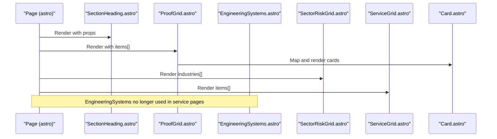
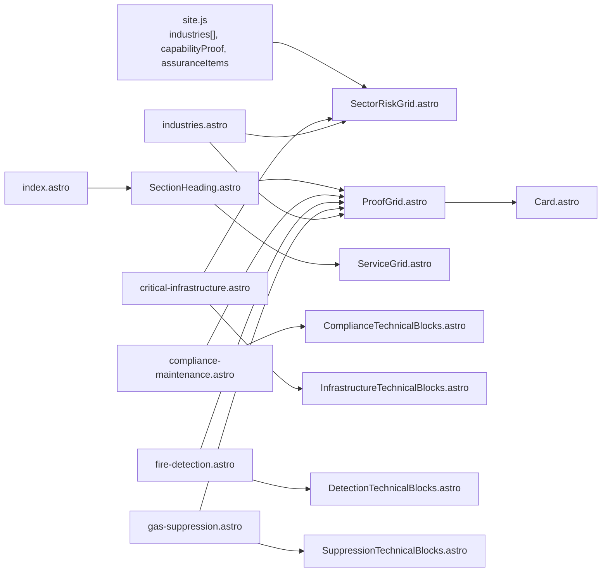

# Service Showcase Sections

<cite>
**Referenced Files in This Document**
- [EngineeringSystems.astro](file://src/components/sections/EngineeringSystems.astro)
- [ProofGrid.astro](file://src/components/sections/ProofGrid.astro)
- [SectorRiskGrid.astro](file://src/components/sections/SectorRiskGrid.astro)
- [ServiceGrid.astro](file://src/components/sections/ServiceGrid.astro)
- [Card.astro](file://src/components/ui/Card.astro)
- [SectionHeading.astro](file://src/components/sections/SectionHeading.astro)
- [site.js](file://src/data/site.js)
- [compliance-maintenance.astro](file://src/pages/compliance-maintenance.astro)
- [critical-infrastructure.astro](file://src/pages/critical-infrastructure.astro)
- [fire-detection.astro](file://src/pages/fire-detection.astro)
- [gas-suppression.astro](file://src/pages/gas-suppression.astro)
- [industries.astro](file://src/pages/industries.astro)
- [index.astro](file://src/pages/index.astro)
- [Header.astro](file://src/components/layout/Header.astro)
- [Footer.astro](file://src/components/layout/Footer.astro)
</cite>

## Update Summary
**Changes Made**
- Updated Project Structure section to reflect reduced EngineeringSystems component usage
- Modified Core Components section to clarify current usage patterns
- Updated Architecture Overview to show current component relationships
- Revised Content Integration section to reflect actual page compositions
- Updated Dependency Analysis to match current usage patterns

## Table of Contents
1. [Introduction](#introduction)
2. [Project Structure](#project-structure)
3. [Core Components](#core-components)
4. [Architecture Overview](#architecture-overview)
5. [Detailed Component Analysis](#detailed-component-analysis)
6. [Dependency Analysis](#dependency-analysis)
7. [Performance Considerations](#performance-considerations)
8. [Troubleshooting Guide](#troubleshooting-guide)
9. [Conclusion](#conclusion)
10. [Appendices](#appendices)

## Introduction
This document explains the service showcase components that present fire protection solutions across the website. It focuses on:
- EngineeringSystems: technical solution displays and system specifications
- ProofGrid: evidence-based service demonstrations and case studies
- SectorRiskGrid: risk assessment and industry-specific solutions
- ServiceGrid: service categorization and availability presentation

It also covers implementation patterns for dynamic content loading, interactive elements, responsive layouts, customization, content integration, and user engagement features.

## Project Structure
The showcase components are implemented as Astro components and are composed into solution and industry landing pages. Shared UI primitives (cards, headings) and site data (industries, proof signals) are reused across pages. **Updated**: The EngineeringSystems component is no longer used in the four major service pages, though it remains available in the components library.

```mermaid
graph TB
subgraph "Pages"
P1["compliance-maintenance.astro"]
P2["critical-infrastructure.astro"]
P3["fire-detection.astro"]
P4["gas-suppression.astro"]
P5["industries.astro"]
P6["index.astro"]
end
subgraph "Sections"
S1["EngineeringSystems.astro"]
S2["ProofGrid.astro"]
S3["SectorRiskGrid.astro"]
S4["ServiceGrid.astro"]
SH["SectionHeading.astro"]
END
subgraph "UI"
C1["Card.astro"]
end
subgraph "Data"
D1["site.js"]
end
P1 -.-> S1
P2 -.-> S1
P3 -.-> S1
P4 -.-> S1
P5 --> S3
P5 --> S2
P6 --> SH
S2 --> C1
S3 --> D1
S1 --> D1
S4 --> SH
SH --> D1
```

**Diagram sources**
- [compliance-maintenance.astro](file://src/pages/compliance-maintenance.astro)
- [critical-infrastructure.astro](file://src/pages/critical-infrastructure.astro)
- [fire-detection.astro](file://src/pages/fire-detection.astro)
- [gas-suppression.astro](file://src/pages/gas-suppression.astro)
- [industries.astro](file://src/pages/industries.astro)
- [index.astro](file://src/pages/index.astro)
- [EngineeringSystems.astro](file://src/components/sections/EngineeringSystems.astro)
- [ProofGrid.astro](file://src/components/sections/ProofGrid.astro)
- [SectorRiskGrid.astro](file://src/components/sections/SectorRiskGrid.astro)
- [ServiceGrid.astro](file://src/components/sections/ServiceGrid.astro)
- [SectionHeading.astro](file://src/components/sections/SectionHeading.astro)
- [Card.astro](file://src/components/ui/Card.astro)
- [site.js](file://src/data/site.js)

**Section sources**
- [compliance-maintenance.astro](file://src/pages/compliance-maintenance.astro)
- [critical-infrastructure.astro](file://src/pages/critical-infrastructure.astro)
- [fire-detection.astro](file://src/pages/fire-detection.astro)
- [gas-suppression.astro](file://src/pages/gas-suppression.astro)
- [industries.astro](file://src/pages/industries.astro)
- [index.astro](file://src/pages/index.astro)

## Core Components
- EngineeringSystems: Presents three engineering domains with explanatory copy and SVG process diagrams built from static arrays. **Updated**: No longer used in service pages, but remains available for potential future use.
- ProofGrid: Renders a grid of capability or evidence cards using a shared Card component and a SectionHeading for context.
- SectorRiskGrid: Displays industry categories and risk profiles sourced from site data.
- ServiceGrid: Shows service offerings as clickable cards with icons and summaries.

Implementation highlights:
- Dynamic content loading via props and mapped arrays
- Responsive grid layouts using Tailwind utilities
- Reusable UI primitives for headings and cards
- Content integration from centralized site data

**Section sources**
- [EngineeringSystems.astro](file://src/components/sections/EngineeringSystems.astro)
- [ProofGrid.astro](file://src/components/sections/ProofGrid.astro)
- [SectorRiskGrid.astro](file://src/components/sections/SectorRiskGrid.astro)
- [ServiceGrid.astro](file://src/components/sections/ServiceGrid.astro)
- [Card.astro](file://src/components/ui/Card.astro)
- [SectionHeading.astro](file://src/components/sections/SectionHeading.astro)
- [site.js](file://src/data/site.js)

## Architecture Overview
The showcase components are assembled into solution and industry pages. Pages pass props (eyebrow, title, text, items) to sections. Sections render reusable UI elements and map over data arrays. Site data supplies industry lists and capability statements. **Updated**: The EngineeringSystems component is no longer actively used in service pages, though it remains available in the component library.



**Diagram sources**
- [compliance-maintenance.astro](file://src/pages/compliance-maintenance.astro)
- [critical-infrastructure.astro](file://src/pages/critical-infrastructure.astro)
- [fire-detection.astro](file://src/pages/fire-detection.astro)
- [gas-suppression.astro](file://src/pages/gas-suppression.astro)
- [industries.astro](file://src/pages/industries.astro)
- [SectionHeading.astro](file://src/components/sections/SectionHeading.astro)
- [ProofGrid.astro](file://src/components/sections/ProofGrid.astro)
- [Card.astro](file://src/components/ui/Card.astro)
- [EngineeringSystems.astro](file://src/components/sections/EngineeringSystems.astro)
- [SectorRiskGrid.astro](file://src/components/sections/SectorRiskGrid.astro)
- [ServiceGrid.astro](file://src/components/sections/ServiceGrid.astro)

## Detailed Component Analysis

### EngineeringSystems Component
Purpose:
- Present three engineering domains with explanatory copy and SVG process diagrams.
- Emphasize system logic: detection confirmation, alarm state, release logic, protected-room integrity, and post-event service evidence.

Key patterns:
- Static array of system objects with fields for eyebrow/title/copy/nodes.
- Iterative rendering with per-system gradients and per-node positioning.
- SVG path and circles represent process steps; last node styled as critical.

Responsive layout:
- Three-column grid on large screens, stacked on smaller screens.

Accessibility:
- SVG includes an aria-label describing the diagram.

Customization:
- Modify the static systems array to add or change domains.
- Adjust colors and typography via Tailwind classes.

**Updated**: Component is no longer imported or used in service pages, but remains available in the components library.

**Section sources**
- [EngineeringSystems.astro](file://src/components/sections/EngineeringSystems.astro)

### ProofGrid Component
Purpose:
- Display a grid of capability or evidence cards with optional dark theme.
- Compose with SectionHeading for context and Card for individual entries.

Key patterns:
- Accepts props: eyebrow, title, text, items[], dark flag.
- Maps over items[] to render Card components.
- Uses SectionHeading for consistent typography and alignment.

Responsive layout:
- Grid with configurable columns.

Customization:
- Pass items[] with title/text/status/href to render different content blocks.
- Toggle dark mode via the dark prop.

Integration:
- Used across solution pages to show proof points and assurance signals.

**Section sources**
- [ProofGrid.astro](file://src/components/sections/ProofGrid.astro)
- [SectionHeading.astro](file://src/components/sections/SectionHeading.astro)
- [Card.astro](file://src/components/ui/Card.astro)

### SectorRiskGrid Component
Purpose:
- Present industry categories and risk profiles for commercial and industrial environments.

Key patterns:
- Imports industries[] from site data.
- Renders cards with priority, title, and risk description.

Responsive layout:
- Multi-column grid scaling from two to four columns.

Customization:
- Extend industries[] in site data to add new sectors or adjust descriptions.

**Section sources**
- [SectorRiskGrid.astro](file://src/components/sections/SectorRiskGrid.astro)
- [site.js](file://src/data/site.js)

### ServiceGrid Component
Purpose:
- Show service offerings as clickable cards with icons and summaries.

Key patterns:
- Accepts props: eyebrow, title, text, items[].
- Each item renders a linkable card with an index icon, title, text, and a "Learn more" CTA.

Responsive layout:
- Four-column grid on large screens, two-column on medium, single column on small.

Customization:
- Add or modify items[] to reflect current service categories and links.

**Section sources**
- [ServiceGrid.astro](file://src/components/sections/ServiceGrid.astro)
- [SectionHeading.astro](file://src/components/sections/SectionHeading.astro)

### Supporting UI Primitives
- Card.astro: Reusable card container with optional status label, title, text, and link. Supports dark/light themes.
- SectionHeading.astro: Consistent heading block with eyebrow, title, text, alignment, and dark mode.

Usage:
- Cards are used inside ProofGrid to render capability evidence.
- SectionHeading is used across pages to introduce content blocks.

**Section sources**
- [Card.astro](file://src/components/ui/Card.astro)
- [SectionHeading.astro](file://src/components/sections/SectionHeading.astro)

### Content Integration and Page Composition
- Pages import and compose sections to build solution and industry showcases.
- Props are passed from pages to sections to customize content per solution or sector.
- Centralized site data supplies shared content like industries and capability statements.

**Updated**: Current usage patterns show:
- compliance-maintenance.astro: Uses ProofGrid and ComplianceTechnicalBlocks, no EngineeringSystems
- critical-infrastructure.astro: Uses SectorRiskGrid and InfrastructureTechnicalBlocks, no EngineeringSystems  
- fire-detection.astro: Uses DetectionTechnicalBlocks and ProofGrid, no EngineeringSystems
- gas-suppression.astro: Uses SuppressionTechnicalBlocks and ProofGrid, no EngineeringSystems
- industries.astro: Uses SectorRiskGrid and ProofGrid with dark theme
- index.astro: Uses CinematicHero, ComplianceStrip, RouteMatrix, and AuthorityEvidence

**Section sources**
- [compliance-maintenance.astro](file://src/pages/compliance-maintenance.astro)
- [critical-infrastructure.astro](file://src/pages/critical-infrastructure.astro)
- [fire-detection.astro](file://src/pages/fire-detection.astro)
- [gas-suppression.astro](file://src/pages/gas-suppression.astro)
- [industries.astro](file://src/pages/industries.astro)
- [index.astro](file://src/pages/index.astro)
- [site.js](file://src/data/site.js)

## Dependency Analysis
Component relationships and data dependencies: **Updated to reflect current usage patterns**



**Diagram sources**
- [site.js](file://src/data/site.js)
- [ProofGrid.astro](file://src/components/sections/ProofGrid.astro)
- [SectorRiskGrid.astro](file://src/components/sections/SectorRiskGrid.astro)
- [ServiceGrid.astro](file://src/components/sections/ServiceGrid.astro)
- [SectionHeading.astro](file://src/components/sections/SectionHeading.astro)
- [Card.astro](file://src/components/ui/Card.astro)
- [compliance-maintenance.astro](file://src/pages/compliance-maintenance.astro)
- [critical-infrastructure.astro](file://src/pages/critical-infrastructure.astro)
- [fire-detection.astro](file://src/pages/fire-detection.astro)
- [gas-suppression.astro](file://src/pages/gas-suppression.astro)
- [industries.astro](file://src/pages/industries.astro)
- [index.astro](file://src/pages/index.astro)

**Section sources**
- [site.js](file://src/data/site.js)
- [compliance-maintenance.astro](file://src/pages/compliance-maintenance.astro)
- [critical-infrastructure.astro](file://src/pages/critical-infrastructure.astro)
- [fire-detection.astro](file://src/pages/fire-detection.astro)
- [gas-suppression.astro](file://src/pages/gas-suppression.astro)
- [industries.astro](file://src/pages/industries.astro)
- [index.astro](file://src/pages/index.astro)

## Performance Considerations
- Static data-driven rendering: Components rely on props and arrays, avoiding heavy client-side computation.
- Minimal interactivity: Components are primarily declarative; any interactive elements (e.g., cards) use lightweight hover effects.
- Responsive grids: Tailwind utilities provide efficient layout without JavaScript.
- SVG diagrams: Keep inline SVGs minimal to avoid layout thrashing; consider lazy-loading offscreen diagrams if content grows.

## Troubleshooting Guide
Common issues and resolutions:
- Empty or missing items in ProofGrid:
  - Verify the items[] prop is passed from the page and populated with objects containing title/text/status/href.
  - Confirm Card.astro receives required props and that dark mode is set appropriately.
- Industry cards not rendering:
  - Ensure industries[] exists in site.js and is imported by SectorRiskGrid.astro.
  - Check grid classes and container widths for responsive breakpoints.
- SVG diagram misalignment:
  - Confirm node count matches the number of nodes in the systems array.
  - Validate gradient IDs and per-system indices to avoid conflicts.
- Link and CTA behavior:
  - ServiceGrid cards use anchor tags; ensure href values are correct and accessible.
  - For interactive menus, confirm related scripts in Header.astro are functioning.

**Section sources**
- [ProofGrid.astro](file://src/components/sections/ProofGrid.astro)
- [Card.astro](file://src/components/ui/Card.astro)
- [SectorRiskGrid.astro](file://src/components/sections/SectorRiskGrid.astro)
- [EngineeringSystems.astro](file://src/components/sections/EngineeringSystems.astro)
- [ServiceGrid.astro](file://src/components/sections/ServiceGrid.astro)
- [Header.astro](file://src/components/layout/Header.astro)

## Conclusion
The service showcase components provide a consistent, data-driven approach to presenting fire protection solutions. They combine reusable UI primitives with solution-specific content to deliver clear, engaging, and responsive experiences across pages. **Updated**: While the EngineeringSystems component remains available in the component library, it is no longer actively used in the major service pages, reflecting a streamlined approach to content presentation. Extending content involves updating props and site data, ensuring scalability and maintainability.

## Appendices

### Implementation Patterns and Examples
- Dynamic content loading:
  - Props-driven composition: Eyebrow, title, text, items[] are passed from pages to sections.
  - Array mapping: Systems, industries, and service items are rendered via .map().
- Interactive elements:
  - Hover states on cards and service grid items provide subtle feedback.
  - Header navigation uses native details/summary for dropdowns and mobile menu toggles.
- Responsive layouts:
  - Tailwind grid utilities scale from single to multi-column layouts.
  - Section containers constrain widths and paddings for readability.
- Content integration:
  - Centralized site data powers industry matrices and capability statements.
  - Pages assemble sections to tailor content per solution or sector.

**Section sources**
- [compliance-maintenance.astro](file://src/pages/compliance-maintenance.astro)
- [critical-infrastructure.astro](file://src/pages/critical-infrastructure.astro)
- [fire-detection.astro](file://src/pages/fire-detection.astro)
- [gas-suppression.astro](file://src/pages/gas-suppression.astro)
- [industries.astro](file://src/pages/industries.astro)
- [site.js](file://src/data/site.js)
- [Header.astro](file://src/components/layout/Header.astro)
- [Footer.astro](file://src/components/layout/Footer.astro)