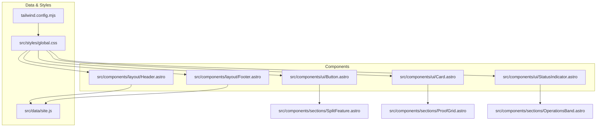
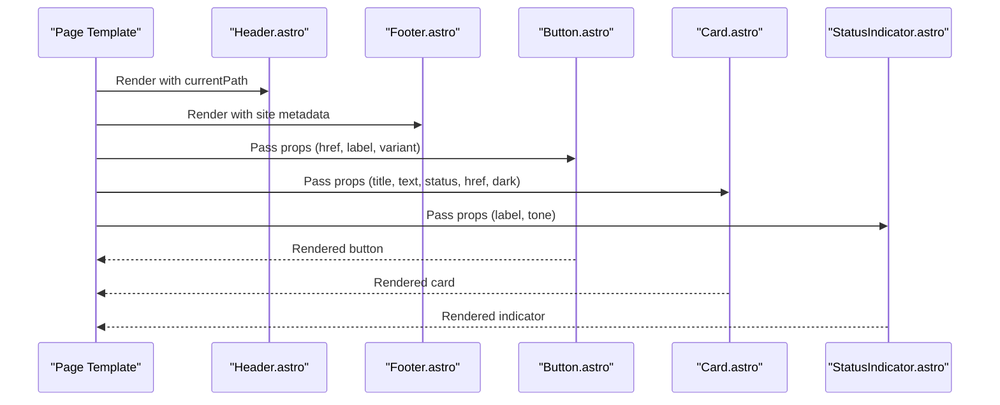
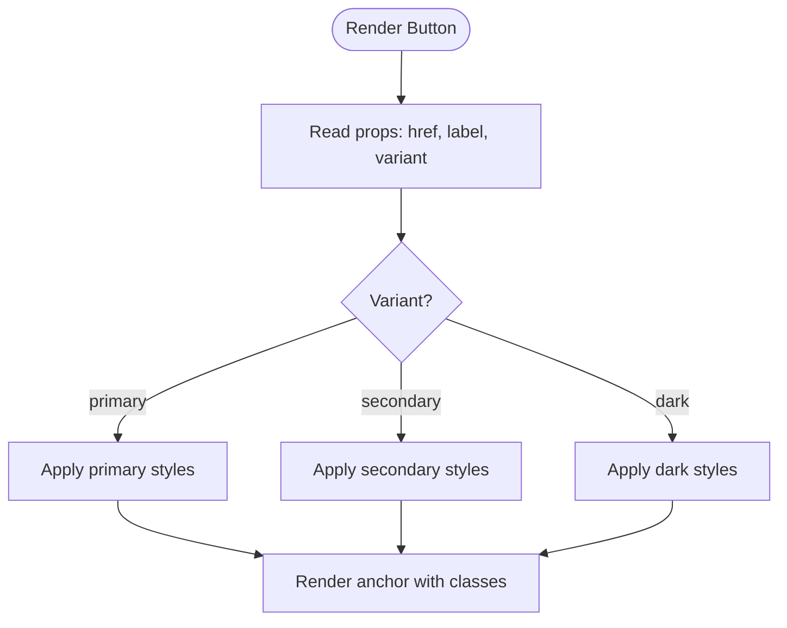
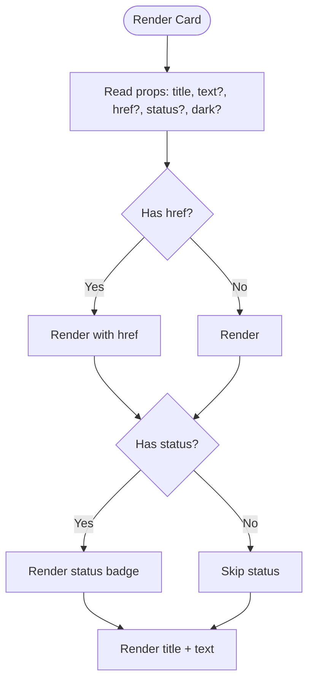
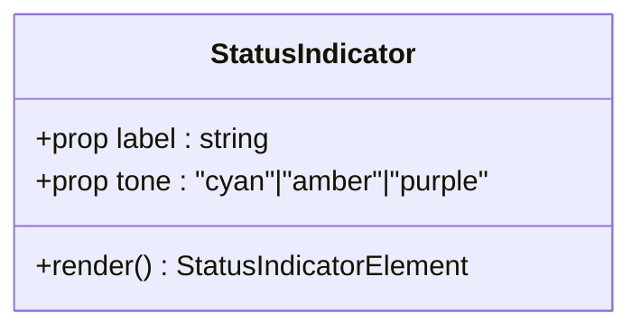
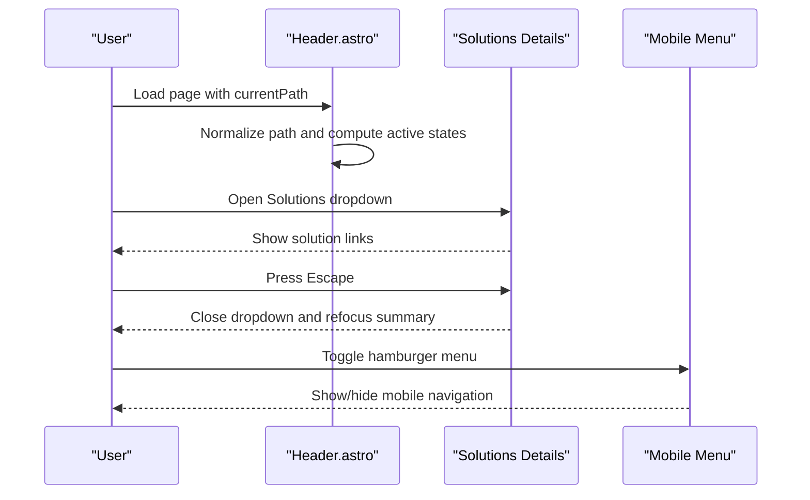
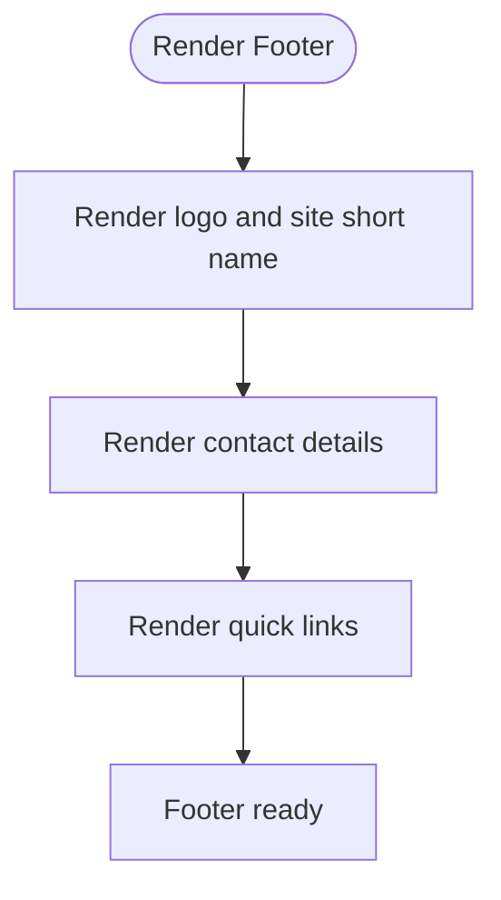
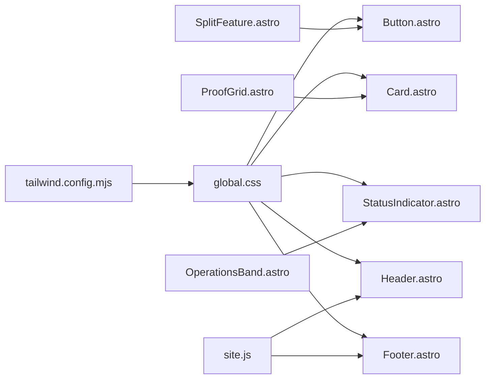

# UI Components & Elements

<cite>
**Referenced Files in This Document**
- [Button.astro](file://src/components/ui/Button.astro)
- [Card.astro](file://src/components/ui/Card.astro)
- [StatusIndicator.astro](file://src/components/ui/StatusIndicator.astro)
- [Header.astro](file://src/components/layout/Header.astro)
- [Footer.astro](file://src/components/layout/Footer.astro)
- [site.js](file://src/data/site.js)
- [global.css](file://src/styles/global.css)
- [tailwind.config.mjs](file://tailwind.config.mjs)
- [SplitFeature.astro](file://src/components/sections/SplitFeature.astro)
- [ProofGrid.astro](file://src/components/sections/ProofGrid.astro)
- [OperationsBand.astro](file://src/components/sections/OperationsBand.astro)
</cite>

## Table of Contents
1. [Introduction](#introduction)
2. [Project Structure](#project-structure)
3. [Core Components](#core-components)
4. [Architecture Overview](#architecture-overview)
5. [Detailed Component Analysis](#detailed-component-analysis)
6. [Dependency Analysis](#dependency-analysis)
7. [Performance Considerations](#performance-considerations)
8. [Troubleshooting Guide](#troubleshooting-guide)
9. [Conclusion](#conclusion)
10. [Appendices](#appendices)

## Introduction
This document describes the reusable UI components and layout elements used across the website. It focuses on:
- Button component: variants, states, accessibility, and styling
- Card component: content grouping, hover effects, and responsive behavior
- StatusIndicator component: system status visualization and real-time updates
- Header component: navigation structure, branding, and mobile responsiveness
- Footer component: site map, legal information, and contact details

It also provides usage examples, customization patterns, and integration guidelines to ensure consistent design implementation.

## Project Structure
The UI components live under src/components/ui and layout components under src/components/layout. Global design tokens and transitions are defined in src/styles/global.css. Navigation metadata is centralized in src/data/site.js. Tailwind’s content scanning is configured to include Astro and HTML sources.

**Diagram sources**
- [Button.astro](file://src/components/ui/Button.astro)
- [Card.astro](file://src/components/ui/Card.astro)
- [StatusIndicator.astro](file://src/components/ui/StatusIndicator.astro)
- [Header.astro](file://src/components/layout/Header.astro)
- [Footer.astro](file://src/components/layout/Footer.astro)
- [site.js](file://src/data/site.js)
- [global.css](file://src/styles/global.css)
- [tailwind.config.mjs](file://tailwind.config.mjs)
- [SplitFeature.astro](file://src/components/sections/SplitFeature.astro)
- [ProofGrid.astro](file://src/components/sections/ProofGrid.astro)
- [OperationsBand.astro](file://src/components/sections/OperationsBand.astro)

**Section sources**
- [global.css:1-483](file://src/styles/global.css#L1-L483)
- [tailwind.config.mjs:1-4](file://tailwind.config.mjs#L1-L4)
- [site.js:1-303](file://src/data/site.js#L1-L303)

## Core Components
This section documents the five reusable components and their capabilities.

- Button
  - Purpose: Primary call-to-action with link semantics
  - Variants: primary, secondary, dark
  - Accessibility: Uses anchor element with semantic href
  - Styling: Tailwind utility classes with brand color tokens
  - Props: href, label, variant
  - Example usage: [SplitFeature.astro](file://src/components/sections/SplitFeature.astro#L52)

- Card
  - Purpose: Group content with optional status badge and dark mode
  - Features: hover border transitions, status label, optional text, dark/light variants
  - Responsive: Padding and typography scale across breakpoints
  - Props: title, text, href, status, dark
  - Example usage: [ProofGrid.astro](file://src/components/sections/ProofGrid.astro#L20)

- StatusIndicator
  - Purpose: Visual status label with colored dot
  - Tones: cyan, amber, purple
  - Accessibility: Uses aria-hidden for decorative dot; label is meaningful text
  - Props: label, tone
  - Example usage: [OperationsBand.astro](file://src/components/sections/OperationsBand.astro#L27)

- Header
  - Purpose: Fixed navigation bar with branding, primary links, solutions dropdown, portal login, and mobile menu
  - Accessibility: Skip link, ARIA labels, keyboard handling for dropdown, focus-visible styles
  - Responsive: Desktop horizontal nav plus mobile hamburger menu
  - Props: currentPath
  - Data: Links and site metadata from [site.js:75-115](file://src/data/site.js#L75-L115)

- Footer
  - Purpose: Branding, contact info, and quick links
  - Content: Logo, description, contact details, and sitemap links
  - Props: None (uses shared site metadata)

**Section sources**
- [Button.astro:1-21](file://src/components/ui/Button.astro#L1-L21)
- [Card.astro:1-33](file://src/components/ui/Card.astro#L1-L33)
- [StatusIndicator.astro:1-15](file://src/components/ui/StatusIndicator.astro#L1-L15)
- [Header.astro:1-171](file://src/components/layout/Header.astro#L1-L171)
- [Footer.astro:1-38](file://src/components/layout/Footer.astro#L1-L38)
- [site.js:5-20](file://src/data/site.js#L5-L20)
- [site.js:75-115](file://src/data/site.js#L75-L115)

## Architecture Overview
The components integrate with shared data and styles to form cohesive pages. The header and footer consume site metadata for branding and navigation. UI components are composed by section components to assemble page layouts.

**Diagram sources**
- [Header.astro:1-171](file://src/components/layout/Header.astro#L1-L171)
- [Footer.astro:1-38](file://src/components/layout/Footer.astro#L1-L38)
- [Button.astro:1-21](file://src/components/ui/Button.astro#L1-L21)
- [Card.astro:1-33](file://src/components/ui/Card.astro#L1-L33)
- [StatusIndicator.astro:1-15](file://src/components/ui/StatusIndicator.astro#L1-L15)

## Detailed Component Analysis

### Button Component
- Props
  - href: Link destination (defaults to a contact intent)
  - label: Visible text
  - variant: primary | secondary | dark
- Styling
  - Rounded, padding, font classes
  - Variant-specific background/text and hover colors
- Accessibility
  - Anchor element ensures native keyboard and screen reader support
- Usage pattern
  - Imported and rendered inside sections like SplitFeature

**Diagram sources**
- [Button.astro:1-21](file://src/components/ui/Button.astro#L1-L21)

**Section sources**
- [Button.astro:1-21](file://src/components/ui/Button.astro#L1-L21)
- [SplitFeature.astro](file://src/components/sections/SplitFeature.astro#L52)

### Card Component
- Props
  - title: Heading text
  - text: Optional paragraph text
  - href: Optional link to make the card clickable
  - status: Optional badge text
  - dark: Boolean to toggle dark theme
- Behavior
  - If href is present, renders an anchor; otherwise a div
  - Hover effect via group-hover on border color
  - Status badge uses brand accent depending on theme
- Accessibility
  - Semantic heading and paragraph for content
  - Clickable cards should include focus styles via parent container
- Usage pattern
  - Iterated in ProofGrid to render multiple cards

**Diagram sources**
- [Card.astro:1-33](file://src/components/ui/Card.astro#L1-L33)

**Section sources**
- [Card.astro:1-33](file://src/components/ui/Card.astro#L1-L33)
- [ProofGrid.astro](file://src/components/sections/ProofGrid.astro#L20)

### StatusIndicator Component
- Props
  - label: Text label
  - tone: cyan | amber | purple (default: cyan)
- Visual
  - Small colored dot and uppercase label
- Accessibility
  - Dot marked aria-hidden; label is meaningful text
- Usage pattern
  - Used in OperationsBand to show capability rows

**Diagram sources**
- [StatusIndicator.astro:1-15](file://src/components/ui/StatusIndicator.astro#L1-L15)

**Section sources**
- [StatusIndicator.astro:1-15](file://src/components/ui/StatusIndicator.astro#L1-L15)
- [OperationsBand.astro](file://src/components/sections/OperationsBand.astro#L27)

### Header Component
- Navigation
  - Desktop: Home, Solutions dropdown, and main links
  - Mobile: Collapsible hamburger menu with grouped primary and solutions links
- Active states
  - Computes active link based on normalized currentPath
  - Solutions dropdown active when any solution link is active
- Accessibility
  - Skip link to main content
  - ARIA labels and roles for menus and dropdowns
  - Keyboard handling for dropdown close (Escape) and outside clicks
  - Focus-visible outline for interactive elements
- Branding
  - Logo and site short name from site metadata
- Data source
  - Links and site metadata imported from site.js

**Diagram sources**
- [Header.astro:1-171](file://src/components/layout/Header.astro#L1-L171)
- [site.js:75-115](file://src/data/site.js#L75-L115)

**Section sources**
- [Header.astro:1-171](file://src/components/layout/Header.astro#L1-L171)
- [site.js:5-20](file://src/data/site.js#L5-L20)
- [site.js:75-115](file://src/data/site.js#L75-L115)

### Footer Component
- Content
  - Brand logo and short name
  - Contact details: phone, email, address, registration
  - Quick links: Home, About, Solutions, Assessment Intake, Portal Login
- Responsiveness
  - Two-column layout on larger screens; stacked on smaller screens
- Data source
  - Uses site metadata for branding and contact info

**Diagram sources**
- [Footer.astro:1-38](file://src/components/layout/Footer.astro#L1-L38)
- [site.js:5-20](file://src/data/site.js#L5-L20)

**Section sources**
- [Footer.astro:1-38](file://src/components/layout/Footer.astro#L1-L38)
- [site.js:5-20](file://src/data/site.js#L5-L20)

## Dependency Analysis
- Shared tokens and transitions
  - Design tokens (brand colors) and transitions are defined globally and consumed by all components
- Tailwind scanning
  - Tailwind is configured to scan Astro and HTML sources for class usage
- Component composition
  - Section components import and compose UI components with specific props

**Diagram sources**
- [global.css:1-483](file://src/styles/global.css#L1-L483)
- [tailwind.config.mjs:1-4](file://tailwind.config.mjs#L1-L4)
- [site.js:5-20](file://src/data/site.js#L5-L20)
- [Button.astro:1-21](file://src/components/ui/Button.astro#L1-L21)
- [Card.astro:1-33](file://src/components/ui/Card.astro#L1-L33)
- [StatusIndicator.astro:1-15](file://src/components/ui/StatusIndicator.astro#L1-L15)
- [Header.astro:1-171](file://src/components/layout/Header.astro#L1-L171)
- [Footer.astro:1-38](file://src/components/layout/Footer.astro#L1-L38)
- [SplitFeature.astro](file://src/components/sections/SplitFeature.astro#L52)
- [ProofGrid.astro](file://src/components/sections/ProofGrid.astro#L20)
- [OperationsBand.astro](file://src/components/sections/OperationsBand.astro#L27)

**Section sources**
- [global.css:1-483](file://src/styles/global.css#L1-L483)
- [tailwind.config.mjs:1-4](file://tailwind.config.mjs#L1-L4)
- [site.js:5-20](file://src/data/site.js#L5-L20)

## Performance Considerations
- Prefer variant and theme props over ad-hoc inline styles to leverage Tailwind’s purging and caching
- Keep hover and transition durations minimal to avoid layout thrashing
- Use semantic anchors for buttons that navigate to avoid unnecessary JavaScript overhead
- Consolidate repeated color tokens via CSS variables to reduce class bloat

## Troubleshooting Guide
- Active link highlighting not working
  - Ensure currentPath is passed to Header and normalized correctly
  - Verify that href values match the normalized path
  - Check that isLinkActive logic aligns with route structure
- Solutions dropdown does not close
  - Confirm event listeners for Escape and outside clicks are attached
  - Ensure the details element exists in the DOM before binding events
- Mobile menu not toggling
  - Verify the mobile menu details element and click handlers are present
- StatusIndicator tone not applied
  - Confirm tone prop matches one of the supported values
- Button variant styles not appearing
  - Ensure variant prop matches one of the defined keys and Tailwind classes are generated

**Section sources**
- [Header.astro:146-171](file://src/components/layout/Header.astro#L146-L171)
- [StatusIndicator.astro:1-15](file://src/components/ui/StatusIndicator.astro#L1-L15)
- [Button.astro:1-21](file://src/components/ui/Button.astro#L1-L21)

## Conclusion
These UI components and layout elements provide a consistent, accessible, and responsive foundation for the website. By adhering to the documented props, variants, and accessibility patterns, teams can maintain visual and behavioral coherence across pages while enabling easy customization through shared design tokens and Tailwind utilities.

## Appendices

### Usage Examples and Integration Guidelines
- Button
  - Place Button inside sections to drive calls-to-action
  - Choose variant based on context: primary for main actions, secondary for secondary actions, dark for dark backgrounds
  - Reference: [SplitFeature.astro](file://src/components/sections/SplitFeature.astro#L52)

- Card
  - Use Card to present feature sets, benefits, or content blocks
  - Provide status badges for priority or state
  - Reference: [ProofGrid.astro](file://src/components/sections/ProofGrid.astro#L20)

- StatusIndicator
  - Use for capability rows, status dashboards, or small status labels
  - Choose tone to reflect urgency or category
  - Reference: [OperationsBand.astro](file://src/components/sections/OperationsBand.astro#L27)

- Header
  - Include Header at the top of all pages and pass currentPath
  - Keep mainLinks and solutionLinks synchronized with site.js
  - Reference: [Header.astro:1-171](file://src/components/layout/Header.astro#L1-L171), [site.js:75-115](file://src/data/site.js#L75-L115)

- Footer
  - Include Footer at the bottom of all pages
  - Keep contact details and quick links aligned with site metadata
  - Reference: [Footer.astro:1-38](file://src/components/layout/Footer.astro#L1-L38), [site.js:5-20](file://src/data/site.js#L5-L20)