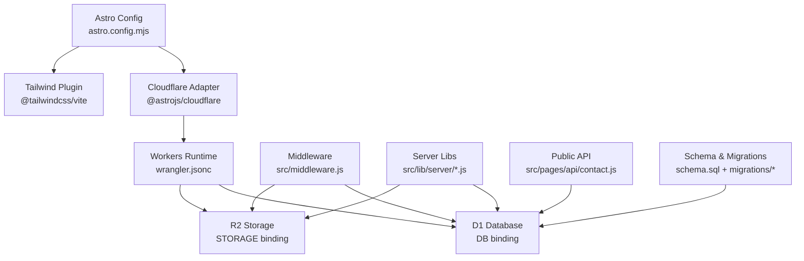
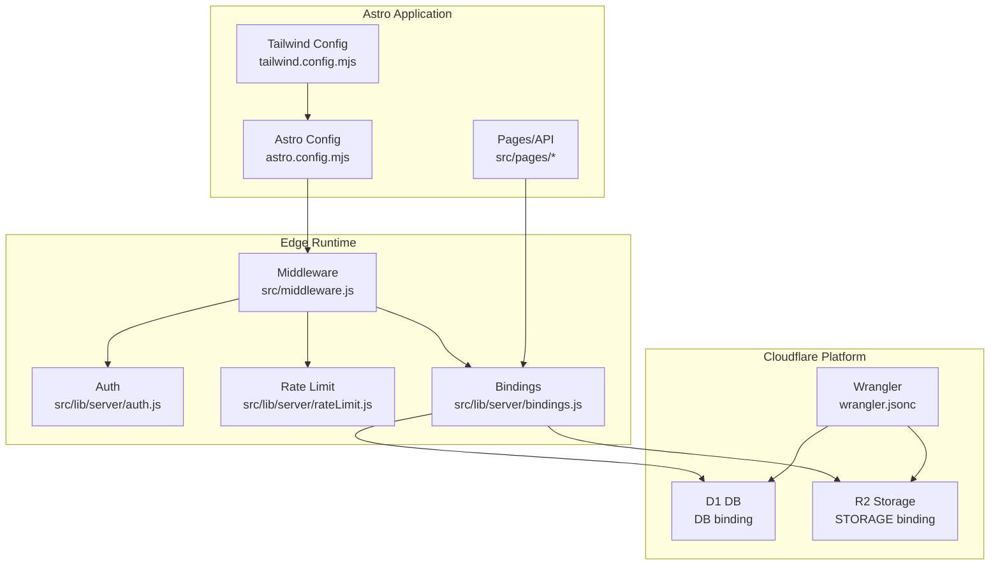
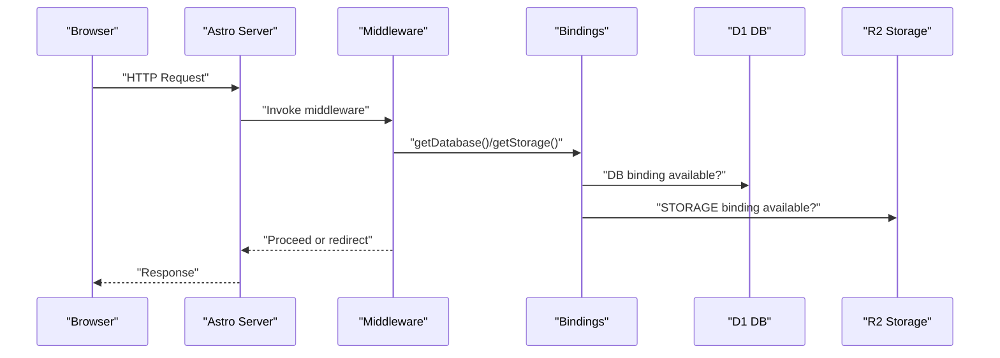
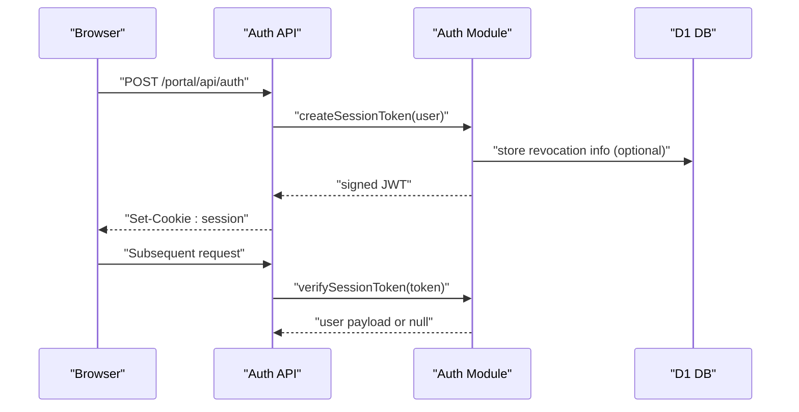
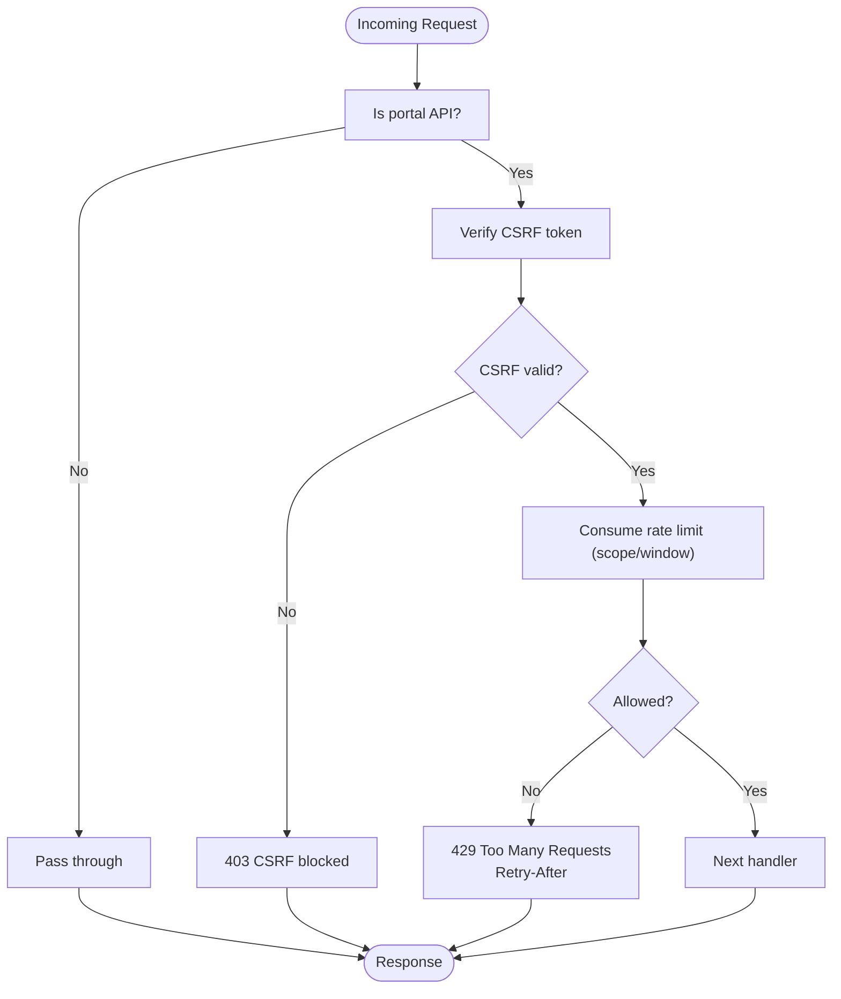
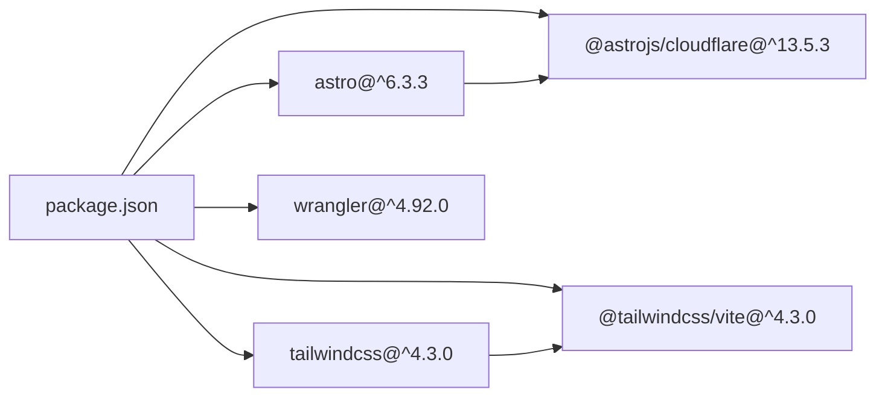

# Technology Stack & Dependencies

<cite>
**Referenced Files in This Document**
- [package.json](file://package.json)
- [astro.config.mjs](file://astro.config.mjs)
- [wrangler.jsonc](file://wrangler.jsonc)
- [tailwind.config.mjs](file://tailwind.config.mjs)
- [schema.sql](file://schema.sql)
- [src/middleware.js](file://src/middleware.js)
- [src/lib/server/bindings.js](file://src/lib/server/bindings.js)
- [src/pages/api/contact.js](file://src/pages/api/contact.js)
- [src/lib/server/auth.js](file://src/lib/server/auth.js)
- [src/lib/server/rateLimit.js](file://src/lib/server/rateLimit.js)
- [src/pages/robots.txt.js](file://src/pages/robots.txt.js)
- [src/pages/sitemap.xml.js](file://src/pages/sitemap.xml.js)
</cite>

## Table of Contents
1. [Introduction](#introduction)
2. [Project Structure](#project-structure)
3. [Core Components](#core-components)
4. [Architecture Overview](#architecture-overview)
5. [Detailed Component Analysis](#detailed-component-analysis)
6. [Dependency Analysis](#dependency-analysis)
7. [Performance Considerations](#performance-considerations)
8. [Troubleshooting Guide](#troubleshooting-guide)
9. [Conclusion](#conclusion)
10. [Appendices](#appendices)

## Introduction
This document describes the technology stack and dependencies powering the Kharon website. It covers the Astro framework with the Cloudflare SSR adapter, static site generation capabilities, serverless deployment, Cloudflare Workers runtime, D1 SQLite-compatible database, and R2 object storage. It also documents TailwindCSS 4.3.0 integration, middleware-driven security controls, rate limiting, and operational scripts for Cloudflare Pages deployment. Guidance on serverless microservice patterns, edge computing benefits, cost optimization, and version compatibility is included.

## Project Structure
The project is organized around Astro’s conventional structure with server-side logic integrated via Cloudflare Workers bindings and middleware. Key areas:
- Configuration: Astro, TailwindCSS, and Wrangler
- Runtime: Middleware and server-side libraries for auth, rate limiting, CSRF, and bindings
- API surfaces: Public contact endpoint and portal APIs
- Data: SQL schema and migration set for D1
- Assets: Static content and generated sitemaps/robots

**Diagram sources**
- [astro.config.mjs:1-21](file://astro.config.mjs#L1-L21)
- [wrangler.jsonc:1-38](file://wrangler.jsonc#L1-L38)
- [src/middleware.js:1-214](file://src/middleware.js#L1-L214)
- [src/lib/server/bindings.js:1-42](file://src/lib/server/bindings.js#L1-L42)
- [src/pages/api/contact.js:1-116](file://src/pages/api/contact.js#L1-L116)
- [schema.sql:1-245](file://schema.sql#L1-L245)

**Section sources**
- [astro.config.mjs:1-21](file://astro.config.mjs#L1-L21)
- [wrangler.jsonc:1-38](file://wrangler.jsonc#L1-L38)
- [tailwind.config.mjs:1-4](file://tailwind.config.mjs#L1-L4)

## Core Components
- Astro 6.3.3 with server output and Cloudflare SSR adapter
- TailwindCSS 4.3.0 with Vite plugin for utility-first styling
- Cloudflare Workers runtime via Wrangler configuration
- D1 database binding for structured data
- R2 bucket binding for file/object storage
- Middleware enforcing security headers, CSRF, rate limits, and session checks
- Server-side libraries for authentication, rate limiting, and bindings
- Public API endpoint for contact submissions with rate limiting and D1 persistence

**Section sources**
- [package.json:33-41](file://package.json#L33-L41)
- [astro.config.mjs:7-20](file://astro.config.mjs#L7-L20)
- [wrangler.jsonc:19-36](file://wrangler.jsonc#L19-L36)
- [src/middleware.js:19-31](file://src/middleware.js#L19-L31)
- [src/lib/server/bindings.js:1-42](file://src/lib/server/bindings.js#L1-L42)
- [src/pages/api/contact.js:40-115](file://src/pages/api/contact.js#L40-L115)

## Architecture Overview
The system uses Astro’s server output mode with the Cloudflare adapter to deploy server-rendered pages and API routes to Cloudflare’s edge network. Middleware enforces authentication, CSRF protection, and rate limiting. D1 stores relational data and R2 stores files. Public endpoints and portal APIs persist data via D1 prepared statements and bindings.

**Diagram sources**
- [astro.config.mjs:1-21](file://astro.config.mjs#L1-L21)
- [tailwind.config.mjs:1-4](file://tailwind.config.mjs#L1-L4)
- [src/middleware.js:1-214](file://src/middleware.js#L1-L214)
- [src/lib/server/auth.js:1-217](file://src/lib/server/auth.js#L1-L217)
- [src/lib/server/rateLimit.js:1-56](file://src/lib/server/rateLimit.js#L1-L56)
- [src/lib/server/bindings.js:1-42](file://src/lib/server/bindings.js#L1-L42)
- [wrangler.jsonc:1-38](file://wrangler.jsonc#L1-L38)

## Detailed Component Analysis

### Astro Configuration and Build Pipeline
- Output mode is server with the Cloudflare adapter configured to load Wrangler settings and persist state.
- TailwindCSS is integrated via the Vite plugin.
- Chunk size warnings are tuned to balance bundle size and performance.

**Section sources**
- [astro.config.mjs:7-20](file://astro.config.mjs#L7-L20)
- [package.json:33-37](file://package.json#L33-L37)

### TailwindCSS Integration
- Tailwind’s content scanning targets Astro and common template files.
- Version 4.3.0 is used alongside the Vite plugin for build-time optimization.

**Section sources**
- [tailwind.config.mjs:1-4](file://tailwind.config.mjs#L1-L4)
- [package.json:35-36](file://package.json#L35-L36)

### Cloudflare Workers and Bindings
- Wrangler defines the Worker name, compatibility date, routes, D1 database binding, R2 bucket binding, and environment variables.
- The bindings module exposes typed accessors for DB and STORAGE, throwing if missing.

**Diagram sources**
- [src/middleware.js:110-144](file://src/middleware.js#L110-L144)
- [src/lib/server/bindings.js:1-42](file://src/lib/server/bindings.js#L1-L42)
- [wrangler.jsonc:19-36](file://wrangler.jsonc#L19-L36)

**Section sources**
- [wrangler.jsonc:1-38](file://wrangler.jsonc#L1-L38)
- [src/lib/server/bindings.js:1-42](file://src/lib/server/bindings.js#L1-L42)

### Authentication and Session Management
- Session tokens are signed with HMAC using a server secret and validated on subsequent requests.
- Revocation is handled via a fingerprint table in D1.
- Cookies enforce secure attributes and strict SameSite policies.

**Diagram sources**
- [src/lib/server/auth.js:48-108](file://src/lib/server/auth.js#L48-L108)
- [src/lib/server/auth.js:125-157](file://src/lib/server/auth.js#L125-L157)

**Section sources**
- [src/lib/server/auth.js:1-217](file://src/lib/server/auth.js#L1-L217)

### Rate Limiting and CSRF Protection
- Middleware enforces CSRF tokens and validates them on state-changing portal API requests.
- A per-window counter in D1 tracks attempts and returns retry-after headers when exceeded.
- Public endpoints (e.g., contact) apply separate rate limits keyed by IP hash.

**Diagram sources**
- [src/middleware.js:154-184](file://src/middleware.js#L154-L184)
- [src/lib/server/rateLimit.js:3-46](file://src/lib/server/rateLimit.js#L3-L46)

**Section sources**
- [src/middleware.js:19-31](file://src/middleware.js#L19-L31)
- [src/middleware.js:88-108](file://src/middleware.js#L88-L108)
- [src/lib/server/rateLimit.js:1-56](file://src/lib/server/rateLimit.js#L1-L56)

### Public Contact Endpoint
- Validates request body, cleans inputs, computes an IP hash, and inserts into D1.
- Applies rate limiting scoped to the public contact form.

**Section sources**
- [src/pages/api/contact.js:40-115](file://src/pages/api/contact.js#L40-L115)

### Sitemap and Robots
- Sitemap and robots endpoints are generated server-side and served as static-like responses.

**Section sources**
- [src/pages/sitemap.xml.js:1-26](file://src/pages/sitemap.xml.js#L1-L26)
- [src/pages/robots.txt.js:1-13](file://src/pages/robots.txt.js#L1-L13)

### Data Model and Migrations
- The schema defines core entities (users, sites, systems, jobs, financial records, maintenance requests, audit logs, rate limits, password reset tokens, revoked sessions, contact submissions) with constraints and indexes.
- Migrations evolve the schema over time and are bound to D1.

**Section sources**
- [schema.sql:1-245](file://schema.sql#L1-L245)
- [wrangler.jsonc:24-25](file://wrangler.jsonc#L24-L25)

## Dependency Analysis
- Astro 6.3.3 powers the application with server output and SSR via Cloudflare adapter.
- TailwindCSS 4.3.0 integrates via Vite plugin for build-time optimization.
- Wrangler 4.x manages local development and Cloudflare Pages deployments.
- The project enforces Node and npm engine requirements for compatibility.

**Diagram sources**
- [package.json:33-41](file://package.json#L33-L41)

**Section sources**
- [package.json:1-46](file://package.json#L1-L46)

## Performance Considerations
- Server output mode with the Cloudflare adapter leverages edge compute for SSR, reducing cold starts and improving latency.
- TailwindCSS build-time optimization reduces CSS payload sizes.
- D1 indexing and prepared statements improve query performance; keep indexes aligned with query patterns.
- R2 uploads/downloads benefit from edge caching and reduced origin bandwidth.
- Monitor chunk sizes and adjust Vite build limits to balance performance and memory usage.

## Troubleshooting Guide
Common issues and resolutions:
- Missing D1 or R2 bindings: Ensure Wrangler routes and bindings match environment configuration.
- Session cookie errors: Verify session secret configuration and cookie attributes.
- CSRF failures: Confirm CSRF cookie presence and token validation on state-changing requests.
- Rate limit exceeded: Review retry-after headers and adjust scopes/windows for sensitive endpoints.
- Public contact submissions failing: Check D1 insertion and rate limit logic.

**Section sources**
- [src/lib/server/bindings.js:7-13](file://src/lib/server/bindings.js#L7-L13)
- [src/lib/server/auth.js:34-40](file://src/lib/server/auth.js#L34-L40)
- [src/middleware.js:154-164](file://src/middleware.js#L154-L164)
- [src/lib/server/rateLimit.js:36-45](file://src/lib/server/rateLimit.js#L36-L45)
- [src/pages/api/contact.js:99-112](file://src/pages/api/contact.js#L99-L112)

## Conclusion
Kharon leverages Astro 6.3.3 with the Cloudflare SSR adapter to deliver a modern, server-rendered website with robust serverless backend services. Cloudflare Workers, D1, and R2 provide a cohesive edge-native stack for authentication, rate limiting, data persistence, and file management. TailwindCSS 4.3.0 ensures efficient styling. The middleware-driven security model and migration-based schema evolution support a secure, maintainable platform optimized for edge computing and cost efficiency.

## Appendices

### Deployment Architecture
- Local development uses Astro dev and Wrangler for local Workers emulation.
- Production deploys to Cloudflare Pages with environment-specific routes and bindings.
- Scripts automate login, project management, and deployment commands.

**Section sources**
- [package.json:10-31](file://package.json#L10-L31)
- [wrangler.jsonc:5-18](file://wrangler.jsonc#L5-L18)

### Serverless Microservice Pattern
- Each API route encapsulates a bounded concern (authentication, contact submissions, admin operations).
- Middleware centralizes cross-cutting concerns (security, rate limiting, CSRF).
- D1 and R2 act as managed services, minimizing operational overhead.

### Edge Computing Benefits
- Reduced latency via edge SSR and API execution.
- Global distribution of compute and storage.
- Lower operational costs compared to traditional VMs or containers.

### Cost Optimization Strategies
- Minimize bundle sizes and leverage Tailwind purging via content globs.
- Use D1 indexes judiciously to avoid write penalties.
- Store infrequent assets in R2 and cache frequently accessed content at the edge.
- Monitor rate-limit windows and tune thresholds to reduce false positives.

### Version Compatibility and Upgrade Paths
- Node and npm engine requirements must be met for builds and tooling.
- Astro 6.x aligns with the current adapter and configuration.
- TailwindCSS 4.x requires compatible Vite plugin; keep versions coordinated.
- Wrangler 4.x supports modern Workers features and Pages deployments.

**Section sources**
- [package.json:6-9](file://package.json#L6-L9)
- [package.json:33-41](file://package.json#L33-L41)
- [astro.config.mjs:14-19](file://astro.config.mjs#L14-L19)
- [wrangler.jsonc:4](file://wrangler.jsonc#L4)