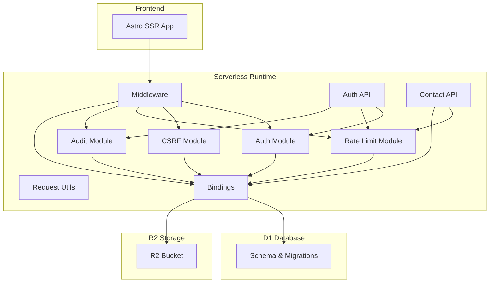
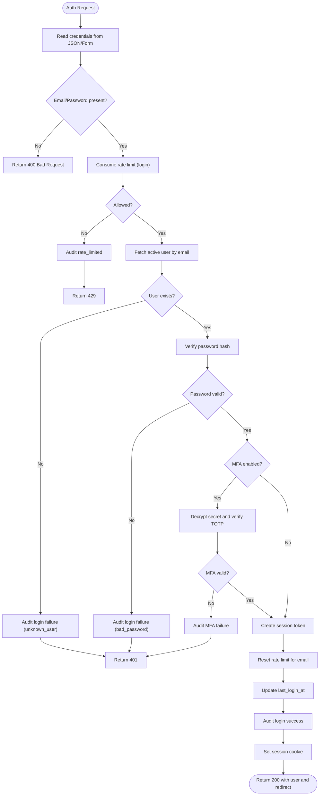
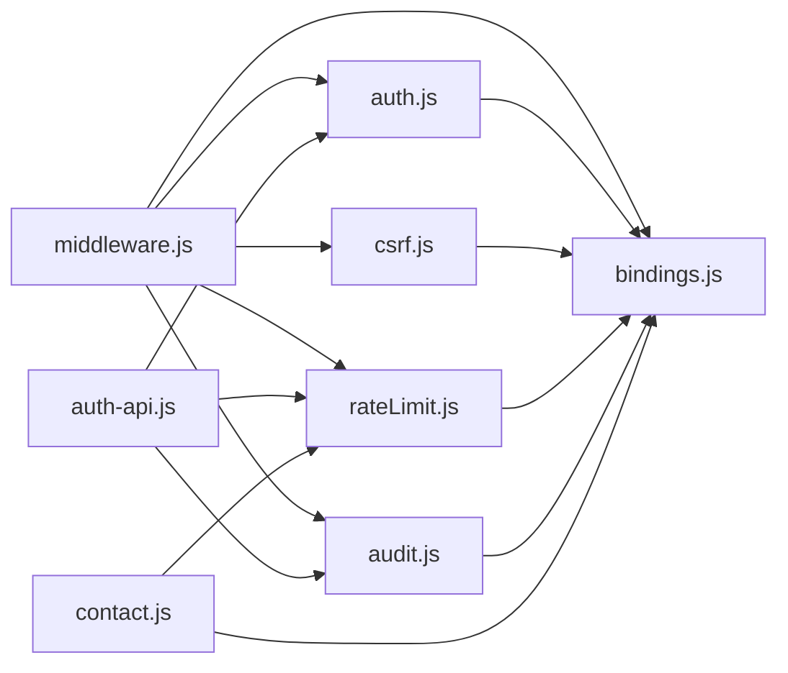

# Troubleshooting & FAQ

<cite>
**Referenced Files in This Document**
- [middleware.js](file://src/middleware.js)
- [auth.js](file://src/lib/server/auth.js)
- [csrf.js](file://src/lib/server/csrf.js)
- [rateLimit.js](file://src/lib/server/rateLimit.js)
- [audit.js](file://src/lib/server/audit.js)
- [request.js](file://src/lib/server/request.js)
- [bindings.js](file://src/lib/server/bindings.js)
- [contact.js](file://src/pages/api/contact.js)
- [auth-api.js](file://src/pages/portal/api/auth.js)
- [schema.sql](file://schema.sql)
- [portal-monitor.ps1](file://scripts/portal-monitor.ps1)
- [portal-backup.ps1](file://scripts/portal-backup.ps1)
- [ERROR_TELEMETRY_POLICY.md](file://docs/roadmap/ERROR_TELEMETRY_POLICY.md)
- [DEPLOYMENT_RUNBOOK.md](file://docs/roadmap/DEPLOYMENT_RUNBOOK.md)
</cite>

## Table of Contents
1. [Introduction](#introduction)
2. [Project Structure](#project-structure)
3. [Core Components](#core-components)
4. [Architecture Overview](#architecture-overview)
5. [Detailed Component Analysis](#detailed-component-analysis)
6. [Dependency Analysis](#dependency-analysis)
7. [Performance Considerations](#performance-considerations)
8. [Troubleshooting Guide](#troubleshooting-guide)
9. [FAQ](#faq)
10. [Conclusion](#conclusion)
11. [Appendices](#appendices)

## Introduction
This document provides comprehensive troubleshooting and FAQ guidance for the Kharon portal and public website hosted on Cloudflare Workers. It covers error handling patterns, logging strategies, diagnostics, rate limiting, audit trails, performance monitoring, deployment issues, authentication problems, and database connectivity challenges. It includes step-by-step procedures, diagnostic commands, escalation thresholds, and practical solutions for both development and production environments.

## Project Structure
The portal is an Astro SSR application deployed to Cloudflare Workers with a serverless backend. Key areas relevant to troubleshooting:
- Middleware enforces authentication, CSRF protection, rate limits, and security headers.
- Authentication and MFA modules manage sessions, tokens, and password hashing.
- Rate limiting and audit modules track security events and enforce limits.
- API handlers implement business logic with structured error responses.
- Monitoring and backup scripts automate health checks and data backups.
- Operational runbooks and telemetry policies define escalation and review processes.

**Diagram sources**
- [middleware.js:110-213](file://src/middleware.js#L110-L213)
- [auth.js:48-108](file://src/lib/server/auth.js#L48-L108)
- [csrf.js:36-65](file://src/lib/server/csrf.js#L36-L65)
- [rateLimit.js:3-46](file://src/lib/server/rateLimit.js#L3-L46)
- [audit.js:3-32](file://src/lib/server/audit.js#L3-L32)
- [bindings.js:3-26](file://src/lib/server/bindings.js#L3-L26)
- [contact.js:40-115](file://src/pages/api/contact.js#L40-L115)
- [auth-api.js:36-166](file://src/pages/portal/api/auth.js#L36-L166)
- [schema.sql:142-190](file://schema.sql#L142-L190)

**Section sources**
- [middleware.js:1-214](file://src/middleware.js#L1-L214)
- [DEPLOYMENT_RUNBOOK.md:1-342](file://docs/roadmap/DEPLOYMENT_RUNBOOK.md#L1-L342)

## Core Components
- Middleware orchestrates authentication, CSRF verification, rate limiting, and security headers for portal routes.
- Authentication module handles session creation, verification, token revocation, and password hashing.
- CSRF module generates and validates short-lived tokens bound to user sessions.
- Rate limiting module enforces sliding-window limits keyed by IP and subject.
- Audit module records security and operational events for forensics and monitoring.
- Request utilities derive stable fingerprints from IP and user agent.
- Bindings module centralizes D1/R2 access and validates environment bindings.
- API handlers implement robust error handling and structured responses.

**Section sources**
- [middleware.js:110-213](file://src/middleware.js#L110-L213)
- [auth.js:48-108](file://src/lib/server/auth.js#L48-L108)
- [csrf.js:36-65](file://src/lib/server/csrf.js#L36-L65)
- [rateLimit.js:3-46](file://src/lib/server/rateLimit.js#L3-L46)
- [audit.js:3-32](file://src/lib/server/audit.js#L3-L32)
- [request.js:26-35](file://src/lib/server/request.js#L26-L35)
- [bindings.js:3-26](file://src/lib/server/bindings.js#L3-L26)
- [contact.js:40-115](file://src/pages/api/contact.js#L40-L115)
- [auth-api.js:36-166](file://src/pages/portal/api/auth.js#L36-L166)

## Architecture Overview
The portal enforces authentication and security at the middleware level, with API endpoints performing targeted validations and rate limiting. Audit events capture security-relevant actions, while D1 stores audit trails and operational data. R2 provides storage for documents referenced by the portal.

```mermaid
sequenceDiagram
participant Client as "Browser"
participant MW as "Middleware"
participant CSRF as "CSRF Module"
participant RL as "Rate Limit Module"
participant Auth as "Auth Module"
participant DB as "D1 Database"
Client->>MW : "Request to /portal/*"
MW->>Auth : "Verify session token"
Auth-->>MW : "User info or null"
alt "No token or invalid/expired"
MW-->>Client : "302 to /portal/login"
else "Valid session"
MW->>CSRF : "Verify CSRF token"
CSRF-->>MW : "Valid or not"
alt "CSRF invalid"
MW->>DB : "Audit security.csrf blocked"
MW-->>Client : "403 with CSRF error"
else "CSRF valid"
MW->>RL : "Consume rate limit for endpoint"
RL->>DB : "Insert/update sliding window"
RL-->>MW : "Allowed or blocked"
alt "Blocked"
MW->>DB : "Audit security.rate_limit blocked"
MW-->>Client : "429 Too Many Requests"
else "Allowed"
MW-->>Client : "Next handler"
end
end
end
```

**Diagram sources**
- [middleware.js:154-184](file://src/middleware.js#L154-L184)
- [csrf.js:67-70](file://src/lib/server/csrf.js#L67-L70)
- [rateLimit.js:3-46](file://src/lib/server/rateLimit.js#L3-L46)
- [audit.js:3-32](file://src/lib/server/audit.js#L3-L32)

**Section sources**
- [middleware.js:110-213](file://src/middleware.js#L110-L213)

## Detailed Component Analysis

### Authentication and Session Management
Common issues:
- Missing or invalid session cookies.
- Expired or revoked tokens.
- Incorrect environment secrets for signing and encryption.
- MFA enforcement mismatches.

Resolution steps:
- Verify SESSION_SECRET and related secrets are configured and at least 32 characters.
- Ensure cookie SameSite and Secure flags match environment (local vs production).
- Confirm token expiration and revocation logic via revoked sessions table.
- Check MFA secret encryption/decryption and TOTP verification window.

**Diagram sources**
- [auth-api.js:36-166](file://src/pages/portal/api/auth.js#L36-L166)
- [auth.js:48-108](file://src/lib/server/auth.js#L48-L108)
- [rateLimit.js:3-46](file://src/lib/server/rateLimit.js#L3-L46)
- [audit.js:3-32](file://src/lib/server/audit.js#L3-L32)

**Section sources**
- [auth.js:34-108](file://src/lib/server/auth.js#L34-L108)
- [auth-api.js:36-166](file://src/pages/portal/api/auth.js#L36-L166)

### CSRF Protection
Common issues:
- Missing or expired CSRF token.
- Token mismatch for the current user.
- Cookie not set or incorrect SameSite/Secure attributes.

Resolution steps:
- Ensure CSRF cookie is set on valid requests and cleared on logout.
- Verify x-csrf-token header matches the stored token for the user.
- Confirm CSRF_SECRET or SESSION_SECRET is configured.

**Section sources**
- [csrf.js:36-70](file://src/lib/server/csrf.js#L36-L70)
- [middleware.js:146-151](file://src/middleware.js#L146-L151)

### Rate Limiting
Mechanisms:
- Sliding window per scope and subject (IP or user/email).
- Configurable maxAttempts and windowSeconds per endpoint.
- Returns Retry-After and blocks with 429.

Common issues:
- Excessive writes to admin endpoints.
- Misconfigured scopes or subjects.
- Unexpected blocks during legitimate bursts.

Resolution steps:
- Adjust maxAttempts and windowSeconds in middleware rateLimitConfig for the endpoint.
- Inspect audit_events for security.rate_limit entries.
- Reset rate limit programmatically when appropriate.

**Section sources**
- [rateLimit.js:3-46](file://src/lib/server/rateLimit.js#L3-L46)
- [middleware.js:88-108](file://src/middleware.js#L88-L108)
- [contact.js:76-94](file://src/pages/api/contact.js#L76-L94)

### Audit Trail and Logging
Events captured:
- Authentication attempts (success/failure).
- CSRF blocks.
- Rate limit blocks.
- Document access outcomes.

Logging strategy:
- Structured auditEvent writes with fingerprinting and metadata.
- Console error logging for unhandled exceptions.
- Cloudflare Worker logs and analytics for 5xx/503 and D1/R2 errors.

Operational checks:
- Weekly and monthly review checklists.
- Escalation thresholds for admin accounts, CSRF blocks, and storage errors.

**Section sources**
- [audit.js:3-32](file://src/lib/server/audit.js#L3-L32)
- [ERROR_TELEMETRY_POLICY.md:1-153](file://docs/roadmap/ERROR_TELEMETRY_POLICY.md#L1-L153)

### Database Connectivity and Bindings
Common issues:
- Missing D1 or R2 bindings.
- Incorrect binding names or environment configuration.
- Migration inconsistencies.

Resolution steps:
- Verify DB and STORAGE bindings exist and are named correctly.
- Apply schema and migrations using Wrangler commands.
- Confirm indexes and triggers are present post-migration.

**Section sources**
- [bindings.js:3-26](file://src/lib/server/bindings.js#L3-L26)
- [schema.sql:142-190](file://schema.sql#L142-L190)
- [DEPLOYMENT_RUNBOOK.md:231-247](file://docs/roadmap/DEPLOYMENT_RUNBOOK.md#L231-L247)

### Public Contact Form
Common issues:
- Invalid JSON or form data.
- Rate limit exceeded.
- D1 write failures.

Resolution steps:
- Validate request body and content type.
- Check rate limit scope “public.contact” and retry-after.
- Inspect console error logs and return 500 guidance.

**Section sources**
- [contact.js:40-115](file://src/pages/api/contact.js#L40-L115)

## Dependency Analysis
The middleware depends on authentication, CSRF, rate limiting, and audit modules. API endpoints depend on bindings and rate limiting. D1 schema defines audit and operational tables. R2 provides storage for documents.

**Diagram sources**
- [middleware.js:1-214](file://src/middleware.js#L1-L214)
- [auth.js:1-217](file://src/lib/server/auth.js#L1-L217)
- [csrf.js:1-107](file://src/lib/server/csrf.js#L1-L107)
- [rateLimit.js:1-56](file://src/lib/server/rateLimit.js#L1-L56)
- [audit.js:1-33](file://src/lib/server/audit.js#L1-L33)
- [bindings.js:1-42](file://src/lib/server/bindings.js#L1-L42)
- [auth-api.js:1-171](file://src/pages/portal/api/auth.js#L1-L171)
- [contact.js:1-116](file://src/pages/api/contact.js#L1-L116)

**Section sources**
- [middleware.js:1-214](file://src/middleware.js#L1-L214)
- [auth-api.js:1-171](file://src/pages/portal/api/auth.js#L1-L171)
- [contact.js:1-116](file://src/pages/api/contact.js#L1-L116)

## Performance Considerations
- Middleware overhead: Ensure fingerprinting and database reads are efficient; consider caching non-sensitive data where safe.
- Rate limit windows: Tune maxAttempts and windowSeconds to balance abuse prevention and legitimate traffic.
- Audit volume: Indexes on audit_events and document_access_logs support fast queries for forensics.
- Storage latency: R2 operations should be minimized; batch writes when possible.

[No sources needed since this section provides general guidance]

## Troubleshooting Guide

### Step-by-Step: Authentication Failures
1. Verify environment secrets:
   - SESSION_SECRET and CSRF_SECRET/MFA_SECRET must be at least 32 characters.
2. Check session cookie:
   - Confirm kharon_session_token is set with correct SameSite and Secure flags.
3. Validate token:
   - Ensure token not expired and not revoked in revoked_sessions.
4. Review audit:
   - Query audit_events for auth.login failures grouped by IP or user.
5. Escalate:
   - For admin/finance accounts from unknown IPs, disable account and issue reset.

**Section sources**
- [auth.js:34-40](file://src/lib/server/auth.js#L34-L40)
- [csrf.js:24-29](file://src/lib/server/csrf.js#L24-L29)
- [audit.js:3-32](file://src/lib/server/audit.js#L3-L32)
- [ERROR_TELEMETRY_POLICY.md:13-24](file://docs/roadmap/ERROR_TELEMETRY_POLICY.md#L13-L24)

### Step-by-Step: CSRF Blocks
1. Confirm CSRF cookie is present and valid.
2. Ensure x-csrf-token header matches the stored token for the user.
3. Check for session fixation attempts or automated tools.
4. Review audit_events for security.csrf blocks.
5. If legitimate users are blocked, investigate session lifetime and cookie behavior.

**Section sources**
- [csrf.js:49-70](file://src/lib/server/csrf.js#L49-L70)
- [middleware.js:154-164](file://src/middleware.js#L154-L164)
- [ERROR_TELEMETRY_POLICY.md:36-43](file://docs/roadmap/ERROR_TELEMETRY_POLICY.md#L36-L43)

### Step-by-Step: Rate Limit Blocks
1. Identify endpoint and scope:
   - Use middleware rateLimitConfig to see configured limits.
2. Check retry-after and attempts:
   - Parse 429 response headers and audit metadata.
3. Inspect audit trail:
   - Query audit_events for security.rate_limit entries.
4. Adjust limits:
   - Modify maxAttempts/windowSeconds in middleware for the endpoint.
5. Reset rate limit:
   - Use resetRateLimit when appropriate.

**Section sources**
- [middleware.js:88-108](file://src/middleware.js#L88-L108)
- [rateLimit.js:3-46](file://src/lib/server/rateLimit.js#L3-L46)
- [ERROR_TELEMETRY_POLICY.md:26-34](file://docs/roadmap/ERROR_TELEMETRY_POLICY.md#L26-L34)

### Step-by-Step: Database Connectivity Issues
1. Verify bindings:
   - Confirm DB and STORAGE bindings are configured and named correctly.
2. Test connectivity:
   - Use Wrangler D1 execute to query users table.
3. Apply schema/migrations:
   - Apply schema.sql and pending migrations in order.
4. Check indexes and triggers:
   - Ensure audit and rate limit indexes exist.

**Section sources**
- [bindings.js:3-26](file://src/lib/server/bindings.js#L3-L26)
- [DEPLOYMENT_RUNBOOK.md:192-221](file://docs/roadmap/DEPLOYMENT_RUNBOOK.md#L192-L221)
- [schema.sql:142-190](file://schema.sql#L142-L190)

### Step-by-Step: Public Contact Form Failures
1. Validate request:
   - Ensure JSON body and allowed request types.
2. Check rate limit:
   - Confirm scope “public.contact” and retry-after.
3. Inspect D1 write:
   - Query contact_submissions and audit logs.
4. Handle errors:
   - Return 500 with guidance to contact admin.

**Section sources**
- [contact.js:40-115](file://src/pages/api/contact.js#L40-L115)

### Step-by-Step: Monitoring and Health Checks
1. Run portal monitor:
   - Execute portal-monitor.ps1 to validate HTTP status, redirects, headers, and D1/R2 availability.
2. Interpret results:
   - Review JSON output and exit code for failures.
3. Remediate:
   - Fix misconfigurations or infrastructure issues indicated by checks.

**Section sources**
- [portal-monitor.ps1:108-129](file://scripts/portal-monitor.ps1#L108-L129)

### Step-by-Step: Backup and Recovery
1. Export D1 database:
   - Use portal-backup.ps1 to export SQL and collect R2 bucket info.
2. Store securely:
   - Keep manifests and exports in a secure location.
3. Restore:
   - Import D1 SQL and verify R2 bucket presence and permissions.

**Section sources**
- [portal-backup.ps1:14-31](file://scripts/portal-backup.ps1#L14-L31)

### Step-by-Step: Deployment Validation
1. Pre-deploy gate:
   - Build, audit, and verify routes and redirects.
2. Deploy preview and validate:
   - Check security headers and portal redirects.
3. Attach domains and promote:
   - Add custom domains and verify login and dashboard redirects.
4. Post-deploy checks:
   - Confirm canonical domains, redirects, and sitemap/robots.

**Section sources**
- [DEPLOYMENT_RUNBOOK.md:38-112](file://docs/roadmap/DEPLOYMENT_RUNBOOK.md#L38-L112)

### Diagnostics and Queries
- View recent auth failures:
  - Query audit_events for event_type containing “auth.login” and outcome “failure”.
- View rate limit blocks:
  - Filter audit_events for event_type “security.rate_limit” and created_at within the last day.
- View CSRF blocks:
  - Filter audit_events for event_type “security.csrf”.
- View document access failures:
  - Query document_access_logs for outcome “failure” or “blocked”.
- Check portal rate limits:
  - Query portal_rate_limits for scope and max attempts.

**Section sources**
- [ERROR_TELEMETRY_POLICY.md:83-98](file://docs/roadmap/ERROR_TELEMETRY_POLICY.md#L83-L98)

### Escalation Procedures
- Admin or finance account login from an unrecognized IP:
  - Disable account, issue reset link, notify director.
- Finance endpoint CSRF block:
  - Audit session, review recent finance records, rotate session.
- 10+ login failures in 15 minutes:
  - Temporarily lock account, notify user out-of-band.
- R2 evidence or jobcard get returning 503:
  - Check Cloudflare status, verify STORAGE binding, contact support if binding healthy.

**Section sources**
- [ERROR_TELEMETRY_POLICY.md:133-144](file://docs/roadmap/ERROR_TELEMETRY_POLICY.md#L133-L144)

## FAQ

Q: Why am I redirected to /portal/login?
A: You either lack a valid session cookie, the token is invalid/expired, or the session was revoked. Clear cookies and log in again.

Q: Why do I get a 403 CSRF error?
A: The CSRF token is missing, invalid, or does not match your session. Ensure the CSRF cookie is set and the x-csrf-token header is included.

Q: Why do I get 429 Too Many Requests?
A: You have exceeded the rate limit for the endpoint. Wait for the Retry-After duration and try again.

Q: How do I reset my rate limit?
A: Use the resetRateLimit function for the relevant scope and subject.

Q: Why is my login failing but the password is correct?
A: Check for MFA requirement/enforcement and verify MFA secret decryption and TOTP code.

Q: How do I verify D1 connectivity?
A: Use Wrangler D1 execute to run a simple SELECT on the users table.

Q: How do I validate security headers?
A: Use portal-monitor.ps1 or inspect response headers for CSP, X-Content-Type-Options, X-Frame-Options, Referrer-Policy, Permissions-Policy, COOP/COEP, Cross-Origin-Resource-Policy, and HSTS.

Q: How do I back up the database?
A: Run portal-backup.ps1 to export D1 SQL and capture R2 bucket info.

Q: How often should I review logs?
A: Follow weekly and monthly review checklists in the error telemetry policy.

Q: What should I check after a production deploy?
A: Validate canonical domains, redirects, security headers, portal login and dashboard redirects, and sitemap/robots.

**Section sources**
- [middleware.js:125-142](file://src/middleware.js#L125-L142)
- [csrf.js:67-70](file://src/lib/server/csrf.js#L67-L70)
- [rateLimit.js:3-46](file://src/lib/server/rateLimit.js#L3-L46)
- [auth.js:125-136](file://src/lib/server/auth.js#L125-L136)
- [bindings.js:3-26](file://src/lib/server/bindings.js#L3-L26)
- [portal-monitor.ps1:108-129](file://scripts/portal-monitor.ps1#L108-L129)
- [portal-backup.ps1:14-31](file://scripts/portal-backup.ps1#L14-L31)
- [ERROR_TELEMETRY_POLICY.md:102-130](file://docs/roadmap/ERROR_TELEMETRY_POLICY.md#L102-L130)
- [DEPLOYMENT_RUNBOOK.md:303-313](file://docs/roadmap/DEPLOYMENT_RUNBOOK.md#L303-L313)

## Conclusion
This guide consolidates operational practices for the Kharon portal, covering middleware enforcement, authentication, CSRF, rate limiting, auditing, database connectivity, monitoring, and backups. Use the step-by-step procedures, diagnostic commands, and escalation thresholds to maintain reliability and security across development and production environments.

[No sources needed since this section summarizes without analyzing specific files]

## Appendices

### Appendix A: Diagnostic Commands
- Monitor portal health:
  - Run portal-monitor.ps1 and review JSON output.
- Query audit events:
  - Use Wrangler D1 execute to query audit_events and document_access_logs.
- Backup database and storage:
  - Run portal-backup.ps1 and store artifacts securely.

**Section sources**
- [portal-monitor.ps1:108-129](file://scripts/portal-monitor.ps1#L108-L129)
- [ERROR_TELEMETRY_POLICY.md:83-98](file://docs/roadmap/ERROR_TELEMETRY_POLICY.md#L83-L98)
- [portal-backup.ps1:14-31](file://scripts/portal-backup.ps1#L14-L31)