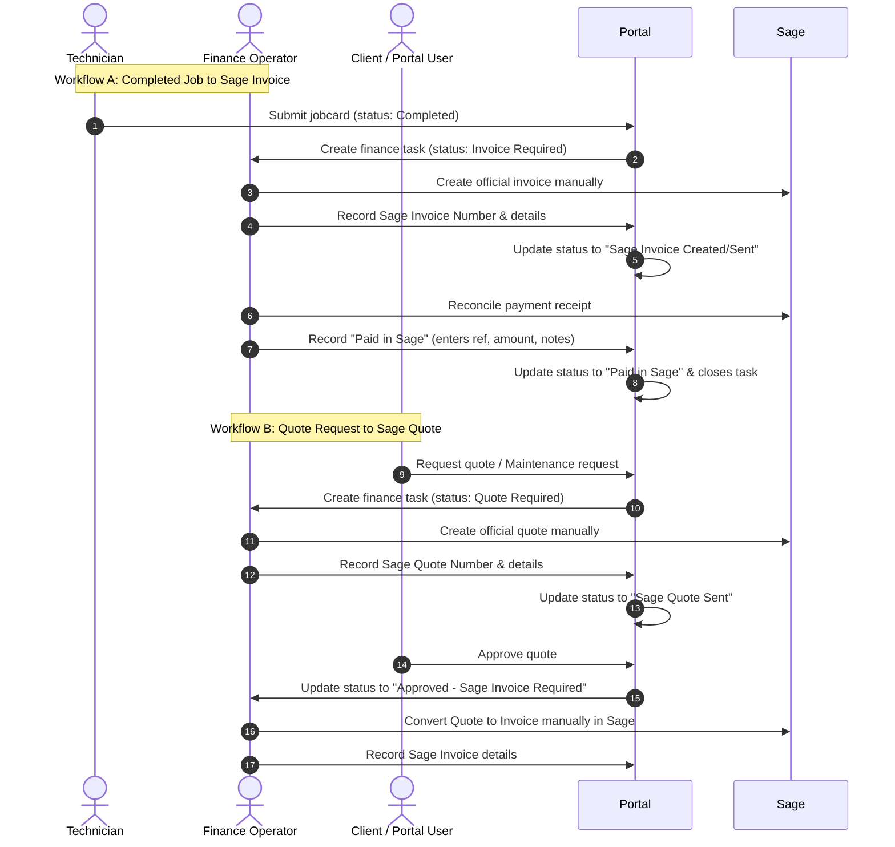

<!--
 * Project Sentinel - Production Audit
 * Purpose: Production readiness audit and Sage finance alignment report for KharonOps portal
 * Dependencies: docs/roadmap/MASTER_ROADMAP.md, docs/qa/PORTAL_ROLE_QA_CHECKLIST.md
 * Structural Role: Operational compliance and deployment authorization documentation
 -->

# KharonOps Portal: Production Readiness Audit Report

This report outlines the security posture, operational alignment, and data integrity checks completed on the KharonOps portal staging instance in preparation for the final cutover to `kharon.co.za`.

---

## 1. Executive Summary & Production Authorization Status

Staging validation has been executed using automated regression harnesses, site build analyzers, and direct remote database/storage integrity checks. The codebase is highly hardened and stable.

> [!IMPORTANT]
> The codebase is fully staging-hardened and passes all automated checks. However, final cutover to the production domains (`www.kharon.co.za` and `portal.kharon.co.za`) remains **GATED** by the manual administrative tasks detailed in Section 6.

### System Verification Metrics
* **Astro SSR Staging Build:** `PASS`
* **Static Assets & JS Bundles Check:** `PASS` (No client-side app JS is emitted; CSS budget is within limits)
* **Security Headers Auditing (`validate:site`):** `PASS` (CSRF headers and security frame policies are active)
* **D1/R2 Infrastructure Bindings (`portal:monitor`):** `PASS` (Remote connectivity to Cloudflare D1 `kharon-portal` and R2 `kharon-portal-storage` verified)

---

## 2. Infrastructure & Data Integrity Audit

A live operational health probe was run against the Cloudflare staging databases. Results are documented below.

### Database & Storage Binding Status

| Resource | Binding Name | Status | Details / Current Inventory |
|---|---|---|---|
| **Cloudflare D1** | `DB` (kharon-portal) | **ONLINE** | 5 active users seeded; transaction tables and audit indexes populated. |
| **Cloudflare R2** | `BUCKET` (kharon-portal-storage) | **ONLINE** | 1 active test object; read/write permissions validated. |

---

## 3. Financial Workflow Alignment: Sage Manual Control Register

The portal's financial operations have been successfully reframed as an operational tracking queue rather than an authoritative ledger. 

### Conceptual Model Shift



### Terminology Alignment Checks

We audited the finance dashboard (`src/pages/portal/finance/dashboard.astro`) and backend APIs to ensure zero conflict with the Sage accounting ledger:
1. **Invoice State Tracking:** The button labeled `Mark settled` has been renamed to **`Record Paid in Sage`**.
2. **References:** All portal ledger rows accept an optional **Sage payment reference** and **Sage invoice reference** to match Sage accounts.
3. **Guardrails:** Recording payments requires explicit double-confirmation (`This action cannot be undone.`) to prevent double-entry errors.

---

## 4. Hardened Security & Portal Redirection Flow

The portal employs several runtime safeguards in its middleware and auth API handlers:

```
+-------------------------------------------------------------+
|                HTTP Request to /portal/...                  |
+-------------------------------------------------------------+
                               |
                               v
               [ Path Traversal Check (..) ]  -----> Block (400)
                               |
                               v
           [ Session Token Signature Verification ] ----> Redirect (302) to /login
                               |
                               v
            [ Session Revocation (Fingerprint) ] ----> Clear Cookie & Redirect (302)
                               |
                               v
           [ State-Changing POST / CSRF Validate ] ----> Block (403)
                               |
                               v
           [ State-Changing Rate Limiting Check ] ----> Block (429)
                               |
                               v
            [ Check forcePasswordChange Flag ] ----> Redirect (302) to /account/password
                               |
                               v
            [ Check mfaRequired & !mfaEnabled ] ----> Redirect (302) to /account/mfa
                               |
                               v
                      [ Route to Page ]
```

### Key Security Implementations Verified
* **Path Traversal Protection:** Checked using `decodeURIComponent` split checks; invalid paths return HTTP 404/400.
* **Token Revocation (Phase 10):** Single-use session hashes are checked against `revoked_sessions` on every request.
* **CSRF Token Guard:** Custom signed HMAC tokens are checked for all POST/PUT/PATCH/DELETE API requests.
* **MFA Redirection:** Accounts flagged with `mfa_required` are blocked from executing dashboard actions until they register an authenticator app.
* **CSV Formula Sanitization:** Sanitizes cell prefixes on data tables export to prevent Excel/CSV macro injection attacks.

---

## 5. Staging QA Checklists (Manual Scenarios)

The following manual QA checks should be run by the operations team using external credentials:

````carousel
### 1. Authentication & Session Rotation
* Verify that changing password redirects user to dashboard and resets `force_password_change` flag in D1.
* Verify that logouts register the session fingerprint in D1, preventing back-button/replay access.
* Verify that disabled users cannot login under any circumstances.
<!-- slide -->
### 2. Multi-Factor Authentication (MFA)
* Admin enforces MFA requirement for user.
* User logs in and is forced to `/portal/account/mfa`.
* QR code is scanned; valid 6-digit TOTP code registers key.
* Submitting invalid TOTP returns clear feedback.
* Login requires MFA code from that point forward.
<!-- slide -->
### 3. Role-Based Access (RBAC)
* Admin user accesses `/portal/admin/dashboard` (Succeeds).
* Client user attempts `/portal/admin/dashboard` (Redirects to client dashboard).
* Technician attempts `/portal/finance/dashboard` (Redirects to tech dashboard).
* Verify client user can only see site systems and dispatches assigned to their registered site.
<!-- slide -->
### 4. Document Access & Tracking
* Technician downloads jobcard PDF (Outcome recorded in `document_access_logs`).
* Unauthenticated client attempts direct link download (Access denied, no log row).
* Authenticated client tries downloading a jobcard for a different client site (Access blocked, auditable warning logged).
````

---

## 6. Production Cutover Checklist

To execute the final cutover to `kharon.co.za`, complete the following steps:

- [ ] **MFA Policies:** Confirm Admin and Finance MFA enforcement values are set to `1` in D1 before importing operational files.
- [ ] **Log Review:** Implement weekly manual checks of D1 `audit_events` and `document_access_logs` tables as per `ERROR_TELEMETRY_POLICY.md`.
- [ ] **Credential Rotation:**
  - Update all passwords seeded via `seed-users.sql`.
  - Issue unique, high-entropy secrets for `SESSION_SECRET` (at least 32 characters) on the Cloudflare production environment.
- [ ] **DNS Switchover:** Configure apex redirects in Cloudflare Rulesets (`kharon.co.za/*` -> `https://www.kharon.co.za/$1`) and map CNAMEs for `portal.kharon.co.za`.
- [ ] **POPIA Compliance:** Ensure chosen analytics snippet is POPIA-compliant and loaded only on the public pages, never on `/portal/*` paths.
